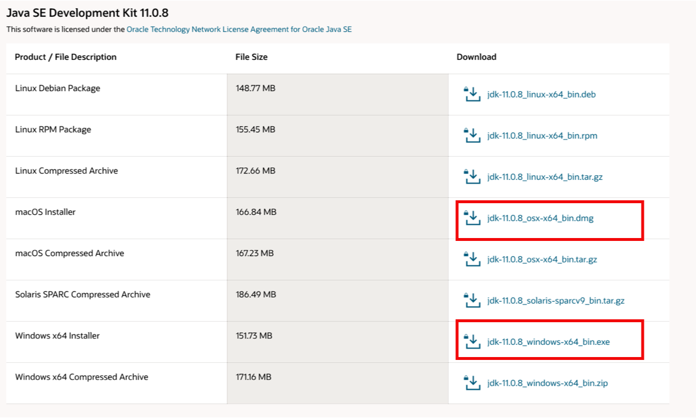

# Welcome 

Welcome to Pathways and Network Analysis of -Omics Data 2020. 

## Class Materials 

You can download the printed course manual [here](https://drive.google.com/a/bioinformatics.ca/file/d/1HcPuiYUJe69w3_0aNpAfhk7DipcacA6r/view?usp=sharing).  

## Workshop Schedule {#schedule}

| | **Day 1** | | **Day 2** | | **Day 3** |
| :---: | :---: | :---: | :---: | :---: | :---: |
| | **Monday July, 27** | | **Tuesday, July 28** | | **Wednesday, July 29** |
| 10:00 | Welcome | 10:00 | Module 4: More Depth on Network and Pathway Analysis (Robin Haw) | 10:00 | Review of the tools in an integrated workflow. Part1 (Veronique Voisin/Ruth Isserlin) |
| 10:30 | Short Introduction to the Pathway and Network workshop (Gary Bader) | | | | | 
| 11:00 | *Coffee Break* | 11:00 | *Coffee Break* | 11:00 | *Coffee Break* |
| 11:30 | Module 2: Finding Over-Represented Pathways (Veronique Voisin) | 11:30 | Module 4 Lab (Robin) | 11:30 |  Review of the tools in an integrated workflow. Part2 (Veronique Voisin/Ruth Isserlin) |
| 1:30 | *Lunch* | 1:30 | *Lunch* | 1:30 | **Survey and Closing Remarks** |
| 2:30 | Module 3: Network Visualtization and Analysis with Cytoscape (Ruth Isserlin) | 2:00 | Module 5: Regulatory Network Analysis(Michael Hoffman) |  |  |
| |  | 3:00 | Module 5 lab(Veronique Voisin) |  |  |
| 3:30 | *Coffee Break* | 4:00 | *Coffee Break* | | |
| 4:00 | Module 3 lab (Ruth Isserlin) | 4:30 | Module 6 Gene Function Prediction (Veronique Voisin) + Genemania lab |
| 6:00 | *End of Day* | 5:00 | *End of Day* | | |

## Pre-Workshop Materials and Laptop Setup Instructions {#pre-workshop}

### Laptop Setup Instructions

A Check list to setup your laptop can be found [here](https://forms.gle/xB95kB8JAKKrDejM8)

Install these tools on your laptop before coming to the workshop:

### Basic programs

  1. A robust text editor:
    * For Windows/PC - [notepad++](http://notepad-plus-plus.org/)  
    * For Linux - [gEdit](http://projects.gnome.org/gedit/)  
    * For Mac – [TextWrangler](http://www.barebones.com/products/textwrangler/download.html)
  
  1. A file decompression tool.
    * For Windows/PC – [7zip](http://www.7-zip.org/).  
    * For Linux – [gzip](http://www.gzip.org).   
    * For Mac – already there.
  
  1. A robust internet browser such as:
    * Firefox 
    * Safari
    * Chrome
  
  1. A PDF Viewer
    * Adobe Acrobat or equivalent

### Java 11 Installation
We will be using Cytoscape and GSEA both of which require Java 11.  Before proceeding, check to see if you already have Java 11 installed: 

  * Go to https://www.java.com/verify/  - **OR** 
  * Open a terminal window and run the following command: java -version

If you do not have Java installed or you have an older version of Java installed please proceed with the following steps:

  1. Download and install Java 11:
    * Go to https://www.oracle.com/java/technologies/javase-jdk11-downloads.html
    * create a free Oracle account - Top right hand corner --> View Accounts --> Create Account
    * Download the java installer that corresponds to your platform (MAC, Windows or Linux)
    * 
    * Open the installer and follow the steps
    * An "Install Succeeded" should appear at the end of the installer dialog box
    * You can check that you correctly installed java by typing java -version in terminal window
    * 

### Cytoscape Installation
Please install the latest version of [Cytoscape 3.8.0](https://cytoscape.org/download-platforms.html) as well as a group of Cytoscape Apps that we will be using for different parts of the course.  

  1. Install Cytoscape 3.8.0:
    * Go to: https://cytoscape.org/download-platforms.html
    * Choose the version corresponding to your operating system (OS, Windows or UNIX)
    * Follow instructions to install cytoscape
    * Verify that Cytoscape has been installed correctly by launching the newly installed application
    * Contact your system administrator if you have trouble with Java installation

  1. WInstall the following Cytoscape Apps - Apps are installed from within Cytoscape. In order to install Apps launch Cytoscape  
    * 
    * From the menu bar, select ‘Apps’, then ‘App Manager’.
    * Within 'all apps', search for the following and install:  
      * EnrichmentMap 3.3.0
      * EnrichmentMap Pipeline Collection 1.0.0 (it will install ClusterMaker2, WordCloud and AutoAnnotate)
      * GeneMANIA 3.5.2
      * IRegulon  1.3
      * ReactomeFIPlugin 7.2.3 - http://apps.cytoscape.org/apps/reactomefiplugin  
      * stringApp 1.5.1
      * yFiles Layout Algorithms	1.1
    
  1. Install the data set within GeneMANIA app. **This requires time and a good network connection to download completely (~15mins)**
    * From the menu bar, select ‘Apps’, hover over ‘GeneMANIA’, then select ‘Choose Another Data Set’.
    * From the list of available data sets, select the most recent and under ‘Include only these networks:’ select ‘all’. Click on ‘Download’.
    * An ‘Install Data’ window will pop-up. Select H.Sapiens Human (2589 MB). Click on ‘Install’.
  
### GSEA Installation  
Please install the latest version of GSEA (4.0.3)  

  1. Download GSEA
    * Go to the [GSEA page](http://www.broadinstitute.org/gsea/index.jsp)    
    * Register (using an institutional email address) 
    * Login 
    * Locate the Download page and download the version corresponding to your system
      * MAC users:  download GSEA_4.0.3.app.zip
      * Window users: download GSEA_Win_4.0.3-installer.exe
      * Unix users: download GSEA_Linux_4.0.3.zip
      * 
    * Launch GSEA to test it.
  
  1. Download GSEA for command line :  this is necessary for all platform users to run GSEA from a script (integrated workflow on day 3)
    * Download  GSEA_4.0.3.zip (and keep it for later use during the workshop)
    * 

## Pre-workshop Tutorials

It is in your best interest to complete these before the workshop.

### Cytoscape Preparation tutorials
Go to : https://github.com/cytoscape/cytoscape-tutorials/wiki and follow :

  * [Tour of Cytoscape](https://cytoscape.org/cytoscape-tutorials/protocols/tour-of-cytoscape/#/)
  * [Basic Data Visualization](https://cytoscape.org/cytoscape-tutorials/protocols/basic-data-visualization/#/)
  
### Pre-workshop Readings and Lectures

  1. Video Module 1 - [Introduction to Pathway and Network Analysis by Gary Bader](#intro)
  1. video Module 5 - [Gene Function Prediction (GeneMania by Quaid Morris](#intro-regulatory-networks)
  1. ***Pathway enrichment analysis and visualization of omics data using g:Profiler, GSEA, Cytoscape and EnrichmentMap*** Reimand J, Isserlin R, Voisin V, Kucera M, Tannus-Lopes C, Rostamianfar A, Wadi L, Meyer M, Wong J, Xu C, Merico D, Bader GD [Nat Protoc. 2019 Feb;14(2):482-517](https://www.nature.com/articles/s41596-018-0103-9) - [Available here as well](http://baderlab.org/Publications#EM_2019)
 
***

### Additional tutorials 

  * ***iRegulon: from a gene list to a gene regulatory network using large motif and track collections*** Janky R, Verfaillie A, Imrichová H, Van de Sande B, Standaert L, Christiaens V, Hulselmans G, Herten K, Naval Sanchez M, Potier D, Svetlichnyy D, Kalender Atak Z, Fiers M, Marine JC, Aerts S [PLoS Comput Biol. 2014 Jul 24;10(7)](https://journals.plos.org/ploscompbiol/article?id=10.1371/journal.pcbi.1003731) 

  * ***The GeneMANIA prediction server: biological network integration for gene prioritization and predicting gene function*** Warde-Farley D, Donaldson SL, Comes O, Zuberi K, Badrawi R, Chao P, Franz M, Grouios C, Kazi F, Lopes CT, Maitland A, Mostafavi S, Montojo J, Shao Q, Wright G, Bader GD, Morris Q [Nucleic Acids Res 2010 Jul 1;38 Suppl:W214-20](https://academic.oup.com/nar/article/38/suppl_2/W214/1126704) - [Available here as well](http://baderlab.org/Publications#GeneMANIA_original)
  
  * ***GeneMANIA update 2018*** Franz M, Rodriguez H, Lopes C, Zuberi K, Montojo J, Bader GD, Morris Q [Nucleic Acids Res. 2018 Jun 15](https://academic.oup.com/nar/article/46/W1/W60/5038280) - [Available here as well](http://baderlab.org/Publications#GeneMANIA_2018)
  
  * ***How to visually interpret biological data using networks*** Merico D, Gfeller D, Bader GD [Nature Biotechnology 2009 Oct 27, 921-924](https://www.nature.com/articles/nbt.1567)  - [Available here as well](http://baderlab.org/Publications#interpret_networks)
  
  * ***g:Profiler--a web-based toolset for functional profiling of gene lists from large-scale experiments.*** Reimand J, Kull M, Peterson H, Hansen J, Vilo J   [Nucleic Acids Res. 2007 Jul;35](https://www.ncbi.nlm.nih.gov/pmc/articles/PMC1933153/)
  
  * ***g:Profiler: a web server for functional enrichment analysis and conversions of gene lists (2019 update)*** Raudvere U, Kolberg L, Kuzmin I, Arak T, Adler P, Peterson H, Vilo J [Nucleic Acids Res. 2019 May 8](https://academic.oup.com/nar/advance-article/doi/10.1093/nar/gkz369/5486750)
  
  * ***Gene set enrichment analysis: a knowledge-based approach for interpreting genome-wide expression profiles*** Subramanian A, Tamayo P, Mootha VK, Mukherjee S, Ebert BL, Gillette MA, Paulovich A, Pomeroy SL, Golub TR, Lander ES, Mesirov JP [Proc Natl Acad Sci U S A. 2005 Oct 25;102(43)](https://www.ncbi.nlm.nih.gov/pmc/articles/PMC1239896/)
  
  * ***Expression data analysis with Reactome*** Jupe S, Fabregat A, Hermjakob H [Curr  Protoc Bioinformatics. 2015 Mar 9;49:8.20.1-9](https://www.ncbi.nlm.nih.gov/pmc/articles/PMC4407007/)
 
Interacting with Cytoscape using CyRest and command lines (for advanced users):
https://github.com/cytoscape/cytoscape-automation/blob/master/for-scripters/R/advanced-cancer-networks-and-data-rcy3.Rmd

