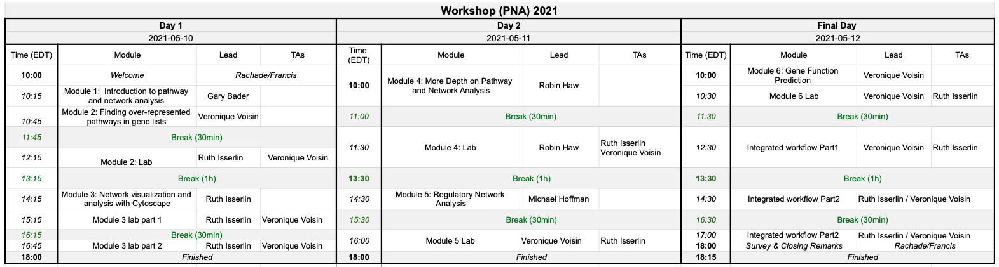
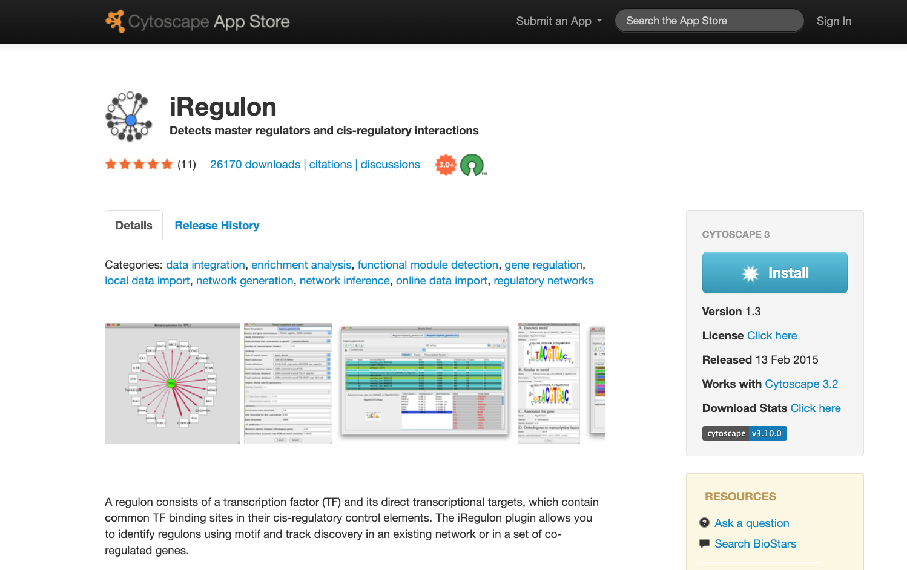
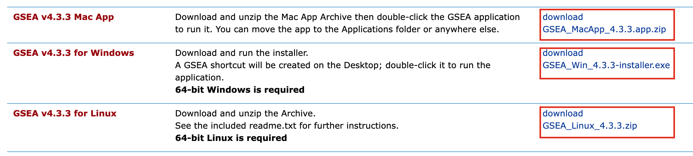

# Welcome 

Welcome to Pathways and Network Analysis of -Omics Data 2023  

## Meet your Faculty

### Gary Bader
Principal Investigator, University of Toronto 

Dr. Bader develops biological network analysis and pathway information resources. He created the Biomolecular Interation Network Database ( [BIND](http://bind.ca) ) while working on his PhD and currently helps lead development of the free Cytoscape network visualization and analysis software [Cytoscape](http://cytoscape.org/). 

### Lincoln Stein
Head, Adaptive Oncology, OICR

Dr. Stein played an integral role in many large-scale data initiatives including the development of the first physical clone map of the human genome, and running the data coordinating centre and the data portal for the SNP Consortium and the HapMap Consortium. Dr. Stein has also led the creation and development of Wormbase, a community model organism database for C. elegans, and Reactome, which is now the largest open community database of biological reactions and pathways. At OICR, Dr. Stein has led several international cancer data sharing and research initiatives, including the creation and development of the data coordination centre for the International Cancer Genome Consortium and other related projects. He continues to collaborate with national and international partners to create and promote data sharing standards, protocols and implementations.

### Veronique Voisin
Research Associate, Donnelly Centre for Cellular and Biomolecular Research, University of Toronto 

Veronique is currently a bioinformatician applying pathway and networks analysis to high throughput genomics data for OICR cancer stem cell program. Previously, she worked on characterizing the gene signatures of different types of leukemias using a murine model

&nbsp;
&nbsp;

### Ruth Isserlin
Research data analyst, Donnelly Centre for Cellular and Bimolecular Research, University of Toronto

Bioinformatician and data analyst in the Bader lab applying pathway and data analysis to varied data types. Developed Enrichment Map App for Cytoscape, an app to visually translate functional enrichment results from popular enrichment tools like GSEA to networks. Further developed the Enrichment Map Pipeline including development of additional Apps to help summarize and analyze resulting Enrichment Maps, including PostAnalysis, WordCloud, and AutoAnnotate App. 

### Chaitra Sarathy, PhD
Scientific Associate, Princess Margaret Cancer Centre, University Health Network

Chaitra is a computational biologist with experience in software development. During her PhD, she applied mathematical modelling, network analysis and multi-omics integration to study complex diseases. She has contributed to open-source toolboxes (openCOBRA) and developed softwares (EFMviz & ComMet) to analyse genome-scale metabolic models. She currently works in the Bader lab's MODiL team (Multi Omics Data Integration and Analysis) and with groups at PMCC, where she develops pipelines to analyse various omics data types and discover new drug targets in cancer.

### Michelle Brazas, PhD
Acting Scientific Director Canadian Bioinformatics Workshops (CBW), Toronto, ON, CA
support@bioinformatics.ca

Dr. Michelle Brazas is the Associate Director for Adaptive Oncology at the Ontario Institute for Cancer Research (OICR), and acting Scientific Director at Bioinformatics.ca. Previously, Dr. Brazas was the Program Manager for Bioinformatics.ca and a faculty member in Biotechnology at BCIT. Michelle co-founded and runs the Toronto Bioinformatics User Group (TorBUG) now in its 11th season, and plays an active role in the International Society of Computational Biology where she sits on the Board of Directors and Executive Board. 

***

Thank you for attending the Pathway and Network Analysis of Omics Data workshop! Help us make this workshop better by filling out [our survey](https://forms.gle/D8w8qyJ1r71rFnZe9).

*** 

## Class Materials 

TEST VERONQIUE

You can download the printed course manual [here](https://drive.google.com/a/bioinformatics.ca/file/d/1HcPuiYUJe69w3_0aNpAfhk7DipcacA6r/view?usp=sharing).  

## Workshop Schedule {#schedule}

## Pre-Workshop Materials and Laptop Setup Instructions {#pre-workshop}

### Laptop Setup Instructions

A Check list to setup your laptop can be found [here](https://forms.gle/vyFPcA1P9pqvTL2B9)

Install these tools on your laptop before coming to the workshop:

### Basic programs

  1. A robust text editor:
      * For Windows/PC - [notepad++](http://notepad-plus-plus.org/)  
      * For Linux - [gEdit](http://projects.gnome.org/gedit/)  
      * For Mac – [TextWrangler](http://www.barebones.com/products/textwrangler/download.html)
  
  1. A file decompression tool.
      * For Windows/PC – [7zip](http://www.7-zip.org/).  
      * For Linux – [gzip](http://www.gzip.org).   
      * For Mac – already there.
  
  1. A robust internet browser such as:
      * Firefox 
      * Safari
      * Chrome
      * Microsoft Edge
  
  1. A PDF Viewer
      * Adobe Acrobat or equivalent

### Cytoscape Installation
Please install the latest version of [Cytoscape 3.10.0](https://cytoscape.org/download-platforms.html) as well as a group of Cytoscape Apps that we will be using for different parts of the course.  

  1. Install Cytoscape 3.10.0:
      * Go to: https://cytoscape.org/download-platforms.html
      * Choose the version corresponding to your operating system (OS, Windows or UNIX)
      * Follow instructions to install cytoscape
      * Verify that Cytoscape has been installed correctly by launching the newly installed application
      
  1. Install the following Cytoscape Apps - Apps are installed from within Cytoscape. 
      * In order to install Apps launch Cytoscape  
      * From the menu bar, select ‘Apps’, then ‘App Store’, then 'Show App Store'. 
      * App Store will appear in left hand Panel 
      * Within search bar at the top of the panel, search for the app listed below.  Once you click on search icon a web browser will be launched with the apps that match your search.
      * Select the correct app (there might be a few that match your search term).
      * Click on "Install" 
      * install the following:  
          * EnrichmentMap 3.3.5
          * EnrichmentMap Pipeline Collection 1.1.0 (it will install ClusterMaker2 v2.3.4, WordCloud v3.1.4 and AutoAnnotate v1.4.0)
          * GeneMANIA 3.5.2
          * IRegulon  1.3
          * ReactomeFIPlugin 8.0.5 - http://apps.cytoscape.org/apps/reactomefiplugin 
          * stringApp 2.0.1
          * yFiles Layout Algorithms	1.1.3
    
  1. Install the data set within GeneMANIA app. **This requires time and a good network connection to download completely (~15mins)**
      * From the menu bar, select ‘Apps’, hover over ‘GeneMANIA’, then select ‘Choose Another Data Set’.
      * From the list of available data sets, select the most recent and under ‘Include only these networks:’ select ‘all’. Click on ‘Download’.
      * An ‘Install Data’ window will pop-up. Select H.Sapiens Human (2589 MB). Click on ‘Install’.
  
### GSEA Installation  
Please install the latest version of GSEA (4.3.2)  

  1. Download GSEA
      * Go to the [GSEA page](http://www.broadinstitute.org/gsea/index.jsp)    
      * Register (using an institutional email address) 
      * Login 
      * Locate the Download page and download the version corresponding to your system
          * MAC users:  download GSEA_4.3.2.app.zip
          * Window users: download GSEA_Win_4.3.2-installer.exe
          * Unix users: download GSEA_Linux_4.3.2.zip
          * 
      * Launch GSEA to test it.
  
  1. Download GSEA for command line :  this is necessary for all platform users to run GSEA from a script (integrated workflow on day 3)
      * Download  GSEA_4.3.2.zip (and keep it for later use during the workshop)
      * 

## Pre-workshop Tutorials

It is in your best interest to complete these before the workshop.

### Cytoscape Preparation tutorials
Go to : https://github.com/cytoscape/cytoscape-tutorials/wiki and follow :
  * [Tour of Cytoscape](https://cytoscape.org/cytoscape-tutorials/protocols/tour-of-cytoscape/#/)
  * [Basic Data Visualization](https://cytoscape.org/cytoscape-tutorials/protocols/basic-data-visualization/#/)
  
### Pre-workshop Readings and Lectures

  1. Video Module 1 - [Introduction to Pathway and Network Analysis by Gary Bader](#intro)
  1. Video Module 5 - [Gene Function Prediction (GeneMania) by Quaid Morris](#intro-regulatory-networks)
  1. ***Pathway enrichment analysis and visualization of omics data using g:Profiler, GSEA, Cytoscape and EnrichmentMap*** Reimand J, Isserlin R, Voisin V, Kucera M, Tannus-Lopes C, Rostamianfar A, Wadi L, Meyer M, Wong J, Xu C, Merico D, Bader GD [Nat Protoc. 2019 Feb;14(2):482-517](https://www.nature.com/articles/s41596-018-0103-9) - [Available here as well](http://baderlab.org/Publications#EM_2019)
 
***

### Additional tutorials 

  * ***iRegulon: from a gene list to a gene regulatory network using large motif and track collections***Janky R, Verfaillie A, Imrichová H, Van de Sande B, Standaert L, Christiaens V, Hulselmans G, Herten K, Naval Sanchez M, Potier D, Svetlichnyy D, Kalender Atak Z, Fiers M, Marine JC, Aerts S [PLoS Comput Biol. 2014 Jul 24;10(7)](https://journals.plos.org/ploscompbiol/article?id=10.1371/journal.pcbi.1003731) 

  * ***The GeneMANIA prediction server: biological network integration for gene prioritization and predicting gene function*** Warde-Farley D, Donaldson SL, Comes O, Zuberi K, Badrawi R, Chao P, Franz M, Grouios C, Kazi F, Lopes CT, Maitland A, Mostafavi S, Montojo J, Shao Q, Wright G, Bader GD, Morris Q [Nucleic Acids Res 2010 Jul 1;38 Suppl:W214-20](https://academic.oup.com/nar/article/38/suppl_2/W214/1126704) - [Available here as well](http://baderlab.org/Publications#GeneMANIA_original)
  
  * ***GeneMANIA update 2018*** Franz M, Rodriguez H, Lopes C, Zuberi K, Montojo J, Bader GD, Morris Q [Nucleic Acids Res. 2018 Jun 15](https://academic.oup.com/nar/article/46/W1/W60/5038280) - [Available here as well](http://baderlab.org/Publications#GeneMANIA_2018)
  
  * ***How to visually interpret biological data using networks*** Merico D, Gfeller D, Bader GD [Nature Biotechnology 2009 Oct 27, 921-924](https://www.nature.com/articles/nbt.1567)  - [Available here as well](http://baderlab.org/Publications#interpret_networks)
  
  * ***g:Profiler--a web-based toolset for functional profiling of gene lists from large-scale experiments.*** Reimand J, Kull M, Peterson H, Hansen J, Vilo J   [Nucleic Acids Res. 2007 Jul;35](https://www.ncbi.nlm.nih.gov/pmc/articles/PMC1933153/)
  
  * ***g:Profiler: a web server for functional enrichment analysis and conversions of gene lists (2019 update)*** Raudvere U, Kolberg L, Kuzmin I, Arak T, Adler P, Peterson H, Vilo J [Nucleic Acids Res. 2019 May 8](https://academic.oup.com/nar/advance-article/doi/10.1093/nar/gkz369/5486750)
  
  * ***Gene set enrichment analysis: a knowledge-based approach for interpreting genome-wide expression profiles*** Subramanian A, Tamayo P, Mootha VK, Mukherjee S, Ebert BL, Gillette MA, Paulovich A, Pomeroy SL, Golub TR, Lander ES, Mesirov JP [Proc Natl Acad Sci U S A. 2005 Oct 25;102(43)](https://www.ncbi.nlm.nih.gov/pmc/articles/PMC1239896/)
  
  * ***Expression data analysis with Reactome*** Jupe S, Fabregat A, Hermjakob H [Curr  Protoc Bioinformatics. 2015 Mar 9;49:8.20.1-9](https://www.ncbi.nlm.nih.gov/pmc/articles/PMC4407007/)
 
Interacting with Cytoscape using CyRest and command lines (for advanced users):
https://github.com/cytoscape/cytoscape-automation/blob/master/for-scripters/R/advanced-cancer-networks-and-data-rcy3.Rmd

