# Module 2 lab - g:Profiler {#gprofiler-lab}

**This work is licensed under a [Creative Commons Attribution-ShareAlike 3.0 Unported License](http://creativecommons.org/licenses/by-sa/3.0/deed.en_US). This means that you are able to copy, share and modify the work, as long as the result is distributed under the same license.**
 
## Introduction

Performing Over-Representation Analysis (ORA) with [g:Profiler](https://biit.cs.ut.ee/gprofiler/gost).

The practical lab contains 2 exercises. The first exercise uses [g:Profiler](https://biit.cs.ut.ee/gprofiler/gost) to perform gene-set enrichment analysis. 

## Goal of the exercise 1

Learn how to run *g:GOSt Functional profiling* from the g:Profiler website and explore the results.

## Data

g:Profiler requires a list of genes, one per line, in a text file or spreadsheet,
ready to copy and paste into a web page: for this, we use genes with frequent somatic SNVs identified in TCGA exome sequencing data of 3,200 tumors of 12 types. The MuSiC cancer driver mutation detection software was used to find 127 cancer driver genes that displayed higher than expected mutation frequencies in cancer samples (Supplementary Table 1, which is derived from column B of Supplementary Table 4 in [Kandoth C. et al.](https://www.nature.com/articles/nature12634). Genes are ranked in decreasing order of significance (FDR Q value) and mutation frequency (not shown).

## Exercise 1 - run g:Profiler {#exercise-1}

For this exercise, our goal is to run an analysis with g:Profiler.  We will copy and paste the list of genes into the g:Profiler web interface, adjust some parameters (e.g selecting the pathway databases), run the query and explore the results.

g:Profiler performs a gene-set enrichment analysis using a hypergeometric test (Fisher’s exact test) with the option to consider the ranking of the genes in the calculation of the enrichment significance (minimum hypergeometric test). The [Gene Ontology](http://geneontology.org/) Biological Process, [Reactome](https://reactome.org/) and [WikiPathways](https://www.wikipathways.org/) sources are going to be used as pathway databases. The results are displayed as a table or downloadable as an Generic Enrichment Map (GEM) output file. 

Before starting this exercise, download the required files:

```{block, type="rmd-datadownload"}
Right click on link below and select "Save Link As...".

Place it in the corresponding module directory of your CBW work directory.
```


* [Pancancer_genelist.txt](./Module2/gprofiler/data/Pancancer_genelist.txt)

We recommend saving all these files in a personal project data folder before starting. We also recommend creating an additional result data folder to save the files generated while performing the protocol.

### Step 1 - Launch g:Profiler.

Open the g:Profiler website at [g:Profiler](https://biit.cs.ut.ee/gprofiler/gost) in your web browser.


### Step 2 - input query

Paste the gene list ([Pancancer_genelist.txt](./Module2/gprofiler/data/Pancancer_genelist.txt)) into the Query field in top-left corner of the screen. 


```{block, type="rmd-tip"}
Open the file in a simple text editor such as Notepad or Textedit to copy the list of genes. <br> Or right click on the file name above and select **Open link in new tab**
```


```{block, type="rmd-note"}
The gene list can be space-separated or one per line.<br> The organism for the analysis, Homo sapiens, is selected by default.<br> The input list can contain a mix of gene and protein IDs, symbols and accession numbers.<br> Duplicated and unrecognized IDs will be removed automatically, and ambiguous symbols can be refined in an interactive dialogue after submitting the query.<br> **Highlight driver terms in GO** is a recently (April 2023) added feature that tries to reduce the number of GO terms returned by g:Profiler and highlight a non-redundant set of GO terms. For more detailed information on this feature see [here](https://biit.cs.ut.ee/gprofiler/page/docs#highlighting-description)  
```


### Step 3 - Adjust parameters. 

3a. Click on the *Advanced options* tab (black rectangle) to expand it.

* Set *Significance threshold* to "Benjamini-Hochberg FDR"

* *User threshold* - select 0.05 if you want g:Profiler to return only pathways that are significant (FDR < 0.05).

```{block, type="rmd-tip"}
If g:Profiler does not return any results increase the threshold (0.1, then 1) to check that g:Profiler is running successfully but there are simply no significant results for your query.
```

<p align="center">
  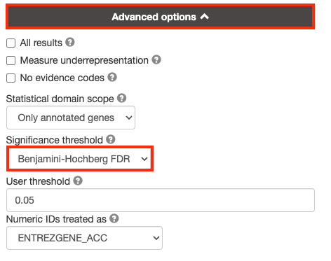
 </p>

```{block, type="rmd-tip" }
By default, g:Profiler will only return the sets that pass the defined threshold. Often you need the ability to tweak the thresholds in the resulting EM beyond the strict FDR < 0.05 threshold and therefore require all the results. In order to get all the results, even those that don’t pass correction, select *All results*.  
```


3b. Click on the *Data sources* tab (black rectangle) to expand it.

* Unselect all gene-set databases by clicking the "clear all" button.
* In the *Gene Ontology* category, check  *GO Biological Process* and *No electronic GO annotations*.
* In the *biological pathways* category, check *Reactome* and check *WikiPathways*.

<p align="center">
  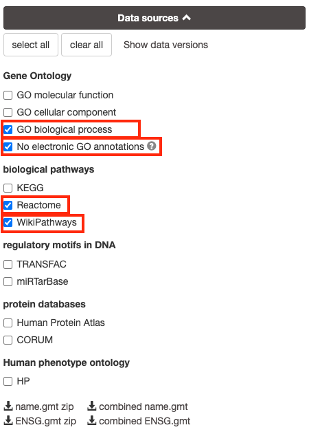
</p>

```{block, type="rmd-note"}
*No electronic GO annotations* option will discard less reliable GO annotations (inferred from electronic annotations (IEAs)) that are not manually reviewed.
```

```{block, type="rmd-tip"}
if g:Profiler does not return any results uncheck the *No electronic GO annotation* option to expand annotations used in the test.
```


### Step 4 - Run query

Click on the *Run query* button, below the input parameters, to run g:Profiler. 

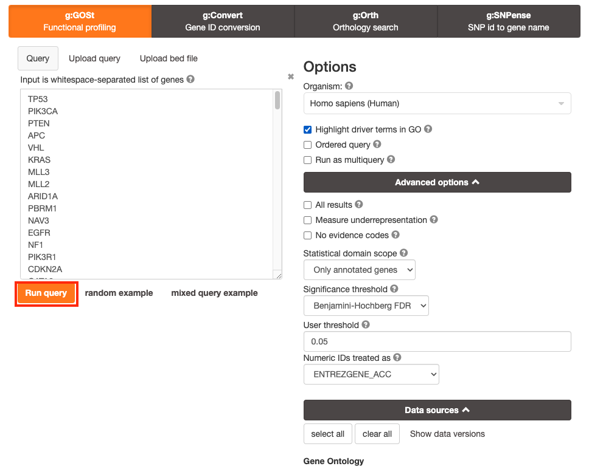

Scroll down page to see results. 


```{block, type="rmd-tip"}
After clicking on *Run query* button, the analysis completes but if there is the following message (above results) - *Select the Ensembl ID with the most GO annotations (all)*, then do the following. For each ambiguous gene, select its correct mapping. Ambiguous mapping is often caused by multiple Ensembl ids for a given gene and are easy to resolve as a user. Rerun query.
```


### Step 5 - Explore the results. 

Step 5a:

* After the query has run, the results are displayed at the bottom of the page, below the input parameters.
* By default, the "Overview" tab is selected. A global graph displays gene-sets that passed the significance threshold of 0.05 for each of the 3 data sources (shown on x-axis) that we have selected - GO Biological Process(GO&#58;BP) and Reactome(REAC) and WikiPathways(WP). Numbers in parentheses indicate the number of gene-sets that passed the threshold.

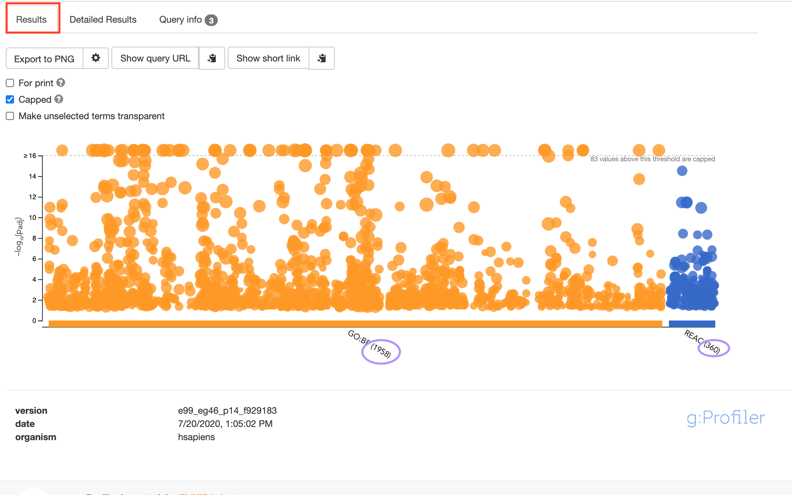

Step5b:

* Click on "Detailed Results" to view the results in more depth. Three tables are displayed, one for each of the data sources selected. (If more than 3 data sources are selected there will be additional tables for each data source). Each row of the table contains:
    * **Term name** - gene-set name
    * **Term ID** - gene-set identifier
    * **Padj** - FDR value 
    * **-log10(Padj)** - enrichment score calculated using the formula -log10(padj)
    * Variable number of gene columns (One for each gene in the query set) - If the gene is present in the current gene-set its cell is colored.  For any data source besides GO, the cell is colored black if the gene is found in the gene-set.  For the GO data source cells are colored according to the annotation evidence code. Expand the *Legend* tab for detailed coloring mapping of GO evidence codes. 
    
The first table displays the gene-sets significantly enriched at FDR 0.05 for the GO&#58;BP database.

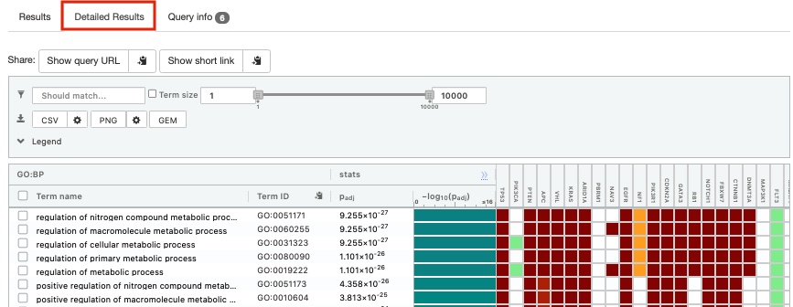

The second table displays the results corresponding to the Reactome database.

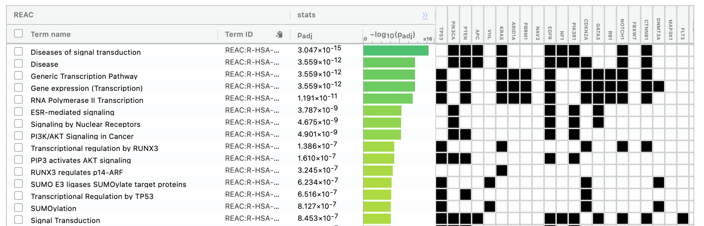

The third table displays the results corresponding to the WikiPathways database.

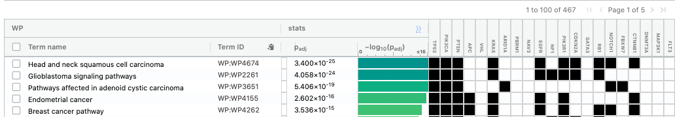

### Step 6: Expand the stats tab
 Expand the *stats* tab by clicking on the double arrow located at the right of the tab.
 
 <p align="center">
 
 </p>
 
 It displays the gene set size (T), the size of our gene list (Q) , the number of genes that overlap between our gene list and the tested gene-set (TnQ) as well as the number of genes in the background (U). 
 

 * Above the GO&#58;BP result table, locate the slide bar that enables to select for the minimum and maximum number of genes in the tested gene-sets (Term size). 
 * Change the maximum *Term size* from 10000 to **250** and 
 * Change the minimum *Term size* from 1 to **3** and 
 * Observe the results in the detailed stats panel:
 
 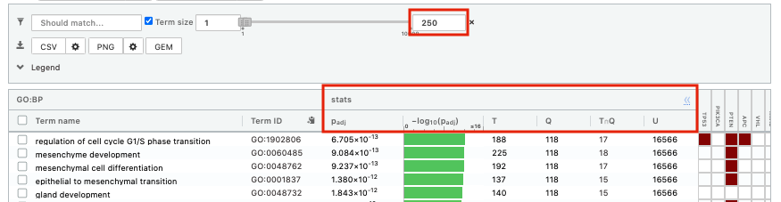

   * Without filtering term size, the top terms were GO terms containing more than 4000 or 5000 genes and often terms located high in the GO hierarchy (parent term). 
   * With filtering the maximum term size to 250, the top list contains pathways with larger interpretative values. However, please note that the adjusted p-values were calculated using all gene-sets without size filtering.

### Step 7: Save the results
 
7a.  In the *Detailed Results* panel, select "GEM" .  It will save the results in a text file in the "Generic Enrichment Map" format that we will use to visualize using Cytoscape.

   * keep the minimum term size set to 3 (for all the three files we create below)
   * set maximum term size to 10000 ( = no filtering by gene-set size) and click on the GEM button. A file is downloaded on your computer. (change the name to gProfiler_hsapiens_lab2_results_GEM_termmin3_max10000.gem.txt)
  <p align="center">  
  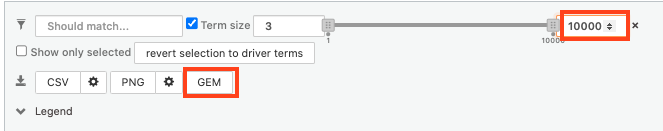
  </p>  
   * set maximum term size to 1000 ( = filter by gene-set size) and click on the GEM button. A file is downloaded on your computer. (change the name to gProfiler_hsapiens_lab2_results_GEM_termmin3_max1000.gem.txt)
  <p align="center">
  
  </p>
   * select max term size to 250 ( = filter by gene-set size) and click on the GEM button. A file is downloaded on your computer. (change the name to gProfiler_hsapiens_lab2_results_GEM_termmin3_max250.gem.txt)
  <p align="center">
  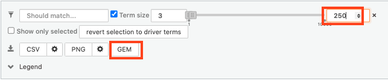
  </p>
  
7b:  Open the file that you saved using the gene-set threshold of 250 using Microsoft Office Excel or in an equivalent software.

Observe the results included in this file:

 1. Name of each gene-set
 1. Description of each gene-set
 1. Significance of the overlap (pvalue)
 1. Significance of the overlap (adjusted pvalue/qvalue)
 1. Phenotype
 1. Genes included in each gene-set

```{block, type="rmd-question"}
Which GO&#58;BP term has the best corrected p-value?  <br> Which genes in our list are included in this term? <br> Observe that some genes can be present on several lines (pathways are related when they contain a lof of genes in common).
```

```{block, type="rmd-note"}
The table is formatted for the input into Cytoscape EnrichmentMap. It is called the [*generic format*](https://enrichmentmap.readthedocs.io/en/latest/FileFormats.html#generic-results-files). The p-value and FDR columns contain identical values because g:Profiler directly outputs the FDR (= corrected p-value) meaning that the p-value column is already the FDR. Phenotype 1 means that each pathway will be represented by red nodes on the enrichment map (presented during next module). 
```

  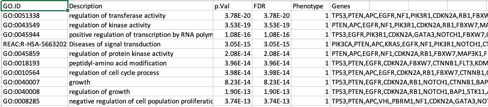


The GO&#58;BP term *regulation of cell cycle G1/S phase transition* is the most significant gene-set (=the lowest FDR value).  Many gene-sets from the top of this list are related to each other and have genes in common. 

---

### Step 8 (Optional but recommended)

8a. Download the pathway database files.

  * Go to the top of the page and expand the "Data sources" tab. Click on the 'combined name.gmt' link located at bottom of this tab. It will download a file named *combined name.gmt* containing a pathway database gmt file with all the available sources. 

<p align="center">
  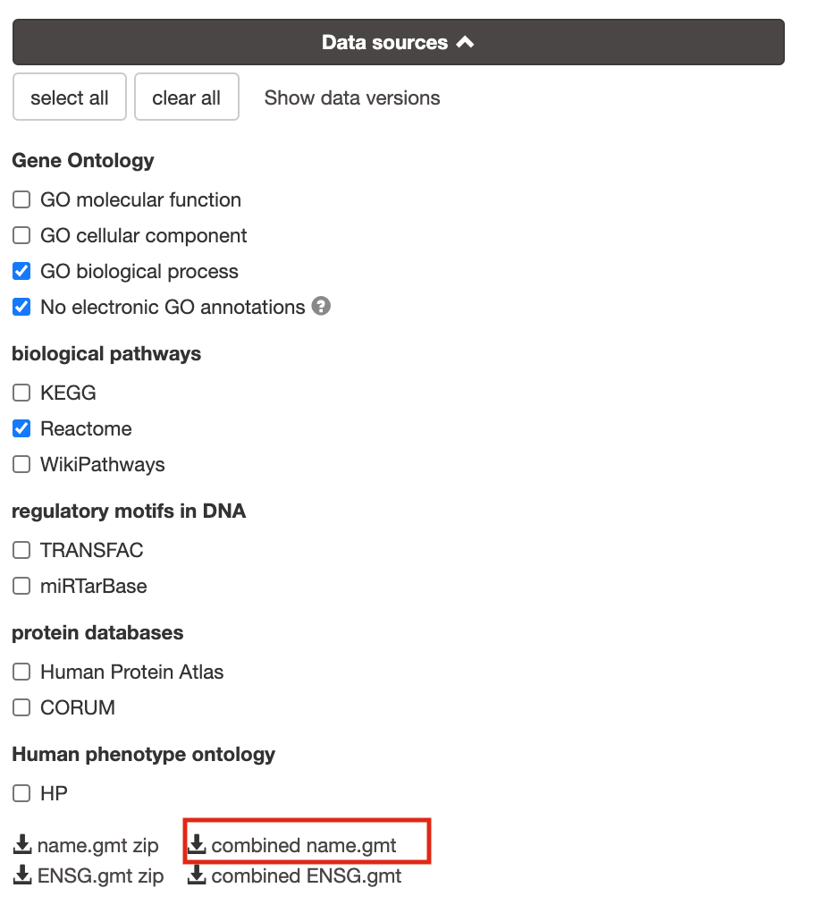
</p>

8b. concatenate the GO&#58;BP, Reactome and WikiPathways gmt files:

If you want to create a smaller gmt file that doesn't contain all of the g:profiler datasources you can instead download *name.gmt.zip* that contains each datasource as its own gmt file.  You will need to concatenate the sources you require into one gmt file to use for later.

#### Option 1: manually if you are not familiar with unix commands
   * open a text editor such a Notepad or equivalent
   * open hsapiens.GO&#58;BP.name.gmt using the text editor
   * open gmt hsapiens.REAC.name.gmt using the text editor
   * copy-paste all the rows from REAC file together with all the rows in GO&#58;BP file.
   * open gmt hsapiens.WP.name.gmt using the text editor
   * copy-paste all the rows from WP file together with all the rows in GO&#58;BP file.
   * save the file as hsapiens.pathways.name.gmt .

#### Option 2: using the cat command if you are familiar with unix commands
   * open your terminal window
   * cd to the unzipped gprofiler_hsapiens.name folder
   * type the following command: 
   ```
    cat hsapiens.GO:BP.name.gmt hsapiens.REAC.name.gmt hsapiens.WP.name.gmt > hsapiens.pathways.name.gmt
   ``` 

```{block, type="rmd-note"}
you will be using this optional hsapiens.pathways.name.gmt file in Cytoscape EnrichmentMap.
```     


### Step 9 (Optional by recommended)

 9. Get and record the version of g:Profiler used in your analysis.  It is important to note in your future publication using your enrichment results the methods and the version of software used for any analysis.  g:Profiler is updated on a regular basis so you can not simply come back to the webpage at time of publication and get the version.   Also, if you ever want to verify the results that you have and re-run the analysis it is important to use the same version as the initial analysis (or your results might differ).  g:Profiler maintains an [archive](https://biit.cs.ut.ee/gprofiler/page/archives) so it is easy to revisit previous versions.   
 
<p align="center">
  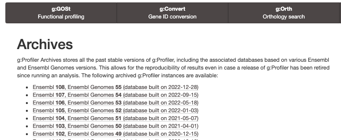
</p>
 
 * The g:Profiler version can be found in two places - 
   * At the bottom of overview tab the version is listed
        <p align="center">
          
        </p>

   * Or Click on the *Query Info* tab to see all the parameters, including the g:Profiler version, used for the analysis
        <p align="center">
          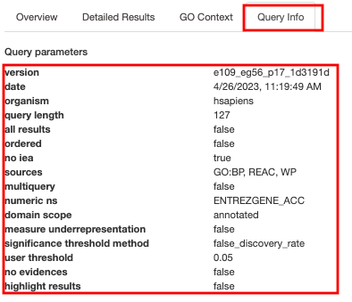
        </p>

```{block, type="rmd-note"}
Deciphering the version from the listed tag e109_eg56_p17_1d3191d :<br>
  * e109 - Ensembl version 109 <br>
  * eg56 - Ensembl genomes version 56<br>
  
```

```{block, type="rmd-tip"}
The version info can be recorded anywhere (for example in your lab notebook) but a convenient place is to embed it in the g:Profiler geneset file name used for the analysis.  <br>Instead of naming the file <br>
  * hsapiens.pathways.name.gmt<br>
Name it <br>
  * hsapiens.pathways_e109_eg56_p17_1d3191d.name.gmt<br>
```
 
---


## Exercise 2: Load and use a custom .gmt file and run the query

For this exercise, our goal is to copy and paste the list of genes into g:Profiler, upload a custom gmt file, adjust some parameters (e.g selecting the pathway databases), run the query and explore the results. Uploading a custom gmt file enables us to use alternate pathway data sources not available in g:Profiler.

We are going to use a gmt file that contains a database of pathway gene sets used for pathway enrichment analysis in the standard GMT format downloaded from http://baderlab.org/GeneSets and updated monthly.

This file contains pathways from eight data sources: 

* GO, 
* Reactome,
* Panther, 
* NetPath, 
* NCI, 
* MSigDB curated gene sets (C2 collection, excluding Reactome and
KEGG), 
* MSigDB Hallmark (H collection) and 
* HumanCyc. 

A GMT file is a text file in which each line represents a gene set for a single pathway. Each line includes a pathway ID, a name and the list of associated genes in a tab-separated format. This file has been filtered to exlclude gene-sets that contained more than 250 genes as these gene-sets are associated with more general terms.

Before starting this exercise, download the required files:

```{block, type="rmd-datadownload"}
Right click on link below and select "Save Link As...".

Place it in the corresponding module directory of your CBW work directory.
```

* [Pancancer_genelist.txt](./Module2/gprofiler/data/Pancancer_genelist.txt)

*  [Baderlab_genesets.gmt (from April 2023)](./Module2/gprofiler/data/Human_GOBP_AllPathways_no_GO_iea_April_02_2023_symbol_max250.gmt).


We recommend saving all these files in a personal project data folder before starting. We also recommend creating an additional result data folder to save the files generated while performing the protocol.

STEPS:

 * Repeat step 1 to 3a from [Exercise 1](#exercise-1) (go back to exercise 1 to get detailed instructions) Briefly:
   * Step 1:
     * Open g:profiler
   * Step 2a :
     * Copy and paste the gene list in the Query field
   * Step 2b: Click on the *Advanced options* tab (black rectangle) to expand it.
     * Set *Significance threshold* to "Benjamini-Hochberg FDR".
   * Step 3a: Click on the *Data sources* tab (black rectangle) to expand it.
     * **Unselect all choices by clicking the "clear all" button.**
   * Step 4:  Click on the *Custom GMT* tab (black rectangle) to expand it.
     * Drag in the box the Baderlab gmt file [Baderlab_genesets.gmt](./Module2/gprofiler/data/Human_GOBP_AllPathways_no_GO_iea_April_02_2023_symbol_max250.gmt).
     * Once uploaded successfully, the name of the file is displayed in the "File name used" box. 
    
    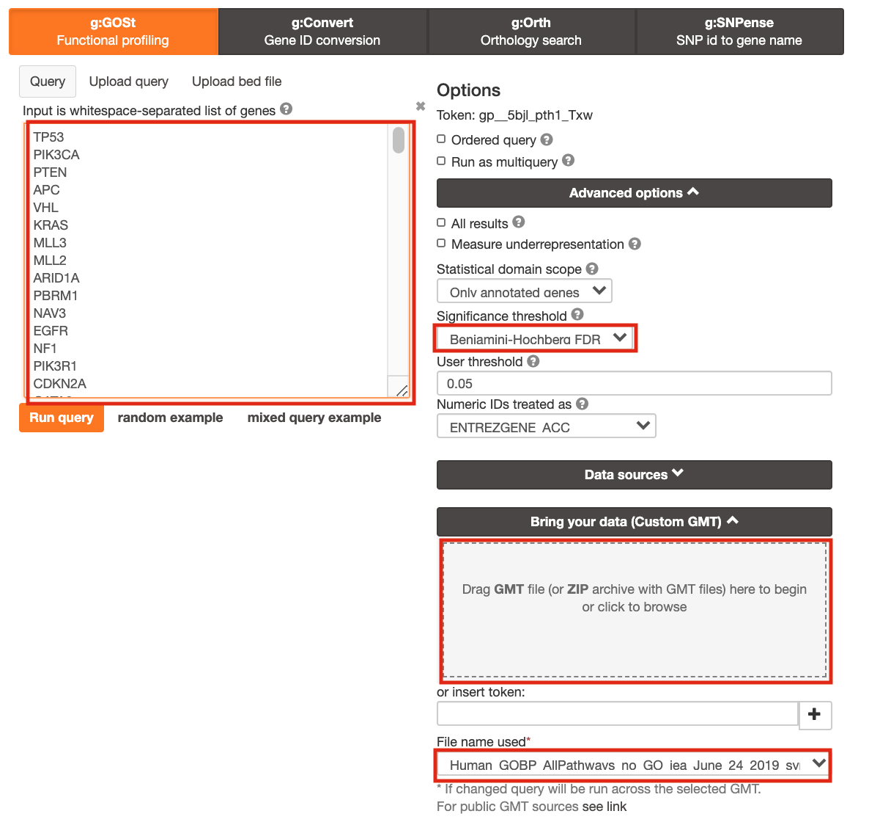
   
   * Step 5: Click on *Run  query* .   
   
   * Step 6: Explore the detailed results
   
     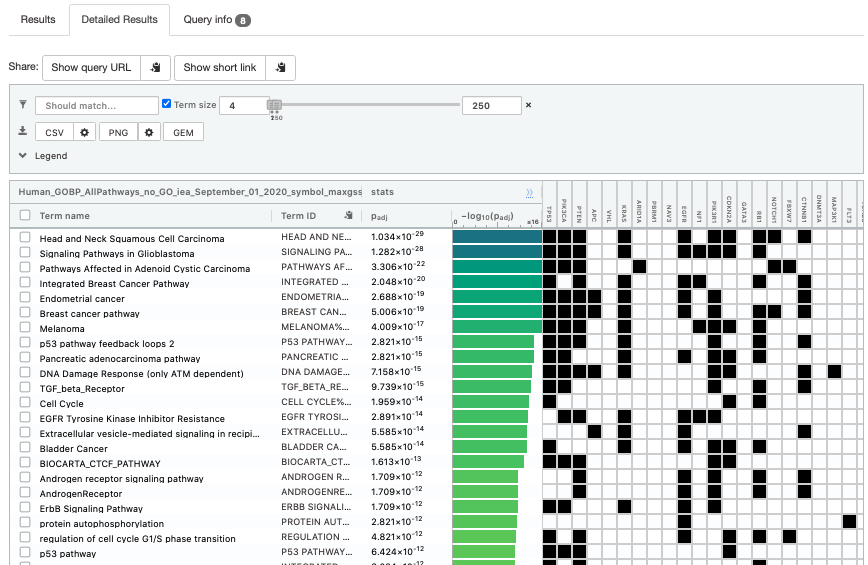
   
   * Step 7: Save the file as GEM

---

## Optional steps 

Please follow these optional steps if time permits and/or to explore more g:Profiler parameters.

Here below are 3 optional steps that cover several options offered by g:Profiler:

  1. test different data sources, 
  1. take the order of the gene list into account,
  1. use different types of multiple hypothesis correction methods.

Use the same gene list as used in [exercise 1](#exercise-1) and modify paramters listed above. Observe the results. 

<p align="center">

</p>

### **Optional 1**:   
If time permits, play with input parameters, e.g. add *TRANSFAC * and *miRTarBase* databases, rerun the query and explore the new results.
 
 <p align="center">
 
 </p>
 
```{block, type="rmd-note"}
**Transfac**  putative transcription factor binding sites (TFBSs) from TRANSFAC database are retrieved into g:GOSt through a special prediction pipeline. First, TFBSs are found by matching TRANSFAC position specific matrices using the program Match on range +/-1kb from TSS as provided by APPRIS (Annotating principal splice isoforms) via Ensembl biomart. For genes with multiple primary TSS annotations we selected one with most TF matches. The matching range for C. elegans, D. melanogaster and S. cerevisiae is 1kb upstream from ATG (translation start site). A cut-off value to minimize the number of false positive matches (provided by TRANSFAC) is then applied to remove spurious motifs. Remaining matches are split into two inclusive groups based on the amount of matches, i.e TFBSs that have at least 1 match are classified as match class 0 and TFBSs that have at least 2 matches per gene are classified as match class 1.<br><br>
**mirTarBase** is a database that holds experimentally validated information about genes that are targetted by miRNAs. We include all the organisms that are covered by mirTarBase.
```

### **Option 2**:
Re-run the g:Profiler using the **ordered** query checked.<br> This will run the minimum hypergeometric test. g:Profiler then performs incremental enrichment analysis with increasingly larger numbers of genes starting from the top of the list. When this option is checked, **it assumes that the genes were preordered by significance with the most significant gene at the top of the list**.<br> Compare the results between "ordered" and non ordered query.

```{block, type="rmd-note"}
for this practical lab, the genes were ordered by the number of mutations found in these genes for all samples. <br>For example, TP53, a highly mutated genes is listed at the top. 
```

<p align="center">

</p>

### **Option 3** :

Re-run g:Profiler and select g:SCS or Bonferonni as method to correct for multiple hypothesis testing. Do you get any significant results? 

<p align="center">
  
</p>

```{block, type="rmd-note"}
you can get detailed information about these methods at https://biit.cs.ut.ee/gprofiler/page/docs in the section *Significance threshold*. 
```
___

## Bonus - Automation. 

Run analysis directly from R for easy integration into existing pipelines.

```{block, type="rmd-bonus"}
Instead of using the g:Profiler website g:profiler can be run directly from R or python see g:Profiler document for more info at https://biit.cs.ut.ee/gprofiler/page/r

Follow the step by step instructions on how to run from R here - https://risserlin.github.io/CBW_pathways_workshop_R_notebooks/run-gprofiler-from-r.html

First, make sure your environment is set up correctly by following there instructions - https://risserlin.github.io/CBW_pathways_workshop_R_notebooks/setup.html
```
