# Module 2 lab - GSEA {#gsea-lab}

Presenter: Ruth Isserlin

## Introduction

This practical lab contains one exercise. It uses [GSEA](http://www.broadinstitute.org/gsea/index.jsp) to perform a gene-set enrichment analysis. 

## Goal of the exercise

Learn how to run GSEA and explore the results.

## Data

The data used in this exercise is gene expression (transcriptomics) obtained from high-throughput RNA sequencing of Pancreatic Ductal Adenocarcinoma samples (TCGA-PAAD). 

This cohort has been previously stratified into many different set of subtypes [PMID:36765128](https://pubmed.ncbi.nlm.nih.gov/36765128/) with the [Moffitt](https://pubmed.ncbi.nlm.nih.gov/26343385/) Basal vs Classical subtypes compared to demonstrate the GSEA workflow.

#### How was the data processed?

  * Gene expression from the TCGA Pancreatic Ductal Adenocarcinoma RNASeq cohort was downloaded on 2024-06-06 from [Genomic Data Commons ](https://portal.gdc.cancer.gov/) using the [TCGABiolinks](https://bioconductor.org/packages/release/bioc/html/TCGAbiolinks.html) R package.
  * Differential expression for all genes between the Basal and Classical groups was estimated using [edgeR](http://www.ncbi.nlm.nih.gov/pubmed/19910308).
  * The R code used to generate the data and the rank file used in GSEA is included at the bottom of the document in the [**Additional information**](#additional_information) section. 

## Background

The goal of this lab is to:

  * Upload the 2 required files into GSEA, 
  * Adjust relevant parameters, 
  * Run GSEA, 
  * Open and explore the gene-set enrichment results. 
  
The 2 required files are:

  1. a rank file (.rnk) 
  1. a pathway definition file (.gmt).

#### Rank File
To generate a rank file (.rnk),  a score (-log10(pvalue) * sign(logFC)) was calculated from the edgeR differential expression results. A gene that is significantly differentially expressed (i.e associated with a very small pvalue, close to 0) will be assigned a high score.<br>The sign of the logFC indicates if the gene has an expression which is higher in Basel (logFC > 0, the score will have a + sign) or lower in Classical (logFC < 0, the score will have a - sign). It is used to rank the genes from top up-regulated to top down-regulated (**all genes have to be included**). 


```{block, type="rmd-caution"}
The rank file is going to be provided for the lab, you don't need to generate it. 
```

### How to generate a rank file. 

#### Calculation of the score

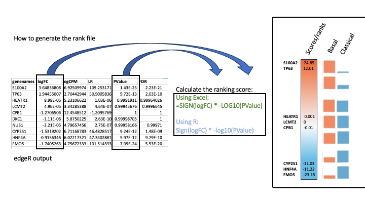

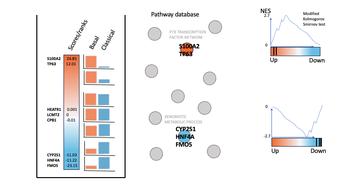

#### Generation of the rank file
Select the gene names and score columns and save the file as tab delimited with the extension .rnk

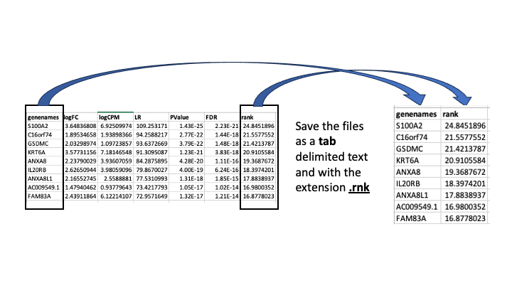

#### Pathway defintion file
The second file that is needed for GSEA is the pathway database, a file with the .gmt extension. The pathway database (.gmt) used for the GSEA analysis was downloaded from <http://baderlab.org/GeneSets>. This file contains gene-sets obtained from  MsigDB-c2 and Hallmarks, NCI, Biocarta, IOB, Netpath, HumanCyc, Reactome, Panther, Pathbank, WikiPathways and the Gene Ontology (GO) databases. 

```{block, type="rmd-caution"}
You don't need to perform this step for the exercise, the .gmt file will be given to you. <br>
```


Go to:

  * http://download.baderlab.org/EM_Genesets/
  * Click on June_01_2024/
  * Click on Human/
  * Click on symbol/
  * Save the Human_GOBP_AllPathways_noPFOCR_no_GO_iea...gmt file on your computer

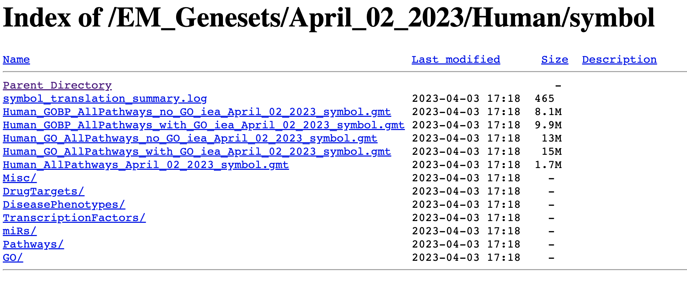

The .gmt is a tab delimited text file which contains one gene-set per row. For each gene-set (row), the first 2 columns contain the name and the description of the gene-set and the remaining columns contain the list of genes included in the gene-set. It is possible to create a custom gene-set using Excel or R. 


GSEA performs a gene-set enrichment analysis using a modified Kolmogorov-Smirnov statistic.  The output result consists of summary tables displaying enrichment statistics for each gene-set (pathway) that has been tested.


### Start the exercise

Before starting this exercise, download the 2 required files:

```{block, type="rmd-datadownload"}
Right click on link below and select "Save Link As...".

Place it in the corresponding module directory of your CBW work directory.
```

* [Human_GOBP_AllPathways_noPFOCR_no_GO_iea_June_01_2024_symbol.gmt](./Module2/gsea/data/Human_GOBP_AllPathways_noPFOCR_no_GO_iea_June_01_2024_symbol.gmt)
* [TCGA-PAAD_GDC_Subtype_Moffitt_BasalvsClassical_ranks.rnk](./Module2/gsea/data//TCGA-PAAD_GDC_Subtype_Moffitt_BasalvsClassical_ranks.rnk)


### Step1.

Launch GSEA by double clicking on the installed program icon.

```{block, type="rmd-troubleshooting"}
If GSEA won't launch on MacOS. (This is relevant for MacOS users on older operating systems.  As I am not longer on this operating system I can't regenerate these screenshots so they reflect an older version of GSEA but the steps are still relelvant if you are working on Catalina with the latest version of GSEA)

Follow instructions specified on download page:
  * 

  * If you see this error message:
  * 

  * Open Settings -> Security & Privacy
  * Click on "Open Anyways"
  * 
```


### Step 2.

Load Data

2a. Locate the ‘*Load data*’ icon at the upper left corner of the window and click on it.

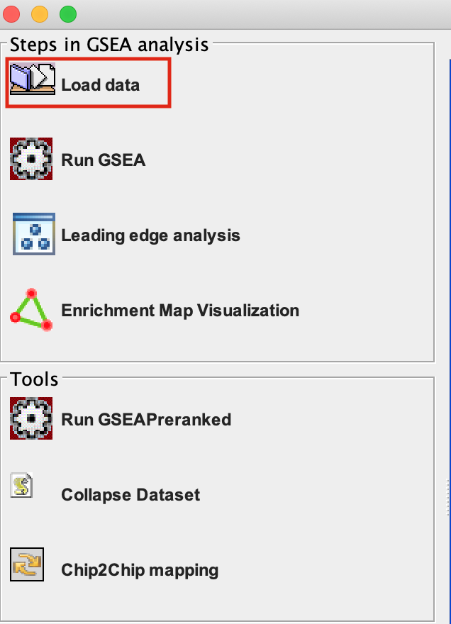


2b. In the central panel, select ‘*Method 1*’ and ‘*Browse for files*’. A new window pops up.

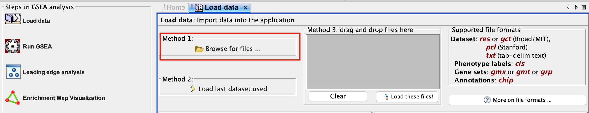

2c. Browse your computer to locate and select the 2 files : **Human_GOBP_AllPathways_noPFOCR_no_GO_iea_June_01_2024_symbol.gmt** and **TCGA-PAAD_GDC_Subtype_Moffitt_BasalvsClassical_ranks.rnkk**. 

2d. Click on **Open**. A message pops us when the files are loaded successfully. 

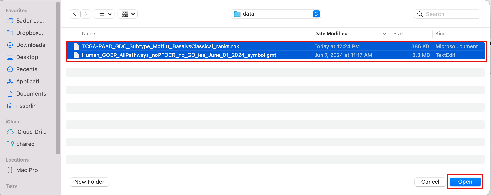

2e. Click on **OK**.

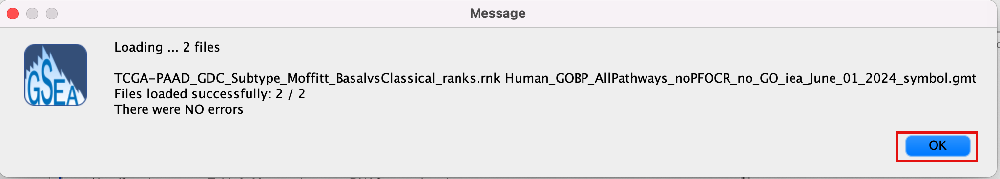
	
```{block, type="rmd-tip"}
Alternatively, you can choose **Method 3** to **drag and drop files here**. You need to click on the **Load these files!** button in this case.
```

### Step3.

Adjust parameters

3a. Under the **Tools** menu select **GseaPreRanked**.

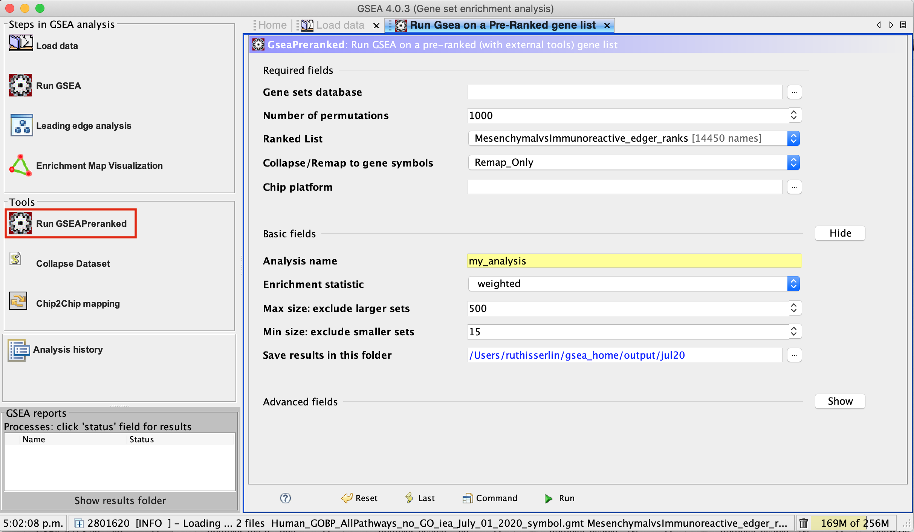

3b. **Run GSEA on a Pre-Ranked gene list** tab will appear.

Specify the following parameters:

3c. Gene sets database -

  * Click on the radio button (…) located at the right of the blank field.
  * Wait 5-10 sec for the gene-set selection window to appear.
	
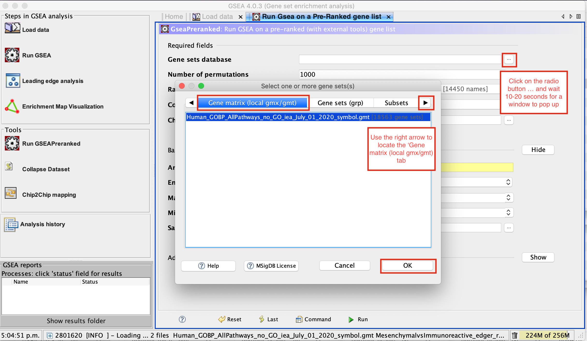

  * Use the right arrow in the top field to see the Gene matrix (*Local gmx/gmt*) tab.
  * Click to highlight **Human_GOBP_AllPathways_noPFOCR_no_GO_iea_June_01_2024_symbol.gmt**.
  * Click on **OK** at the bottom of the window.


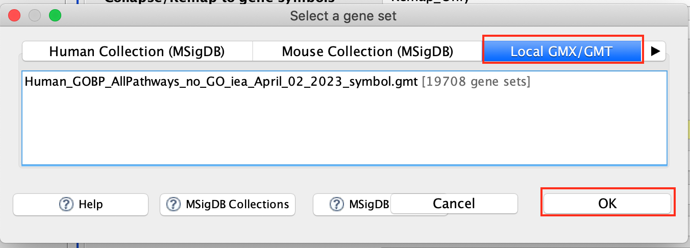

	
  * **Human_GOBP_AllPathways_noPFOCR_no_GO_iea_June_01_2024_symbol.gmt** is now visible in the field corresponding to **Gene sets database**.


3d. Set **Number of permutations** to 100. The number of permutations is the number of times that the gene-sets will be randomized in order to create a null distribution to calculate the FDR.  


```{block, type="rmd-caution"}
Use 2000 when you do it for your own data outside the workshop.
```

3e. **Ranked list** - select by clicking on the arrow and highlighting rank file.

3f. **Collapse/Remap to gene symbols** - Change to *No_collapse*.  (Our rank file already contains the gene symbols so we don't need GSEA to try and convert probe names to gene symbols)


3g. Click on **Show** button next to **Basic Fields** to display extra options.

3h. **Analysis name** – change the default name **my_analysis** to a name that is specific to analysis. For example *Basal_vs_Classical_edgeR*. GSEA will use your specified name as part of the directory of results that it creates.

3i. **Max size**: exclude larger sets – By default GSEA sets the upper limit to 500. In this protocol, the maximum is set to 200 to decrease some of the larger sets in the results.

3j. **Min size**: exclude smaller sets – By default GSEA sets the lower limit to 15. In this protocol, the minimum is set to 10 to increase some of the smaller sets in the results.

3k. **Save results in this folder** – navigate to where you want GSEA to put the results folder. By default GSEA will put the results into the directory *gsea_home/output/[date]* in your home directory.

```{block, type="rmd-tip"}
Set **Enrichment Statistics** to p2 if you want to add more weight on the most top up-regulated and top down-regulated. <br> **P2** is a more stringent parameter and it will result in less gene-sets significant under FDR <0.05.
```

### Step 4. 

Run GSEA

4a. Click on **Run** button located at the bottom right corner of the window.

```{block, type="rmd-tip"}
Expand the window size if the run button is not visible
```

4b. On the panel located on the left side of the GSEA window, the bottom panel called **GSEA report** will show that a process was created, with a message that it is **Running**.


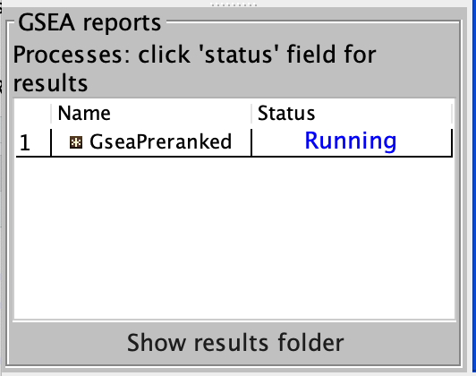


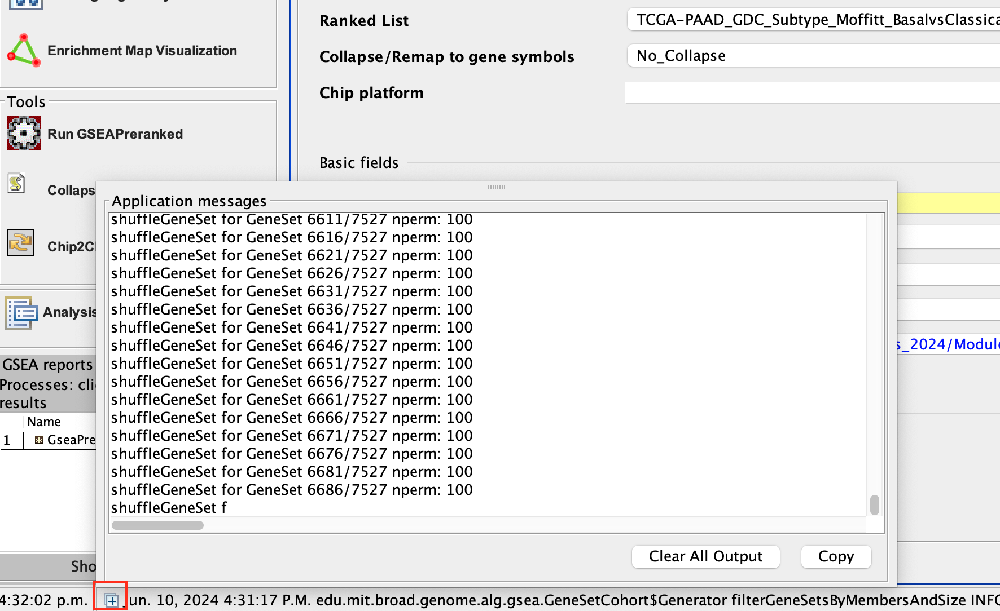


On completion the status message will be updated to **Success…**.

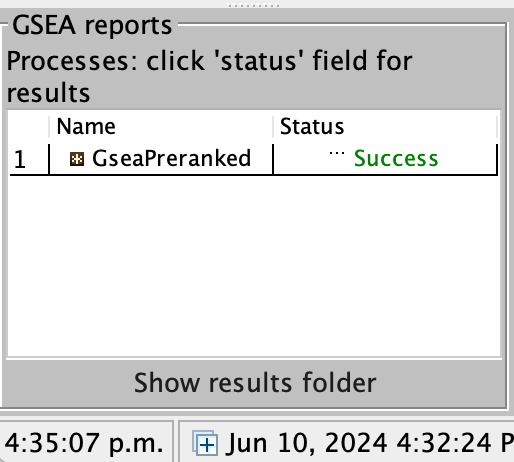


```{block, type="rmd-tip"}
There is no progress bar to indicate to the user how much time is left to complete the process. Depending on the size of your dataset and compute power of your machine, a GSEA run can take from a few minutes to a few hours. To check on the status of the GSEA run in the bottom left hand corner you can click on the **+** (red circle in above Figure) to see the updating status. Printouts in the format **shuffleGeneSet for GeneSet 5816/6878 nperm: 100** indicate how many permutations have been done (5816) out of the total that need to be performed (6878).
```

```{block, type="rmd-tip"}
If the permutations have been completed but the status is still running, it means that GSEA is creating the report
```

```{block, type="rmd-troubleshooting"}
Java Heap Space error. If GSEA returns an error **Java Heap space** it means that GSEA has run out of memory. If you are running GSEA from the webstart other than the 4GB option, then you will need to download a new version that allows for more memory allocation. The current maximum memory allocation that the GSEA webstart allows for is 4GB. If you are using this version and still receive the java heap error, you will need to download the GSEA java jar file and launch it from the command line as described in step 1.
```

### Step 5. 

Examining the results

5a. Click on **Success** to launch the results in html format in your default web browser.

```{block, type="rmd-tip"}
If the GSEA application has been closed, you can still see the results by opening the result folder and clicking on the **index** file – *index.html*. (see screenshot below). The first phenotype corresponds to gene-sets enriched in genes up-regulated in the Basal subtype. The second phenotype corresponds to gene-sets enriched in genes up-regulated in the Classical phenotype. 
```

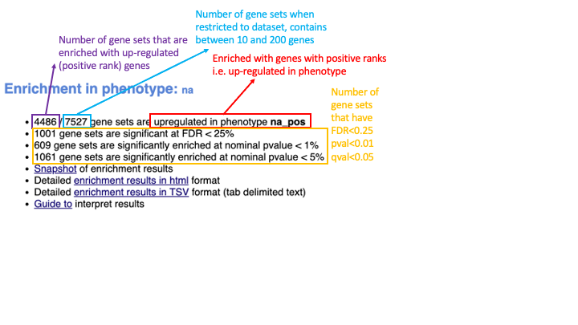


When examining the results there are a few things to look for:

5b. Check the number of gene-sets that have been used for the analysis.   

```{block, type="rmd-tip"}
 A small number (a few hundred genesets if using baderlab genesets) could indicate an issue with identifier mapping.
```

5c. Check the number of sets that have FDR less than 0.25 – in order to determine what thresholds to start with when creating the enrichment map. It is not uncommon to see a thousand gene sets pass the threshold of FDR less than 0.25. FDR less than 0.25 is a very lax threshold and for robust data we can set thresholds of FDR less than 0.05 or lower.

5d. Click on **Snapshots** to see the trend for the top 20 genesets. For the positive phenotype the top genesets should show a distribution skewed to the left (positive) i.e. genesets have predominance of up-regulated genes. For the negative phenotype the top geneset should be inverted and skewed to the right (negative) i.e. geneset have predominance of down-regulated genes.


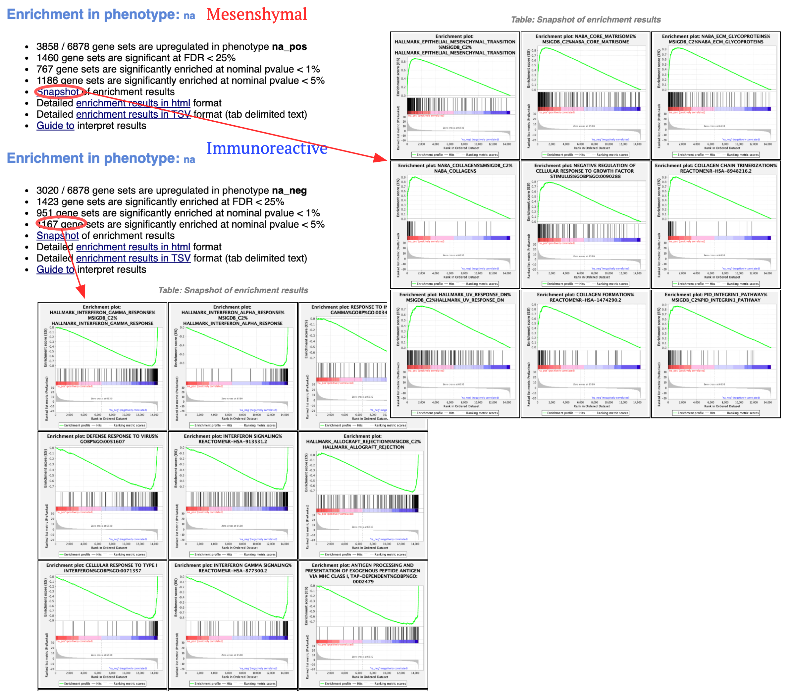


5e. Explore the tabular format of the results.

#### Basal

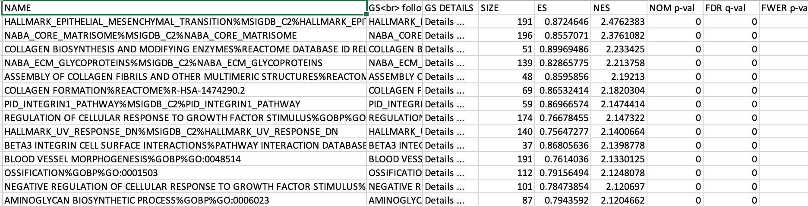

#### Classical

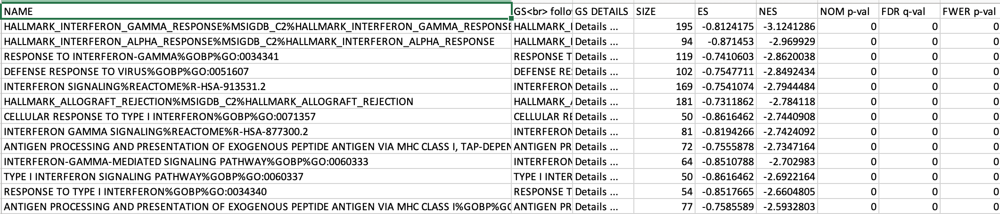

[Link to information about GSEA results](http://www.baderlab.org/CancerStemCellProject/VeroniqueVoisin/AdditionalResources/GSEA#GSEA_enrichment_scores_and_statistics)


## Additional information {#additional_information}

[More on GSEA data format](http://www.broadinstitute.org/cancer/software/gsea/wiki/index.php/Data_formats) 

[More on processing the RNAseq using EdgeR and generate the .rank file](https://baderlab.github.io/Cytoscape_workflows/EnrichmentMapPipeline/supplemental_protocol1_rnaseq.html)

[More on which .gmt file to download from the Baderlab gene-set file](http://download.baderlab.org/EM_Genesets/), select current release, Human, symbol, Human_GOBP_AllPathways_no_GO_iea_….gmt

[More on GSEA : link to the Baderlab wiki page on GSEA](http://www.baderlab.org/CancerStemCellProject/VeroniqueVoisin/AdditionalResources/GSEA)

## Bonus - Automation. 

Run analysis directly from R for easy integration into existing pipelines.

```{block, type="rmd-bonus"}
Instead of using the GSEA application you can run it directly from R using the GSEA java jar that can be easily used within the workshop docker image (workshop_base_image) that you setup duing your prework.

Follow the step by step instructions on how to run from R here - https://risserlin.github.io/CBW_pathways_workshop_R_notebooks/run-gsea-from-within-r.html

First, make sure your environment is set up correctly by following there instructions - https://risserlin.github.io/CBW_pathways_workshop_R_notebooks/setup.html
```
