# Module 3 Lab Primer: Cytoscape Primer {#cytoscape_mod3}

**This work is licensed under a [Creative Commons Attribution-ShareAlike 3.0 Unported License](http://creativecommons.org/licenses/by-sa/3.0/deed.en_US). This means that you are able to copy, share and modify the work, as long as the result is distributed under the same license.**

By Gary Bader, Ruth Isserlin, Chaitra Sarathy, Veronique Voisin

## Goal of the exercise

**Create a network and customize it.**

The goal of this exercise is to learn how to create a network in Cytoscape and customize id. In this example, the proteins are the entities represented as nodes in the network and known physical interactions are the connections between the proteins that are represented as edges. We will overlay 2 additional pieces of information about these proteins, mutation information per protein as node color and mutation expression as node size.

## Data

  * The data used in this exercise is a set of protein - protein interactions and associated attributes.  

## Start the exercise

To start the lab practical section, first create a cytoscape_primer_files directoty on your computer and download the files below.

```{block, type="rmd-datadownload"}
Right click on link below and select "Save Link As...".

Place it in the corresponding module directory of your CBW work directory.
```

Two files are needed for this exercise:

  * [networktable.txt](./Module3/cytoscape_primer/data/network_table.txt)
  * [nodeattribute.txt](./Module3/cytoscape_primer/datanode_attribute.txt)
  
## Exercise 1a - Create Network from table

  1. Launch Cytoscape
  1. Locate the top menu bar and select **File**,--> **Import**, --> **Network from File…**.
  
  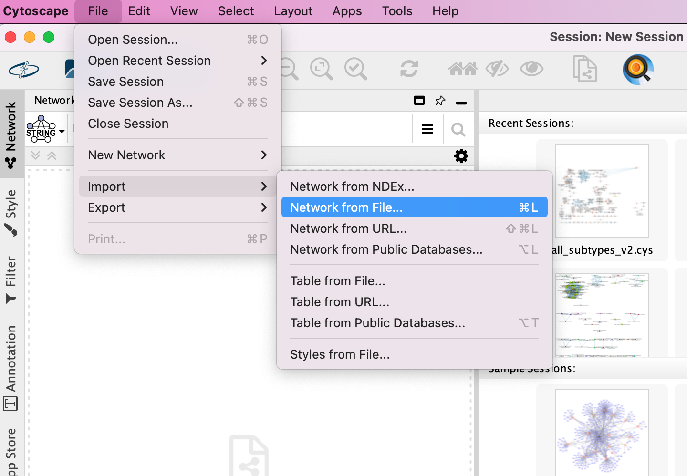
  
  <ol start=3 type="1">
<li>  Browse your computer and select the file [networktable.txt](./Module3/cytoscape_primer/data/network_table.txt)
</ol>
  <ol start=4 type="1">
<li> An **Import Network from Table** dialog box opens. The 3 columns of the table should be set as “source”, “interaction” and “target” respectively. </ol>
  
  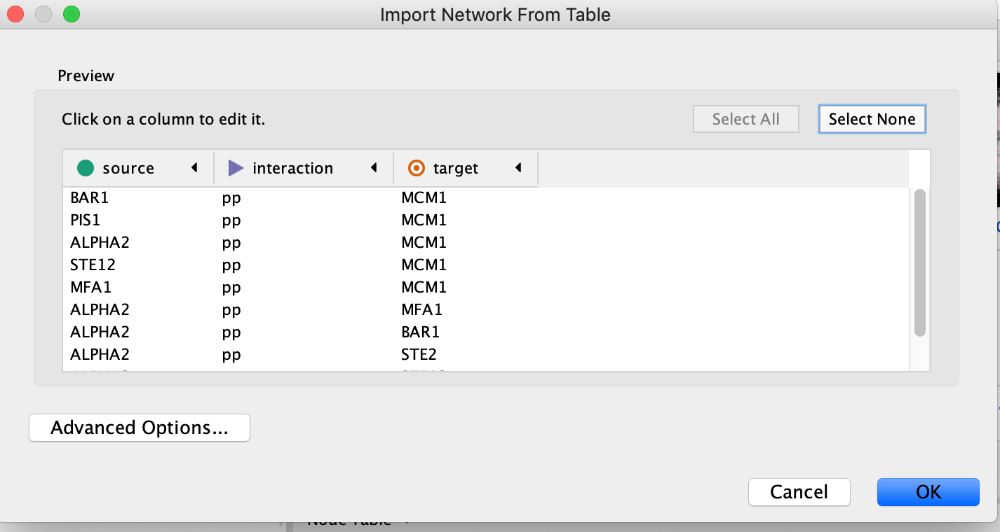
    

```{block, type="rmd-tip"}  
  
  Cytoscape will assume, by default,  will look for the column names that start with "source", "interaction" and "target".  It will assume that any other column is an interaction attribute (edge attribute)  
  
  * This is just an example file.  You can import files with any number of additional columns and choose to ignore all columns except for the ones that you want to import or import all of them.  Although Cytoscape tries to guess the data type of each column and the type (ie. is it an attribute associated with source node, target nodes or the interaction) you are able to fine tune everything.  
  
  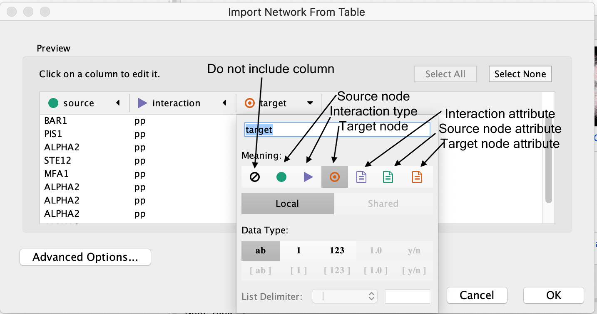
  
```

 <ol start=5 type="1">
<li>  Click “Open”.
</ol>  

  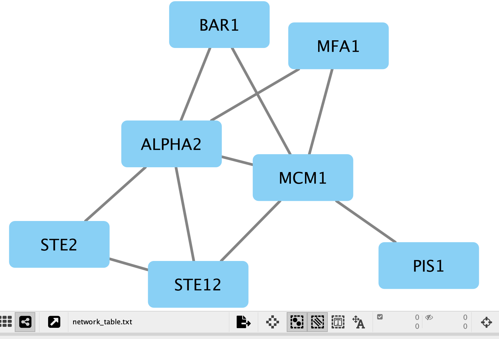
  
  * A network containing the proteins as blue square nodes and interaction as edges should be displayed in the main Cytoscape window.
  
## Exercise 1b - Load node attributes

  1. Locate the Cytoscape top menu bar and select **File**,--> **Import**,--> **Table from File…**. 
  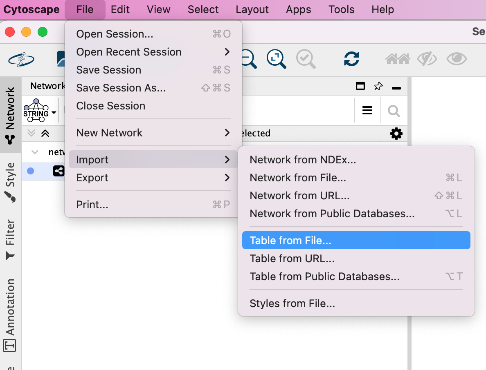

  1. Browse your computer and select the file [nodeattribute.txt](./Module3/cytoscape_primer/data/node_attribute.txt)
  
  1. click “Open”.

  1. An “Import Table from Columns” dialog appears. 
  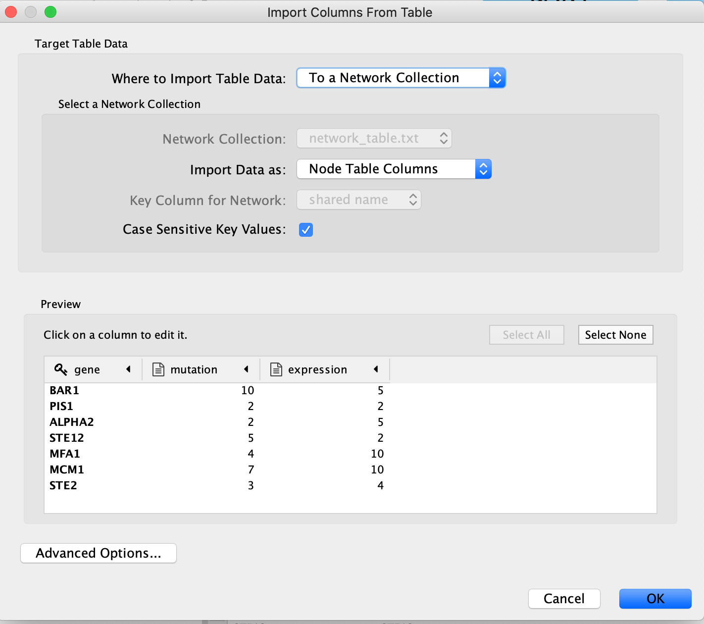

  
  1. Click on “OK”.
  
  1. You should be able to see the imported attributes in the node table. 
  


```{block, type="rmd-note"}
  i. The key column is assumed to be the first column in your table.  
  i. The key is the column in the loaded attribute file used to match your attributes to your network. 
  i. **key colum for Network** is the column in the Network that the key is matched to.  (In this network there isn't the ability to set this value because that is the only attribute associated with the nodes in our network but normally this drop box will be selectable)
  i. The key and matching column need to match perfectly (unless you have specifid that case does not matter). 
  
  

```


```{block, type="rmd-tip"}  
  Similiar to the **Import Network from Table**, everything about the import is customizable.  Cytoscape does its best to guess the datatypes of each column but you are able to fine tune it.  
  
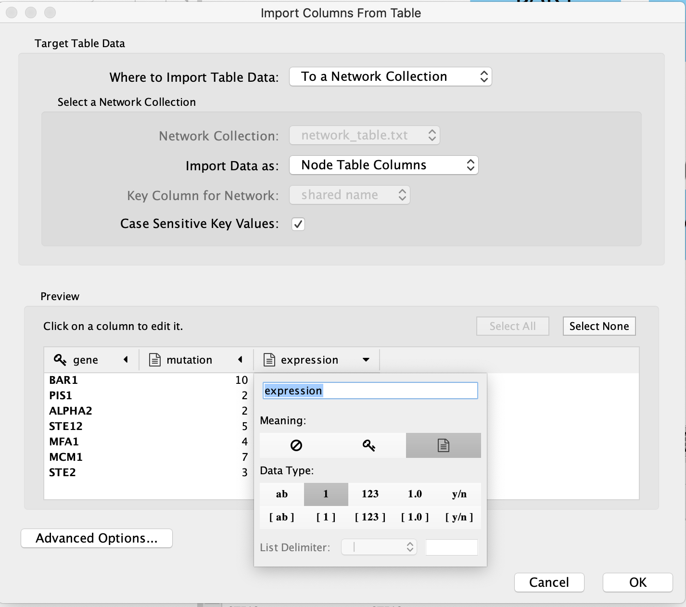

  
  There are also advanced options if you want to:
  
  * change the file delimiter
  * skip lines
  * specify the header column
    
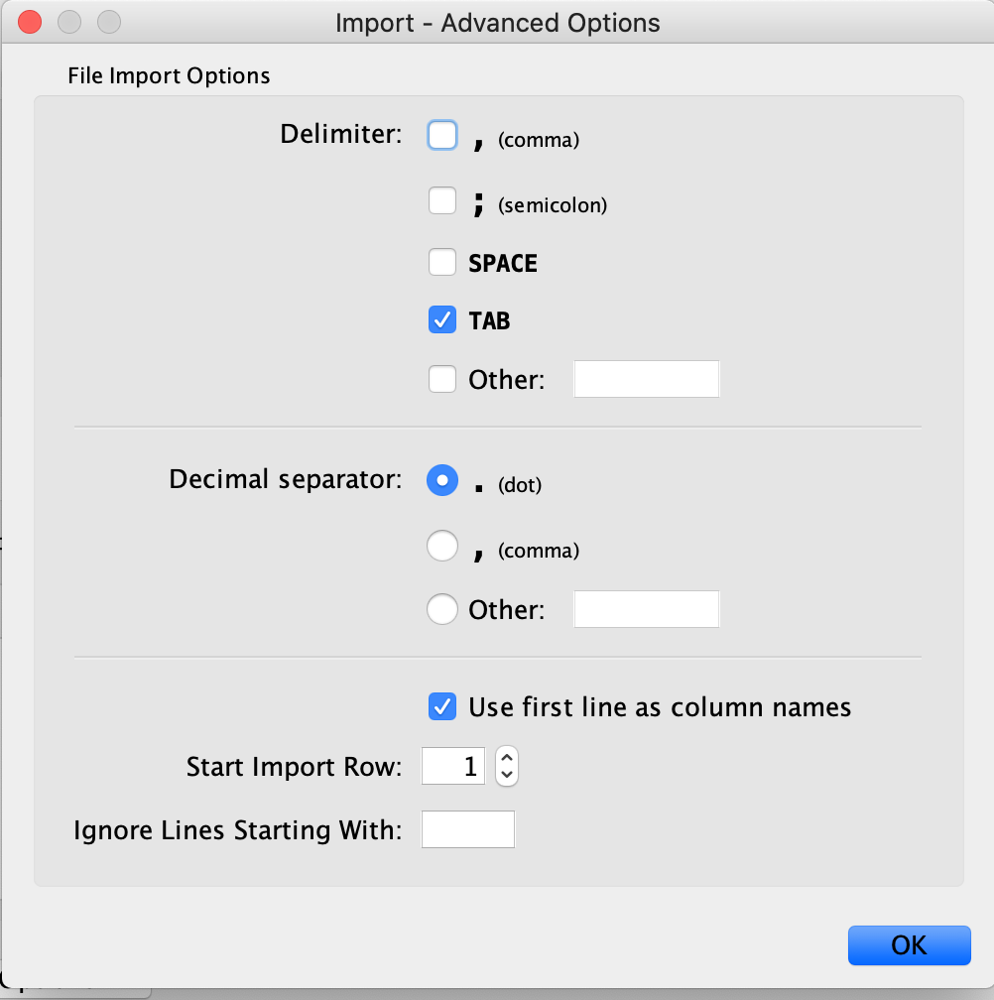
    
```

## Exercise 1c - Map node attributes to Visual Style


  1. Go to “Control Panel” on the left side and select the “Style” tab. Make sure that you are in the “Node” tab.
  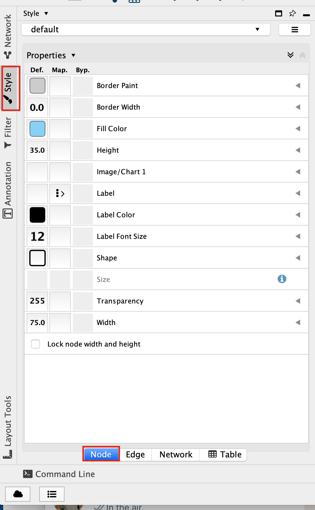

  1. Select the “Fill Color” field 
  1. expand it by clicking on the right arrow. 
  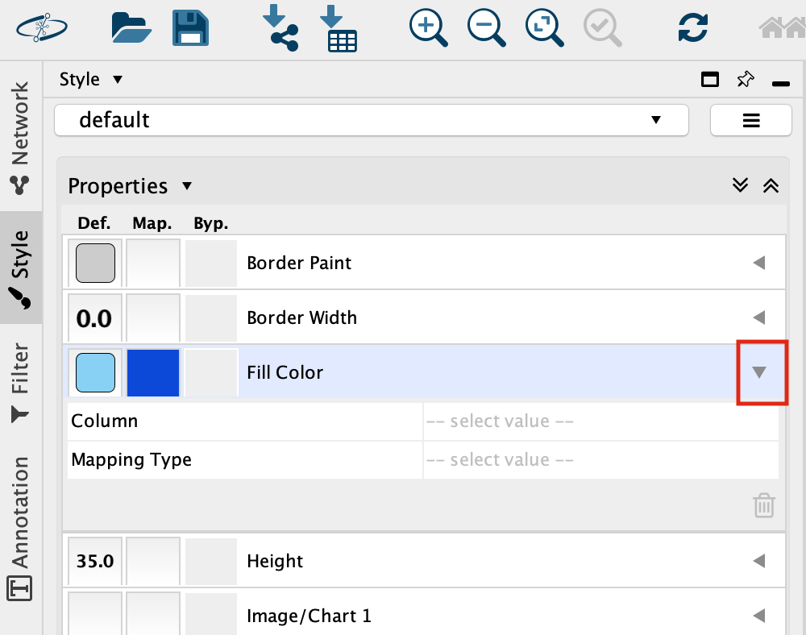
  
  1. Set “Column” to “expression” and “Mapping Type” to “Continuous Mapping”.
  
  
  1. This will change the colours of the nodes to the default colour coding.
  
  
  1. Double click on the continuos mapping colour box to manually adjust the colour and other settings.  
 
  1. At the bottom of the “Style” tab, check the box “Lock node width and height”.
  

  1. Select the “Size” field and 
  1. expand it by clicking on the right arrow. 
  1. Set “Column” to “mutation” and “Mapping Type” to “Continuous Mapping”.
  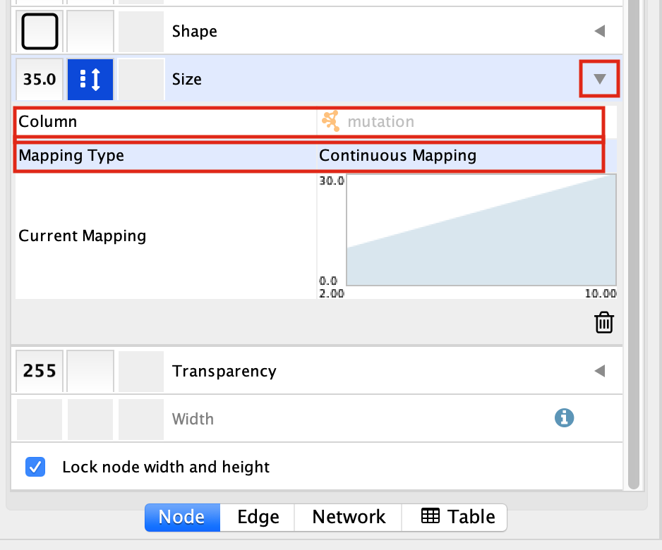
  
  1. Your resulting network maps expression to the colour of the node and the size of the node to the number of mutations.
  
```{block, type="rmd-bonus"}

  1. Adjust the setting on the colour mapping.  Change the colour scheme.  Change the maximum and minimum values.
  1. Adjust the setting on the size mapping.  Make the nodes bigger with higher values.
  1.  Eventhough the network is small, play around with the layouts.

```

## Exercise 2 - Work with larger networks

Cytoscape supplies a few demo networks that you can play around with.  When you open cytoscape you are presented with a Start Panel where you can choose to reload a previous session or load in one of the sample networks.  

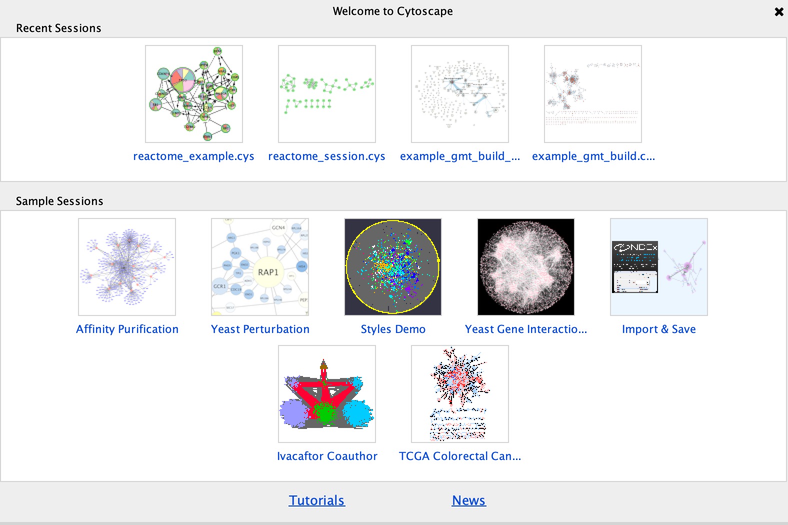

  1.  You do not need to re-open cytoscape to open the starter panel.  Locate the Cytoscape top menu bar and select **View**,--> **Show Starter panel**. 
  

  1.  Double click on the **Affinity Purification Network** to open it.

  1.  If you already have a session open then you will recieve a warning that the current session will be lost.  Before proceeding make sure your current session is saved.  (Click on cancel.  Then, **File** --> **Save as**)
  

  
  1. Once the network has loaded you will see a network of protein interactions derived from an affinity purification experiment.  Bait proteins are reprsented as pink hexagons and their corresponing prey proteins blue boxes. 
    

  1. Using this larger network play around with the different layouts
  
```{block, type="rmd-bonus"}  
  1. Search for the node "VPR"
  1. select all of the prey proteins associated with "VPR"
```

## Exercise 3 - Perform basic enrichment analysis using EnrichmentTable

In Module 2 we performed detailed enrichment analysis with g:profiler and GSEA.  We supplied gene lists and ranked expression sets in order to perform the analysis.  What if you want to run a quick enrichment analysis with a given network or a given subset of the network?  The easiest way to do this is to use the cytoscape app EnrichmentTable.  EnrichmentTable will query g:profiler directly with the given network or subnetwork.  Not all of the parameters can be tweaked from the enrichmentmap table but can be an easy way to quickly see enrichment results.

Select the bait VPR and all its associated prey proteins to use for an enrichment analysis. 

  1. In the search bar enter "VPR".  Press enter.
  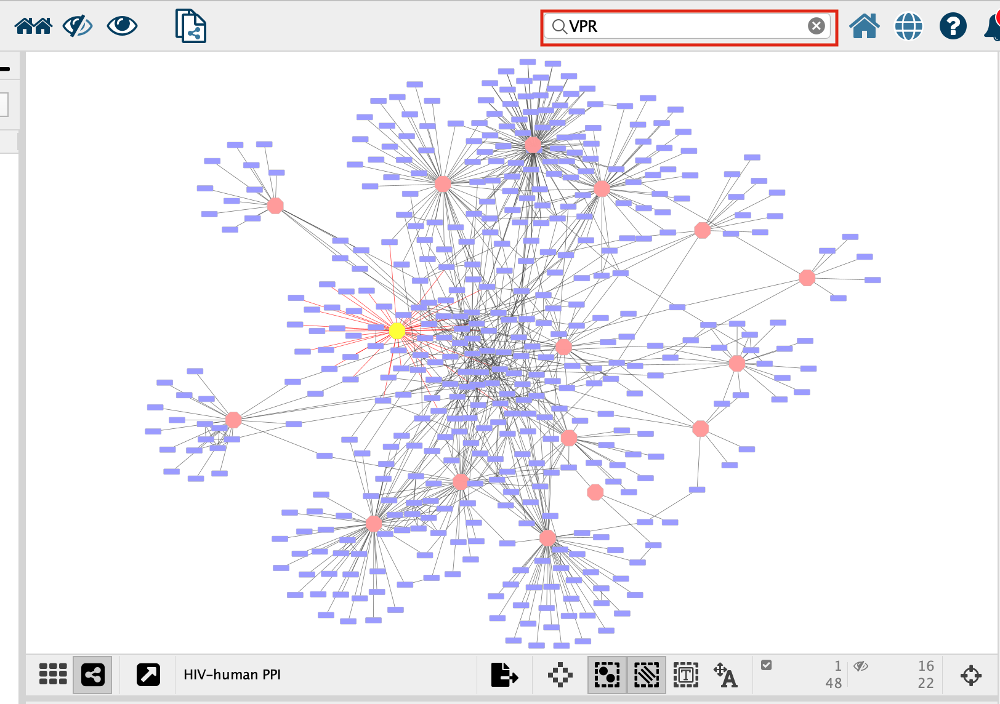
  
  1. VPR is now the only highlighted node in the network.  In order to select all its associated preys we need to select all the nodes that are connected to VPR, all of VPR's first neighbours.  There are two ways to select the first neighbours:
    i. In the top menu bar click on **Select** --> **Nodes** --> **First neighbors of selected nodes** --> **undirected**
    i. Click on the **first neighbor** button, , in the quick links button set.
  1. Click on the "Enrichment Table" in the Table Panel.
  1. Click on the cog icon in the top right hand corner of the Enrichment Table panel
  
  
  1. This will bring up a panel with the adjustable settings.  Change **Multiple testing correction** to fdr.
    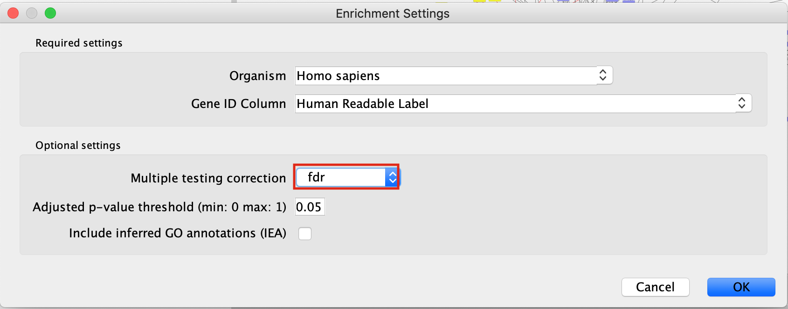
 
  

## Exercise 4 - Load network from NDex