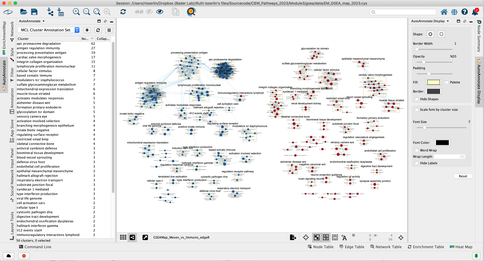
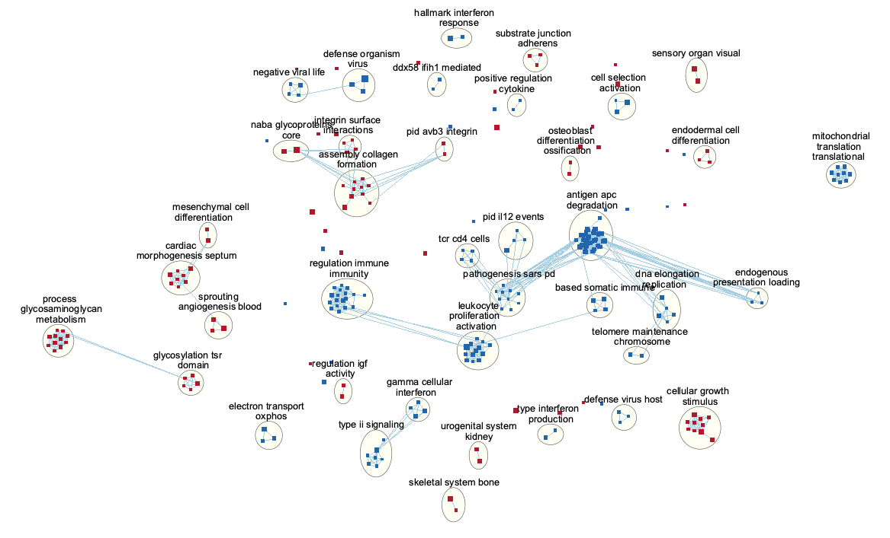

# Module 3 Lab: GSEA Visualization {#gsea_mod3}

**This work is licensed under a [Creative Commons Attribution-ShareAlike 3.0 Unported License](http://creativecommons.org/licenses/by-sa/3.0/deed.en_US). This means that you are able to copy, share and modify the work, as long as the result is distributed under the same license.**

 *<font color="#827e9c">By Veronique Voisin, Ruth Isserlin, Gary Bader</font>*

## Goal of the exercise:

**Exercise 1 - Create an enrichment map and navigate through the network**

During this exercise, you will learn how to create an EnrichmentMap from gene-set enrichment results. The enrichment tool chosen for this exercise is [GSEA](http://software.broadinstitute.org/gsea/index.jsp) but an enrichment map can be created from output from [GSEA](http://software.broadinstitute.org/gsea/index.jsp), 
[g:Profiler](https://biit.cs.ut.ee/gprofiler/gost),
[GREAT](http://great.stanford.edu/public/html/),
[BinGo](http://apps.cytoscape.org/apps/bingo), [Enrichr](https://amp.pharm.mssm.edu/Enrichr/) or alternately from any gene-set tool using the generic enrichment results format.

**Exercise 2 - Post analysis (add drug target gene-sets to the network)**

As second part of the exercise, you will learn how to expand the network by adding an extra layer of information.

**Exercise 3 - Autoannotate**

A last optional exercise guides you through the creation of automatically generated cluster labels to the network.

## Data

The data used in this exercise is gene expression data obtained from high throughput RNA sequencing.
The data correspond to Ovarian serous cystadenocarcinoma samples. We use precomputed results of the GSEA analysis [Module 2 lab - gsea](#gsea-lab) to create an enrichment map with the aim to transform the tabular format to a network so we can better visualize the relationships between the significant gene-sets:


GSEA outpus an entire directory of files and results.  For the purpose of this analysis we only need two tables found in the output directory. The output result tables are:

*	One table (*pos*) contains all pathways with an enrichment score (significant or not) related to enrichment of the mesenchymal category (positive score). (By default called - gsea_report_for_na_pos_#############.tsv)

*	One table (*neg*) contains all pathways with an enrichment score (significant or not) related to enrichment of the immunoreactive category (negative score). (By default called - gsea_report_for_na_neg_#############.tsv)

*	These 2 tables are uploaded using the EnrichmentMap App which will create a network of mesenchymal and immunoreactive pathways that have a significant score (FDR <= 0.0001) for clearer visualization of the results.

### EnrichmentMap

*	A <font color="red">red circle (node)</font> is a pathway specific of the mesenchymal type. (or pathway with mostly positively ranked genes)

*	A <font color="blue">blue circle (node)</font> is a pathway specific of the immunoreactive type. (or pathway with mostly negatively ranked genes)

*	An edge represents genes in common between 2 pathways (nodes).

*	A cluster of nodes represent overlapping and related pathways and may represent a common biological process or theme.

*	Clicking on a node will display the genes included in each pathway.

## Exercise 1 - GSEA output and EnrichmentMap

To start the lab practical section, first download the files.

```{block, type="rmd-datadownload"}
Right click on link below and select "Save Link As...".

Place it in the corresponding module directory of your CBW work directory.
```


7 Files are needed to create the enrichment map for this exercise (please download these files on your computer or alternately use the GSEA directory created in [module 2 lab - gsea](#gsea-lab) for files 1,2,3) :

1.	GMT (file containing all pathways and corresponding genes) - [Human_GOBP_AllPathways_no_GO_iea_September_01_2020_symbol.gmt](./Module3/gsea/data/Human_GOBP_AllPathways_no_GO_iea_April_02_2023_symbol.gmt)

2.	Enrichments 1 (GSEA results for the “pos” mesenchymal phenotype) - [gsea_report_for_na_pos_1682691208724.tsv](./Module3/gsea/data/gsea_report_for_na_pos_1682691208724.tsv)

3.	Enrichments 2 (GSEA results for the “neg” immunoreactive phenotype) - [gsea_report_for_na_neg_1682691208724.tsv](./Module3/gsea/data/gsea_report_for_na_neg_1682691208724.tsv)

4.	Expression (file containing the RNAseq data for all samples and all genes) - [MesenchymalvsImmunoreactive_rnaseq_expression.txt](./Module3/gsea/data/MesenchymalvsImmunoreactive_rnaseq_expression.txt)

5.	Rank file (file that has been used as input to GSEA) - [MesenchymalvsImmunoreactive_edger_ranks.rnk](./Module3/gsea/data/MesenchymalvsImmunoreactive_edger_ranks.rnk)
      

6.	Classes (define which samples are mesenchymal and which samples are immunoreactive) - [MesenchymalvsImmunoreactive_rnaseq_classes.cls](./Module3/gsea/data/MesenchymalvsImmunoreactive_rnaseq_classes.cls)

7.	Drug target database (preselection of 4 drugs and their target genes in the post analysis exercise, <http://www.drugbank.ca/>) - [Human_DrugBank_approved_symbol_selected.gmt](./Module3/gsea/data/Human_DrugBank_approved_symbol_selected.gmt)


Follow the steps described below at your own pace:

### Step 1

Launch Cytoscape and open EnrichmentMap App

**1a**. Double click on the Cytoscape icon

**1b**. Open EnrichmentMap App

* In the top menu bar:

   * Click on Apps -> EnrichmentMap 
 


A 'Create EnrichmentMap window is now opened.

### Step 2 

Create an enrichment map

**2a**. In the 'Create EnrichmentMap' window, add a dataset of the GSEA type by clicking on the '+' plus sign.


**2b**. Specify the following parameters and upload the specified files:

*	*Name*: leave default or a name of your choice like "GSEAmap"

*	*Analysis Type*:  GSEA

* *Enrichments Pos*: gsea_report_for_na_pos_1682691208724.tsv

* *Enrichments Neg*: gsea_report_for_na_neg_1682691208724.tsv

*	*GMT* : Human_GOBP_AllPathways_no_GO_iea_April_02_2023_symbol.gmt

*	*Ranks*: MesenchymalvsImmunoreactive_edger_ranks.rnk

*	*Expressions* : MesenchymalvsImmunoreactive_rnaseq_expression.txt. 
```{block, type="rmd-tip"}
This field is optional but recommended.
```   
*	*Classes*: MesenchymalvsImmunoreactive_rnaseq_classes.cls
```{block, type="rmd-tip"}
This field is optional.
```
*	*Phenotypes*: In the text boxes place *Mesenchymal*  as the Positive phenotype *Immunoreactive* as the Negative phenotype. Mesenchymal will be associated with red nodes because it corresponds to the positive phenotype and Immunoreactive will be associated with the blue nodes because it corresponds to the negative phenotype.

 *	Set FDR q-value cutoff to 0.0001 (= only gene-sets significantly enriched at a value of 0.0001 or less will be displayed on the map). 
```{block, type="rmd-tip"}
It will be displayed as  1E-04 in the scientific notation. 
```

**2c**. Click on *Build*


```{block, type="rmd-caution"}
We populated the fields manually. If you work with your own data, a way to populate automatically the fields is to drag and drop your GSEA folder in the 'Data Set' window. You are encouraged to give it a try once you finished the lab with your own GSEA results.
```

**Unformatted results**:

```{block, type="rmd-note"}
layout will be different for each user (there is a random seed in the layout algorithm) but it does not change the results or interpretation (the connections are the same, only the display is different).
```


### Step 3 

Navigate the enrichment map to gain a better understanding of a EnrichmentMap network. 

General layout of Cytoscape panel: In addition to the main window where the network is displayed, there are 2 panels: the Control Panel on the left side and the Table Panel at the bottom of the window. 

Steps: 

**3a**. In the Cytocape menu bar, select *View* and *Show Graphic details*. It will turn the squared nodes into circles and the gene-set labels will be visible. 
  


**3b**: Zoom in or out using + or - in toolbar or scroll button on mouse until you are able to read the labels comfortably.
 


**3c**:  Use the bird’s eye view (located at the bottom of the control panel) to navigate around the network by moving the blue rectangle using the mouse or trackpad.


  
**3d**: Click on an individual node of interest.

For this example, you could use *Integrin signalling pathway*. 

```{block, type="rmd-tip"}
If you are unable to locate *Integrin signalling pathway*, type "Integrin signalling pathway" in the search box (quotes are important).  Selected nodes appear yellow (or highlighted) in the network.
```

**3e**. In the Table Panel in the *EM Heat map* tab change:

* Expressions: *Row Norm*

* Compress: *-None-*


  
```{block, type="rmd-tip"}
Genes in the heatmap that are highlighted yellow (rank column)  represent genes that are part of the leading edge for this gene set, i.e. contributed the most to the enriched phenotype.<br> Leading edge genes will only be highlighted if an individual node has been selected and the Enrichment Map was created from GSEA results.<br><br> *Troubleshooting*: if you don't see the sort column highlighted in yellow, reselect the node of interest and click on the GSEARanking Data Set 1 text in the EM Heatmap tab.
```

### Step 4

Use Filters to automatically select nodes on the map: Move the blue nodes to the left side of the window and the red nodes to the right side of the window.

**4a**. Locate the *Filter* tab on the side bar of the *Control Panel*.

**4b**. Click on the + sign to view the menu and select *Column Filter*.

**4c**. From the *Choose column …* box, select *Node: NES_dataset1* and set filter values from -2.94 and 0 inclusive.

**4d**. The blue nodes are now automatically selected. Zoom out to be able to look at the entire network and drag all blue nodes to the left side of the screen.
  


**4e**. Optional. Change *is* to *is not* to select the red nodes.
  


```{block, type="rmd-note"}
The red pathways (nodes) are specific to the mesenchymal phenotype. They were listed in the *pos* table of the GSEA results. The enrichment score (ES) values in this table are all positive values.<br> 

The blue pathways are specific to the immunoreactive phenotype and were listed in the *neg* table of the GSEA results. The ES values in this table are all negative values. <br><br>

This is the information we used as the filtering criteria.
```

## Exercise 2 - Post analysis (add drug target gene-sets to the network)

### Step 5

Add drug target gene-sets to the network (Add Signature Gene-Sets...).

**5a**. In Control Panel, go to the EnrichmentMap tab and click on "Options..." located above the 'Data Sets:' box. Select "Add Signature Gene Sets...". A window named "EnrichmentMap: Add Signature Gene Sets (Post-Analysis) is now opened.


**5b**. Using the 'Load from File...' button, select the *Human_DrugBank_approved_symbol_selected.gmt* file that you saved on your computer.


**5c**. Click on "Finish". 

```{block, type="rmd-note"}
Four additional nodes are now added to the network and visible as grey diamonds. 

Dotted orange edges represent their overlap with the nodes of our network. 

These additional nodes represent gene targets of some approved drugs and these genes are either specific of the mesenchymal type (dotted orange edges connected to red nodes) or specific of the immunoreactive type (dotted orange edges connected to blue nodes).
```  


```{block, type="rmd-tip"}
more info using this link: https://enrichmentmap.readthedocs.io/en/latest/PostAnalysis.html
```

## Exercise 3 - Autoannotate the Network

### Step 6

Auto-annotate the network with cluster labels.

```{block, type="rmd-note"}
The Apps WordCloud, ClusterMaker and Autoannotate have to be installed. (they should have been installed during the pre-workshop set up)
```

```{block, type="rmd-note"}
if you ran step 5, <br>

**delete the drug targets diamond nodes and associated edge before performing step 6**:<br> 
  * select the 4 nodes and associated dotted orange edges by browsing the mouse and 
  * click "delete" on your keyboard or
  * in the Cytoscape menu, 'Edit', 'Delete Selected Nodes and Edges'.<br><br>
  
**Alternately, in the Enrichment Map Input Panel in the Datasets box, un-select "Human_Drugbank_approved_symbol_selected" to hide the post analysis nodes.** 
```

**6a**. In the menu bar, select *Apps*, *AutoAnnotate*, *New Annotation Set …*. An *Autoannotate: Create Annotation Set* window pops up. Leave default settings and click on *Create Annotations*.  


In the case that an *AutoAnnotate* window pops up with the message *AutoAnnotate will manage all groups in this network view*, click *OK*.
  


```{block, type="rmd-note"}
The network is now subdivided into clusters that are represented by ellipses. Each of these clusters are composed of pathways (nodes) interconnected by many common genes. These pathways represent similar biological processes. The app WordCloud take all the labels of the pathways in one cluster and summarize them as a unique cluster label displayed at the top of each ellipse. 
```

```{block, type="rmd-tip"}
**Tip 1**: further editing and formatting can be performed on the AutoAnnote results using the *AutoAnnotate Display* in the *Results Panels* located at the right side of the window.<br> For example, it is possible to change Ellipse to Rectangle, uncheck *Scale font by cluster size* and increase the *Font Scale* using the scaling bar. It is also possible to reduce the length of the cluster label by checking the "Word Wrap" option.

**Tip 2**: The AutoAnnotate window on the left side in Result Panel contains the list of all clusters. Clicking on a cluster label will highlight in yellow all nodes in this cluster. It is then easy to move the nodes using the mouse to avoid cluster overlaps. 
```




**6b**. If your network is dense and clusters are overlapping, there is an option in AutoAnnotate that you can try that expands the network to prevent cluster overlap. In the menu bar, select *Apps*, *AutoAnnotate*, *New Annotation Set …*. An *Autoannotate: Create Annotation Set* window pops up. Check the *Layout network to prevent cluster overlap* and click on *Create Annotations*.  




## Exercise 4 (Optional) - Explore results in GeneMANIA or STRING

Each node in the Enrichment map represents a biological process or pathway.  It consists of a collection of genes.  Often we want to know how the genes in that group interact.  There are many different ways you can investigate the underlying interactions for the given group.  Some involve searching online databases and others are directly integrated into cytoscape.

* [GeneMANIA](https://genemania.org/) - an integrative database of gene connections including co-expression, protein interactions, genetic interactions, pathways and more. **Cytoscape App**
* [String](https://string-db.org/) - an integrative database of gene connections including co-expression, protein interactions, genetic interactions, pathways and more. **Cytoscape App**
* [Pathway Commons](https://www.pathwaycommons.org/) - a intergrative database of pathways.  (There is a beta feature in EM to show your pathway in the painter app, a pathway common web page that overlays your expression data on the given pathway.  Still in beta testing and requires expression data to work correctly so won't work for this example)

### Step 7

Visualize genes in a pathway/node of interest using the apps STRING and GeneMANIA. This will create a protein-protein  interaction network using the genes included in the pathway. Note: We will go more in depth into [GeneMANIA in module 5](#genemania_cytoscape)

**7a**: Click on an individual node of interest.

For this example, you could use *cellular response to BMP*. 

```{block, type="rmd-tip"}
If you are unable to locate *cellular response to BMP*, type "cellular response to BMP" in the search box (quotes are important).  The selected node appears yellow (or highlighted) in the network. If you have annotated your network, it should be included in the *restricted smad bmp* cluster.
```

**7b**: Right Click on the node of interest to diplay the option menu. Select *Apps*,--> *EnrichmentMap - Show in STRING*<br>


```{block, type="rmd-tip"}
Patience.  :) . It might take a few seconds for the *String Protein Query* window to open.
```

* A *STRING Protein Query* box appears.
* Select *Select genes with expression*.
* Click on *OK*. 


* The resulting network will look something like this.


```{block, type="rmd-question"}
Explore the features and data of each Cytoscape app.<br>What happens to the network if you change the initial parameters like *Confidence cutoff* or *Max Additional interactors* <br><br>


```


**7c**:Go back to enrichment map network. 

* In Control Panel (left side of the window), select the "Network" tab and click on the Enrichment Map network as shown in below screenshot. 


**7d**: Search again for the node labelled *cellular response to BMP* as in Step 7a. 

* Right Click on the node of interest to diplay the option menu. Select *Apps*,--> *EnrichmentMap - Show in GeneMANIA*<br>


* A *GeneMANIA Query* box appears.
* select *Select genes with expression*.
* Click on *OK*. 


* A pop up will appear indicating that it is currenlty querying GeneMANIA


* The resulting network will look similiar to the below screenshot.


```{block, type="rmd-tip"}
It is possible to view gene expression data for the nodes in the STRING network. See the section https://enrichmentmap.readthedocs.io/en/latest/Integration.html and try it out after the workshop. 
```


```{block, type="rmd-caution"}
SAVE YOUR SESSION FILE!
```
 
___

## Bonus - Automation. 

Run analysis directly from R for easy integration into existing pipelines.

```{block, type="rmd-bonus"}
Instead of creating an Enrichment map manually through the user interface you can create an enrichment map directly using the [RCy3 bioconductor package](https://www.bioconductor.org/packages/release/bioc/html/RCy3.html) or through direct rest calls with [Cytoscape cyrest](https://apps.cytoscape.org/apps/cyrest).  

Follow the step by step instructions on how to run from R here - https://risserlin.github.io/CBW_pathways_workshop_R_notebooks/create-enrichment-map-from-r-with-gsea-results.html

First, make sure your environment is set up correctly by following there instructions - https://risserlin.github.io/CBW_pathways_workshop_R_notebooks/setup.html
```
