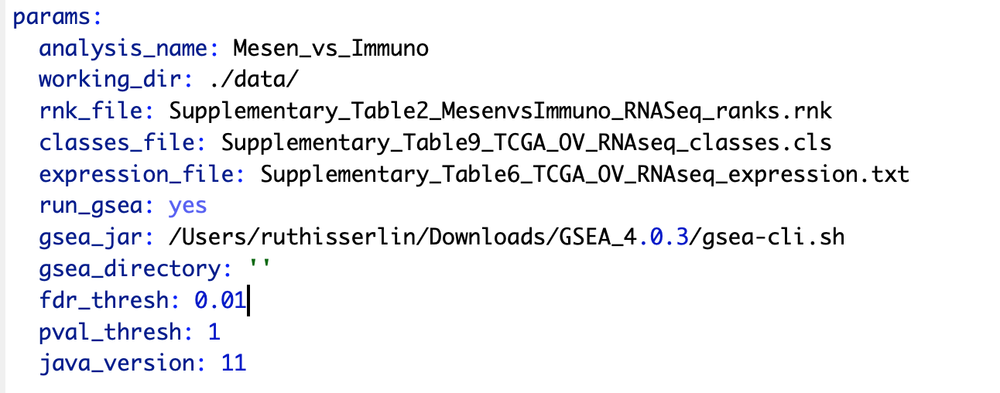

# Module 3 Lab: (Bonus) Automation {#automation}

**This work is licensed under a [Creative Commons Attribution-ShareAlike 3.0 Unported License](http://creativecommons.org/licenses/by-sa/3.0/deed.en_US). This means that you are able to copy, share and modify the work, as long as the result is distributed under the same license.**

 *<font color="#827e9c">By Ruth Isserlin</font>*
 
## Goal of the exercise:

**Run an enrichment analysis and Create an enrichment map automatically from R/Rstudio**

During this exercise, you will apply what you have learnt in Module 2 labs and Module 3 labs but instead of performing them manually you will automate the process using R/Rstudio.  We will use all the same data and programs we used in the previous labs but we will control them from R. 

### Set Up

Before starting this exercise, 

1. Install R and RStudio (if not already installed)
  * For these exercises you also require Rstudio.  If you do not already have RStudio installed please follow the below instructions to install it. 

  a. Install R.
  * Go to: https://cran.rstudio.com/
  


  * If installing on Windows select "install R for the first time" to get to the required package.
    
  

  * Download and install
    
     

  b. Install R Studio.

    * Go To https://rstudio.com/products/rstudio/download/#download
    * Install RStudio for your platform
    
2. Download example R notebooks from https://github.com/BaderLab/Cytoscape_workflows.

  * This repository contains example R Notebooks that automate the enrichment map pipeline.  
  * There are two ways you can download this collection:

    a. If you are familiar with git then we recommend you fork the repo and use it like you would use any github repo. 

    

    b. download the collection as a zip file - unzip folder and place in CBW working directory

    

```{block, type="rmd-tip"}
If you are new to git and want to learn more about code versioning then we recommend you read the following [tutorial](https://guides.github.com/introduction/git-handbook/)
And check out [Github Desktop](https://desktop.github.com/) - a desktop application to communicate with github. 
```

### Step 1 - launch RStudio

  * Launch RStudio by double clicking on the installed program icon.

### Step 2 - create a new project

  * Create a new project - File -> New R Project ...
  
  

  * Select Create project from - "Existing Directory"

  

  * Click on the Browse button

  

  * Navigate to the EnrichmentMapPipeline directory that is found in the directory you downloaded and unzipped from github.  (for example, if it is still in your downloads directory go to ~/Downloads/Cytoscape_workflows/EnrichmentMapPipelines)

  
  
### Step 3 - Open example up RNotebook 

  * Open the RNotebook **Protocol2_createEM.Rmd**

    * Go to File --> Open File ...

      
    * Click on **Protocol2_createEM.Rmd**

```{block, type="rmd-tip"}
If the file is not found in the first directory that RStudio opens up then go back and make sure that you created an Rproject from an "Existing directory" in the previous step. 
```

### Step 4 - Define Notebook parameters

```{block, type="rmd-tip"}
Setting up Notebooks with parameters allows you to re-run the same notebook with different datasets very easily.  Whereever possible create notebooks with parameters so you can re-use them 
```




Descriptions of each of the parameters:

  1. **analysis_name** - change this field to whatever you want your analysis to be called.  GSEA directories generated will be named using this string.  It will have additional characters added to it as GSEA generates a random number that it associates with each of its output directories.
  1. **working_dir** - path to directory containing the data files we will be analyzing. 
  1. **rnk_file** - NOT Optional.  This notebook runs GSEA preranked and this is the only file that is required.  for details on the specifications of this file see [Module 3 - gsea lab](#gsea_lab). 
  1. **class_file** - (Optional) this file is a GSEA specific data file and is used for better visualization in the heat map viewer of enrichment map. For details of the creation of this file see - [GSEA documentation - class files](https://software.broadinstitute.org/cancer/software/gsea/wiki/index.php/Data_formats#Phenotype_Data_Formats) 
  1. **expression_file** - (Optional) this file contains the expression values for each of the experiments used in to create your rank file.  It is used for better visualization in the heat map viewer of enrichment map.
  1. **run_gsea** - set to yes or no.  This variable specifies whether the notebook should run GSEA. GSEA can take a while to run so if you have already performed the GSEA analysis and simply want to create an enrichment map you can set this variable to "no".  **If this variable is set to no then you need to specify the path and the name of the GSEA directory in "gsea_directory" parameter.**
  1. **gsea_jar** - full path to the gsea jar.  In the latest version of GSEA this is actually a bat(for windows users) or a sh (for moc and linux users) script.  If using GSEA 3.0 or older set this variable to the full path to the gsea.jar **We do not recommend using GSEA 3.0 or older versions**
  1. **gsea_directory** - full path to gsea results directory.  Only populate if run_gsea is set to "no".
  1. **fdr_threshold** - FDR threshold used to create enrichment map
  1. **pval_thresho** - pvalue threshold used to create enrichment map
  1. **java_version** - for backwards compatibility.  For users using previous version of GSEA and older versions of java. 
  
For this initial analysis change:

  1. **gsea_jar** - change to the full path to the gsea jar that you were instructed to download in your pre-workshop setup instructions
  
```{block, type="rmd-caution"}
This is not the same as the GSEA application that we used in Module 2 gsea lab.

```

### Step 5 - Step through notebook to run the analysis

The RNotebook is a mixture of markdown text and code blocks.  

Read through the notebook to understand what each section is doing and sequentially run the code blocks by clicking on the play button at the top right of each code block.


### Exercises

Once you have run through the notebook and created your enrichment map automatically try the following:

  1. change the fdr threshold and create a new network (**without rerunning the whole notebook**) with the lower FDR threshold.
  1. change the similarity coeffecient and create a new network (**without rerunning the whole notebook**) with the lower FDR threshold.
  1. re-run the notebook using the GSEA results you created on the first run without running GSEA.
  1. Modify notebook to run with a different gmt file.  (Downloaded from somewhere else or a different file found on [baderlab genesets download site](http://download.baderlab.org/EM_Genesets/current_release/))
  1. Open the notebook Supplementary_Protocol5_Multi_dataset_theme_analysis.Rmd and run through it to create a multi dataset enrichment map.
  
### Additional resources

Check out all the different notebooks available [here](https://cytoscape.org/cytoscape-automation/for-scripters/R/notebooks/)
