# Module 4 Lab: ReactomeFI {#ReactomeFI}

**This work is licensed under a [Creative Commons Attribution-ShareAlike 3.0 Unported License](http://creativecommons.org/licenses/by-sa/3.0/deed.en_US). This means that you are able to copy, share and modify the work, as long as the result is distributed under the same license.**

 *<font color="#827e9c">By Veronique Voisin, Chaitra Sarathy and Ruth Isserlin</font>*

## Goal of this practical lab 

**Aim**: This practical lab will provide you with an opportunity to perform pathway and network analysis using the Reactome Functional Interaction (FI) network and the [ReactomeFIViz Cytoscape app](https://apps.cytoscape.org/apps/reactomefiplugin). 

**Goal**: Analyze gene lists to identify biology that contributes to cancer.


## Data: download the following files on your computer before starting the practical lab.

```{block, type="rmd-datadownload"}
Right click on link below and select "Save Link As...".

We recommend saving all these files in a personal project data folder. We also recommend creating an additional result data folder to save the files generated while performing the protocol.

```


 * Download [PanCancer_drivers_genelist.txt](./Module2/gprofiler/data/Pancancer_genelist.txt)
 * Download [PanCancer_drivers_genelist_with_mutation_frequency.txt](./Module4/Reactome/data/Pancancer_frequency.txt)
 *  Download  [MesenchymalvsImmunoreactive_edger_ranks.rnk](./Module2/gsea/data//MesenchymalvsImmunoreactive_edger_ranks.rnk)

## Exercise 1: Use the Reactome Functional Interaction (FI) Network

**Objectives:** 

The objective of this exercise is to create a Reactome Functional Interaction (FI) network using the pan-cancer gene list from exercise 1. 

In this exercise, we create a network using all genes in our list. In the network that we are creating, each gene is a node and all genes known to interact or are predicted to interact with each other are connected. 

Please remember, this gene list comes from the set of genes frequently mutated in diverse types of cancer (it is the same list used in our previous module). Interestingly, this network might show us that although these genes were associated with different cancers, they might be biologically connected and might function in common biological pathways and protein complexes and represent hallmarks of cancer.

**Data:** 

```{block, type="rmd-datadownload"}
Right click on link below and select "Save Link As...".

Place it in the corresponding module directory of your CBW work directory.
```

Download: 

  * [Pancancer_genelist.txt](./Module2/gprofiler/data/Pancancer_genelist.txt)
  * [pancancer_frequency_table.txt](./Module4/Reactome/data/pancancer_frequency_table.txt)

**Steps:**

  * Create the network:
    i. Open up Cytoscape.  
    i. Go to *Apps* --> *Reactome FI* --> *Gene Set/Mutational Analysis*
    i. Choose "2021 (Latest)" Version. 
    i. Upload/Browse [Pancancer_genelist.txt](./Module2/gprofiler/data/Pancancer_genelist.txt) file.     i. Select **Gene set** 
    i. Select **Fetch FI annotations**.
    i. Select **Show genes not linked to other**
    i. Click OK.

 <p align="center">
 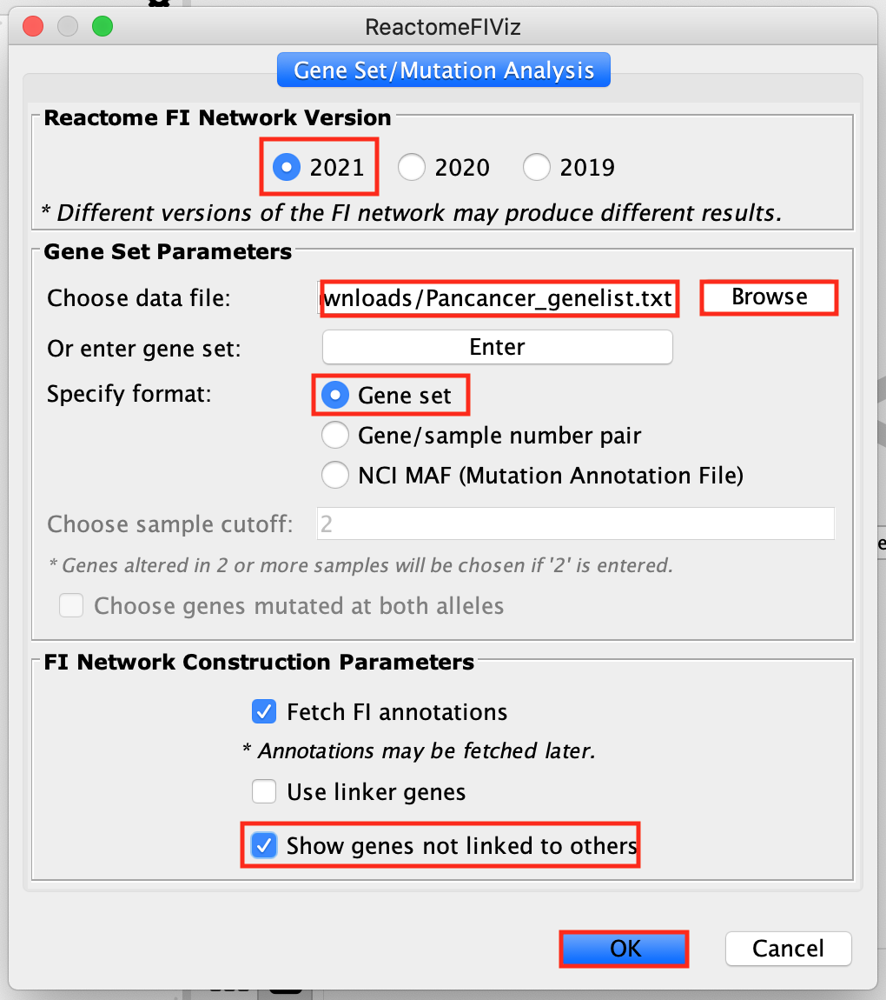
 </p>

  * Resulting network:
 <p align="center">
 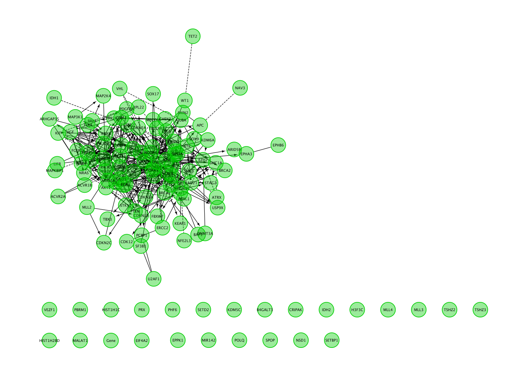
 </p>

### Question 1: Describe the size and composition of the network?

 <p align="center">
 
 </p>

The total number of genes in the network is 127. 

103 of these genes are connected to each other by functional interactions. You can get this information by selecting all genes that you see connected to each others.

The total number of edges or interactions is 473. 

The genes that are interacting together might work together in some sort of protein complex in the cells. 

The FI network was constructed by merging interactions extracted from human curated pathways from Reactome with interactions predicted using a machine learning approach. The non curated sources of information include:

  * protein-protein interactions, 
  * gene co-expression, 
  * protein domain interaction, 
  * Gene Ontology (GO) annotations
  * text-mined protein interactions.
  
  Solid edge between 2 nodes are interaction from curated pathways and dashed line are predicted interaction. (https://www.ncbi.nlm.nih.gov/pmc/articles/PMC2898064/).
 
 <p align="center">
 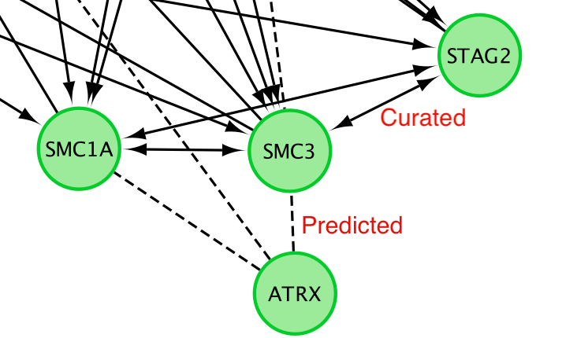
 </p>


### Question 2: After clustering, how many modules are there?

ReactomeFI has a clustering option which groups genes that are more connected to each other into modules.

  * Cluster the network:
    i. Right-click on a blank space of the network
    i. select **ReactomeFI** --> **Cluster FI Network**.

 <p align="center">
 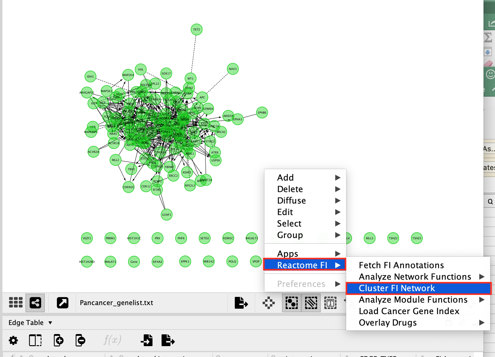
 </p>
 
Nodes are now colored by modules.

  <p align="center">
 
 </p>
 
  i. Look at the table **Network Module Browser** to find out the number of modules.It is located in the Table Panel located below the network. 
  i. Click on each module to highlight each genes in the module.

  <p align="center">
 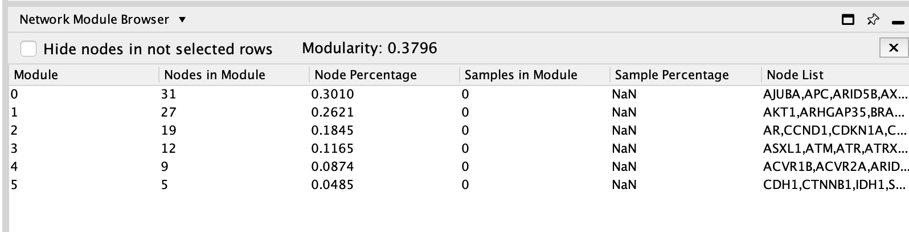
 </p>

  * The connected network has been divided into 5 modules. Module 0 contains the most genes (31).
  * The MCL clustering algorithm is used to cluster the network and it is based on the number of interaction (edges) between the nodes.


  *  **Redo the layout for clarity**:
    i. Go to Cytoscape menu bar, 
    i. select **Layout** --> **yFiles Organic Layout**.

  <p align="center">
 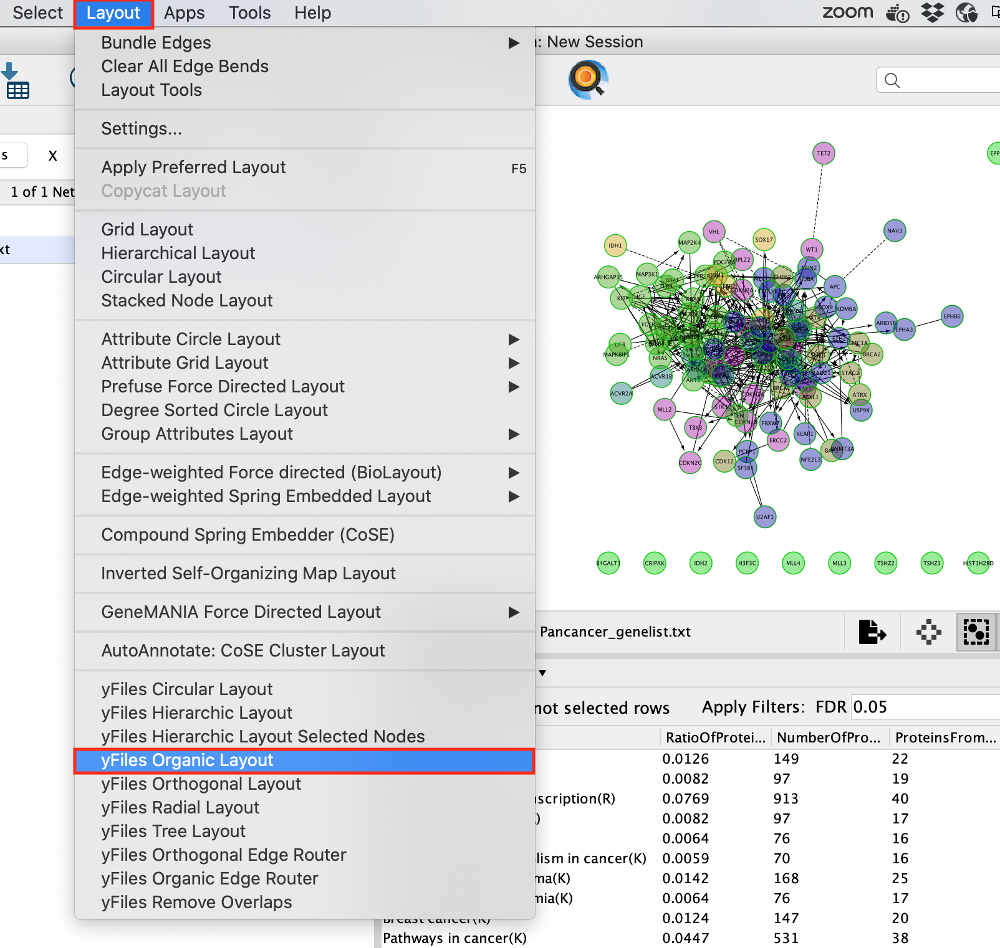
 </p>
 
  * Explore the resulting network.
 
  <p align="center">
 
 </p>
 

 
```{block, type="rmd-bonus"}
Can you recreate the below image using one of the Cytoscape layout options?

 <p align="center">
 
 </p>
 
```
 
### Query information about the interaction between 2 genes:


  * Click on a solid line.

```{block, type="rmd-tip"}
You might need to zoom in on the network in order to select an individual edge. 
```

  i. Once the edge is highlighted in red, right click on it and select **ReactomeFI** --> **Query FI Source**. 

  <p align="center">
 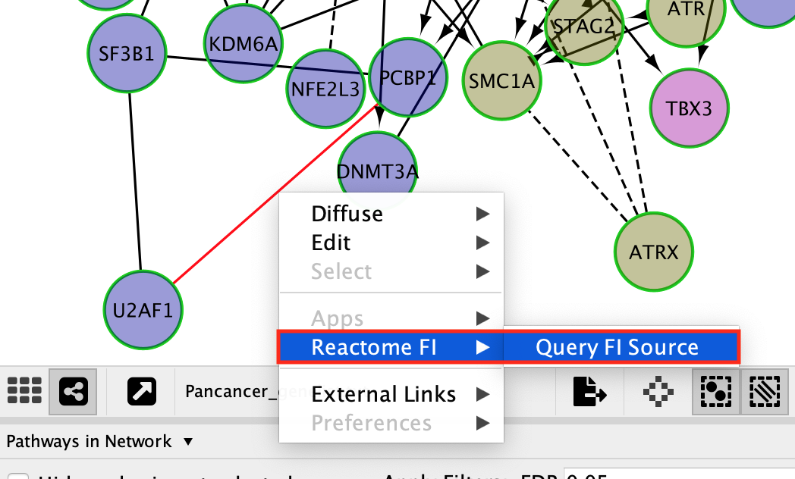
 </p>
 
 QueryFI Source will open a window with a list of the set of pathways that this interaction is found in.
 
   <p align="center">
 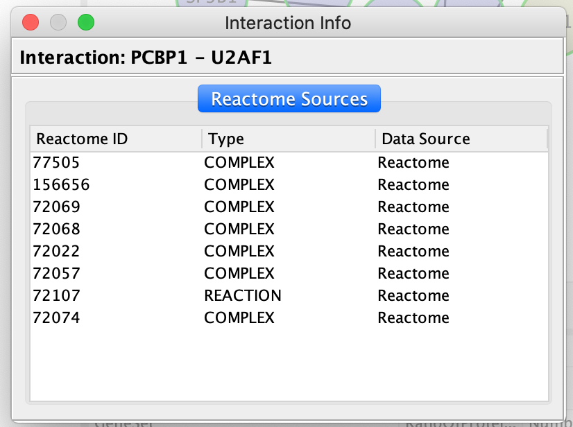
 </p>
 
  * Click on a dashed line.  
    i. Once it is highlighted in red, 
    i. right click on it and select **ReactomeFI** --> **Query FI Source**.

   <p align="center">
 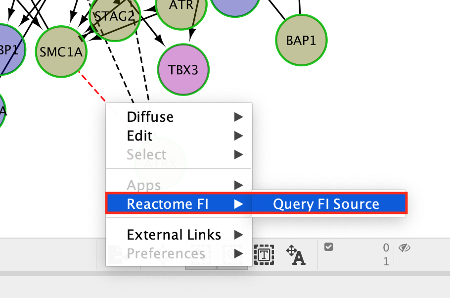
 </p>
 
 The Query FI source will include a list of prediction sources as well as the overall score associated with this prediction.
 
```{block, type="rmd-tip"}
The FI score can be used to filter interactions and keep the interactions with the highest scores.
``` 
   <p align="center">
 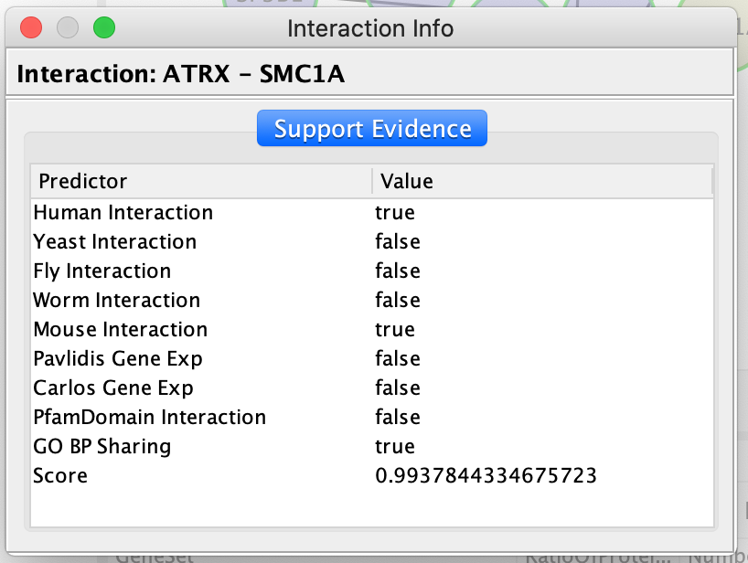
 </p>
 
  * To get an information about a gene. 
    i. Right-click on a gene 
    i. select **ReactomeFI** --> **Query Gene Card**
    i. This will open a web page containing all the information about the gene that is contained in the [gene cards database](https://www.genecards.org/).  
    i.  You can also select **Fetch FI** to get information about this gene in the ReactomeFI network
    i.  You can also select **Fetch Cancer Gene Index** to get information about this gene in the [Cancer gene index](https://wiki.nci.nih.gov/display/cageneindex/Creation+of+the+Cancer+Gene+Index)
    i.  You can also select **Query Cosmic** to get information about this gene in [Cosmic](https://cancer.sanger.ac.uk/cosmic)
 
   <p align="center">
 
 </p>
 
 
### Question 3: What are the most significant pathways in each module?

Pathway analysis can be performed on the whole set of genes from the network. It can also be performed individually on each module.

  * right-click, Analyze **Network** Functions,--> Pathway Enrichment,  as opposed to, 
  * right-click, Analyze **Module** Functions,--> Pathaway enrichment. 
  
  This way, the original network can be divided into smaller modules of interacting proteins and labelled according to the module pathway enrichment results.

  * Pathway enrichment of Modules
    i. Right-click on a blank space of the network window
    i. Select **Reactome FI** --> **Analyze Module Functions** --> **Pathway enrichment**

<p align="center">
 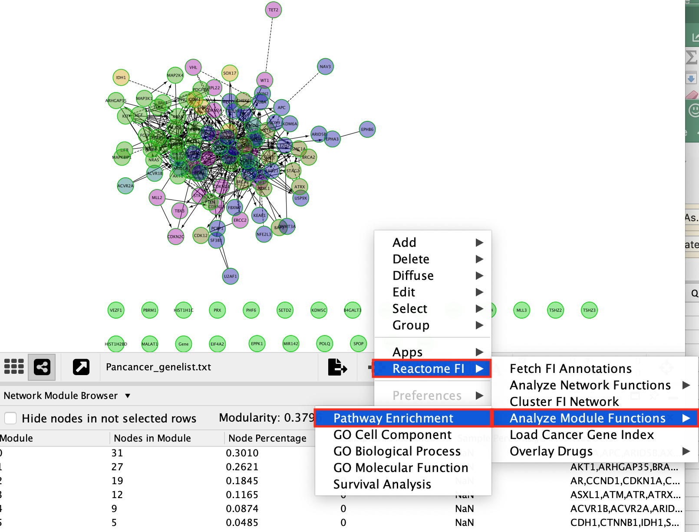
</p>

  i. A **Choose Module Size** window appears. 
  i. This parameter enables the user to select a minimum number of genes required in the module in order to include itin the pathway analysis. 
  i. Leave the module size as the default of 5.
  i. Once the pathway analysis has finished running, a **Pathways in Modules** table appears in the Table Panel located below the network. Pathways are ordered by best FDR values (closer to 0) for each module. 

  <p align="center">
 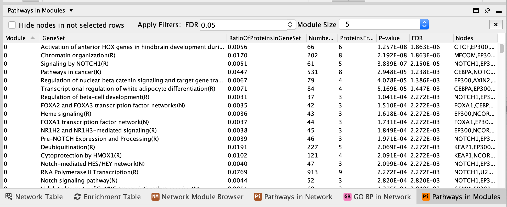
 </p>
 
  i. Click on some of the pathways for each module. It will highlight the genes in our network that are part the selected pathway.
  * For example,
    i. Select *RAF/MAP kinase cascade (R)*.
      * It is one of the most significant pathways of module 1. 
      * There are 14 genes in this pathway that are also in module 1. 
      * Module 1 has a total of 27 genes. (The number of genes in each module can be found in the **Network Module Browser** tab)
      * The associated FDR value is 6.55e-15 which is very close to 0 and it means that this overlap of 14 genes isn't likely to be obtained by chance only.
 
 
**Try it out yourselves:**

- try *GO Biological Process* enrichment on modules: 
    i. **Reactome FI** --> **Analyze Module Functions** --> **GO Biological Process**
- try *pathway* or *GO Biological Process*  enrichment on the full network: 
    i. **Reactome FI** --> **Analyze Network Functions** --> **GO Biological Process**
    i. **Reactome FI** --> **Analyze Network Functions** --> **Pathway Enrichment**

<p align="center">
 
</p>


```{block, type="rmd-note"}
It is possible to undock tables for better clarity using the pin icon located at the top right corner of the Table Panel. 
```


### Set the size of the nodes proportional to the mutation frequencies in each cancer

Our gene list contains the genes with high frequency in several cancers. Table  [PanCancer_drivers_genelist_with_mutation_frequency.txt](./Module4/Reactome/data/Pancancer_frequency.txt) contains the mutation frequency of these genes in 10 cancer types. We are going to import this table into Cytoscape and set the size of the nodes using these column values.

- In the Cytoscape menu bar, 
    i. select **Import** --> **Table from File...**

<p align="center">
 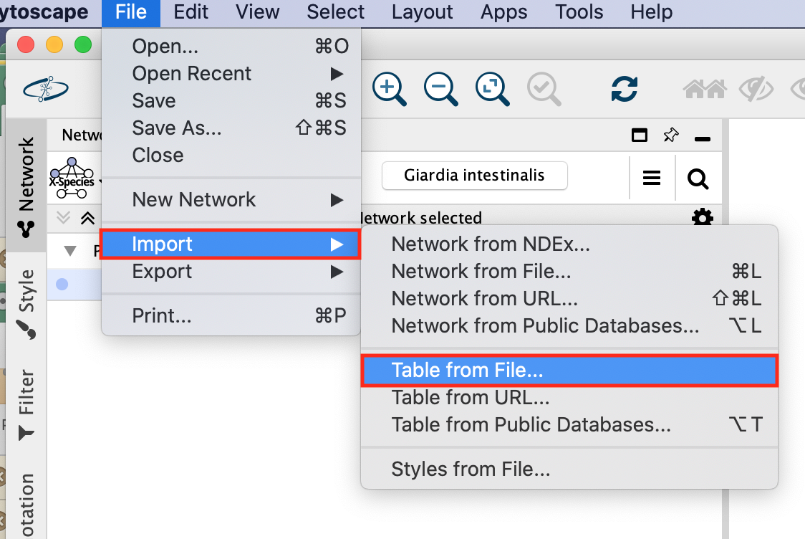
</p>

  i. In the window **Import Columns From Table**, make sure that **Import Data as:** is set to **Node Table Columns**.
  i. Click **OK**.
 
   <p align="center">
 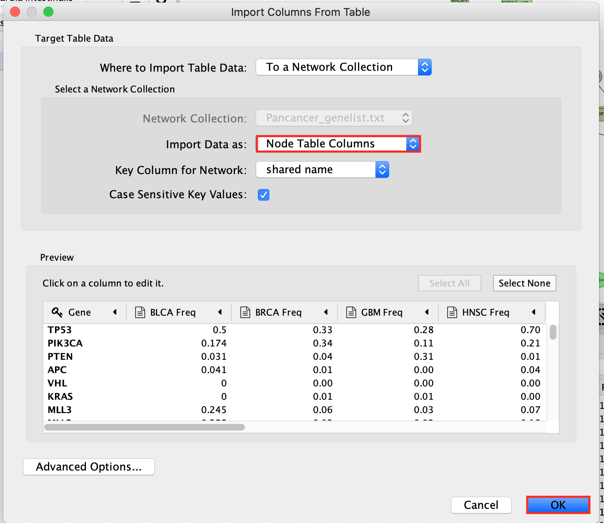
 </p>
 
 Now that the table is imported, we can use the values in the table columns as Properties to set a style or to filter the network. 
 
 We are going to set the size of the nodes.
 
  i. Look for the **Style** tab in the Control Panel located at the left of the Cytoscape window. Select.
  i. Click on the down arrow beside **Properties** and select **Size** on the list.


   <p align="center">
 
 </p>
 
  i. Select the **Size** field and expand it using the down arrow.
  i. In the  **Column** field, click on **--select value--** and choose **BLCA Freq**. 

   <p align="center">
 
 </p>
 
  i. In the **Mapping Type**, click on **--select value--** and choose **Continuous Mapping**.
  i. Click on the diagram

   <p align="center">
 
 </p>
 

  i. Set the first pivot **Handle Position** and the second pivot **Handle Position** to 100.  To set the pivot click on the arrow you would like to set and then adjust the value specified next to Node Size.  Make sure to press enter once you have updated the value in order for it to be registered.
  i. Click OK
 
 
   <p align="center">
 
 </p>
 
- Now the biggest nodes correspond to genes with highest mutation frequency in the BCLA cancer (Bladder cancer). 
 
   <p align="center">
 
 </p>

 ```{block, type="rmd-tip"}
 You can change the column value to other cancer types and observe the differences.
```

### Play around with the styles: change transparency and colors

Here are the steps if you need to change the colors of the module to create a figure for publication.

- In Style, go to the ** Transparency** field and replace 100 by 200. Try different numbers.
   <p align="center">
 
 </p>

- If some of the colors are too dark, it is possible to modify the cluster colour by selecting the field **Fill Color** in properties in the Styles tab:
    i. double-click on a color.
  
<p align="center">
 
</p>

  i. choose a new one. (This will need to be done for each colour you want to change.)

<p align="center">
 
</p>

- The resulting network

   <p align="center">
 
 </p>

### Create a pie chart

As we have the mutation frequencies for several cancer types, it would be useful to be able to compare all cancer frequencies at the same time in the same network. It is possible to do this by plotting a pie chart for each gene (node) with each pie slice representing the mutation frequency for each cancer. 

  * Here are the steps to do it:
    i. In Style, click on the down arrow close to **Properties** and select **Paint**, -->  **Custom Paint1** --> **Image/Chart 1**. 
    
  <p align="center">
 
 </p>
 
  i. A **Graphics** windows pops up. 
  i. In **Chart**, select the piechart icon.
  i. In **Available Columns**, select the columns that you want to include in your pie chart (here 8 cancer types) and click on the arrow to move them over to the *Selected Columns*.

  <p align="center">
 
 </p>
 
  i. They are now placed in the **Selected Columns** window. Click on **Apply**.

  <p align="center">
 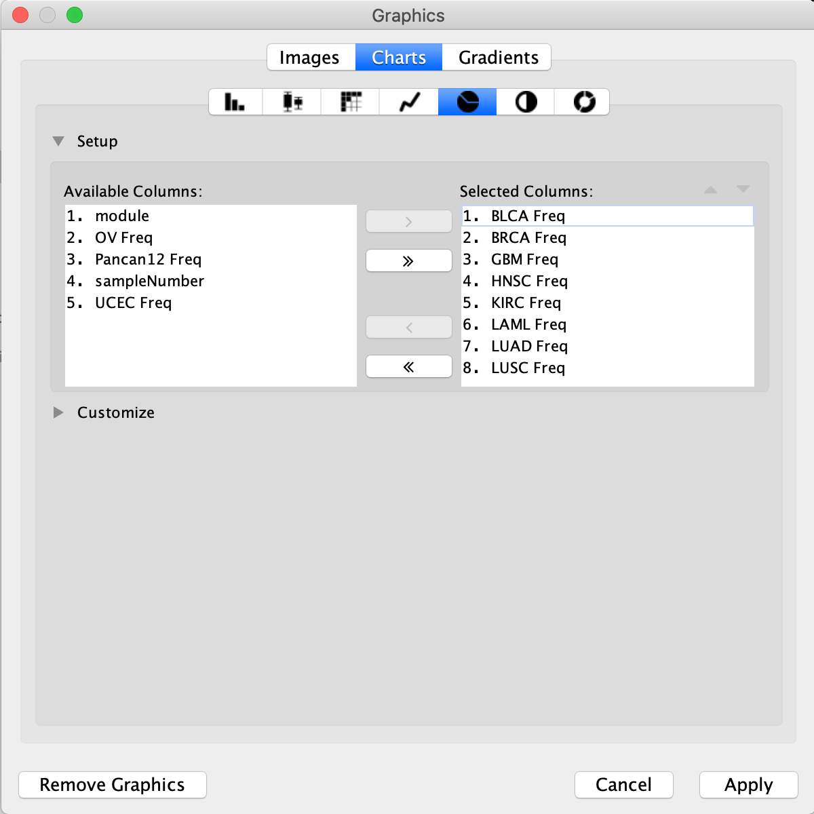
 </p>
 
 ```{block, type="rmd-tip"}
 Expanding **Customize** will open a tab that shows the color legend for the pie chart. All colours of the pie chart are customizable. 
 ```
 
  <p align="center">
 
 </p>
 
```{block, type="rmd-bonus"}

Notice in the screenshot below we changed node shape to be square so that we can still see the module the gene belongs to as well as the cancer frequencies in the pie chart.  Can you replicate this?

``` 

  <p align="center">
 
 </p>
 

 
### Create a subnetwork
 
 - Now that the network is clustered in modules and related pathways, we want to create a subnetwork to highlight connections that we found interesting. For this exercise, we want to create a network of the genes involved in the **Gastric cancer (K)** pathway. 

  * Here are the steps to follow:
    i. In the table panel, locate the **Pathways in Network** table.
    
```{block, type="rmd-tip"}
In order to generate the pathway network table, right-click on a blank space, **Reactome FI** --> **Analyze Network Functions** --> **Pathway Enrichment**.

   (hint: this was one of the steps that you had to try yourselves, )
  
```

  i. Select **Gastric Cancer (K)** from the list of pathways.It will highlight the genes in this pathway in yellow.

```{block, type="rmd-tip"}
It should be the top enriched pathway.  If you can't see it trying changing the sorting of the table by clicking on the column headers -- specifically the FDR column
```

  i. Above the network find and click on the **New Network from Selection** icon and select **From Selected Nodes, All Edges**. 
 
   <p align="center">
 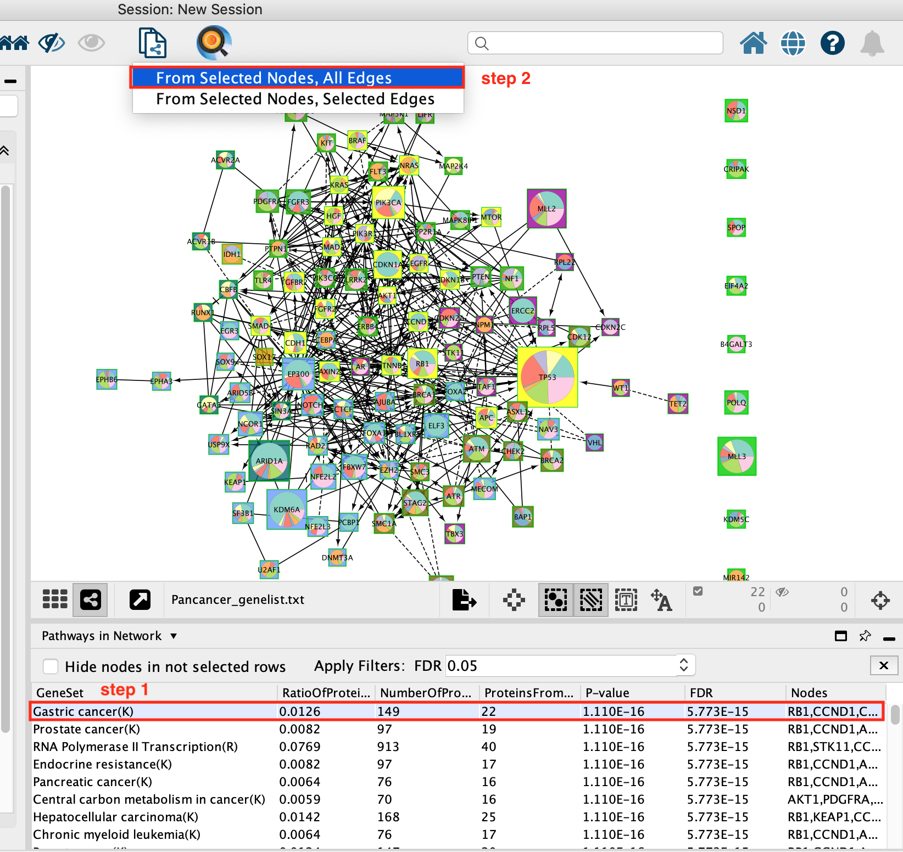
 </p>
 
A new network containing only the selected nodes is now created.
 
  <p align="center">
 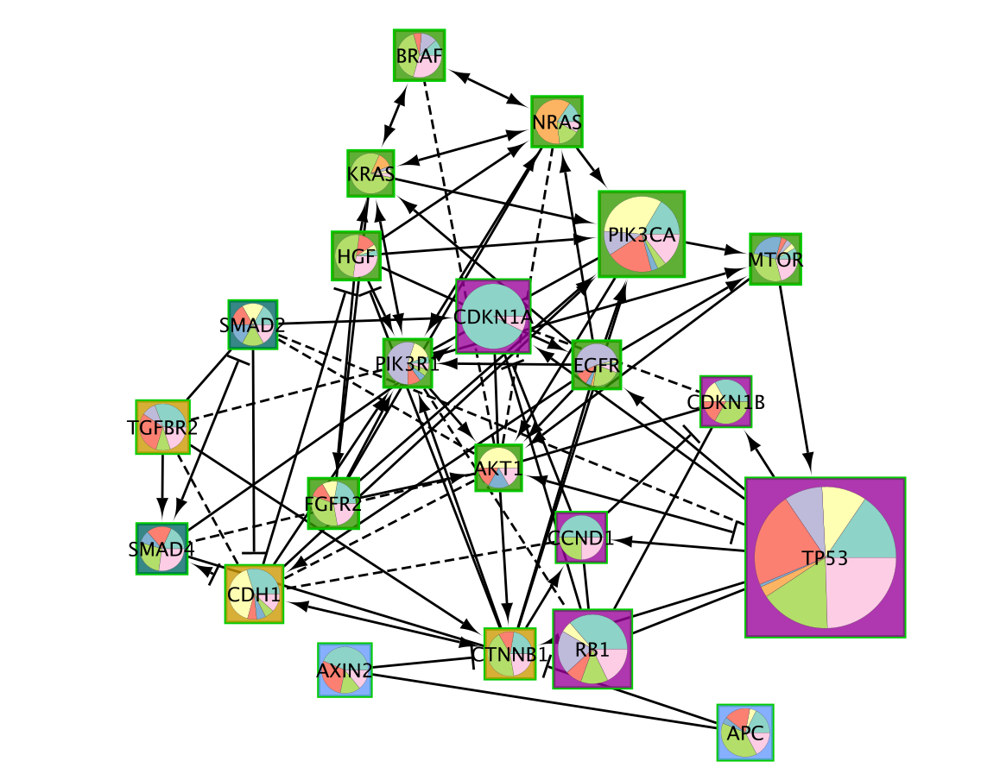
 </p>
 
 

### Fetch Cancer drugs on the created subnetwork

  * Working with the newly created gastric cancer enriched network.
  * Right-click on a blank space and select **Reactome FI**, **Overlay Drugs**, **Fetch Cancer Drugs**. 
 
  <p align="center">
 
 </p>
 
  * The numerous drugs known to target the genes in this subnetwork are now added  as green diamond shaped nodes.

  <p align="center">
 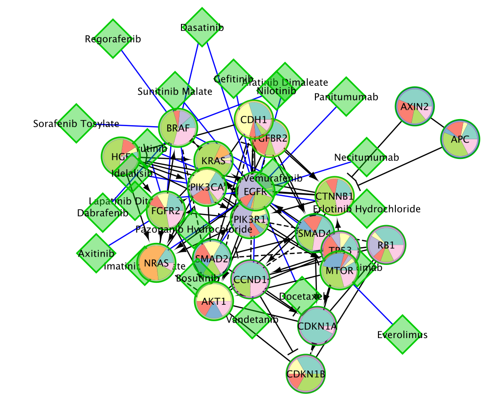
 </p>

  * Here is the network after redoing the layout for clarity (Layout -->  YFiles Organic Layout)
  
  <p align="center">
 
 </p>

### Save the network as an image for publication

As we have finalized our network analysis, we would like to export the network as an image.

- In the Cytoscape menu, select **File**, --> **Export**,--> **Network to Image**. 

  <p align="center">
 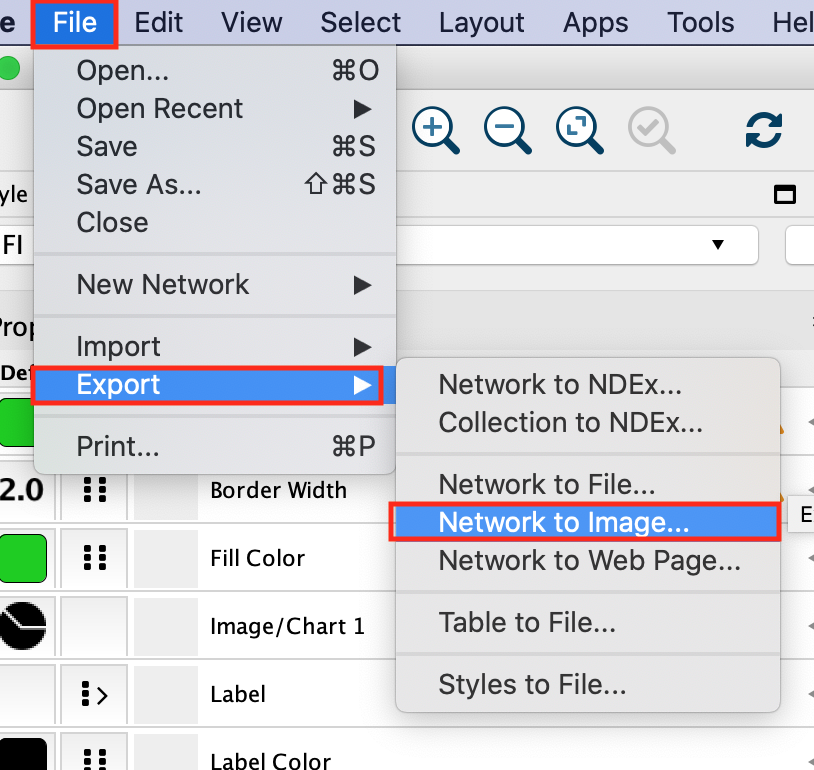
 </p>
 
- Browse to the directory where you want to save the image, give it a name and click on **OK**.

   <p align="center">
 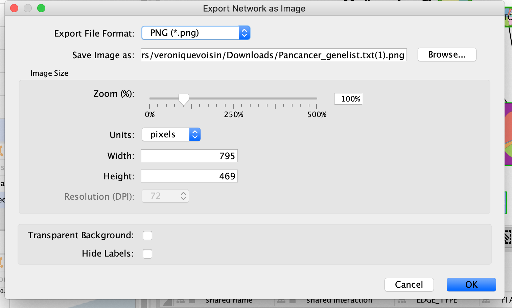
 </p>


```{block, type="rmd-tip"}
In addition to export an image of your network, save your session regularly.
```


## Exercise 2a: Explore Reactome Pathways
**Objectives:**
The objective of this exercise is to navigate the Reactome pathways using the Cytoscape ReactomeFI app. 


**Steps:**

- Open up Cytoscape. 

- Go to Apps >Reactome FI>Reactome Pathways. Once the app is opened, the list of pathways contained in the Reactome database are listed on the left window. 
 <p align="center">
 
 </p>
 

- Pathways are available for Homo sapiens and Mus Musculus. Make sure that **Homo sapiens** is selected.

<p align="center">
 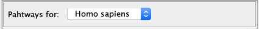
 </p>
 
The pathways are organized into main categories. Clicking on the left arrow will expand that category and display all its sub-categories/pathways. 

- Find and expand the **Transport of small molecules** event branch. 
- In the expanded menu,find and expand **O2/CO2 exchange in erythrocytes**. 
- Select **Erythrocyte take up carbon dioxide and release oxygen**.  
- Right-click on the highlighted pathway and select **Show Diagram**.


<p align="center">
 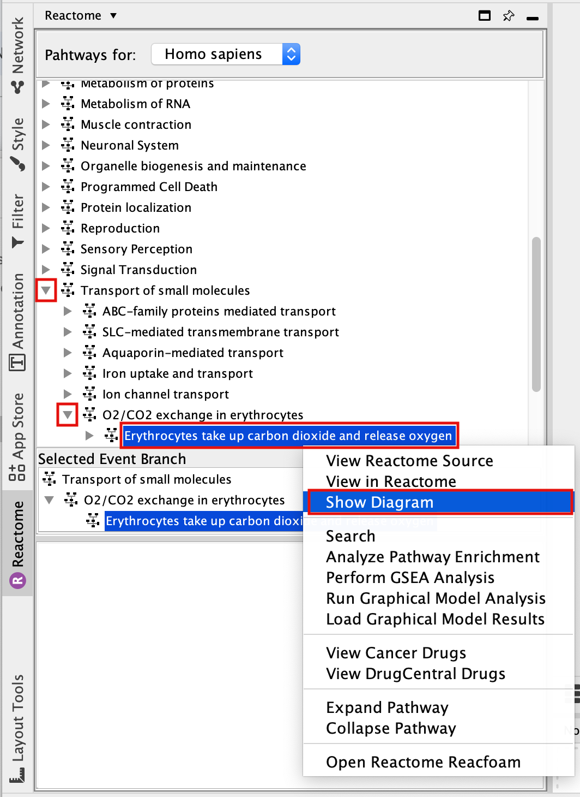
 </p>
 
- Explore the pathway diagram. 
  i. Zoom in and out. 
  i. Move nodes around. 
  i. Change color of a branch 
    * select a line, 
    * right click, 
    * select highlight,
    * choose color.

<p align="center">
 
 </p>


- Explore individual molecules and reactions.
  i. Right click on a line or a compound.
  i. Select *View Reactome Source* in right click context menu. 
  i. This displays information about the biochemical reaction or molecule selected including the input and output molecules and associated reference papers.

<p align="center">
 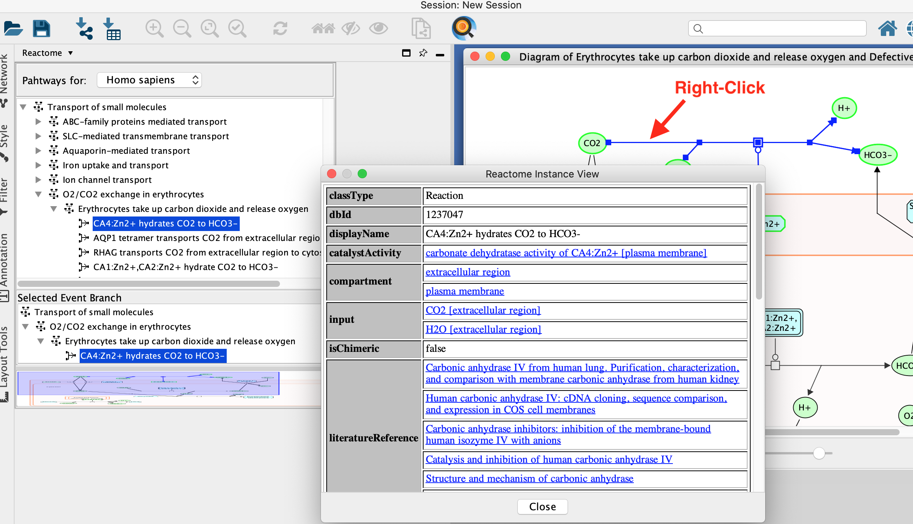
 </p>


- Save the reactome pathway diagram as pdf: 
  i. Right-click on the diagram and select **Export Diagram**


<p align="center">
 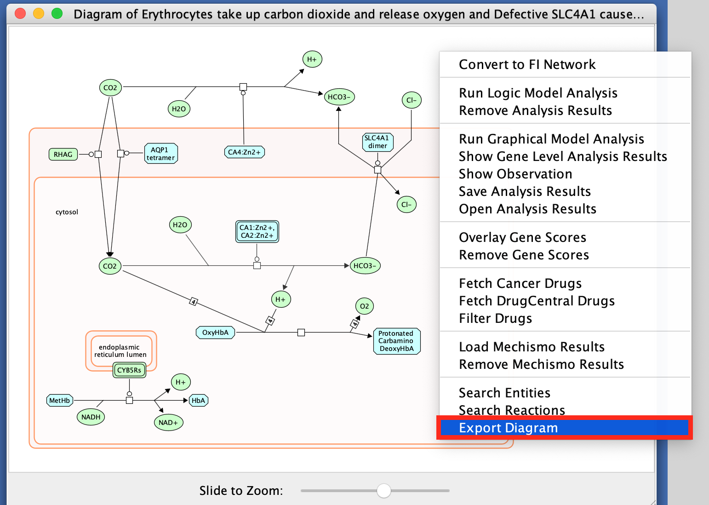
 </p>

```{block, type="rmd-note"}
What is the difference between a pathway diagram and network?
<p align="center">
 
 </p>
 
 *Pathway diagram*
 
   * biochemical view of pathways with cause and effect of each interaction captured.
   * shows the flow and structure of pathway.
   * represents different events and states of the same molecules.
   * includes information on genes, proteins, metabolic pathways, molcular interactions, biochemical reactions.
   
 *Network*
 
   * represents relationships between entities.  Entities can be genes, RNA, proteins or anything defined by the creator.  
   * enables visualization of multiple data types together. 
   * No context or dynamics.  Simply shows the connectivity between nodes.
   
```


- Transform pathway diagram into a network and back to a diagram. 
  i. Right-click on a blank space in the diagram
  i. select **Convert to FI Network**. 
  
```{block, type="rmd-tip"}  
  Transforming the pathway diagram into a network has the advantage that we can now use all the features of Cytoscape.
  
  Notice when viewing the pathway diagram you have to use the zoom bar at the bottom of the pathway diagram as opposed to the zoom buttons in the top menu bar in Cytoscape.  Also. when using the pathway diagram you can not use any of the builtin layouts that come with Cytoscape.  Because Cytoscape is a network analysis software it has been optimized for networks.  In the ReactomeFI app they recreate the pathway diagram by manually drawing an interactive picture of it.  You can still move the nodes and edges manually but employing any of the built in layouts and features would potentially ruin the picture.    
```

Step1 - Convert diagram to network
<p align="center">
 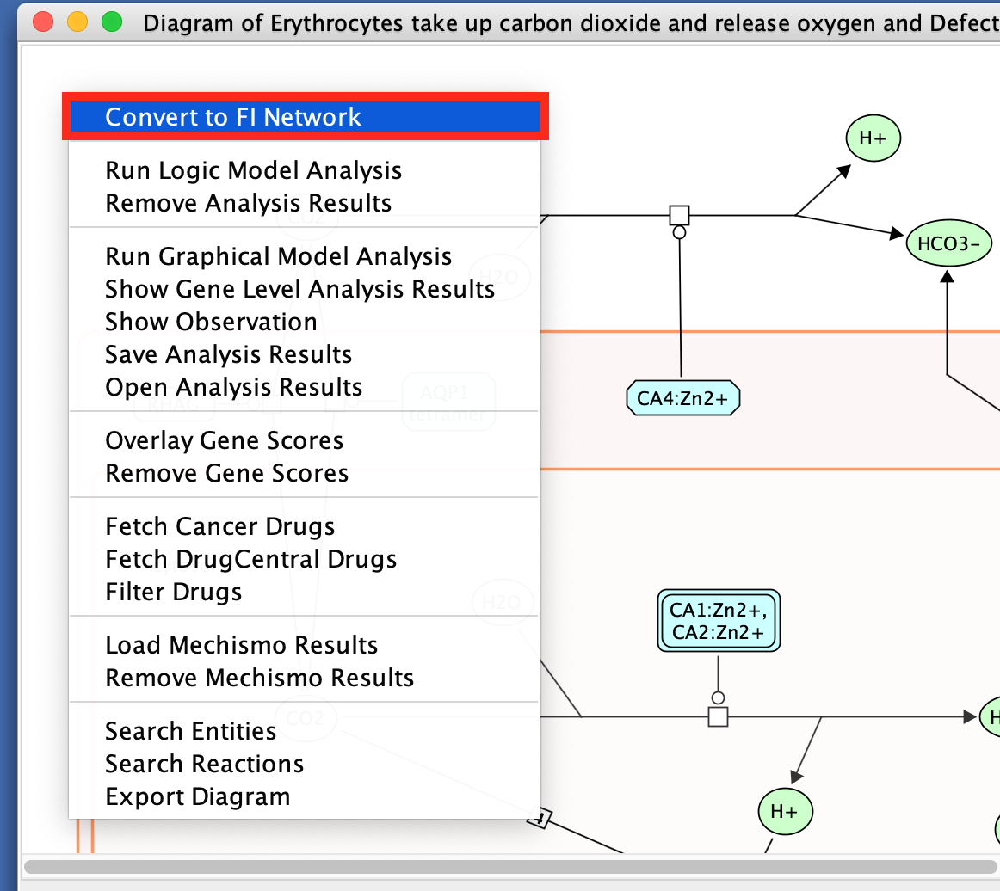
 </p>

Step2 - explore network represenation
<p align="center">
 
 </p>
 
```{block, type="rmd-note"}
Note that only genes (and not the metabolites) are included in this network. 

The Reactome pathway diagram demonstrates how the oxygenated form of hemoglobin A [HBA1](https://www.uniprot.org/uniprotkb/P69905/entry) undergoes two chemical reactions in the presence of CO2. These reactions cause HBA to lose its affinity for oxygen. 

Additionally,  this pathway diagram demonstrates how, in erythrocytes, CYB5Rs participates in the reduction of methemoglobin (MetHb) to hemoglobin A [HBA1](https://www.uniprot.org/uniprotkb/P69905/entry). The participating genes are then [HBA](https://www.uniprot.org/uniprotkb/P69905/entry), [HBB](https://www.uniprot.org/uniprotkb/P68871/entry) and Cyb5R genes and will be displayed in the network.
```
 
- Convert the network back to a pathway diagram. 
  i. Right-click on a blank space of the network.
  i. select **ReactomeFI** 
  i. then **Convert to Diagram**. 

Step1
<p align="center">
 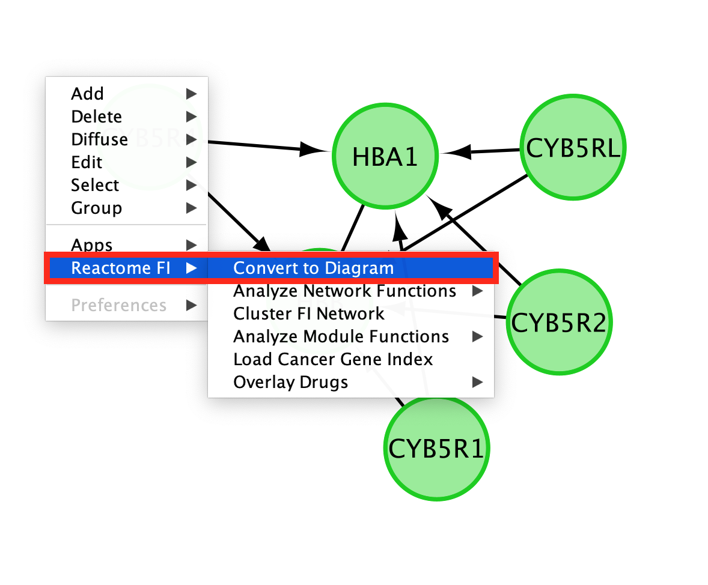
 </p>
 
Step2
 <p align="center">
 
 </p>


- Open the diagram from the Reactome website:
  i. Locate the menu of pathways in the left hand window
  i. right click on **Erythrocytes take up carbon dioxide and release oxygen**. 
  i. Select **View in Reactome**. 
  i. This will open a new page in your web browser with detailing information about the pathway on the Reactome website. 

Step1 - View in Reactome
<p align="center">
 
 </p>
 
Step2 - redirect to Reactome in web browser
 <p align="center">
 
 </p>


Some useful information is displayed in the web view including:
  * a summary of the pathway and 
  * reference papers used to build the diagram.
  
The pathway can be exported as an image in a range of format choices including svg, png, pptx or pdf or as a recognized exchange format including BioPAX, SBML or SBGN.  

Furthermore, it is linked to the reactome.org pathway browser that can be opened in a new window. (See link below the pathway diagram, *"Click othe image above or here to open this pathway in the Pathway Browser"*) The Cytoscape ReactomeFI app is a replica of this web-based pathway browser.

Step1 - click on link
<p align="center">
 
 </p>
 
Step2 - Pathway browser in web browser.
 <p align="center">
 
 </p>


## Exercise 2b: Pathway enrichment analysis using a simple gene list

**Objectives:**
The objective of this exercise is to perform a pathway-based analysis using a sample gene list as input.


**Data:**

For this lab, we will use a set of genes found to have frequent somatic single nucleotide variations (SNVs) identified in TCGA exome sequencing data of 3,200 tumors from 12 different cancer types. The MuSiC cancer driver mutation detection software was used to find 127 cancer driver genes that displayed higher than expected mutation frequencies in cancer samples (Pan-cancer tab from Supplementary Table 4 in [Kandoth C. et al.](https://www.nature.com/articles/nature12634).


 * Gene list: [Pancancer_genelist.txt](./Module2/gprofiler/data/Pancancer_genelist.txt)


**Steps:** 

- In Cytoscape, locate the menu bar, select File -> Close .  (This will clear the previous session we created in 2A in order to start with a clean slate.)

- Select Apps -> Reactome FI -> Reactome Pathways. 

- Locate the list of Reactome pathways in the left hand panel in the Reactome tab in the Control Panel. 

- Scroll down and find the **Signal Transduction** pathway in the event hierarchy and select it. 

- Right-click on the highlighted **Signal Transduction** name and select **Analyze Pathway Enrichment** .

 <p align="center">
 
 </p>

- ***Browse*** and select the **Pancancer_genelist.txt** file ,click **OK**. 

 <p align="center">
 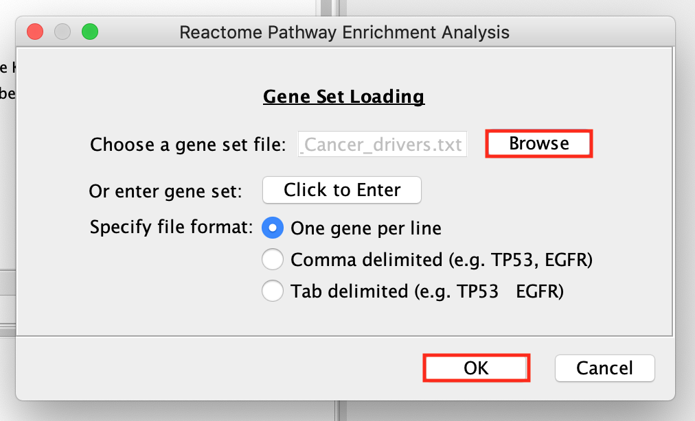
 </p>

### Question 1: What are the most significant biological pathways based on the FDR?

- **Hint**: Take a look at the list of significant pathways in the **Reactome Pathway Enrichment**  tab of Table Panel.

<p align="center">
 
 </p>

Pathway enrichment results are displayed as a table labeled as "Reactome Pathway Enrichment" in the "Table Panel" at the bottom of the main Cytoscape window.

### Answer to Question 1

The pathway with the most significant enrichment FDR is called *Generic Transcription Pathway*. This pathway contains 1235 genes of which 42 genes are also found in the Pan_Cancer gene list that we used as intput. 

The statistical enrichment test pvalue associated with this pathway is close to 0 (7.98 E-14) and it means that this size of the overlap (42 genes) is not likely to be obtained by chance alone. 

Reactome Pathway enrichment table contains - 

  * ReactomePathway - pathway name
  * RatioOfProteinInPathway - this is not the ratio of our query to the size of the pathway.  This is the ratio of proteins found in this pathway as compared to the total number of entities.   
  * NumberOfProteinPathway -  total number of genes in the pathway
  * ProteinFromGeneSet - number of genes from our input gene list that overlaps with this pathway
  * P-value 
  * FDR
  * HitGenes - genes from out input gene list that overlap with this pathway

The pathways that are the most enriched have a low FDR value.  

```{block, type="rmd-tip"}
You can click on any of the column labels in the Reactome Pathway Enrichment table to sort the table by that column.
```

- In the **Reactome Pathway Enrichment** table, 
  i. select **Transcriptional regulation by RUNX3**.  
  i. Right-click on the pathway 
  i. select **View in Diagram**. 

```{block, type="rmd-tip"}
To find this pathway more easily:

  * click on the column title "ReactionPathway" to sort the table alphabetically by pathway name
  * scroll down to the pathway **Transcriptional regulation by RUNX3**
```

<p align="center">
 
 </p>


- Explore the pathway diagram
  i. Zoom in and out to observe the diagram. 
  i. Purple-coloured nodes reflect genes that are present in our input gene list (Pancancer_genelist.txt). 
  i. Right-click on highlighted nodes to invoke additional features.

<p align="center">
 
 </p>


```{block, type="rmd-tip"}
If the Reactome Pathway Enrichment Table is not visible anymore in the Table Panel. 

  * Go to Cytoscape menu bar, **View**. 
  * Uncheck and chek **Show Table Panel**.

If this doesn't work it is possible the table panel is just too small to see.  You can try expanding it so you can see it or pop it out of the window so that it is its own window.  (For smaller laptop screens that might be easiest thing to do)

<p align="center">
 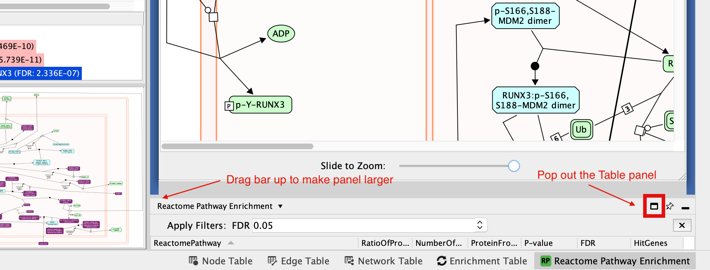
 </p>
  
```


- Transform the diagram into a network:
  i. Right-click on a blank space of the diagram
  i. select **Convert to FI Network**. 
  
  The advantage of a network over the pathway diagram is that we can now use the Cytoscape analysis and visual features. Nodes with purple-coloured borders reflect genes that are present in our input gene list.

<p align="center">
 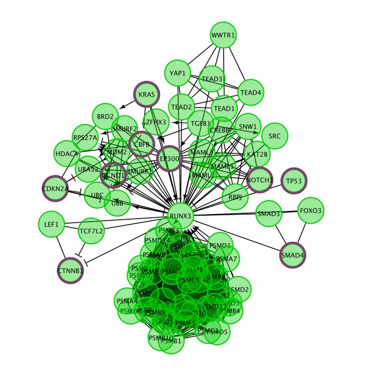
 </p>

```{block, type="rmd-tip"}
Redo the layout if a clearer view is needed. 

  * Go to the Cytoscape menu bar
  * select **Layout**, -->  **yFiles Organic Layout**.
```


- Transform network back to a diagram:
  i. Right-click on a blank space 
  i. select **Reactome FI** --> **Convert to Diagram**. 

<p align="center">
 
 </p>


- Open Reactome Reacfoam:
  i. The Reacfoam view provides a holistic view of all (excluding disease) human pathways in the Reactome database. 
  i. Go to the menu of pathways in the Control Panel (left window) and 
  i. right-click on a blank space. 
  i. Select **Open Reactome Reacfoam**.   
  
<p align="center">
 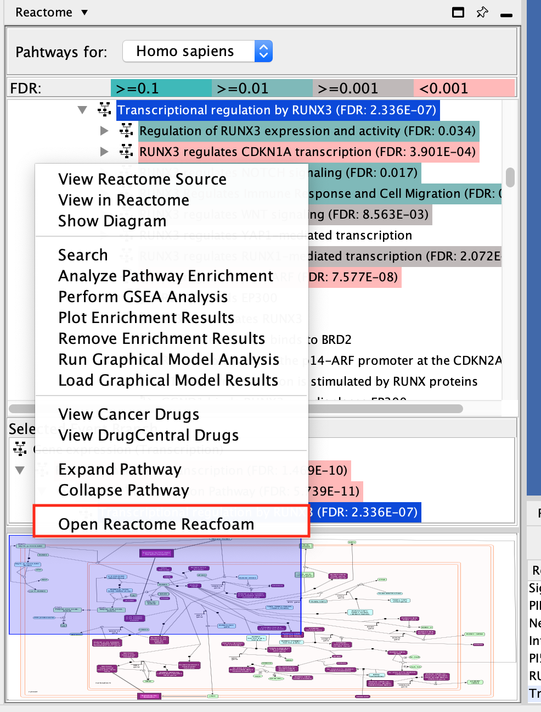
 </p>

Reactome Reacfoam will open in the default web browser. 

<p align="center">
 
 </p>


```{block, type="rmd-note"}
The color gradient indicates which categories of pathways have a stronger enrichment in the gene list that we have provided with lighter yellow having more significant FDR values.
```

## Exercise 2c: Pathway-based analysis using a rank gene list (GSEA)


**Objectives:**

ReactomeFIViz provides support to perform GSEA analysis for Reactome pathways using a rank file. 

**Data:**

To perform the GSEA pathway enrichment analysis, you need to provide a tab-delimited text file containing two columns: the first for gene symbols (human only) and the second for gene scores.

The data used in this exercise is gene expression (transcriptomics) obtained from high-throughput RNA sequencing of Ovarian Serous Cystadenocarcinoma samples. This cohort was previously stratified into four distinct expression subtypes [PMID:21720365](http://www.ncbi.nlm.nih.gov/pubmed/21720365) and a subset of the immunoreactive and mesenchymal subtypes are compared to demonstrate the GSEA workflow.

**Data processing:**

Gene expression from the TCGA Ovarian serous cystadenocarcinoma RNASeq V2 cohort was downloaded on 2015-05-22 from [cBioPortal for Cancer Genomics](http://www.cbioportal.org/data_sets.jsp). Differential expression for all genes between the mesenchymal and immunoreactive groups was estimated using [edgeR](http://www.ncbi.nlm.nih.gov/pubmed/19910308).The R code used to generate the data and the rank file used in GSEA is included at the bottom of the document in the [**Additional information**](#additional_information) section. 


```{block, type="rmd-datadownload"}
Right click on link below and select "Save Link As...".

Place it in the corresponding module directory of your CBW work directory.
```

  * [MesenchymalvsImmunoreactive_edger_ranks.rnk](./Module2/gsea/data//MesenchymalvsImmunoreactive_edger_ranks.rnk)

```{block, type="rmd-note"}
This is the same data used in Module2 GSEA lab.

The first row is reserved for the column headers, and will not be imported for analysis. 
```


**Steps:** 

- Start with a fresh session: 
  i. Go to the Cytocape menu bar and 
  i. select **File**, --> **Close**. 

- Open ReactomeFI app:
  i. Go to the menu bar Select **Apps**,--> **Reactome FI**,--> **Reactome Pathways**.The Reactome tab in the Control Panel on the left opens and the list of pathways is visible.

- Select **Autophagy** and right-click on a blank space. The option menu opens. Select **Perform GSEA Analysis**. 

```{block, type="rmd-tip"}
Why do I have to select **Autophagy**?   Am I doing the GSEA Analysis just on this pathway?

This is just a little quirk in the ReactomeFI app.  In order to see the context menu with all your options you need to have a pathway selected.  

```

<p align="center">
 
 </p>

A **Reactome GSEA Analysis window** pops up.

- Browse and select [MesenchymalvsImmunoreactive_edger_ranks.rnk](./Module2/gsea/data//MesenchymalvsImmunoreactive_edger_ranks.rnk).

<p align="center">
 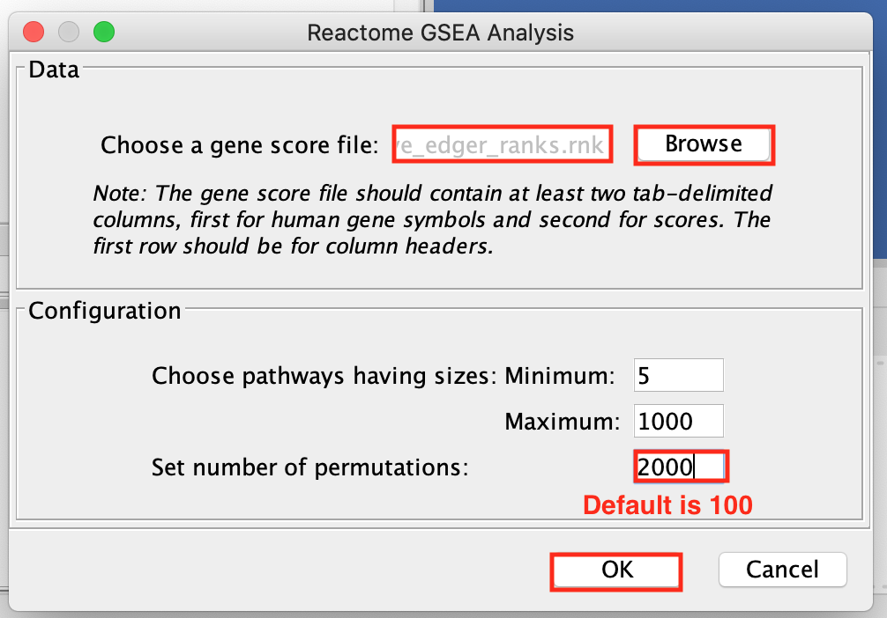
 </p>

```{block, type="rmd-note"}
The number of permutations is 100 by default. To achieve more precision, we set the permutations to 2000. It will take approximately 10 minutes to run. 

For faster results during this practical lab, you may run it with 100 permutations. Keep in mind that this lower threshold will affect the NES, P-value and FDR values in your results.
```

<p align="center">
 
 </p>

- Once GSEA has finished, a **Reactome GSEA Analysis** tab appears in the Table Panel.
This table displays the list of pathways in increasing order from the lowest FDR values. 
  i. Click on the **Normalized enrichment score** column title to order the pathways from Up (positive NES) to Down (negative NES). 

The pathways that are up and with FDR less than 0.05 are enriched in genes up regulated in the mesenchymal type of ovarian cancer.

<p align="center">
 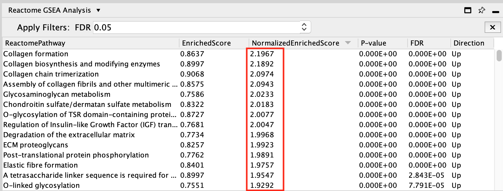
 </p>
 
 The pathways that are down (negative NES) with FDR values less than 0.05 are enriched in genes down regulated in the mesenchymal type of ovarian cancer. Therefore, these genes are specific to the immunoreactive type.

 <p align="center">
 
 </p>

Interferon Signaling is the pathway that has the strongest enrichment (lowest NES value) in genes down-regulated in the mesenchymal type (or alternately, upregulated in the immunoreactive type). 

- Let's visualize this in a pathway diagram to get details about the pathway.

  i.Locate and select **Interferon gamma signaling** in the **Reactome GSEA Analysis** table.
  i. Right-click on the highlighted name 
  i. select **View in Diagram** from the popup menu.

 <p align="center">
 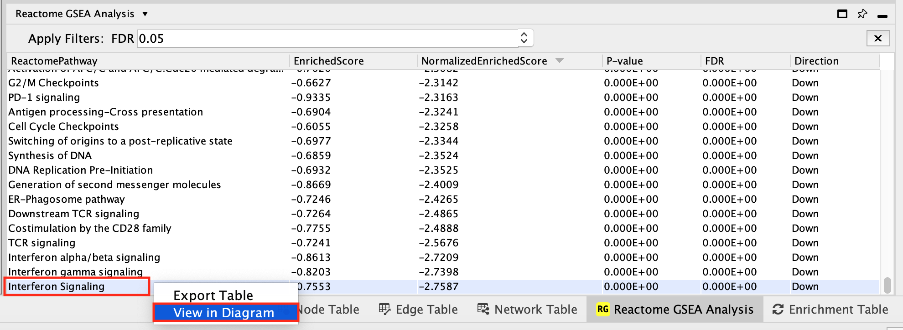
 </p>

  i. Explore the diagram by zooming in and out. 
  i. Look at the list of genes in the **Gene scores and ranks** table (click on some genes).


 <p align="center">
 
 </p>
 
- Fetch cancer drug: 
  i. right-click anywhere on diagram
  i. select **Fetch cancer drug**.

 <p align="center">
 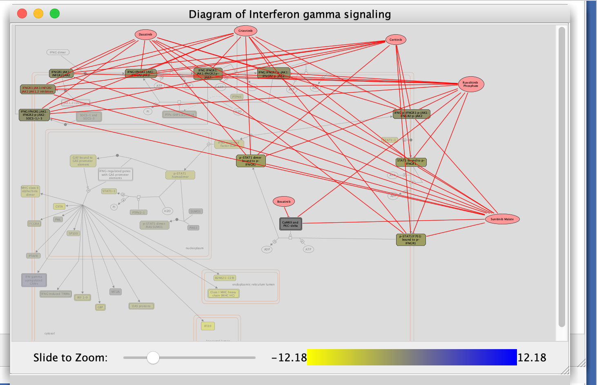
 </p>

 

## Exercise 3: Perform scRNA-seq Data Analysis and Visualization
need to install python
need h5 file

## Exercise 4: Automation using a Jupiter Notebook (advanced users)

To facilitate adoption of this app in bioinformatics software pipeline and workflow development, a CyREST API for ReactomeFIViz was developed. CyREST is the technology that powers Cytoscape Automation, which enables you to create reproducible workflows executed entirely within Cytoscape or by external tools (e.g., Jupyter, R, GenomeSpace, etc) [https://apps.cytoscape.org/apps/cyrest]. 
You can find below a case to demonstrate the use of this API in a Jupiter Notebook (https://jupyter.org/).

- [Cytoscape ReactomeFI Jupiter Notebook](./Module4/Reactome/data/reactomeFInotebook.ipynb)
- Reference paper: https://f1000research.com/articles/7-531

## Reference guide /bonus exercises:
Here is a link to the ReactomeFIVIz complete guide: https://reactome.org/tools/reactome-fiviz
You can find more tips and bonus exercises.

