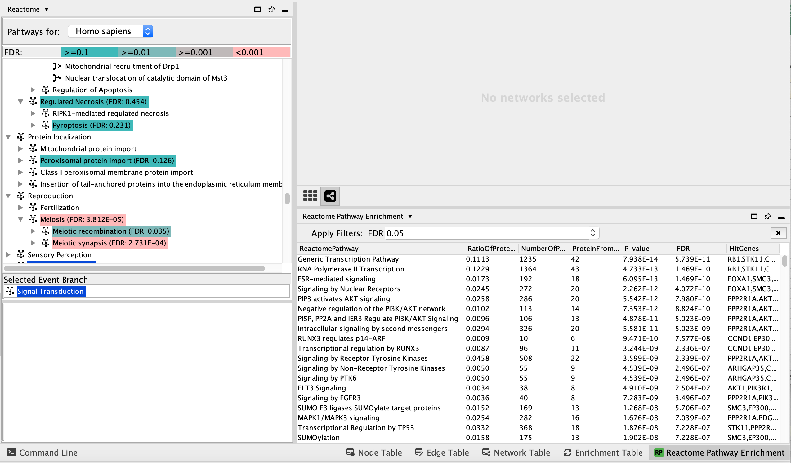

# Module 4 Lab: ReactomeFI {#ReactomeFI}

**This work is licensed under a [Creative Commons Attribution-ShareAlike 3.0 Unported License](http://creativecommons.org/licenses/by-sa/3.0/deed.en_US). This means that you are able to copy, share and modify the work, as long as the result is distributed under the same license.**

 *<font color="#827e9c">By Veronique Voisin, Chaitra Sarathy and Ruth Isserlin</font>*

## Goal of this practical lab 

**Aim**: This practical lab will provide you with an opportunity to perform pathway and network analysis using the Reactome Functional Interaction (FI) network and the ReactomeFIViz Cytoscape app. 

**Goal**: Analyze gene lists and somatic mutation data to identify biology that contributes to GBM and ovarian cancer.


## Data: download the following files on your computer before starting the practical lab.

```{block, type="rmd-datadownload"}
Right click on link below and select "Save Link As...".

We recommend saving all these files in a personal project data folder before starting with the name of the module (module4). We also recommend creating an additional result data folder to save the files generated while performing the protocol (module4_result).

```


 * Download [PanCancer_drivers_genelist.txt](./Module2/gprofiler/data/Supplementary_Table1_Cancer_drivers.txt)
 * Download [PanCancer_drivers_genelist_with_mutation_frequency.txt](./Module4/Reactome/data/Pancancer_frequency.txt)
 

 *  Download  [OVCA_TCGA_Clinical.txt](./Module4/Reactome/data/OVCA_TCGA_Clinical.txt) file.
 *  Download  [OVCA_TCGA_MAF.txt](./Module4/Reactome/data/OVCA_TCGA_MAF.txt) file.  
 
##OLD FILES
 *  Download  [GBM_genelist.txt](./Module4/Reactome/data/GBM_genelist.txt) file.  
 *  Download  [GBM_genesample.txt](./Module4/Reactome/data/GBM_genesample.txt) file.  


## Exercise 1a: Explore Reactome Pathways
**Objectives:**
The objective of this exercise is to navigate the Reactome pathways using the Cytoscape ReactomeFI app. 


**Steps:**
- Open up Cytoscape. 

- Go to Apps >Reactome FI>Reactome Pathways. Once the app is opened, the list of pathways contained in the Reactome database are listed on the left window. The pathways are organized in main categories and clicking on the left arrow will display the sub-categories. 

 <p align="center">
 
 </p>
 

- Pathways are available for Homo sapiens and Mus Musculus. Make sure that **Homo sapiens** is selected.

<p align="center">
 
 </p>

- Find and expand the **Transport of small molecules** event branch. In the expanded menu,find and expand **O2/CO2 exchange in erythrocytes**. Select **Erythrocyte take up carbon dioxide and release oxygen** and right-click on the highlighted pathway and select **Show Diagram**.


<p align="center">
 
 </p>
 
- Observe the diagram. Zoom in and out. Move some nodes around. Change color of a branch :select a line, right click, select highlight and choose color.

<p align="center">
 
 </p>


- Right click on a line or a compound to reveal its source. It displays information about the biochemical reaction like the input and output molecules and some reference papers.

<p align="center">
 
 </p>


- Save the image as pdf: Right-click on the diagram and select **Export Diagram**


<p align="center">
 
 </p>


- Transform it into a network and back to Diagram. Right-click on a blank space of the diagram and select **Convert to FI Network**. It has the advantage that we can now work with this network and use the Cytoscape analysis and visual features.


Step1
<p align="center">
 
 </p>

Step2
<p align="center">
 
 </p>
 
Note that only genes and not the metabolites are included in this network. The Reactome diagram shows how the oxygenated form of hemoglobin A undergoes two chemical reactions when CO2 is present. These reactions make Hba to lose its affinity for oxygen. It also shows how, in erythrocytes, CYB5Rs participates in the reduction of methemoglobin (MetHb) to hemoglobin A (HbA). The participating genes are then Hba, Hbb and Cyb5R genes and will be displayed in the network.

 
- Convert the network back to the diagram. Right-click on a blank space of the network and select **ReactomeFI** and then **Convert to Diagram**. 
Step1
<p align="center">
 
 </p>
 
Step2
 <p align="center">
 
 </p>


- Show it in Reactome (Website). Locate the menu of pathways on the left window and right click on **Erythrocytes take up carbon dioxide and release oxygen**. Select **View in Reactome**. It will open a new page in your web browser. 

Step1
<p align="center">
 
 </p>
 
Step2
 <p align="center">
 
 </p>


Some useful information are displayed like a summary of the pathway and reference papers used to build the diagram. 
It can be exported as a pdf image or as a BioPAX format which is a file format specification for the exchange of biological pathway data. 

Furthermore, it is linked to the reactome.org pathway browser that can be opened in a new window. You can observe that the Cytoscape app is replicating the functionalities of the web-based pathway browser.

Step1
<p align="center">
 
 </p>
 
Step2
 <p align="center">
 
 </p>


## Exercise 1b: Pathway enrichment analysis using a simple gene list

**Objectives:**
The objective of this exercise is to perform a pathway-based analysis using a sample gene list as input.


**Data:**

For this lab, we use genes with frequent somatic SNVs identified in TCGA exome sequencing data of 3,200 tumors of 12 types. The MuSiC cancer driver mutation detection software was used to find 127 cancer driver genes that displayed higher than expected mutation frequencies in cancer samples (Pan-cancer tab from Supplementary Table 4 in [Kandoth C. et al.](https://www.nature.com/articles/nature12634).


 * Gene list: [Pan_Cancer_drivers.txt](./Module2/gprofiler/data/Supplementary_Table1_Cancer_drivers.txt)


**Steps:** 

- In Cytoscape, locate the menu bar, select File -> Close

- Go to Apps >Reactome FI>Reactome Pathways. Locate the menu of pathways on the left window in the Reactome tab from the Control Panel. 

- Scroll down and find the **Signal Transduction** pathway in the event hierarchy and select it. 

- Right-click on the highlighted **Signal Transduction** name and select **Analyze Pathway Enrichment** .

 <p align="center">
 
 </p>

- ***Browse*** and upload the **Pan_Cancer_drivers.txt** data into the Reactome Pathway Enrichment Analysis, and click **OK**. 

 <p align="center">
 
 </p>

Question
1: What are the most significant biological pathways based on the FDR?

 <p align="center">
 
 </p>


- Hint: Take a look at the list of significant pathways in the **Reactome Pathway Enrichment**  tab of Table Panel.

<p align="center">
 
 </p>

Pathway enrichment results are displayed as a table labeled as "Reactome Pathway Enrichment" in the "Table Panel" at the bottom of the main Cytoscape window.

The pathway with the most significant enrichment is called "Generic Transcription Pathway". This pathway contains 1235 genes and 42 genes were contained in our Pan_Cancer gene list that we used as intput. 

The statistical enrichment test pvalue associated with this pathway is close to 0 (0.00968) and it means that this size of the overlap (42 genes) was not likely to be obtained by chance only. 

The total number of genes in the pathway is located in the third column named 'NumberOfProteinInPathway'. The number of genes from our input gene list and overlapping with the tested pathway is indicated in the column named 'ProteinFromGeneSet'. The pathways that are the most enriched have a low FDR value.  

- In the **Reactome Pathway Enrichment** table, select **Transcriptional regulation by RUNX3**.  Right-click on the pathway and select **View in Diagram**. 


<p align="center">
 
 </p>


- Zoom in and out to observe the diagram. Purple-coloured nodes reflect genes that are present in our input gene list (GBM_genelist.txt). 
Right-click on highlighted nodes to invoke additional features.

<p align="center">
 
 </p>


```{block, type="rmd-tip"}
If the Reactome Pathway Enrichment Table is not visible anymore in the Table Panel. Go to Cytoscape menu bar, **View**. Uncheck and chek **Show Table Panel**.
```


- Transform it into a network. Right-click on a blank space of the diagram and select **Convert to FI Network**. It has the advantage that we can now work with this network and use the Cytoscape analysis and visual features. Purple-coloured nodes reflect genes that are present in our input gene list.

<p align="center">
 
 </p>

```{block, type="rmd-tip"}
Redo the layout if a clearer view is needed. Go to the Cytoscape menu bar and then select **Layout** ,  **yFiles Organic Layout**.
```

- Transform it back into a diagram. Right-click on a blank space and select **Convert to Diagram**. 

<p align="center">
 
 </p>


- Open Reactome Reacfoam: The Reacfoam view provides a holistic view of all (exclude disease) human pathways in the Reactome database. Go to the menu of pathways in the Control Panel (left window) and right-click on a blank space. Select **Open Reactome Reacfoam**.   
<p align="center">
 
 </p>

Reactome Reacfoam will open in the default web browser. 

<p align="center">
 
 </p>


```{block, type="rmd-note"}
The color gradient indicates which categories of pathways have a stronger enrichment in the gene list that we have provided.
```

## Exercise 1c: Pathway-based analysis using a rank gene list (GSEA)


**Objectives:**
ReactomeFIViz provides support to perform GSEA analysis for Reactome pathways using a rank file. 
**Data:**
To perform the GSEA pathway enrichment analysis, you need to provide a tab-delimited text file containing two columns: the first for gene symbols (human only) and the second for gene scores.

The data used in this exercise is gene expression (transcriptomics) obtained from high-throughput RNA sequencing of Ovarian Serous Cystadenocarcinoma samples. This cohort was previously stratified into four distinct expression subtypes [PMID:21720365](http://www.ncbi.nlm.nih.gov/pubmed/21720365) and a subset of the immunoreactive and mesenchymal subtypes are compared to demonstrate the GSEA workflow.

How was the data processed?

Gene expression from the TCGA Ovarian serous cystadenocarcinoma RNASeq V2 cohort was downloaded on 2015-05-22 from [cBioPortal for Cancer Genomics](http://www.cbioportal.org/data_sets.jsp). <br>Differential expression for all genes between the mesenchymal and immunoreactive groups was estimated using [edgeR](http://www.ncbi.nlm.nih.gov/pubmed/19910308).<br>The R code used to generate the data and the rank file used in GSEA is included at the bottom of the document in the [**Additional information**](#additional_information) section. 


Download (right-click and save link):  [MesenchymalvsImmunoreactive_edger_ranks.rnk](./Module2/gsea/data//MesenchymalvsImmunoreactive_edger_ranks.rnk)


```{block, type="rmd-warning"}
The first row is reserved for the column headers, and will not be imported for analysis. 
```


**Steps:**
- Start with a fresh session. Go to the Cytocape menu bar and select **File**, **Close**. 

- Go to the menu bar and **Apps**, **Reactome FI**, **Reactome Pathways**.The Reactome tab in the Control Panel on the left opens and the list of pathways is visible.

- Select **Autophagy** and righ-click on a blank space. The option menu opens. Select **Perform GSEA Analysis**. 

<p align="center">
 
 </p>

A **Reactome GSEA Analysis window** pops up.

- Browse and select [MesenchymalvsImmunoreactive_edger_ranks.rnk](./Module2/gsea/data//MesenchymalvsImmunoreactive_edger_ranks.rnk).

<p align="center">
 
 </p>

```{block, type="rmd-warning"}
The number of permutations is 100 by default. To achieve more precision, we set up the permutations to 2000. It takes approximately 10 minutes to run. 

For faster results during this practical lab, you may run it with 100 permutations. It will affect the NES, P-value and FDR values.
```

<p align="center">
 
 </p>

- Once GSEA has finished to run, a **Reactome GSEA Analysis** appears in the Table Panel.
It displays the list of pathways ordered by the best FDR values. Click on the **Normalized enrichment score** tab to order the pathways from Up to Down. 

The pathways that are up and with FDR less than 0.05 are enriched in genes up regulated in the mesenchymal type of ovarian cancer.

<p align="center">
 
 </p>
 
 The pathways that are down and with FDR less than 0.05 are enriched in genes down regulated in the mesenchymal type of ovarian cancer. Therefore, these genes are specific to the immunoreactive type.

 <p align="center">
 
 </p>

Interferon Signaling is the pathway that has the strongest enrichment in genes down-regulated in the mesenchymal type. Let's visualize is a diagram to get details about the pathway.

- Locate and select **Interferon gamma signaling** in the **Reactome GSEA Analysis** table. Right-click on the highlighted name and select **View in Diagram** from the popup menu.

 <p align="center">
 
 </p>

- Explore the diagram by zooming in and out. Look at the list of genes in the *Gene scores and ranks** table (click on some genes).


 <p align="center">
 
 </p>
 
- Fetch cancer drug: right-click and select **Fetch cancer drug**.

 <p align="center">
 
 </p>

 
## Exercise 2: Use the Reactome Functional Interaction (FI) Network

**Objectives:**
The objective of this exercise is to create a Reactome Functional Interaction (FI) network using the pan-cancer gene list from exercise 1. 
In this exercise, we create a network using all genes in our list. In the network that we are creating, each gene is a node and all genes known to interact or are predicted to interact with each other will be connected. 
We remember that this gene list comes from genes found with frequently mutated in diverse types of cancer. Interestingly, this network might show us that although they were found in different cancers, they are biologically connected and might function in common biological pathways and protein complexes and represent hallmarks of cancer.

**Data:**
Download: 
- [Pan_Cancer_drivers.txt](./Module2/gprofiler/data/Supplementary_Table1_Cancer_drivers.txt)
- [pancancer_frequency_table.txt](./Module4/Reactome/data/pancancer_frequency_table.txt)

**Steps:**
Create the network:
- Open up Cytoscape.  
- Go to Apps>Reactome FI and Select "Gene Set/Mutational Analysis".  
- Choose "2021 (Latest)" Version. 
- Upload/Browse [Pan_Cancer_drivers.txt](./Module2/gprofiler/data/Supplementary_Table1_Cancer_drivers.txt) file. 
- Select **Gene set** 
- Select **Fetch FI annotations**.
- Select **Show genes not linked to other**
- Click OK.

 <p align="center">
 
 </p>

Created network:
 <p align="center">
 
 </p>

- **Question 1: Describe the size and composition of the network?**
 <p align="center">
 
 </p>

The total number of genes in the network is 128. 
103 of these genes are connected to each other by functional interactions. You can get this information by selecting all genes that you see connected to each others.
The total number of edges which represent the interactions is 473. 
The genes that are interacting together might work together in some same protein complexes in the cells. 

[TO DO ADD DETAILS ON FUNCTION INTERACTION NATURE: DIRECT AND PREDICTED]


- **Question 2: After clustering, how many modules are there?**
ReactomeFI has a clustering option which groups genes that are more connected to each other into modules.

To create the clustering:
- Right-click on a blank space of the network and select **ReactomeFI** and **Cluster FI Network**.

 <p align="center">
 
 </p>
 
Nodes are now colored per modules.

  <p align="center">
 
 </p>
 

Look at the table **Network Module Browser** that displays the number of modules. It is located in the Table Panel located below the network. Click on each module to highlight each genes in the module.

  <p align="center">
 
 </p>

The connected network was divided into 5 modules. Module 0 contains the highest number of genes (31).
The MCL clustering algorithm is used to cluster the network and it is based on the number of interaction (edges) between the nodes.

- **Question 3: What are the most significant pathways in each module?**

Pathway analysis can be performed on the whole set of genes from the network (right-click, Analyze Network Functions, Pathway Enrichment). Interestingly, it can also be performed individually on each module. This way, the original network can be divided in smaller modules of interacting proteins and label these modules using the module pathway enrichment results.

- Right-click on a blank space of the network window
- Select **Reactome FI** > **Analyze Module Functions** > **Pathway enrichment**

  <p align="center">
 
 </p>

A **Choose Module Size** window appears. This parameter enables to choose to perform pathway analysis on module with sufficient number of genes. Leave the module size to 5.

Once the pathway analysis has finished running, a **Pathways in Modules** table appears in the Table Panel located below the network. Pathways are ordered by best FDR values (closer to 0) for each module. 

  <p align="center">
 
 </p>
 
Click on some pathways for each module. It will highlight in the network genes in these pathways that are part of our network.

For example, RAF/MAP kinase cascade (R) is the most significant pathway of module 1. 14 genes in this pathway are in module 1 which has a total of 27 genes. The associated FDR value is 6.55e-15 which is very low to 0 and it means that this overlap of 27 genes isn't likely to be obtained by chance only.
 
 
**OPTIONAL:**
- try GO Biological Process enrichment on modules: **Reactome FI** > **Analyze Module Functions** > **GO Biological Process**
- try pathway or GO BP enrichment on the full network: **Reactome FI** > **Analyze Network Functions** > **GO Biological Process**

```{block, type="rmd-note"}
It is possible to undock tables for better clarity using the pin icon located at the top right corner of the Table Panel. 
```


Note: visualized drugs as well like in exercise 2
##TODO
Tip! You also can create a network with a simple gene list.

HERE EXPLAIN ALL FORMATS


## Exercise 3: Perform scRNA-seq Data Analysis and Visualization
need to install python
need h5 file

## Exercise 4: Automation using a Jupiter Notebook


##Reference guide /bonus exercises:
Reference: https://reactome.org/tools/reactome-fiviz

