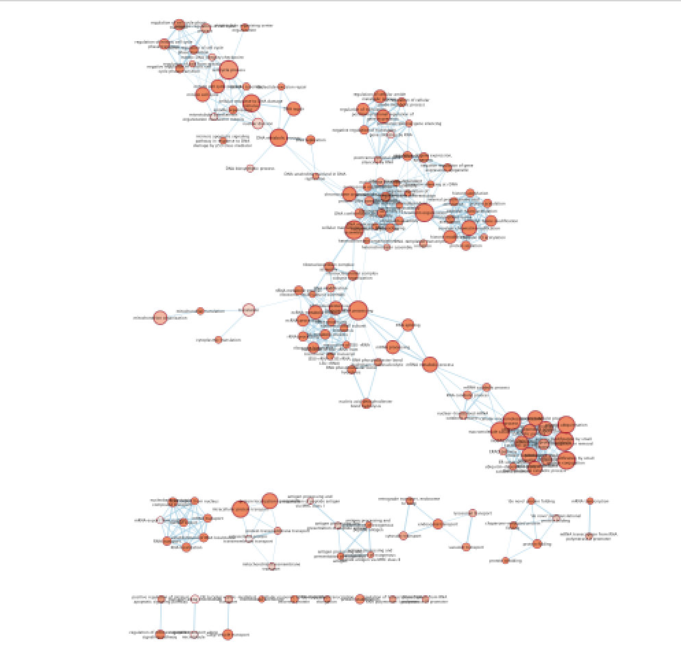
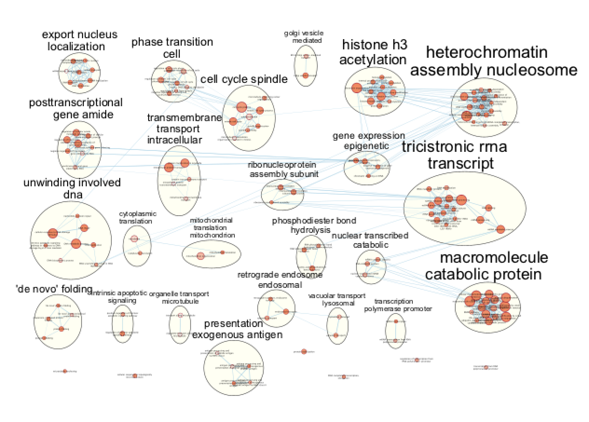

# Module 5 Lab 1: Gene Regulation and Motif Analysis Practical Lab /chIP-seq {#regulatory_network_chipseq_lab}

**This work is licensed under a [Creative Commons Attribution-ShareAlike 3.0 Unported License](http://creativecommons.org/licenses/by-sa/3.0/deed.en_US). This means that you are able to copy, share and modify the work, as long as the result is distributed under the same license.**

*<font color="#827e9c">By Veronique Voisin </font>*

## Goal of this practical lab 

* Perform pathway analysis starting with a chIP_seq bed file and visualize the results using Cytoscape/EnrichmentMap.
* Be able to use the tool GREAT with distal and proximal parameters.
* Run MEME-chip to find over-enrichment of transcription factors.
* Optional: learn how to use iRegulon to find targets of a transcription factor of interest and find orthologs using the tool g:Profiler/g:orth.

This practical lab consists of 6 exercises and 2 of them are optional. Follow the step-by-step checklist trough the exercises.  

Before starting the lab, download the files:

```{block, type="rmd-datadownload"}
Right click on link below and select "Save Link As...".

Place the file in your CBW work directory in the corresponding module directory.
```

*	[GSE128767_RUNX1_ChIP.peaks.bed](./Module5/chipseqlab/chipseqlab_data/GSE128767_RUNX1_ChIP.peaks.bed)
*	[Distal_GOBP_greatExportAll.tsv](./Module5/chipseqlab/chipseqlab_data/Distal_GOBP_greatExportAll.tsv)
*	[Proximal_GOBP_greatExportAll.tsv](./Module5/chipseqlab/chipseqlab_data/Proximal_GOBP_greatExportAll.tsv)
*	[RUNX1_Affy.gmt](./Module5/chipseqlab/chipseqlab_data/RUNX1_Affy.gmt)
*	[GSE128767_RUNX1_ChIP.peaks.fasta](./Module5/chipseqlab/chipseqlab_data/GSE128767_RUNX1_ChIP.peaks.fasta)

```{block, type="rmd-note"}
Note about the EnrichmentMap layout: Network layouts are flexible and can be rearranged. What you see when you perform these exercises may not be identical to what you see in the tutorial, or what you have seen other times that you have performed the exercises. 
```

## Introducing the dataset used during this practical lab

ChIP-seq for RUNX1 from pools of mouse CD1 fetal ovaries (E14.5)
NCBI GEO: GSE128767

From the paper:Nicol B, Grimm SA, Chalmel F, Lecluze E et al. RUNX1 maintains the identity of the fetal ovary through an interplay with FOXL2. Nat Commun 2019 Nov 11;10(1):5116. PMID: 31712577

Abstract: Sex determination of the gonads begins with **fate specification** of gonadal supporting cells into either ovarian granulosa cells or testicular Sertoli cells. This process of fate specification hinges on a balance of transcriptional control. We discovered that the **transcription factor RUNX1** is enriched in the **fetal ovary** in rainbow trout, turtle, mouse, and human. In the mouse, RUNX1 marks the supporting cell lineage and becomes granulosa cell-specific as the gonads differentiate. RUNX1 plays complementary/redundant roles with FOXL2 to maintain fetal granulosa cell identity, and combined loss of RUNX1 and FOXL2 results in masculinization of the fetal ovaries. To determine whether interplay between RUNX1 and FOXL2 occurs at the chromatin level, **we performed genome-wide analysis of RUNX1 chromatin occupancy in E14.5 ovaries. The top de novo motif identified in RUNX1 ChIP-seq matched the RUNX motif**. We found that RUNX1 chromatin occupancy was partially overlapping with FOXL2 chromatin occupancy in fetal ovaries.

 
They found that RUNX1 is expressed in the fetal ovary at day 14 in mice and that it is necessary for a good development of the ovary.

 
A KO of Runx1 and another TF Foxl2 abolished the normal development of the ovary.

Why did we choose this dataset?

*	RUNX1 is a transcription factor that is interesting to study as it has major biological functions. 
*	chIP-seq peaks are stored in a bed file that can be download from GEO entry.
*	Linked to transcriptomic data (GSE129038)
*	Quality of the data


Starting the analysis, the first information that we need to get before doing the analysis is the model organism and genome version. In the GEO entry (https://www.ncbi.nlm.nih.gov/geo/query/acc.cgi?acc=GSM3684638), the information is found by  clicking on one of the sample and under “Data processing” :
* The organism is **mus musculus* and the reference genome is **mm10**
* 3 files are available from the GEO entry (see below).

 

* The bed file provided by the authors (GSE128767_RUNX1_ChIP.peaks.bed)
has the right format to be used for the pathway analysis  using GREAT;
The first 3 fields contain the chromosome name, start and end. They are the 3 required fields. The fourth column is optional and consists of the chromosomal position, followed by MACS2 score value and FDR. 

 


## Exercise 1. Run GREAT in order to perform pathway analysis

* Open a web browser and go to http://great.stanford.edu/public/html/
* In “Species Assembly”, choose Mouse: GRCm38(UCSC mm10, Dec. 2011)
* In “Test regions”, Click on “Choose file” and locate the file GSE128767_RUNX1_ChIP.peaks.bed that you save on your computer.

 

* In “Association rule settings” , click on “Show settings” to see the current rule set to associate genes to peaks

 

* Do not change the settings. We are doing a distal analysis where genes (genomic regions) are associated with peaks within 5k upstream of the transcription start site of the genes (TSS), 1kb downstream and up to 1000 kb to nearest gene.
* Click on the “Submit” button at the end of the page

* Explore the results.
* After expanding the “Job Description” tab and checking the parameters, click on “View all genomic region-gene associations” (blue font)


 * These 2 tables contain the list of the chIP-seq peaks and corresponding associated genes.

* In the “Region-Gene Association Graphs”, we can see that the peaks were mainly associated with genes located +-5kb of the TSS in addition to the presence of some distal peaks as expected based on the association rule that we have used.


* Let’s explore the pathway analysis results and look at the GO Biological Process table.


As we defined a distal rule to associate peaks with genes, we are going to look at the **binomial FDR**. The binomial test assesses whether the number of genomic regions annotated with the tested pathway is significantly larger than the number of genomic regions not annotated with tested pathway.
The fold enrichment is the proportion of genomic regions annotated with the tested pathway and genomic regions not annotated with tested pathway.


* Export the GO BP result on your local computer:
Under the “GO Biological Process” title, locate the “Table controls:” and select the option “All ontology data as .tsv”. A file called greatExportAll.tsv will be saved on your computer. Rename the file "Distal_GOBP_greatExportAll.tsv". We will import this file later in Cytoscape/EnrichmentMap.


* We are now trying a proximal approach to define genes associated with peaks. Go back to the main GREAT page. Make sure the bed file is still uploaded and the genome is set to mm10.
* Locate the “Association rule settings” and click on “Show settings”.
Set Proximal 1kb upstream, 1kb downstream plus Distal up to 1kb . Uncheck the “Include curated regulatory domains” box. 


* Click on Submit.

* Explore the results.
* In the “Region-Gene Association Graphs” , we can see that according to the proximal rule in our settings, genes are associated with peaks that are all within the +-5kb rule (in fact the +-1kb rule) and there is no more distal peaks.


* Explore the GOBP results and export the results on your computer. 

Using this rule, genes will be associated with peaks only if these ones are within 1kb of the transcription start site of the genes. It reduces the problem to a gene list and in this case, a Fisher’s exact (Hyper FDR Q-Val) test can be applied to test for pathway enrichment. 

* Save the file as Proximal_GOBP_greatExportAll.tsv. 


## Exercise 2. Build an enrichment map to visualize GREAT results
* Open Cytoscape
* In the menu bar, select Apps and then EnrichmentMap
* Drag and drop the GREAT result file Distal_GOBP_greatExportAll.tsv
* Set the FDR q value cut-off to 0.001
* Click on Build


* A "Set Parameters" dialog box opens: Choose "Binomial p-value".


* Explore the map.



## Exercise 3 (optional): auto-annotate the distal enrichment map, build the proximal map and compare both the proximal and distal maps

### Optional exercise 3a: AutoAnnotate the enrichment map: 
In the menu bar, select Apps and then AutoAnnotate. A dialog box opens. Click on “Create Annotations”. 


Arrange the display by clicking on each module name listed on the right tab and then move them apart from the other modules using a mouse or a trackpad.



* **Question**: What are the main biological function enriched in genes associated with RUNX1 peaks? Is it relevant in relation to what we know about the role of RUNX1 in development?

### Optional exercise 3b: Repeat the process of building an enrichment map using the proximal data (Proximal_GOBP_greatExportAll.tsv).
Because this is proximal data, the problem is reduced to a gene list and you can use the Fisher’s exact test (FDR 0.001) to looked at the enrichment results

### Optional exercise 3c: Repeat the process by building both the Proximal and Distal enrichment maps at the same time. 
* Drag both files in the EnrichmentMap input box.
* Use FDR 0.0001 for both and binomial test.
* Check which nodes are in common between the 2 datasets.  Color the data by datasets. 

## Exercise 4: Add RUNX1 targets and RUNX1 KO up and down regulated genes on the distal enrichment map as a new gene-set.

During this exercise, we will connect the proximal chIP-seq enrichment map with the RUNX1 targets as well as the genes that are dysregulated after RUNX1 KO. We have already created a .gmt file that contains these gene lists (RUNX1_Affy.gmt). The format of a .gmt file is a tab delimited text file with one row per gene-set. Each gene-set contains the name of the gene-set, a description of the gene-set followed by the names of the genes. The file extension is changed from .txt to .gmt.


* Note: We extracted the RUNX1 targets using the iRegulon Cytoscape app and the optional exercise 6 describes the steps. We extracted 200 genes to built the RUNX1 target gene list.
This RUNX1 study had transcriptomics data (microarray) in addition to the chIP-seq data. The microarray data are giving an overview of all genes that are changing between a fetal ovary with normal development and a fetal ovary after RUNX1 knock-out (KO) (GSE129038). We have used the tool GEO2R to get the top 500 up and down regulated genes (see description of the steps at the end the document).

### step 4a: Add the .gmt file to the enrichment map:
* In Cytoscape,  go to the Network tab and make sure that the Distal_GOBP_greatExportAll network is selected.
* Go to the EnrichmentMap tab and click on “Add Signature Gene Sets…”.


* Click on “Load from File….” located on the right hand size and select the file “RUNX1_Affy.gmt” that you have saved on your computer.
* Set “Test” to “Hypergeometric Test” with the “Cutoff” set to 0.05.


The 3 gene-sets are now added to the map. Each line (edge) shows pathways that have genes in common with the signature gene-sets.

### Step 4b Optional: Change the edge style of the signature gene-sets:

* Click on one signature gene-set node on the map to select it (it should appear in yellow). 
* In the Cytoscape menu bar, do “Select”, “Edges”, “Select Adjacent Edges” 


* Go to “Style” and in the “Edge” table, in the bypass column Byp. , click on the box and select a color.

* Repeat for all genes
* In “ Style” and in the “Edge” table, go to Width and set Column to “EM k_Intersection”


## Exercise 5: Learning how to run MEME-chip from the MEME suite (https://meme-suite.org/meme/tools/meme-chip)
* The first step is to format the data. MEME suite accepts sequences as input and not chromosome coordinates. The bed file contains the chromosome coordinates of the peaks. Therefore, we first have to fetch all the peak sequences. UCSC genome browser (https://genome.ucsc.edu/) has some tools to help us.

* If needed, you can use the finalized formatted file (GSE128767_RUNX1_ChIP.peaks.fasta) but we encourage you to follow the next steps to learn on how to do it yourself.

* The step that we took to create it are described below and were adapted from https://fasta.bioch.virginia.edu/cshl/stubbs/meme-ex/meme.html.

### Exercise 5a: Downloading sequences from .bed coordinates
* Open the UCSC browser main page (http://genome.ucsc.edu/). 
* Click on Genomes in the menu bar and select  mouse GRCm38/mm10. The UCSC Genome Browser window opens in a new tab.


* Below the tracks, click on the button “add custom tracks”. A new window will open.


* Upload the bed file (GSE128767_RUNX1_ChIP.peaks.bed); make sure that "Table Browser" is selected and press the "go" button. 

* Select “sequence” as "output format" and “plain text” as "file type returned". 

* A new window will open where you can choose various options for your sequence (e.g. repeat masking). Note that for meme and similar programs it is important to "mask repeats" to "N"; otherwise, sequences in repetitive elements will dominate your motif list.


* Select get sequence. A fasta file will appear; save this as plain text (copy and paste in a text editor).
* You will need to modify the UCSC header that comes with the sequences to use them for meme:

  * Go to https://fasta.bioch.virginia.edu/fasta_www2/clean_fasta.html
  * upload or copy and paste the plain text file from the above step
  * check Extract CHR:coordinates from UCSC
  * Click on “Clean Sequence”
  * Save this as plain text under the name GSE128767_RUNX1_ChIP.peaks.fasta


### Exercise 5b: Run MEME-chIP

* Open https://meme-suite.org/meme/tools/meme-chip.


* In Input the primary sequences box, upload the file GSE128767_RUNX1_ChIP.peaks.fasta . 
* Click on “Start Search”. 
* **Important**: Save the url so you can access your result later even if you close the MEME window. 
* MEME-ChIP will run for about 1 hour: look at the results below from the MEME-chip result, try to answer the questions and follow next steps. Check your MEME-ChIP results at the end of the practical lab.


* Here below are the results of the top motifs that were found significantly enriched in the peak sequences.
**Question**:To which transcription factor does it correspond? Why is the centered distribution of the motif important (what does it mean)?


## Optional Exercise 6: Get the iRegulon RUNX1 targets and find the mouse orthologs using g:Orth (from g:Profiler) to create the gmt file used in Exercise 4.

* In Cytoscape, locate “App” in the menu bar and select “iRegulon” and then “Query TF-target database”


* A “Query TF-target database for a factor” dialog box opens. Enter “RUNX1” in the “Transcription Factor” field and in “Network”, set “Number nodes (approx.)” to 200. Click on “Submit”


* To arrange the style, go to the Cytoscape menu bar and select “Layout” and “yFiles Organic Layout”. Go the Cytoscape menu and select “View” “Always Show Graphic Details” to see the gene names.
* Below the network, click on “Node Table” and click on the “Export Table to File…” icon. Click on “OK”.


* Open the file Metatargetome for RUNX1_1 default node.csv and copy the gene list. Open g:Profiler/g:orth at https://biit.cs.ut.ee/gprofiler/orth.  Paste the gene list into “Query” and in Options set Organism to Home sapiens and Target to Mus musculus. Click on the orange button “Run query”. 


* Click on the icon next to the  “ortholog name” column to copy the gene list. This is the gene list containing the mouse orthologs of the RUNX1 targets that we used in Exercise 4.


## As reference (you don't need to go through these steps during the practical lab): Analysis of the RUNX1 Affy transcriptomics using GEO2R.
* Go to the GEO page corresponding to the Affymetrix transcriptomics data:https://www.ncbi.nlm.nih.gov/geo/query/acc.cgi?acc=GSE129038
* Click on Analyze with GEO2R
* Define your groups and click on Analyze
* Export the table
* Rank the genes using the absolute value of t
* Remove the gene name duplicates
* Select the top 500 genes up regulated using the largest t value and the 500 genes down regulated using the smallest t value

## End of Lab 
Congratulations!!
