# Module 5 Lab 2: Gene Regulation and Motif Analysis Practical Lab / iRegulon {#regulatory_network_lab}

**This work is licensed 
under a [Creative Commons Attribution-ShareAlike 3.0 Unported License](http://creativecommons.org/licenses/by-sa/3.0/deed.en_US). This means that you are able to copy, share and modify the work, as long as the result is distributed under the same license.**

*<font color="#827e9c">By Veronique Voisin </font>*

## iRegulon lab

## Goal

Import a Cytoscape network and apply iRegulon on all the selected nodes. Explore and understand the main output features of iRegulon such as the Transcription target view. Learn how to display predicted targets of a specific transcription factor by creating its metatargetome.

This practical consists of 2 exercises. Follow the step-by-step checklist trough the exercises. Some notes about iRegulon and information about the output values are written at the end of the document. 

Before starting the exercises, download the files:

```{block, type="rmd-datadownload"}
Right click on link below and select "Save Link As...".

Place it in the corresponding module directory of your CBW work directory.
```

*	[prostate_cancer_genemania_network.txt](./Module5/iregulon/data/prostate_cancer_genemania_network.txt)

```{block, type="rmd-note"}
in case the iRegulon server is not working, it is possible to work with precomputed results. Please look at the instructions at the bottom of this page.
```

## Exercise 1. Detect regulons from co-expressed genes

In this exercise, we are using genes frequently mutated in prostate cancer. iRegulon requires a network from the start, and we will use a GeneMANIA network that we previously saved for this purpose. Using iRegulon, we will look for transcription factors (TFs) that may regulate a set of genes in this network. 
Note: iRegulon also accepts a simple gene list as input to create the network
 
To start this exercise, download to your computer the [prostate_cancer_genemania_network.txt](./Module5/iregulon/data/prostate_cancer_genemania_network.txt) file.

### Skills learned in this exercise: 

Create a network by importing a text file, run iRegulon to detect regulons, explore the iRegulon results, create a regulon subnetwork, save the results. 

### Steps


1)	Launch Cytoscape. Close the “Welcome to Cytoscape” window, if it’s enabled.	

Double click on the .  Cytoscape  icon.


2)	Create a network using the  ‘prostate_cancer_genemania_network.txt’ file.

●	In the menu bar select ‘File > Import > Network >File…. A file open dialog pops up.


●	Browse and locate the prostate_cancer_genemania_network.txt’ file.  Click the ‘Open’ button. An “Import Network From Table” dialog pops up.

 

●	Select the column ‘Entity 1’ .

●	Expand the menu using the arrow on the right and click the green circle button to set this column as ‘Source Node’. 

 

●	Select the column ‘Entity 2’. 


●	Click the red bullseye to set this column as ‘Target Node’.
 
 

●	Click the ‘OK’ button.

The main window now displays the created network. Each node represents a gene. Edges represent the relationships (e.g physical interactions, co-expression)  between the genes (nodes) that were calculated by GeneMANIA.

 

```{block, type="rmd-tip"}
The shortcut ⌘+L (Mac) or Ctrl+L (Windows) is a quicker way to import a network from a file.	
```

```{block, type="rmd-tip"}
If you only see gray nodes, go to Style and choose default style.
```


3)	Improve the layout.

●	In the menu bar, select Layout > Files Layouts > Organic ( you need to install the yFiles layout algorithms app in Cytoscape app manager)


 


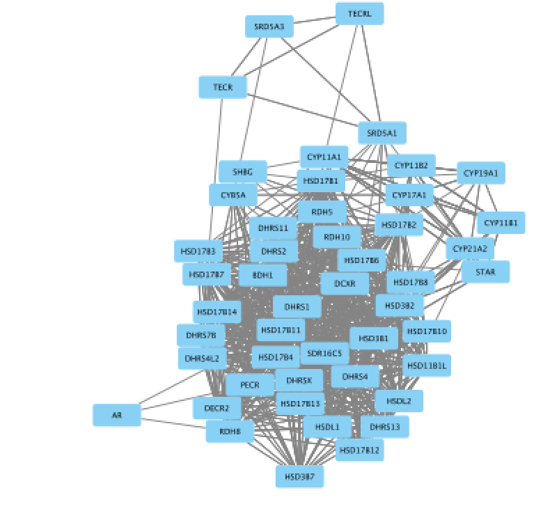 

4)	Select all nodes in the network. To do this using the mouse, click shift and drag from an empty space to the left of and above every node to an empty space to the right of and beneath every node. The selected nodes are now colored yellow.	


5)	In the menu bar, select Apps > iRegulon > Predict regulators and targets.A ‘Predict regulators and targets’ dialog pops up. 

●	Using the default parameters, click the ‘Submit’ button at the bottom of the page.A progress bar will pop up.

●	Wait until the running analysis is completed (usually less than 1 min). The progress bar will vanish, and a new right panel, “Results Panel” will be added to the main Cytoscape window.

●	Deselect all nodes by clicking on a blank space of the screen. The nodes are all cyan again.	

 
 

  


6)	Explore the results. 

●	Locate the ‘Results Panel’ on the right side of the window. 

●	Click on the ‘float window’ icon located at the upper right corner. 

```{block, type="rmd-tip"}
resize the ‘Result Panel’ window by expanding it horizontally and vertically, so you can see the results and the network simultaneously.
```

```{block, type="rmd-tip"}
mouse over column names to get a tooltip describing their meaning in more detail.
```	


7)	Explore the enrichment results in the Motifs tab from the Results Panel. It is a list of all DNA binding motifs that appear in more than one gene region from the prostate cancer gene list. They are ranked by the strongest Normalized Enrichment Score (NES). Some DNA binding motifs in the databases are related to a specific transcription factor, but others are not.
●	Check that ‘Motifs’ is the selected tab of the ‘Results Panel’.

●	Click on the row for this motif to display the motif’s sequence logo and related information at the bottom part of Results Panel.

 
On the above screenshot, there is an enrichment in the prostate gene list for a motif called
YOL108C from the yetfasco database.  The motif logo is displayed and it is very similar to the MITF binding motif. The genes from our network carrying this motif in their promoter region are indicated in red (TargetName). The rank indicates the number of motifs that they carry in their promoter region.

```{block, type="rmd-tip"}
Additional explanation about the results are located at the end of this document and in more detail in the iRegulon reference paper. 
``` 


8)	Explore the enrichment results in the Tracks tab. It is a list of all ChIP-seq datasets (or “tracks”) sorted by strongest enrichment from genes inour network. 

●	Select the  ‘Tracks’ tab of the ‘Results Panel’.

●	Find a ‘ClusterCode’ assigned to more than one track.	


 
T4 is a track cluster associated with 2 tracks and is highlighted in the table as an example.The 2 tracks are biological replicates (Rep1, Rep2) of a same chIP-seq experiment. The transcription factor used for this chIP_seq experiment is TCF12. The first track is ranked number 4 and the second track is ranked number 8.  The genes with TCF12 peaks in their promoter regions are listed in red under "TargetName".


9)	Explore the enrichment results in the Transcription Factors tabview. This is the most important tab as each row is a transcription factor that is a potential co-regulator of the genes in our network. Each row represents a cluster that combines the results of the related motifs (Motifs tab) or tracks (Tracks tab) or both.

●	Select the ‘Transcription Factors’ tab of the ‘Results Panels’. 

●	Click on ‘MTF1’ and explore the results. 	


  


MTF1 is associated with the motif cluster M1. This cluster contains 6 related motifs and  11 potential target genes. One motif (homer-M00129) selected as example in the above screenshot is directly annotated to the TFs NRF1 and ZSCAN10 as indicated by green checked signs. 


10)	How did iRegulon perform? Is MTF1 (metal-transcription factor 1) known to be expressed or to play a role in prostate cancer?

```{block, type="rmd-tip"}
Open your web browser and search the web for [MTF1 “prostate cancer”].	
```

 
 
This network highlights MTF1 and interactions with other genes and miRs. This is a network involved in prostate cancer.
PMID:14568174
PMID:23157640


11)	Add MTF1 to the network.

●	Check that the Transcription Factors tab is selected. 

●	Click the MTF1 row to select it.

●	Click the ‘Add regulator’ icon  located at the upper left corner of the ‘Results Panel’.
This adds MTF1 to the network as a yellow node, with the edges linking to its 11 potential targets, all highlighted as purple nodes.	

11a)

  

11b)
 


12)	Create a subnetwork to better visualize the predicted targets.

●	Select the MTF1 node in the network by clicking on it. 

●	In the Cytoscape toolbar above the network, click the ‘First Neighbors of Selected Nodes’ icon 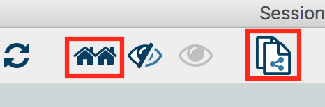. MTF1 and its targets are now highlighted in yellow (which means they are selected).

●	Use the ‘New network from selection’ icon  to create a subnetwork. 	

12a)
 


12b)
 

 
```{block, type="rmd-tip"}
If the node colors are not purple, go to Style and choose 'iRegulon Visual Style'.	
```

 

13)	Add to the figure information on the types of interactions obtained from GeneMANIA and stored as additional information in the ‘prostate_cancer_genemania_network.txt’ file.

●	In the Control Panel at the left of the window, select the ‘Style’ tab. At the bottom of the panel, select the ‘Edge’ tab. 

●	Locate the ‘Stroke Color’ property and click the right triangle to expand the box.

●	Change the ‘Column’ field to ‘Network group’

●	Verify that the  ‘Mapping Type’ field is ‘Discrete Mapping’

●	For the first interaction type, choose a color by clicking on the ‘Edit color’ button   on the right side of the color field. Choose a color and click the ‘OK’ button. 

●	Repeat that step, choosing a different color for each interaction type.
The edges should now be colored by the types of interactions. 	


13a)
 

 

13b)
 

 

14)	Save current results  as an iRegulon (iRF) file.

●	In the ‘Results Panel’ toolbar, click the ‘Save current results  as an iRegulon (iRF) file’ button  ..

●	Choose a name and click the ‘Save’ button.
```{block, type="rmd-tip"}
you can reuse these iRegulon results by loading this iRF file using the ‘Load saved results’ icon  .. 
```

14a)
 

 


15)	Save the Cytoscape session .

●	In the Cytoscape menu bar, select File > Save as.

●	Choose a name and click the ‘Save’ button.
```{block, type="rmd-tip"}
you can re-open this file later to examine the network further.
```

 

 


## Exercise 2. Create a metatargetome using iRegulon and merge 2 networks in Cytoscape.

This exercise does not require additional files.

This exercise will teach you to use the metatargetome function of iRegulon. This function displays a list of potential targets for a specific TF. We will create the metatargetome of two TFs, that we found as potential coregulators of the prostate cancer genes (exercise 1): MTF1 and LARP4. We will then learn how to use Cytoscape to merge two networks and visualize nodes in common.


### Steps

1)	Launch Cytoscape.

If Cytoscape is already opened,  do File > New > Session. A ‘Current session will be lost. Do you want to continue?’ dialog opens. Click on ‘OK’. 	

Double click on the   Cytoscape  icon.

2)	Create the metatargetome for MTF1.

●	From the menu bar , select File > Apps > iRegulon> Query TF-target database.A ‘Query TF-target database for a factor’ window pops up.

●	In the ‘Transcription Factor’ field, select ‘MTF1’. 

●	Set Network > ‘Number nodes (approx.)’ to 100. 

●	Click the ‘Submit’ button.	

2a)

  

2b)

  

2c)

  


3)	Create the metatargetome for LARP4. Follow same steps as above.

●	From the Cytoscape menu bar, select File > Apps>iRegulon> Query TF-target database.

●	A ‘Query TF-target database for a factor’ window pops up. In the ‘Transcription Factor field’, enter ‘LARP4’. 

●	Set Network > ‘Number nodes (approx.)’ to 100.

●	Click the ‘Submit’ button.	

3a)

  

3b)

  


4)	Merge the two networks to visualize their shared target genes.
From the Cytoscape menu bar, select Tools > Merge > Networks….An ‘Advanced Network Merge’ window pops up.

●	Check that the ‘Union’ option is selected. 

●	In the ‘Available Networks’ list, select ‘Metatargetome for LARP4’.

●	Hold down the shift key while selecting ‘Metatargetome for MTF1’ so both networks are selected.

●	Click the right arrow to move the networks to the ‘Networks to Merge’ list.

●	Click the ‘Merge’ button.
Cytoscape now displays the two networks in the same window, linked by the two genes they have in common.

4a)

  

4b)

  

4c)

  


#### END  OF EXERCISE

### Use or precomputed iRegulon results:

Download these files on your computer:

```{block, type="rmd-datadownload"}
Right click on link below and select "Save Link As...".

Place it in the corresponding module directory of your CBW work directory.
```

*	[prostate_cancer_genemania_network.cys](./Module5/iregulon/data/prostate_cancer_genemania_network.cys)

*	[iregulon_results.irf](./Module5/iregulon/data/iregulon_results.irf)

1) launch Cytoscape

2) open the "prostate_cancer_genemania_network.cys" file

3) go to App > iRegulon > 'Load results from the iregulon_results.irf file'  


### Notes about iRegulon:

Website: <http://iregulon.aertslab.org/>
Tutorials: <http://iregulon.aertslab.org/tutorial.html#clusters> 
Paper: <http://journals.plos.org/ploscompbiol/article?id=10.1371/journal.pcbi.1003731> [PMID:25058159]

#### Motif oriented view:

Each line is a DNA binding motif  those sequence has been located in 20 kb regions centered around the TSS (transcription start site) of genes from the prostate cancer list (= genes in the network). The genes from the network which contained this DNA binding motif are called the target genes and displayed in the ‘Target Name’ column. Their ranks are also indicated. 

DNA binding motifs more usually represent a family of transcription factors (e.g.  helix loop helix TFs ) rather than being specific to one particular TF. In addition, related TFs (e.g GATA1, GATA2, GATA3) can bind to very similar DNA sequences.  iRegulon uses the motif2TF algorithm to associate a motif with a specific TF. The ‘#TF’ column indicates which motifs are significantly associated to a TF (# >= 1) or not (# = 0). Clicking on a motif line will display a panel indicating several related information. It will display all the TFs found significantly associated with the motif. 

How is the enrichment calculated? (NES AUC) motif detection and enrichment score in a set of input genes.
iRegulon uses precomputed results to calculate for each motif the AUC (Area Under the cumulative Recovery Curve)  and the NES (Normalized Enrichment Score).   iRegulon accesses this database of precomputed results using a server connection when a search is launched.

What are these precomputed results : 

iRegulon gathered known DNA binding motifs and their corresponding PWM (position weight matrix, see lecture) from different databases (eg TRANSFAC pro)  (9713 PWMs). They then ranked all genes in the genome  (22284 genes) for each motif from the most likely target of this motif to the least one (available for Human, Mouse and Drosophila). 

Calculating enrichment for our set of genes (our network) : 

Each ranked list (each motif) is then tested with our set of genes to see whether genes in our list are located more at the top of the ranked list (most likely targets of the motifs). From this ranked list and the overlap with our gene list, the AUC (Area Under the cumulative Recovery Curve) is calculated for each motif. The AUC is going to be larger if we have more genes at the top of our list. The higher the AUC values and the higher the tested motif is likely to co-regulate our genes (or some of them). The NES is derived from the AUC. The optimal subset of highly ranked lists are set as the potential target genes and displayed in the ‘target name’ column.

How are several motifs being similarly grouped  under a same cluster code?

To find TF associated with motifs, iRegulon uses the motif2TF algorithm. During this computation of motif2TF, motifs sharing similarities are grouped together and form a cluster. Within this cluster, some motifs are already known to correspond to a specific TF (direct annotation). This information is used to associate a motif with one or more related TFs. The ‘ClusterCode’ column indicates the cluster assigned to each motif.


Tracks oriented view:

Each line is an ENCODE Chip_Seq track. Chip_seq are sequencing of fragments bound to a specific TF after immunoprecipitation of the TF and the DNA fragments. Each track is then specific to a transcription factor (the #TFs columns is always equal to 1). Clusters contain more than one track only if these tracks were generated using the same TF. All the values (NES, AUC,... are the same for the motif, track of transcription factor oriented views. 

Transcription Factors oriented view:

Each line is a cluster of motifs and or tracks and as the next column (TF) the best representative TF of this cluster determined by the motif2TF algorithm. All the values (NES, AUC,... are the same for the motif, track of transcription factor oriented views. 

Metatargetome:

iRegulon uses the pre-computed results not only for finding regulons but also for displaying the potential gene targets for any TF of interest available in the iRegulon database. Users can define the number of top potential targets they want to display. The result is visualized as a network using a circular layout with the TF of interest in the center of the network.  

### Notes about Cytoscape:

Link to tutorials showing how to format data to create a Cytoscape network starting from a simple gene list:
<http://wiki.cytoscape.org/Cytoscape_User_Manual/Network_Formats>

Note about organic layout:

“The organic layout style is based on the force-directed layout paradigm. When calculating a layout, the nodes are considered to be physical objects with mutually repulsive forces, like, e.g., protons or electrons. The connections between nodes also follow the physical analogy and are considered to be springs attached to the pair of nodes. … The layout algorithm simulates these physical forces and rearranges the positions of the nodes in such a way that the sum of the forces emitted by the nodes and the edges reaches a (local) minimum.

Resulting layouts often expose the inherent symmetric and clustered structure of a graph, they show a well-balanced distribution of nodes and have few edge crossings.” http://docs.yworks.com/yfiles/doc/developers-guide/smart_organic_layouter.html . 


############################################################

## Exercise 3. Use Enrichr with the prostate gene list.

Before starting the exercise, download the files:

*	[prostate_genelist.csv](./Module5/iregulon/data/prostate_genelist.csv)
*	[TRRUST_Transcription_Factors_2019_table.txt](./Module5/iregulon/data/TRRUST_Transcription_Factors_2019_table.txt)
*	[TTRUST_rank.xlsx](./Module5/iregulon/data/TTRUST_rank.xlsx)

### Goal

 * Use Enrichr on the prostate gene list and explore which transcription factors were predicted to be regulator on the same gene list used for the iRegulon lab.

 * After exploring the Enrichr results, we are going to export it into Cytoscape/EnrichmentMap. This is another opportunity to learn how to create a network and modify its style.

### Steps

1)	Launch Enrichr on a web browser using this address: https://amp.pharm.mssm.edu/Enrichr/

2) In the input data window, copy and paste the genes from the [prostate gene list](./Module5/iregulon/data/prostate_genelist.csv) 

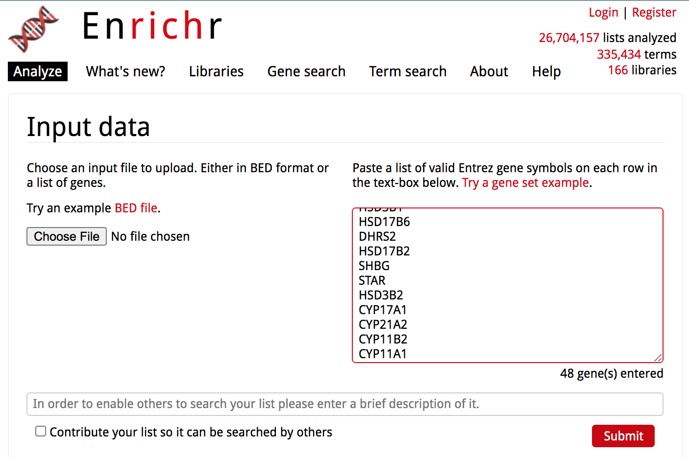 

3) Click on the 'Submit' button

4) The results are now displayed. Check that the 'Transcription' tab is the one selected.
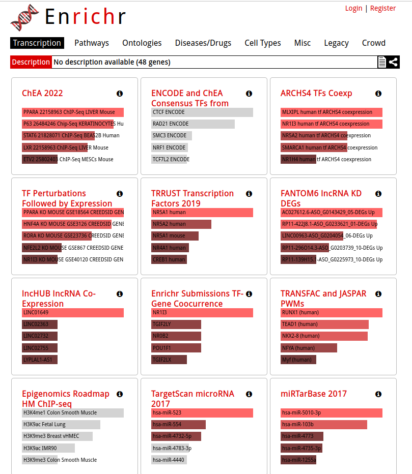 

●	Explore the results from the different gene-set libraries on your own (CHEA 2016, TRANSFAC and JASPAR PWMs, etc...) . 

5) Then, click on the gene-set library called "TRRUST Transcription Factors 2019"

● TRRUST (https://www.grnpedia.org/trrust/) is a manually curated database of human and mouse transcriptional regulatory networks. Each gene-set contained some target genes for a particular transcription factor. It contains mouse and human data. They have been derived from pubmed articles which describe small-scale experimental studies of transcriptional regulations.
● We are going to explore the result in this library as some gene-sets are significantly enriched at FDR < 0.05.

 

● The observation of the bar graph indicates that the transcription factor NR5A1 is the most significant result.

6) Click on the 'Table' to display the results as a table.

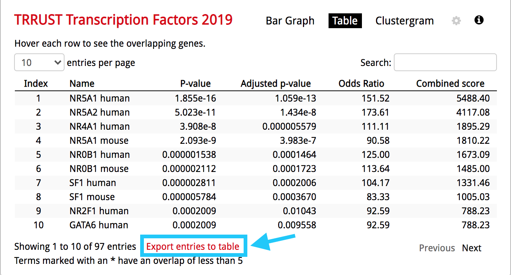 

● Remember from the presentation that the Adjusted p-value represents the FDR. As the FDR is less than 0.05, all these gene-sets are significantly enriched in our gene list. 

7) Click on the 'Export entries to table'. Open the file that was downloaded on your computer in excel.

 

● This table contains all the gene-sets significantly enriched or not.
● The 'Term' column contains the name of the transcription factors and the last column 'Genes' contains the list of genes that are the targets of these transcription factors. All these genes are the ones present in the prostate gene list. The overlap 8/22 means that 22 genes are the known target of NR5A1 and 8 are present in the prostate gene list.
● We are going to use this table to create an enrichment map in Cytoscape. 

7) Open Cytoscape.

8) Click in the menu bar on 'Apps' and 'EnrichmentMap'. A 'Create Enrichment Map' dialog box opens. 

9) Drag and drop the  [TRRUST_Transcription_Factors_2019_table.txt](./Module5/iregulon/data/TRRUST_Transcription_Factors_2019_table.txt) in the 'Data Sets' window. 
● On the right, check that the "Analysis Type" is set to "Generic/gProfiler/Enrichr". 
● Set the 'FDR q-value cutoff' at 0.05.

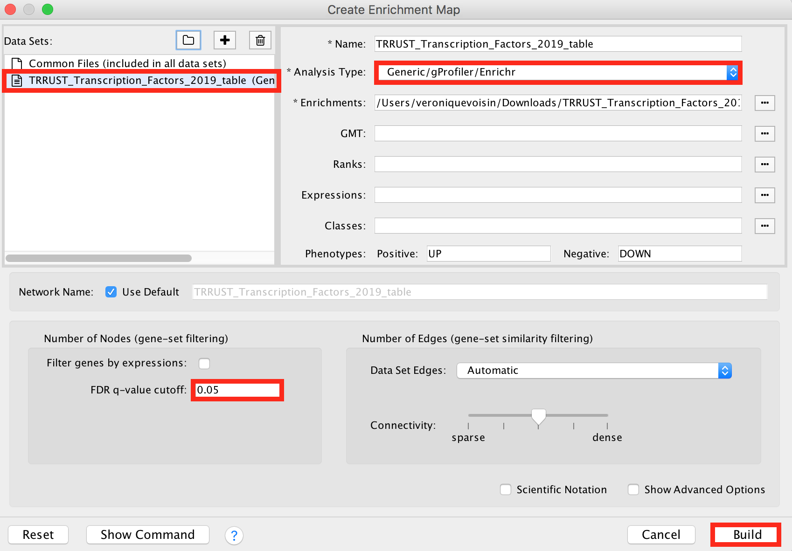 

10) Click on the 'Build' button.

11) An enrichment map is now created.

 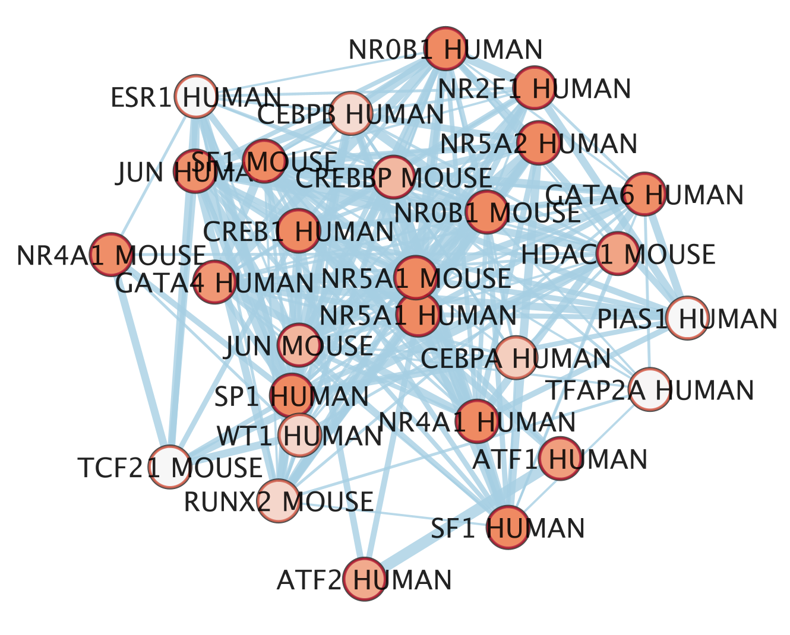
 
● The nodes are the transcription factor gene-sets. You can click on a node to see the genes that are the targets of these transcription factors. Transcription factors are connected by edges if they have target genes in common. 

12) Modify the visual style

● In the EnrichmentMap tab on the right, locate 'Style' and set "Chart Data" to '--None--'.
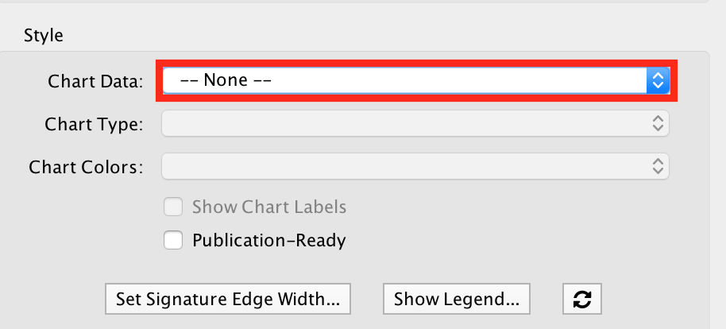 

13) Import a file

● Our goal is to adjust node size and node color relatively to the gene-set enrichment results. To make it easier, a file has been created for you that ranks the gene-sets from 1 to 98 in the order of the adjusted p values. We will import this file in Cytoscape as a node table. 

● To import the file, locate 'File' in the Cytoscape menu bar and then 'Import' > 'Table from File'.

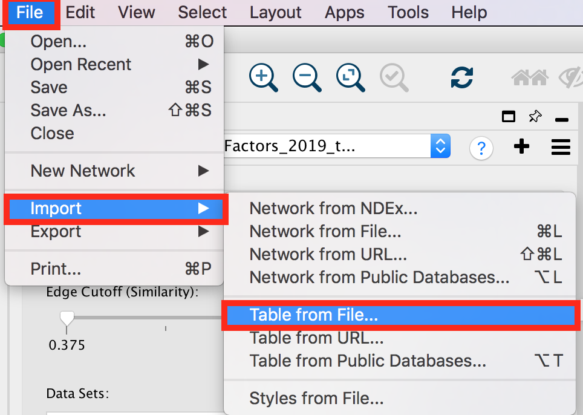 

● Browse your computer to find the file [TTRUST_rank.xlsx](./Module5/iregulon/data/TTRUST_rank.xlsx) that you have downloaded at the beginning of part 3 and click 'Open'.

● An 'Import Columns From Table' dialog box opens. Click on 'OK'.


14) Play with the visual style

● Locate the Cytoscape 'Style' tab 


● Locate the 'Cytoscape 'Style' tab 'Fill Color' property in the Node tab and expand the tab using the arrow on the right

● Remove the current mapping using the trash can icon.

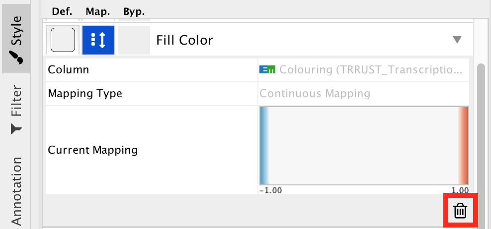


● In 'Column', choose "myrank" and in 'Mapping Type', choose 'Continuous Mapping'.

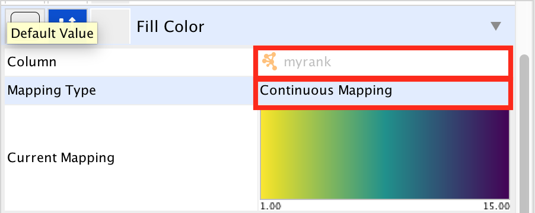


● Locate the 'Size' property and expand the tab using the arrow on the right

● Remove the current mapping using the trash can icon.


● In 'Column', choose "myrank" and in 'Mapping Type', choose 'Continuous Mapping'.

● Set high node size values for low rank and low node size for high rank


● The enrichment map shows now in yellow and large nodes the transcription factors that were the most significantly enriched (based on the adjusted p value ranking). It also shows the links to the other gene-sets. 

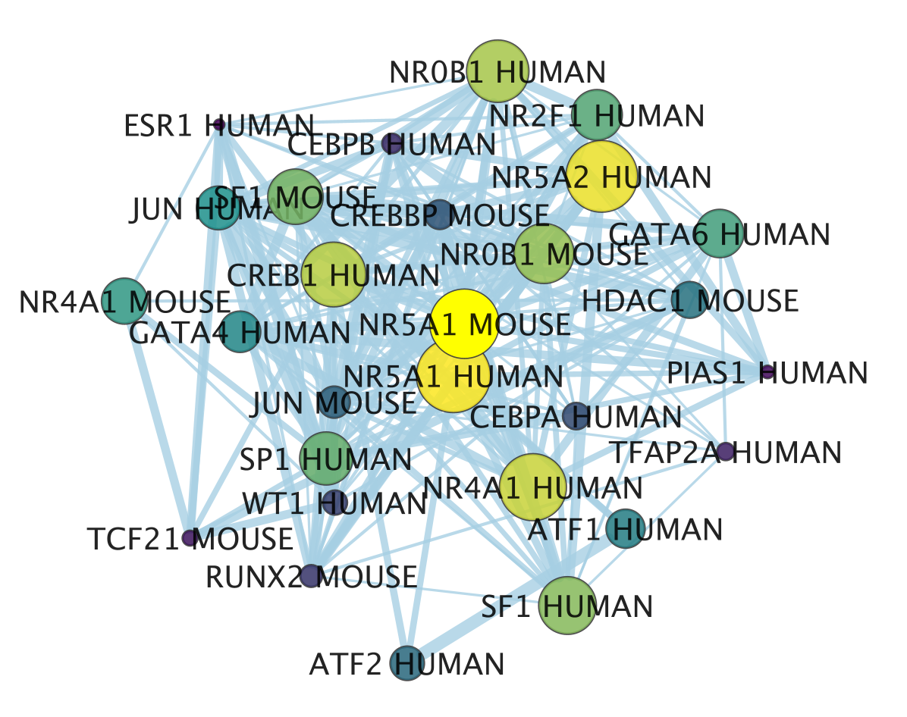
●  NR5A1 (the most significant gene-set) is indeed known to be associated with prostate cancer. The prostate is a hormone-dependent organ. NR5A1 is a steroid nuclear receptor and has now been reported to be expressed in aggressive forms of prostate cancer (https://academic.oup.com/endo/article/155/2/358/2423115). 


### end of practical lab
Congratulations!


