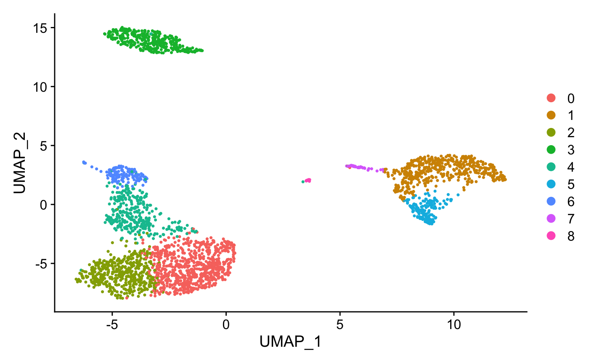
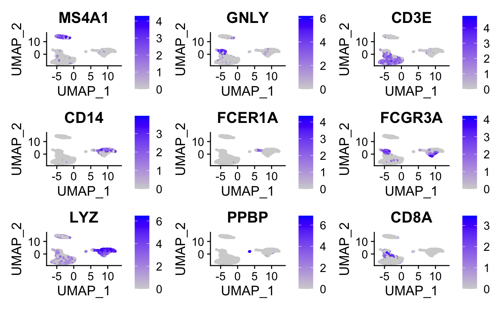
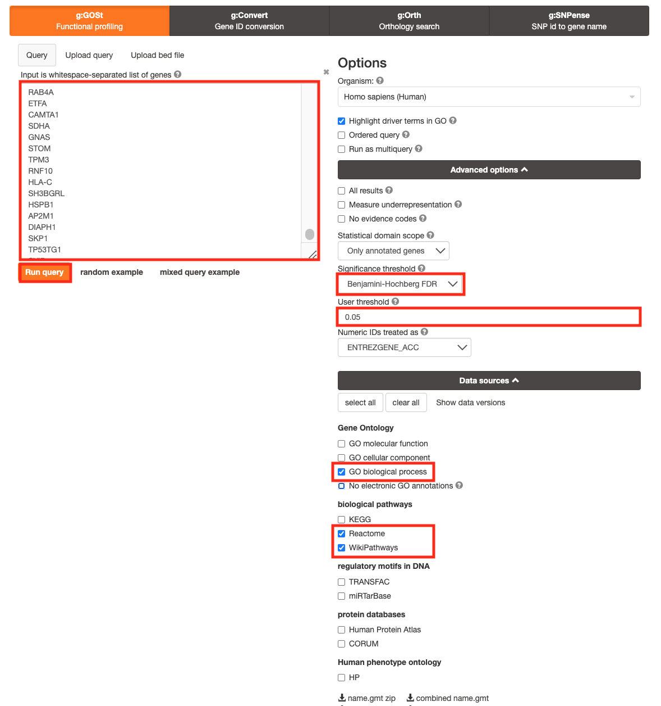
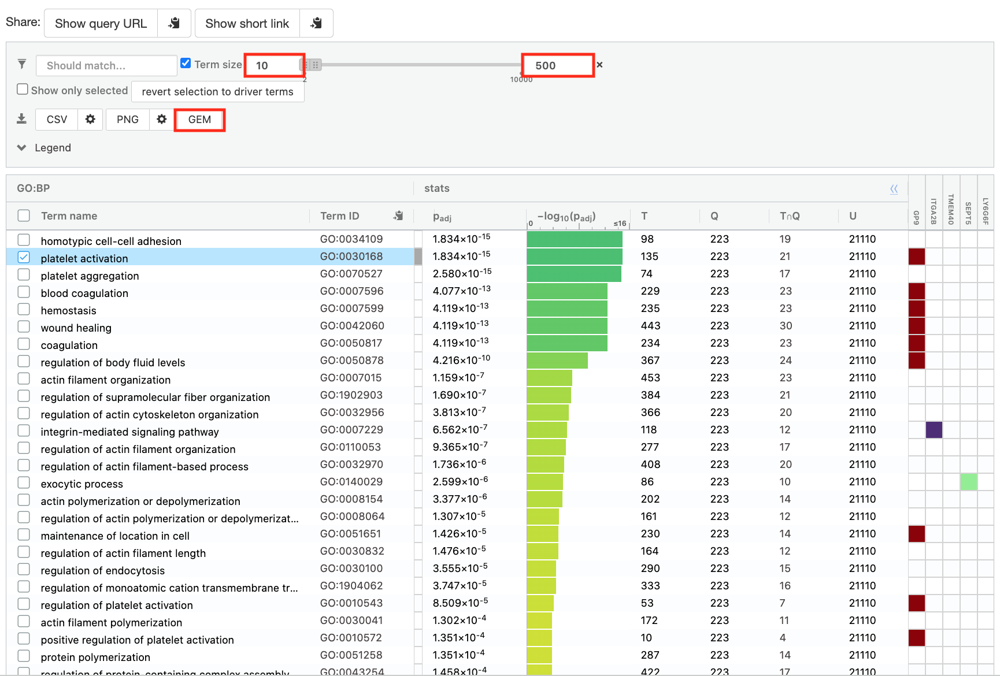
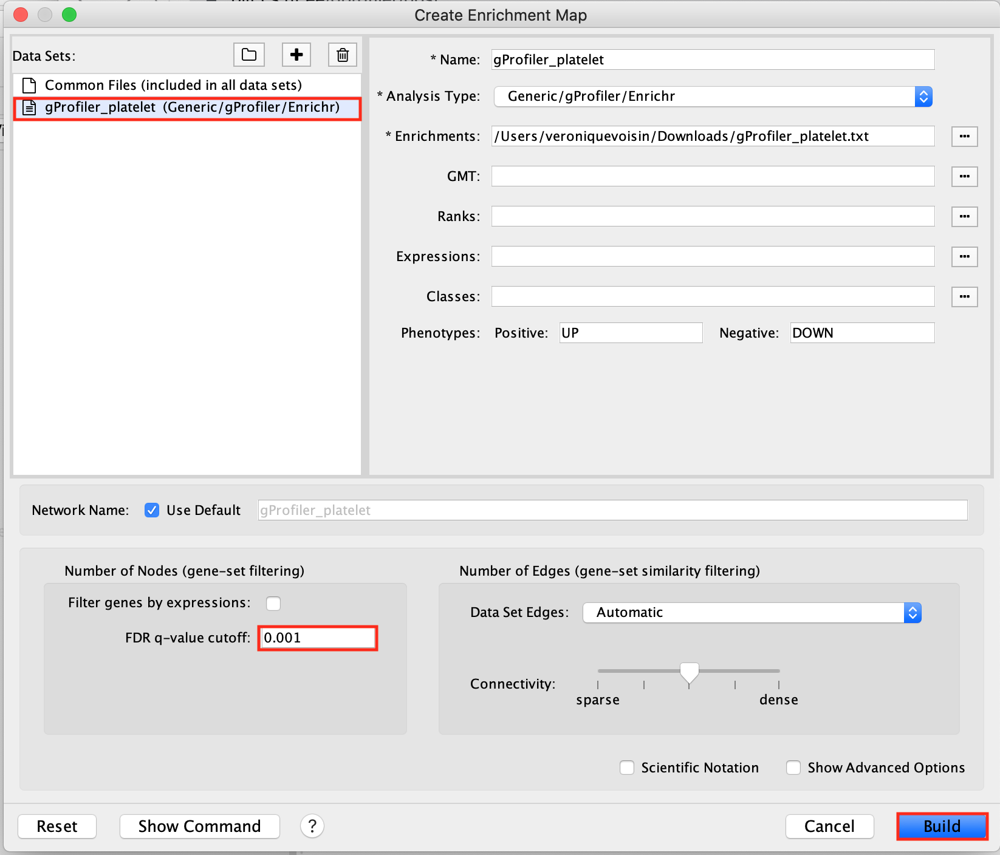
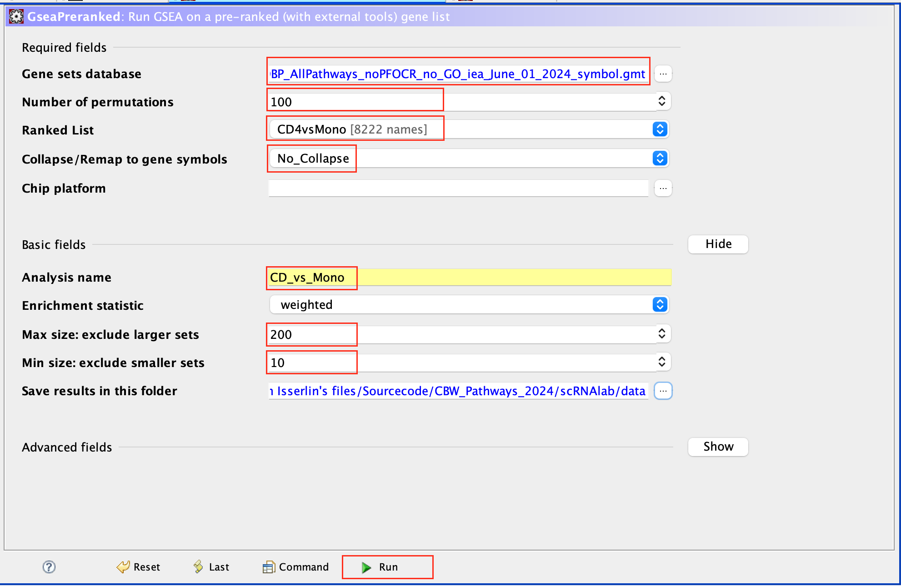
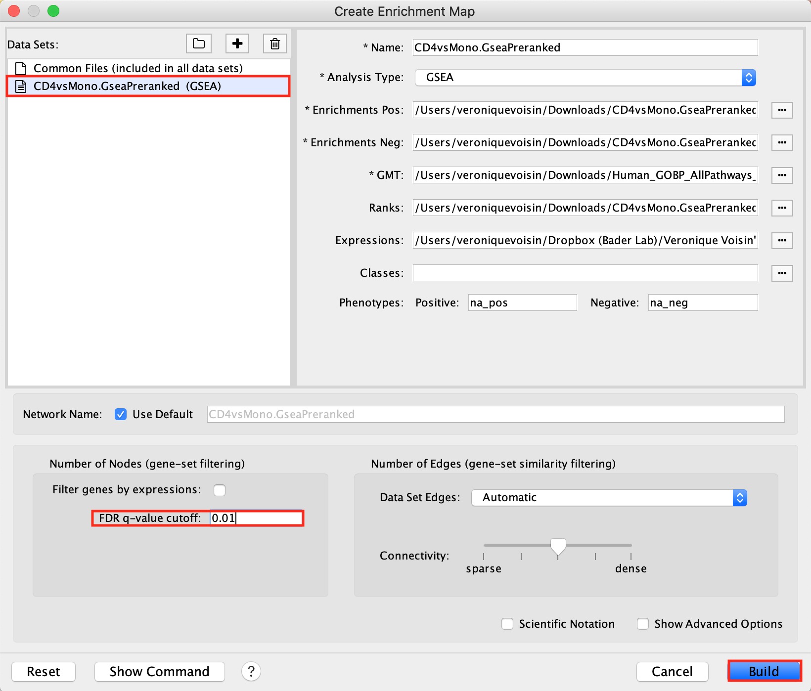
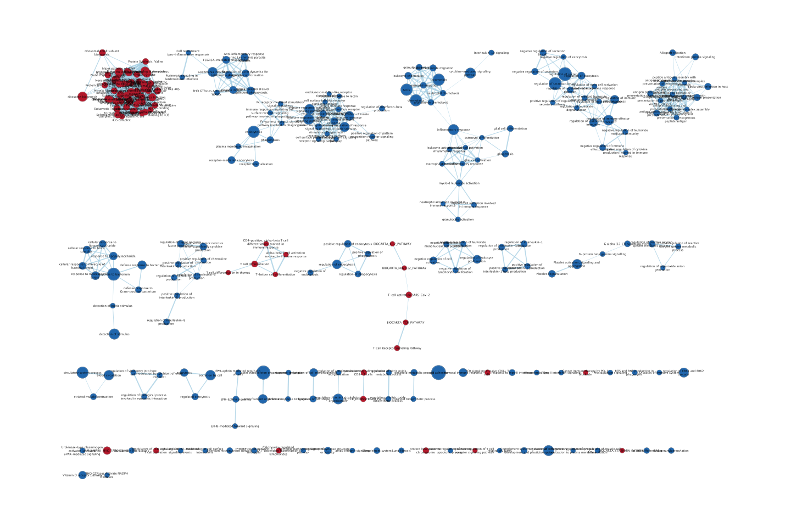

# Module 6 lab 1: scRNA PBMC {#scRNA-lab1}

**This work is licensed under a [Creative Commons Attribution-ShareAlike 3.0 Unported License](http://creativecommons.org/licenses/by-sa/3.0/deed.en_US). This means that you are able to copy, share and modify the work, as long as the result is distributed under the same license.**
 
*<font color="#827e9c">By Veronique Voisin, Chaitra Sarathy and Ruth Isserlin</font>*

## Introduction
As an example of applying pathway and network analysis using single cell RNASeq, we are using the [Seurat tutorial]((https://satijalab.org/seurat/articles/pbmc3k_tutorial.html) as starting point.  This dataset consists of Peripheral Blood Mononuclear Cells (PBMC) and is a freely available dataset from 10X Genomics. There are 2,700 single cells that have been sequenced on the Illumina NextSeq 500 (https://satijalab.org/seurat/articles/pbmc3k_tutorial.html). 

```{block, type="rmd-note"}
The R code in this practical lab was used to produce the gene lists to use in the downstream analysis.
It is for your reference. 

**YOU DON'T NEED TO RUN IT FOR THIS PRACTICAL LAB.** 

**ALL NECESSARY FILES ARE PROVIDED.**
```

## Pmbc3k Seurat Pipeline 
Here is the Seurat pipeline that we followed to prepare data for the practical lab.
Do not run. This for you reference only.

## load libraries
```{r eval=FALSE}
library(dplyr)
library(Seurat)
library(patchwork)
```

## Load the PBMC dataset
```{r eval=FALSE}
pbmc.data <- Read10X(data.dir = "../data/pbmc3k/filtered_gene_bc_matrices/hg19/")
# Initialize the Seurat object with the raw (non-normalized data).
pbmc <- CreateSeuratObject(counts = pbmc.data, project = "pbmc3k", 
                                min.cells = 3, min.features = 200)
pbmc
```

## Process the dataset
```{r eval=FALSE}
pbmc[["percent.mt"]] <- PercentageFeatureSet(pbmc, pattern = "^MT-")
pbmc <- NormalizeData(pbmc, normalization.method = "LogNormalize", scale.factor = 10000)
pbmc <- NormalizeData(pbmc)
pbmc <- FindVariableFeatures(pbmc, selection.method = "vst", nfeatures = 2000)

all.genes <- rownames(pbmc)
pbmc <- ScaleData(pbmc, features = all.genes)
pbmc <- RunPCA(pbmc, features = VariableFeatures(object = pbmc))
pbmc <- FindNeighbors(pbmc, dims = 1:10)
pbmc <- FindClusters(pbmc, resolution = 0.5)
pbmc <- RunUMAP(pbmc, dims = 1:10)

DimPlot(pbmc, reduction = "umap")
```



## Assign cell type identity to clusters
For this dataset, we use canonical markers to match clusters to known cell types:    
```{r eval=FALSE}
new.cluster.ids <- c("Naive CD4 T", "CD14+ Mono", "Memory CD4 T", "B", "CD8 T", 
                                "FCGR3A+ Mono","NK", "DC", "Platelet")
names(new.cluster.ids) <- levels(pbmc)
pbmc <- RenameIdents(pbmc, new.cluster.ids)
DimPlot(pbmc, reduction = "umap", label = TRUE, pt.size = 0.5) + NoLegend()

```


## Find differentially expressed features (cluster biomarkers)
Find markers for every cluster compared to the remaining cells and report only the genes with positive scores, ie. genes specific to the cluster and not the rest of the cells. The list of genes specific to each cluster will be used in the downstream analysis.
```{r eval=FALSE}
#Use the FindAllMarkers seurat function to find all the genes 
#associated with each cluster
pbmc.markers <- FindAllMarkers(pbmc, only.pos = TRUE, min.pct = 0.25, 
                                              logfc.threshold = 0.25)
pbmc.markers %>%
    group_by(cluster) %>%
    slice_max(n = 2, order_by = avg_log2FC)

#plot graphs for a subset of the genes    
FeaturePlot(pbmc, features = c("MS4A1", "GNLY", "CD3E", 
                  "CD14", "FCER1A", "FCGR3A", "LYZ", "PPBP","CD8A"))
    
write.csv(pbmc.markers, "pbmc.markers.csv")

```


## Create Gene list for each cluster to use with g:Profiler (Do not run code)
Now that we have the list of genes that are specific to each cluster, it would be useful to perform pathway analysis on each list. It could provide a deeper understanding on each cluster. In some cases, it might help to adjust the labels associated with the clusters using marker genes.

In order to do that, we have extracted each cluster gene list from the [pbmc.markers.csv](./scRNAlab/data/Pancancer_pbmc.markers.csv) file.

```{r eval=FALSE}
#modify the names of some of the clusters to get rid of spaces and symbols
pbmc.markers$cluster = gsub("Naive CD4 T", "Naive_CD4_T", pbmc.markers$cluster)
pbmc.markers$cluster = gsub("CD14\\+ Mono", "CD14pMono", pbmc.markers$cluster)
pbmc.markers$cluster = gsub("Memory CD4 T", "Memory_CD4_T", pbmc.markers$cluster)
pbmc.markers$cluster = gsub("CD8 T", "CD8_T", pbmc.markers$cluster)
pbmc.markers$cluster = gsub("FCGR3A\\+ Mono", "FCGR3Ap_Mono", pbmc.markers$cluster)

#get the set of unique cluster names
cluster_list = unique(pbmc.markers$cluster)

#go through each cluster and create a file of its associated genes. 
# output the genes associated with each cluster into a file named by the 
# cluster name
for (a in cluster_list){
  print(a)
  genelist = pbmc.markers$gene[which( pbmc.markers$cluster == a)]
  print(genelist)
  write.table(genelist, paste0(a, ".txt"), sep= "\t", col.names = F, 
                                              row.names = F, quote=F)
}
```

## Data (gene lists for each cluster)

 * [Naive_CD4_T.txt](./scRNAlab/data/Naive_CD4_T.txt)
 * [CD14pMono.txt](./scRNAlab/data/CD14pMono.txt)
 * [Memory_CD4_T.txt](./scRNAlab/data/Memory_CD4_T.txt)
 * [B.txt](./scRNAlab/data/B.txt)
 * [CD8_T.txt](./scRNAlab/data/CD8_T.txt)
 * [FCGR3Ap_Mono.txt](./scRNAlab/data/FCGR3Ap_Mono.txt)
 * [NK.txt](./scRNAlab/data/NK.txt)
 * [DC.txt](./scRNAlab/data/DC.txt)
 * [Platelet.txt](./scRNAlab/data/Platelet.txt)

## Run pathway enrichment analysis using g:Profiler

For this practical lab, we will use the platelet gene list to enriched pathways and processes using g:Profiler. 

  1. Open the g:Profiler website at [g:Profiler](https://biit.cs.ut.ee/gprofiler/gost) in your web browser.
  1. Open the file ([Platelet.txt](./scRNAlab/data/Platelet.txt)) in a simple text editor such as Notepad or Textedit.  Select and copy the list of genes.
  1.  Paste the gene list  into the Query field in top-left corner of the g:Profiler interface. 
  1.   Click on the *Advanced options* tab to expand it.
  1.   Set *Significance threshold* to "Benjamini-Hochberg FDR"
  1.   Select 0.05
  1.  Click on the *Data sources* tab to expand it:
  1.  UnSelect all gene-set databases by clicking the "clear all" button.
  1.  In the *Gene Ontology* category, check  *GO Biological Process* and *No electronic GO annotations*.
  1.  In the *biological pathways* category, check *Reactome* and check *WikiPathways*.
  1.  Click on the *Run query* button to run g:Profiler. <br>
  1.  Save the results
    * In the *Detailed Results* panel, select "GEM" . 
    * keep the minimum term size set to 10 
    * set maximum term size to 500 
    * This will save the results in a text file in the "Generic Enrichment Map" format that we will use to visualize in Cytoscape.<br>
  1. Rename the file to [gProfiler_platelet.txt](./scRNAlab/data/gProfiler_platelet.txt)

## Create an enrichment map in Cytoscape
  1. Open Cytoscape
  1. Go to Apps -> EnrichmentMap
  1. Select the EnrichmentMap and click on the + sign to open the app.<br>
  1. Drag and drop the g:Profiler file ([gProfiler_platelet.txt](./scRNAlab/data/gProfiler_platelet.txt))
  1. Set **FDR q-value cutoff** to 0.001
  1. Click on **Build**<br>
  1. An enrichment map is created:<br>
  1. For clarity, you can use the AutoAnnotate app to annotate and cluster the enrichment map.
  1. In Cytoscape menu , go to Apps, AutoAnnotate, New Annotation Set...
  1. A dialog box opens, click on **OK**<br>

```{block, type="rmd-note"}
The boxes **Palette** and **Word Wrap** have been selected. The clusters have been moved around for clarity.
```

### GSEA from pseudobulk
#### pseudobulk creation, differential expression and rank file

We also can create pseudobulk data from the scRNA data by summing all cells into defined groups. We used the clusters to group the cells and we calculate  differential expression using edgeR. We compare the CD4 cells (Naive CD4 T and Memory CD4 T) and the monocytic cells (CD14+ Mono and "FCGR3A+ Mono) .
As shown in [module 3](#gsea_mod3), in order to perform pathway analysis,we prepare a rank file, run GSEA and create an enrichment map in Cytoscape.

* Data:
  * rank file: [CD4vsMono.rnk](./scRNAlab/data/CD4vsMono.rnk)
  * gmt file:  [Human_GOBP_AllPathways_no_GO_iea_April_02_2023_symbol.gmt](./Module2/gsea/data/Human_GOBP_AllPathways_no_GO_iea_April_02_2023_symbol.gmt)
 
### run GSEA:
  1. Open GSEA
  1. Select **Load Data**
  1. Drag and Drop the rank  [CD4vsMono.rnk](./scRNAlab/data/CD4vsMono.rnk) and gmt * [Human_GOBP_AllPathways_no_GO_iea_April_02_2023_symbol.gmt](./Module2/gsea/data/Human_GOBP_AllPathways_no_GO_iea_April_02_2023_symbol.gmt) files.
  1. Click on **Load these files**
  1. Click on **Run GSEAPreranked**
  1. In **Gene sets database**, click on the 3 dots, select **Local GMX/GMT** , select the gmt file, click on OK.
  1. Set the **Number of permutations** to 100
  1. Select the rank file: CD4vsMono.rnk
  1. Expand **Basic Fields**
  1. In the field **Collapse/Remap to gene symbols**, select **No_Collapse**
  1. Add an analysis name of your choice
  1. Set **Max size** to 200 and **Min size** to 10.
  1. Click on **Run**<br>

```{block, type="rmd-tip"}
Use 2000 permutations and MAX_Size to 1000 for your own analysis. You can decide to further reduce MAX_Size to 500 or 200. 
```
 
### Create an EnrichmentMap:
  1. Open Cytoscape
  1. In Apps, select EnrichmentMap
  1. Select the EnrichmentMap tab, click on the + sign. A **Create Enrichment Map** windows pops up.
  1. Drag and drop the GSEA folder in the **Data Sets** window. It automatically populates the fields.
  1. Set the **FDR q-value cutoff** to 0.01 
  1. Click on **Build**<br>

  * The enrichment map is now created. The red nodes are pathways enriched in genes up-regulated in CD4 cells when compared to the monocytic cells. The blue nodes are pathways enriched in genes up-regulated in monocytic cells.<br>


See code below for your reference ( pseudobulk, differential expression and rank file). 
```{r eval=FALSE}
library(dplyr)
library(Seurat)
library(patchwork)
library(ggplot2)
library(AUCell)
library(RColorBrewer)
library(scuttle)
library(SingleCellExperiment)
library(edgeR)
library(affy)

names(new.cluster.ids) <- levels(pbmc)
pbmc <- RenameIdents(pbmc, new.cluster.ids)
counts <- pbmc@assays$RNA@counts 
metadata <- pbmc@meta.data
sce <- SingleCellExperiment(assays = list(counts = counts), colData = metadata)
sum_by <- c("seurat_clusters")
summed <- scuttle::aggregateAcrossCells(sce, id=colData(sce)[,sum_by])
raw <- assay(summed, "counts") 
colnames(raw) =   c("Naive_CD4_T", "CD14p_Mono", "Memory_CD4_T", "B", "CD8_T", 
                    "FCGR3Ap_Mono","NK", "DC", "Platelet")
saveRDS(raw, "raw.rds")

count_mx = as.matrix(raw)
myGroups = c("CD4","Mono" ,"CD4","B" , "CD8_T","Mono","NK", "DC","Platelet" )
y <- DGEList(counts=count_mx,group=factor(myGroups))
keep <- filterByExpr(y)
y <- y[keep,keep.lib.sizes=FALSE]
y <- calcNormFactors(y)
design <- model.matrix(~0 + myGroups )
y <- estimateDisp(y,design)
my.contrasts <- makeContrasts(CD4vsMono=myGroupsCD4-myGroupsMono, 
                              levels = design )
mycontrast = "CD4vsMono"
fit <- glmQLFit(y,design)
qlf <- glmQLFTest(fit,coef=2, contrast = my.contrasts[])
table2 = topTags(qlf, n = nrow(y))
table2 = table2$table
table2$score =  sign(table2$logFC) * -log10(table2$PValue)
myrank = cbind.data.frame(rownames(table2), table2$score)
colnames(myrank) = c("gene", "score")
myrank = myrank[ order(myrank$score, decreasing = TRUE),]
write.table(myrank, paste0(mycontrast, ".rnk"), sep="\t", row.names = FALSE, 
            col.names = FALSE, quote = FALSE)
```


```{block, type="rmd-tip"}
Some methods like AddModuleScore or AUCell do pathway enrichment analysis of each of cells and the enrichment results are usually display on the UMAP using a color code. It involves R coding and is out of the scope for this workshop.
```


