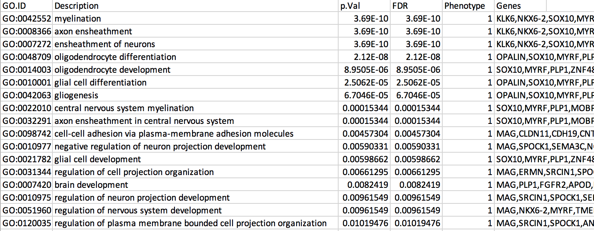
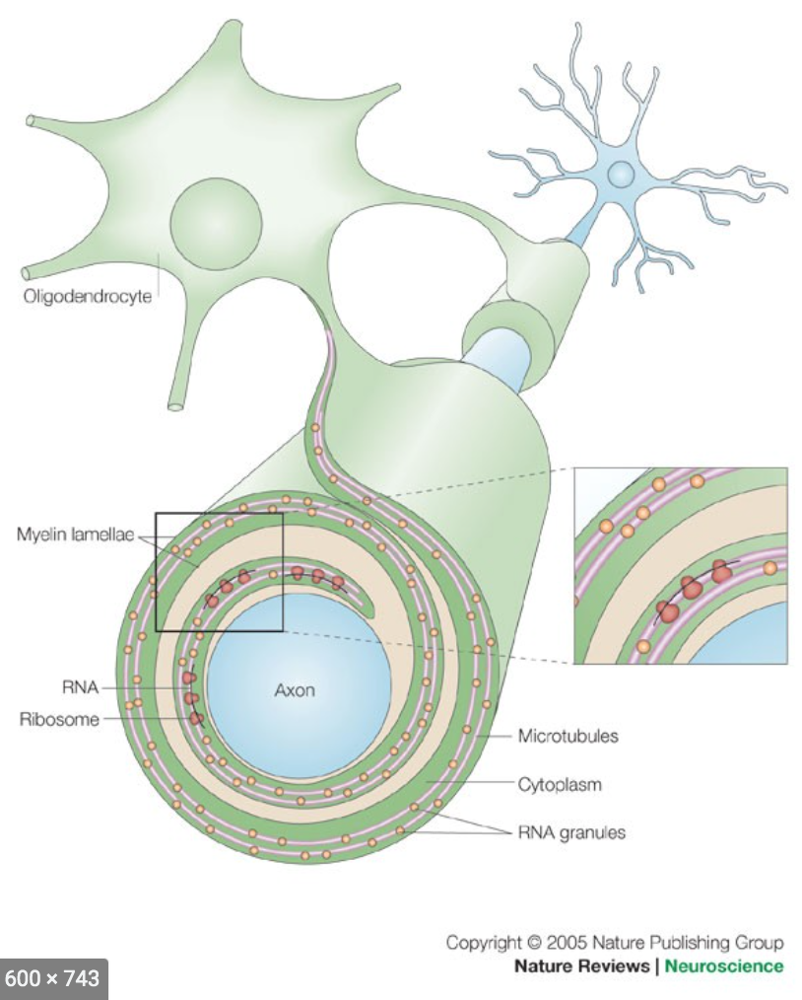
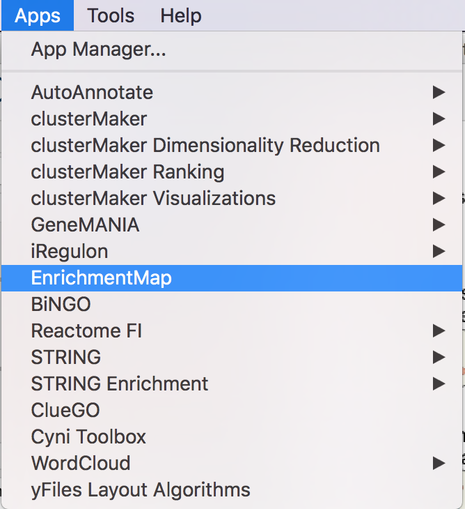
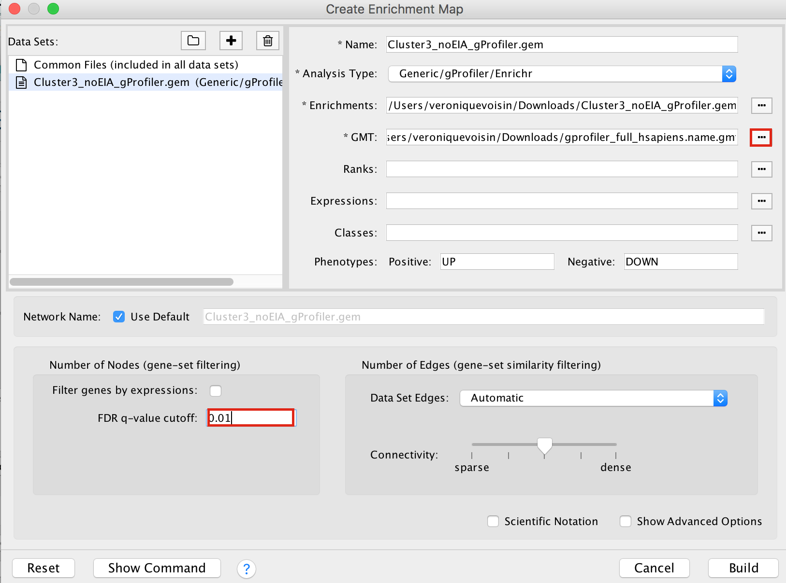
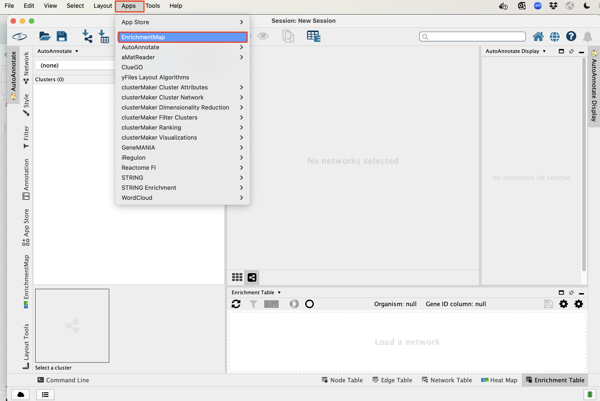
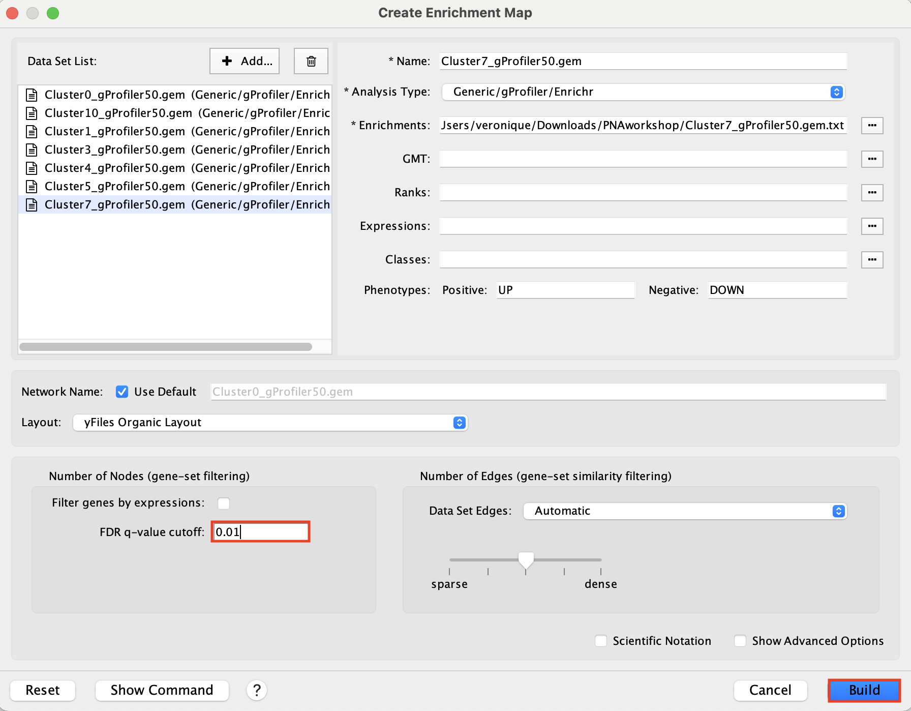
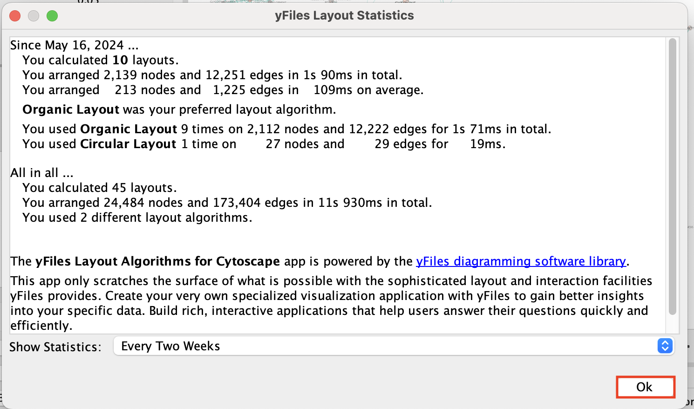
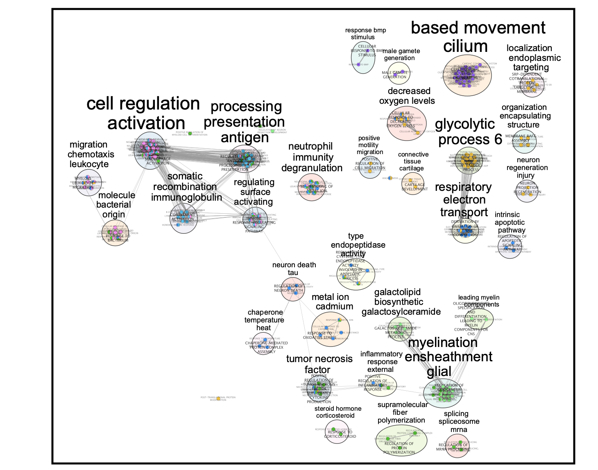

# Module 6 lab 2- scRNA Glioblastoma {#scRNA_glioblastoma}

**This work is licensed under a [Creative Commons Attribution-ShareAlike 3.0 Unported License](http://creativecommons.org/licenses/by-sa/3.0/deed.en_US). This means that you are able to copy, share and modify the work, as long as the result is distributed under the same license.**
 
## Introduction

This lab uses scRNA from brain cancer (glioblastoma). The scRNA shows the heterogeneity of the sample, there are cancer tissues and other cell types like immune cells. We will perform Over-Representation Analysis (ORA) using the gene list of each cluster type in  [g:Profiler](https://biit.cs.ut.ee/gprofiler/gost) to uncover the function of each cluster.

### Goal

The goal is to show how to built a **master enrichment map** from the results of scRNA. The scRNA is composed of different cell types. The cells are clustered, annotated in different cell types and this can be visualized as a UMAP 2 dimensional plot. Pathways enrichment is run on each cluster gene list and an enrichment map containing all the results is created.

Note: This lab shows the use of a custom background in g:Profiler.

### Data
High-quality single-cell suspensions were generated by dissociating biopsied tissues in accutase and DNase fron patientGBM tumors. Library preparation was carried out as per the 10X Genomics Chromium single-cell protocol using the v2 chemistry reagent kit and sequencing was run on an Illumina 2500. 


### Overview
The practical lab contains 3 parts. The first part uses [g:Profiler](https://biit.cs.ut.ee/gprofiler/gost) to perform gene-set enrichment analysis.  The second part uses Cytoscape and EnrichmentMap to help interpret the results created in part 1. The third part is the one that we are going to practise during the lab and it consists of uploading the pathway results for each cluster on a same enrichment map.


## Part 1 - run g:Profiler {#can-module8-exercise-1} [OPTIONAL]

g:Profiler requires a list of genes, one per line, in a text file or spreadsheet,
ready to copy and paste into a web page: for this, we use genes identified in the glioblastoma scRNA dataset (Richards et al, Nat Cancer, 2021). 14 cell clusters (0 to 14) were identified.


The 14 clusters  were further further classified into 5 cell types using specific gene markers.


The gene lists for each cluster were obtained from differential gene expression (DGE) analyses comparing cells from each cluster vs. the rest of the cells using Seurat's function 'FindAllMarkers(..., only.pos=T, min.pct = 0, return.thresh = 1, logfc.threshold = 0)'. For each cluster, the top 250 genes with FDR value equal or less than 0.05 were retrieved. All genes present in at least 1 cluster will be used as background (16066 genes) for the pathway enrichment analysis.


DGE: Table (top genes of cluster 3 versus all clusters)


link to file: [Richards_NatCancer_2021_DGE_GlobalClustering_SCT_wilcox.tsv.bz2](./Can_Module8/data/Richards_NatCancer_2021_DGE_GlobalClustering_SCT_wilcox.tsv.bz2)


For this part of the lab, our goal is to copy and paste the list of genes into g:Profiler, adjust some parameters (e.g selecting the pathway databases), run the query and explore the results.

g:Profiler performs a gene-set enrichment analysis using a hypergeometric test (Fisher’s exact test). The Gene Ontology Biological Process, Reactome and Wiki pathways are going to be used as pathway databases. The results are displayed as a table or downloadable as an Generic Enrichment Map (GEM) output file. 

Before starting this exercise, download the required files:

```{block, type="rmd-datadownload"}
Right click on link below and select "Save Link As...".

Place it in a folder on your computer : for example create a pathway_analysis folder and save all the files needed for this module in this directory.
```


* [cluster3.txt](./Can_Module8/data/cluster3.txt)
* [background.txt](./Can_Module8/data/background.txt) 

We recommend saving all these files in a personal project data folder before starting. We also recommend creating an additional result data folder to save the files generated while performing the protocol.   

### Step 1 - Launch g:Profiler.  

Open the g:Profiler website at [g:Profiler](https://biit.cs.ut.ee/gprofiler/gost) in your web browser.


### Step 2 - input query

Paste the gene list ([cluster3.txt](./Can_Module8/data/cluster3.txt)) into the Query field in top-left corner of the screen. 


```{block, type="rmd-note"}
The gene list can be space-separated or one per line.<br> The organism for the analysis, Homo sapiens, is selected by default.<br> The input list can contain a mix of gene and protein IDs, symbols and accession numbers.<br> Duplicated and unrecognized IDs will be removed automatically, and ambiguous symbols can be refined in an interactive dialogue after submitting the query. 
```

```{block, type="rmd-tip"}
Open the file in a simple text editor such as Notepad or Textedit to copy the list of genes. <br> Or right click on the file name above and select **Open link in new tab**
```

### Step 3 - Adjust parameters. 

3a. Click on the *Advanced options* tab (black rectangle) to expand it.

* Upload the custom background: Set *Statistical domain scope* to *Custom* and *Upload* the [background.txt](./Can_Module8/data/background.txt) text file.

* Set *Significance threshold* to "Benjamini-Hochberg FDR"

* *User threshold* - select 0.05 if you want g:Profiler to return only pathways that are significant (FDR < 0.05).


<p align="center">
  
 </p>


3b. Click on the *Data sources* tab (black rectangle) to expand it.

* UnSelect all gene-set databases by clicking the "clear all" button.
* In the *Gene Ontology* category, check  *GO Biological Process* and *No electronic GO annotations*.

```{block, type="rmd-note"}
*No electronic GO annotations* option will discard less reliable GO annotations (inferred from electronic annotations (IEAs)) that are not manually reviewed.
```

```{block, type="rmd-tip"}
If g:Profiler does not return any results: uncheck the *No electronic GO annotation* option to expand annotations used in the test.
```


* In the *biological pathways* category, check *Reactome* and *WikiPathways*.

<p align="center">
 
</p>

### Step 4 - Run query

Click on the *Run query* button to run g:Profiler. 

Scroll down page to see results. 

```{block, type="rmd-tip"}
If after clicking on *Run query* button the analysis completes but there is the following message above results file - *Select the Ensembl ID with the most GO annotations (all)*. For each ambiguous gene select its correct mapping. Ambiguous mapping is often caused by multiple ensembl ids for a given gene and are easy to resolve as a user. To choose the correct mapping, check the option that has the correct gene name and/or then that has the most GO annotations. Rerun query.
```


### Step 5 - Explore the results. 

Step 5a:

* After the query has run, the results are displayed at the bottom of the page, below the input parameters.
* By default, the "Results" tab is selected. A global graph displays gene-sets that passed the significance threshold of 0.05 for the 3 gene-set databases that we have selected, GO Biological Process(GO:BP) and  Reactome(REAC) and Wikipathways(WP). Numbers in parentheses are indicating the number of gene-sets that passed the threshold (0 gene-sets passed the 0.05 threshold for Reactome).


Step5b:

* Click on "Detailed Results" to view the results in more depth. Two tables are displayed, one for each of the data sources selected. (If more than 2 data sources are selected there will be additional tables for each datasource) Each row of the table contains:
    * **Term name** - gene-set name
    * **Term ID** - gene-est identifier
    * **Padj** - FDR value 
    * **-log10(Padj)** - enrichment score calculated using the formula -log10(padj)
    * variable number of gene columns (One for each gene in the query set) - If the gene is present in the current gene-set its cell is colored.  For any data source besides GO the cell is colored black if the gene is found in the gene-set.  For the GO data source cells are colored according to the annotation evidence code. Expand the legend tab for detailed coloring mapping of GO evidence codes. 

* Above the GO:BP result table, locate the slide bar that enables to select for the minimum and maximum number of genes in the tested gene-sets (Term size). 
 * Change the maximum *Term size* from 10000 to **500** and change the minimum *Term size* to **10**  and observe the results in the detailed stats panel:
 
 

   * Without filtering term size, the top terms were GO terms containing that could contain 4000 or 5000 genes and that were located high in the GO hierarchy (parent term). 
   * With filtering the maximum term size to 500, the top list contains pathways of larger interpretative values. However, please note that the adjusted pvalues was calculated using all gene-sets without size filtering.

The first table displays the gene-sets significantly enriched at FDR 0.05 for the GO:BP database.The second table displays the results corresponding to the Reactome database and the third table displays the results corresponding to the Wikipathways database.

```{block, type="rmd-note"}
You might get slighlty different results as the ones presented here because of the g:Profiler updated the pathway database.
```

```{block, type="rmd-tip"}
g:Profiler archived databases can be found using this link: https://biit.cs.ut.ee/gprofiler/page/archives.
```

### Step 6: Expand the stats tab
 Expand the *stats* tab by clicking on the double arrow located at the right of the tab.
 
 <p align="center">
 
 </p>
 
 It displays the gene set size (T), the size of our gene list (Q) , the number of genes that overlap between our gene list and the tested gene-set (TnQ) as well as the number of genes in the background (U). 
 

### Step 7: Save the results
 
7a.  In the *Detailed Results* panel, select "GEM" .  It will save the results in a text file in the "Generic Enrichment Map" format that we will use to visualize using Cytoscape.

   * Click on the GEM button. A file is downloaded on your computer. (change the name to Cluster3.gem.txt)
  
  
7b:  Open the file that you saved using Microsoft Office Excel or in an equivalent software.

Observe the results included in this file:

 1. Name of each gene-set
 1. Description of each gene-set
 1. significance of the overlap (pvalue)
 1. significance of the overlap (adjusted pvalue/qvalue)
 1. Phenotype
 1. Genes included in each gene-set

```{block, type="rmd-question"}
Which term has the best corrected p-value?  <br> Which genes in our list are included in this term? <br> Observe that same genes can be present in several lines (pathways are related when they contain a lof of genes in common).
```

```{block, type="rmd-note"}
The table is formatted for the input into Cytoscape EnrichmentMap. It is called the [*generic format*](https://enrichmentmap.readthedocs.io/en/latest/FileFormats.html#generic-results-files). The p-value and FDR columns contain identical values because g:Profiler directly outputs the FDR (= corrected p-value) meaning that the p-value column is already the FDR. Phenotype 1 means that each pathway will be represented by red nodes on the enrichment map (presented during next module). 
```

 


The terms *myelin* and *axon ensheathment* are the most significant gene-sets (=the lowest FDR value).  Many gene-sets from the top of this list are related to each other and have genes in common. 

 


---

### Step 8 (Optional but recommended)

8a. Download the pathway database files.

  * Go to the top of the page and expand the "Data sources" tab. Click on the 'combined name.gmt' link located at bottom of this tab. It will download a file named *combined name.gmt* containing a pathway database gmt file with all the available sources. 

<p align="center">
  
</p>


```{block, type="rmd-note"}
you will be using this optional gprofiler_full_hsapiens.name.gmt file in Cytoscape EnrichmentMap.
```     

---


## Part 2 - Cytoscape/EnrichmentMap {#exercise-2} [OPTIONAL]

### Goal of the exercise

**Create an enrichment map and navigate through the network**

During this exercise, you will learn how to create an enrichment map from gene-set enrichment results. The enrichment results chosen for this exercise are generated using g:Profiler but an enrichment map can be created directly from output from [GSEA](http://software.broadinstitute.org/gsea/index.jsp), 
[g:Profiler](https://biit.cs.ut.ee/gprofiler/gost),
[GREAT](http://great.stanford.edu/public/html/),
[BinGo](http://apps.cytoscape.org/apps/bingo), [Enrichr](https://amp.pharm.mssm.edu/Enrichr/) or alternately from any gene-set tool using the generic enrichment results format.


### Data

The data used in this exercise is pathway enrichment result from the list of genes that we found in cluster 3 in  [part 1](#can-module8-exercise-1). 
Pathway enrichment analysis has been run using g:Profiler and the results have been downloaded as a GEM format.


### EnrichmentMap

*	A circle (node) is a gene-set (pathway) enriched in genes that we used as input in g:Profiler (frequently mutated genes).

*	edges (lines) represent genes in common between 2 pathways (nodes).

*	A cluster of nodes represent overlapping and related pathways and may represent a common biological process.

*	Clicking on a node will display the genes included in each pathway.

### Description of this exercise

We run and saved g:Profiler result. 
An enrichment map represents the result of enrichment analysis as a network where significantly enriched gene-sets that share a lot of genes in common will form identifiable clusters. The visualization of the results as these biological themes will ease the interpretation of the results. 

The goal of this exercise is to learn how to:

  1. upload g:Profiler results into Cytoscape EnrichmentMap to create a map.
  1. learn how to navigate through Cytoscape EnrichmentMap and interpret the results.
  
### Start the exercise

Two files are needed for this exercise:

  1. Enrichment result:   [Cluster3_noEIA_gProfiler.gem.txt](./Can_Module8/data/Cluster3_noEIA_gProfiler.gem.txt) 
  * In g:Profiler, the parameters that we used to generate this file were:
    * GO_BP no electronic annotation, 
    * Reactome, 
    * Wikipathways
    * Benjamini-HochBerg FDR 0.05
    * gene-set size from 10 to 500
Note: this file is similar to the one that you have created in exercise 1. Use this link to follow exercise 2.

  2. Pathway database 1 (.gmt):[gprofiler_full_hsapiens.name.gmt](./Can_Module8/data/gprofiler_full_hsapiens.name.gmt)

```{block, type="rmd-datadownload"}
Right click on link below and select "Save Link As...".

Place it in the corresponding module directory of your pathway_analysis folder on your computer.
```


### Step 1

Launch Cytoscape and open the EnrichmentMap App

1a. Double click on Cytoscape icon

1b. Open EnrichmentMap App

*	In the Cytoscape top menu bar:

  *	Click on Apps -> EnrichmentMap

<p align="center">
  
</p>

 * A 'Create Enrichment Map' window is now opened.
 
### Step 2

Create an enrichment map from 1 dataset and with a gmt file.

2a. In the 'Create Enrichment Map' window, drag and drop the enrichment file  [Cluster3_noEIA_gProfiler.gem.txt](./Can_Module8/data/Cluster3_noEIA_gProfiler.gem.txt).
Tip: if drag and drop does not work, you can click ‘...’ next to enrichments and upload the file. The analysis type needs to be set to generic/gprofiler.


2b. On the right side, go to the *GMT* field, click on the 3 radio button (...) and locate the file gprofiler_full_hsapiens.name.gmt that you have saved on your computer to upload it.

2c. Locate the *FDR q-value cutoff* field and set the value to 0.01

2d. Click on *Build*.




* a status bar should pop up showing progress of the Enrichment map build.

<p align="center">
  
</p>
 
### Step 3: Explore Detailed results 

  * In the Cytoscape menu bar, select 'View" and 'Show Graphic Details' to display node labels. 
  
```{block, type="rmd-caution"}
Make sure you have unselected "Publication Ready" in the EnrichmentMap control panel.
```

  * Zoom in to be able to read the labels and navigate the network using the bird eye view (blue rectangle).

  * Select a node and visualize the *Table Panel*
    * Click on a node; Click on Dummy column. Genes with a green box are genes in the Cluster3 gene list and the selected pathway.
    
### Step 4 [OPTIONAL]: AutoAnnotate the enrichment map

 * move the the nodes and clusters apart of each other by selecting them and moving them around.
 
 * In the Cytoscape menu bar, select Apps --> AutoAnnotate --> New Annotation Set...
 
 * An "AutoAnnotate: Create Annotation Set" window opens. In "Advanced" tab, check "Create singleton clusters" and click on "Create Annotations".
 
 
  
 Tips for formatting:
 
 * In the *AutoAnnotate Display* window located on the right side, uncheck *Scale font by cluster size* and check *Word Wrap*.
 
  
  
 Tip: if you are having difficulty separating  nodes/clusters, you can hold shift and click and drag a square around a nodes of interest to highlight them, then move them all at once.
    

```{block, type="rmd-caution"}
SAVE YOUR CYTOSCAPE SESSION (.cys) FILE ! 
```

## Part 3 - Master map using multiple datasets {#exercise-3} 

### Goal

**Create an enrichment map and navigate through the network**

During this lab, you will learn how to create an enrichment map from multiple gene-set enrichment results generated using g:Profiler. 

### Data

 * The data used in this exercise is the enrichment results from the list of genes of clusters that we found in clusters 0, 1, 3, 4, 5, 7, and 10 from the single cell RNAseq data. 

 * Pathway enrichment analysis has been run using g:Profiler and the results have been downloaded as a GEM format.

 * The gene lists were obtained from differential gene expression analyses comparing cells from each cluster vs. the rest of the cells using Seurat's function 'FindAllMarkers(..., only.pos=T, min.pct = 0, return.thresh = 1, logfc.threshold = 0)'. For each cluster, the top 250 genes with FDR value equal or less than 0.05 were retrieved.
 
 * In g:Profiler, the parameters that we used to generate this file were:
  * GO_BP no electronic annotation, 
  * Reactome, 
  * Wikipathways
  * Benjamini-HochBerg FDR 0.05
  * gene-set size from 10 to 500
  * Top 50 pathways were selected for further analysis.
    
### Start the exercise

Download the files needed for this exercise on your computer: 

 * [Cluster0_gProfiler50.gem.txt](./Can_Module8/data/Cluster0_gProfiler50.gem.txt) 
 * [Cluster1_gProfiler50.gem.txt](./Can_Module8/data/Cluster1_gProfiler50.gem.txt) 
 * [Cluster3_gProfiler50.gem.txt](./Can_Module8/data/Cluster3_gProfiler50.gem.txt) 
 * [Cluster4_gProfiler50.gem.txt](./Can_Module8/data/Cluster4_gProfiler50.gem.txt) 
 * [Cluster5_gProfiler50.gem.txt](./Can_Module8/data/Cluster5_gProfiler50.gem.txt) 
 * [Cluster7_gProfiler50.gem.txt](./Can_Module8/data/Cluster7_gProfiler50.gem.txt) 
 * [Cluster10_gProfiler50.gem.txt](./Can_Module8/data/Cluster10_gProfiler50.gem.txt) 

Launch Cytoscape and open the EnrichmentMap App

### Step 1

1a. Open Cytoscape.

1b. Open EnrichmentMap App:

*	In the Cytoscape top menu bar:

  *	Click on Apps -> EnrichmentMap

<p align="center">

</p>

 * A 'Create Enrichment Map' window is now opened.
 
### Step 2

Create an enrichment map from multiple datasets.

2a. In the 'Create Enrichment Map' window, drag and drop the enrichment files 

 * [Cluster0_gProfiler50.gem.txt](./Can_Module8/data/Cluster0_gProfiler50.gem.txt) 
 * [Cluster1_gProfiler50.gem.txt](./Can_Module8/data/Cluster1_gProfiler50.gem.txt) 
 * [Cluster3_gProfiler50.gem.txt](./Can_Module8/data/Cluster3_gProfiler50.gem.txt) 
 * [Cluster4_gProfiler50.gem.txt](./Can_Module8/data/Cluster4_gProfiler50.gem.txt) 
 * [Cluster5_gProfiler50.gem.txt](./Can_Module8/data/Cluster5_gProfiler50.gem.txt) 
 * [Cluster7_gProfiler50.gem.txt](./Can_Module8/data/Cluster7_gProfiler50.gem.txt) 
 * [Cluster10_gProfiler50.gem.txt](./Can_Module8/data/Cluster10_gProfiler50.gem.txt) 
 
2b. Locate the *FDR q-value cutoff* field and set the value to 0.01

2c. Click on *Build*.

<p align="center">

</p>

 * A status bar should pop up showing progress of the Enrichment map build.

 * Click "ok" on the 2 next messages:
 
 <p align="center">

</p>

<p align="center">

</p>

<p align="center">

</p>


2d. Once the map is build, locate the EnrichmentMap tab on the right and set *Chart Data* to *Color by Data Set*. 


```{block, type="rmd-tip"}
Tip: You can also check "publication ready" to remove node labels.
```

2e. Change the color of each data set so it corresponds to the single cell RNAseq UPMAP plot 
 * Locate the EnrichmentMap tab on the right and click on *Change colors...*

<p align="center">

</p>


 * Adjust the colors so it corresponds approximately to the single cell RNAseq UMAP plot (see top of the document for reference). 
 
<p align="center">

</p>


 * Go to the AutoAnnotate tab on the right and uncheck "Hide labels" and "Hide shapes".
 
It will make visible the AutoAnnotate ellipses and automatic labels. You can further adjust the style of these annotations.

At that step, the layout is not optimal and the ellipses are overlapping. 
It is possible to click on the annotations on the left bar to select all nodes of a cluster and move the annotations.
 
<p align="center">

</p> 


<p align="center">

</p> 


```{block, type="rmd-tip"}
To get a layout that is not overlapping, you can do:
- Go the AutoAnnotate tab on the right.

- Click on "Layout..." and select "Layout Clusters to Minimize Overlap"

- Play with the "Scale" slidebar to get the clusters closer together.

- Finish by adjusting manually.
```

<p align="center">

</p>

 * **Final Map**:

<p align="center">

</p>

* **Legend**:
<p align="center">

</p>

* **Clusters**:

 - 0: macrophage  

 - 1: malignant 

 - 3: macrophage 

 - 4: oligodendrocyte 
 
 - 5: undefined 

- 7: T cell 

- 10: undefined 

 
The master map can help to identify functions related to interesting clusters in the data like the "undefined" cluster. It also can highlight similarities between clusters. 


```{block, type="rmd-caution"}
SAVE YOUR CYTOSCAPE SESSION (.cys) FILE ! 
```
############################################################
 * **Cytoscape file: **

 * [scRNAgprofiler.cys](./Can_Module8/data/scRNAgprofiler.cys) 

