# scRNA data downstream analysis with scNetViz {#scNetViz-lab}

**This work is licensed under a [Creative Commons Attribution-ShareAlike 3.0 Unported License](http://creativecommons.org/licenses/by-sa/3.0/deed.en_US). This means that you are able to copy, share and modify the work, as long as the result is distributed under the same license.**
 
*<font color="#827e9c">By Veronique Voisin, Chaitra Sarathy and Ruth Isserlin</font>*

## Introduction

 - scNetViz is a Cytoscape app design to perform downstream analysis of scRNAseq data. The goal is to explore the results of a single cell RNAseq experiment and it is focused on pathway and network analysis.
 
 - It is assumed that the preprocessing of the data for example using the Seurat pipeline or others has been already done. The idea is that experimental results have been published and deposited into a repository. Biologists with no or little computational background can now load the dataset of their choice in Cytoscape. 

 - Each dataset comes with metadata, indicating for example different groups to which the cells belong like control or treated groups or some specific clusters that the upstream data analysis revealed. The idea is to select groups or clusters of interest and perform differential expression analysis. 

 - Plots visualizing the results of the differential expression analysis are created by the app like heatmaps and violin plots.
 
 - The app takes the top n differential expressed genes and create a network of it. At this point, it has the advantage that Cytoscape features can be used and it facilitates the integration with other omics data. 
 
 - It is possible to perform pathway enrichment on the created network which facilitates the identification of the functions found in these top differentially expressed genes. 
 
- The app takes as input scRNA data stored in the Single Cell Expression Atlas repository hosted by EMBL's European Bioinformatics Institute (https://www.ebi.ac.uk/gxa/sc/home). This repository contains scRNA experiments from Animals, Plants, Fungi and Protists. It features experiments from the Human Cell Atlas, the Fly Cell Atlas, the Chan Zuckerberg Biohub and more. 

  <p align="center">
 
 </p>

## Goal of the practical lab
In this example, we will browse the Single Cell Expression Atlas from within Cytoscape, explore a particular dataset, perform differential expression analysis based on one of the provided cell annotation categories, generate networks from the top differentially expressed genes for each group within the chosen category, and functionally characterize and visualize the networks.

## Data
 -  ACCESSION NUMBER: E-MTAB-7417
 -  TISSUE: Cells from a digested skin sample were taken from two 8-week old female C57BL/6 mice
 -  INSTRUMENT(S): Illumina HiSeq 4000
 -  ORGANISM(S): Mus Musculus
 -  DISEASE(S): Normal
 -  DATA PROCESSING: Droplet-based sequencing data was aligned, filtered and quantified using the Cell Ranger Single-Cell Software Suite (version 22.2.0), against the mouse reference genome provided by Cell Ranger.

 ```{block, type="rmd-tip"}
scNetViz accesses the data directly from the Single Cell Expression Atlas repository, therefore it is not necessary to download the data for the practical lab. However, there is an option to import the data manually into scNetViz [Cytoscape -> menu -> Apps -> scNetViz -> Load Experiment -> Import from File]. It can be useful if you have already your data of interest downloaded on your computer. Instructions below show you at to get the data for your information.
```

 - DATA AVAILABLE AT: https://www.ebi.ac.uk/gxa/sc/experiments/E-MTAB-7417/downloads:
    i.  Go to **Result files** and download **Normalized counts files (MatrixMarket archive)**. 
    i. A folder called E-GEOD-109979-normalised-files.zip[add data] is now downloaded on your computer.
      Note 1: it is normalized to counts per million.
      Note 2: do not unzip the file to upload it into scNetViz
    i. Download the cluster information as well: E-MTAB-7417.clusters.tsv.
  Note: The cells were clustered using the Louvain algorithm.

 - Reference paper: Davidson S, Efremova M, Riedel A, Mahata B, Pramanik J et al. (2018) Single-cell RNA sequencing reveals a dynamic stromal niche within the evolving tumour microenvironment [https://pubmed.ncbi.nlm.nih.gov/32433953/].
  - This paper is studying melanoma using a mouse model. The scRNA is coming from the skin of 2 healthy mice. Only the clusters identified as fibroblasts (based on expression of Col1a1, Col1a2) were considered for comparison with the stromal clusters.
 
 - [E-MTAB-7417.aggregated_filtered_normalised_counts.mtx](./scNetViz_lab/data/E-MTAB-7417.aggregated_filtered_normalised_counts.mtx)
 - [E-MTAB-7417.aggregated_filtered_normalised_counts.mtx_cols](./scNetViz_lab/data/E-MTAB-7417.aggregated_filtered_normalised_counts.mtx_cols)
 - [E-MTAB-7417.aggregated_filtered_normalised_counts.mtx_rows](./scNetViz_lab/data/E-MTAB-7417.aggregated_filtered_normalised_counts.mtx_rows)
 - [E-MTAB-7417.clusters.tsv](./scNetViz_lab/data/E-MTAB-7417.clusters.tsv)
 
## Steps
 - Open Cytoscape
 - Click the icon **Browse EBI Single Cell Expression Atlas** in the Cytoscape toolbar. This opens the Single Cell Experiment Atlas browser. 
   <p align="center">
 
 </p>
 - Click the column header labelled Accession and search for **E-MTAB-7417** in the resulting table sorted by accession numbers.
 - Select the row with the accession number E-MTAB-7417 by clicking on it.
  <p align="center">
 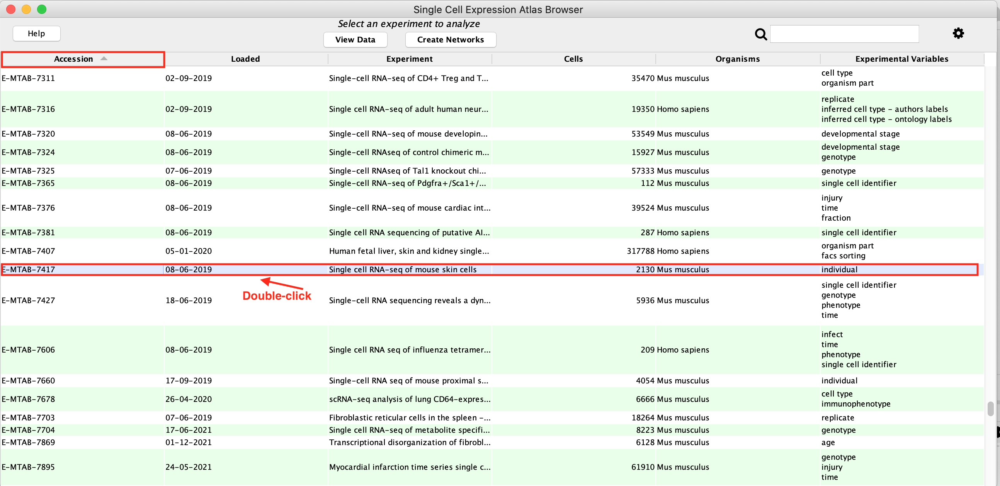
 </p>
 
 - An experiment table with 3 tabs is opened: select the first tab called **TPM**.
    <p align="center">
 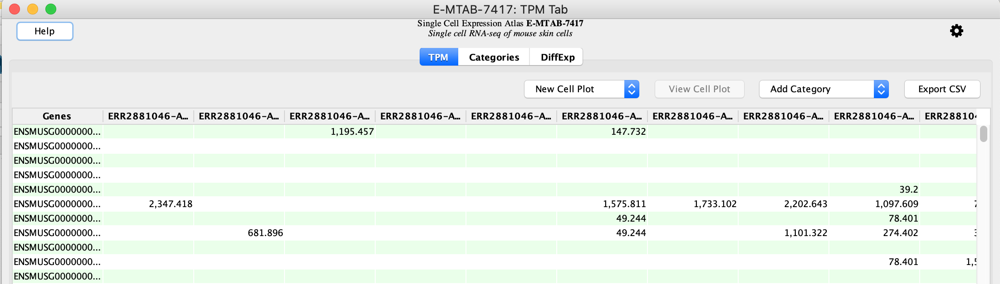
 </p>

This tab contains the genes as rows and the cells as columns. The values contain the normalized counts. 
Note: The table has blank spaces. Single cell RNA matrix are sparse: not all genes were detected in all the cells.

 - Select the second tab called **Categories**.
 - Make sure that **Cluster* is selected in the **Available categories** field. 
 
 ```{block, type="rmd-note"} 
The clustering has been computed by the Single Cell Experiment Atlas. The Louvain algorithm has been run with several resolution values. Higher resolutions produce larger number of clusters and lower resolution produce lower number of clusters.
A resolution of 1 is selected by default by the scNetViz app. It corresponds to the default Louvain method. It is indicated by "True" in the column sel.K. 
In this example, the clustering with parameter K=20 is chosen for further analysis. The other columns indicates the cluster membership of each cell.
```
    <p align="center">
 
 </p>

 - Calculate differential expression:
  -  To get the table of differentially expressed genes press the button labeled **Calculate Diff Exp**. 
This initiates a comparison of each cluster versus all other clusters. There are a total of 20 clusters and we will obtain results for each of them in a same table. 

    <p align="center">
 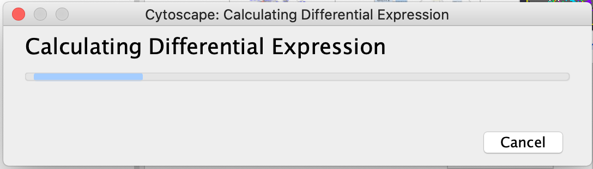
 </p>

  -  Differential gene expression is calculated using a Wilcoxon rank sum test.  The log2(fold change) represents the log ratio of the mean expression of a gene in the cells of the selected cluster versus the mean expression of that gene in all the other cells.

    <p align="center">
 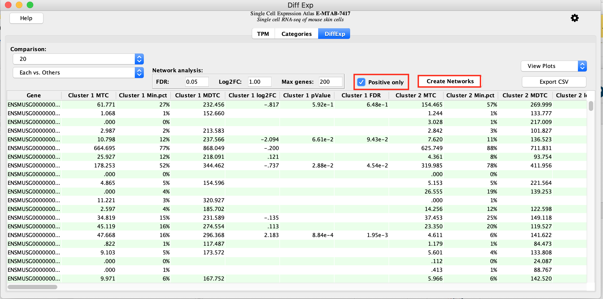
 </p>

 - Create a protein-protein network for each of the cluster marker genes: 
  -  Check **Positive Only** and click on **Create Networks**. 
  For each cluster, a maximum of 200 genes that have a FDR 0.05 and a logFC >0 are selected to create the network. 
  These parameters are adjustable. 
  
    <p align="center">
 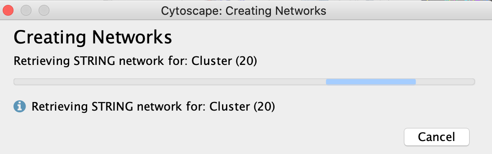
 </p>

As there are 20 networks to create, this step takes a few seconds.

Once created, the list of networks is visible in the **Network** tab on the left. On the above picture, cluster 20 containing 79 genes is selected and displayed in the main window. 
On the right side, we can see the parameters of the STRING app (stringApp), which was used to create the protein interaction networks. 2 nodes (genes) are connected with each other if the proteins are known to physically interact with each other. 
 
     <p align="center">
 
 </p>
 
 Cluster 5 is the network with the highest number of connections: it contains 192 nodes (genes) and 1045 edges (protein-protein interactions).The next step is to perform pathway analysis on this list of genes. 
 

   - Locate the STRING app tab on the right, unpin it and make it larger. 
   - Click on **Functional Enrichment**.
   
 <p align="center"> 
 
 </p>
 
  - A **Retrieve functional enrichment** window pops up. Click on **OK**.
 <p align="center"> 
 
 </p>
 
  - The STRING enrichment table appears in the Table Enrichment Panel below the network.The pathways are ranked by the FDR values of the enrichment. 
 
  <p align="center"> 
  
 </p>
 
STRING app has used more than 15 source of pathways and other gene-sets. We can use a filter to get only the results from the GO Biological Process for clarity.

   - Click on the funnel icon on the top left of the STRING enrichment table.
   
   - Select categories **GO Biological Process** and click on **OK**

  <p align="center"> 
   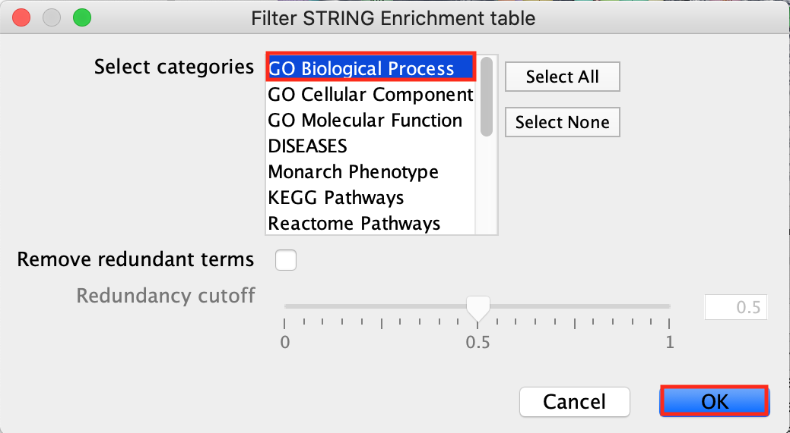
  </p>
  
The table contains now only the results for the  **GO Biological Process** pathways.
 
  <p align="center"> 
  
 </p>
  
Click on the top GO term. It will highlight in yellow the genes contained in this pathway.


 * Here are the functional enrichment results for each cluster.
    i. Extracellular matrix
    i.  Keratinization
    i. Tissue Development/ cell migration
    i. Skin development/Epithelial cell differentiation
    i. Regulation of metabolic process
    i. Angiogenesis/ Blood Vessel Development
    i. Tissue development/ Skeletal muscle cell differentiation
    i. Anatomical structure development. Nervous System Development.
    i. Muscle Structure Development
    i. Nervous System Development
    i. Tissue Development
    i. Small Metabolic Process
    i. Response to endogenous stimulus
    i. Skin Development
    i. Extracellular Matrix
    i. Tissue Development
    i. Lipid Biosynthesis
    i. Regulation of Cell motility
    i. Angiogenesis
    i. Regulation of Cell motility
    
This analysis highlights the heterogeneity of the skin tissue composed of differentiated keratinocytes but also epidermal stem cells, fibroblasts, endothelial cells, immune cells like T and B-cells and macrophages. 
Pathway enrichment analysis with marker genes can help identify cell types based on the scRNA clustering and further steps might focus on clusters of interests only.

 ```{block, type="rmd-tip"} 
 We took the top pathway to annotate the cluster. It is an arbitrary decision. STRING has an option to create an enrichmentmap from the STRING pathway enrichment results. Combined with the AutoAnnote app, it might be a more thorough approach to explore the functions associated with each cluster.
 ```
 <p align="center"> 
  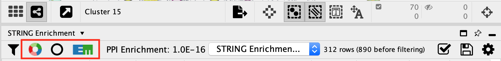
 </p>


## OPTIONAL: color the nodes of cluster 15 proportial to the logFC.

   - Locate the **Style** tab and select the **Fill Color**. Expand it using the down arrow. 
   - In the column field, select **Cluster 15 log2FC** attribute
   - Double-click on the color gradient
   
  <p align="center"> 
  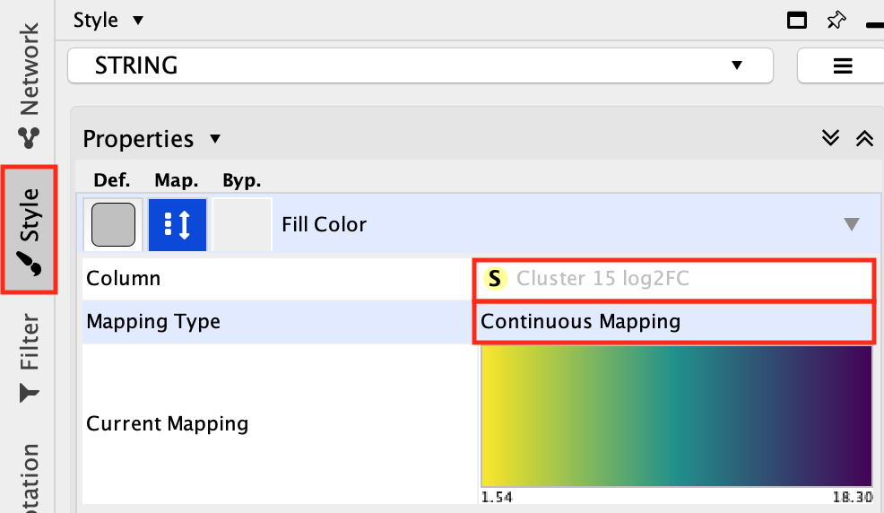
 </p>
   -  Choose a color palette of your choice.
   -  Option to choose colorblind-friendly color gradient is available.
   
   <p align="center"> 
  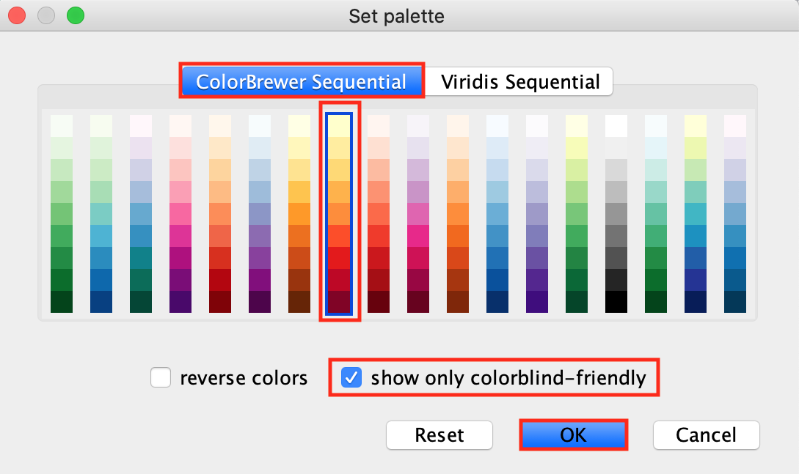
 </p>
 
   -  Click **Yes** on the message "This will reset your current settings. Are you sure you want to continue?"
 
   <p align="center"> 
  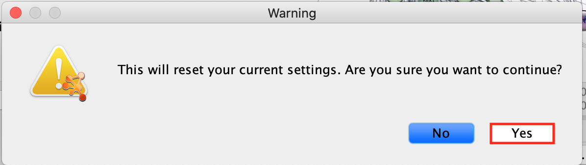
 </p>
 
   -  Another window called "Continuous Mapping Editor for Node Fill Color" appears. Click on **OK**.
   
   <p align="center"> 
  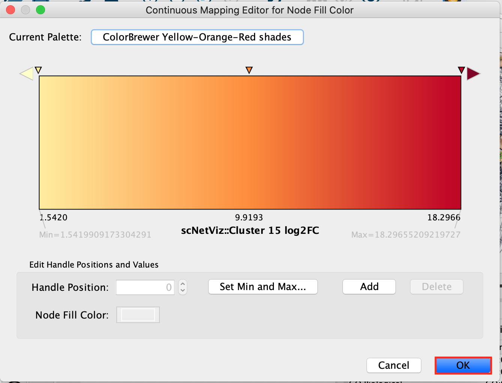
 </p>

   -  The nodes of the network are now colored using the logFC (fold change) from the differential expression analysis. Red color indicates the top cluster 15 marker genes.
   
   <p align="center"> 
  
 </p>

 
## Automation (for advanced users)
scNetViz provides its own automation commands and useful for scripts to control scNetViz operations. Details
available in the Swagger documentation (Help ! Automation ! CyREST Command API)) and in the scVIzNet reference paper.

## scNetViz References 
 - video ISCB 2019: https://www.youtube.com/watch?v=GGpsWKD9iQE&t=36s
 - reference paper: https://pubmed.ncbi.nlm.nih.gov/34912541/
 - tutorial: http://www.rbvi.ucsf.edu/cytoscape/scNetViz/index.shtml
 
 
 