--- 
title: "Pathway and Network Analysis of -Omics Data ( June 2024 )" 
author: "Gary Bader, Ruth Isserlin, Chaitra Sarathy, Veronique Voisin"
date: "last modified `r Sys.Date()`"
site: bookdown::bookdown_site
output: bookdown::gitbook
documentclass: book
bibliography: [book.bib, packages.bib]
biblio-style: apalike
link-citations: yes
github-repo: rstudio/bookdown-demo
favicon: images/favicon.ico
description: "Course covers the bioinformatics concepts and tools available for interpreting a gene list using pathway and network information. "
---
# Canadian Bioinformatics Workshops

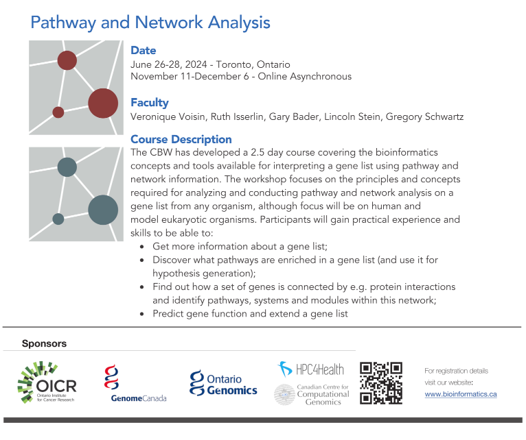

```{r include=FALSE}
# automatically create a bib database for R packages
knitr::write_bib(c(
  .packages(), 'bookdown', 'knitr', 'rmarkdown'
), 'packages.bib')
```

**This work is licensed under a [Creative Commons Attribution-ShareAlike 3.0 Unported License](http://creativecommons.org/licenses/by-sa/3.0/deed.en_US). This means that you are able to copy, share and modify the work, as long as the result is distributed under the same license.**

Icons are from the [“Very Basic. Android L Lollipop” set by Ivan Boyko](https://www.iconfinder.com/iconsets/very-basic-android-l-lollipop) licensed under [CC BY 3.0](https://creativecommons.org/licenses/by/3.0/) and [Icons8](icons8.com). 

<!--chapter:end:index.Rmd-->

# Welcome <a id="welcome"></a>

Welcome to Pathways and Network Analysis of -Omics Data 2024

## Meet your Faculty

### Gary Bader
Principal Investigator, <br>University of Toronto 


Dr. Bader develops biological network analysis and pathway information resources. He created the Biomolecular Interation Network Database ( [BIND](http://bind.ca) ) while working on his PhD and currently helps lead development of the free Cytoscape network visualization and analysis software [Cytoscape](http://cytoscape.org/). 

### Lincoln Stein
Head, Adaptive Oncology,<br> OICR


Dr. Stein played an integral role in many large-scale data initiatives including the development of the first physical clone map of the human genome, and running the data coordinating centre and the data portal for the SNP Consortium and the HapMap Consortium. Dr. Stein has also led the creation and development of Wormbase, a community model organism database for C. elegans, and Reactome, which is now the largest open community database of biological reactions and pathways. At OICR, Dr. Stein has led several international cancer data sharing and research initiatives, including the creation and development of the data coordination centre for the International Cancer Genome Consortium and other related projects. He continues to collaborate with national and international partners to create and promote data sharing standards, protocols and implementations.

### Gregory Schwartz
Scientist,<br>Princess Margaret Cancer Centre, <br>University Health Network


Dr. Schwartz is a Scientist at the Princess Margaret Cancer Centre and Assistant Professor in the Department of Medical Biophysics at the University of Toronto. He has developed several methodologies for mutation detection, data integration, and cellular population visualization to understand cancer heterogeneity and diverse responses to anti-cancer therapies. His current research involves integrating multi-omic information and leveraging single-cell resolution to identify underlying mechanisms of drug resistance in cancer.

### Veronique Voisin
Research Associate,<br> Donnelly Centre for Cellular and Biomolecular Research, <br>University of Toronto 


Veronique is currently a bioinformatician applying pathway and networks analysis to high throughput genomics data for OICR cancer stem cell program. Previously, she worked on characterizing the gene signatures of different types of leukemias using a murine model

&nbsp;
&nbsp;

### Ruth Isserlin
Research data analyst,<br>Donnelly Centre for Cellular and Bimolecular Research, <br>University of Toronto


Bioinformatician and data analyst in the Bader lab applying pathway and data analysis to varied data types. Developed Enrichment Map App for Cytoscape, an app to visually translate functional enrichment results from popular enrichment tools like GSEA to networks. Further developed the Enrichment Map Pipeline including development of additional Apps to help summarize and analyze resulting Enrichment Maps, including PostAnalysis, WordCloud, and AutoAnnotate App. 

### Chaitra Sarathy, PhD
Bioinformatics Specialist, <br>Krembil Research Institute, <br>University Health Network


Dr. Sarathy is a computational biologist with industry experience in software development. Her previous research focussed on developing multi-scale mathematical models of human systems to characterise biochemical changes in obesity. In addition, she has developed methods based on machine learning and multi-omics integration to identify drug targets in cancer and stratify patients for clinical trials. She currently focusses on characterising genetic malfunctions in neurological diseases.


### Nia Hughes
Program Manager, Bioinformatics.ca<br>
Toronto, ON, CA<br>
nia.hughes@oicr.on.ca


Nia is the Program Manager for Bioinformatics.ca, where she coordinates the Canadian Bioinformatics Workshop Series.  Prior to starting at the OICR, she completed her M.Sc in Bioinformatics from the University of Guelph in 2020 before working there as a bioinformatician studying epigenetic and transcriptomic patterns across maize varieties. 


***

Thank you for attending the Pathway and Network Analysis of Omics Data workshop! Help us make this workshop better by filling out [our survey](https://forms.gle/D8w8qyJ1r71rFnZe9).

*** 

## Class Materials 

You can download the printed course manual [here](https://drive.google.com/a/bioinformatics.ca/file/d/1HcPuiYUJe69w3_0aNpAfhk7DipcacA6r/view?usp=sharing).  

## Workshop Schedule {#schedule}


## Pre-Workshop Materials and Laptop Setup Instructions {#pre-workshop}

### Laptop Setup Instructions

A Check list to setup your laptop can be found [here](https://docs.google.com/forms/d/e/1FAIpQLSdknqfaPi-XJDeFwji5xga7rg-jdGiYsZWxW6zTCjjqbHcHsw/viewform?usp=sharing)

Install these tools on your laptop before coming to the workshop:

### Basic programs

  1. A robust text editor:
      * For Windows/PC - [notepad++](http://notepad-plus-plus.org/)  
      * For Linux - [gEdit](http://projects.gnome.org/gedit/)  
      * For Mac – [TextWrangler](http://www.barebones.com/products/textwrangler/download.html)
  
  1. A file decompression tool.
      * For Windows/PC – [7zip](http://www.7-zip.org/).  
      * For Linux – [gzip](http://www.gzip.org).   
      * For Mac – already there.
  
  1. A robust internet browser such as:
      * Firefox 
      * Safari
      * Chrome
      * Microsoft Edge
  
  1. A PDF Viewer
      * Adobe Acrobat or equivalent

### Cytoscape Installation
Please install the latest version of [Cytoscape 3.10.2](https://github.com/cytoscape/cytoscape/releases/3.10.2/) or [Cytoscape Download](https://cytoscape.org/download.html) as well as a group of Cytoscape Apps that we will be using for different parts of the course.  

  1. Install Cytoscape 3.10.2:
      * Go to: https://github.com/cytoscape/cytoscape/releases/3.10.2/ OR https://cytoscape.org/download.html
      * Choose the version corresponding to your operating system (OS, Windows or UNIX)
      * Follow instructions to install cytoscape
      * Verify that Cytoscape has been installed correctly by launching the newly installed application
      
  1. Install the following Cytoscape Apps - Apps are installed from within Cytoscape. 
      * In order to install Apps launch Cytoscape  
      * From the menu bar, select ‘Apps’, then ‘App Store’, then 'Show App Store'. 
      * App Store will appear in left hand Panel 
      * Within search bar at the top of the panel, search for the app listed below.  Once you click on search icon a web browser will be launched with the apps that match your search.
      * Select the correct app (there might be a few that match your search term).
      * Click on "Install" 
      * install the following:  
          * EnrichmentMap 3.4.0
          * EnrichmentMap Pipeline Collection 1.1.0 (it will install ClusterMaker2 v2.3.4, WordCloud v3.1.4 and AutoAnnotate v1.5.0)
          * GeneMANIA 3.5.3
          * IRegulon  1.3
          * ReactomeFIPlugin 8.0.6 - http://apps.cytoscape.org/apps/reactomefiplugin 
          * stringApp 2.0.3
          * scNetViz 1.7.1
          * yFiles Layout Algorithms	1.1.4
    
  1. Install the data set within GeneMANIA app. **This requires time and a good network connection to download completely (~15mins)**
      * From the menu bar, select ‘Apps’, hover over ‘GeneMANIA’, then select ‘Choose Another Data Set’.
      * From the list of available data sets, select the most recent and under ‘Include only these networks:’ select ‘all’. Click on ‘Download’.
      * An ‘Install Data’ window will pop-up. Select H.Sapiens Human (2589 MB). Click on ‘Install’.
  
### GSEA Installation  
Please install the latest version of GSEA (4.3.3)  

  1. Download GSEA
      * Go to the [GSEA page](http://www.broadinstitute.org/gsea/index.jsp)    
      * Register (using an institutional email address) 
      * Login 
      * Locate the Download page and download the version corresponding to your system
          * MAC users:  download GSEA_4.3.3.app.zip
          * Window users: download GSEA_Win_4.3.3-installer.exe
          * Unix users: download GSEA_Linux_4.3.3.zip
          * 
      * Launch GSEA to test it.
  
  1. Download GSEA for command line :  this is necessary for all platform users to run GSEA from a script (integrated workflow on day 3)
      * Download  GSEA_4.3.3.zip (and keep it for later use during the workshop)
      * 

### Docker Installation
Docker is a virtualization software that allows you to run programs isolated from your current laptop set up.  It eases the burden of installing multiple software requirements and packages.

  1. Please install the latest version of Docker Desktop.
      * [Windows](https://docs.docker.com/desktop/install/windows-install/)
      * [OSX](https://docs.docker.com/desktop/install/mac-install/) - make sure to select the version specific for your computer.  Newer macs (later than 2021) will contain the Apple silicon (M1/M2/M3).  Older computers might be intel based.
      * [Linux](https://docs.docker.com/desktop/install/linux-install/)
    
  1. Pull the required images used in the course
      * Open docker desktop (If docker is already running you can find the docker icon in your task bar.  Right click on the icon and select "Go to Dashboard")
      * 
      * Find the search bar in the docker desktop dashboard
      *     
      * Enter "risserlin/workshop_base_image" into the search bar at the top of the docker desktop dashboard.
      * 
      * Click on "Pull" to download the image.   
      * 
      * Enter "risserlin/nest_docker_lymphnode" into the search bar at the top of the docker desktop dashboard.
      *  
      * Click on "Pull" to download the image.   
      * 
      
  1. You should now see both of your images listed in the docker desktop image section (in the local tab)
      * 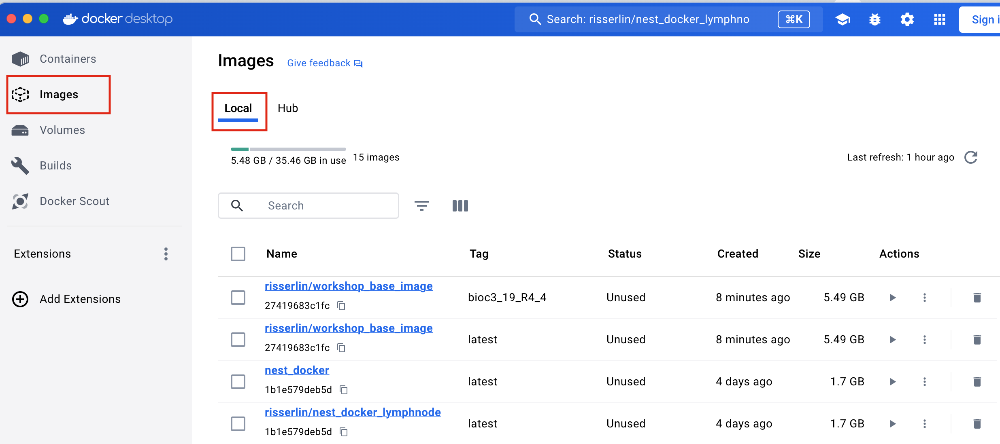

## Pre-workshop Tutorials

It is in your best interest to complete these before the workshop.

### Cytoscape Preparation tutorials

Go to : https://github.com/cytoscape/cytoscape-tutorials/wiki and follow :

  * [Tour of Cytoscape](https://cytoscape.org/cytoscape-tutorials/protocols/tour-of-cytoscape/#/)
  * [Basic Data Visualization](https://cytoscape.org/cytoscape-tutorials/protocols/basic-data-visualization/#/)

### R Tutorial

Use your newly installed docker workshop_base_image to try out R and go through the following tutorial - 

  * [R tutorial](https://genviz.org/module-02-r/0002/02/01/introductionToR/) - There will be instructions on how to install R and RStudio in the tutorial.  Instead of installing use the workshop_base_image docker image that you installed above as follows:
      * Open docker desktop (If docker is already running you can find the docker icon in your task bar.  Right click on the icon and select "Go to Dashboard")
      * 
      * Click on Images --> Local --> And find the workshop_base_image.  click on the Play button
      * 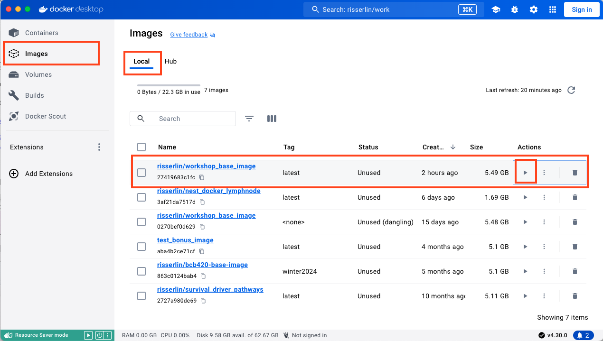
      * Expand the 'optional settings'
      * 
      * Change - 
        * 'container name' to R_tutorial, 
        * 'Host Port' to 8787, 
        * Add environment variable PASSWORD and set value to password
        * 
        
      * Click on 'Run'.  Docker will display a tab with all the information about the container you just launched
      * 
      * Open a web browser and navigate to localhost:8787
      * 
      * Username - rstudio, password - password (or whatever you entered as the PASSWORD settting when you launch the container)
      * You should now have an r studio session running in your web browser
      * 
      * When you are finished doing the tutorial remember to turn off your docker container and dacker as they both use up a lot of your computer's resources.
      *       
  
### Pre-workshop Readings and Lectures

  1. Video Module 1 - [Introduction to Pathway and Network Analysis by Gary Bader](#intro)
  1. Video Module 5 - [Gene Function Prediction (GeneMania) by Quaid Morris](#intro-regulatory-networks)
  1. ***Pathway enrichment analysis and visualization of omics data using g:Profiler, GSEA, Cytoscape and EnrichmentMap*** Reimand J, Isserlin R, Voisin V, Kucera M, Tannus-Lopes C, Rostamianfar A, Wadi L, Meyer M, Wong J, Xu C, Merico D, Bader GD [Nat Protoc. 2019 Feb;14(2):482-517](https://www.nature.com/articles/s41596-018-0103-9) - [Available here as well](http://baderlab.org/Publications#EM_2019)
 
***

### Additional tutorials <a id="additionaltutorials"></a>

  * ***iRegulon: from a gene list to a gene regulatory network using large motif and track collections***Janky R, Verfaillie A, Imrichová H, Van de Sande B, Standaert L, Christiaens V, Hulselmans G, Herten K, Naval Sanchez M, Potier D, Svetlichnyy D, Kalender Atak Z, Fiers M, Marine JC, Aerts S [PLoS Comput Biol. 2014 Jul 24;10(7)](https://journals.plos.org/ploscompbiol/article?id=10.1371/journal.pcbi.1003731) 

  * ***The GeneMANIA prediction server: biological network integration for gene prioritization and predicting gene function*** Warde-Farley D, Donaldson SL, Comes O, Zuberi K, Badrawi R, Chao P, Franz M, Grouios C, Kazi F, Lopes CT, Maitland A, Mostafavi S, Montojo J, Shao Q, Wright G, Bader GD, Morris Q [Nucleic Acids Res 2010 Jul 1;38 Suppl:W214-20](https://academic.oup.com/nar/article/38/suppl_2/W214/1126704) - [Available here as well](http://baderlab.org/Publications#GeneMANIA_original)
  
  * ***GeneMANIA update 2018*** Franz M, Rodriguez H, Lopes C, Zuberi K, Montojo J, Bader GD, Morris Q [Nucleic Acids Res. 2018 Jun 15](https://academic.oup.com/nar/article/46/W1/W60/5038280) - [Available here as well](http://baderlab.org/Publications#GeneMANIA_2018)
  
  * ***How to visually interpret biological data using networks*** Merico D, Gfeller D, Bader GD [Nature Biotechnology 2009 Oct 27, 921-924](https://www.nature.com/articles/nbt.1567)  - [Available here as well](http://baderlab.org/Publications#interpret_networks)
  
  * ***g:Profiler--a web-based toolset for functional profiling of gene lists from large-scale experiments.*** Reimand J, Kull M, Peterson H, Hansen J, Vilo J   [Nucleic Acids Res. 2007 Jul;35](https://www.ncbi.nlm.nih.gov/pmc/articles/PMC1933153/)
  
  * ***g:Profiler: a web server for functional enrichment analysis and conversions of gene lists (2019 update)*** Raudvere U, Kolberg L, Kuzmin I, Arak T, Adler P, Peterson H, Vilo J [Nucleic Acids Res. 2019 May 8](https://academic.oup.com/nar/advance-article/doi/10.1093/nar/gkz369/5486750)
  
  * ***Gene set enrichment analysis: a knowledge-based approach for interpreting genome-wide expression profiles*** Subramanian A, Tamayo P, Mootha VK, Mukherjee S, Ebert BL, Gillette MA, Paulovich A, Pomeroy SL, Golub TR, Lander ES, Mesirov JP [Proc Natl Acad Sci U S A. 2005 Oct 25;102(43)](https://www.ncbi.nlm.nih.gov/pmc/articles/PMC1239896/)
  
  * ***Expression data analysis with Reactome*** Jupe S, Fabregat A, Hermjakob H [Curr  Protoc Bioinformatics. 2015 Mar 9;49:8.20.1-9](https://www.ncbi.nlm.nih.gov/pmc/articles/PMC4407007/)
 
Interacting with Cytoscape using CyRest and command lines (for advanced users):
https://github.com/cytoscape/cytoscape-automation/blob/master/for-scripters/R/advanced-cancer-networks-and-data-rcy3.Rmd


<!--chapter:end:0.0.Welcome_info.Rmd-->

# Module 1 -  Introduction to Pathway and Network Analysis (Gary Bader) {#intro}

[Lecture](./lectures/Pathways_2024_Module1-GeneListIntro-Bader.pdf)  

[Recorded Lecture 1](https://www.youtube.com/watch?v=PtWf-XSzUYc)


<!--chapter:end:1.0-Module1_Pathway_and_network_analysis.Rmd-->

# Module 2: Finding Over-represented Pathways (Veronique Voisin)

 *<font color="#827e9c">Veronique Voisin and Ruth Isserlin</font>*
  
  [Lecture](./lectures/Pathways_2024_Module2_ORA_VV.pdf) 
  
  [Introduction to practical lab](./lectures/Pathways_2024_Module2_lab_introduction_RI.pdf)  

  [Lab practical part 1 (g:Profiler)](#gprofiler-lab)    

  [Lab practical part 2 (GSEA)](#gsea-lab)    


<!--chapter:end:2.0-Module2_Finding_Overrep_Pathways.Rmd-->

# Module 2 lab - g:Profiler {#gprofiler-lab}

**This work is licensed under a [Creative Commons Attribution-ShareAlike 3.0 Unported License](http://creativecommons.org/licenses/by-sa/3.0/deed.en_US). This means that you are able to copy, share and modify the work, as long as the result is distributed under the same license.**
 
## Introduction

Performing Over-Representation Analysis (ORA) with [g:Profiler](https://biit.cs.ut.ee/gprofiler/gost).

The practical lab contains 2 exercises. The first exercise uses [g:Profiler](https://biit.cs.ut.ee/gprofiler/gost) to perform gene-set enrichment analysis. 

## Goal of the exercise 1

Learn how to run *g:GOSt Functional profiling* from the g:Profiler website and explore the results.

## Data

g:Profiler requires a list of genes, one per line, in a text file or spreadsheet,
ready to copy and paste into a web page: for this, we use genes with frequent somatic SNVs identified in TCGA exome sequencing data of 3,200 tumors of 12 types. The MuSiC cancer driver mutation detection software was used to find 127 cancer driver genes that displayed higher than expected mutation frequencies in cancer samples (Supplementary Table 1, which is derived from column B of Supplementary Table 4 in [Kandoth C. et al.](https://www.nature.com/articles/nature12634). Genes are ranked in decreasing order of significance (FDR Q value) and mutation frequency (not shown).

## Exercise 1 - run g:Profiler {#exercise-1}

For this exercise, our goal is to run an analysis with g:Profiler.  We will copy and paste the list of genes into the g:Profiler web interface, adjust some parameters (e.g selecting the pathway databases), run the query and explore the results.

g:Profiler performs a gene-set enrichment analysis using a hypergeometric test (Fisher’s exact test) with the option to consider the ranking of the genes in the calculation of the enrichment significance (minimum hypergeometric test). The [Gene Ontology](http://geneontology.org/) Biological Process, [Reactome](https://reactome.org/) and [WikiPathways](https://www.wikipathways.org/) sources are going to be used as pathway databases. The results are displayed as a table or downloadable as an Generic Enrichment Map (GEM) output file. 

Before starting this exercise, download the required files:

```{block, type="rmd-datadownload"}
Right click on link below and select "Save Link As...".

Place it in the corresponding module directory of your CBW work directory.
```


* [Pancancer_genelist.txt](./Module2/gprofiler/data/Pancancer_genelist.txt)

We recommend saving all these files in a personal project data folder before starting. We also recommend creating an additional result data folder to save the files generated while performing the protocol.

### Step 1 - Launch g:Profiler.

Open the g:Profiler website at [g:Profiler](https://biit.cs.ut.ee/gprofiler/gost) in your web browser.


### Step 2 - input query

Paste the gene list ([Pancancer_genelist.txt](./Module2/gprofiler/data/Pancancer_genelist.txt)) into the Query field in top-left corner of the screen. 


```{block, type="rmd-tip"}
Open the file in a simple text editor such as Notepad or Textedit to copy the list of genes. <br> Or right click on the file name above and select **Open link in new tab**
```


```{block, type="rmd-note"}
The gene list can be space-separated or one per line.<br> The organism for the analysis, Homo sapiens, is selected by default.<br> The input list can contain a mix of gene and protein IDs, symbols and accession numbers.<br> Duplicated and unrecognized IDs will be removed automatically, and ambiguous symbols can be refined in an interactive dialogue after submitting the query.<br> **Highlight driver terms in GO** is a recently (April 2023) added feature that tries to reduce the number of GO terms returned by g:Profiler and highlight a non-redundant set of GO terms. For more detailed information on this feature see [here](https://biit.cs.ut.ee/gprofiler/page/docs#highlighting-description)  
```


### Step 3 - Adjust parameters. 

3a. Click on the *Advanced options* tab (black rectangle) to expand it.

* Set *Significance threshold* to "Benjamini-Hochberg FDR"

* *User threshold* - select 0.05 if you want g:Profiler to return only pathways that are significant (FDR < 0.05).

```{block, type="rmd-tip"}
If g:Profiler does not return any results increase the threshold (0.1, then 1) to check that g:Profiler is running successfully but there are simply no significant results for your query.
```

<p align="center">
  
 </p>

```{block, type="rmd-tip" }
By default, g:Profiler will only return the sets that pass the defined threshold. Often you need the ability to tweak the thresholds in the resulting EM beyond the strict FDR < 0.05 threshold and therefore require all the results. In order to get all the results, even those that don’t pass correction, select *All results*.  
```


3b. Click on the *Data sources* tab (black rectangle) to expand it.

* Unselect all gene-set databases by clicking the "clear all" button.
* In the *Gene Ontology* category, check  *GO Biological Process* and *No electronic GO annotations*.
* In the *biological pathways* category, check *Reactome* and check *WikiPathways*.

<p align="center">
  
</p>

```{block, type="rmd-note"}
*No electronic GO annotations* option will discard less reliable GO annotations (inferred from electronic annotations (IEAs)) that are not manually reviewed.
```

```{block, type="rmd-tip"}
if g:Profiler does not return any results uncheck the *No electronic GO annotation* option to expand annotations used in the test.
```


### Step 4 - Run query

Click on the *Run query* button, below the input parameters, to run g:Profiler. 


Scroll down page to see results. 


```{block, type="rmd-tip"}
After clicking on *Run query* button, the analysis completes but if there is the following message (above results) - *Select the Ensembl ID with the most GO annotations (all)*, then do the following. For each ambiguous gene, select its correct mapping. Ambiguous mapping is often caused by multiple Ensembl ids for a given gene and are easy to resolve as a user. Rerun query.
```


### Step 5 - Explore the results. 

Step 5a:

* After the query has run, the results are displayed at the bottom of the page, below the input parameters.
* By default, the "Overview" tab is selected. A global graph displays gene-sets that passed the significance threshold of 0.05 for each of the 3 data sources (shown on x-axis) that we have selected - GO Biological Process(GO:BP) and Reactome(REAC) and WikiPathways(WP). Numbers in parentheses indicate the number of gene-sets that passed the threshold.


Step5b:

* Click on "Detailed Results" to view the results in more depth. Three tables are displayed, one for each of the data sources selected. (If more than 3 data sources are selected there will be additional tables for each data source). Each row of the table contains:
    * **Term name** - gene-set name
    * **Term ID** - gene-set identifier
    * **Padj** - FDR value 
    * **-log10(Padj)** - enrichment score calculated using the formula -log10(padj)
    * Variable number of gene columns (One for each gene in the query set) - If the gene is present in the current gene-set its cell is colored.  For any data source besides GO, the cell is colored black if the gene is found in the gene-set.  For the GO data source cells are colored according to the annotation evidence code. Expand the *Legend* tab for detailed coloring mapping of GO evidence codes. 
    
The first table displays the gene-sets significantly enriched at FDR 0.05 for the GO&#58;BP database.


The second table displays the results corresponding to the Reactome database.


The third table displays the results corresponding to the WikiPathways database.


### Step 6: Expand the stats tab
 Expand the *stats* tab by clicking on the double arrow located at the right of the tab.
 
 <p align="center">
 
 </p>
 
 It displays the gene set size (T), the size of our gene list (Q) , the number of genes that overlap between our gene list and the tested gene-set (TnQ) as well as the number of genes in the background (U). 
 

 * Above the GO:BP result table, locate the slide bar that enables to select for the minimum and maximum number of genes in the tested gene-sets (Term size). 
 * Change the maximum *Term size* from 10000 to **250** and 
 * Change the minimum *Term size* from 1 to **3** and 
 * Observe the results in the detailed stats panel:
 
 

   * Without filtering term size, the top terms were GO terms containing more than 4000 or 5000 genes and often terms located high in the GO hierarchy (parent term). 
   * With filtering the maximum term size to 250, the top list contains pathways with larger interpretative values. However, please note that the adjusted p-values were calculated using all gene-sets without size filtering.

### Step 7: Save the results
 
7a.  In the *Detailed Results* panel, select "GEM" .  It will save the results in a text file in the "Generic Enrichment Map" format that we will use to visualize using Cytoscape.

   * keep the minimum term size set to 3 (for all the three files we create below)
   * set maximum term size to 10000 ( = no filtering by gene-set size) and click on the GEM button. A file is downloaded on your computer. (change the name to gProfiler_hsapiens_lab2_results_GEM_termmin3_max10000.gem.txt)
  <p align="center">  
  
  </p>  
   * set maximum term size to 1000 ( = filter by gene-set size) and click on the GEM button. A file is downloaded on your computer. (change the name to gProfiler_hsapiens_lab2_results_GEM_termmin3_max1000.gem.txt)
  <p align="center">
  
  </p>
   * select max term size to 250 ( = filter by gene-set size) and click on the GEM button. A file is downloaded on your computer. (change the name to gProfiler_hsapiens_lab2_results_GEM_termmin3_max250.gem.txt)
  <p align="center">
  
  </p>
  
7b:  Open the file that you saved using the gene-set threshold of 250 using Microsoft Office Excel or in an equivalent software.

Observe the results included in this file:

 1. Name of each gene-set
 1. Description of each gene-set
 1. Significance of the overlap (pvalue)
 1. Significance of the overlap (adjusted pvalue/qvalue)
 1. Phenotype
 1. Genes included in each gene-set

```{block, type="rmd-question"}
Which GO&#58;BP term has the best corrected p-value?  <br> Which genes in our list are included in this term? <br> Observe that some genes can be present on several lines (pathways are related when they contain a lof of genes in common).
```

```{block, type="rmd-note"}
The table is formatted for the input into Cytoscape EnrichmentMap. It is called the [*generic format*](https://enrichmentmap.readthedocs.io/en/latest/FileFormats.html#generic-results-files). The p-value and FDR columns contain identical values because g:Profiler directly outputs the FDR (= corrected p-value) meaning that the p-value column is already the FDR. Phenotype 1 means that each pathway will be represented by red nodes on the enrichment map (presented during next module). 
```

  


The GO&#58;BP term *regulation of cell cycle G1/S phase transition* is the most significant gene-set (=the lowest FDR value).  Many gene-sets from the top of this list are related to each other and have genes in common. 

---

### Step 8 (Optional but recommended)

8a. Download the pathway database files.

  * Go to the top of the page and expand the "Data sources" tab. Click on the 'combined name.gmt' link located at bottom of this tab. It will download a file named *combined name.gmt* containing a pathway database gmt file with all the available sources. 

<p align="center">
  
</p>

8b. concatenate the GO&#58;BP, Reactome and WikiPathways gmt files:

If you want to create a smaller gmt file that doesn't contain all of the g:profiler datasources you can instead download *name.gmt.zip* that contains each datasource as its own gmt file.  You will need to concatenate the sources you require into one gmt file to use for later.

#### Option 1: manually if you are not familiar with unix commands
   * open a text editor such a Notepad or equivalent
   * open hsapiens.GO&#58;BP.name.gmt using the text editor
   * open gmt hsapiens.REAC.name.gmt using the text editor
   * copy-paste all the rows from REAC file together with all the rows in GO&#58;BP file.
   * open gmt hsapiens.WP.name.gmt using the text editor
   * copy-paste all the rows from WP file together with all the rows in GO&#58;BP file.
   * save the file as hsapiens.pathways.name.gmt .

#### Option 2: using the cat command if you are familiar with unix commands
   * open your terminal window
   * cd to the unzipped gprofiler_hsapiens.name folder
   * type the following command: 
   ```
    cat hsapiens.GO:BP.name.gmt hsapiens.REAC.name.gmt hsapiens.WP.name.gmt > hsapiens.pathways.name.gmt
   ``` 

```{block, type="rmd-note"}
you will be using this optional hsapiens.pathways.name.gmt file in Cytoscape EnrichmentMap.
```     


### Step 9 (Optional by recommended)

 9. Get and record the version of g:Profiler used in your analysis.  It is important to note in your future publication using your enrichment results the methods and the version of software used for any analysis.  g:Profiler is updated on a regular basis so you can not simply come back to the webpage at time of publication and get the version.   Also, if you ever want to verify the results that you have and re-run the analysis it is important to use the same version as the initial analysis (or your results might differ).  g:Profiler maintains an [archive](https://biit.cs.ut.ee/gprofiler/page/archives) so it is easy to revisit previous versions.   
 
<p align="center">
  
</p>
 
 * The g:Profiler version can be found in two places - 
   * At the bottom of overview tab the version is listed
        <p align="center">
          
        </p>

   * Or Click on the *Query Info* tab to see all the parameters, including the g:Profiler version, used for the analysis
        <p align="center">
          
        </p>

```{block, type="rmd-note"}
Deciphering the version from the listed tag e111_eg58_p18_b51d8f08 :<br>
  * e111 - Ensembl version 111 <br>
  * eg56 - Ensembl genomes version 58<br>
  
```

```{block, type="rmd-tip"}
The version info can be recorded anywhere (for example in your lab notebook) but a convenient place is to embed it in the g:Profiler geneset file name used for the analysis.  <br>Instead of naming the file <br>
  * hsapiens.pathways.name.gmt<br>
Name it <br>
  * hsapiens.pathways_e111_eg58_p18_b51d8f08.name.gmt<br>
```
 
---


## Exercise 2: Load and use a custom .gmt file and run the query

For this exercise, our goal is to copy and paste the list of genes into g:Profiler, upload a custom gmt file, adjust some parameters (e.g selecting the pathway databases), run the query and explore the results. Uploading a custom gmt file enables us to use alternate pathway data sources not available in g:Profiler.

We are going to use a gmt file that contains a database of pathway gene sets used for pathway enrichment analysis in the standard GMT format downloaded from http://baderlab.org/GeneSets and updated monthly.

This file contains pathways from eight data sources: 

* GO, 
* Reactome,
* Panther, 
* NetPath, 
* NCI, 
* MSigDB curated gene sets (C2 collection, excluding Reactome and
KEGG), 
* MSigDB Hallmark (H collection) and 
* HumanCyc. 

A GMT file is a text file in which each line represents a gene set for a single pathway. Each line includes a pathway ID, a name and the list of associated genes in a tab-separated format. This file has been filtered to exlclude gene-sets that contained more than 250 genes as these gene-sets are associated with more general terms.

Before starting this exercise, download the required files:

```{block, type="rmd-datadownload"}
Right click on link below and select "Save Link As...".

Place it in the corresponding module directory of your CBW work directory.
```

* [Pancancer_genelist.txt](./Module2/gprofiler/data/Pancancer_genelist.txt)

*  [Baderlab_genesets.gmt (from June 2024)](./Module2/gprofiler/data/Human_GOBP_AllPathways_noPFOCR_no_GO_iea_June_01_2024_symbol_max250.gmt).


We recommend saving all these files in a personal project data folder before starting. We also recommend creating an additional result data folder to save the files generated while performing the protocol.

STEPS:

 * Repeat step 1 to 3a from [Exercise 1](#exercise-1) (go back to exercise 1 to get detailed instructions) Briefly:
   * Step 1:
     * Open g:profiler
   * Step 2a :
     * Copy and paste the gene list in the Query field
   * Step 2b: Click on the *Advanced options* tab (black rectangle) to expand it.
     * Set *Significance threshold* to "Benjamini-Hochberg FDR".
   * Step 3a: Click on the *Data sources* tab (black rectangle) to expand it.
     * **Unselect all choices by clicking the "clear all" button.**
   * Step 4:  Click on the *Custom GMT* tab (black rectangle) to expand it.
     * Drag in the box the Baderlab gmt file [Baderlab_genesets.gmt](./Module2/gprofiler/data/Human_GOBP_AllPathways_noPFOCR_no_GO_iea_June_01_2024_symbol_max250.gmt).
     * Once uploaded successfully, the name of the file is displayed in the "File name used" box. 
    
    
   
   * Step 5: Click on *Run  query* .   
   
   * Step 6: Explore the detailed results
   
     
   
   * Step 7: Save the file as GEM (rename file to gProfiler_hsapiens_Baderlab_max250.gem.txt)

---

## Optional steps 

Please follow these optional steps if time permits and/or to explore more g:Profiler parameters.

Here below are 3 optional steps that cover several options offered by g:Profiler:

  1. test different data sources, 
  1. take the order of the gene list into account,
  1. use different types of multiple hypothesis correction methods.

Use the same gene list as used in [exercise 1](#exercise-1) and modify paramters listed above. Observe the results. 

<p align="center">

</p>

### **Optional 1**:   
If time permits, play with input parameters, e.g. add *TRANSFAC * and *miRTarBase* databases, rerun the query and explore the new results.
 
 <p align="center">
 
 </p>
 
```{block, type="rmd-note"}
**Transfac**  putative transcription factor binding sites (TFBSs) from TRANSFAC database are retrieved into g:GOSt through a special prediction pipeline. First, TFBSs are found by matching TRANSFAC position specific matrices using the program Match on range +/-1kb from TSS as provided by APPRIS (Annotating principal splice isoforms) via Ensembl biomart. For genes with multiple primary TSS annotations we selected one with most TF matches. The matching range for C. elegans, D. melanogaster and S. cerevisiae is 1kb upstream from ATG (translation start site). A cut-off value to minimize the number of false positive matches (provided by TRANSFAC) is then applied to remove spurious motifs. Remaining matches are split into two inclusive groups based on the amount of matches, i.e TFBSs that have at least 1 match are classified as match class 0 and TFBSs that have at least 2 matches per gene are classified as match class 1.<br><br>
**mirTarBase** is a database that holds experimentally validated information about genes that are targetted by miRNAs. We include all the organisms that are covered by mirTarBase.
```

### **Option 2**:
Re-run the g:Profiler using the **ordered** query checked.<br> This will run the minimum hypergeometric test. g:Profiler then performs incremental enrichment analysis with increasingly larger numbers of genes starting from the top of the list. When this option is checked, **it assumes that the genes were preordered by significance with the most significant gene at the top of the list**.<br> Compare the results between "ordered" and non ordered query.

```{block, type="rmd-note"}
for this practical lab, the genes were ordered by the number of mutations found in these genes for all samples. <br>For example, TP53, a highly mutated genes is listed at the top. 
```

<p align="center">

</p>

### **Option 3** :

Re-run g:Profiler and select g:SCS or Bonferonni as method to correct for multiple hypothesis testing. Do you get any significant results? 

<p align="center">
  
</p>

```{block, type="rmd-note"}
you can get detailed information about these methods at https://biit.cs.ut.ee/gprofiler/page/docs in the section *Significance threshold*. 
```
___

## Bonus - Automation. 

Run analysis directly from R for easy integration into existing pipelines.

```{block, type="rmd-bonus"}
Instead of using the g:Profiler website g:profiler can be run directly from R or python see g:Profiler document for more info at https://biit.cs.ut.ee/gprofiler/page/r

Follow the step by step instructions on how to run from R here - https://risserlin.github.io/CBW_pathways_workshop_R_notebooks/run-gprofiler-from-r.html

First, make sure your environment is set up correctly by following there instructions - https://risserlin.github.io/CBW_pathways_workshop_R_notebooks/setup.html
```

<!--chapter:end:2.1-Module2lab_gprofiler.Rmd-->

# Module 2 lab - GSEA {#gsea-lab}

Presenter: Ruth Isserlin

## Introduction

This practical lab contains one exercise. It uses [GSEA](http://www.broadinstitute.org/gsea/index.jsp) to perform a gene-set enrichment analysis. 

## Goal of the exercise

Learn how to run GSEA and explore the results.

## Data

The data used in this exercise is gene expression (transcriptomics) obtained from high-throughput RNA sequencing of Pancreatic Ductal Adenocarcinoma samples (TCGA-PAAD). 

This cohort has been previously stratified into many different set of subtypes [PMID:36765128](https://pubmed.ncbi.nlm.nih.gov/36765128/) with the [Moffitt](https://pubmed.ncbi.nlm.nih.gov/26343385/) Basal vs Classical subtypes compared to demonstrate the GSEA workflow.

#### How was the data processed?

  * Gene expression from the TCGA Pancreatic Ductal Adenocarcinoma RNASeq cohort was downloaded on 2024-06-06 from [Genomic Data Commons ](https://portal.gdc.cancer.gov/) using the [TCGABiolinks](https://bioconductor.org/packages/release/bioc/html/TCGAbiolinks.html) R package.
  * Differential expression for all genes between the Basal and Classical groups was estimated using [edgeR](http://www.ncbi.nlm.nih.gov/pubmed/19910308).
  * The R code used to generate the data and the rank file used in GSEA is included at the bottom of the document in the [**Additional information**](#additional_information) section. 

## Background

The goal of this lab is to:

  * Upload the 2 required files into GSEA, 
  * Adjust relevant parameters, 
  * Run GSEA, 
  * Open and explore the gene-set enrichment results. 
  
The 2 required files are:

  1. a rank file (.rnk) 
  1. a pathway definition file (.gmt).

#### Rank File
To generate a rank file (.rnk),  a score (-log10(pvalue) * sign(logFC)) was calculated from the edgeR differential expression results. A gene that is significantly differentially expressed (i.e associated with a very small pvalue, close to 0) will be assigned a high score.<br>The sign of the logFC indicates if the gene has an expression which is higher in Basel (logFC > 0, the score will have a + sign) or lower in Classical (logFC < 0, the score will have a - sign). It is used to rank the genes from top up-regulated to top down-regulated (**all genes have to be included**). 


```{block, type="rmd-caution"}
The rank file is going to be provided for the lab, you don't need to generate it. 
```

### How to generate a rank file. 

#### Calculation of the score


#### Generation of the rank file
Select the gene names and score columns and save the file as tab delimited with the extension .rnk


#### Pathway defintion file
The second file that is needed for GSEA is the pathway database, a file with the .gmt extension. The pathway database (.gmt) used for the GSEA analysis was downloaded from <http://baderlab.org/GeneSets>. This file contains gene-sets obtained from  MsigDB-c2 and Hallmarks, NCI, Biocarta, IOB, Netpath, HumanCyc, Reactome, Panther, Pathbank, WikiPathways and the Gene Ontology (GO) databases. 

```{block, type="rmd-caution"}
You don't need to perform this step for the exercise, the .gmt file will be given to you. <br>
```


Go to:

  * http://download.baderlab.org/EM_Genesets/
  * Click on June_01_2024/
  * Click on Human/
  * Click on symbol/
  * Save the Human_GOBP_AllPathways_noPFOCR_no_GO_iea...gmt file on your computer


The .gmt is a tab delimited text file which contains one gene-set per row. For each gene-set (row), the first 2 columns contain the name and the description of the gene-set and the remaining columns contain the list of genes included in the gene-set. It is possible to create a custom gene-set using Excel or R. 


GSEA performs a gene-set enrichment analysis using a modified Kolmogorov-Smirnov statistic.  The output result consists of summary tables displaying enrichment statistics for each gene-set (pathway) that has been tested.


### Start the exercise

Before starting this exercise, download the 2 required files:

```{block, type="rmd-datadownload"}
Right click on link below and select "Save Link As...".

Place it in the corresponding module directory of your CBW work directory.
```

* [Human_GOBP_AllPathways_noPFOCR_no_GO_iea_June_01_2024_symbol.gmt](./Module2/gsea/data/Human_GOBP_AllPathways_noPFOCR_no_GO_iea_June_01_2024_symbol.gmt)
* [TCGA-PAAD_GDC_Subtype_Moffitt_BasalvsClassical_ranks.rnk](./Module2/gsea/data//TCGA-PAAD_GDC_Subtype_Moffitt_BasalvsClassical_ranks.rnk)


### Step1.

Launch GSEA by double clicking on the installed program icon.

```{block, type="rmd-troubleshooting"}
If GSEA won't launch on MacOS. (This is relevant for MacOS users on older operating systems.  As I am not longer on this operating system I can't regenerate these screenshots so they reflect an older version of GSEA but the steps are still relelvant if you are working on Catalina with the latest version of GSEA) 

Follow instructions specified on download page:
  * 

  * If you see this error message:
  * 

  * Open Settings -> Security & Privacy
  * Click on "Open Anyways"
  * 
```


### Step 2.

Load Data

2a. Locate the ‘*Load data*’ icon at the upper left corner of the window and click on it.


2b. In the central panel, select ‘*Method 1*’ and ‘*Browse for files*’. A new window pops up.


2c. Browse your computer to locate and select the 2 files : **Human_GOBP_AllPathways_noPFOCR_no_GO_iea_June_01_2024_symbol.gmt** and **TCGA-PAAD_GDC_Subtype_Moffitt_BasalvsClassical_ranks.rnkk**. 

2d. Click on **Open**. A message pops us when the files are loaded successfully. 


2e. Click on **OK**.


	
```{block, type="rmd-tip"}
Alternatively, you can choose **Method 3** to **drag and drop files here**. You need to click on the **Load these files!** button in this case.
```

### Step3.

Adjust parameters

3a. Under the **Tools** menu select **GseaPreRanked**.


3b. **Run GSEA on a Pre-Ranked gene list** tab will appear.

Specify the following parameters:

3c. Gene sets database -

  * Click on the radio button (…) located at the right of the blank field.
  * Wait 5-10 sec for the gene-set selection window to appear.
	


  * Use the right arrow in the top field to see the Gene matrix (*Local gmx/gmt*) tab.
  * Click to highlight **Human_GOBP_AllPathways_noPFOCR_no_GO_iea_June_01_2024_symbol.gmt**.
  * Click on **OK** at the bottom of the window.


	
  * **Human_GOBP_AllPathways_noPFOCR_no_GO_iea_June_01_2024_symbol.gmt** is now visible in the field corresponding to **Gene sets database**.


3d. Set **Number of permutations** to 100. The number of permutations is the number of times that the gene-sets will be randomized in order to create a null distribution to calculate the FDR.  


```{block, type="rmd-caution"}
Use 2000 when you do it for your own data outside the workshop.
```

3e. **Ranked list** - select by clicking on the arrow and highlighting rank file.

3f. **Collapse/Remap to gene symbols** - Change to *No_collapse*.  (Our rank file already contains the gene symbols so we don't need GSEA to try and convert probe names to gene symbols)


3g. Click on **Show** button next to **Basic Fields** to display extra options.

3h. **Analysis name** – change the default name **my_analysis** to a name that is specific to analysis. For example *Basal_vs_Classical_edgeR*. GSEA will use your specified name as part of the directory of results that it creates.

3i. **Max size**: exclude larger sets – By default GSEA sets the upper limit to 500. In this protocol, the maximum is set to 200 to decrease some of the larger sets in the results.

3j. **Min size**: exclude smaller sets – By default GSEA sets the lower limit to 15. In this protocol, the minimum is set to 10 to increase some of the smaller sets in the results.

3k. **Save results in this folder** – navigate to where you want GSEA to put the results folder. By default GSEA will put the results into the directory *gsea_home/output/[date]* in your home directory.

```{block, type="rmd-tip"}
Set **Enrichment Statistics** to p2 if you want to add more weight on the most top up-regulated and top down-regulated. <br> **P2** is a more stringent parameter and it will result in less gene-sets significant under FDR <0.05.
```

### Step 4. 

Run GSEA

4a. Click on **Run** button located at the bottom right corner of the window.

```{block, type="rmd-tip"}
Expand the window size if the run button is not visible
```

4b. On the panel located on the left side of the GSEA window, the bottom panel called **GSEA report** will show that a process was created, with a message that it is **Running**.


On completion the status message will be updated to **Success…**.


```{block, type="rmd-tip"}
There is no progress bar to indicate to the user how much time is left to complete the process. Depending on the size of your dataset and compute power of your machine, a GSEA run can take from a few minutes to a few hours. To check on the status of the GSEA run in the bottom left hand corner you can click on the **+** (red circle in above Figure) to see the updating status. Printouts in the format **shuffleGeneSet for GeneSet 5816/6878 nperm: 100** indicate how many permutations have been done (5816) out of the total that need to be performed (6878).
```

```{block, type="rmd-tip"}
If the permutations have been completed but the status is still running, it means that GSEA is creating the report
```

```{block, type="rmd-troubleshooting"}
Java Heap Space error. If GSEA returns an error **Java Heap space** it means that GSEA has run out of memory. If you are running GSEA from the webstart other than the 4GB option, then you will need to download a new version that allows for more memory allocation. The current maximum memory allocation that the GSEA webstart allows for is 4GB. If you are using this version and still receive the java heap error, you will need to download the GSEA java jar file and launch it from the command line as described in step 1.
```

### Step 5. 

Examining the results

5a. Click on **Success** to launch the results in html format in your default web browser.

```{block, type="rmd-tip"}
If the GSEA application has been closed, you can still see the results by opening the result folder and clicking on the **index** file – *index.html*. (see screenshot below). The first phenotype corresponds to gene-sets enriched in genes up-regulated in the Basal subtype. The second phenotype corresponds to gene-sets enriched in genes up-regulated in the Classical phenotype. 
```


When examining the results there are a few things to look for:

5b. Check the number of gene-sets that have been used for the analysis.   

```{block, type="rmd-tip"}
 A small number (a few hundred genesets if using baderlab genesets) could indicate an issue with identifier mapping.
```

5c. Check the number of sets that have FDR less than 0.25 – in order to determine what thresholds to start with when creating the enrichment map. It is not uncommon to see a thousand gene sets pass the threshold of FDR less than 0.25. FDR less than 0.25 is a very lax threshold and for robust data we can set thresholds of FDR less than 0.05 or lower.

5d. Click on **Snapshots** to see the trend for the top 20 genesets. For the positive phenotype the top genesets should show a distribution skewed to the left (positive) i.e. genesets have predominance of up-regulated genes. For the negative phenotype the top geneset should be inverted and skewed to the right (negative) i.e. geneset have predominance of down-regulated genes.


5e. Explore the tabular format of the results.

#### Basal


#### Classical


[Link to information about GSEA results](http://www.baderlab.org/CancerStemCellProject/VeroniqueVoisin/AdditionalResources/GSEA#GSEA_enrichment_scores_and_statistics)


## Additional information {#additional_information}

[More on GSEA data format](http://www.broadinstitute.org/cancer/software/gsea/wiki/index.php/Data_formats) 

[More on processing the RNAseq using EdgeR and generate the .rank file](https://baderlab.github.io/Cytoscape_workflows/EnrichmentMapPipeline/supplemental_protocol1_rnaseq.html)

[More on which .gmt file to download from the Baderlab gene-set file](http://download.baderlab.org/EM_Genesets/), select current release, Human, symbol, Human_GOBP_AllPathways_no_GO_iea_….gmt

[More on GSEA : link to the Baderlab wiki page on GSEA](http://www.baderlab.org/CancerStemCellProject/VeroniqueVoisin/AdditionalResources/GSEA)

## Bonus - Automation. 

Run analysis directly from R for easy integration into existing pipelines.

```{block, type="rmd-bonus"}
Instead of using the GSEA application you can run it directly from R using the GSEA java jar that can be easily used within the workshop docker image (workshop_base_image) that you setup duing your prework.

Follow the step by step instructions on how to run from R here - https://risserlin.github.io/CBW_pathways_workshop_R_notebooks/run-gsea-from-within-r.html

First, make sure your environment is set up correctly by following there instructions - https://risserlin.github.io/CBW_pathways_workshop_R_notebooks/setup.html
```

<!--chapter:end:2.2-Module2lab_gsea.Rmd-->

# Module 3: Network Visualization and Analysis with Cytoscape

 *<font color="#827e9c">Ruth Isserlin</font>*
 
 **Module 3 Cytoscape** 
 
 [Cytoscape - Lecture](./lectures/Pathways_2024_Module3-part1-Cytoscape-RI.pdf)
 
 **Module 3 Cytoscape Lab**

[Introduction to practical Cytoscape Lab (slides)](./lectures/Pathways_2024_Module3_cytoscape_lab_introduction_RI.pdf)

[Lab practical Cytoscape Primer](#cytoscape_mod3) 
 
---- 
 
 **Module 3 Enrichment Map** 
    
[Enrichment Map Lecture](./lectures/Pathways_2024_Module3-part2-EM-RI.pdf) 
 
 **Module 3 Enrichment Map Lab**

[Introduction to practical EM Lab (slides)](./lectures/Pathways_2024_Module3_EM_lab_introduction_RI.pdf)
 
[Lab practical part 1 (g:Profiler)](#gprofiler_mod3)   

[Lab practical part 2 (GSEA)](#gseq_mod3)  

<!--chapter:end:3.0-Module3_Visualizing_ORA_analysis.Rmd-->

# Module 3 Lab Primer: Cytoscape Primer {#cytoscape_mod3}

**This work is licensed under a [Creative Commons Attribution-ShareAlike 3.0 Unported License](http://creativecommons.org/licenses/by-sa/3.0/deed.en_US). This means that you are able to copy, share and modify the work, as long as the result is distributed under the same license.**

By Gary Bader, Ruth Isserlin, Chaitra Sarathy, Veronique Voisin

## Goal of the exercise

**Create a network and customize it.**

The goal of this exercise is to learn how to create a network in Cytoscape and customize id. In this example, the proteins are the entities represented as nodes in the network and known physical interactions are the connections between the proteins that are represented as edges. We will overlay 2 additional pieces of information about these proteins, mutation information per protein as node color and mutation expression as node size.

## Data

  * The data used in this exercise is a set of protein - protein interactions and associated attributes.  

## Start the exercise

To start the lab practical section, first create a cytoscape_primer_files directoty on your computer and download the files below.

```{block, type="rmd-datadownload"}
Right click on link below and select "Save Link As...".

Place it in the corresponding module directory of your CBW work directory.
```
<br>
<br>
Two files are needed for this exercise:

  * [networktable.txt](./Module3/cytoscape_primer/data/network_table.txt)
  * [nodeattribute.txt](./Module3/cytoscape_primer/data/node_attribute.txt)
  
## Exercise 1a - Create Network from table

  1. Launch Cytoscape
  1. Locate the top menu bar and select **File**,--> **Import**, --> **Network from File…**.
  
  
  
  <ol start=3 type="1">
<li>  Browse your computer and select the file [networktable.txt](./Module3/cytoscape_primer/data/network_table.txt)
</ol>
  <ol start=4 type="1">
<li> An **Import Network from Table** dialog box opens. The 3 columns of the table should be set as “source”, “interaction” and “target” respectively. </ol>
  
  
    

```{block, type="rmd-tip"}  
  
  Cytoscape will assume, by default,  will look for the column names that start with "source", "interaction" and "target".  It will assume that any other column is an interaction attribute (edge attribute)  
  
  * This is just an example file.  You can import files with any number of additional columns and choose to ignore all columns except for the ones that you want to import or import all of them.  Although Cytoscape tries to guess the data type of each column and the type (ie. is it an attribute associated with source node, target nodes or the interaction) you are able to fine tune everything.  
  
  
  
```
<br>
<br>
 <ol start=5 type="1">
<li>  Click “Ok”.
</ol>  

  
  
  * A network containing the proteins as blue square nodes and interaction as edges should be displayed in the main Cytoscape window.
  
## Exercise 1b - Load node attributes

  1. Locate the Cytoscape top menu bar and select **File**,--> **Import**,--> **Table from File…**. 
  

  1. Browse your computer and select the file [nodeattribute.txt](./Module3/cytoscape_primer/data/node_attribute.txt)
  
  1. click “Open”.

  1. An “Import Table from Columns” dialog appears. 
  

  
  1. Click on “OK”.
  
  1. You should be able to see the imported attributes in the node table. 
  

<br>
<br>
```{block, type="rmd-note"}
  i. The key column is assumed to be the first column in your table.  
  i. The key is the column in the loaded attribute file used to match your attributes to your network. 
  i. **key colum for Network** is the column in the Network that the key is matched to.  (In this network there isn't the ability to set this value because that is the only attribute associated with the nodes in our network but normally this drop box will be selectable)
  i. The key and matching column need to match perfectly (unless you have specifid that case does not matter). 
  
  

```
<br>
<br>


```{block, type="rmd-tip"}  
  Similiar to the **Import Network from Table**, everything about the import is customizable.  Cytoscape does its best to guess the datatypes of each column but you are able to fine tune it.  
  


  
  There are also advanced options if you want to:
  
  * change the file delimiter
  * skip lines
  * specify the header column
    

    
```

## Exercise 1c - Map node attributes to Visual Style


  1. Go to “Control Panel” on the left side and select the “Style” tab. Make sure that you are in the “Node” tab.<br>
  

  1. Select the “Fill Color” field 
  1. expand it by clicking on the right arrow. 
  
  
  1. Set “Column” to “expression” and “Mapping Type” to “Continuous Mapping”.
  
  
  1. This will change the colours of the nodes to the default colour coding.
  
  
  1. Double click on the continuos mapping colour box to manually adjust the colour and other settings.  
 
  1. At the bottom of the “Style” tab, check the box “Lock node width and height”.
  

  1. Select the “Size” field and 
  1. expand it by clicking on the right arrow. 
  1. Set “Column” to “mutation” and “Mapping Type” to “Continuous Mapping”.
  
  
  1. Your resulting network maps expression to the colour of the node and the size of the node to the number of mutations.
  <br>
<br>
```{block, type="rmd-bonus"}

  1. Adjust the setting on the colour mapping.  Change the colour scheme.  Change the maximum and minimum values.
  1. Adjust the setting on the size mapping.  Make the nodes bigger with higher values.
  1.  Eventhough the network is small, play around with the layouts.

```

## Exercise 2 - Work with larger networks

Cytoscape supplies a few demo networks that you can play around with.  When you open cytoscape you are presented with a Start Panel where you can choose to reload a previous session or load in one of the sample networks.  


  1.  You do not need to re-open cytoscape to open the starter panel.  Locate the Cytoscape top menu bar and select **View**,--> **Show Starter panel**. 
  

  1.  Double click on the **Affinity Purification Network** to open it.

  1.  If you already have a session open then you will recieve a warning that the current session will be lost.  Before proceeding make sure your current session is saved.  (Click on cancel.  Then, **File** --> **Save as**)<br>
  

  
  1. Once the network has loaded you will see a network of protein interactions derived from an affinity purification experiment.  Bait proteins are reprsented as pink hexagons and their corresponing prey proteins blue boxes. 
    

  1. Using this larger network play around with the different layouts
  <br>
<br>
```{block, type="rmd-bonus"}  
  1. Search for the node "VPR"
  1. select all of the prey proteins associated with "VPR"
```

## Exercise 3 - Perform basic enrichment analysis using EnrichmentTable

In Module 2 we performed detailed enrichment analysis with g:profiler and GSEA.  We supplied gene lists and ranked expression sets in order to perform the analysis.  What if you want to run a quick enrichment analysis with a given network or a given subset of the network?  The easiest way to do this is to use the cytoscape app EnrichmentTable.  EnrichmentTable will query g:profiler directly with the given network or subnetwork.  Not all of the parameters that are available in the web version can be tweaked from the enrichmentmap table app but it can be an easy way to quickly see enrichment results.

We will select the bait protein VPR and all its associated prey proteins to use for an enrichment analysis. 
<br>
<br>
```{block, type="rmd-note"}
**Bait Protein** - Is the labelled protein in an affinity purification experiment that is pulled down.<br>  
**Prey Protein** - are the proteins that are associated with the bait protein when it is pulled down and are assumed to interact with the bait protein.<br>
**First neighbor** - are all the nodes that are directly connected to the given node
```
<br>
<br>
  1. In the search bar enter "VPR".  Press enter.
  
  
  1. VPR is now the only highlighted node in the network.  In order to select all its associated preys we need to select all the nodes that are connected to VPR, all of VPR's first neighbours.  There are two ways to select the first neighbours:
  i. In the top menu bar click on **Select** --> **Nodes** --> **First neighbors of selected nodes** --> **undirected**
  i. Click on the **first neighbor** button, , in the quick links button set.

<ol start=3 type="1">
<li>Click on the "Enrichment Table" in the Table Panel.</li>
</ol>

<ol start=4 type="1">
<li>Click on the cog icon in the top right hand corner of the Enrichment Table panel
  
</li>
</ol>

<ol start=5 type="1">
<li>This will bring up a panel with the adjustable settings.  There are only 5 adjustable parameters- </li>
</ol>
  i. **Organism** - This shows a list of organisms that are available on the g:Profiler site.  
  i. **Gene ID column** - the column in the current network that you want to use to search g:Profiler with.  Ideally this should be a column specifying the Gene Name or other identifier.
  i. **Multiple testing correction** - change to fdr.
  i. **Adjusted p-value threshold (min 0 max 1)** - leave as 0.05.  If you are getting too many results you can make this value smaller.
  i. **Include inferred GO annotations (IEA)** - by default the search will exclude inferred from electonic annotation GO terms.  If you want to include them, select this option. <br>
    

  <br>
<br>
```{block, type="rmd-tip"}  
  By default, EnrichmentTable automatically uses all the databases available on the g:Profiler site.  There is no way to filter prior to running the analysis.  You need to filter the results after the analysis has been run.  This **will** change the results because you end up filtering the results after the multiple correction and the multiple correction is dependent on the number of genesets you are testing with.  
```
 <br>
<br>

<ol start=6 type="1">
<li>Filter the EnrichmentTable results to show only GO&#58;BP, Reactome and Wikipathway, similiar to what we used in Module 2. </li>
</ol>  
  i. Click on the filter icon in the top left hand corner of the enrichment table results. <br> 
  i. Next to **Select Categories** select *Gene Ontology Biological Process*, *Reactome*, *Wikipathways*.  To select multiple options click and hold *command* key on Mac or *Shift* on Windows. <br> 
  i. click on **OK**
  i. The EnrichmentTable will update to only include the sets from  *Gene Ontology Biological Process*, *Reactome*, *Wikipathways*.<br> 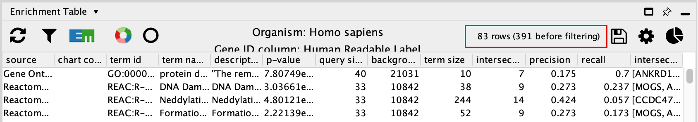

## Exercise 3B - create Enrichment Map and Enhanced graphics nodes from EnrichmentTable {#enrichmenttabl-features}

<ol start=1 type="1">
<li> To create an Enrichment Map from the EnrichmentTable results, Click on the EM logo in the top left hand bar in the ErichmentTable Panel.<br>  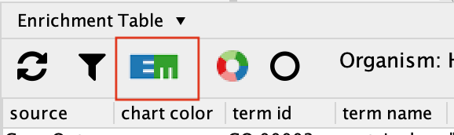 </li>
</ol>
  i. This will bring up an EM options panel with very limited parameter adjustments.  You can only change the name of the network and the connectivity threshold.  You have already specified the p-value threshold when you originally performed the analysis.  If you want to create your network with a more permissive q-value you need to go back to the EnrichmentTable search panel. Click on **OK**<br>  
  i. This will create an Enrichment Map in a new network and represents all the *Gene Ontology Biological Process*, *Reactome*, *Wikipathways* terms enriched for the VPR and its prey protein set. <br> 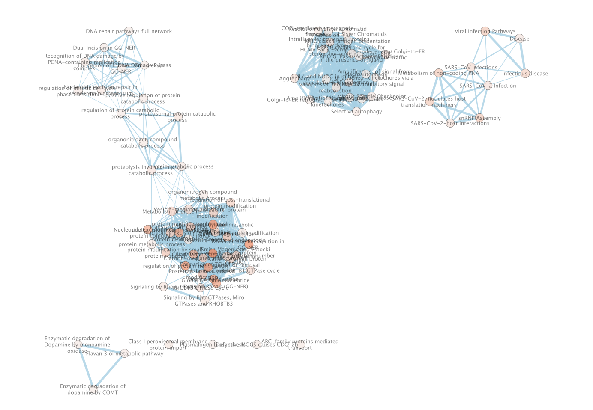
 

## Exercise 4 - Load network from NDex

[NDex](https://www.ndexbio.org/) is an open-source repository where scientists can store, share, manipulate and publish biological network data.  Networks are viewable on the web through their webapp but can also be downloaded directly into cytoscape so you can search, manipulate, integrate and analyze the given network for yourselves.

For the purpose of this exercise we are going to load in a network from the publication [A protein landscape of Breast Cancer](https://www.science.org/doi/10.1126/science.abf3066?url_ver=Z39.88-2003&rfr_id=ori:rid:crossref.org&rfr_dat=cr_pub%20%200pubmed).  This publication is associated with multiple networks the the authors of this paper created and shared in NDex - https://www.ndexbio.org/index.html#/networkset/4423340d-e8e3-11eb-b666-0ac135e8bacf

  1. Start a new session.  **File** --> **Close**
  1. In the Network Search bar (located at the top of the control panel) make sure that the search provider is set to NDex.  <br> 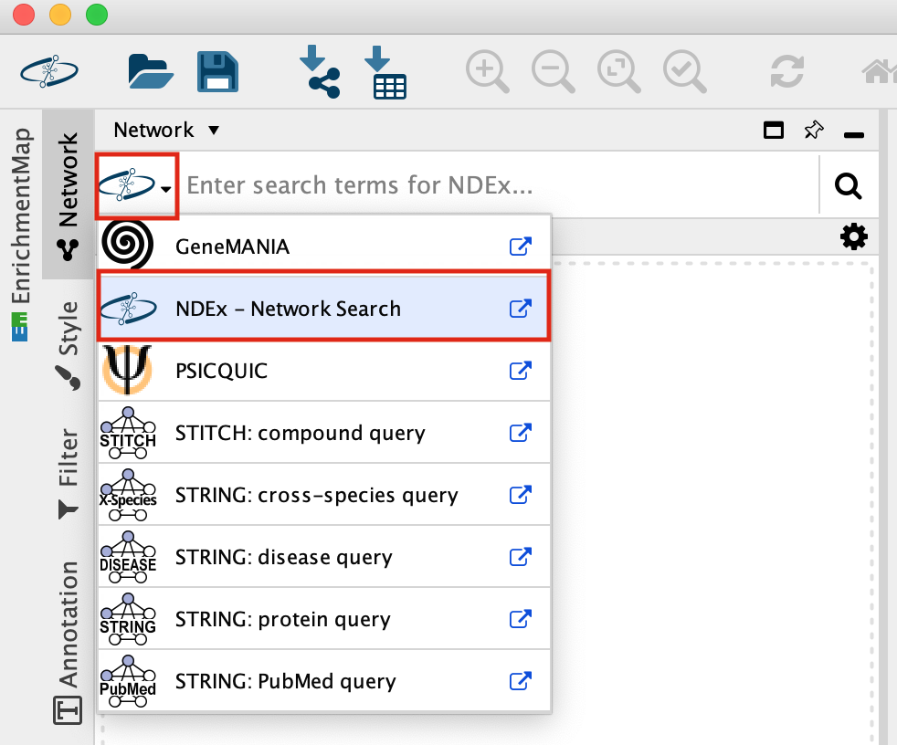
  
<br>
<br>
```{block, type="rmd-tip"}    
It should be set to NDex by default but click on down arrow to see the different data sources you can search for.  Later in the workshop we will be using this bar to query GeneMania.
```
<br>
<br>
<ol start=3 type="1">
<li> Enter *MCF7_All_PPI>=0.9* into the search box, Click on the search icon. <br> </li></ol>

<ol start=4 type="1">
<li> A search results box will appear. The *MCF7_All_PPI>=0.9* network is just one of the networks associated with this publication.  Eventhough you are searching for this specific network, other networks associated with the original paper will also show up in the search results as well as others.<br> </li>
</ol>

<ol start=5 type="1">
<li> Click on the green down arrow next to *MCF7_All_PPI>=0.9*, the network will start to import.</li></ol>

<ol start=6 type="1">
<li> Once the network has been loaded, click on **Close Dialog** </li></ol>

<ol start=7 type="1">
<li> Resulting network loaded into cytoccape.<br>  </li></ol>
<br>
<br>
```{block, type="rmd-note"} 
**Description taken from [NDex record](https://www.ndexbio.org/viewer/networks/84e36f91-ecb7-11eb-b666-0ac135e8bacf)**<br>

  * Baits are shown as yellow box, and 
  * preys as grey circle. 
  * Size of each node represents number of patients with alterations in each protein. 
  * Dotted line represents the physical protein-protein association (validated in other studies) with high Integrated Association Stringency score.
```

<br>
<br>
```{block, type="rmd-bonus"}  
  1. Change the edge width to reflect the number of patients the associations is found in instead of the PPI score.
  1. Change the default node colour to blue.
```

<!--chapter:end:3.05-Module3_Cytoscape_Primer.Rmd-->

# Module 3 Lab: g:profiler Visualization {#gprofiler_mod3}

**This work is licensed under a [Creative Commons Attribution-ShareAlike 3.0 Unported License](http://creativecommons.org/licenses/by-sa/3.0/deed.en_US). This means that you are able to copy, share and modify the work, as long as the result is distributed under the same license.**

By Gary Bader, Ruth Isserlin, Chaitra Sarathy, Veronique Voisin

## Goal of the exercise

**Create an enrichment map and navigate through the network**

During this exercise, you will learn how to create an enrichment map from gene-set enrichment results. The enrichment results chosen for this exercise are generated using [g:Profiler](https://biit.cs.ut.ee/gprofiler/gost) but an enrichment map can be created directly from output from [GSEA](http://software.broadinstitute.org/gsea/index.jsp), 
[g:Profiler](https://biit.cs.ut.ee/gprofiler/gost),
[GREAT](http://great.stanford.edu/public/html/),
[BinGo](http://apps.cytoscape.org/apps/bingo), [Enrichr](https://amp.pharm.mssm.edu/Enrichr/) or alternately from any gene-set tool using the generic enrichment results (GEM) format.


## Data

The data used in this exercise is a list of frequently mutated genes that we used in [previous exercise](#gprofiler-lab). 
Pathway enrichment analysis has been run using g:Profiler and the results have been downloaded as a GEM format.


## EnrichmentMap

*	A circle (node) is a gene-set (pathway) enriched in genes that we used as input in g:Profiler (frequently mutated genes).

*	edges (lines) represent genes in common between 2 pathways (nodes).

*	A cluster of nodes represent overlapping and related pathways and may represent a common biological process.

*	Clicking on a node will display the genes included in each pathway.


## Description of this exercise

We will run the saved g:Profiler results (from [Module 2 - gprofiler lab](#gprofiler-lab)) using different parameters. 
An enrichment map represents the result of enrichment analysis as a network where significantly enriched gene-sets that share a lot of genes in common will form identifiable clusters. The visualization of the results as these biological themes will ease the interpretation of the results. 

The goal of this exercise is to learn how to:

  1. Upload g:Profiler results into Cytoscape EnrichmentMap to create a map.
  1. Upload several g:Profiler results at the same time to create one map and learn how to distinguish and compare the results.
  1. To compare the differences resulting from the use of different g:Profiler parameters at the enrichment map level. 


## Start the exercise

To start the lab practical section, first create a gprofiler_files directory on your computer and download the files below.

```{block, type="rmd-datadownload"}
Right click on link below and select "Save Link As...".

Place it in the corresponding module directory of your CBW work directory.
```

Five files are needed for this exercise:

  1. Enrichment result 1:   [gProfiler_hsapiens_lab2_results_GEM_termmin3_max10000.gem.txt](./Module3/gprofiler/data/gProfiler_hsapiens_lab2_results_GEM_termmin3_max10000.gem.txt) 
  * In g:Profiler, the parameters that we used to generate this file were:
    * GO_BP no electronic annotation, 
    * Reactome, 
    * WikiPathways,
    * Benjamini-Hochberg FDR 0.05
    * The results were filtered using the *Term size* slidebar.  Only the enriched gene-sets containing more than 3 and less than or equal to  10000 genes per gene-set were included in the result file. 
  2. Enrichment result 2: [gProfiler_hsapiens_lab2_results_GEM_termmin3_max250.gem.txt](./Module3/gprofiler/data/gProfiler_hsapiens_lab2_results_GEM_termmin3_max250.gem.txt) 
  * In g:Profiler, the parameters that we used were: 
    * GO_BP no electronic annotation, 
    * Reactome, 
    * WikiPathways,
    * Benjamini-HochBerg FDR 0.05. 
    * The results were filtered using the *Term size* slidebar. Only the enriched gene-sets that contain more than 3 and less than or equal to 250 genes per gene-set were included in the result file.
  3. Enrichment result 3: [gProfiler_hsapiens_Baderlab_max250.gem.txt](./Module3/gprofiler/data/gProfiler_hsapiens_Baderlab_max250.gem.txt)
  4. Pathway database 1: [gprofiler_full_hsapiens.name.gmt](./Module3/gprofiler/data/gprofiler_full_hsapiens.name.gmt)
  * This file can be downloaded directly or can be been created by concatenating the hsapiens.GO/BP.name.gmt, hsapiens.WP.namt.gmt and the hsapiens.REAC.name.gmt files contained in the g:Profiler gprofiler_hsapiens.name folder. 
  5. Pathway database 2: [Human_GOBP_AllPathways_noPFOCR_no_GO_iea_June_01_2024_symbol_max250.gmt](./Module3/gprofiler/data/Human_GOBP_AllPathways_noPFOCR_no_GO_iea_June_01_2024_symbol_max250.gmt)

## Exercise 1a - compare different gprofiler geneset size results

### Step 1

Launch Cytoscape and open the EnrichmentMap App

1a. Double click on Cytoscape icon

1b. Open EnrichmentMap App

*	In the Cytoscape top menu bar:

  *	Click on Apps -> EnrichmentMap


 * A 'Create Enrichment Map' window is now opened.

### Step 2

Create an enrichment map from 2 datasets and with a gmt file.

2a. In the '**Create Enrichment Map**' window, drag and drop the 2 enrichment files *gProfiler_hsapiens_lab2_results_GEM_termmin3_max10000.gem.txt* and 
*gProfiler_hsapiens_lab2_results_GEM_termmin3_max250.gem.txt*.


2b. In the white box, click on "*gProfiler_hsapiens_lab2_results_GEM_termmin3_max250 (Generic/gProfiler)*" 

2c. On the right side, go to the **GMT** field, click on the 3 radio button (...) and locate the file *gprofiler_full_hsapiens.name.gmt* that you have saved on your computer to upload it.

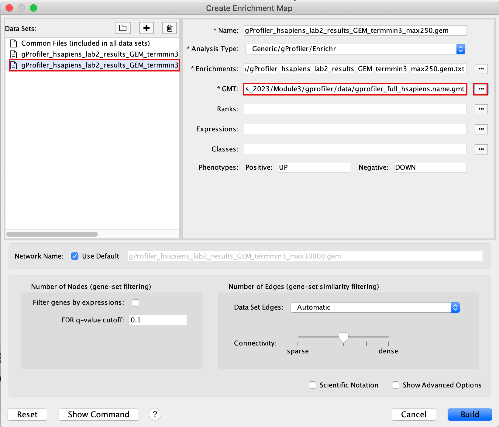

2d. In the white box, click on "*gProfiler_hsapiens_lab2_results_GEM_termmin3_max10000 (Generic/gProfiler)*" 

2e. On the right side, go to the **GMT** field, click on the 3 radio button (...) and locate the file *gprofiler_full_hsapiens.name.gmt* that you have saved on your computer to upload it.

2f. Locate the **FDR q-value cutoff** field and set the value to 0.001

2g. Select the **Connectivity** slide bar to **sparse**. 

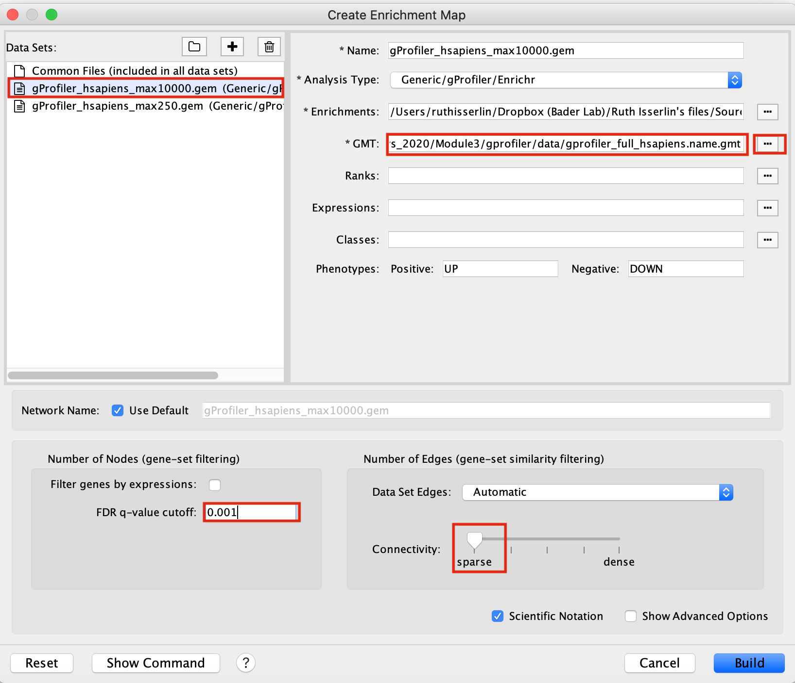

```{block, type="rmd-tip"}
Intstead of specifying the gmt file for each dataset separately, if all the dataasets in your analysis use the same gmt file, you can specify a common gmt file to be used by all datasets.  

  * Click *+Add...* and select *Add Common Files* 
  
  * On the right side, go to the *GMT file* field, click on the 3 radio button (...) and locate the file *gprofiler_full_hsapiens.name.gmt* that you have saved on your computer to upload it.

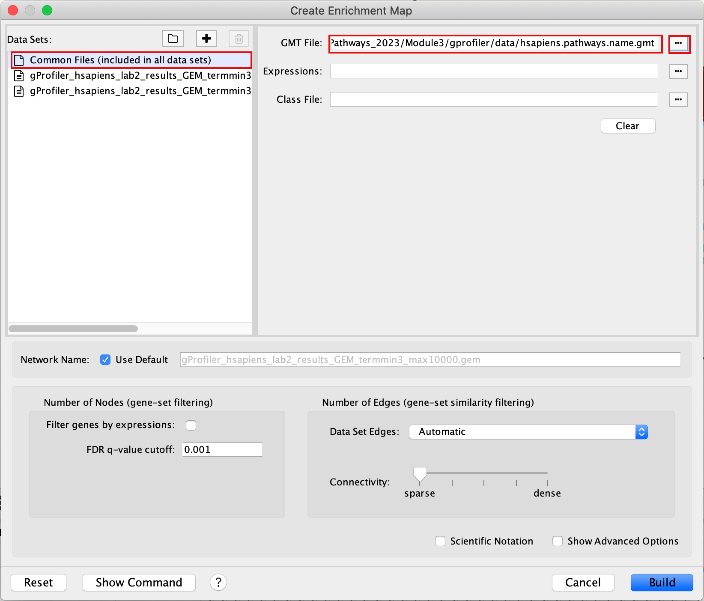

  This can also be done for a shared expression file.

```


2h. Click on *Build*.

```{block, type="rmd-tip"}
If you have specified common files this info box will appear

  
  * Click on *Continue to build*

```

* A status bar should pop up showing progress of the Enrichment map build.

<p align="center">
  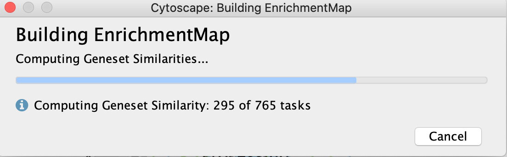
</p>

```{block, type="rmd-tip"}
There might be multiple messages that appear when you first create an enrichment map.  You can choose to silence them if you want (Although the yfiles message will continue to appear every two weeks).

  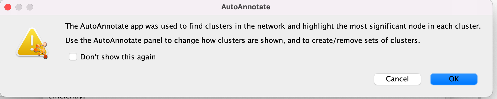
  * Click on *OK*

  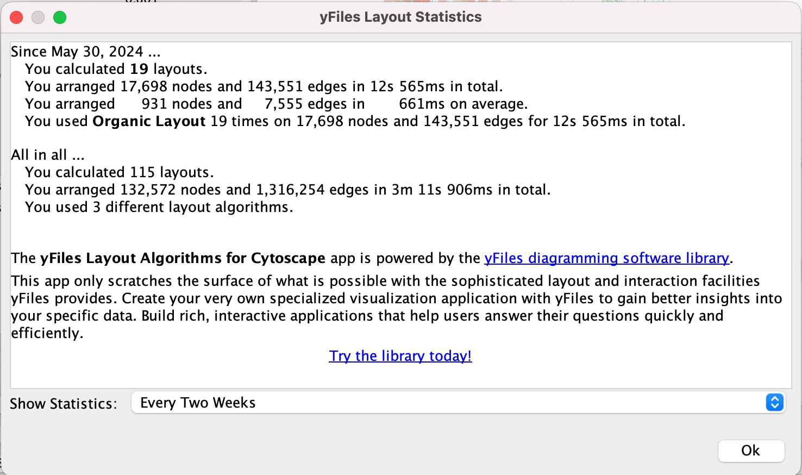
  * Click on *OK*

```

### Step3: Explore the results:

In the EnrichmentMap control panel located at the left:

  * Select the 2 Data Sets (checked by default)
  * Set Chart Data o *Color by Data Set*
  * Select *Publication Ready* to remove gene-set label to have a global view of the map. 
  
```{block, type="rmd-tip"}
un-select *Publication Ready* when you explore the map in more detail to see the gene-set names. 
```

<p align="center">
   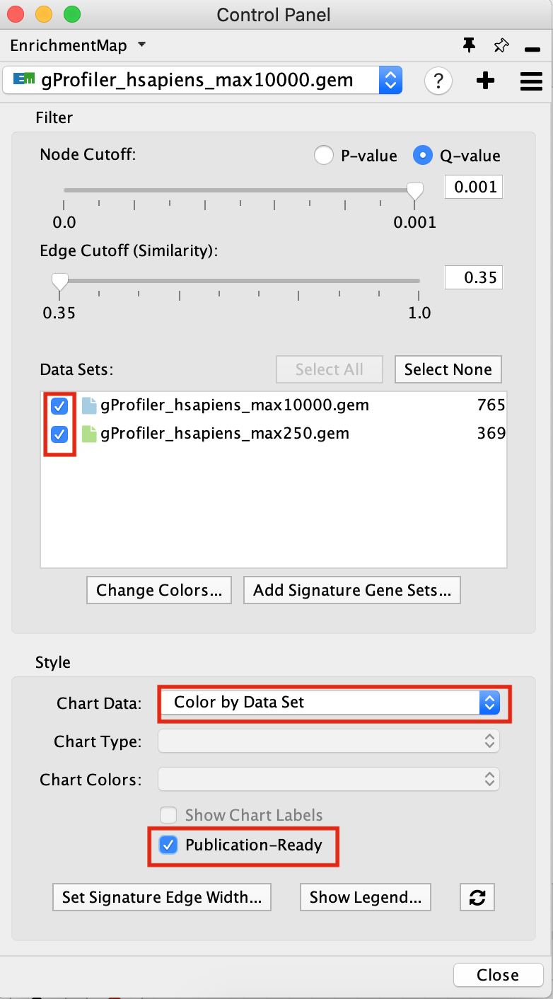
</p>

On the map, a node that is coloured both green and blue is a gene-set that is found in the both of the 2 gProfiler result sets that we have been uploaded. 

* A node that is blue is a gene-set that is found only in the file *gProfiler_hsapiens_lab2_results_GEM_termmin3_max10000* . 
* A node that is green is a gene-set that is found only in the file *gProfiler_hsapiens_lab2_results_GEM_termmin3_max250* .
* A blue edge represents genes that overlap between gene-sets found in the file *gProfiler_hsapiens_lab2_results_GEM_termmin3_max10000*.
* A green edge represents genes that overlap between gene-sets found in the file *gProfiler_hsapiens_lab2_results_GEM_termmin3_max250.gem*. 

 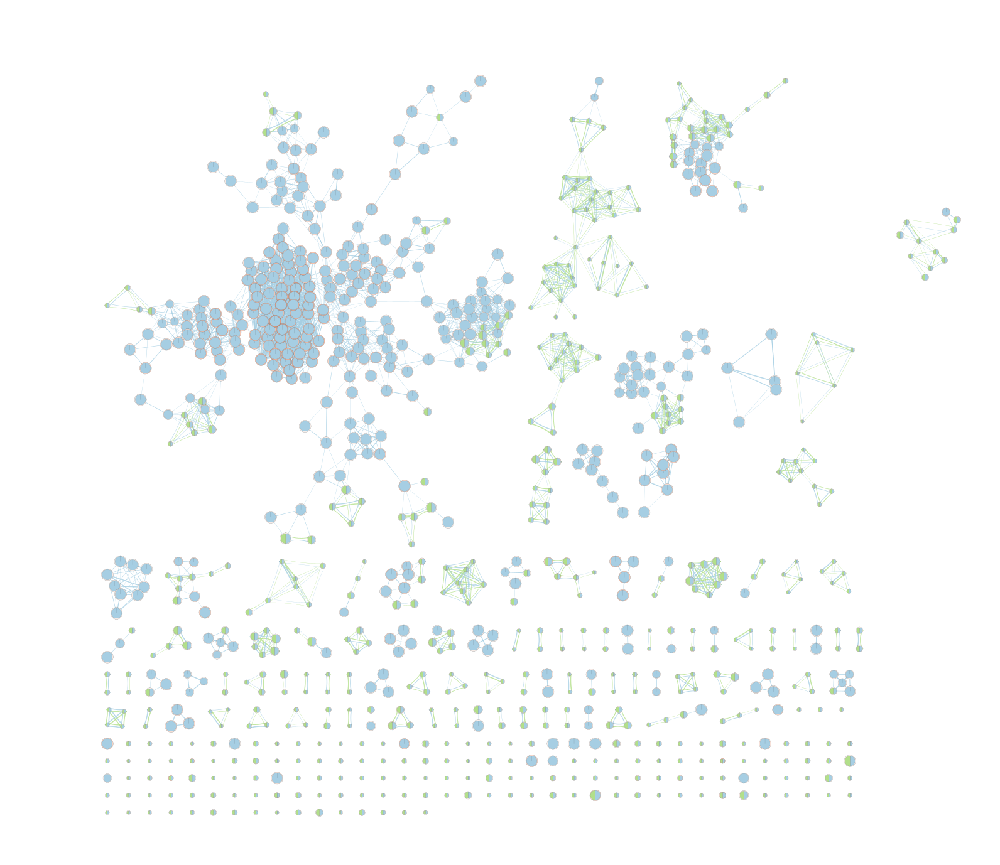
 
 We can see clusters of blue nodes. All these nodes contain gene-sets that have more than 250 genes. Explore the detailed view (see below) to see if this cluster corresponds to informative terms. 
 
```{block, type="rmd-question"}
Would you have lost information by filtering gene-sets larger than 250 genes?
```
### Explore Detailed results 

  * In the Cytoscape menu bar, select 'View" and 'Show Graphic Details' to display node labels. 
  
```{block, type="rmd-caution"}
Make sure you have unselected "Publication Ready" in the EnrichmentMap control panel.
```

  * Zoom in to be able to read the labels and navigate the network using the bird eye view (blue rectangle).

  * Select a node and visualize the *Table Panel*
    * Click on a node
   
    * For this example the node *"Signaling by Notch"* has been selected. 
    
```{block, type="rmd-tip"}
you can type it in the search bar, quotes are important.   
```

   

When the node is selected, it is highlighted in <font color="yellow">yellow</font>.


In table panel, we can see the genes included in the gene-set. 

A green colored box indicates that the gene is in the gene-set(pathway) and in our gene list. 

A gray colored box indicated that the gene is in the gene-set but not in our gene list.

  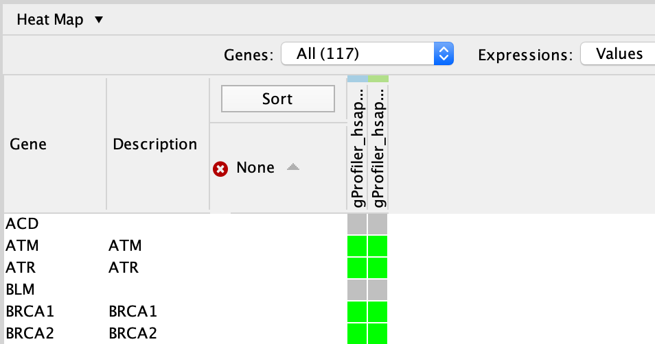

## Exercise 1b - Is specifying the gmt file important?

Create an enrichment map without a gmt file to compare the results with Exercise 1a.

  * Go to Control Panel and select the EnrichmentMap tab. 
  * Click on the "+" sign to re-open the *Create Enrichment Map* window.
  <p align="center">
   
  </p> 
  
  * In the white box, select the "*gProfiler_hsapiens_lab2_results_GEM_termmin3_max250.gem (Generic/gProfiler)*" file 
  * Locate the GMT field and delete the file name, leaving it blank.
  * In the white box, select the "*gProfiler_hsapiens_lab2_results_GEM_termmin3_max10000 (Generic/gProfiler)*" file 
  * Locate the GMT field and delete the file name , leaving it blank.
  * Use same parameters as in [exercise 1a](#exercise-1a): FDR q-value cutoff of 0.001 and Connectivity to sparse.
  * Click on *Build*
 
  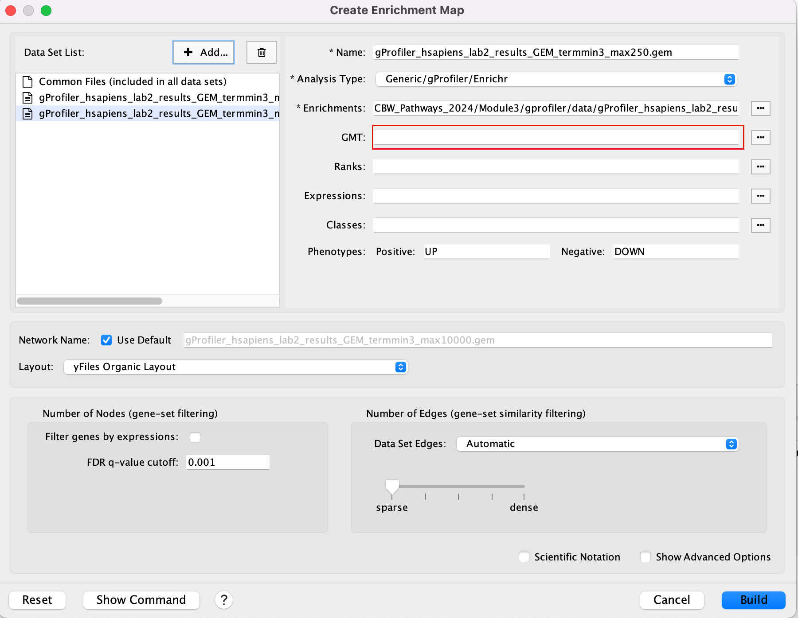
 
 
 Explore the results:
 
 In the EnrichmentMap control panel located at the left:
 
  * Select the 2 Data Sets (selecteded by default)
  * Set Chart Data o *Color by Data Set*
  * Select *Publication Ready* to remove gene-set label to have a global view of the map. 
  
```{block, type="rmd-tip"}
Uncheck this box when you explore the map in details to see the gene-set names. 
```

 <p align="center">
   
  </p>

On the map, a node that is coloured both green and blue is a gene-set that is found in the both of the 2 gProfiler result sets that we have been uploaded. 

  * A node that is blue is a gene-set that is found only in the file *gProfiler_hsapiens_lab2_results_GEM_termmin3_max10000* . 
    * A node that is green is a gene-set that is found only in the file *gProfiler_hsapiens_lab2_results_GEM_termmin3_max250* .
  * A blue edge represents genes that overlap between gene-sets found in the file *gProfiler_hsapiens_lab2_results_GEM_termmin3_max10000*.
  * A green edge represents genes that overlap between gene-sets found in the file *gProfiler_hsapiens_lab2_results_GEM_termmin3_max250.gem*. 

 
 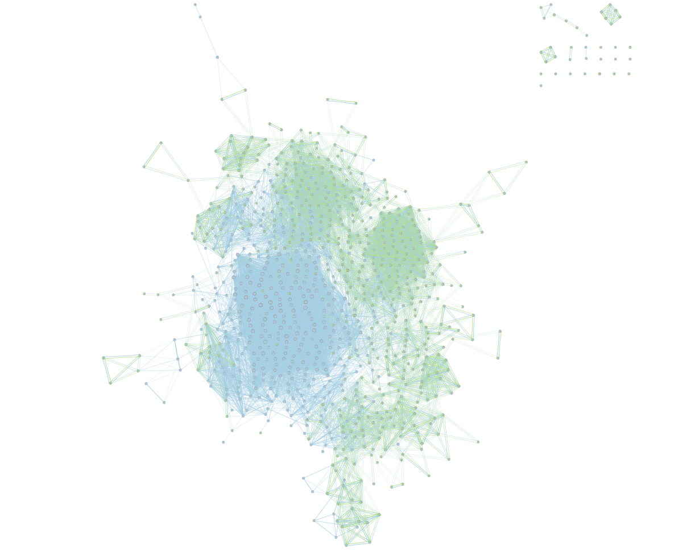
 

**Conclusion of exercises 1 a and 1b:**

Loading a gmt file to create an enrichment map from g:Profiler result is optional. However, there are 2 main beneficial aspects to uploading a gmt file:

  1. The map will be less condensed and easier to read and interpret.  
  1. Clicking on a node will display all genes in the gene-set and not only genes included in our query list. 


## Exercise 1c - create EM from results using Baderlab genesets
 
 Create an enrichment map from the results of g:Profiler generated using the custom Baderlab gene-set file. <br>
 To get a map that is easy to read and that does not display too many gene-sets, one option is to focus the analysis on gene-sets (pathways) that contain 250 genes or less. We prefiltered our pathway database prior to upload it into g:Profiler so that FDR is calculated only on these gene-sets (as opposed to exercise 1a where the FDR was calculated on all gene-sets and then some gene-sets > 250 genes were excluded from the result file). For this exercise, we will use:
 
  * Filtered gmt file: [Human_GOBP_AllPathways_noPFOCR_no_GO_iea_June_01_2024_symbol_max250.gmt](./Module3/gprofiler/data/Human_GOBP_AllPathways_noPFOCR_no_GO_iea_June_01_2024_symbol_max250.gmt). 
  
  * We have uploaded this file as a custom gmt file in g:Profiler and run the query. (in Module 2 lab)
  
  * To create an enrichment map of these results:
   * Go to Control Panel and select the EnrichmentMap tab. 
 * Click on the "+" sign to re-open the *Create Enrichment Map* window.
 <p align="center">
   
  </p> 
 * Click on *Reset* to reset the Enrichment map panel
 * Drag the file that we created in Module 2 lab [gProfiler_hsapiens_Baderlab_max250.gem.txt](./Module3/gprofiler/data/gProfiler_hsapiens_Baderlab_max250.gem.txt) and the filtered gmt file ([Human_GOBP_AllPathways_noPFOCR_no_GO_iea_June_01_2024_symbol_max250.gmt](./Module3/gprofiler/data/Human_GOBP_AllPathways_noPFOCR_no_GO_iea_June_01_2024_symbol_max250.gmt) into the Datasets box on Enrichment map panel.
 * In the white box, select the "*gProfiler_hsapiens_Baderlab_max250.gem.txt (Generic/gProfiler)*" file 
 * Locate the GMT field and upload the file "*Human_GOBP_AllPathways_noPFOCR_no_GO_iea_June_01_2024_symbol_max250.gmt*".
 * Set the **FDR q-value cutoff** to 0.001 and set the **Connectivity** slide bar to second level. 
  
  
  
 Explore the results:
 
  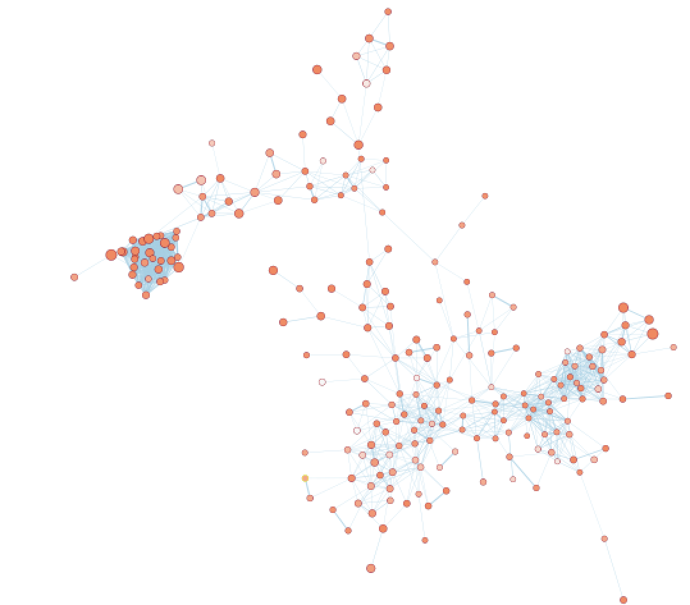
 

```{block, type="rmd-caution"}
SAVE YOUR CYTOSCAPE SESSION (.cys) FILE ! 
```

## Exercise 1d (optional) - investigate individual pathways in GeneMANIA or String

Each node in the Enrichment map represents a biological process or pathway.  It consists of a collection of genes.  Often we want to know how the genes in that group interact.  There are many different ways you can investigate the underlying interactions for the given group.  Some involve searching online databases and others are directly integrated into cytoscape.

* [GeneMANIA](https://genemania.org/) - an integrative database of gene connections including co-expression, protein interactions, genetic interactions, pathways and more. **Cytoscape App**
* [String](https://string-db.org/) - an integrative database of gene connections including co-expression, protein interactions, genetic interactions, pathways and more. **Cytoscape App**
* [Pathway Commons](https://www.pathwaycommons.org/) - a intergrative database of pathways.  (There is a beta feature in EM to show your pathway in the painter app, a pathway common web page that overlays your expression data on the given pathway.  Still in beta testing and requires expression data to work correctly so won't work for this example)

### GeneMANIA

* Navigate to the enrichment map that you created using the Baderlab genesets 
    * Click on Network Tab and navigate to the third network (it should be the third network if you followed the above examples - name: gProfiler_hsapiens_Baderlab_max250_gem)
    * or in the Enrichment map panel in the top drop down select the network named gProfiler_hsapiens_Baderlab_max250_gem
* In the cytoscape search bar enter *"Signaling by Notch"* 

```{block, type="rmd-tip"}
If you can't see the selected nodes, click on "Fit Selected" to focus on the selected node.<br>

```


* Right click on the node *"Signaling by Notch"* and Select *Apps* --> *Enrichmemt Map - Show in GeneMANIA*

  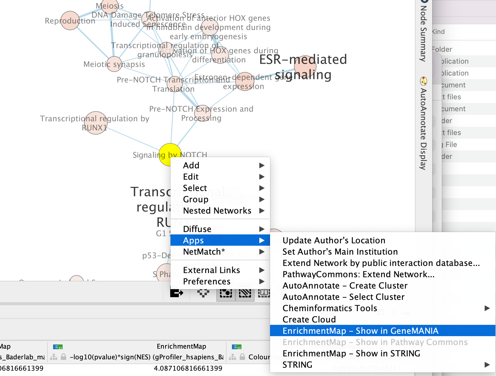

* A GeneMANIA Query Panel will pop up.
* Select *Select genes with expression* to reduce the query set to just the genes in the given pathway that was in your original dataset (for example we search for a set of 127 genes in g:profiler but the given pathway has 233 genes associated with it of which only 10 genes are found in our original query set )
* Click on *OK*

  

* A GeneMANIA network will show up with the connections between the genes found in your query set and the pathway "Signaling by Notch"

  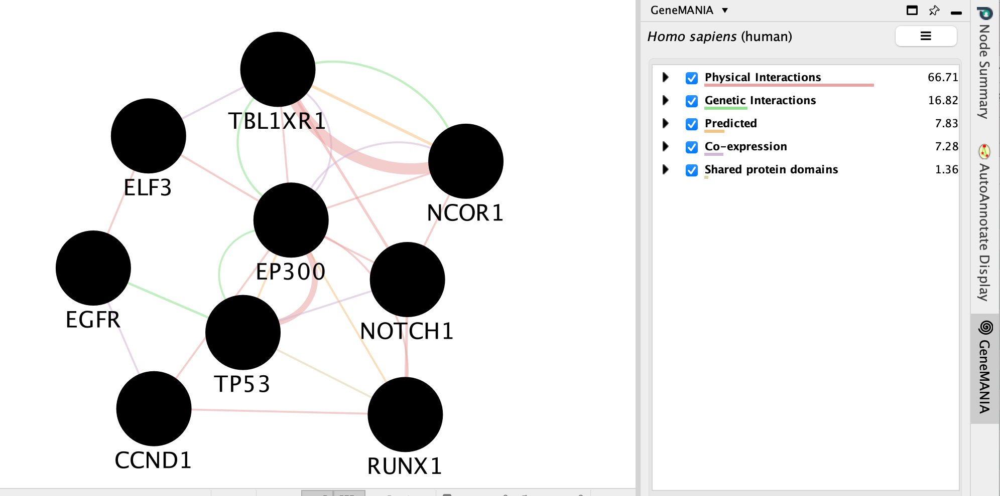

* We will go more in depth into [GeneMANIA in module 5](#genemania_cytoscape)

### String
* Navigate to the enrichment map that you created using the Baderlab genesets 
    * Click on Network Tab and navigate to the third network (it should be the third network if you followed the above examples - name: gProfiler_hsapiens_Baderlab_max250_gem)
    * or in the Enrichment map panel in the top drop down select the network named gProfiler_hsapiens_Baderlab_max250_gem
* In the cytoscape search bar enter *"Signaling by Notch"* 

```{block, type="rmd-tip"}
If you can't see the selected nodes, click on "Fit Selected" to focus on the selected node.<br>

```

* Right click on the node *"Signaling by Notch"* and Select *Apps* --> *Enrichmemt Map - Show in String*

  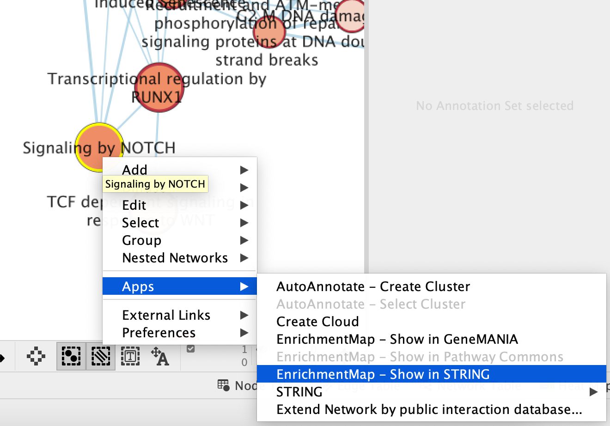

* A String Query Panel will pop up.
* Select *Select genes with expression* to reduce the query set to just the genes in the given that pathway that was in your original dataset (for example we search for a set of 127 genes in g:profiler but the given pathway has 233 genes associated with it of which only 10 genes are found in our original query set )
* Click on *OK*

  

* A String network will show up with the connections between the genes found in your query set and the pathway "Signaling by Notch"

  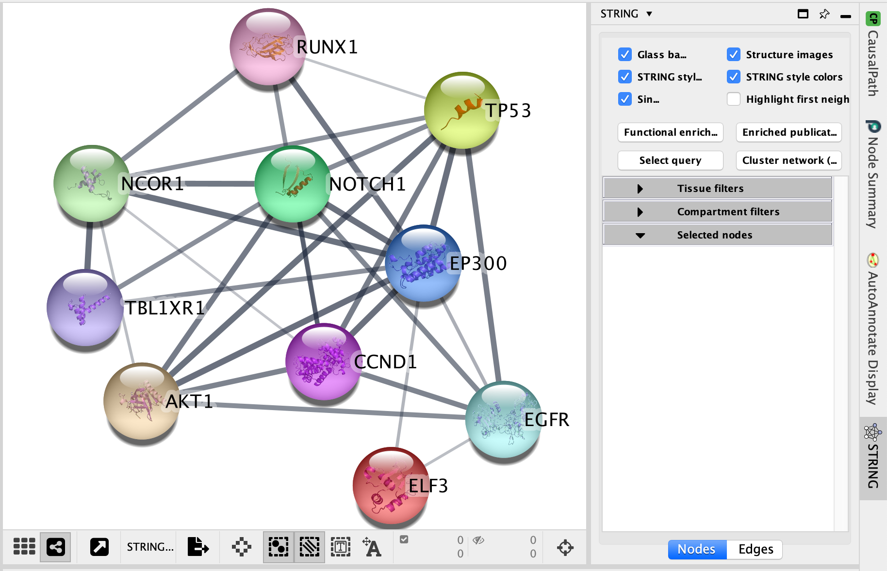
  
```{block, type="rmd-question"}
Explore the features and data of each Cytoscape app.<br>What sort of information does each tell you? <br> What is the main difference between the two resulting networks?
```

___

## Bonus - Automation. 

Run analysis directly from R for easy integration into existing pipelines.

```{block, type="rmd-bonus"}
Instead of creating an Enrichment map manually through the user interface you can create an enrichment map directly using the [RCy3 bioconductor package](https://www.bioconductor.org/packages/release/bioc/html/RCy3.html) or through direct rest calls with [Cytoscape cyrest](https://apps.cytoscape.org/apps/cyrest).  

Follow the step by step instructions on how to run from R here - https://risserlin.github.io/CBW_pathways_workshop_R_notebooks/create-enrichment-map-from-r-with-gprofiler-results.html

First, make sure your environment is set up correctly by following there instructions - https://risserlin.github.io/CBW_pathways_workshop_R_notebooks/setup.html
```

<!--chapter:end:3.1-Module3lab_gprofiler.Rmd-->

# Module 3 Lab: GSEA Visualization {#gsea_mod3}

**This work is licensed under a [Creative Commons Attribution-ShareAlike 3.0 Unported License](http://creativecommons.org/licenses/by-sa/3.0/deed.en_US). This means that you are able to copy, share and modify the work, as long as the result is distributed under the same license.**

 *<font color="#827e9c">By Veronique Voisin, Ruth Isserlin, Gary Bader</font>*

## Goal of the exercise:

**Exercise 1 - Create an enrichment map and navigate through the network**

During this exercise, you will learn how to create an EnrichmentMap from gene-set enrichment results. The enrichment tool chosen for this exercise is [GSEA](http://software.broadinstitute.org/gsea/index.jsp) but an enrichment map can be created from output from [GSEA](http://software.broadinstitute.org/gsea/index.jsp), 
[g:Profiler](https://biit.cs.ut.ee/gprofiler/gost),
[GREAT](http://great.stanford.edu/public/html/),
[BinGo](http://apps.cytoscape.org/apps/bingo), [Enrichr](https://amp.pharm.mssm.edu/Enrichr/) or alternately from any gene-set tool using the generic enrichment results format.

**Exercise 2 - Post analysis (add drug target gene-sets to the network)**

As second part of the exercise, you will learn how to expand the network by adding an extra layer of information.

**Exercise 3 - Autoannotate**

A last optional exercise guides you through the creation of automatically generated cluster labels to the network.

## Data

The data used in this exercise is gene expression data obtained from high throughput RNA sequencing.
The data correspond to Pancreatic Ductal Adenocarcinoma samples (TCGA-PAAD). We use precomputed results of the GSEA analysis [Module 2 lab - gsea](#gsea-lab) to create an enrichment map with the aim to transform the tabular format to a network so we can better visualize the relationships between the significant gene-sets:


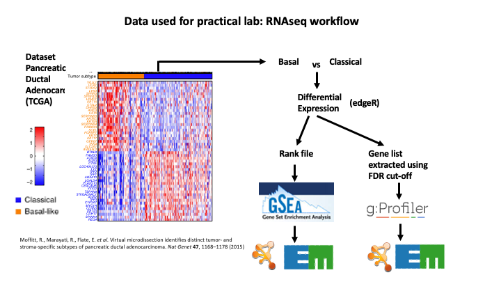

GSEA outpus an entire directory of files and results.  For the purpose of this analysis we only need two tables found in the output directory. The output result tables are:

*	One table (*pos*) contains all pathways with an enrichment score (significant or not) related to enrichment of the basal category (positive score). (By default called - gsea_report_for_na_pos_#############.tsv)

*	One table (*neg*) contains all pathways with an enrichment score (significant or not) related to enrichment of the classical category (negative score). (By default called - gsea_report_for_na_neg_#############.tsv)

*	These 2 tables are uploaded using the EnrichmentMap App which will create a network of basal and classical pathways that have a significant score (FDR <= 0.05) for clearer visualization of the results.

### EnrichmentMap

*	A <font color="red">red circle (node)</font> is a pathway specific of the mesenchymal type. (or pathway with mostly positively ranked genes)

*	A <font color="blue">blue circle (node)</font> is a pathway specific of the immunoreactive type. (or pathway with mostly negatively ranked genes)

*	An edge represents genes in common between 2 pathways (nodes).

*	A cluster of nodes represent overlapping and related pathways and may represent a common biological process or theme.

*	Clicking on a node will display the genes included in each pathway.

## Exercise 1 - GSEA output and EnrichmentMap

To start the lab practical section, first download the files.

```{block, type="rmd-datadownload"}
Right click on link below and select "Save Link As...".

Place it in the corresponding module directory of your CBW work directory.
```


7 Files are needed to create the enrichment map for this exercise (please download these files on your computer or alternately use the GSEA directory created in [module 2 lab - gsea](#gsea-lab) for files 1,2,3) :

1.	GMT (file containing all pathways and corresponding genes) - [Human_GOBP_AllPathways_noPFOCR_no_GO_iea_June_01_2024_symbol.gmt](./Module3/gsea/data/Human_GOBP_AllPathways_noPFOCR_no_GO_iea_June_01_2024_symbol.gmt)

2.	Enrichments 1 (GSEA results for the “pos” basal subtype) - [gsea_report_for_na_pos_1717773429384.tsv](./Module3/gsea/data/gsea_report_for_na_pos_1717773429384.tsv)

3.	Enrichments 2 (GSEA results for the “neg” Classical subtype) - [gsea_report_for_na_neg_1717773429384.tsv](./Module3/gsea/data/gsea_report_for_na_neg_1717773429384.tsv)

4.	Expression (file containing the RNAseq data for all samples and all genes) - [TCGA-PAAD_GDC_BasalvsClassical_normalized_rnaseq.txt](./Module3/gsea/data/TCGA-PAAD_GDC_BasalvsClassical_normalized_rnaseq.txt)

5.	Rank file (file that has been used as input to GSEA) - [TCGA-PAAD_GDC_Subtype_Moffitt_BasalvsClassical_ranks.rnk](./Module3/gsea/data/TCGA-PAAD_GDC_Subtype_Moffitt_BasalvsClassical_ranks.rnk)
      

6.	Classes (define which samples are basal and which samples are classical) - [TCGA-PAAD_Subtype_Moffitt_BasalvsClassical_RNAseq_classes.cls](./Module3/gsea/data/TCGA-PAAD_Subtype_Moffitt_BasalvsClassical_RNAseq_classes.cls)

7.	Drug target database (preselection of 7 drugs and their target genes in the post analysis exercise, <http://www.drugbank.ca/>) - [Human_DrugBank_all_symbol_June_01_2024_selected.gmt](./Module3/gsea/data/Human_DrugBank_all_symbol_June_01_2024_selected.gmt)


Follow the steps described below at your own pace:

### Step 1

Launch Cytoscape and open EnrichmentMap App

**1a**. Double click on the Cytoscape icon

**1b**. Open EnrichmentMap App

* In the top menu bar:

   * Click on Apps -> EnrichmentMap 
 


A 'Create EnrichmentMap window is now opened.

### Step 2 

Create an enrichment map

**2a**. In the 'Create EnrichmentMap' window, add a dataset of the GSEA type by clicking on the '+ADD...' --> '+ add data set manually'.


**2b**. Specify the following parameters and upload the specified files:

*	*Name*: leave default or a name of your choice like "GSEAmapPAAD_Basal_vs_Classical"

*	*Analysis Type*:  GSEA

* *Enrichments Pos*: gsea_report_for_na_pos_1717773429384.tsv

* *Enrichments Neg*: gsea_report_for_na_neg_1717773429384.tsv

*	*GMT* : Human_GOBP_AllPathways_noPFOCR_no_GO_iea_June_01_2024_symbol.gmt

*	*Ranks*: TCGA-PAAD_GDC_Subtype_Moffitt_BasalvsClassical_ranks.rnk

*	*Expressions* : TCGA-PAAD_GDC_BasalvsClassical_normalized_rnaseq.txt
```{block, type="rmd-tip"}
This field is optional but recommended.
```   
*	*Classes*: TCGA-PAAD_Subtype_Moffitt_BasalvsClassical_RNAseq_classes.cls
```{block, type="rmd-tip"}
This field is optional.
```
*	*Phenotypes*: In the text boxes place *Basal*  as the Positive phenotype *Classical* as the Negative phenotype. Basal will be associated with red nodes because it corresponds to the positive phenotype and Classical will be associated with the blue nodes because it corresponds to the negative phenotype.

 *	Set FDR q-value cutoff to 0.05 (= only gene-sets significantly enriched at a value of 0.05 or less will be displayed on the map). 
```{block, type="rmd-tip"}
If the cutoff is set to a very small number, for exaxmple 0.0001, it will be displayed as  1E-04 in the scientific notation. 
```

**2c**. Click on *Build*

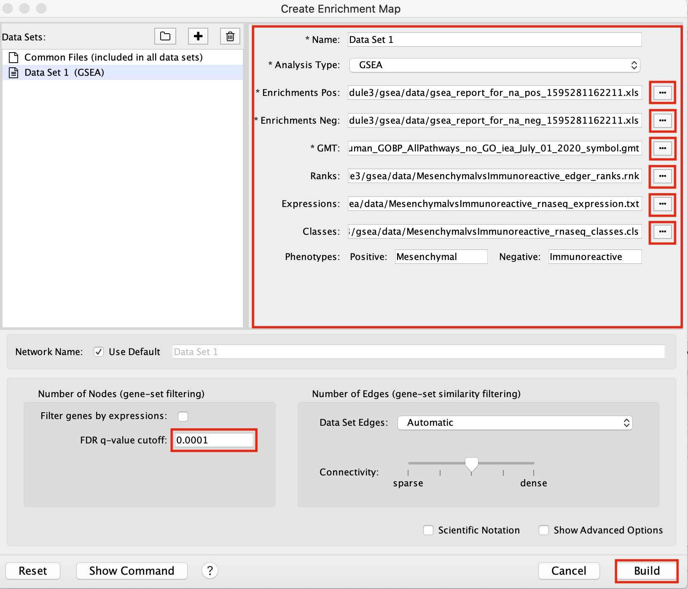

```{block, type="rmd-caution"}
We populated the fields manually. If you work with your own data, a way to populate automatically the fields is to drag and drop your GSEA folder in the 'Data Set' window. You are encouraged to give it a try once you finished the lab with your own GSEA results.
```

**Unformatted results**:

```{block, type="rmd-note"}
layout will be different for each user (there is a random seed in the layout algorithm) but it does not change the results or interpretation (the connections are the same, only the display is different).
```


### Step 3 

Navigate the enrichment map to gain a better understanding of a EnrichmentMap network. 

General layout of Cytoscape panel: In addition to the main window where the network is displayed, there are 2 panels: the Control Panel on the left side and the Table Panel at the bottom of the window. 

Steps: 

**3a**. In the Cytocape menu bar, select *View* and *Always Show Graphic details*. It will turn the squared nodes into circles and the gene-set labels will be visible. 
  


**3b**: Zoom in or out using + or - in toolbar or scroll button on mouse until you are able to read the labels comfortably.
 


**3c**:  Use the bird’s eye view (located at the bottom of the control panel) to navigate around the network by moving the blue rectangle using the mouse or trackpad.


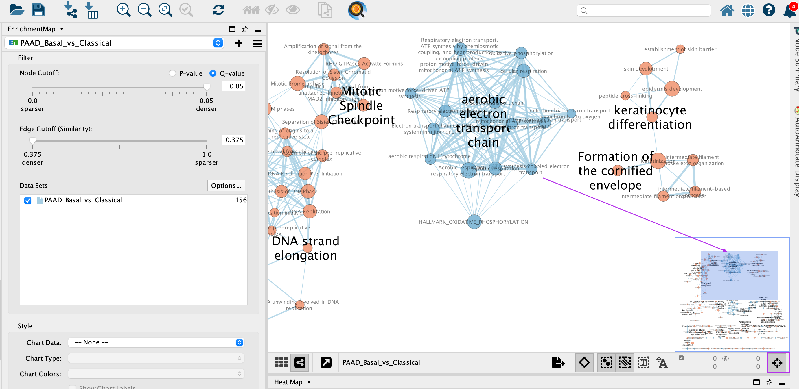
  
**3d**: Click on an individual node of interest.

For this example, you could use *TGF-BETA RECEPTOR SIGNALING ACTIVATES SMADS*. 

```{block, type="rmd-tip"}
If you are unable to locate *TGF-BETA RECEPTOR SIGNALING ACTIVATES SMADS*, type "TGF-BETA RECEPTOR SIGNALING ACTIVATES SMADS" in the search box (quotes are important).  Selected nodes appear yellow (or highlighted) in the network.
```

**3e**. In the Table Panel in the *EM Heat map* tab change:

* Expressions: *Row Norm*

* Compress: *-None-*

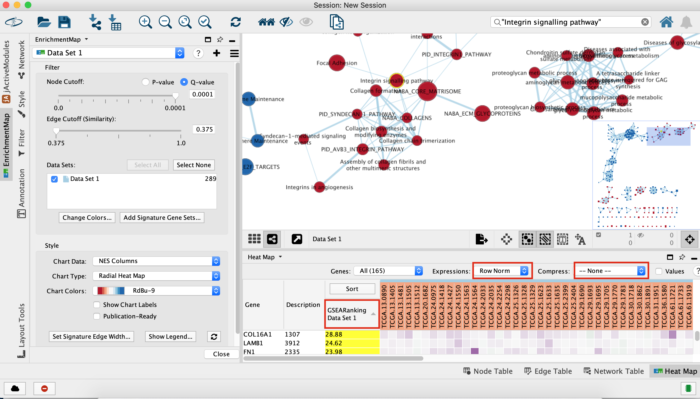
  
```{block, type="rmd-tip"}
Genes in the heatmap that are highlighted yellow (rank column)  represent genes that are part of the leading edge for this gene set, i.e. contributed the most to the enriched phenotype.<br> Leading edge genes will only be highlighted if an individual node has been selected and the Enrichment Map was created from GSEA results.<br><br> *Troubleshooting*: if you don't see the sort column highlighted in yellow, reselect the node of interest and click on the GSEARanking Data Set 1 text in the EM Heatmap tab.
```

### Step 4

Use Filters to automatically select nodes on the map: Move the blue nodes to the left side of the window and the red nodes to the right side of the window.

**4a**. Locate the *Filter* tab on the side bar of the *Control Panel*.

**4b**. Click on the + sign to view the menu and select *Column Filter*.

**4c**. From the *Choose column …* box, select *Node: NES(PAAD_Basal_vs_Classical)* and set filter values from -2.242 and 0 inclusive.

**4d**. The blue nodes are now automatically selected. Zoom out to be able to look at the entire network and drag all blue nodes to the left side of the screen.
  

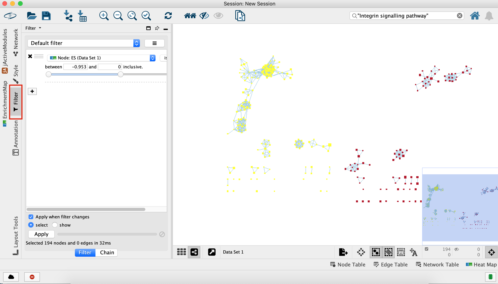

**4e**. Optional. Change *is* to *is not* to select the red nodes.
  

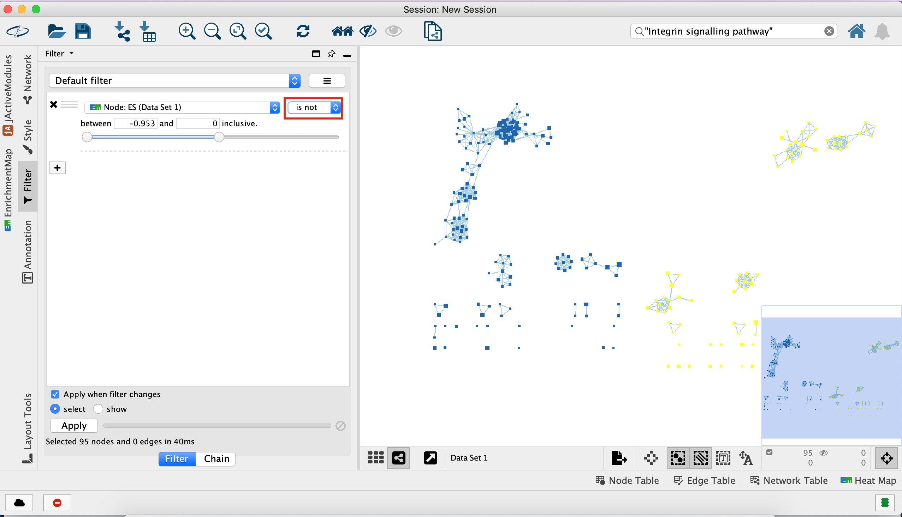

```{block, type="rmd-note"}
The red pathways (nodes) are specific to the Basal subtype. They were listed in the *pos* table of the GSEA results. The enrichment score (ES) values in this table are all positive values.<br> 

The blue pathways are specific to the Classical subtype and were listed in the *neg* table of the GSEA results. The ES values in this table are all negative values. <br><br>

This is the information we used as the filtering criteria.
```

## Exercise 2 - Post analysis (add drug target gene-sets to the network)

### Step 5

Add drug target gene-sets to the network (Add Signature Gene-Sets...).

**5a**. In Control Panel, go to the EnrichmentMap tab and click on "Options..." located above the 'Data Sets:' box. Select "Add Signature Gene Sets...". A window named "EnrichmentMap: Add Signature Gene Sets (Post-Analysis) is now opened.

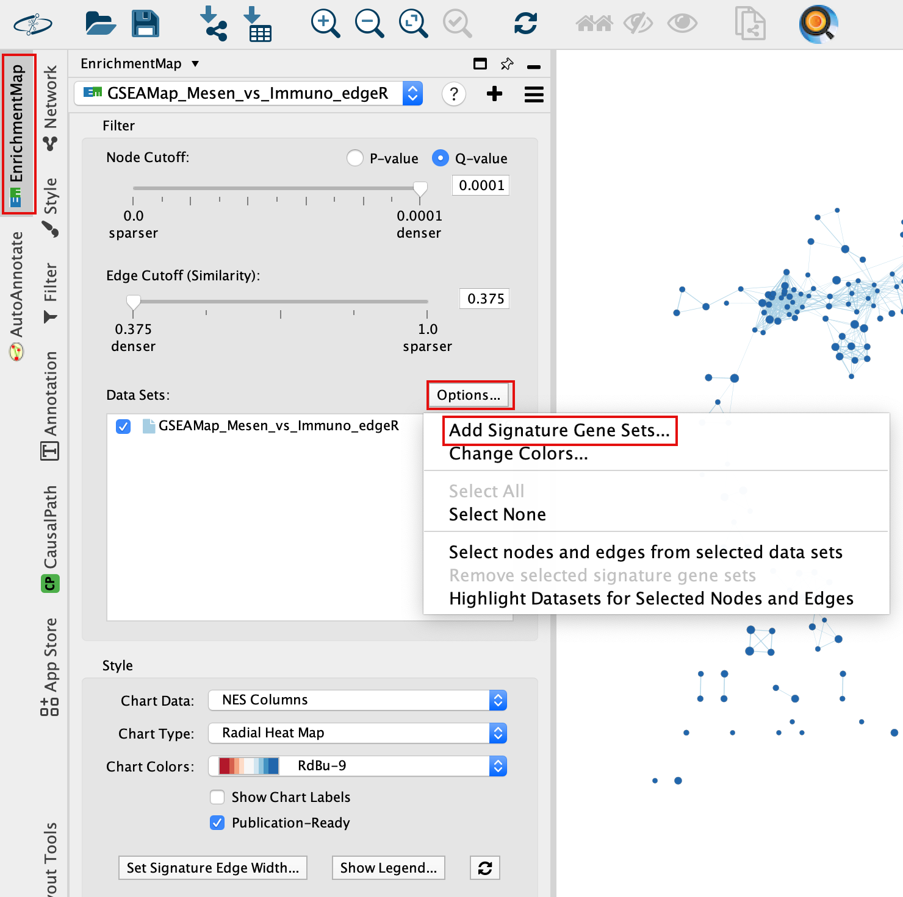

**5b**. Using the 'Load from File...' button, select the *Human_DrugBank_approved_symbol_June_01_2024_selected.gmt* file that you saved on your computer.


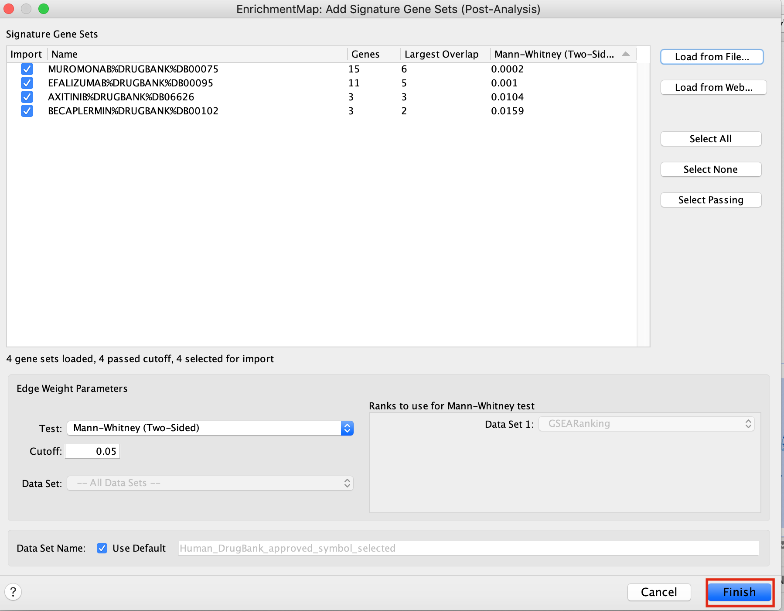

**5c**. Click on "Finish". 

```{block, type="rmd-note"}
Two additional nodes are now added to the network and visible as grey diamonds. 

Dotted orange edges represent their overlap with the nodes of our network. 

These additional nodes represent gene targets of some approved drugs and these genes are either specific of the basal type (dotted orange edges connected to red nodes) or specific of the classical type (dotted orange edges connected to blue nodes).

The remaining five drugs that do not pass the threshold in this map are other drugs currently used in treatment of pancreatic cancer.
```  


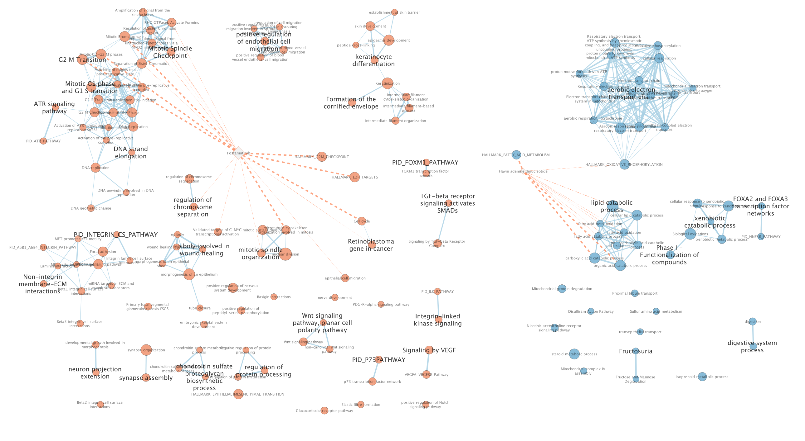

```{block, type="rmd-tip"}
more info using this link: https://enrichmentmap.readthedocs.io/en/latest/PostAnalysis.html
```

## Exercise 3 - Autoannotate the Network

### Step 6

By default, Enrichment map will Auto-annotate the network with cluster labels.

```{block, type="rmd-note"}
The Apps WordCloud, ClusterMaker and Autoannotate have to be installed. (they should have been installed during the pre-workshop set up)
```

```{block, type="rmd-note"}
if you ran step 5, <br>

**delete the drug targets diamond nodes and associated edge before performing step 6**:<br> 
  * select the 4 nodes and associated dotted orange edges by browsing the mouse and <br>
  * click "delete" on your keyboard or<br>
  * in the Cytoscape menu, 'Edit', 'Delete Selected Nodes and Edges'.<br><br>
  
**Alternately, in the Enrichment Map Input Panel in the Datasets box, un-select "Human_Drugbank_approved_symbol_June_01_2024_selected" to hide the post analysis nodes.** 
```

The "annotations" are hidden but the node of each computed cluster that has the most significant FDR value is shown with a larger node label.


**6a**. To modify these precomputed annotations find the Auto annotate display panel on the right or Auto annotate input panel on the left.  The right panel will contain all the different settings you can set for the annotations.  By default the annotations and their labels are hidden.  The left panel allows you to see all the different clusters and their labels.  You can select one of many of them, change their labels or recompute the clusters with predefined clusters or one of many avaialble methods amoungst other settings.  See the [docs](https://autoannotate.readthedocs.io/en/latest/) for all the available features.  


Unhide labels and shapes to see the underlying annotation for the network.  
  


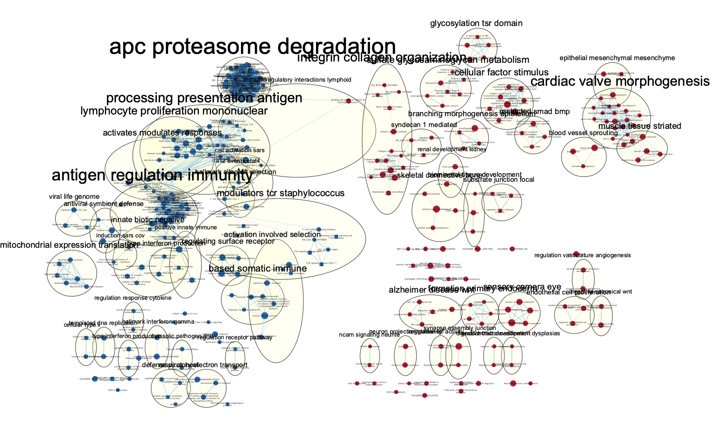

```{block, type="rmd-note"}
The network is now subdivided into clusters that are represented by ellipses. Each of these clusters are composed of pathways (nodes) interconnected by many common genes. These pathways represent similar biological processes. The app WordCloud take all the labels of the pathways in one cluster and summarize them as a unique cluster label displayed at the top of each ellipse. 
```

```{block, type="rmd-tip"}
**Tip 1**: further editing and formatting can be performed on the AutoAnnote results using the *AutoAnnotate Display* in the *Results Panels* located at the right side of the window.<br> For example, it is possible to change Ellipse to Rectangle, uncheck *Scale font by cluster size* and increase the *Font Scale* using the scaling bar. It is also possible to reduce the length of the cluster label by checking the "Word Wrap" option.

**Tip 2**: The AutoAnnotate window on the left side in Result Panel contains the list of all clusters. Clicking on a cluster label will highlight in yellow all nodes in this cluster. It is then easy to move the nodes using the mouse to avoid cluster overlaps. 
```


## Exercise 4 (Optional) - Explore results in GeneMANIA or STRING

Each node in the Enrichment map represents a biological process or pathway.  It consists of a collection of genes.  Often we want to know how the genes in that group interact.  There are many different ways you can investigate the underlying interactions for the given group.  Some involve searching online databases and others are directly integrated into cytoscape.

* [GeneMANIA](https://genemania.org/) - an integrative database of gene connections including co-expression, protein interactions, genetic interactions, pathways and more. **Cytoscape App**
* [String](https://string-db.org/) - an integrative database of gene connections including co-expression, protein interactions, genetic interactions, pathways and more. **Cytoscape App**
* [Pathway Commons](https://www.pathwaycommons.org/) - a intergrative database of pathways.  (There is a beta feature in EM to show your pathway in the painter app, a pathway common web page that overlays your expression data on the given pathway.  Still in beta testing and requires expression data to work correctly so won't work for this example)

### Step 7

Visualize genes in a pathway/node of interest using the apps STRING and GeneMANIA. This will create a protein-protein  interaction network using the genes included in the pathway. Note: We will go more in depth into [GeneMANIA in module 5](#genemania_cytoscape)

**7a**: Click on an individual node of interest.

For this example, you could use *xenobiotic metabolic process*. 

```{block, type="rmd-tip"}
If you are unable to locate *xenobiotic metabolic process*, type "xenobiotic metabolic process" in the search box (quotes are important).  The selected node appears yellow (or highlighted) in the network. If you have annotated your network, it should be included in the *response xenobiotic stimulus* cluster.
```

**7b**: Right Click on the node of interest to diplay the option menu. Select *Apps*,--> *EnrichmentMap - Show in STRING*<br>

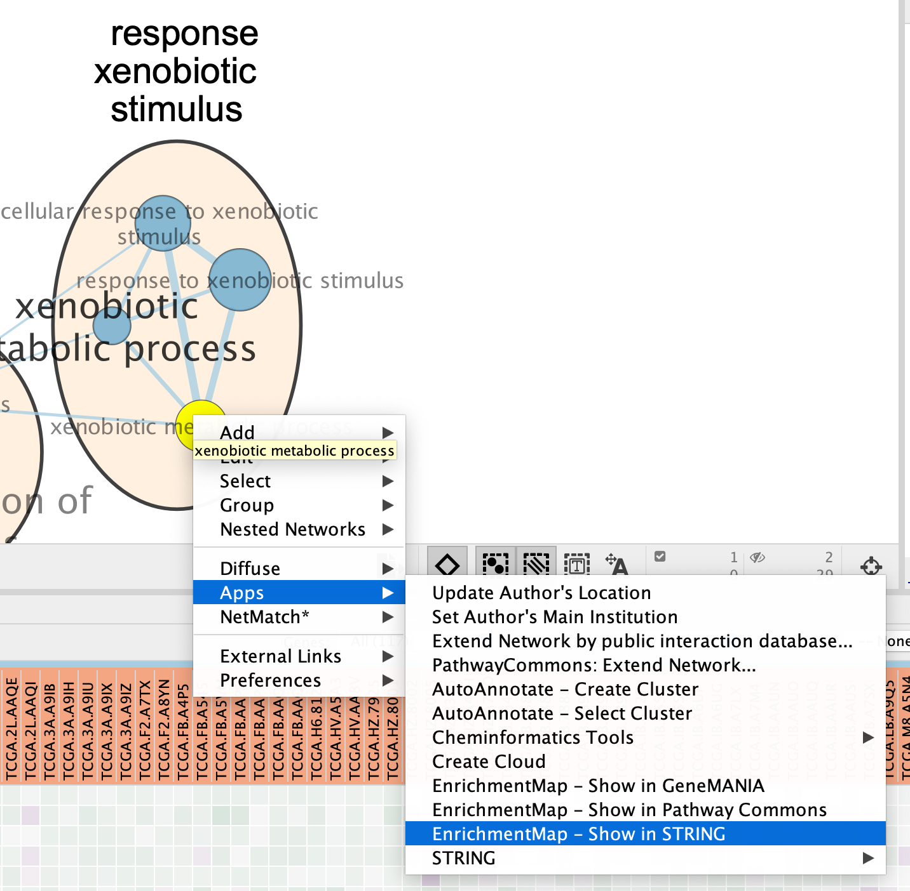

```{block, type="rmd-tip"}
Patience.  :) . It might take a few seconds for the *String Protein Query* window to open.
```

* A *STRING Protein Query* box appears.
* Select *Select genes with expression*.
* Click on *OK*. 


* The resulting network will look something like this.

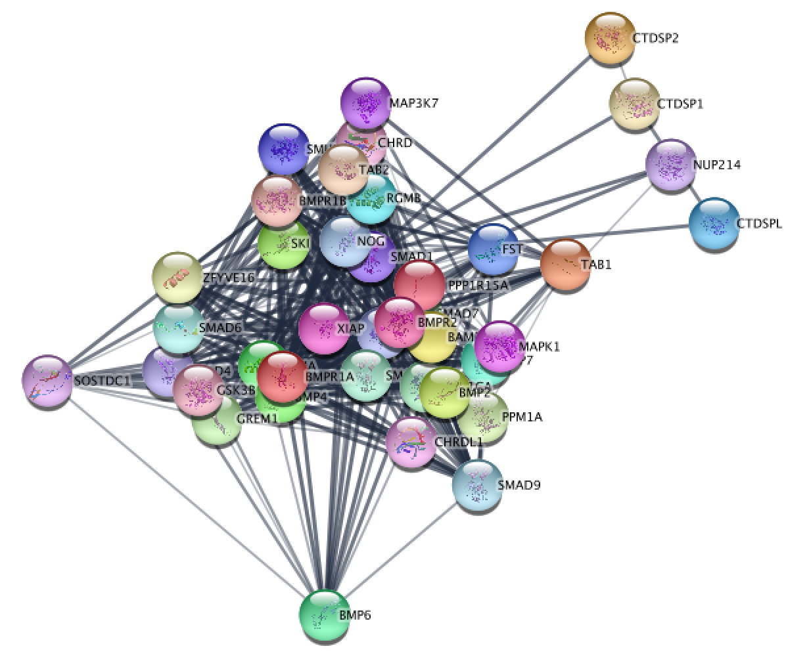

```{block, type="rmd-question"}
Explore the features and data of each Cytoscape app.<br>What happens to the network if you change the initial parameters like *Confidence cutoff* or *Max Additional interactors* <br><br>

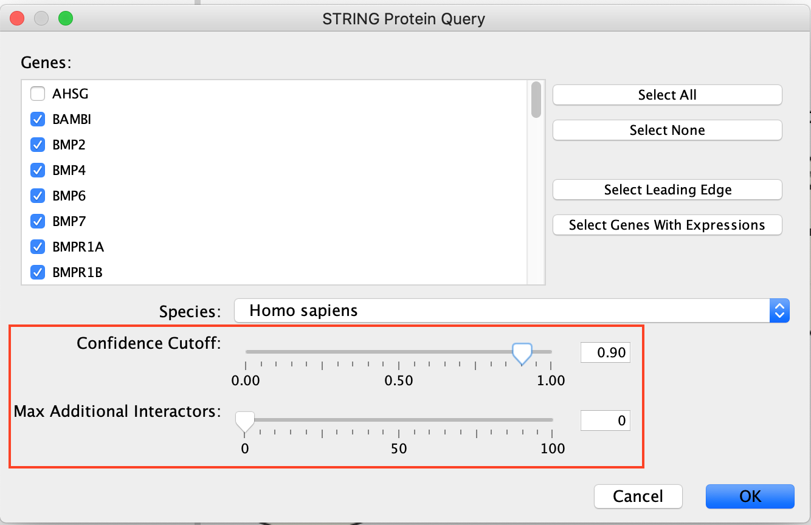
```


**7c**:Go back to enrichment map network. 

* In Control Panel (left side of the window), select the "Network" tab and click on the Enrichment Map network as shown in below screenshot. 

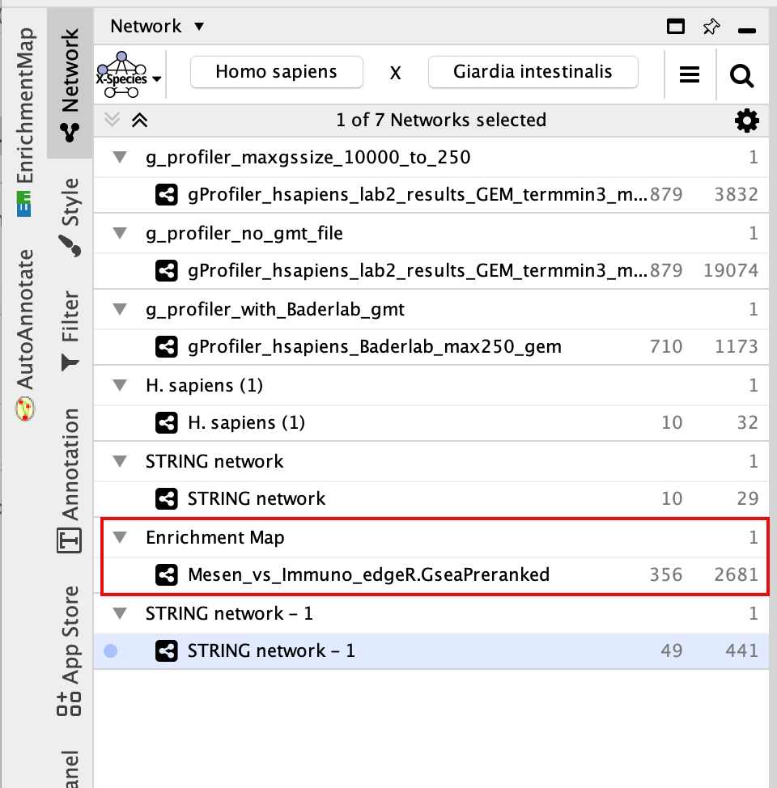


**7d**: Search again for the node labelled *xenobiotic metabolic process* (if it is not still selected) as in Step 7a. 

* Right Click on the node of interest to diplay the option menu. Select *Apps*,--> *EnrichmentMap - Show in GeneMANIA*<br>


* A *GeneMANIA Query* box appears.
* select *Select genes with expression*.
* Click on *OK*. 

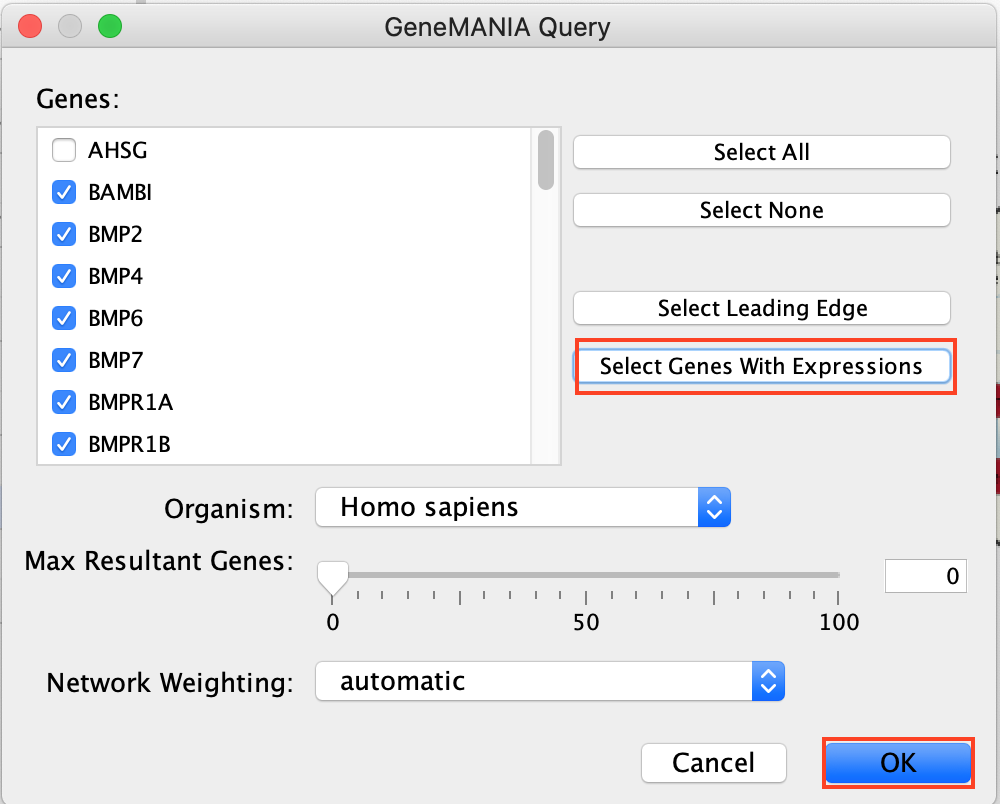

* A pop up will appear indicating that it is currenlty querying GeneMANIA


* The resulting network will look similiar to the below screenshot.

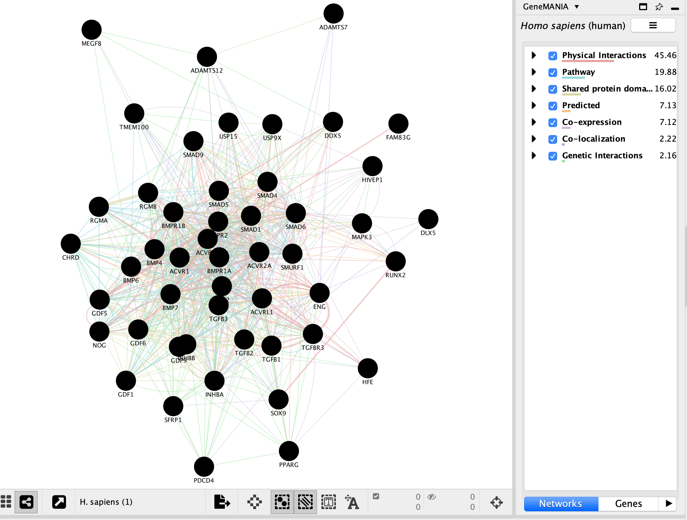


```{block, type="rmd-tip"}
It is possible to view gene expression data for the nodes in the STRING network. See the section https://enrichmentmap.readthedocs.io/en/latest/Integration.html and try it out after the workshop. 
```


```{block, type="rmd-caution"}
SAVE YOUR SESSION FILE!
```
 
___

## Bonus - Automation. 

Run analysis directly from R for easy integration into existing pipelines.

```{block, type="rmd-bonus"}
Instead of creating an Enrichment map manually through the user interface you can create an enrichment map directly using the [RCy3 bioconductor package](https://www.bioconductor.org/packages/release/bioc/html/RCy3.html) or through direct rest calls with [Cytoscape cyrest](https://apps.cytoscape.org/apps/cyrest).  

Follow the step by step instructions on how to run from R here - https://risserlin.github.io/CBW_pathways_workshop_R_notebooks/create-enrichment-map-from-r-with-gsea-results.html

First, make sure your environment is set up correctly by following there instructions - https://risserlin.github.io/CBW_pathways_workshop_R_notebooks/setup.html
```

<!--chapter:end:3.2-Module3lab_gsea.Rmd-->

# Module 3 Lab: (Bonus) Automation {#automation}

**This work is licensed under a [Creative Commons Attribution-ShareAlike 3.0 Unported License](http://creativecommons.org/licenses/by-sa/3.0/deed.en_US). This means that you are able to copy, share and modify the work, as long as the result is distributed under the same license.**

 *<font color="#827e9c">By Ruth Isserlin</font>*

Although a lot of what we have demonstrated in Cytoscape up until now has been manual most of the features we use can be automated through multiple access points including:


* R/Rstudio using [RCy3](https://bioconductor.org/packages/release/bioc/html/RCy3.html) - a bioconductor package that makes communicating with cytoscape as simple as calling a method. 
* Python using [py2cytoscape](https://py2cytoscape.readthedocs.io/en/latest/).
* directly through cyrest using rest calls - you can use any programming language with the rest API.  See [Cytoscape Automation](https://genomebiology.biomedcentral.com/articles/10.1186/s13059-019-1758-4) 

Automation becomes helpful when performing pipelines multiple times on similiar datasets or integrating cytoscape data into your other pipelines. 

Below we demonstrate how to perform the enrichment map pipeline from R but automation is not limited to this access point.  You can automate it from any flavour of programming.  

Check out all the ways you can interact with Cytoscape [here](http://manual.cytoscape.org/en/stable/Programmatic_Access_to_Cytoscape_Features_Scripting.html) including directly through the cytoscape command window. 

 
## Goal of the exercise:

**Run an enrichment analysis and Create an enrichment map automatically from R/Rstudio**

During this exercise, you will apply what you have learnt in Module 2 labs and Module 3 labs but instead of performing them manually you will automate the process using R/Rstudio.  We will use all the same data and programs we used in the previous labs but we will control them from R. 

Before starting this exercise you need to set up R/Rstudio.  You can do that directly on your machine or through docker. 

## Set Up - Option 1 - Install R/Rstudio 

  a. Install R.
  * Go to: https://cran.rstudio.com/
  


  * If installing on Windows select "install R for the first time" to get to the required package.
    
  

[RStudio](https://rstudio.com/) is a free IDE (Integrated Development Environment) for **R**. RStudio is a wrapper^[A "wrapper" program uses another program's functionality in its own context. RStudio is a wrapper for **R** since it does not duplicate **R**'s functions, it runs the actual R in the background.] for **R** and as far as basic R is concerned, all the underlying functions are the same, only the user interface is different (and there are a few additional functions that are very useful e.g. for managing projects).

Here is a small list of differences between **R** and RStudio.

**pros (some pretty significant ones actually):**

  * Integrated version control.
  * Support for "projects" that package scripts and other assets.
  * Syntax-aware code colouring.
  * A consistent interface across all supported platforms. (Base R GUIs are not all the same for e.g. Mac OS X and Windows.)
  * Code autocompletion in the script editor. (Depending on your point of view this can be a help or an annoyance. I used to hate it. After using it for a while I find it useful.)
  * "Function signaturtes" (a list of named parameters) displayed when you hover over a function name.
  * The ability to set breakpoints for debugging in the script editor.
  * Support for knitr, and rmarkdown; also support for R notebooks ... (This supports "literate programming" and is actually a big advance in software development)
  * Support for R notebooks.

**cons (all minor actually):**

  * The tiled interface uses more desktop space than the windows of the R GUI.
  * There are sometimes (rarely) situations where R functions do not behave in exactly the same way in RStudio.
  * The supported R version is not always immediately the most recent release.

```{block, type="rmd-note"}
  * Navigate to the [RStudio download](https://rstudio.com/products/rstudio/download/) Website.
  * Find the right version of the RStudio Desktop installer for your computer, download it and install the software.
  * Open RStudio.
  * Focus on the bottom left pane of the window, this is the "console" pane.
<p align="center"></p>  
  * Type getwd().
  * This prints out the path of the current working directory. Make a (mental) note where this is. We usually always need to change this "default directory" to a project directory.
``` 


## Set Up - Option 2 - Docker image with R/Rstudio

Changing versions and environments are a continuing struggle with bioinformatics pipelines and computational pipelines in general.  An analysis written and performed a year ago might not run or produce the same results when it is run today.  Recording package and system versions or not updating certain packages rarely work in the long run.  

One the best solutions to reproducibility issues is containing your workflow or pipeline in its own coding environment where everything from the operating system, programs and packages are defined and can be built from a set of given instructions. There are many systems that offer this type of control including:

  * [Docker](https://www.docker.com/).
  * [Singularity](https://sylabs.io/)
  
"A container is a standard unit of software that packages up code and all its dependencies so the application runs quickly and reliably from one computing environment to another." [@docker] 

**Why are containers great for Bioiformatics?**

  * allows you to create environments to run bioinformatis pipelines.
  * create a consistent environment to use for your pipelines.
  * test modifications to the pipeline without disrupting your current set up.
  * Coming back to an analysis years later and there is no need to install older versions of packages or programming languages. Simply create a container and re-run.  


### What is docker?

  * Docker is a container platform, similar to a virtual machine but better.
  * We can run multiple **containers** on our docker server.  A **container** is an instance of an **image**.  The **image** is built based on a set of instructions but consists of an operating system, installed programs and packages.  (When backing up your computer you might taken an image of it and restored your machine from this image.  It the same concept but the image is built based on a set of elementary commands found in your Dockerfile.) - for overview see [here](https://docs.docker.com/get-started/overview/)
  * Often images are built off of previous images with specific additions you need for you pipeline.  (For example, for this course we use a base image supplied by bioconductor[release 3.11](https://hub.docker.com/r/bioconductor/bioconductor_docker/tags?page=1&ordering=last_updated) and comes by default with basic Bioconductor packages but it builds on the base R-docker images called [rocker](https://www.rocker-project.org/).)

### Docker - Basic term definition

### Container
  * An instance of an image.
  * the self-contained running system.  
  * There can be multiple containers derived from the same image.

### Image
  * An image contains the blueprint of a container.
  * In docker, the image is built from a Dockerfile


### Docker Volumes

  * Anything written on a container will be erased when the container is erased ( or crashes) but anything written on a filesystem that is separate from the contain will persist even after a container is turned off.  
  * A [volume](https://docs.docker.com/storage/volumes/) is a way to assocaited data with a container that will persist even after the container.   * maps a drive on the host system to a drive on the container.
  *  In the above docker run command (that creates our container) the statement:
```{r, eval=FALSE}
-v ${PWD}:/home/rstudio/projects
```

  * maps the directory \$\{PWD\} to the directory /home/rstudio/projects on the container.  Anything saved in /home/rstudio/projects will actually be saved in \$\{PWD\}
  * An example:
    * I use the following commmand to create my docker container:

```{r eval=FALSE}
docker run -e PASSWORD=changeit --rm \
  -v /Users/risserlin/code:/home/rstudio/projects \
  -p 8787:8787 \
  risserlin/workshop_base_image
```

  * I create a notebook called task3.Rmd and save it in /home/rstudio/projects.
```{block type="rmd-caution"}
Note: Do not save it in /home/rstudio/ which is the default directory RStudio will start in
```
  * On my host computer, if I go to /Users/risserlin/code I will find the file task3.Rmd
    
##  Install Docker {#r_docker}

```{block, type="rmd-note"}
  1. Download and install [docker desktop](https://www.docker.com/products/docker-desktop).
  1. Follow slightly different instructions for Windows or MacOS/Linux
```
 
### Windows
  * it might prompt you to install additional updates (for example - https://docs.Microsoft.com/en-us/windows/wsl/install-win10#step-4---download-the-linux-kernel-update-package) and require multiple restarts of your system or docker.
  * launch docker desktop app.
  * Open windows Power shell 
  * navigate to directory on your system where you plan on keeping all your code.  For example: C:\\USERS\\risserlin\\code
  * Run the following command: (the only difference with the windows command is the way the current directory is written.  \$\{PWD\} instead of \"\$(pwd)\")

```{r eval=FALSE}
docker run -e PASSWORD=changeit --rm \
  -v ${PWD}:/home/rstudio/projects -p 8787:8787 \
  risserlin/workshop_base_image
```
<p align="center"></p>  
  * Windows defender firewall might pop up with warning.  Click on *Allow access*.
  * In docker desktop you see all containers you are running and easily manage them. 
<p align="center"></p>   


### MacOS / Linux
  * Open Terminal
  * navigate to directory on your system where you plan on keeping all your code.  For example: /Users/risserlin/code
  * Run the following command: (the only difference with the windows command is the way the current directory is written.   \$\{PWD\} instead of \"\$(pwd)\")

```{r eval=FALSE}
docker run -e PASSWORD=changeit --rm \
  -v "$(pwd)":/home/rstudio/projects -p 8787:8787 \
  risserlin/workshop_base_image
```
<p align="center"></p> 

## Create your first notebook using Docker

### Start coding!

  * Open a web browser to localhost:8787
<p align="center">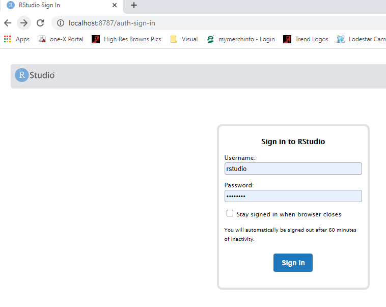</p> 
  * enter username: rstudio 
  * enter password: changeit 
  * changing the parameter *-e PASSWORD=changeit* in the above docker command will change the password you need to specify
  
```{block no_prompt, type="rmd-troubleshooting"}
When you go to localhost:8787 all you get is:
<p align="center"></p> 
  * Make sure your docker container is running.  (If you rebooted your machine you will need to restart the container on reboot.)
  * Make sure you got the right port.  
```

After logging in, you will see an Rstudio window just like when you install it directly on your computer. This RStudio will be running in your docker container and will be a completely separate instance from the one you have installed on your machine (with a different set of packages and potentially versions installed).

<p align="center">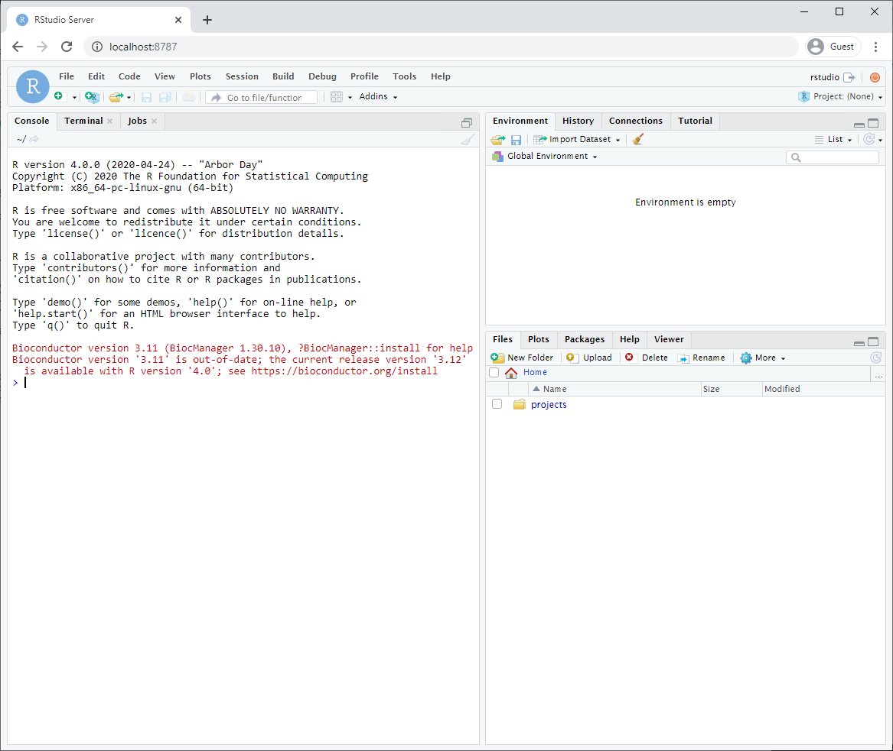</p> 

```{block, type="rmd-caution"}
Make sure that you have mapped a volume on your computer to a volume in your container so that files you create are also saved on your computer.  That way, turning off or deleting your container or image will not effect your files.<br>

* The parameter **-v ${PWD}:/home/rstudio/projects** maps your current directory (i.e. the directory you are in when launching the container) to the directory /home/rstudio/projects on your container.
* You do not need to use the ${PWD} convention.  You can also specify the exact path of the directory you want to map to your container. 
* Make sure to save all your scripts and notebooks in the projects directory.
```

  1. Create your first notebook in your docker Rstudio. 
  1. Save it.
  1. Find your newly created file on your computer.
 

## Start using automation
    
2. Download example R notebooks from https://github.com/risserlin/CBW_pathways_workshop_R_notebooks.

  * This repository contains example R Notebooks that automate the CBW pipeline.  
  * There are two ways you can download this collection:

    a. If you are familiar with git then we recommend you fork the repo and use it like you would use any github repo. 

    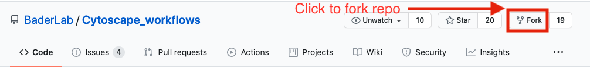

    b. download the collection as a zip file - unzip folder and place in CBW working directory

    

```{block, type="rmd-tip"}
If you are new to git and want to learn more about code versioning then we recommend you read the following [tutorial](https://guides.github.com/introduction/git-handbook/)
And check out [Github Desktop](https://desktop.github.com/) - a desktop application to communicate with github. 
```

## Running example notebooks in local RStudio

```{block, type="rmd-caution"}

Highly recommended to use docker instead of local RStudio.  If you are using local RStudio, versions of R and associated packages may be different than the ones used in the example notebooks and might require installing updated versions and additional packages.  

```

### Step 1 - launch RStudio

  * Launch RStudio by double clicking on the installed program icon.

### Step 2 - create a new project

  * Create a new project - File -> New R Project ...
  
  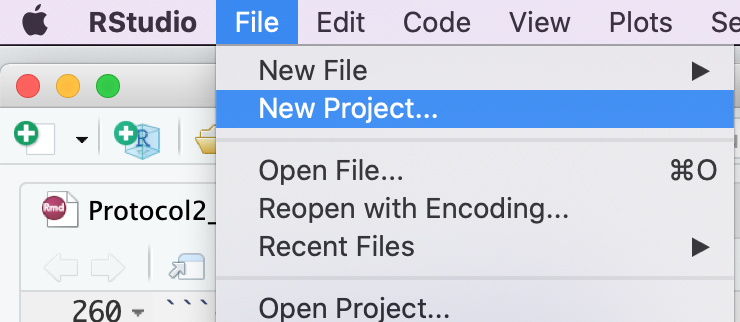

  * Select Create project from - "Existing Directory"

  

  * Click on the Browse button

  

  * Navigate to the CBW_pathways_workshop_R_notebooks directory that is found in the directory you downloaded and unzipped from github.  (for example, if it is still in your downloads directory go to ~/Downloads/Cytoscape_workflows/CBW_pathways_workshop_R_notebooks)

  
  
### Step 3 - Open example RNotebook 

  * Open the RNotebook **07-Create_EM_from_GSEA_results.Rmd**

    * Go to File --> Open File ...

      
    * Click on **07-Create_EM_from_GSEA_results.Rmd**

```{block, type="rmd-tip"}
If the file is not found in the first directory that RStudio opens up then go back and make sure that you created an Rproject from an "Existing directory" in the previous step. 
```


### Step 4 - Step through notebook to run the analysis

The RNotebook is a mixture of markdown text and code blocks.  

Read through the notebook to understand what each section is doing and sequentially run the code blocks by clicking on the play button at the top right of each code block.


Run analysis directly from R for easy integration into existing pipelines.

Instead of creating an Enrichment map manually through the user interface you can create an enrichment map directly using the [RCy3 bioconductor package](https://www.bioconductor.org/packages/release/bioc/html/RCy3.html) or through direct rest calls with [Cytoscape cyrest](https://apps.cytoscape.org/apps/cyrest).  

Follow the step by step instructions on how to run from R here - https://risserlin.github.io/CBW_pathways_workshop_R_notebooks/create-enrichment-map-from-r-with-gsea-results.html

First, make sure your environment is set up correctly by following there instructions - https://risserlin.github.io/CBW_pathways_workshop_R_notebooks/setup.html


### Exercises

Once you have run through the notebook and created your enrichment map automatically try the following:

  1. change the fdr threshold and create a new network (**without rerunning the whole notebook**) with the lower FDR threshold.
  1. change the similarity coeffecient and create a new network (**without rerunning the whole notebook**) with the lower FDR threshold.
  1. re-run the notebook using the GSEA results you created on the first run without running GSEA.
  1. Modify notebook to run with a different gmt file.  (Downloaded from somewhere else or a different file found on [baderlab genesets download site](http://download.baderlab.org/EM_Genesets/current_release/))
  1. Open the notebook Supplementary_Protocol5_Multi_dataset_theme_analysis.Rmd and run through it to create a multi dataset enrichment map.
  
### Additional resources

Check out all the different notebooks available [here](https://cytoscape.org/cytoscape-automation/for-scripters/R/notebooks/)

<!--chapter:end:3.3-Module3lab_bonus_automation.Rmd-->

#  Module 4: In-depth Analysis of Networks and Pathways  

  *<font color="#827e9c">Lincoln Stein</font>*
  
  [Lecture](./lectures/Pathways_2024_Module_4_Lecture.pdf)   
  
  [Lab Lecture](./lectures/Pathways_2024_Module_4_lab_VV.pdf)
  
  [Lab practical](#ReactomeFI)   


---
 


<!--chapter:end:4.0-Module4_Indepth_pathway_analysis.Rmd-->

# Module 4 Lab: ReactomeFI {#ReactomeFI}

**This work is licensed under a [Creative Commons Attribution-ShareAlike 3.0 Unported License](http://creativecommons.org/licenses/by-sa/3.0/deed.en_US). This means that you are able to copy, share and modify the work, as long as the result is distributed under the same license.**

 *<font color="#827e9c">By Veronique Voisin, Chaitra Sarathy and Ruth Isserlin</font>*

## Goal of this practical lab 

**Aim**: This practical lab will provide you with an opportunity to perform pathway and network analysis using the Reactome Functional Interaction (FI) network and the [ReactomeFIViz Cytoscape app](https://apps.cytoscape.org/apps/reactomefiplugin). 

**Goal**: Analyze gene lists to identify biology that contributes to cancer.


## Data: download the following files on your computer before starting the practical lab.

```{block, type="rmd-datadownload"}
Right click on link below and select "Save Link As...".

We recommend saving all these files in a personal project data folder. We also recommend creating an additional result data folder to save the files generated while performing the protocol.

```


 * Download [PanCancer_drivers_genelist.txt](./Module2/gprofiler/data/Pancancer_genelist.txt)
 * Download [PanCancer_drivers_genelist_with_mutation_frequency.txt](./Module4/Reactome/data/Pancancer_frequency.txt)
 * Download [MesenchymalvsImmunoreactive_edger_ranks.rnk](./Module2/gsea/data//MesenchymalvsImmunoreactive_edger_ranks.rnk)
 * Download [PanCancer_drivers_genelist_with_mutation_frequency.txt](./Module4/Reactome/data/PanCancer_drivers_genelist_with_mutation_frequency.txt)

## Exercise 1: Use the Reactome Functional Interaction (FI) Network

**Objectives:** 

The objective of this exercise is to create a Reactome Functional Interaction (FI) network using a pan-cancer gene list. 

In this exercise, we create a network using all genes in our list. In the network that we are creating, each gene is a node and all genes known to interact or are predicted to interact with each other are connected. 

For this lab, we will use a set of genes found to have frequent somatic single nucleotide variations (SNVs) identified in TCGA exome sequencing data of 3,200 tumors from 12 different cancer types. The MuSiC cancer driver mutation detection software was used to find 127 cancer driver genes that displayed higher than expected mutation frequencies in cancer samples (Pan-cancer tab from Supplementary Table 4 in Kandoth C. et al..

Interestingly, this network might show us that although these genes were associated with different cancers, they might be biologically connected and might function in common biological pathways and protein complexes and represent hallmarks of cancer.

**Data:** 

```{block, type="rmd-datadownload"}
Right click on link below and select "Save Link As...".

Place it in the corresponding module directory of your CBW work directory.
```

Download: 

  * [Pancancer_genelist.txt](./Module2/gprofiler/data/Pancancer_genelist.txt)
  * [pancancer_frequency_table.txt](./Module4/Reactome/data/pancancer_frequency_table.txt)

**Steps:**

  * Create the network:
    i. Open up Cytoscape.  
    i. Go to *Apps* --> *Reactome FI* --> *Gene Set/Mutational Analysis*
    i. Choose "2024 (Latest)" Version. 
    i. Upload/Browse [Pancancer_genelist.txt](./Module2/gprofiler/data/Pancancer_genelist.txt) file.     i. Select **Gene set** 
    i. Select **Fetch FI annotations**.
    i. Select **Show genes not linked to other**
    i. Click OK.

 <p align="center">
 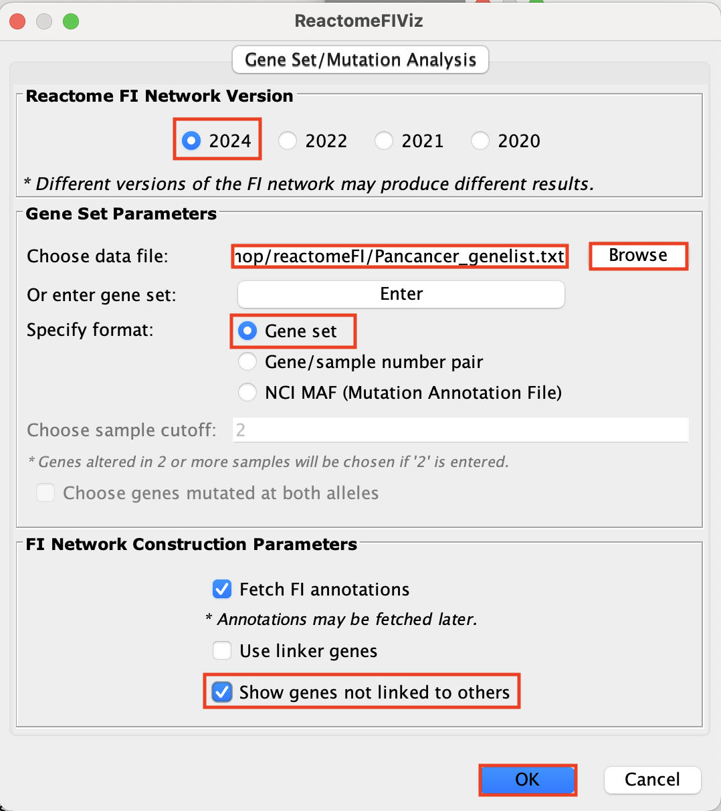
 </p>

  * Resulting network:
 <p align="center">
 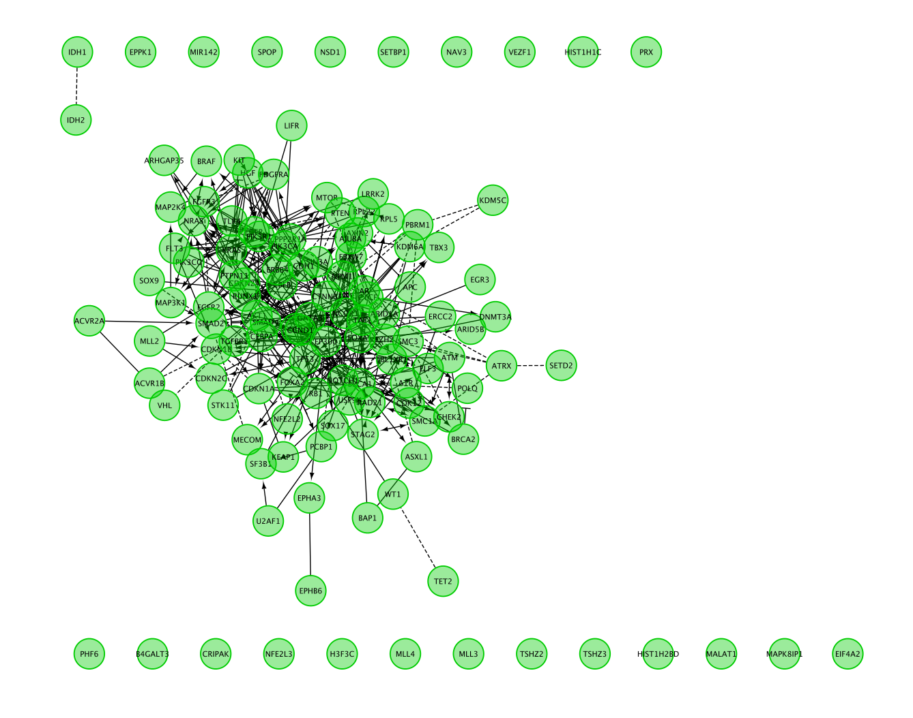
 </p>

### Question 1: Describe the size and composition of the network?

 <p align="center">
 
 </p>

The total number of genes in the network is 127. 

103 of these genes are connected to each other by functional interactions. You can get this information by selecting all genes that you see connected to each others.

The total number of edges or interactions is 473. 

The genes that are interacting together might work together in some sort of protein complex in the cells. 

The FI network was constructed by merging interactions extracted from human curated pathways from Reactome with interactions predicted using a machine learning approach. The non curated sources of information include:

  * protein-protein interactions, 
  * gene co-expression, 
  * protein domain interaction, 
  * Gene Ontology (GO) annotations
  * text-mined protein interactions.
  
  Solid edge between 2 nodes are interaction from curated pathways and dashed line are predicted interaction. (https://www.ncbi.nlm.nih.gov/pmc/articles/PMC2898064/).
 
 <p align="center">
 
 </p>


### Question 2: After clustering, how many modules are there?

ReactomeFI has a clustering option which groups genes that are more connected to each other into modules.

  * Cluster the network:
    i. Right-click on a blank space of the network
    i. select **ReactomeFI** --> **Cluster FI Network**.

 <p align="center">
 
 </p>
 
Nodes are now colored by modules.

  <p align="center">
 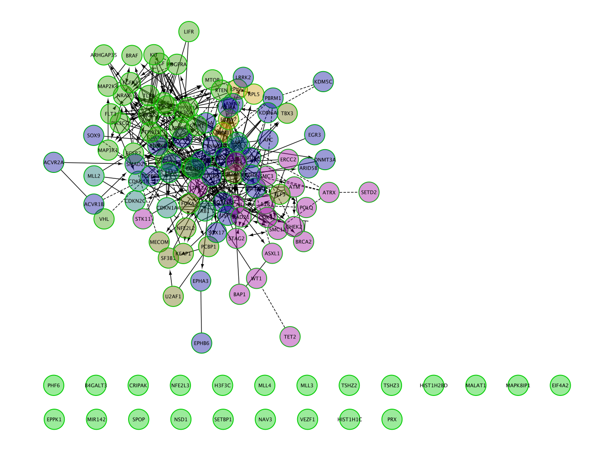
 </p>
 
  i. Look at the table **Network Module Browser** to find out the number of modules.It is located in the Table Panel located below the network. 
  i. Click on each module to highlight each genes in the module.

  <p align="center">
 
 </p>

  * The connected network has been divided into 6 modules. Module 0 contains the most genes (32).
  * The MCL clustering algorithm is used to cluster the network and it is based on the number of interaction (edges) between the nodes.


  *  **Redo the layout for clarity**: <br>
   * Go to Cytoscape menu bar, <br>
   * select **Layout** --> **yFiles Organic Layout**.<br>

  <p align="center">
 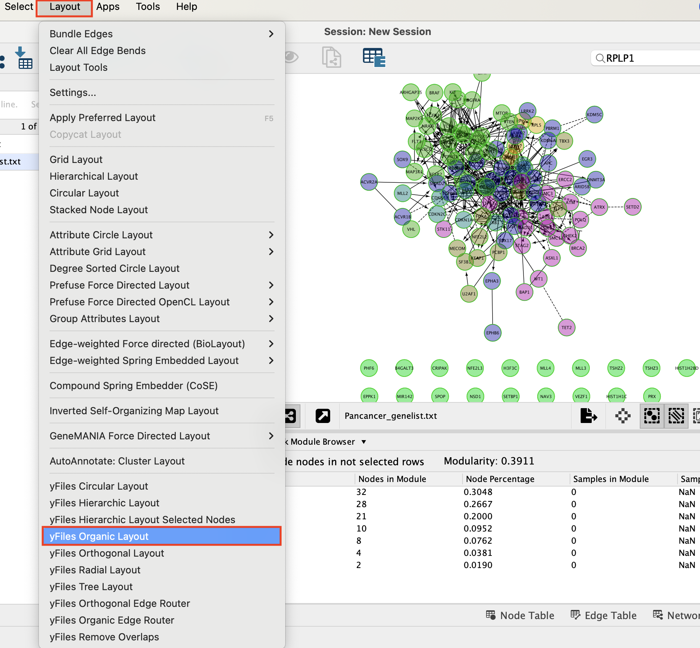
 </p>
 
  * Explore the resulting network.
 
  <p align="center">
 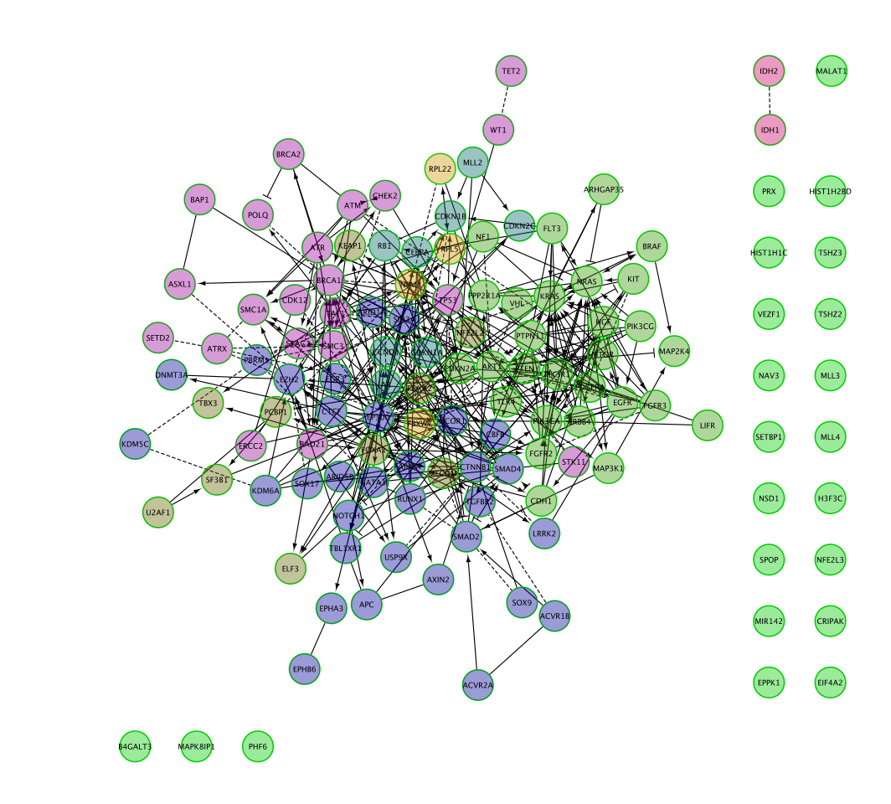
 </p>
 

 
```{block, type="rmd-bonus"}
Can you recreate the below image using one of the Cytoscape layout options?

 <p align="center">
 
 </p>
 
```
 
### Query information about the interaction between 2 genes:


  * Click on a solid line.

```{block, type="rmd-tip"}
You might need to zoom in on the network in order to select an individual edge. 
```

  i. Once the edge is highlighted in red, right click on it and select **ReactomeFI** --> **Query FI Source**. 

  <p align="center">
 
 </p>
 
 QueryFI Source will open a window with a list of the set of pathways that this interaction is found in.
 
   <p align="center">
 
 </p>
 
  * Click on a dashed line.  
    i. Once it is highlighted in red, 
    i. right click on it and select **ReactomeFI** --> **Query FI Source**.

   <p align="center">
 
 </p>
 
 The Query FI source will include a list of prediction sources as well as the overall score associated with this prediction.
 
```{block, type="rmd-tip"}
The FI score can be used to filter interactions and keep the interactions with the highest scores.
``` 
   <p align="center">
 
 </p>
 
  * To get an information about a gene. 
    i. Right-click on a gene 
    i. select **ReactomeFI** --> **Query Gene Card**
    i. This will open a web page containing all the information about the gene that is contained in the [gene cards database](https://www.genecards.org/).  
    i.  You can also select **Fetch FI** to get information about this gene in the ReactomeFI network
    i.  You can also select **Fetch Cancer Gene Index** to get information about this gene in the [Cancer gene index](https://wiki.nci.nih.gov/display/cageneindex/Creation+of+the+Cancer+Gene+Index)
    i.  You can also select **Query Cosmic** to get information about this gene in [Cosmic](https://cancer.sanger.ac.uk/cosmic)
 
   <p align="center">
 
 </p>
 
 
### Question 3: What are the most significant pathways in each module?

Pathway analysis can be performed on the whole set of genes from the network. It can also be performed individually on each module.

  * right-click, Analyze **Network** Functions --> Pathway Enrichment,  as opposed to, 
  * right-click, Analyze **Module** Functions --> Pathway Enrichment. 
  
  
  * Pathway enrichment of Modules
 
 
 ```{block, type="rmd-tip"}
 The original network has been divided into smaller modules of interacting proteins at the clustering step. Module pathway enrichment can be used to label each network modules.
 ```
  
    i. Right-click on a blank space of the network window
    i. Select **Reactome FI** --> **Analyze Module Functions** --> **Pathway enrichment**

<p align="center">
 
</p>

  i. A **Choose Module Size** window appears. 
  i. This parameter enables the user to select a minimum number of genes required in the module in order to include it in the pathway analysis. 
  i. Set the module size as 4.
  i. Once the pathway analysis has finished running, a **Pathways in Modules** table appears in the Table Panel located below the network. Pathways are ordered by best FDR values (closer to 0) for each module. 

  <p align="center">
 
 </p>
 
  i. Click on some of the pathways for each module. It will highlight the genes in our network that are part the selected pathway.
  * For example,
    i. Select *RAF/MAP kinase cascade (R)*.
      * It is one of the most significant pathways of module 1. 
      * There are 14 genes in this pathway that are also in module 1. 
      * Module 1 has a total of 28 genes. (The number of genes in each module can be found in the **Network Module Browser** tab)
      * The associated FDR value is 5.773e-15 which is very close to 0 and it means that this overlap of 14 genes isn't likely to be obtained by chance only.
 
 
**Try it out yourselves:**

- try *GO Biological Process* enrichment on modules: 
    i. **Reactome FI** --> **Analyze Module Functions** --> **GO Biological Process**
- try *pathway* or *GO Biological Process*  enrichment on the full network: 
    i. **Reactome FI** --> **Analyze Network Functions** --> **GO Biological Process**
    i. **Reactome FI** --> **Analyze Network Functions** --> **Pathway Enrichment**

<p align="center">
 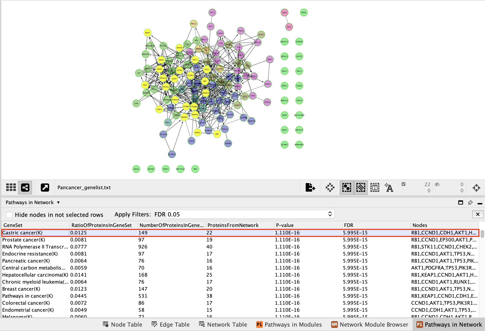
</p>


```{block, type="rmd-note"}
It is possible to undock tables for better clarity using the pin icon located at the top right corner of the Table Panel. 
```


### Set the size of the nodes proportional to the mutation frequencies in each cancer

Our gene list contains the genes with high frequency in several cancers. Table  [PanCancer_drivers_genelist_with_mutation_frequency.txt](./Module4/Reactome/data/PanCancer_drivers_genelist_with_mutation_frequency.txt) contains the mutation frequency of these genes in 10 cancer types. We are going to import this table into Cytoscape and set the size of the nodes using these column values.

- In the Cytoscape menu bar, 
  i. Select **Import** --> **Table from File...** 
  i. Browse for your file and click on open.
  i. In the window **Import Columns From Table**, make sure that **Import Data as:** is set to **Node Table Columns**.
  i. Click **OK**.
 
 Now that the table is imported, we can use the values in the table columns as 'Properties' to set a style or to filter the network. 
 
 We are going to set the size of the nodes.
 
  i. Look for the **Style** tab in the Control Panel located at the left of the Cytoscape window. Select.
  i. Click on the down arrow beside **Properties** and select **Size** on the list. 

  i. Select the **Size** field and expand it using the down arrow.
  i. In the  **Column** field, click on **--select value--** and choose **BLCA Freq**. 

 
  i. In the **Mapping Type**, click on **--select value--** and choose **Continuous Mapping**.
  i. Click on the diagram 

  i. Set the first pivot **Handle Position** to 30 and the second pivot **Handle Position** to 100.  To set the pivot click on the arrow you would like to set and then adjust the value specified next to Node Size.  Make sure to press enter once you have updated the value in order for it to be registered.
  
  i. Click OK 

 
   <p align="center">
 
 </p>
 
- Now the biggest nodes correspond to genes with highest mutation frequency in the BCLA cancer (Bladder cancer). 
 
   <p align="center">
 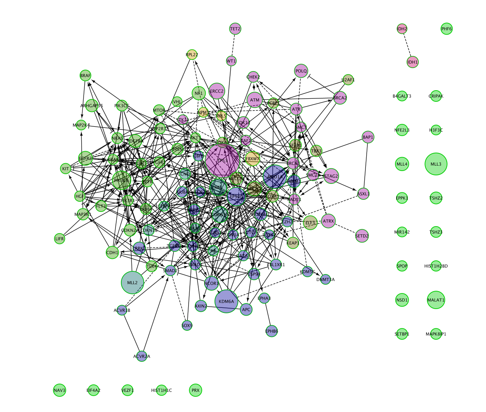
 </p>

```{block, type="rmd-tip"}
 You can change the column value to other cancer types and observe the differences.
```

### Play around with the styles: change transparency and colors

Here are the steps if you need to change the colors of the module to create a figure for publication.

- In Style, go to the ** Transparency** field and replace 100 by 200. Try different numbers.
   <p align="center">
 
 </p>

- If some of the colors are too dark, it is possible to modify the cluster colour by selecting the field **Fill Color** in properties in the Styles tab:
  i. double-click on a color. 

  i. choose a new one. (This will need to be done for each colour you want to change.) 

- The resulting network

   <p align="center"> 
 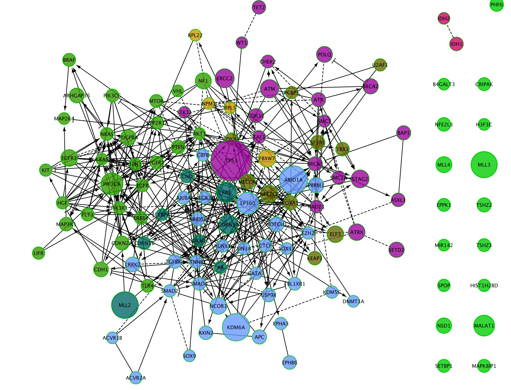
 </p>

### Create a pie chart

As we have the mutation frequencies for several cancer types, it would be useful to be able to compare all cancer frequencies at the same time in the same network. It is possible to do this by plotting a pie chart for each gene (node) with each pie slice representing the mutation frequency for each cancer. 

  * Here are the steps to do it:
  i. In Style, click on the down arrow close to **Properties** and select **Paint**, -->  **Custom Paint1** --> **Image/Chart 1**. 
  i. In Style, locate the new Image/Chart 1 field and click on the fist box. 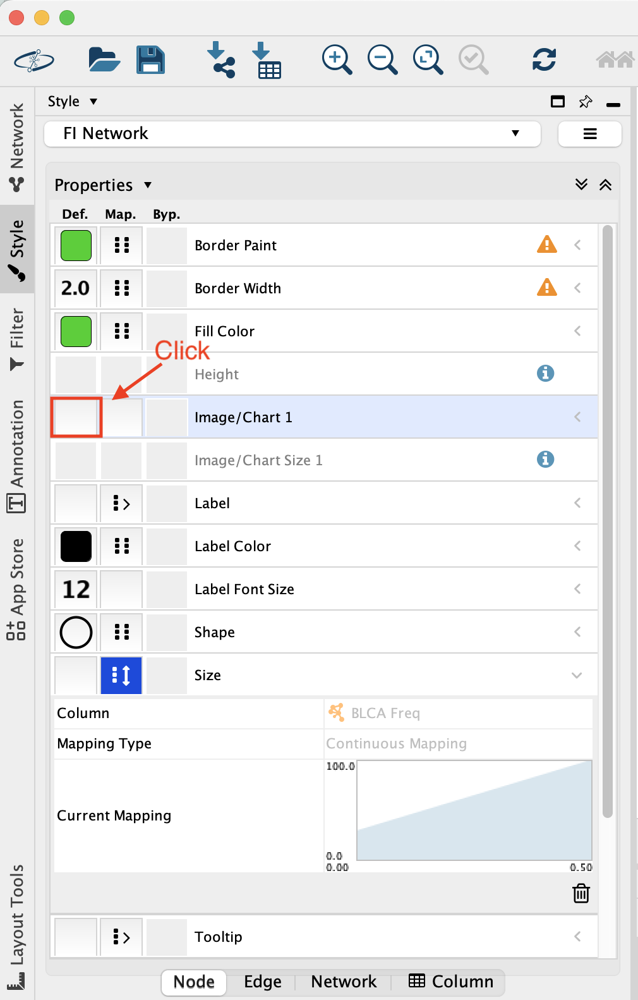
  i. A **Graphics** windows pops up. Click on the "Charts" tab.
  i. In **Chart**, select the piechart icon.
  i. In **Available Columns**, select the columns that you want to include in your pie chart (here 8 cancer types) and click on the arrow to move them over to the *Selected Columns*. 
 
  i. They are now placed in the **Selected Columns** window. Click on **Apply**.


 ```{block, type="rmd-tip"}
 Expanding **Customize** will open a tab that shows the color legend for the pie chart. All colours of the pie chart are customizable. 
 ```
 
  <p align="center">
 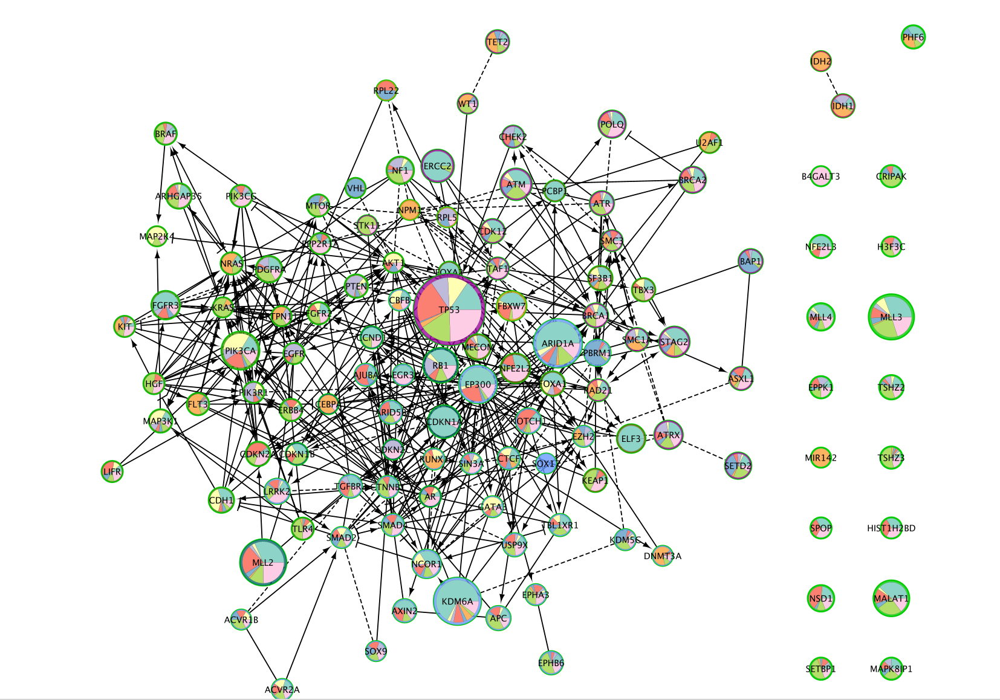
 </p>
 
```{block, type="rmd-bonus"}

Notice in the screenshot below we changed node shape to be square so that we can still see the module the gene belongs to as well as the cancer frequencies in the pie chart.  Can you replicate this?

``` 

  <p align="center">
 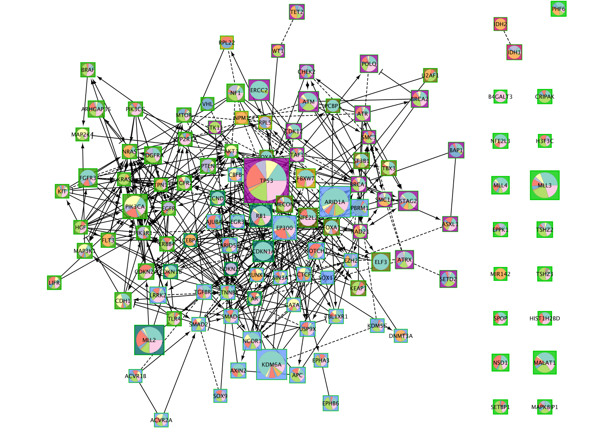
 </p>
 

 
### Create a subnetwork
 
 - Now that the network is clustered in modules and related pathways, we want to create a subnetwork to highlight connections that we found interesting. For this exercise, we want to create a network of the genes involved in the **Gastric cancer (K)** pathway. 

  * Here are the steps to follow:
    i. In the table panel, locate the **Pathways in Network** table.
    
```{block, type="rmd-tip"}
In order to generate the pathway network table, right-click on a blank space, **Reactome FI** --> **Analyze Network Functions** --> **Pathway Enrichment**.

   (hint: this was one of the steps that you had to try yourselves, )
  
```

  i. Select **Gastric Cancer (K)** from the list of pathways.It will highlight the genes in this pathway in yellow.

```{block, type="rmd-tip"}
It should be the top enriched pathway.  If you can't see it trying changing the sorting of the table by clicking on the column headers -- specifically the FDR column
```

  i. Above the network find and click on the **New Network from Selection** icon and select **From Selected Nodes, All Edges**. 
 
   <p align="center">
 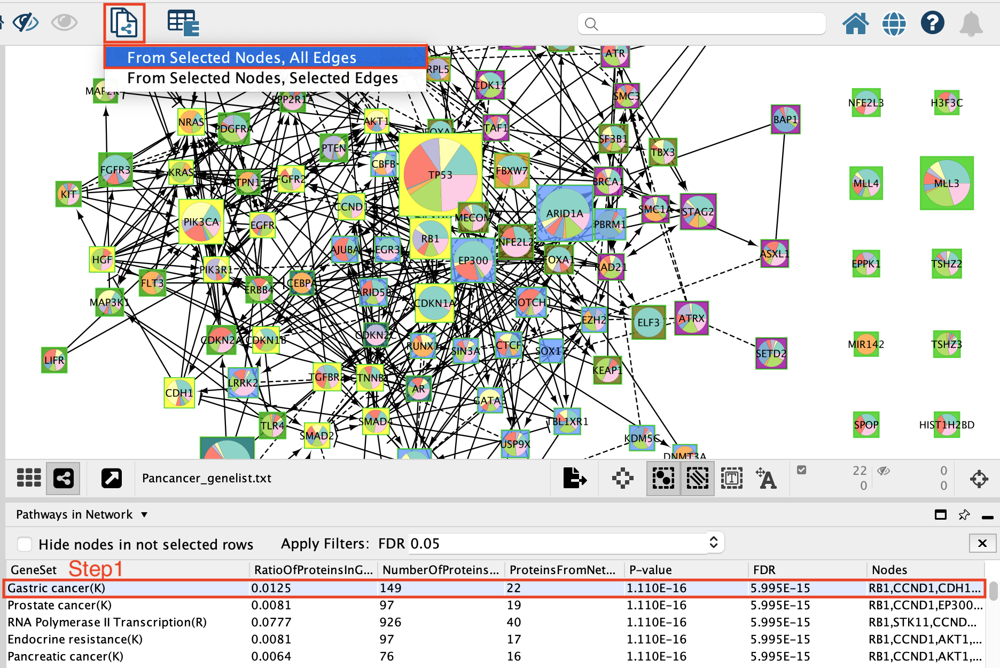
 </p>
 
A new network containing only the selected nodes is now created.
 
  <p align="center">
 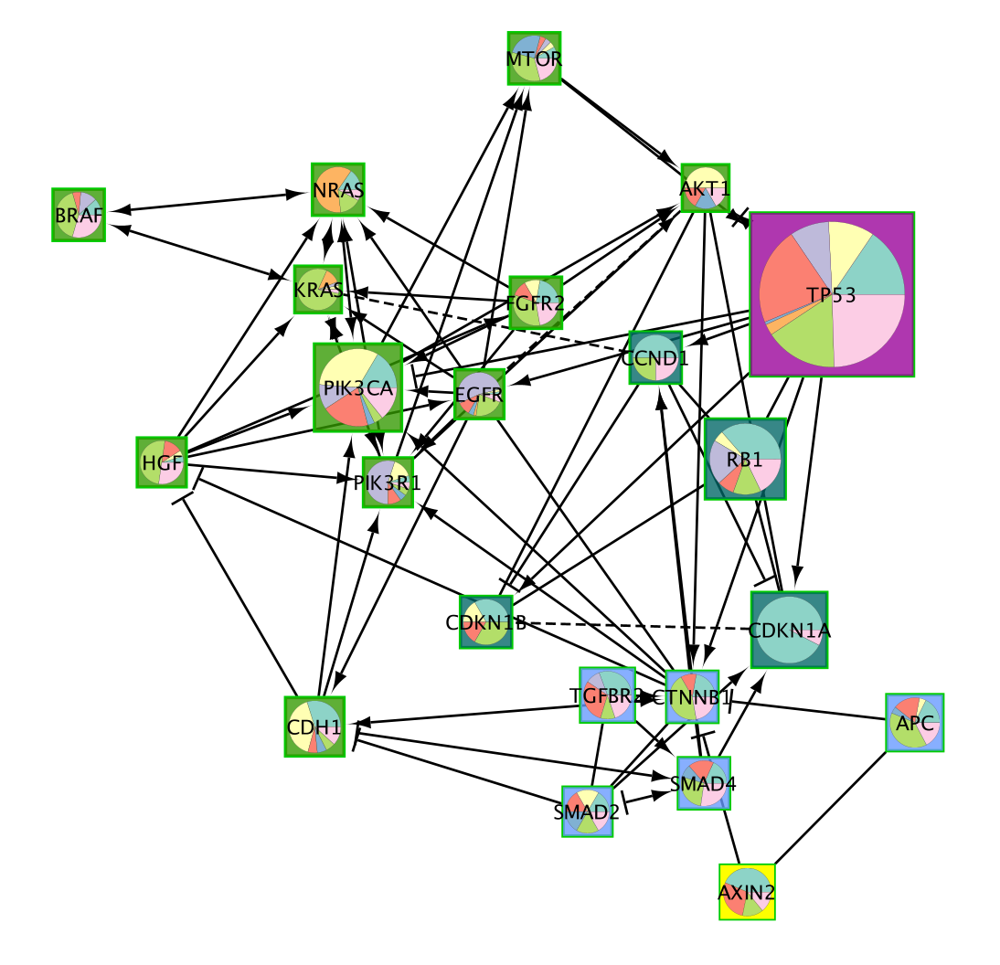
 </p>
 

 **Important.Copy Style before going to the next step.**
 It is good practice to copy the style of a figure as it might be reset by some Cytoscape functions.

 
  * Go to Style
  * Click on the 3 bars
  * Select 'Create New Style' ...
   <p align="center">
 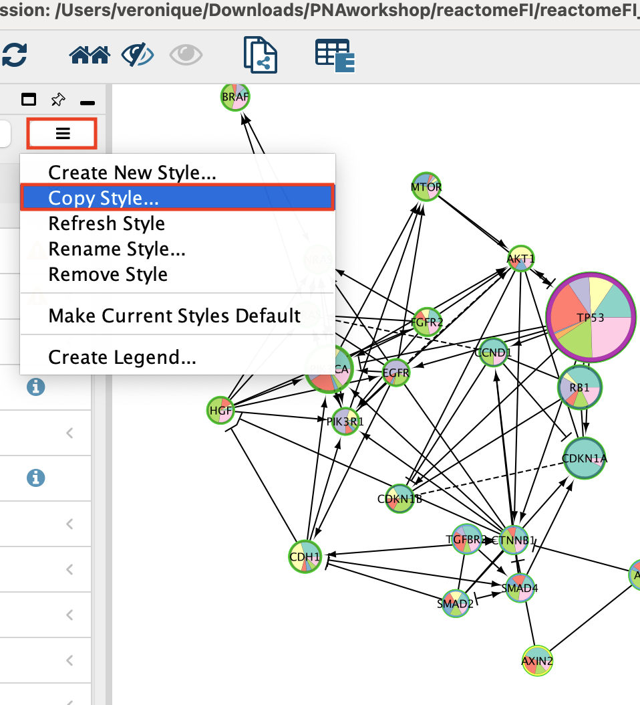
 </p>
 
  * Name your style
  * Click 'OK'.
   <p align="center">
 
 </p>
 

```{block, type="rmd-tip"}
If you loose your style, go back to "Style" , click on the down arrow and click on your style label.

 <p align="center">
 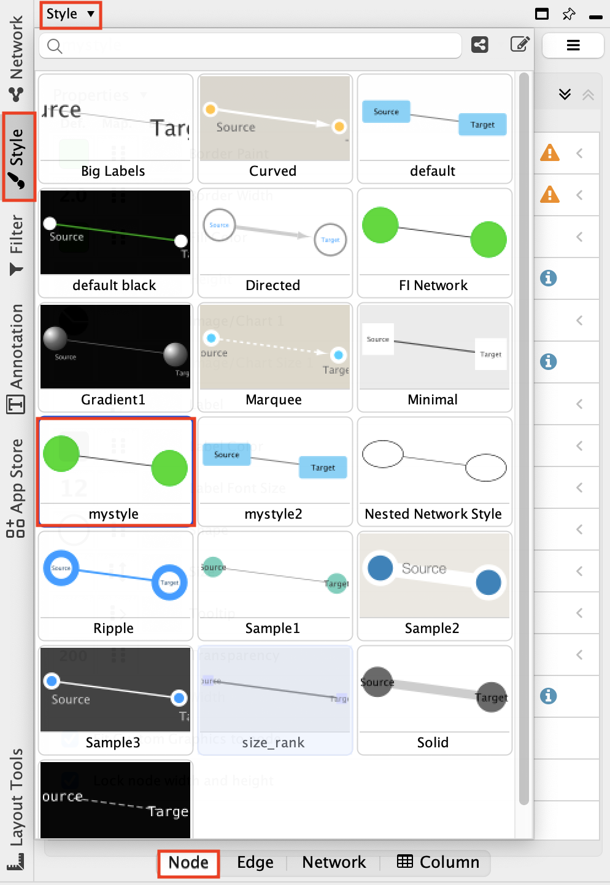
 </p>
 

```
### Fetch Cancer drugs on the created subnetwork

  * Working with the newly created gastric cancer enriched network.
  * Right-click on a blank space and select **Reactome FI**, **Overlay Drugs**, **Fetch Cancer Drugs**. 
 
  <p align="center">
 
 </p>
 
  * The numerous drugs known to target the genes in this subnetwork are now added  as green diamond shaped nodes.

  <p align="center">
 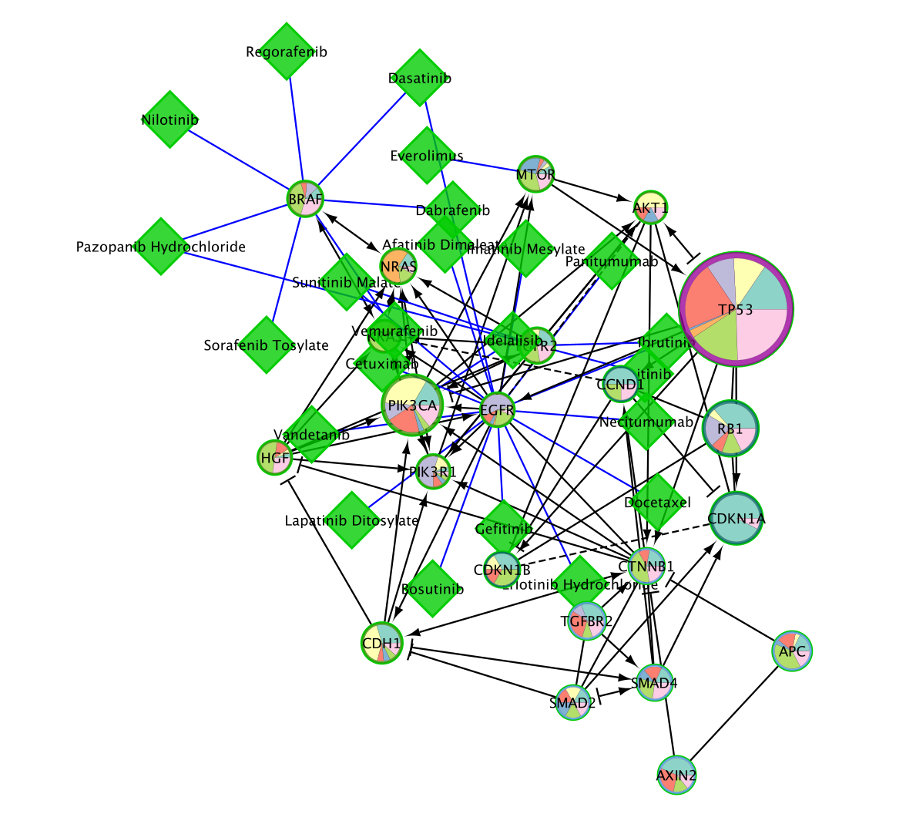
 </p>
 
 ```{block, type="rmd-tip"}
 If you lost your pie chart coloring at that step, go to Style and select the style that you have saved before fetching the drugs.
 ```

  * Here is the network after redoing the layout for clarity (Layout -->  YFiles Organic Layout)
  
  <p align="center">
 
 </p>

### Save the network as an image for publication

As we have finalized our network analysis, we would like to export the network as an image.

- In the Cytoscape menu, select **File**, --> **Export**,--> **Network to Image**. 

  <p align="center">
 
 </p>
 
- Browse to the directory where you want to save the image, give it a name and click on **OK**.

   <p align="center">
 
 </p>


```{block, type="rmd-tip"}
In addition to export an image of your network, save your session regularly.
```


## Exercise 2a: Explore Reactome Pathways
**Objectives:**
The objective of this exercise is to navigate the Reactome pathways using the Cytoscape ReactomeFI app. 


**Steps:**

- Open up Cytoscape. 

- Go to Apps >Reactome FI>Reactome Pathways. Once the app is opened, the list of pathways contained in the Reactome database are listed on the left window. 
 <p align="center">
 
 </p>
 

- Pathways are available for Homo sapiens and Mus Musculus. Make sure that **Homo sapiens** is selected.

<p align="center">
 
 </p>
 
The pathways are organized into main categories. Clicking on the left arrow will expand that category and display all its sub-categories/pathways. 

- Find and expand the **Transport of small molecules** event branch. 
- In the expanded menu,find and expand **O2/CO2 exchange in erythrocytes**. 
- Select **Erythrocyte take up carbon dioxide and release oxygen**.  
- Right-click on the highlighted pathway and select **Show Diagram**.


<p align="center">
 
 </p>
 
- Explore the pathway diagram. 
  i. Zoom in and out. 
  i. Move nodes around. 
  i. Change color of a branch 
    * select a line, 
    * right click, 
    * select highlight,
    * choose color.

<p align="center">
 
 </p>


- Explore individual molecules and reactions.
  i. Right click on a line or a compound.
  i. Select *View Reactome Source* in right click context menu. 
  i. This displays information about the biochemical reaction or molecule selected including the input and output molecules and associated reference papers.

<p align="center">
 
 </p>


- Save the reactome pathway diagram as pdf: 
  i. Right-click on the diagram and select **Export Diagram**


<p align="center">
 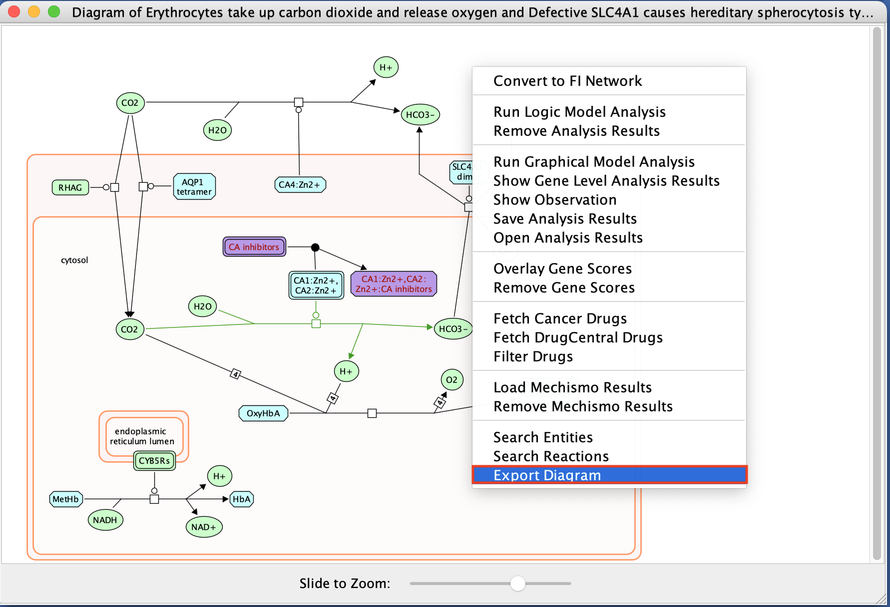
 </p>

```{block, type="rmd-note"}
What is the difference between a pathway diagram and network?
<p align="center">
 
 </p>
 
 *Pathway diagram*
 
   * biochemical view of pathways with cause and effect of each interaction captured.
   * shows the flow and structure of pathway.
   * represents different events and states of the same molecules.
   * includes information on genes, proteins, metabolic pathways, molcular interactions, biochemical reactions.
   
 *Network*
 
   * represents relationships between entities.  Entities can be genes, RNA, proteins or anything defined by the creator.  
   * enables visualization of multiple data types together. 
   * No context or dynamics.  Simply shows the connectivity between nodes.
   
```


- Transform pathway diagram into a network and back to a diagram. 
  i. Right-click on a blank space in the diagram
  i. select **Convert to FI Network**. 
  
```{block, type="rmd-tip"}  
  Transforming the pathway diagram into a network has the advantage that we can now use all the features of Cytoscape.
  
  Notice when viewing the pathway diagram you have to use the zoom bar at the bottom of the pathway diagram as opposed to the zoom buttons in the top menu bar in Cytoscape.  Also. when using the pathway diagram you can not use any of the builtin layouts that come with Cytoscape.  Because Cytoscape is a network analysis software it has been optimized for networks.  In the ReactomeFI app they recreate the pathway diagram by manually drawing an interactive picture of it.  You can still move the nodes and edges manually but employing any of the built in layouts and features would potentially ruin the picture.    
```

Step1 - Convert diagram to network
<p align="center">
 
 </p>

```{block, type="rmd-tip"} 
You might have to redo the layout.
```
 

Step2 - explore network representation
<p align="center">
 
 </p>
 
```{block, type="rmd-note"}
Note that only genes (and not the metabolites) are included in this network. 

The Reactome pathway diagram demonstrates how the oxygenated form of hemoglobin A [HBA1](https://www.uniprot.org/uniprotkb/P69905/entry) undergoes two chemical reactions in the presence of CO2. These reactions cause HBA to lose its affinity for oxygen. 

Additionally,  this pathway diagram demonstrates how, in erythrocytes, CYB5Rs participates in the reduction of methemoglobin (MetHb) to hemoglobin A [HBA1](https://www.uniprot.org/uniprotkb/P69905/entry). The participating genes are then [HBA](https://www.uniprot.org/uniprotkb/P69905/entry), [HBB](https://www.uniprot.org/uniprotkb/P68871/entry) and Cyb5R genes and will be displayed in the network.
```
 
- Convert the network back to a pathway diagram. 
  i. Right-click on a blank space of the network.
  i. select **ReactomeFI** 
  i. then **Convert to Diagram**. 

Step1
<p align="center">
 
 </p>
 
Step2
 <p align="center">
 
 </p>


- Open the diagram from the Reactome website:
  i. Locate the menu of pathways in the left hand window
  i. right click on **Erythrocytes take up carbon dioxide and release oxygen**. 
  i. Select **View in Reactome**. 
  i. This will open a new page in your web browser with detailing information about the pathway on the Reactome website. 

Step1 - View in Reactome
<p align="center">
 
 </p>
 
Step2 - redirect to Reactome in web browser
 <p align="center">
 
 </p>


Some useful information is displayed in the web view including:<br>
  * a summary of the pathway and  <br>
  * reference papers used to build the diagram.
  
The pathway can be exported as an image in a range of format choices including svg, png, pptx or pdf or as a recognized exchange format including BioPAX, SBML or SBGN.  

Furthermore, it is linked to the reactome.org pathway browser that can be opened in a new window. (See link below the pathway diagram, *"Click other image above or here to open this pathway in the Pathway Browser"*) The Cytoscape ReactomeFI app is a replica of this web-based pathway browser.

Step1 - click on link
<p align="center">
 
 </p>
 
Step2 - Pathway browser in web browser.
 <p align="center">
 
 </p>


## Exercise 2b: Pathway enrichment analysis using a simple gene list

**Objectives:**
The objective of this exercise is to perform a pathway-based analysis using a sample gene list as input.


**Data:**

For this lab, we will use a set of genes found to have frequent somatic single nucleotide variations (SNVs) identified in TCGA exome sequencing data of 3,200 tumors from 12 different cancer types. The MuSiC cancer driver mutation detection software was used to find 127 cancer driver genes that displayed higher than expected mutation frequencies in cancer samples (Pan-cancer tab from Supplementary Table 4 in [Kandoth C. et al.](https://www.nature.com/articles/nature12634).


 * Gene list: [Pancancer_genelist.txt](./Module2/gprofiler/data/Pancancer_genelist.txt)


**Steps:** 

- In Cytoscape, locate the menu bar, select File -> Close .  (This will clear the previous session we created in 2A in order to start with a clean slate.)

- Select Apps -> Reactome FI -> Reactome Pathways. 

- Locate the list of Reactome pathways in the left hand panel in the Reactome tab in the Control Panel. 

- Scroll down and find the **Signal Transduction** pathway in the event hierarchy and select it. 

- Right-click on the highlighted **Signal Transduction** name and select **Analyze Pathway Enrichment** .

 <p align="center">
 
 </p>

- ***Browse*** and select the **Pancancer_genelist.txt** file ,click **OK**. 

 <p align="center">
 
 </p>

### Question 1: What are the most significant biological pathways based on the FDR?

- **Hint**: Take a look at the list of significant pathways in the **Reactome Pathway Enrichment**  tab of Table Panel.

<p align="center">
 
 </p>

Pathway enrichment results are displayed as a table labeled as "Reactome Pathway Enrichment" in the "Table Panel" at the bottom of the main Cytoscape window.

### Answer to Question 1

The pathway with the most significant enrichment FDR is called *Generic Transcription Pathway*. This pathway contains 1250 genes of which 42 genes are also found in the Pan_Cancer gene list that we used as intput. 

The statistical enrichment test pvalue associated with this pathway is close to 0 (7.43 E-11) and it means that this size of the overlap (42 genes) is not likely to be obtained by chance alone. 

Reactome Pathway enrichment table contains - 

  * ReactomePathway - pathway name
  * RatioOfProteinInPathway - this is not the ratio of our query to the size of the pathway.  This is the ratio of proteins found in this pathway as compared to the total number of entities.   
  * NumberOfProteinPathway -  total number of genes in the pathway
  * ProteinFromGeneSet - number of genes from our input gene list that overlaps with this pathway
  * P-value 
  * FDR
  * HitGenes - genes from out input gene list that overlap with this pathway

The pathways that are the most enriched have a low FDR value.  

```{block, type="rmd-tip"}
You can click on any of the column labels in the Reactome Pathway Enrichment table to sort the table by that column.
```

- In the **Reactome Pathway Enrichment** table, 
  i. select **Transcriptional regulation by RUNX3**.  
  i. Right-click on the pathway 
  i. select **View in Diagram**. 

```{block, type="rmd-tip"}
To find this pathway more easily:

  * click on the column title "ReactionPathway" to sort the table alphabetically by pathway name
  * scroll down to the pathway **Transcriptional regulation by RUNX3**
```

<p align="center">
 
 </p>


- Explore the pathway diagram
  i. Zoom in and out to observe the diagram. 
  i. Purple-coloured nodes reflect genes that are present in our input gene list (Pancancer_genelist.txt). 
  i. Right-click on highlighted nodes to invoke additional features.

<p align="center">
 
 </p>


```{block, type="rmd-tip"}
If the Reactome Pathway Enrichment Table is not visible anymore in the Table Panel. 

  * Go to Cytoscape menu bar, **View**. 
  * Uncheck and chek **Show Table Panel**.

If this doesn't work it is possible the table panel is just too small to see.  You can try expanding it so you can see it or pop it out of the window so that it is its own window.  (For smaller laptop screens that might be easiest thing to do)

<p align="center">
 
 </p>
  
```


- Transform the diagram into a network:
  i. Right-click on a blank space of the diagram
  i. select **Convert to FI Network**. 
  
  The advantage of a network over the pathway diagram is that we can now use the Cytoscape analysis and visual features. Nodes with purple-coloured borders reflect genes that are present in our input gene list.

<p align="center">
 
 </p>

```{block, type="rmd-tip"}
Redo the layout if a clearer view is needed. 

  * Go to the Cytoscape menu bar
  * select **Layout**, -->  **yFiles Organic Layout**.
```


- Transform network back to a diagram:
  i. Right-click on a blank space 
  i. select **Reactome FI** --> **Convert to Diagram**. 

<p align="center">
 
 </p>


- Open Reactome Reacfoam:
  i. The Reacfoam view provides a holistic view of all (excluding disease) human pathways in the Reactome database. 
  i. Go to the menu of pathways in the Control Panel (left window) and 
  i. right-click on a blank space. 
  i. Select **Open Reactome Reacfoam**.   
  
<p align="center">
 
 </p>

Reactome Reacfoam will open in the default web browser. 

<p align="center">
 
 </p>


```{block, type="rmd-note"}
The color gradient indicates which categories of pathways have a stronger enrichment in the gene list that we have provided with lighter yellow having more significant FDR values.
```

## Exercise 2c: Pathway-based analysis using a rank gene list (GSEA)


**Objectives:**

ReactomeFIViz provides support to perform GSEA analysis for Reactome pathways using a rank file. 

**Data:**

To perform the GSEA pathway enrichment analysis, you need to provide a tab-delimited text file containing two columns: the first for gene symbols (human only) and the second for gene scores.

The data used in this exercise is gene expression (transcriptomics) obtained from high-throughput RNA sequencing of Ovarian Serous Cystadenocarcinoma samples. This cohort was previously stratified into four distinct expression subtypes [PMID:21720365](http://www.ncbi.nlm.nih.gov/pubmed/21720365) and a subset of the immunoreactive and mesenchymal subtypes are compared to demonstrate the GSEA workflow.

**Data processing:**

Gene expression from the TCGA Ovarian serous cystadenocarcinoma RNASeq V2 cohort was downloaded on 2015-05-22 from [cBioPortal for Cancer Genomics](http://www.cbioportal.org/data_sets.jsp). Differential expression for all genes between the mesenchymal and immunoreactive groups was estimated using [edgeR](http://www.ncbi.nlm.nih.gov/pubmed/19910308).The R code used to generate the data and the rank file used in GSEA is included at the bottom of the document in the [**Additional information**](#additional_information) section. 


```{block, type="rmd-datadownload"}
Right click on link below and select "Save Link As...".

Place it in the corresponding module directory of your CBW work directory.
```

  * [MesenchymalvsImmunoreactive_edger_ranks.rnk](./Module2/gsea/data//MesenchymalvsImmunoreactive_edger_ranks.rnk)

```{block, type="rmd-note"}
This is the same data used in Module2 GSEA lab.

The first row is reserved for the column headers, and will not be imported for analysis. 
```


**Steps:** 

- Start with a fresh session: 
  i. Go to the Cytocape menu bar and 
  i. select **File**, --> **Close Session**. 

- Open ReactomeFI app:
  i. Go to the menu bar Select **Apps**,--> **Reactome FI**,--> **Reactome Pathways**.The Reactome tab in the Control Panel on the left opens and the list of pathways is visible.

- Select **Autophagy** and right-click on a blank space. The option menu opens. Select **Perform GSEA Analysis**. 

```{block, type="rmd-tip"}
Why do I have to select **Autophagy**?   Am I doing the GSEA Analysis just on this pathway?

This is just a little quirk in the ReactomeFI app.  In order to see the context menu with all your options you need to have a pathway selected.  

```

<p align="center">
 
 </p>

A **Reactome GSEA Analysis window** pops up.

- Browse and select [MesenchymalvsImmunoreactive_edger_ranks.rnk](./Module2/gsea/data//MesenchymalvsImmunoreactive_edger_ranks.rnk).

<p align="center">
 
 </p>

```{block, type="rmd-note"}
The number of permutations is 100 by default. To achieve more precision, we set the permutations to 2000. It will take approximately 10 minutes to run. 

For faster results during this practical lab, you may run it with 100 permutations. Keep in mind that this lower threshold will affect the NES, P-value and FDR values in your results.
```

<p align="center">
 
 </p>

- Once GSEA has finished, a **Reactome GSEA Analysis** tab appears in the Table Panel.
This table displays the list of pathways in increasing order from the lowest FDR values. 
  i. Click on the **Normalized enrichment score** column title to order the pathways from Up (positive NES) to Down (negative NES). 

The pathways that are up and with FDR less than 0.05 are enriched in genes up regulated in the mesenchymal type of ovarian cancer.

<p align="center">
 
 </p>
 
 The pathways that are down (negative NES) with FDR values less than 0.05 are enriched in genes down regulated in the mesenchymal type of ovarian cancer. Therefore, these genes are specific to the immunoreactive type.

 <p align="center">
 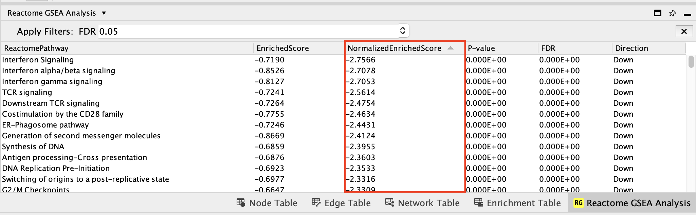
 </p>

Interferon Signaling is the pathway that has the strongest enrichment (lowest NES value) in genes down-regulated in the mesenchymal type (or alternately, upregulated in the immunoreactive type). 

- Let's visualize this in a pathway diagram to get details about the pathway.

  i.Locate and select **Interferon gamma signaling** in the **Reactome GSEA Analysis** table.
  i. Right-click on the highlighted name 
  i. select **View in Diagram** from the popup menu.

 <p align="center">
 
 </p>
 
  <p align="center">
 
 </p>

  i. Explore the diagram by zooming in and out. 
  i. Look at the list of genes in the **Gene scores and ranks** table (click on some genes).


 <p align="center">
 
 </p>
 
- Fetch cancer drug: 
  i. right-click anywhere on diagram
  i. select **Fetch cancer drug**.

 <p align="center">
 
 </p>


## Automation ( for advanced users)

To facilitate adoption of this app in bioinformatics software pipeline and workflow development, a CyREST API for ReactomeFIViz was developed. CyREST is the technology that powers Cytoscape Automation, which enables you to create reproducible workflows executed entirely within Cytoscape or by external tools (e.g., Jupyter, R, GenomeSpace, etc) [https://apps.cytoscape.org/apps/cyrest]. 
You can find below a case to demonstrate the use of this API in a Jupiter Notebook (https://jupyter.org/).

- [Cytoscape ReactomeFI Jupiter Notebook](./Module4/Reactome/data/reactomeFInotebook.ipynb)
- Reference paper: https://f1000research.com/articles/7-531

## Reference guide /bonus exercises:
Here is a link to the ReactomeFIVIz complete guide: https://reactome.org/tools/reactome-fiviz
You can find more tips and bonus exercises.


<!--chapter:end:4.1-Module4_ReactomeFI_lab.Rmd-->

# Module 5: Gene Function Prediction  

  *<font color="#827e9c">Veronique Voisin</font>*
  
  [Lecture](./lectures/Pathways2024_Module5genemania.pdf)  
  
  [Recorded video 1](https://www.youtube.com/watch?v=2KrUq9ad2xc)
  
  [Lab practical - Cytoscape](#genemania_cytoscape)   
  
  [Lab practical - Web](#genemania_web)  

<!--chapter:end:5.0-Module5_Gene_Function_Prediction.Rmd-->

# Module 5 Lab: GeneMANIA (Cytoscape version) {#genemania_cytoscape}

**This work is licensed under a [Creative Commons Attribution-ShareAlike 3.0 Unported License](http://creativecommons.org/licenses/by-sa/3.0/deed.en_US). This means that you are able to copy, share and modify the work, as long as the result is distributed under the same license.**

*<font color="#827e9c">By Quaid Morris and Veronique Voisin </font>*

## Goal of this practical lab 

Create GeneMANIA networks starting from a single gene to predict its function or starting from a gene list. Explore and understand the main output features of GeneMANIA such as the network composition or the enriched functions. This practical consists of 3 exercises. 

Before starting the exercises,download the files:

```{block, type="rmd-datadownload"}
Right click on link below and select "Save Link As...".

Place it in the corresponding module directory of your CBW work directory.
```

*	[30_prostate_cancer_genes.txt](./Module6/genemania/data/30_prostate_cancer_genes.txt)

*	[Mixed_gene_list.txt](./Module6/genemania/data/mixed_gene_list.txt)

*	[CYP11B_pearson_correlation_prostate.txt](./Module6/genemania/data/CYB11B_pearson_correlation_prostate.txt)

```{block, type="rmd-note"}
Network layouts are flexible and can be rearranged. What you see when you perform these exercises may not be identical to what you see in the tutorial, or what you have seen other times that you have performed the exercises. Exact layouts and predictions can also be affected by updates to the networks database that GeneMANIA uses. However it is expected that the network weights and predicted genes will be similar to those shown here. 
```

## EXERCISE 1: Searching GeneMANIA with single gene

Imagine that you are interested in exploring the function of the human GRN gene: GRN returned as the strongest hit from your omics experiment but not much information about this gene is available in functional databases. Use GeneMANIA to identify its predicted function as well as potential interaction partners. 

**Skills**:

  * GeneMANIA Single Gene search
  * Navigating Search Results
  * Exploring  available Genes features
  * Rerun a new analysis using a single gene or multiple genes queried from the network.

**Steps**<br>

  1. Open Cytoscape.

  1. In the network tab Locate the Network search bar located at the top of the *Control Panel*.  Make sure that the database selected is GeneMANIA<br>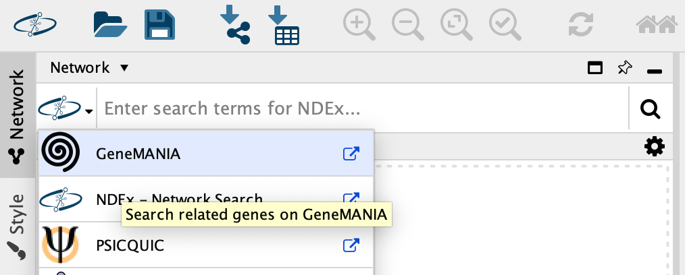

  1. In the search window, ensure that the model organism is set to *Homo sapiens* .  

  1. Enter the following gene in the GeneMANIA search bar: GRN	

  1.  Click on the search icon  and wait for the results.	<br>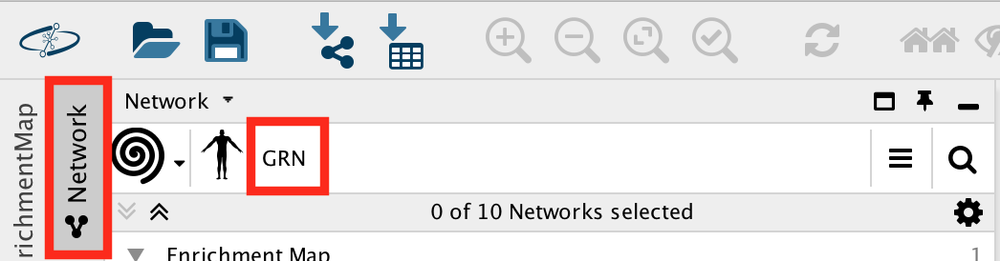

  1. When your search results load, examine the network. Genes part of the query set are indicated in black, related genes added by GeneMANIA are represented in gray, and colored links represent the interactions that connect the nodes (genes). <br>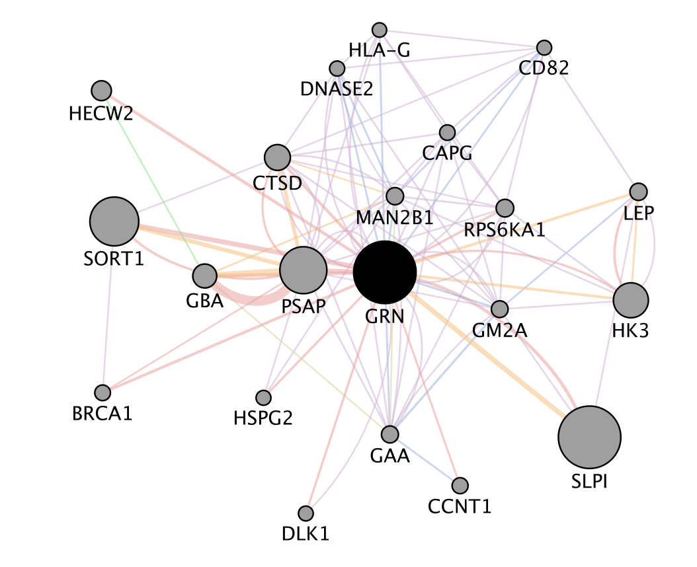

```{block, type="rmd-tip"}
zoom in and zoom out using trackpad or mouse scrolling up and down.
```

  <ol start=7 type="1"><li>Locate the *Functions* summary tab in Results Panel. <br></ol>
  
  **Questions**:<br>
  * What are the functions significantly associated with this network? <br> 
  * GRN is the central node of this network: which function would you predict for GRN? <br>
  * How well did GeneMANIA perform? (hints: use GeneCards (<http://www.genecards.org/>) , PubMed (<http://www.ncbi.nlm.nih.gov/pubmed/>))?	


### ANSWERS

**Question** What are the functions significantly associated with this network? <br>
**Answer** the list of the functions associated with the network are listed in the above screenshot. The top 2 pathways are "vacuolar lumen" and "primary lysosome" and are significant under a FDR threshold less than 0.005. 

**Question** GRN is the central node of this network: which function would you predict for GRN? 
**Answer** : a function related to lysosome and vacuole

**Question** How well did GeneMANIA perform (hints: use GeneCards (http://www.genecards.org/) , PubMed (http://www.ncbi.nlm.nih.gov/pubmed/))?<br>
**Answer** 
The top functions predicted by GeneMANIA for GRN were related to lysosome and vacuole.  A pubmed search could confirm these results: “We experimentally verified that granulin precursor (GRN) gene, whose mutations cause frontotemporal lobar degeneration, is involved in lysosome function.” (Transcriptional gene network inference from a massive dataset elucidates transcriptome organization and gene function. Belcastro et al. Nucleic Acids Res. 2011 Nov 1;39(20):8677-88. 2011. PMID:21785136)


<ol start=8 type="1"><li>Locate the genes with the strongest associations with GRN.</ol> 
```{block, type="rmd-tip"}
These genes are the largest nodes in the network. 	

```
**Answer is SLP1 and SORT1**

<ol start=9 type="1"><li>Re-run an analysis by adding SORT1, SLP1 to the search.   Type 'SORT1' and 'SLP1' in the search box that already contains 'GRN' (one gene per line).  Click on the search button.</ol>  <br>
  
**Question**:Which functions are associated with this new network?


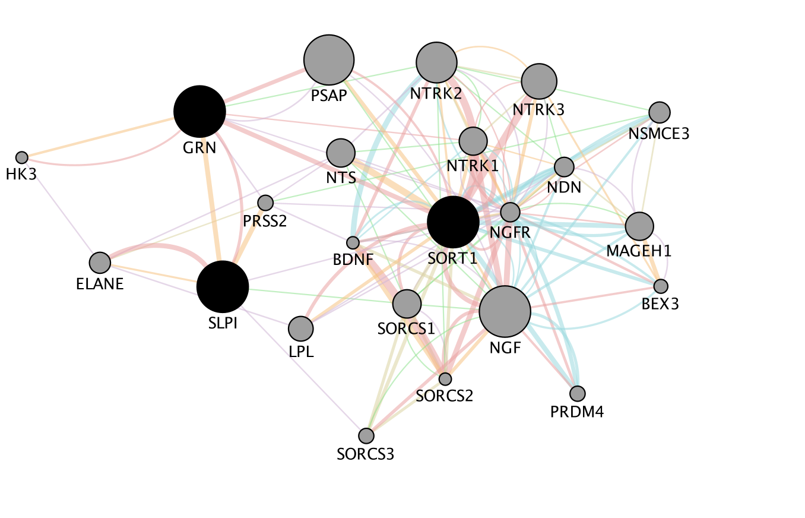

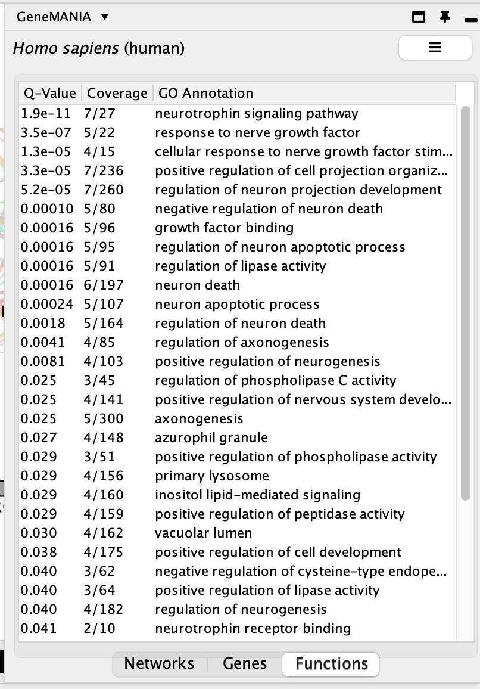


**Biological interpretation of the results:**

**A paper describing the interaction between GRN and SORT1 and demonstrates how finding related genes could be relevant for elaborating therapy:**
 
[Targeted manipulation of the sortilin–progranulin axis rescues progranulin haploinsufficiency. Lee et al. Hum Mol Genet. 2014 March 15; 23(6): 1467–1478. PMCID:PMC3929086](https://www.ncbi.nlm.nih.gov/pmc/articles/PMC3929086/)<br>
“Progranulin (GRN) mutations causing haploinsufficiency are a major cause of frontotemporal lobar degeneration (FTLD-TDP). Recent discoveries demonstrating sortilin (SORT1) is a neuronal receptor for PGRN endocytosis and a determinant of plasma PGRN levels portend the development of enhancers targeting the SORT1–PGRN axis. We demonstrate the preclinical efficacy of several approaches through which impairing PGRN's interaction with SORT1 restores extracellular PGRN levels. “

 

<ol start=10 type="1"><li>Save the  network as an image by clicking on **File**, **Export**, **Network to Image...** and setting the **Export File Format** to "PDF(\*.pdf)".<br>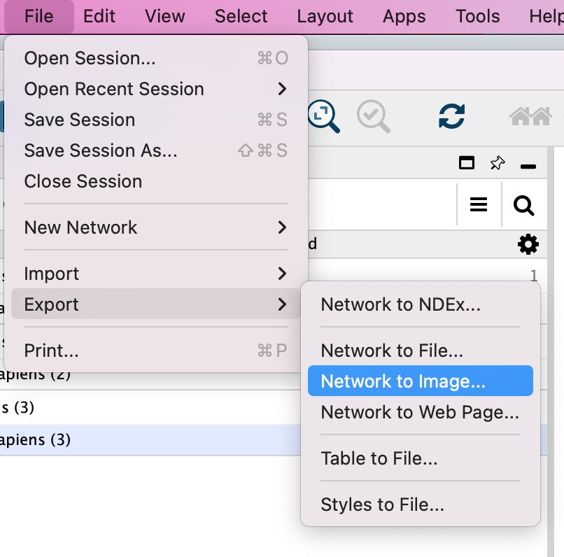

---

---

## EXERCISE 2: Searching GeneMANIA with gene list

To start this exercise, you need to download the [30_prostate_cancer_genes.txt](./Module6/genemania/data/30_prostate_cancer_genes.txt) file and save it on your computer. 

For this exercise, you are working with a list of 30 prostate cancer genes. This list was downloaded from the cBioPortal website (<http://www.cbioportal.org/>). The cBioPortal for Cancer Genomics stores genomic data from large scale, integrated cancer genomic data sets. During this exercise, you will explore the types of networks that have been used to create the GeneMANIA network from the prostate cancer gene list and you will see how changing input parameters can affect the results. The last step of the exercise consists of uploading a custom network which is a list of genes that are positively correlated with CYP11B1 in mRNA expression data of 94 prostate cancer samples (<http://www.cbioportal.org/>) .

**Skills**: <br>

  * GeneMANIA search using a gene list; 
  * Navigating Search Results; 
  * Exploring  Networks and advanced options; 
  * Uploading a custom network. 

**Steps**<br>

  1. Open Cytoscape.

  1. Locate the GeneMANIA search window located on the left side in *Control Panel*. 

  1. Copy and paste genes in the file [30_prostate_cancer_genes.txt](./Module6/genemania/data/30_prostate_cancer_genes.txt)
      * Make sure that the parameter 'Max resultant genes' is set to '20' by clicking on the menu button  at the right side of the search box and selecting 'Customise advanced options'.	

  1. Click on the search icon  and wait for the results.	 <br>
``
  1. When your search results load, examine the network. Query genes are indicated in black, related genes added by GeneMANIA are represented in gray, and colored links represent the interactions that connect the nodes (genes). Move nodes around by selecting them with a mouse to investigate how they are connected.<br>

  1. Click any link (edge) connecting two nodes to highlight information about it. The information about the interaction is display in the *Edge Table* located in *Table Panel* (at the bottom) in the *networks* and *data type* columns. 
      * **Note**: Clicking on an edge between 2 nodes will display information about all interaction networks that connect  these 2 nodes. 
      * It indicates the reference (publication) for these interactions. 
      * The colors indicate the type of interaction (co-expression, shared protein domains, co-localization, physical interactions and predicted). <br>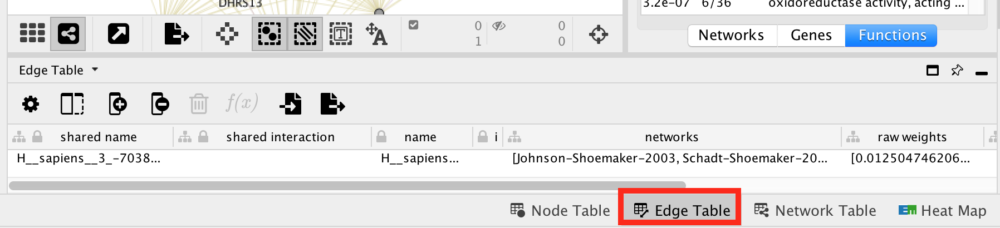

  1. Locate and expand the 'Networks' summary tab  in *Results Panel* (on the right) and look at what data has been used to create the network and predictions. 
      * **Note** that Co-expression (purple colored lines, weight over 25%) and Shared protein domains (lightgold colored lines, weight over 30%) influence the results the most, but Co-localization (blue colored lines), Physical interactions (salmon colored lines) and Predicted (orange) data are also included. 
      * At the top of the Networks summary tab, use the menu button  and try Expand “All, then “Top-Level” and “None”  to get information about the sources of the different networks. <br>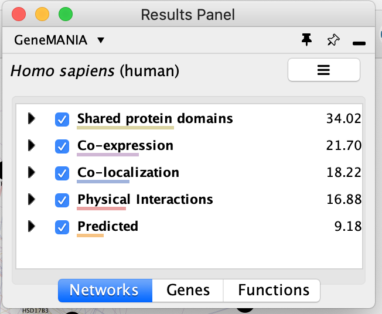

```{block, type="rmd-tip"}
The observations of the number of connections makes it easier to understand why co-expression and shared protein domains have the highest percent weight for this network: they are helping to connect more genes than physical interactions and predicted interactions; A higher weight means that this network contributed more to finding related genes. 	
```

<ol start=8 type="1"><li>Highlight all connections corresponding to each network by clicking the name of each network category.</ol>
  
  * Click on  “Shared protein domains” and see which genes are connected by predicted protein protein interaction. <br>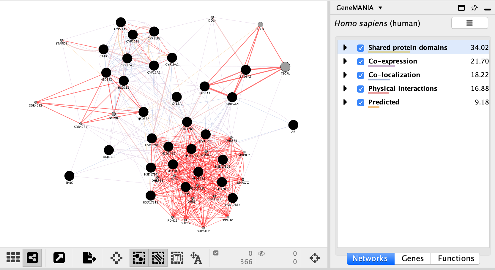
  * You can do the same for “Co-localization” , “Co-expression”  and “Physical interactions”. <br>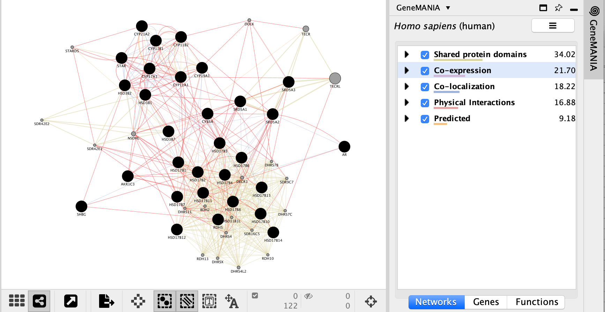


<ol start=9 type="1"><li>Locate the Functions summary tab and look at what functions were significantly enriched in this list of prostate genes.	</ol>

  * The top pathway with the strongest enrichments is: "oxidoreductase activity, acting on CH-OH group of donors" with 28 genes in the prostate cancer list overlapping with this pathway.
  * The FDR is equal to 6.4e-46.<br>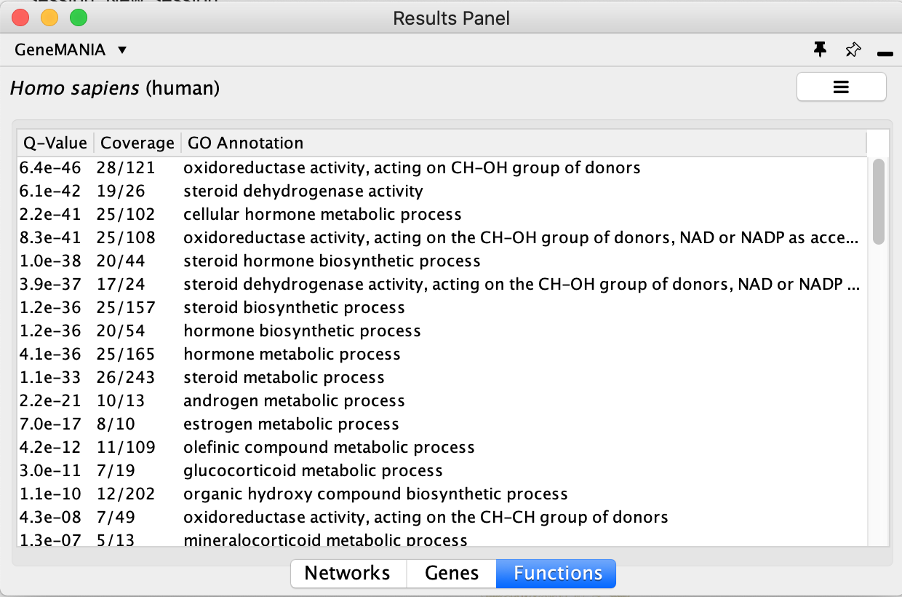


**Question**:<br>“Shared protein domains” is an important part of the network. What would the GeneMANIA results be if we didn’t include this source when we ran GeneMANIA search?

  * Go back to the 'Network' tab on the right side of the Cytoscape window to find the GeneMania search bar. 
  * Click on  the option menu button  which is located at the right of the search box. 
  * Uncheck ‘Shared protein domains’ and click on a point outside the box to close it.
  * Click on the search icon .
  * Explore the results.<br>


**Answer** <br>If "shared protein domain" is removed, the relationships between the nodes are primarily from the Co-expression, Co-localization, Predicted and Physical interactions networks. The genes added to the network are different compared to the first network created with "Shared protein domain". <br>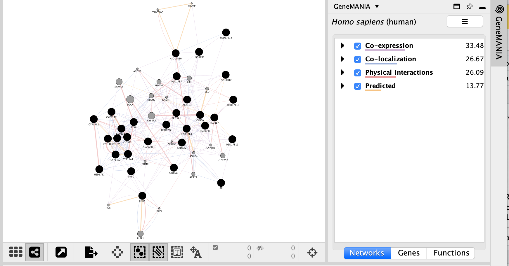

**Question**:<br>Locate the Functions summary tab in *Results Panel* and look at what functions were significantly enriched with these new settings.	

**Answer** <br>With the new settings, "steroid biosynthetic process" is the new top enriched pathway. <br>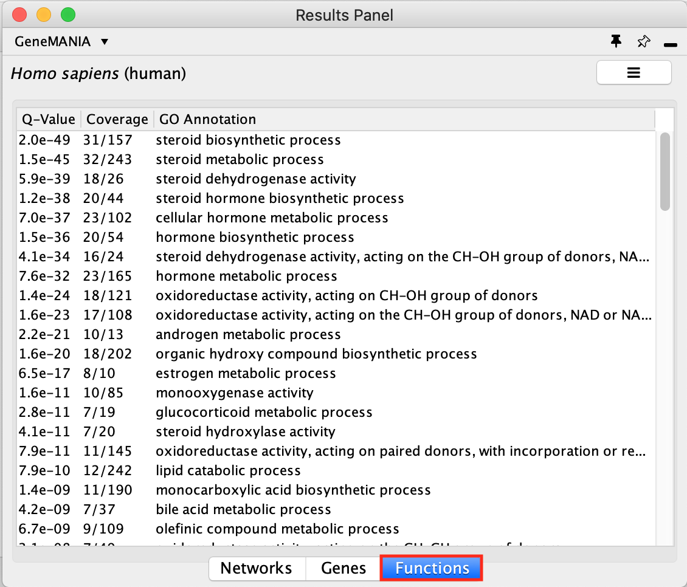

<ol start=10 type="1"><li>Try to modify additional parameters like *Max Resultant Genes* or *Network Weighting* and look at how the changes you made influenced the results.  </ol>	


---

---

## EXERCISE 3: Searching GeneMANIA with mixed gene list

To start this exercise, you need to download the [Mixed_gene_list.txt](./Module6/genemania/data/mixed_gene_list.txt) file and save it on your computer. 

For this exercise, you are working on a gene list created by combining 3 user defined gene lists available from the cBioportal (<http://www.cbioportal.org>). It contains genes implicated in the DNA damage response, the PI3K-AKT-mTOR signaling pathway and Folate transport. This list is representative of a gene list obtained from transcriptomics data. During this exercise, we will first characterize our gene list based on functions and then we will add potential drug and microRNAs targeting genes in the network, and we will save the report.


**Skills**: 

  * GeneMANIA search using a gene list; 
  * Navigating Search Results; 
  * Exploring  Functions; 
  * Adding attributes; 
  * Create a report. 

**Steps**<br>

  1.  Before performing the next GeneMANIA search make sure the GeneMANIA parameters are set back to the default values. <br>

  1. Open Cytoscape and locate the GeneMANIA search window located on the left side in *Control Panel*. 

  1.	In the search window, ensure that the model organism is set to *Homo sapiens*   .	

  1.	Copy and paste genes in the file [Mixed_gene_list.txt](./Module6/genemania/data/mixed_gene_list.txt). Click on the search icon  and wait for the results.	Explore the network.<br>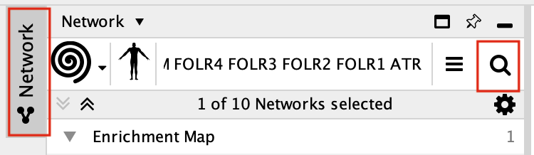

  1. Locate the Functions summary tab in *Result Panel* and look at functions returned by GeneMANIA.	<br>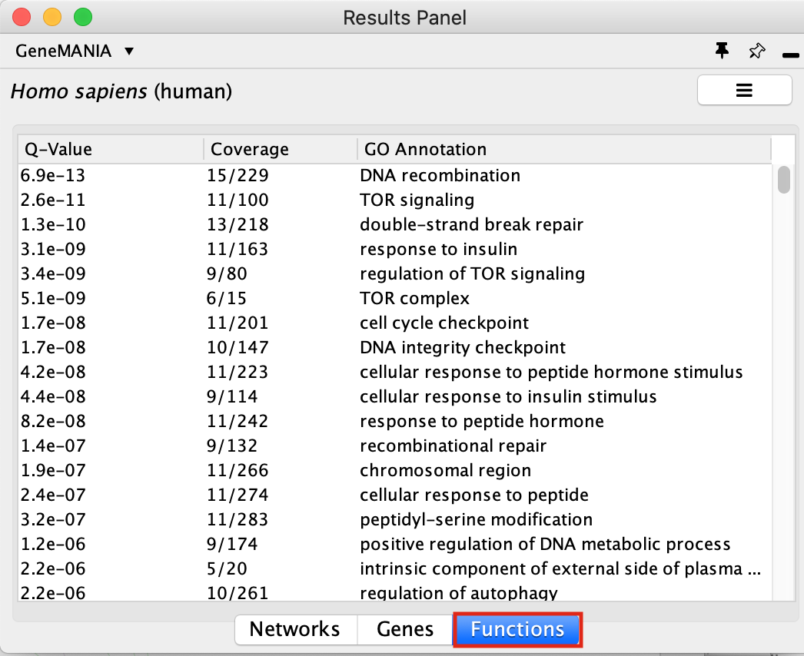

  1. In the functions summary tab,  check some functions to color genes included in these functions. To follow this tutorial, you can for example color the “DNA recombination” , “response to insulin”  functions.<br>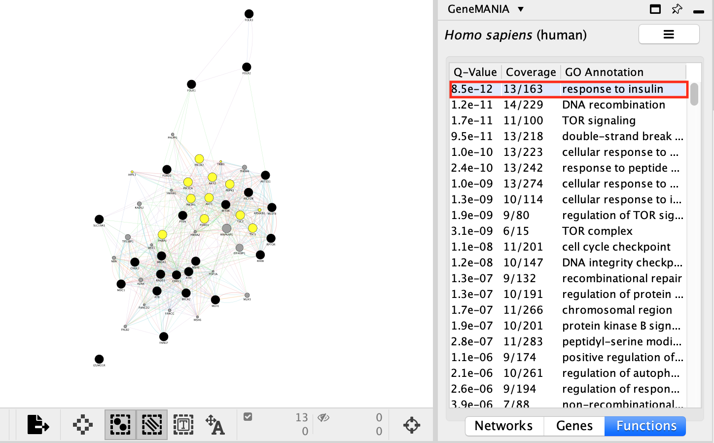<br>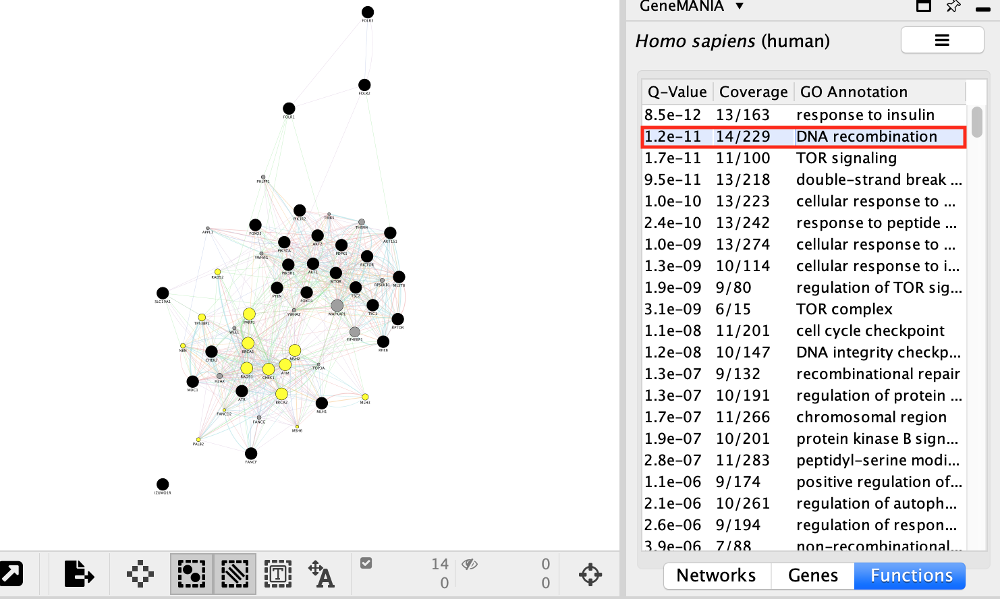


  1. Color genes according to their GeneMANIA defined functions:
      * Go to the **Control Panel** tabs located on the right side of the Cytoscape window and select the **Style** tab.  
      * In the **Node** panel, expand the **Fill Color** tab.
      * Set **Column** to **annotation name**.<br>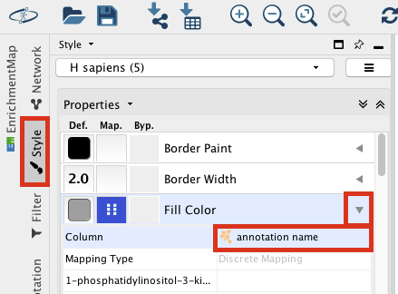 
      * Locate “DNA recombination”.
      * Double click on the white space at the right side of the box and click on the 3 dots . A **Colors** box appears.
      * Choose a color of your choice and click on **OK**.<br>
      * Locate “response to insulin”. Double click on the white space at the right side of the box and click on the 3 buttons menu. A **Colors** box appears.
      * Choose a color of your choice and click on **OK**.<br>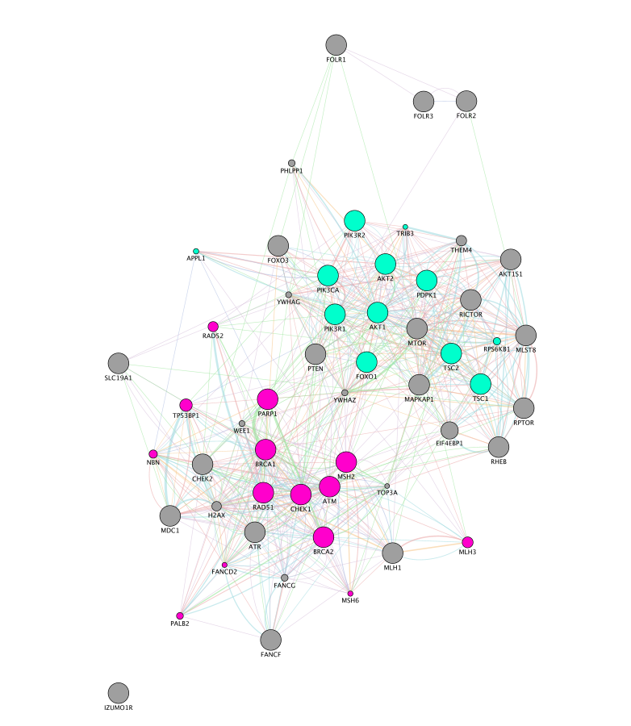

6.	Locate our favorite gene PDPK1 on the network. 
      * Click on the icon *First Neighbor of Selected Nodes* . It will highlight this gene and all its connections. <br>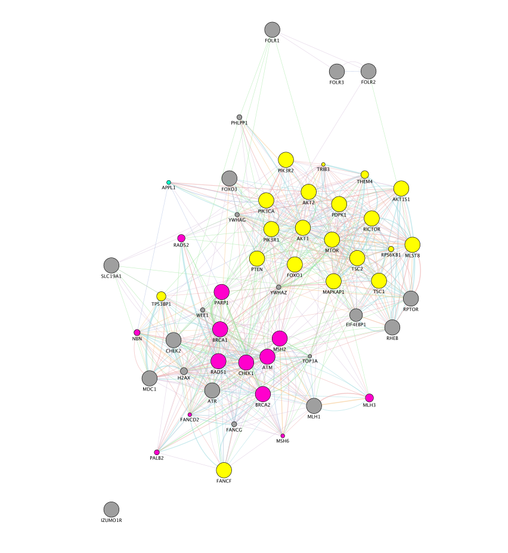
      * Click on the icon *From Selected Nodes, all Edges*  to create a subnetwork.<br>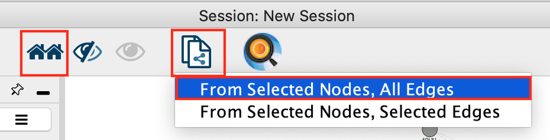
      * The resultsing subnetwork will only have the selected nodes from the first network<br>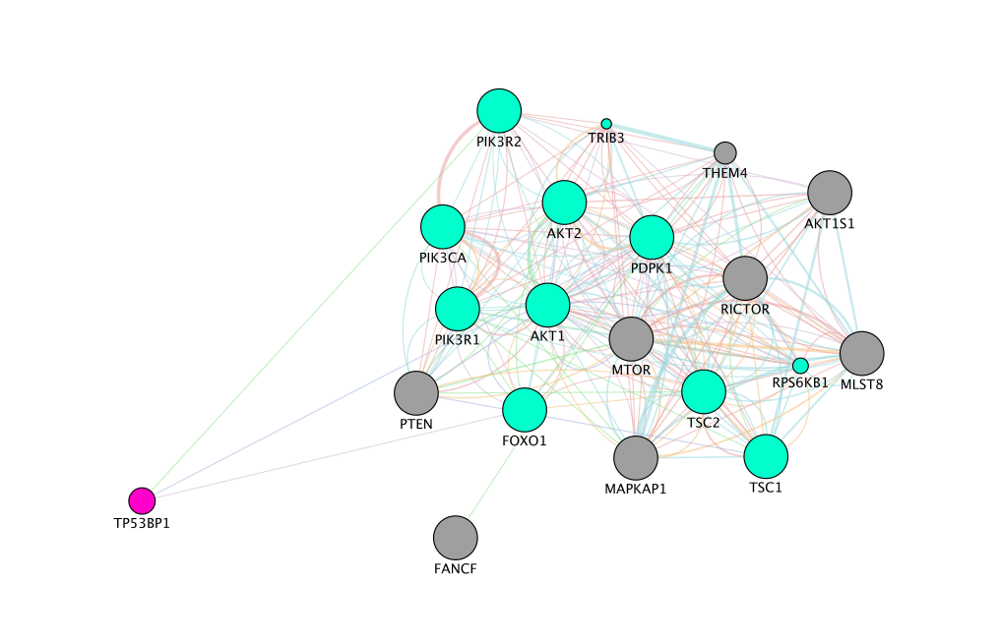

```{block, type="rmd-tip"}
copy "PDPK1" to the search box, click enter and the node will be highlighted in yellow in the network.
```    


---

## GeneMANIA DEFINITIONS:

**What are the different networks: Definition of the types of interaction:**

*	**Shared domains**: Protein domain data. Two gene products are linked if they have the same protein domain. These data are collected from domain databases, such as InterPro, SMART and Pfam.

*	**Co-localization**: Genes expressed in the same tissue, or proteins found in the same location. Two genes are linked if they are both expressed in the same tissue or if their gene products are both identified in the same cellular location.

*	**Co-expression**: Gene expression data. Two genes are linked if their expression levels are similar across conditions in a gene expression study. Most of this data is collected from the Gene Expression Omnibus (GEO); we only collect data associated with a publication.

*	**Predicted**: Predicted functional relationships between genes, often protein interactions. A major source of predicted data is mapping known functional relationships from another organism via orthology.


**What is defined by evidence sources?:** 

*	**Evidence sources** are the information contained in the multiple databases that GeneMANIA uses to establish interaction between two genes.


**Network:**

*	**Node** : circle representing the genes

*	**Edge**: line that links two nodes and represent an interaction between two genes (multiple lines correspond to multiple sources)

*	**Node size**: Mapped to gene score, i.e. the degree to which GeneMANIA predicts the genes are related

*	**Thickness of edge**: Strength/weight of interaction


**Layout** : The layout is different each time so the user can request the layout run multiple times until the user is satisfied with the result.


**in Networks tab:**

*	**Percent weight (score)** : a higher weight means that this network helped more to find related genes.


**in Functions tab** :

*	**FDR** : False discovery rate (FDR) is greater than or equal to the probability that this is a false positive.

*	**Coverage** : (number of genes in the network with a given function) / (all genes in the genome with the function)

#### In advanced options: 

*	**Network weighting?**  GeneMANIA can use a few different methods to weight networks when combining all networks to form the final composite network that results from a search. The default settings are usually appropriate, but you can choose a weighting method in the advanced option panel. (more details at <http://pages.genemania.org/help/>).

*	**Related genes** : are genes added by GeneMANIA in addition to the genes from the query. It helps to expand the network and predict function of the query gene(s).

*	**The attributes**  represent the differences sources of evidence that can be used to build the network.


**Notes** :

*	prostate cancer gene list is “AKR1C3 AR CYB5A CYP11A1 CYP11B1 CYP11B2 CYP17A1 CYP19A1 CYP21A2 HSD17B1 HSD17B10 HSD17B11 HSD17B12 HSD17B13 HSD17B14 HSD17B2 HSD17B3 HSD17B4 HSD17B6 HSD17B7 HSD17B8 HSD3B1 HSD3B2 HSD3B7 RDH5 SHBG SRD5A1 SRD5A3 STAR”.

*	mixed gene list is AKT1 AKT1S1 AKT2 ATM ATR BRCA1 BRCA2 CHEK1 CHEK2 FANCF FOLR1 FOLR2 FOLR3 FOXO1 FOXO3 MDC1 MLH1 MLST8 MSH2 MTOR PARP1 PDPK1 PIK3CA PIK3R1 PIK3R2 PTEN RAD51 RHEB RICTOR RPTOR SLC19A1 TSC1 TSC2

```{block, type="rmd-tip"}
look at GeneMANIA help pages when you run an analysis on your own after the workshop: <http://pages.genemania.org/help/>.
```


## EXERCISE 4 (OPTIONAL): Discover the stringApp

[stringApp](https://string-db.org/) imports functional associations or physical interactions between protein-protein and protein-chemical pairs from STRING, Viruses.STRING, STITCH, DISEASES and from PubMed text mining into Cytoscape. 
Users provide a list of one or more gene, protein, compound, disease, or PubMed queries, the species, the network type, and a confidence score and stringApp queries the database to return the matching network. 


Currently, five different queries are supported:

  * STRING: protein query -- enter a list of protein names (e.g. gene symbols or UniProt identifiers/accession numbers) to obtain a STRING network for the proteins
  * STRING: PubMed query -- enter a PubMed query and utilize text mining to get a STRING network for the top N proteins associated with the query
  * STRING: disease query -- enter a disease name to retrieve a STRING network of the top N proteins associated with the specified disease
  * STITCH: protein/compound query -- enter a list of protein or compound names to obtain a network for them from STITCH
  * STRING: cross-species query -- choose two species to obtain a STRING network between and within the proteins of the interacting species

**Data** 

Let's use the prostate cancer gene list that we used in exercise 1.

  *	[30_prostate_cancer_genes.txt](./Module6/genemania/data/30_prostate_cancer_genes.txt)

**Steps**:<br>

  1. Open Cytoscape 
  1. Make sure stringApp is installed. Go to menu, Apps, App Store, Show App Store. Install the app if necessary.
  1. In Cytoscape, locate the **Network** tab and select **STRING**, **STRING: protein query** by clicking the down arrow.<br>
  


  1. Copy and paste the [30_prostate_cancer_genes.txt](./Module6/genemania/data/30_prostate_cancer_genes.txt) in the blank field and click on the search button.<br>

 
  1. Observe the network that has been created. The genes from our list are connected by predicted protein-protein interactions.<br> 

  1. On the right side of the Cytoscape window, locate and expand the *STRING* tab.<br> 
       * Make sure that the **Nodes** tab is selected.<br>
       * Play with parameters on the top fields: *Glass ball effect*, *STRING style labels*, etc... and observe the changes on the network.<br>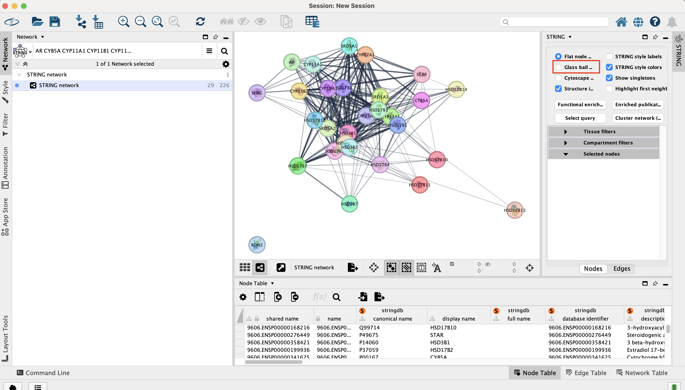 

  1. Optimize the layout. In Cytoscape, go to the menu bar, Layout, yFiles Organic Layout.    
       
  1. Go back to the STRING Note tab on the right side:      
       * Select a node and look at the gene details in the **Selected nodes** tab.
       * Try the **Functional enrichment** and observe the resuls in the **STRING Enrichment** table located below the network.<br>
  
  1. Select the **Edges** tab.
      * The **score** slide bar enables to select the interactions with the strongest prediction scores.
      * The **Subscore** table traces the source of the predicted interactions using several evidence scores.<br>
  
## More STRING information and tutorials:
* Reference: https://apps.cytoscape.org/apps/stringapp
* Tutorial: https://cytoscape.org/cytoscape-tutorials/protocols/stringApp/#/


<!--chapter:end:5.1-Module5_Cytoscape_lab.Rmd-->

# Module 5 Lab: GeneMANIA (web version) {#genemania_web}

**This work is licensed under a [Creative Commons Attribution-ShareAlike 3.0 Unported License](http://creativecommons.org/licenses/by-sa/3.0/deed.en_US). This means that you are able to copy, share and modify the work, as long as the result is distributed under the same license.**

*<font color="#827e9c">By Veronique Voisin </font>*

## Goal of this practical lab 

Create GeneMANIA networks starting from a single gene to predict its function or starting from a gene list. Explore and understand the main output features of GeneMANIA such as the network composition or the enriched functions. 

This practical consists of 3 exercises. You can choose to do these exercises using the questions as your only guide (section 'QUESTIONS AND STEPS TO FOLLOW) - or see the following pages for the step-by-step checklist to find the answers (section 'ANSWERS: DETAILED STEPS AND SCREENSHOTS'). 

Before starting the exercises,download the files:

```{block, type="rmd-datadownload"}
Right click on link below and select "Save Link As...".

Place the file in your CBW work directory in the corresponding module directory.
```

*	[30_prostate_cancer_genes.txt](./Module6/genemania/data/30_prostate_cancer_genes.txt)

*	[Mixed_gene_list.txt](./Module6/genemania/data/mixed_gene_list.txt)

*	[CYP11B_pearson_correlation_prostate.txt](./Module6/genemania/data/CYB11B_pearson_correlation_prostate.txt)


```{block, type="rmd-note"}
Network layouts are flexible and can be rearranged. What you see when you perform these exercises may not be identical to what you see in the tutorial, or what you have seen other times that you have performed the exercises. Exact layouts and predictions can also be affected by updates to the networks database that GeneMANIA uses. However it is expected that the network weights and predicted genes will be similar to those shown here. 
```

## EXERCISE 1: QUESTIONS AND STEPS TO FOLLOW 

Imagine that you are interested in exploring the function of the human GRN gene: GRN returned as the strongest hit from your omics experiment but not many information about this gene is available in functional databases. Use GeneMANIA to identify its predicted function as well as potential interaction partners. 

**Skills**:<br>

  * GeneMANIA Single Gene search; Navigating Search Results; 
  * Exploring available Genes features; 
  * Rerun a new analysis using a single gene or multiple genes query from the network.

**STEPS**<br>

1. Go to GeneMANIA’s homepage at <http://www.genemania.org/>  

2. In the search window, ensure that the model organism is set to *Homo sapiens* .  

3. Enter the following gene: GRN	

4. Click on the search icon  and wait for the results.	

5. When your search results load, examine the network. Query genes are indicated with stripes, related genes added by GeneMANIA are represented in black, and colored links represent the interactions that connect the nodes (genes). 
 	
6. Clicking on a node gives information about its name, the possibility to add or remove this gene from the search (if the gene was not part of the initial search *remove from search* will be grayed out) or run a search with this gene only. 
    * Click on the GRN node and explore the displayed information. 	

7. Locate the Functions summary tab (bottom left icon ). 
    * What are the functions significantly associated with  this network?  
    * GRN is the central node of this network: which function would you predict for GRN?
    * How well did GeneMANIA perform (hints: use GeneCards (<http://www.genecards.org/>) , PubMed (<http://www.ncbi.nlm.nih.gov/pubmed/>))?	

8. Locate the gene with the strongest association with GRN.

```{block, type="rmd-tip"}  
The larger the node in this network, the stronger its association with the query.  Node size is correlated to its GeneMANIA score. 
```

9. Re-run the analysis with added genes SORT1, SLPI to the search.  
    * Which functions are associated with this new network ? 	 

10. On the left side of the window are located icons that we haven’t yet explored. The first 3 buttons activate different network layouts. Try 
    * the circular , 
    * the aligned , and 
    * the force_directed  layouts.  	

11. Choose your favorite layout and 
    * save the  network as an image  using the *Network image As Shown* option from the *save*  menu  .  	
    * The menu can be opened by clicking on the 3 dots icon on the left hand side of the window (not the three dot icon in the search bar).

## EXERCISE 1 ANSWERS: DETAILED EXPLANATION AND SCREENSHOTS

### EXERCISE 1 - STEPS 1-4


### EXERCISE 1 - STEP 5


 
### EXERCISE 1 - STEP 6

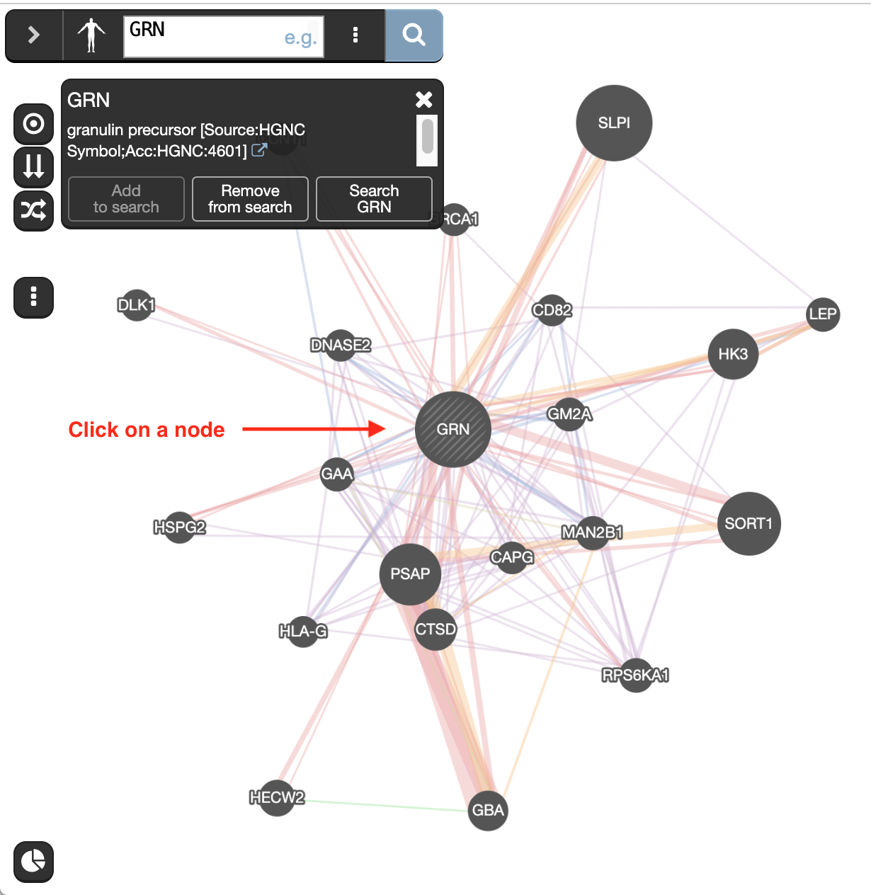

### Exercise 1 - STEP 7

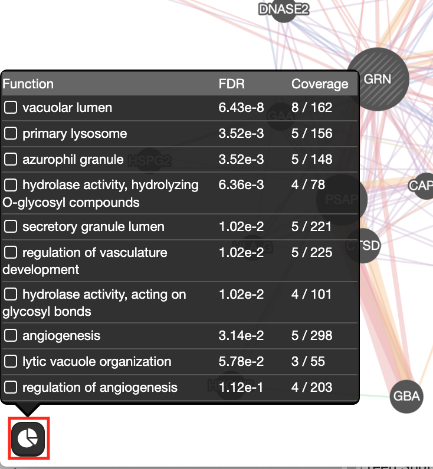


**Question** What are the functions significantly associated with this network?<br>
**Answer** the list of the functions associated with the network are listed in the above screenshot. "vacuolar lumen" and "primary lysosome" are the top 2 functions.

**Question** GRN is the central node of this network: which function would you predict for GRN? <br>
**Answer** : a function related to lysosome and vacuole

**Question** How well did GeneMANIA perform (hints: use GeneCards (http://www.genecards.org/) , PubMed (http://www.ncbi.nlm.nih.gov/pubmed/))?<br>
**Answer**
The top functions predicted by GeneMANIA for GRN were related to lysosome and vacuole.  A pubmed search could confirm these results: “We experimentally verified that granulin precursor (GRN) gene, whose mutations cause frontotemporal lobar degeneration, is involved in lysosome function.” (Transcriptional gene network inference from a massive dataset elucidates transcriptome organization and gene function. Belcastro et al. Nucleic Acids Res. 2011 Nov 1;39(20):8677-88. 2011. PMID:21785136)


### Exercise 1 - STEP 8 

**Question** Locate the genes with the strongest association with GRN (thick edge).<br> 
**Answer is SORT1 and SLPI**

### Exercise 1 - STEP 9


### Exercise 1 - STEP 10 (layouts)

#### Circular layout

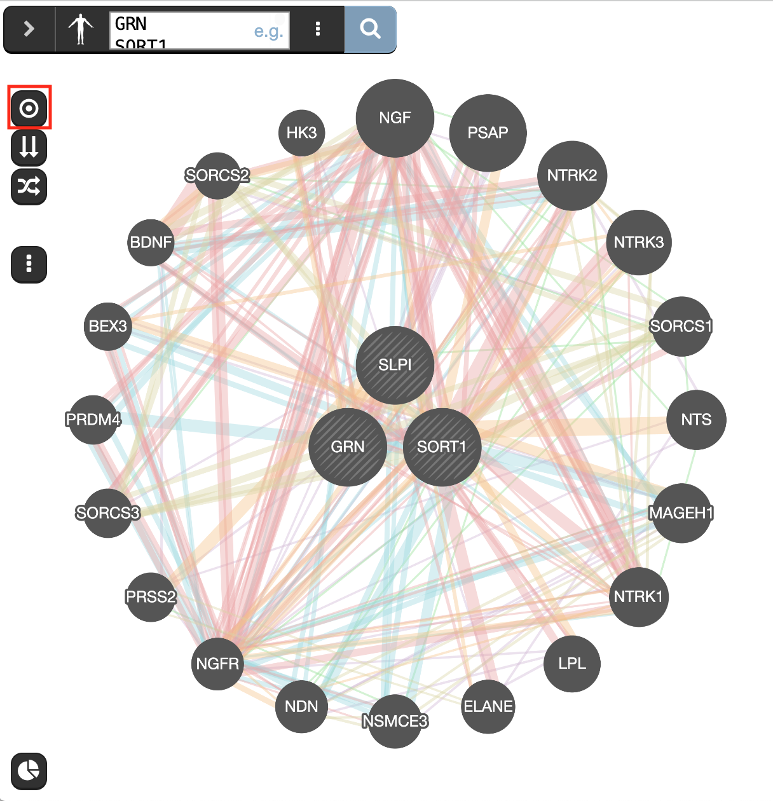

 
#### Aligned layout
 


 
#### Force directed layout
 
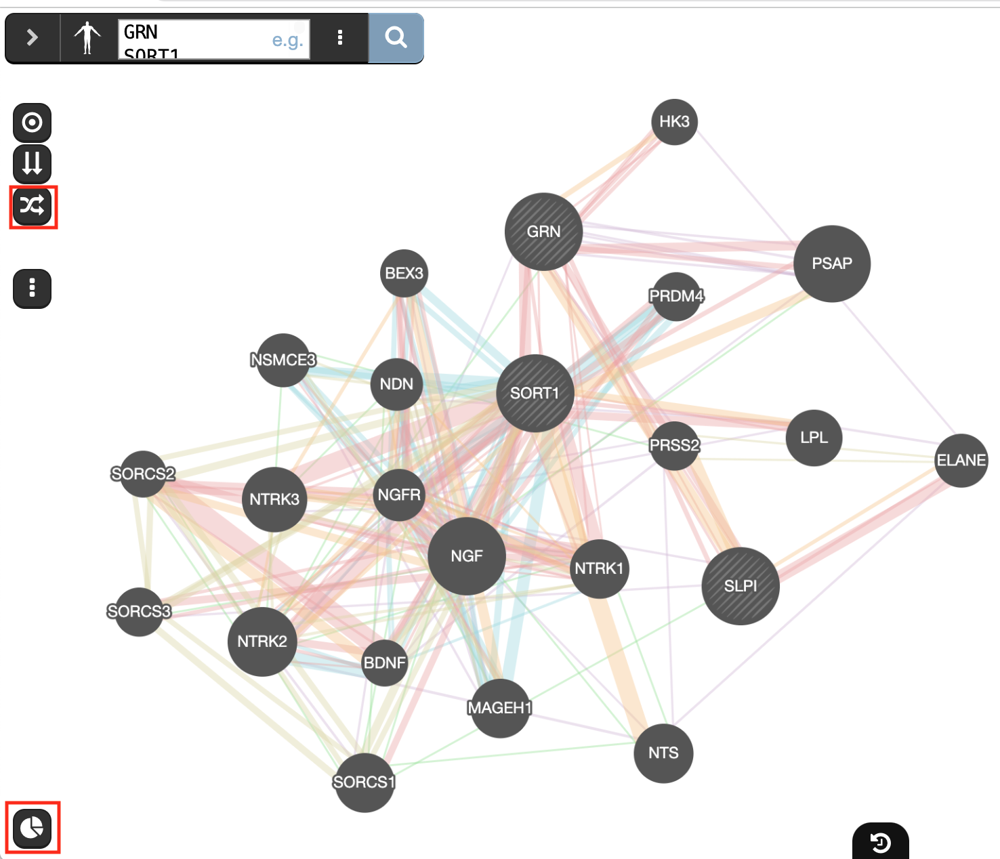


### Exercise 1 - STEP 11 (save an image) 	

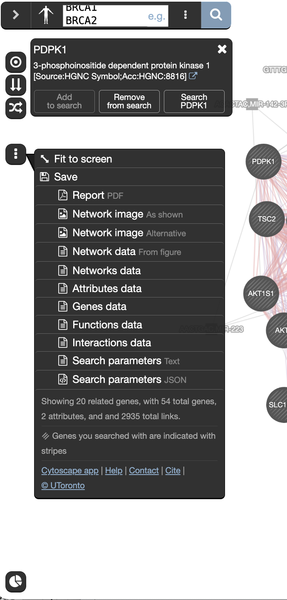


**Notes** about biological interpretation of the results: 

**A paper describing the interaction between GRN and SORT1 and demonstrates how finding related genes could be relevant for elaborating therapy:**
 
[Targeted manipulation of the sortilin–progranulin axis rescues progranulin haploinsufficiency. Lee et al. Hum Mol Genet. 2014 March 15; 23(6): 1467–1478. PMCID:PMC3929086](https://www.ncbi.nlm.nih.gov/pmc/articles/PMC3929086/)<br>
“Progranulin (GRN) mutations causing haploinsufficiency are a major cause of frontotemporal lobar degeneration (FTLD-TDP). Recent discoveries demonstrating sortilin (SORT1) is a neuronal receptor for PGRN endocytosis and a determinant of plasma PGRN levels portend the development of enhancers targeting the SORT1–PGRN axis. We demonstrate the preclinical efficacy of several approaches through which impairing PGRN's interaction with SORT1 restores extracellular PGRN levels. “


---

## EXERCISE 2: QUESTIONS AND STEPS TO FOLLOW

To start this exercise, you need to download the [30_prostate_cancer_genes.txt](./Module6/genemania/data/0_prostate_cancer_genes.txt) file and save it on your computer. 

For this exercise, you are working with a list of 30 prostate cancer genes. This list can be downloaded after the workshop from the cBioPortal website (<http://www.cbioportal.org/>). The cBioPortal for Cancer Genomics stores genomic data from large scale, integrated cancer genomic data sets. During this exercise, you will explore the types of networks that have been used to create the GeneMANIA network from the prostate cancer gene list and you will see how changing input parameters can affect the results. 

**Skills**:<br>

  * GeneMANIA search using a gene list; 
  * Navigating Search Results; 
  * Exploring  Networks and advanced options; 
  * Uploading a custom network. 

**STEPS**<br>

1.	Go to GeneMANIA’s homepage at <http://www.genemania.org/>	

2.	In the search window, ensure that the model organism is set to *Homo sapiens*   .	

3.	Copy and paste genes in the file [30_prostate_cancer_genes.txt](./Module6/genemania/data/30_prostate_cancer_genes.txt).
    * Make sure that the parameter 'Max resultant genes' is set to **20** by clicking on the 3 menu buttons at the right side of the search box and selecting 'Customize advanced options'.	 
    * Set 'Max resultant attributes' to **10**.

4.	Click on the search icon  and wait for the results.	 

5.	When your search results load, examine the network. 
    * Genes you searched with are indicated with stripes, 
    * related genes added by GeneMANIA are represented in black, 
    * and colored links represent the interactions that connect the nodes (genes). 
    * Move nodes around by selecting them with a mouse to investigate how they are connected.
	
6.	Click any link (edge) connecting two nodes to highlight information about it.

```{block, type="rmd-note"}
Clicking on an edge between 2 nodes will display information about all interaction networks that connect these 2 nodes. It indicates the reference (publication) for these interactions. The color indicates the type of interaction (co-expression, shared protein domains, co-localization, physical interactions and predicted). 
```	

7.	Locate and expand the 'Networks' summary tab (on the right ) and look at what data has been used to create the network and predictions. 

```{block, type="rmd-note"}
Shared protein domains (lightgold colored  lines, weight over 30%) and Co-expression (purple colored lines, weight over 20%) influence the results the most, but Co-localization (blue colored lines), Physical interactions (salmon colored lines) and Predicted (orange) data also contribute. 

At the top of the Networks summary tab,

  * click on the down arrow.
  * try Expand “none”, then “top” and “all”  to get information about the sources of the different networks. 
```

8.	Highlight all connections corresponding to each network by clicking the name of each network category. 
    * Click on  “Shared protein domains” and see which genes are connected by shared protein domains. 
    * You can do the same for “Co-localization” , “Co-expression”  and “Physical interactions”. 

```{block, type="rmd-tip"}
Seeing or highlighting the number of connections for each data source makes it easier to understand why co-expression and shared protein domains have the highest percent weight for this network: 
    * they connect more genes than physical interactions and predicted; 
    * A higher weight means that this network contributes more to finding related genes. 	
```

9.	Locate the Functions summary tab (bottom left ) and look at what functions were  significantly enriched in this list of prostate genes.	

10.	“Shared protein domains” is an important part of this network. What would happen to the GeneMANIA results if we didn’t include this source when we run this GeneMANIA search? 
    * Click on ‘Show advanced option ’ which is located at the right of the search box. 
    * Uncheck ‘Shared protein domains’ and 
    * click on the search icon . 
    * Explore the results.
	
11.	Locate the Functions summary tab (bottom left ) and look at what functions were  significantly enriched with these new settings.	

12.	Upload a custom network to GeneMANIA: 
    * Go to the menu option at the right of the search box (the icon with three dots) and 
    * at the bottom of the network list, locate **Uploaded**, expand this option using the down arrow
    * click on “Upload a network” and browse your computer to locate and select the file [CYP11B_pearson_correlation_prostate.txt](./Module6/genemania/data/CYB11B_pearson_correlation_prostate.txt). 
    * Wait about a minute for the network to be uploaded.  
    * Click on the search icon to launch the query 
    * explore the results and locate the genes linked by the custom network 
  
```{block, type="rmd-tip"}    
click on “Uploaded” in the Networks tab on right hand side. 
```

13.	Try additional parameters of the ‘Customise advanced options ’ tab and look at how the changes you made influenced the results. For example change ‘Network weighting’ method or ‘Max resultant genes: ’.  	


## EXERCISE 2 ANSWERS: DETAILED STEPS AND SCREENSHOTS

### Exercise 2 - STEPS 1 to 4
	
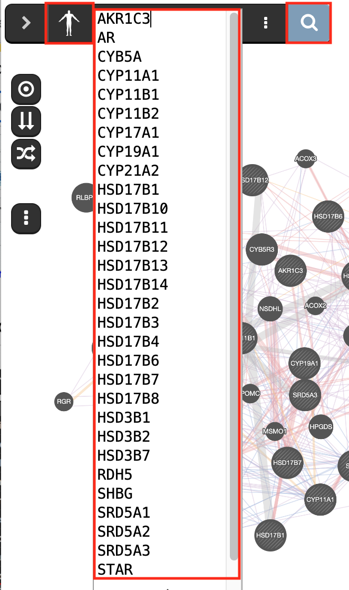


```{block, type="rmd-tip"}
Check that the parameter 'Max resultant genes' is set to '20' and 'Max resultant attribute' to '10'
```


### Exercise 2 - STEP 5


### Exercise 2 - STEP 6.

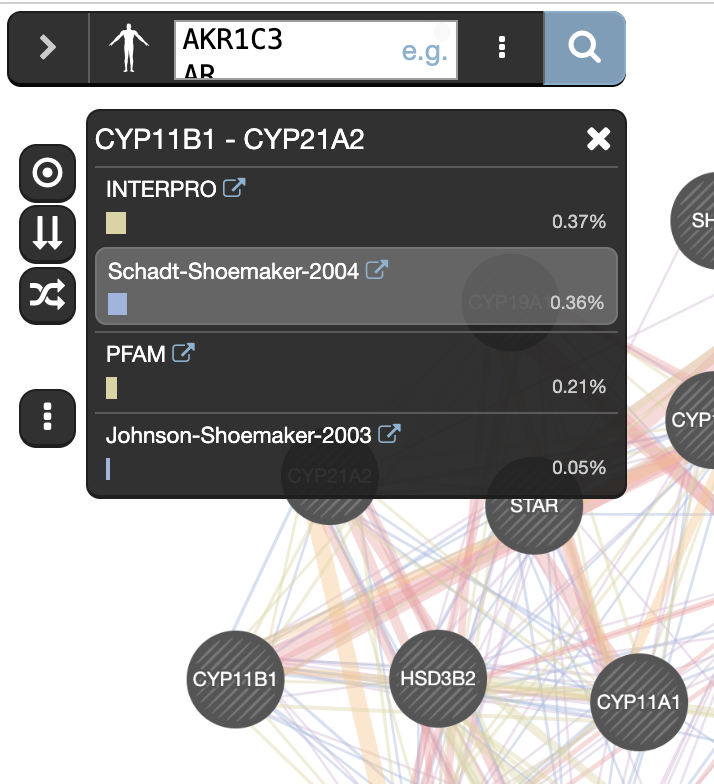
  
### Exercise 2 - STEP 7


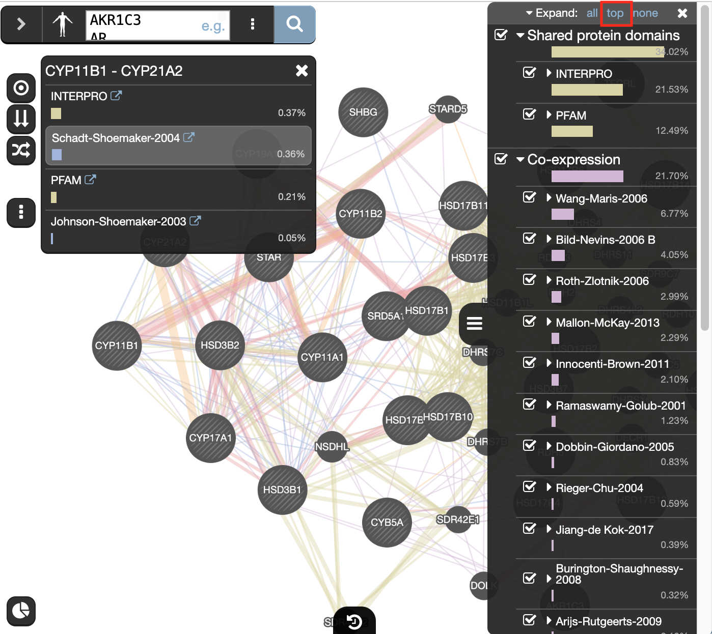


### Exercise 2 - STEP 8

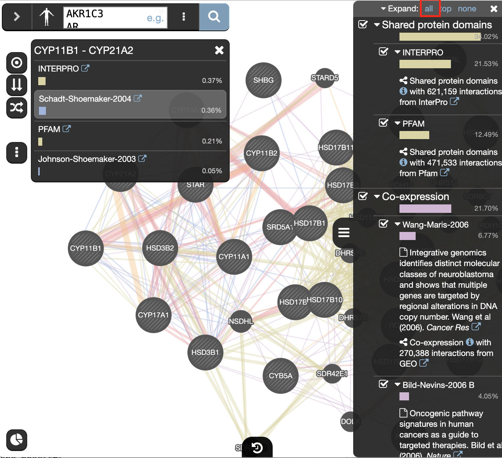

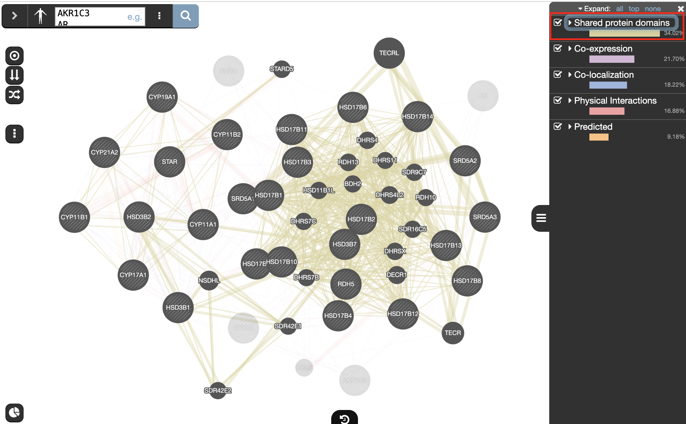


### Exercise 2 - STEP 9

The top pathways with the strongest enrichments are: "oxidoreductase activity" with 28 genes in the list overlapping with this pathway.
The FDR is  equal to 6.39e-46.

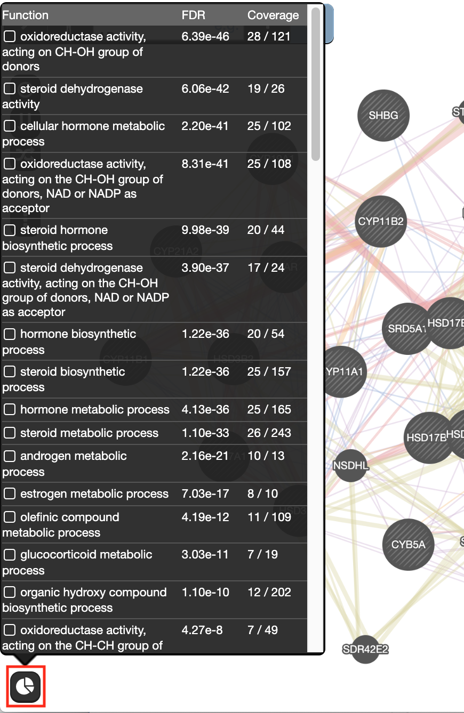

 
### Exercise 2 - STEP 10


**Question** “Shared protein domains” is an important part of the network. What would be the GeneMANIA results if we don’t include this source when we run the GeneMANIA search?<br> 
**Answer** If "shared protein domain" is removed, the relationships between the nodes are from the Co-expression, Co-localization, Predicted and Physical interactions networks.The genes added to the network are different compared to the first network created with "Shared protein domain". 


### Exercise 2 - STEP 11


**Question** What functions were  significantly enriched with these new settings?<br>
**Answer** With the new settings, "steroid biosynthetic process" is the new top enriched pathway. 
	


### Exercise 2 - STEP 12

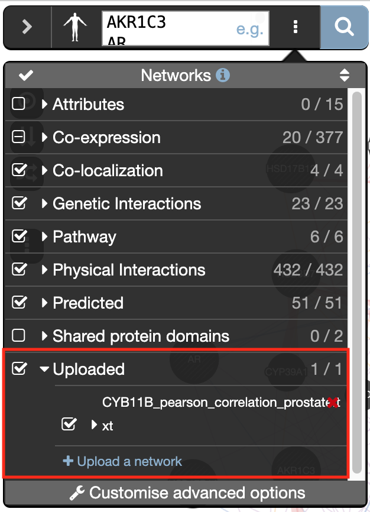


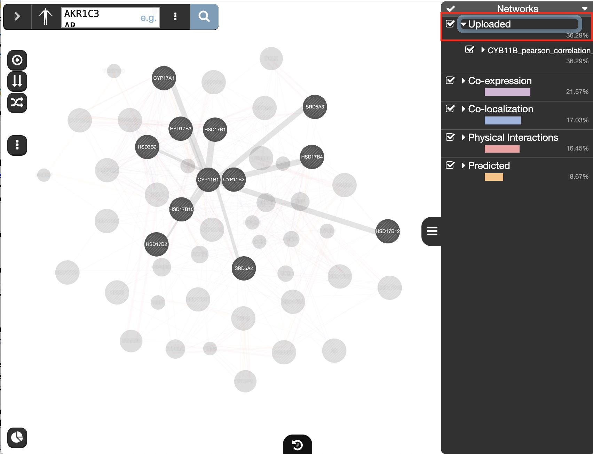


### Exercise 2 - STEP 13. 	


---

## EXERCISE 3: QUESTIONS AND STEPS TO FOLLOW

To start this exercise, you need to download the [Mixed_gene_list.txt](./Module6/genemania/data/mixed_gene_list.txt) file and save it on your computer. 

For this exercise, you are working on a gene list created by combining 3 user defined gene lists available from the cBioportal (<http://www.cbioportal.org>). It contains genes implicated in the DNA damage response, the PI3K-AKT-mTOR signaling pathway and Folate transport. This list is representative of a gene list obtained from transcriptomics data. During this exercise, we will first characterize our gene list based on functions and then we  will add potential drug and microRNAs targeting genes in the network, and we will save the report.


**Skills**:<br>

  * GeneMANIA search using a gene list; 
  * Navigating Search Results; 
  * Exploring  Functions; 
  * Adding attributes; 
  * Create a report. 

**STEPS**  

1.	Go to GeneMANIA’s homepage at <http://www.genemania.org/>.	

2.	In the search window, 
    * ensure that the model organism is set to *Homo sapiens*   .	
    * ensure that your Uploaded network from the previous exercise is not selected.  to delete it you can click on the red 'x' next to it.  

3.	Copy and paste genes in the file [Mixed_gene_list.txt](./Module6/genemania/data/mixed_gene_list.txt). Click on the search icon     and wait for the results.	

4.	Locate the Functions summary tab (bottom left ) and look at functions returned by GeneMANIA	

5.	In the functions summary tab,  check some functions to color genes included in these functions. To follow this tutorial, you can for example color the “response to insulin” , “DNA recombination” 	

6.	Next, we will add miRs and drug interaction networks. 
    * Click on ‘Show advanced option   ’ which is located at the right of the search box. 
    * In the 'Networks' tab, expand 'Attributes' and check “Drug-interactions-2020” and “miRNA-target-predictions-2020”. 
    * Check “Physical interactions” and “Co-expression” . 
    * Click on “Customise advanced options”. Set “Max resultant genes” to 20 and “Max resultant attributes” to 40. 
    * Click on the search icon     and wait for the results. Explore the network. 

```{block, type="rmd-tip"}    
Drug-interactions and miRNA-target-predictions nodes are displayed in gray. The nodes connected to a drug are genes that are targeted by that drug and nodes connected to a  microRNA (miR) are genes predicted to be targeted by that miR.	
```

7.	Locate our favorite gene PDPK1 in the network, 
    * select it by moving the mouse cursor to its node and wait there for a second. (you can also, click and hold on the node)
    * This will highlight this gene and all its connections. 

8.	Generate and save a report of your results by locating the save menu , and selecting “Report”. The PDF report provides a detailed description of your search and results.	

9.	Investigate the “history” function by clicking on the related icon  located at the bottom of the window. A panel pops up showing the past networks generated by GeneMANIA. Clicking on one panel will relaunch the search for this network. 	

## Exercise 3: MORE DETAILS AND SCREENSHOTS

### Exercise 3 - STEPS 1 - 3


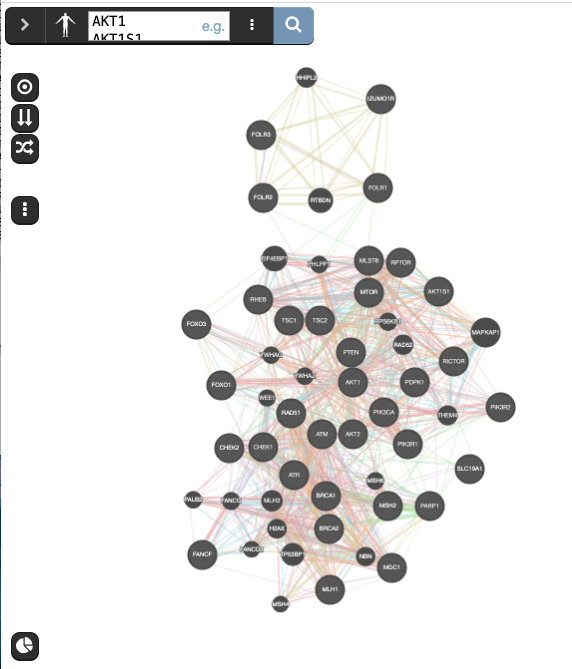

### Exercise 3 - STEP 4/ STEP5


### Exercise 3 - STEPS 6 

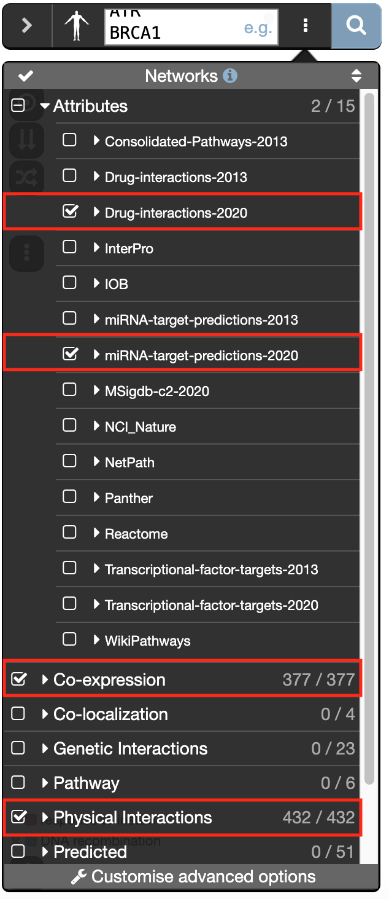


 
### Exercise 3 - STEP 7
	


### Exercise 3 - STEP 8


 
### Exercise 3 - STEP 9


--


## SOME DEFINITIONS:

**What are the networks: Definition of the types of interaction:**

*	**Shared domains**: Protein domain data. Two gene products are linked if they have the same protein domain. These data are collected from domain databases, such as InterPro, SMART and Pfam.

*	**Co-localization**: Genes expressed in the same tissue, or proteins found in the same location. Two genes are linked if they are both expressed in the same tissue or if their gene products are both identified in the same cellular location.

*	**Co-expression**: Gene expression data. Two genes are linked if their expression levels are similar across conditions in a gene expression study. Most of these data are collected from the Gene Expression Omnibus (GEO); we only collect data associated with a publication.

*	**Predicted**: Predicted functional relationships between genes, often protein interactions. A major source of predicted data is mapping known functional relationships from another organism via orthology.


**What is defined by evidence sources?:** 

*	**Evidence sources** are the information contained in the multiple databases that GeneMANIA uses to establish interaction between two genes.


**Network:**

*	**Node** : circle representing the genes

*	**Edge**: line that links two nodes and represent an interaction between two genes (multiple lines correspond to multiple sources

*	**Node size**: Mapped to gene score, i.e. the degree to which GeneMANIA predicts the genes are related

*	**Thickness of edge**: Strength/weight of interaction


**Layout** : The layout is different each time so the user can request the layout run multiple times until the user is satisfied with the result.


**in Networks tab:**

*	**Percent weight (score)** : a higher weight means that this network helped more to find related genes.


**in Functions tab** :

*	**FDR** : False discovery rate (FDR) is greater than or equal to the probability that this is a false positive.

*	**Coverage** : (number of genes in the network with a given function) / (all genes in the genome with the function)

#### In advanced options: 

*	**Network weighting?**  GeneMANIA can use a few different methods to weight networks when combining all networks to form the final composite network that results from a search. The default settings are usually appropriate, but you can choose a weighting method in the advanced option panel. (more details at <http://pages.genemania.org/help/>).

*	**Related genes** : are genes added by GeneMANIA in addition to the genes from the query. It helps to grow the network and then to predict function of the query gene(s).

*	**The attributes**  represent  the differences sources of evidence that can be used to build the network.


**Notes** :

*	prostate cancer gene list is “AKR1C3 AR CYB5A CYP11A1 CYP11B1 CYP11B2 CYP17A1 CYP19A1 CYP21A2 HSD17B1 HSD17B10 HSD17B11 HSD17B12 HSD17B13 HSD17B14 HSD17B2 HSD17B3 HSD17B4 HSD17B6 HSD17B7 HSD17B8 HSD3B1 HSD3B2 HSD3B7 RDH5 SHBG SRD5A1 SRD5A3 STAR”.

*	mixed gene list is AKT1 AKT1S1 AKT2 ATM ATR BRCA1 BRCA2 CHEK1 CHEK2 FANCF FOLR1 FOLR2 FOLR3 FOXO1 FOXO3 MDC1 MLH1 MLST8 MSH2 MTOR PARP1 PDPK1 PIK3CA PIK3R1 PIK3R2 PTEN RAD51 RHEB RICTOR RPTOR SLC19A1 TSC1 TSC2

```{block, type="rmd-tip"}  
look at GeneMANIA help pages when you run an analysis on your own after the workshop: <http://pages.genemania.org/help/>.
```


<!--chapter:end:5.2-Module5_genenmania_web_lab.Rmd-->

# Module 6: Cell Cell Communication  

 *<font color="#827e9c">By Gregory Schwartz, Veronique Voisin, Chaitra Sarathy and Ruth Isserlin</font>*
 
## Module 6 lecture : Cell-Cell Communication. 

Gregory Schwartz

[Lecture](./lectures/Pathways_2024_module6_Schwartz.pdf)

  
## scRNA lab praticals

[scRNA-lab1_PBMC](#scRNA_PBMC)

 - This lab starts from scRNA data from peripheral blood mononuclear cells. 

 - The cells from similar cell types were grouped into clusters. 

 - We extracted the gene lists corresponding to each cluster and run pathway analysis on it using g:Profiler. 

 - We also created pseudobulk from the data, ran GSEA and created an enrichment map.

[scRNAlab2_Glioblastoma](#scRNA_glioblastoma)

 - Similar to lab1, we extracted gene lists from scRNA clustering from glioblastoma data.

 - We created a mastermap by uploading in EnrichmentMap the pathway enrichment results for all the cluster gene lists.
 
[scRNAlab_CellPhoneDB](#scRNA_cellPhoneDB)

 - Similar to lab1 , we start from scRNA data from peripheral blood mononuclear cells and we are going to study the cell-cell communication between different cell types using CellPhoneDB. 

 
[scRNAlab_NEST](#scRNA_NEST)

 - In this lab, we are exploring cell-cell communication in spatial trancriptomic of a pancreatic cancer (PDAC) tissue section using the tool NEST.

  


<!--chapter:end:6.0-Module6_Cell_Cell_Communication.Rmd-->

# Module 6 lab 1: scRNA PBMC {#scRNA_PBMC}

**This work is licensed under a [Creative Commons Attribution-ShareAlike 3.0 Unported License](http://creativecommons.org/licenses/by-sa/3.0/deed.en_US). This means that you are able to copy, share and modify the work, as long as the result is distributed under the same license.**
 
*<font color="#827e9c">By Veronique Voisin, Chaitra Sarathy and Ruth Isserlin</font>*

## Introduction
As an example of applying pathway and network analysis using single cell RNASeq, we are using the [Seurat tutorial](https://satijalab.org/seurat/articles/pbmc3k_tutorial.html) as starting point.  This dataset consists of Peripheral Blood Mononuclear Cells (PBMC) and is a freely available dataset from 10X Genomics. There are 2,700 single cells that have been sequenced on the Illumina NextSeq 500 (https://satijalab.org/seurat/articles/pbmc3k_tutorial.html). 


## Pmbc3k Seurat Pipeline
```{block, type="rmd-note"}
The R code below was used to generate the gene lists used in the downstream analysis.
It is for your reference. 

**YOU DON'T NEED TO RUN THIS CODE FOR THE PRACTICAL LAB.** 

**ALL NECESSARY FILES ARE PROVIDED IN THE DATA SECTION BELOW.**
```

---

**Start of R code example** - [Jump to Tutorial start](#tutorial_start)

## load libraries
```{r eval=FALSE}
library(dplyr)
library(Seurat)
library(patchwork)
```

## Load the PBMC dataset
```{r eval=FALSE}
pbmc.data <- Read10X(data.dir = 
                       "../data/pbmc3k/filtered_gene_bc_matrices/hg19/")

# Initialize the Seurat object with the raw (non-normalized data).
pbmc <- CreateSeuratObject(counts = pbmc.data, project = "pbmc3k", 
                                min.cells = 3, min.features = 200)
pbmc
```

## Process the dataset
```{block, type="tip"}
This is basic processing steps for the purpose of this practical lab. Please look at external tutorials to process scRNA. For example, pre-processing can include methods to remove doublets and ambient RNA. This is out of scope for this meeting.
```

```{r eval=FALSE}
pbmc[["percent.mt"]] <- PercentageFeatureSet(pbmc, pattern = "^MT-")
pbmc <- NormalizeData(pbmc, normalization.method = "LogNormalize", 
                      scale.factor = 10000)
pbmc <- NormalizeData(pbmc)
pbmc <- FindVariableFeatures(pbmc, selection.method = "vst", 
                             nfeatures = 2000)

all.genes <- rownames(pbmc)
pbmc <- ScaleData(pbmc, features = all.genes)
pbmc <- RunPCA(pbmc, features = VariableFeatures(object = pbmc))
pbmc <- FindNeighbors(pbmc, dims = 1:10)
pbmc <- FindClusters(pbmc, resolution = 0.5)
pbmc <- RunUMAP(pbmc, dims = 1:10)

DimPlot(pbmc, reduction = "umap")
```


## Assign cell type identity to clusters
For this dataset, we use canonical markers to match clusters to known cell types:    
```{r eval=FALSE}
new.cluster.ids <- c("Naive CD4 T", "CD14+ Mono", 
                     "Memory CD4 T", "B", "CD8 T", 
                      "FCGR3A+ Mono","NK", "DC", "Platelet")
names(new.cluster.ids) <- levels(pbmc)
pbmc <- RenameIdents(pbmc, new.cluster.ids)
DimPlot(pbmc, reduction = "umap", label = TRUE, pt.size = 0.5) 
                                                  + NoLegend()

```


## Find differentially expressed features (cluster biomarkers)
Find markers for every cluster compared to the remaining cells and report only the genes with positive scores, ie. genes specific to the cluster and not the rest of the cells. The list of genes specific to each cluster will be used in the downstream analysis.
```{r eval=FALSE}
#Use the FindAllMarkers seurat function to find all the genes 
#associated with each cluster
pbmc.markers <- FindAllMarkers(pbmc, only.pos = TRUE, min.pct = 0.25, 
                                              logfc.threshold = 0.25)
pbmc.markers %>%
    group_by(cluster) %>%
    slice_max(n = 2, order_by = avg_log2FC)

#plot graphs for a subset of the genes    
FeaturePlot(pbmc, features = c("MS4A1", "GNLY", "CD3E", 
                  "CD14", "FCER1A", "FCGR3A", "LYZ", "PPBP","CD8A"))
    
write.csv(pbmc.markers, "pbmc.markers.csv")

```


## Create Gene list for each cluster to use with g:Profiler
Now that we have the list of genes that are specific to each cluster, it would be useful to perform pathway analysis on each list. It could provide a deeper understanding on each cluster. In some cases, it might help to adjust the labels associated with the clusters using marker genes.

In order to do that, we have extracted each cluster gene list from the [pbmc.markers.csv](./scRNAlab/data/Pancancer_pbmc.markers.csv) file.

```{r eval=FALSE}
#modify the names of some of the clusters to get rid of spaces and symbols
pbmc.markers$cluster = gsub("Naive CD4 T", "Naive_CD4_T", 
                            pbmc.markers$cluster)
pbmc.markers$cluster = gsub("CD14\\+ Mono", "CD14pMono", 
                            pbmc.markers$cluster)
pbmc.markers$cluster = gsub("Memory CD4 T", "Memory_CD4_T", 
                            pbmc.markers$cluster)
pbmc.markers$cluster = gsub("CD8 T", "CD8_T", pbmc.markers$cluster)
pbmc.markers$cluster = gsub("FCGR3A\\+ Mono", "FCGR3Ap_Mono", 
                            pbmc.markers$cluster)

#get the set of unique cluster names
cluster_list = unique(pbmc.markers$cluster)

#go through each cluster and create a file of its associated genes. 
# output the genes associated with each cluster into a file named by the 
# cluster name
for (a in cluster_list){
  print(a)
  genelist = pbmc.markers$gene[which( pbmc.markers$cluster == a)]
  print(genelist)
  write.table(genelist, paste0(a, ".txt"), sep= "\t", col.names = F, 
                                              row.names = F, quote=F)
}
```


**End of R code example**

---

## Data (gene lists for each cluster)  {#tutorial_start}

 * [Naive_CD4_T.txt](./scRNAlab/data/Naive_CD4_T.txt)
 * [CD14pMono.txt](./scRNAlab/data/CD14pMono.txt)
 * [Memory_CD4_T.txt](./scRNAlab/data/Memory_CD4_T.txt)
 * [B.txt](./scRNAlab/data/B.txt)
 * [CD8_T.txt](./scRNAlab/data/CD8_T.txt)
 * [FCGR3Ap_Mono.txt](./scRNAlab/data/FCGR3Ap_Mono.txt)
 * [NK.txt](./scRNAlab/data/NK.txt)
 * [DC.txt](./scRNAlab/data/DC.txt)
 * [Platelet.txt](./scRNAlab/data/Platelet.txt)

## Run pathway enrichment analysis using g:Profiler

For this practical lab, we will use the platelet gene list to enriched pathways and processes using g:Profiler. 

  1. Open the g:Profiler website at [g:Profiler](https://biit.cs.ut.ee/gprofiler/gost) in your web browser.
  1. Open the file ([Platelet.txt](./scRNAlab/data/Platelet.txt)) in a simple text editor such as Notepad or Textedit.  Select and copy the list of genes.
  1.  Paste the gene list  into the Query field in top-left corner of the g:Profiler interface. 
  1.   Click on the *Advanced options* tab to expand it.
  1.   Set *Significance threshold* to "Benjamini-Hochberg FDR"
  1.   Select 0.05
  1.  Click on the *Data sources* tab to expand it:
  1.  UnSelect all gene-set databases by clicking the "clear all" button.
  1.  In the *Gene Ontology* category, check  *GO Biological Process* and *No electronic GO annotations*.
  1.  In the *biological pathways* category, check *Reactome* and check *WikiPathways*.
  1.  Click on the *Run query* button to run g:Profiler. <br>
  1.  Save the results<br>
      * In the *Detailed Results* panel, select "GEM" . 
      * keep the minimum term size set to 10 
      * set maximum term size to 500 
      * This will save the results in a text file in the "Generic Enrichment Map" format that we will use to visualize in Cytoscape.<br>
  1. Download the pathway database files.<br>
      * Go to the top of the page and expand the "Data sources" tab. Click on the 'combined name.gmt' link located at bottom of this tab. It will download a file named *combined name.gmt* containing a pathway database gmt file with all the available sources. 
  1. Rename the file to [gProfiler_platelet.txt](./scRNAlab/data/gProfiler_platelet.txt)

## Create an enrichment map in Cytoscape
  1. Open Cytoscape
  1. Go to **Apps** -> **EnrichmentMap**
  1. Select the EnrichmentMap and click on the + sign to open the app.<br>
  1. Drag and drop the g:Profiler file ([gProfiler_platelet.txt](./scRNAlab/data/gProfiler_platelet.txt)) and the gmt file ([gprofiler_full_hsapiens.name.gmt](./scRNAlab/data/gprofiler_full_hsapiens.name.gmt))
  1. Set **FDR q-value cutoff** to 0.001
  1. Click on **Build**<br>
  1. An enrichment map is created:<br>
  1. For clarity, show annotations for the clustes in the enrichment map.
  1. Find the Autoannotate and AutoAnnotate Display panels on the left and right side panels, respectively, 
  1. Unhide the shapes and labels to more clearly see the groupings.  Adjust settings to your liking.<br>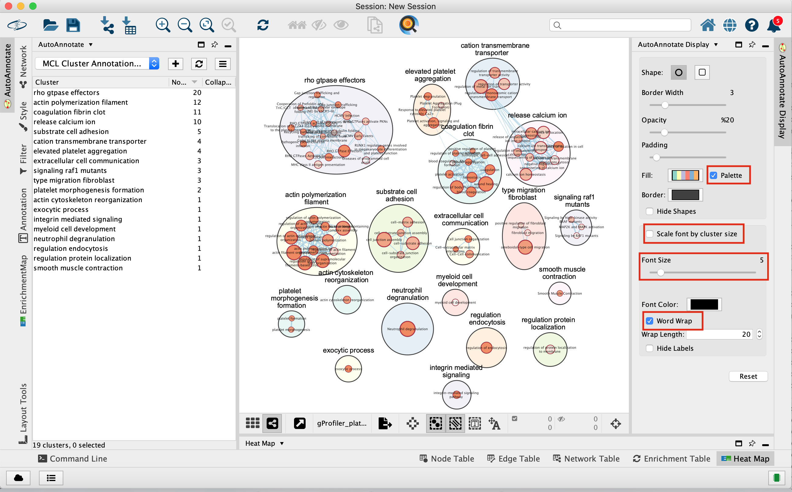

```{block, type="rmd-note"}
The boxes **Palette**, **Scale Font by cluster size** and **Word Wrap** have been selected. The clusters have been moved around for clarity.
```

## GSEA from pseudobulk
### pseudobulk creation, differential expression and rank file

We also can create pseudobulk data from the scRNA data by summing all cells into defined groups. We used the clusters to group the cells and we calculate  differential expression using edgeR. We compare the CD4 cells (Naive CD4 T and Memory CD4 T) and the monocytic cells (CD14+ Mono and "FCGR3A+ Mono) .

As shown in [module 3](#gsea_mod3), in order to perform pathway analysis,we prepare a rank file, run GSEA and create an enrichment map in Cytoscape.

* Data:
  * rank file: [CD4vsMono.rnk](./scRNAlab/data/CD4vsMono.rnk)
  * gmt file:  [Human_GOBP_AllPathways_noPFOCR_no_GO_iea_June_01_2024_symbol.gmt](./Module2/gsea/Human_GOBP_AllPathways_noPFOCR_no_GO_iea_June_01_2024_symbol.gmt)
 
## run GSEA:
  1. Open GSEA
  1. Select **Load Data**
  1. Drag and Drop the rank  [CD4vsMono.rnk](./scRNAlab/data/CD4vsMono.rnk) and gmt * [Human_GOBP_AllPathways_noPFOCR_no_GO_iea_June_01_2024_symbol.gmt](./Module2/gsea/data/Human_GOBP_AllPathways_noPFOCR_no_GO_iea_June_01_2024_symbol.gmt) files.
  1. Click on **Load these files**
  1. Click on **Run GSEAPreranked**
  1. In **Gene sets database**, click on the 3 dots, select **Local GMX/GMT** , select the gmt file, click on OK.
  1. Set the **Number of permutations** to 100
  1. Select the rank file: CD4vsMono.rnk
  1. Expand **Basic Fields**
  1. In the field **Collapse/Remap to gene symbols**, select **No_Collapse**
  1. Add an analysis name of your choice
  1. Set **Max size** to 200 and **Min size** to 10.
  1. Click on **Run**<br>

```{block, type="rmd-tip"}
Use 2000 permutations and MAX_Size to 1000 for your own analysis. You can decide to further reduce MAX_Size to 500 or 200. 
```
 
## Create an EnrichmentMap:
  1. Open Cytoscape
  1.  Go to **Apps** -> **EnrichmentMap**
  1. Select the EnrichmentMap tab, click on the + sign. A **Create Enrichment Map** windows pops up.
  1. Drag and drop the GSEA folder in the **Data Sets** window. It automatically populates the fields.
  1. Set the **FDR q-value cutoff** to 0.01 
  1. Click on **Build**<br>

  * The enrichment map is now created. The red nodes are pathways enriched in genes up-regulated in CD4 cells when compared to the monocytic cells. The blue nodes are pathways enriched in genes up-regulated in monocytic cells.<br>


See code below for your reference ( pseudobulk, differential expression and rank file). 
```{r eval=FALSE}
library(dplyr)
library(Seurat)
library(patchwork)
library(ggplot2)
library(AUCell)
library(RColorBrewer)
library(scuttle)
library(SingleCellExperiment)
library(edgeR)
library(affy)

names(new.cluster.ids) <- levels(pbmc)
pbmc <- RenameIdents(pbmc, new.cluster.ids)
counts <- pbmc@assays$RNA@counts 
metadata <- pbmc@meta.data
sce <- SingleCellExperiment(assays = list(counts = counts), colData = metadata)
sum_by <- c("seurat_clusters")
summed <- scuttle::aggregateAcrossCells(sce, id=colData(sce)[,sum_by])
raw <- assay(summed, "counts") 
colnames(raw) =   c("Naive_CD4_T", "CD14p_Mono", "Memory_CD4_T", "B", "CD8_T", 
                    "FCGR3Ap_Mono","NK", "DC", "Platelet")
saveRDS(raw, "raw.rds")

count_mx = as.matrix(raw)
myGroups = c("CD4","Mono" ,"CD4","B" , "CD8_T","Mono","NK", "DC","Platelet" )
y <- DGEList(counts=count_mx,group=factor(myGroups))
keep <- filterByExpr(y)
y <- y[keep,keep.lib.sizes=FALSE]
y <- calcNormFactors(y)
design <- model.matrix(~0 + myGroups )
y <- estimateDisp(y,design)
my.contrasts <- makeContrasts(CD4vsMono=myGroupsCD4-myGroupsMono, 
                              levels = design )
mycontrast = "CD4vsMono"
fit <- glmQLFit(y,design)
qlf <- glmQLFTest(fit,coef=2, contrast = my.contrasts[])
table2 = topTags(qlf, n = nrow(y))
table2 = table2$table
table2$score =  sign(table2$logFC) * -log10(table2$PValue)
myrank = cbind.data.frame(rownames(table2), table2$score)
colnames(myrank) = c("gene", "score")
myrank = myrank[ order(myrank$score, decreasing = TRUE),]
write.table(myrank, paste0(mycontrast, ".rnk"), sep="\t", row.names = FALSE, 
            col.names = FALSE, quote = FALSE)
```


```{block, type="rmd-tip"}
Some methods like AddModuleScore or AUCell do pathway enrichment analysis of each of cells and the enrichment results are usually display on the UMAP using a color code. It involves R coding and is out of the scope for this workshop.
```


<!--chapter:end:6.1-Module6_scRNAlab_PBMC.Rmd-->

# Module 6 lab 2- scRNA Glioblastoma {#scRNA_glioblastoma}

**This work is licensed under a [Creative Commons Attribution-ShareAlike 3.0 Unported License](http://creativecommons.org/licenses/by-sa/3.0/deed.en_US). This means that you are able to copy, share and modify the work, as long as the result is distributed under the same license.**
 
## Introduction

This lab uses scRNA from brain cancer (glioblastoma). The scRNA shows the heterogeneity of the sample, with varying cell types originating from cancer tissues and other cell types like immune cells. We will perform Over-Representation Analysis (ORA) using the gene list of each cluster type in  [g:Profiler](https://biit.cs.ut.ee/gprofiler/gost) to uncover the function of each cluster.

### Goal

The goal is to show how to build a **master enrichment map** from the results of scRNA. The scRNA is composed of different cell types. The cells are clustered, and annotated to different cell types which can be visualized as a UMAP, 2 dimensional plot. Pathways enrichment is run on the gene lists from each cluster followed by the creation of a single enrichment map containing all the results.

Note: This lab also shows the use of a custom background set in g:Profiler.

### Data
High-quality single-cell suspensions were generated by dissociating biopsied tissues in accutase and DNase fron patientGBM tumors. Library preparation was carried out as per the 10X Genomics Chromium single-cell protocol using the v2 chemistry reagent kit and sequencing was run on an Illumina 2500. 


### Overview
The practical lab contains 3 parts. The first part uses [g:Profiler](https://biit.cs.ut.ee/gprofiler/gost) to perform gene-set enrichment analysis.  The second part uses Cytoscape and EnrichmentMap to help interpret the results created in part 1. The third part is the one that we are going to practise during the lab and it consists of uploading the pathway results for each cluster on a same enrichment map.


## Part 1 - run g:Profiler [OPTIONAL] {#can-module8-exercise-1} 

g:Profiler requires a list of genes, one per line, in a text file or spreadsheet,
ready to copy and paste into a web page: for this, we use genes identified in the glioblastoma scRNA dataset (Richards et al, Nat Cancer, 2021). 14 cell clusters (0 to 14) were identified.


The 14 clusters  were further further classified into 5 cell types using specific gene markers.


The gene lists for each cluster were obtained from differential gene expression (DGE) analyses comparing cells from each cluster vs. the rest of the cells using Seurat's function 'FindAllMarkers(..., only.pos=T, min.pct = 0, return.thresh = 1, logfc.threshold = 0)'. For each cluster, the top 250 genes with FDR value equal or less than 0.05 were retrieved. All genes present in at least 1 cluster will be used as background (16066 genes) for the pathway enrichment analysis.


DGE: Table (top genes of cluster 3 versus all clusters)


link to file: [Richards_NatCancer_2021_DGE_GlobalClustering_SCT_wilcox.tsv.bz2](./Can_Module8/data/Richards_NatCancer_2021_DGE_GlobalClustering_SCT_wilcox.tsv.bz2)


For this part of the lab, our goal is to copy and paste the list of genes into g:Profiler, adjust some parameters (e.g selecting the pathway databases), run the query and explore the results.

g:Profiler performs a gene-set enrichment analysis using a hypergeometric test (Fisher’s exact test). The Gene Ontology Biological Process, Reactome and Wiki pathways are going to be used as pathway databases. The results are displayed as a table or downloadable as an Generic Enrichment Map (GEM) output file. 

Before starting this exercise, download the required files:

```{block, type="rmd-datadownload"}
Right click on link below and select "Save Link As...".

Place it in a folder on your computer : for example create a pathway_analysis folder and save all the files needed for this module in this directory.
```


* [cluster3.txt](./Can_Module8/data/cluster3.txt)
* [background.txt](./Can_Module8/data/background.txt) 

We recommend saving all these files in a personal project data folder before starting. We also recommend creating an additional result data folder to save the files generated while performing the protocol.   

### Step 1 - Launch g:Profiler.  

Open the g:Profiler website at [g:Profiler](https://biit.cs.ut.ee/gprofiler/gost) in your web browser.


### Step 2 - input query

Paste the gene list ([cluster3.txt](./Can_Module8/data/cluster3.txt)) into the Query field in top-left corner of the screen. 


```{block, type="rmd-note"}
The gene list can be space-separated or one per line.<br> The organism for the analysis, Homo sapiens, is selected by default.<br> The input list can contain a mix of gene and protein IDs, symbols and accession numbers.<br> Duplicated and unrecognized IDs will be removed automatically, and ambiguous symbols can be refined in an interactive dialogue after submitting the query. 
```

```{block, type="rmd-tip"}
Open the file in a simple text editor such as Notepad or Textedit to copy the list of genes. <br> Or right click on the file name above and select **Open link in new tab**
```

### Step 3 - Adjust parameters. 

3a. Click on the *Advanced options* tab (black rectangle) to expand it.

* Upload the custom background: Set *Statistical domain scope* to *Custom* and *Upload* the [background.txt](./Can_Module8/data/background.txt) text file.

* Set *Significance threshold* to "Benjamini-Hochberg FDR"

* *User threshold* - select 0.05 if you want g:Profiler to return only pathways that are significant (FDR < 0.05).


<p align="center">
  
 </p>


3b. Click on the *Data sources* tab (black rectangle) to expand it.

* UnSelect all gene-set databases by clicking the "clear all" button.
* In the *Gene Ontology* category, check  *GO Biological Process* and *No electronic GO annotations*.

```{block, type="rmd-note"}
*No electronic GO annotations* option will discard less reliable GO annotations (inferred from electronic annotations (IEAs)) that are not manually reviewed.
```

```{block, type="rmd-tip"}
If g:Profiler does not return any results: uncheck the *No electronic GO annotation* option to expand annotations used in the test.
```


* In the *biological pathways* category, check *Reactome* and *WikiPathways*.

<p align="center">
 
</p>

### Step 4 - Run query

Click on the *Run query* button to run g:Profiler. 

Scroll down page to see results. 

```{block, type="rmd-tip"}
If after clicking on *Run query* button the analysis completes but there is the following message above results file - *Select the Ensembl ID with the most GO annotations (all)*. For each ambiguous gene select its correct mapping. Ambiguous mapping is often caused by multiple ensembl ids for a given gene and are easy to resolve as a user. To choose the correct mapping, check the option that has the correct gene name and/or then that has the most GO annotations. Rerun query.
```


### Step 5 - Explore the results. 

Step 5a:

* After the query has run, the results are displayed at the bottom of the page, below the input parameters.
* By default, the "Results" tab is selected. A global graph displays gene-sets that passed the significance threshold of 0.05 for the 3 gene-set databases that we have selected, GO Biological Process(GO:BP) and  Reactome(REAC) and Wikipathways(WP). Numbers in parentheses are indicating the number of gene-sets that passed the threshold (0 gene-sets passed the 0.05 threshold for Reactome).


Step5b:

* Click on "Detailed Results" to view the results in more depth. Two tables are displayed, one for each of the data sources selected. (If more than 2 data sources are selected there will be additional tables for each datasource) Each row of the table contains:
    * **Term name** - gene-set name
    * **Term ID** - gene-est identifier
    * **Padj** - FDR value 
    * **-log10(Padj)** - enrichment score calculated using the formula -log10(padj)
    * variable number of gene columns (One for each gene in the query set) - If the gene is present in the current gene-set its cell is colored.  For any data source besides GO the cell is colored black if the gene is found in the gene-set.  For the GO data source cells are colored according to the annotation evidence code. Expand the legend tab for detailed coloring mapping of GO evidence codes. 

* Above the GO:BP result table, locate the slide bar that enables to select for the minimum and maximum number of genes in the tested gene-sets (Term size). 
 * Change the maximum *Term size* from 10000 to **500** and change the minimum *Term size* to **10**  and observe the results in the detailed stats panel:
 
 

   * Without filtering term size, the top terms were GO terms containing that could contain 4000 or 5000 genes and that were located high in the GO hierarchy (parent term). 
   * With filtering the maximum term size to 500, the top list contains pathways of larger interpretative values. However, please note that the adjusted pvalues was calculated using all gene-sets without size filtering.

The first table displays the gene-sets significantly enriched at FDR 0.05 for the GO:BP database.The second table displays the results corresponding to the Reactome database and the third table displays the results corresponding to the Wikipathways database.

```{block, type="rmd-note"}
You might get slighlty different results as the ones presented here because of the g:Profiler updated the pathway database.
```

```{block, type="rmd-tip"}
g:Profiler archived databases can be found using this link: https://biit.cs.ut.ee/gprofiler/page/archives.
```

### Step 6: Expand the stats tab
 Expand the *stats* tab by clicking on the double arrow located at the right of the tab.
 
 <p align="center">
 
 </p>
 
 It displays the gene set size (T), the size of our gene list (Q) , the number of genes that overlap between our gene list and the tested gene-set (TnQ) as well as the number of genes in the background (U). 
 

### Step 7: Save the results
 
7a.  In the *Detailed Results* panel, select "GEM" .  It will save the results in a text file in the "Generic Enrichment Map" format that we will use to visualize using Cytoscape.

   * Click on the GEM button. A file is downloaded on your computer. (change the name to Cluster3.gem.txt)
  
  
7b:  Open the file that you saved using Microsoft Office Excel or in an equivalent software.

Observe the results included in this file:

 1. Name of each gene-set
 1. Description of each gene-set
 1. significance of the overlap (pvalue)
 1. significance of the overlap (adjusted pvalue/qvalue)
 1. Phenotype
 1. Genes included in each gene-set

```{block, type="rmd-question"}
Which term has the best corrected p-value?  <br> Which genes in our list are included in this term? <br> Observe that same genes can be present in several lines (pathways are related when they contain a lof of genes in common).
```

```{block, type="rmd-note"}
The table is formatted for the input into Cytoscape EnrichmentMap. It is called the [*generic format*](https://enrichmentmap.readthedocs.io/en/latest/FileFormats.html#generic-results-files). The p-value and FDR columns contain identical values because g:Profiler directly outputs the FDR (= corrected p-value) meaning that the p-value column is already the FDR. Phenotype 1 means that each pathway will be represented by red nodes on the enrichment map (presented during next module). 
```

 


The terms *myelin* and *axon ensheathment* are the most significant gene-sets (=the lowest FDR value).  Many gene-sets from the top of this list are related to each other and have genes in common. 

 


---

### Step 8 (Optional but recommended)

8a. Download the pathway database files.

  * Go to the top of the page and expand the "Data sources" tab. Click on the 'combined name.gmt' link located at bottom of this tab. It will download a file named *combined name.gmt* containing a pathway database gmt file with all the available sources. 

<p align="center">
  
</p>


```{block, type="rmd-note"}
you will be using this optional gprofiler_full_hsapiens.name.gmt file in Cytoscape EnrichmentMap.
```     

---


## Part 2 - Cytoscape/EnrichmentMap [OPTIONAL] {#exercise-2}

### Goal of the exercise

**Create an enrichment map and navigate through the network**

During this exercise, you will learn how to create an enrichment map from gene-set enrichment results. The enrichment results chosen for this exercise are generated using g:Profiler but an enrichment map can be created directly from output from [GSEA](http://software.broadinstitute.org/gsea/index.jsp), 
[g:Profiler](https://biit.cs.ut.ee/gprofiler/gost),
[GREAT](http://great.stanford.edu/public/html/),
[BinGo](http://apps.cytoscape.org/apps/bingo), [Enrichr](https://amp.pharm.mssm.edu/Enrichr/) or alternately from any gene-set tool using the generic enrichment results format.


### Data

The data used in this exercise is pathway enrichment result from the list of genes that we found in cluster 3 in  [part 1](#can-module8-exercise-1). 
Pathway enrichment analysis has been run using g:Profiler and the results have been downloaded as a GEM format.


### EnrichmentMap

*	A circle (node) is a gene-set (pathway) enriched in genes that we used as input in g:Profiler (frequently mutated genes).

*	edges (lines) represent genes in common between 2 pathways (nodes).

*	A cluster of nodes represent overlapping and related pathways and may represent a common biological process.

*	Clicking on a node will display the genes included in each pathway.

### Description of this exercise

We run and saved g:Profiler result. 
An enrichment map represents the result of enrichment analysis as a network where significantly enriched gene-sets that share a lot of genes in common will form identifiable clusters. The visualization of the results as these biological themes will ease the interpretation of the results. 

The goal of this exercise is to learn how to:

  1. upload g:Profiler results into Cytoscape EnrichmentMap to create a map.
  1. learn how to navigate through Cytoscape EnrichmentMap and interpret the results.
  
### Start the exercise

Two files are needed for this exercise:

  1. Enrichment result:   [Cluster3_noEIA_gProfiler.gem.txt](./Can_Module8/data/Cluster3_noEIA_gProfiler.gem.txt) 
  * In g:Profiler, the parameters that we used to generate this file were:
    * GO_BP no electronic annotation, 
    * Reactome, 
    * Wikipathways
    * Benjamini-HochBerg FDR 0.05
    * gene-set size from 10 to 500
Note: this file is similar to the one that you have created in exercise 1. Use this link to follow exercise 2.

  2. Pathway database 1 (.gmt):[gprofiler_full_hsapiens.name.gmt](./Can_Module8/data/gprofiler_full_hsapiens.name.gmt)

```{block, type="rmd-datadownload"}
Right click on link below and select "Save Link As...".

Place it in the corresponding module directory of your pathway_analysis folder on your computer.
```


### Step 1

Launch Cytoscape and open the EnrichmentMap App

1a. Double click on Cytoscape icon

1b. Open EnrichmentMap App

*	In the Cytoscape top menu bar:

  *	Click on Apps -> EnrichmentMap

<p align="center">
  
</p>

 * A 'Create Enrichment Map' window is now opened.
 
### Step 2

Create an enrichment map from 1 dataset and with a gmt file.

2a. In the 'Create Enrichment Map' window, drag and drop the enrichment file  [Cluster3_noEIA_gProfiler.gem.txt](./Can_Module8/data/Cluster3_noEIA_gProfiler.gem.txt).
Tip: if drag and drop does not work, you can click ‘...’ next to enrichments and upload the file. The analysis type needs to be set to generic/gprofiler.


2b. On the right side, go to the *GMT* field, click on the 3 radio button (...) and locate the file gprofiler_full_hsapiens.name.gmt that you have saved on your computer to upload it.

2c. Locate the *FDR q-value cutoff* field and set the value to 0.01

2d. Click on *Build*.


* a status bar should pop up showing progress of the Enrichment map build.

<p align="center">
  
</p>
 
### Step 3: Explore Detailed results 

  * In the Cytoscape menu bar, select 'View" and 'Show Graphic Details' to display node labels. 
  
```{block, type="rmd-caution"}
Make sure you have unselected "Publication Ready" in the EnrichmentMap control panel.
```

  * Zoom in to be able to read the labels and navigate the network using the bird eye view (blue rectangle).

  * Select a node and visualize the *Table Panel*
    * Click on a node; Click on Dummy column. Genes with a green box are genes in the Cluster3 gene list and the selected pathway.
    
### Step 4 [OPTIONAL]: AutoAnnotate the enrichment map

 * move the the nodes and clusters apart of each other by selecting them and moving them around.
 
 * In the Cytoscape menu bar, select Apps --> AutoAnnotate --> New Annotation Set...
 
 * An "AutoAnnotate: Create Annotation Set" window opens. In "Advanced" tab, check "Create singleton clusters" and click on "Create Annotations".
 
 
  
 Tips for formatting:
 
 * In the *AutoAnnotate Display* window located on the right side, uncheck *Scale font by cluster size* and check *Word Wrap*.
 
  
  
 Tip: if you are having difficulty separating  nodes/clusters, you can hold shift and click and drag a square around a nodes of interest to highlight them, then move them all at once.
    

```{block, type="rmd-caution"}
SAVE YOUR CYTOSCAPE SESSION (.cys) FILE ! 
```

## Part 3 - Master map using multiple datasets {#exercise-3} 

### Goal

**Create an enrichment map and navigate through the network**

During this lab, you will learn how to create an enrichment map from multiple gene-set enrichment results generated using g:Profiler. 

### Data

 * The data used in this exercise is the enrichment results from the list of genes of clusters that we found in clusters 0, 1, 3, 4, 5, 7, and 10 from the single cell RNAseq data. 

 * Pathway enrichment analysis has been run using g:Profiler and the results have been downloaded as a GEM format.

 * The gene lists were obtained from differential gene expression analyses comparing cells from each cluster vs. the rest of the cells using Seurat's function 'FindAllMarkers(..., only.pos=T, min.pct = 0, return.thresh = 1, logfc.threshold = 0)'. For each cluster, the top 250 genes with FDR value equal or less than 0.05 were retrieved.
 
 * In g:Profiler, the parameters that we used to generate this file were:
  * GO_BP no electronic annotation, 
  * Reactome, 
  * Wikipathways
  * Benjamini-HochBerg FDR 0.05
  * gene-set size from 10 to 500
  * Top 50 pathways were selected for further analysis.
    
### Start the exercise

Download the files needed for this exercise on your computer: 

 * [Cluster0_gProfiler50.gem.txt](./Can_Module8/data/Cluster0_gProfiler50.gem.txt) 
 * [Cluster1_gProfiler50.gem.txt](./Can_Module8/data/Cluster1_gProfiler50.gem.txt) 
 * [Cluster3_gProfiler50.gem.txt](./Can_Module8/data/Cluster3_gProfiler50.gem.txt) 
 * [Cluster4_gProfiler50.gem.txt](./Can_Module8/data/Cluster4_gProfiler50.gem.txt) 
 * [Cluster5_gProfiler50.gem.txt](./Can_Module8/data/Cluster5_gProfiler50.gem.txt) 
 * [Cluster7_gProfiler50.gem.txt](./Can_Module8/data/Cluster7_gProfiler50.gem.txt) 
 * [Cluster10_gProfiler50.gem.txt](./Can_Module8/data/Cluster10_gProfiler50.gem.txt) 

Launch Cytoscape and open the EnrichmentMap App

### Step 1

1a. Open Cytoscape.

1b. Open EnrichmentMap App:

*	In the Cytoscape top menu bar:

  *	Click on Apps -> EnrichmentMap

<p align="center">

</p>

 * A 'Create Enrichment Map' window is now opened.
 
### Step 2

Create an enrichment map from multiple datasets.

2a. In the 'Create Enrichment Map' window, drag and drop the enrichment files 

 * [Cluster0_gProfiler50.gem.txt](./Can_Module8/data/Cluster0_gProfiler50.gem.txt) 
 * [Cluster1_gProfiler50.gem.txt](./Can_Module8/data/Cluster1_gProfiler50.gem.txt) 
 * [Cluster3_gProfiler50.gem.txt](./Can_Module8/data/Cluster3_gProfiler50.gem.txt) 
 * [Cluster4_gProfiler50.gem.txt](./Can_Module8/data/Cluster4_gProfiler50.gem.txt) 
 * [Cluster5_gProfiler50.gem.txt](./Can_Module8/data/Cluster5_gProfiler50.gem.txt) 
 * [Cluster7_gProfiler50.gem.txt](./Can_Module8/data/Cluster7_gProfiler50.gem.txt) 
 * [Cluster10_gProfiler50.gem.txt](./Can_Module8/data/Cluster10_gProfiler50.gem.txt) 
 
2b. Locate the *FDR q-value cutoff* field and set the value to 0.01

2c. Click on *Build*.

<p align="center">

</p>

 * A status bar should pop up showing progress of the Enrichment map build.

 * Click "ok" on the 2 next messages:
 
 <p align="center">

</p>

<p align="center">

</p>

<p align="center">

</p>


2d. Once the map is build, locate the EnrichmentMap tab on the right and set *Chart Data* to *Color by Data Set*. 


```{block, type="rmd-tip"}
Tip: You can also check "publication ready" to remove node labels.
```

2e. Change the color of each data set so it corresponds to the single cell RNAseq UPMAP plot 
 * Locate the EnrichmentMap tab on the right and click on *Change colors...*

<p align="center">

</p>


 * Adjust the colors so it corresponds approximately to the single cell RNAseq UMAP plot (see top of the document for reference). 
 
<p align="center">

</p>


 * Go to the AutoAnnotate tab on the right and uncheck "Hide labels" and "Hide shapes".
 
It will make visible the AutoAnnotate ellipses and automatic labels. You can further adjust the style of these annotations.

At that step, the layout is not optimal and the ellipses are overlapping. 
It is possible to click on the annotations on the left bar to select all nodes of a cluster and move the annotations.
 
<p align="center">

</p> 


<p align="center">

</p> 


```{block, type="rmd-tip"}
To get a layout that is not overlapping, you can do:
- Go the AutoAnnotate tab on the right.

- Click on "Layout..." and select "Layout Clusters to Minimize Overlap"

- Play with the "Scale" slidebar to get the clusters closer together.

- Finish by adjusting manually.
```

<p align="center">

</p>

 * **Final Map**:

<p align="center">

</p>

* **Legend**:
<p align="center">

</p>

* **Clusters**:

 - 0: macrophage  

 - 1: malignant 

 - 3: macrophage 

 - 4: oligodendrocyte  
 
 - 5: undefined 

- 7: T cell 

- 10: undefined 

 
The master map can help to identify functions related to interesting clusters in the data like the "undefined" cluster. It also can highlight similarities between clusters. 


```{block, type="rmd-caution"}
SAVE YOUR CYTOSCAPE SESSION (.cys) FILE ! 
```
############################################################
 * **Cytoscape file: **

 * [scRNAgprofiler.cys](./Can_Module8/data/scRNAgprofiler.cys) 


<!--chapter:end:6.2-Module6_scRNAlab_glioblastoma.Rmd-->

# Module 6 lab 3: cellPhoneDB {#scRNA_cellPhoneDB}

**This work is licensed under a [Creative Commons Attribution-ShareAlike 3.0 Unported License](http://creativecommons.org/licenses/by-sa/3.0/deed.en_US). This means that you are able to copy, share and modify the work, as long as the result is distributed under the same license.**
 

## Cell-Cell communication in scRNA: CellPhoneDB 

 * **Learning objectives**: learn how to take the result of CellPhoneDB and build a Cytoscape network. 

### Presentation
  1. CellPhoneDB is  a repository of ligands, receptors and their interactions. CellPhoneDB database takes into account the subunit architecture of both ligands and receptors, representing heteromeric complexes accurately. A statistical framework is integrated that predicts enriched cellular interactions between two cell types from single-cell transcriptomics data

  1. CellPhoneDB database: public resources to annotate receptors and ligands, as well as manual curation of specific families of proteins involved in cell–cell communication

  1. possibility of using own list of ligand–receptor interactions 


### Method
  1. CellPhoneDB input data consist of a scRNA-seq counts file and cell-type annotation. 

  1. Enriched receptor–ligand interactions between two cell types are derived on the basis of expression of a receptor by one cell type and a ligand by another cell type. The member of the complex with the minimum average expression is considered for the subsequent statistical analysis. 

  1. A null distribution of the mean of the average ligand and receptor expression  in the interacting clusters is generated by randomly permuting the cluster labels of all cells.

  1. The p value for the likelihood of cell-type specificity of a given receptor–ligand complex is calculated on the basis of the proportion of the means that are as high as or higher than the actual mean (=empirical pvalue). 

  1. Ligand–receptor pairs are ranked on the basis of their total number of significant p values across the cell populations. 


**Summary of the steps**: 

The dataset consists of ~25k peripheral blood mononuclear cell (PBMCs) from 8 pooled lupus patients, each before and after IFN-β stimulation.

 - **Preparing the scRNA using your method of choice**:
  Standard preprocessing consists of filtering out bad quality cells, normalizing, clustering and annotating the cells. In this case, the cells are different types of blood cells and they were annotated using specific cell markers for these different cell types. 
 
 - **Let's explore the UMAP**:


 UMAP (Uniform Manifold Approximation and Projection) is frequently used in scRNA to display the data in 2 dimensions.  The UMAP on the right displays all the cells that are clustered based on cell types.  It helps visualizing groups of cells that are close together. The colors on the UMAP represent clusters of cells that were annotated into distinct blood cell types. 
The UMAP on the left shows that the cells are coming from different samples: untreated PBMC cells and cells treated with interferon beta (IFN-β). For this exercise, we are only examinig the cells that are IFN-β stimulation (labelled as stim the above UMAP).
 
 The scRNA data is available from the Jupyter notebook but are also here in case it is needed: [scRNA_25PBMC.h5ad](./scRNAlab/CPDB_lab/data/scRNA_25PBMC.h5ad)

### Examining the results

In this case study, we filtered the results to include only interactions where the source are the CD8 T cells sending communication signals to CD4 T and NK cells. We retained significant results with p-value less than 0.05. The choice to include just CD4 and NK cells only was an arbitrary threshold for this lab that was based on the observation of robust ligand signals for the CD8 T cells. In real life, we suggest that you look at all the possible significant interactions in each pair of cells and also consider the biological question under investigation. 


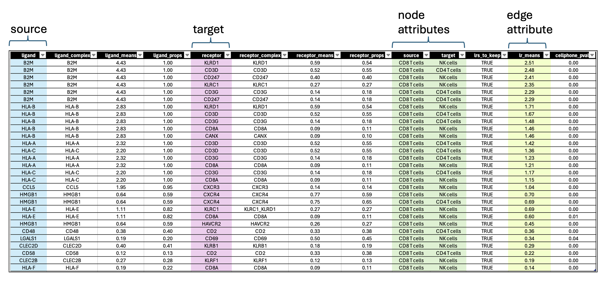

 - each row contains a ligand-receptor pair with a different combination of source and target for each row. 
 - *lr_means* : (ligand-receptor means) is the average of ligand and receptor expression means. 
 - *pvalue* : indicates if this mean is far away from the mean of the null distribution.
 - *lrs_to_keep* : indicates rows (ligand-receptor pairs) to keep based on the pvalue
 - *props* : represents the proportion of cells that express the entity 


### Visualization using Cytoscape

A network is aimed to ease the visualization of relationships between entities. 
We will construct a directed network using the ligands from the CD8 T cells as source nodes and the detected receptors from CD4 T cells and NK cells as target nodes. The ligand and receptor entities will be represented as nodes on the network and we will color the nodes based on the cell types.
The edge width will be proportional to the lr_means which represents the average of ligand and receptor mean expression and which is our measure of interaction strength. 

To create this network, we don't need any particular Cytoscape app. We will upload the CellPhoneDB result table as a custom network.


**STEPS TO FOLLOW**:

```{block, type="rmd-datadownload"}
The filtered result from the Liana method can be found here: [cellphoneDB_source_CD8_target_CD4_NK_p_0_05.csv](./scRNAlab/CPDB_lab/data/cellphoneDB_source_CD8_target_CD4_NK_p_0_05.csv)
Please download the file as you need it to create the network.
```

 - Open Cytoscape.
 - Go to the menu bar --> File --> Import --> Network from File ...
 


 - Select the file 'cellphoneDB_source_CD8_target_CD4_NK_p_0_05.csv' and click on 'open'.

 - An 'Import from Network table' opens.
 
 - Set 'ligand' as source node.
 

 
 - Set 'receptor' as target node.
 


- Set source and target as 'Source Node Attribute'.


- Click on 'OK'.

- The network is created with the default style. 


- Go to the 'Style' tab and change 'Style' from 'Default' to 'Directed'.

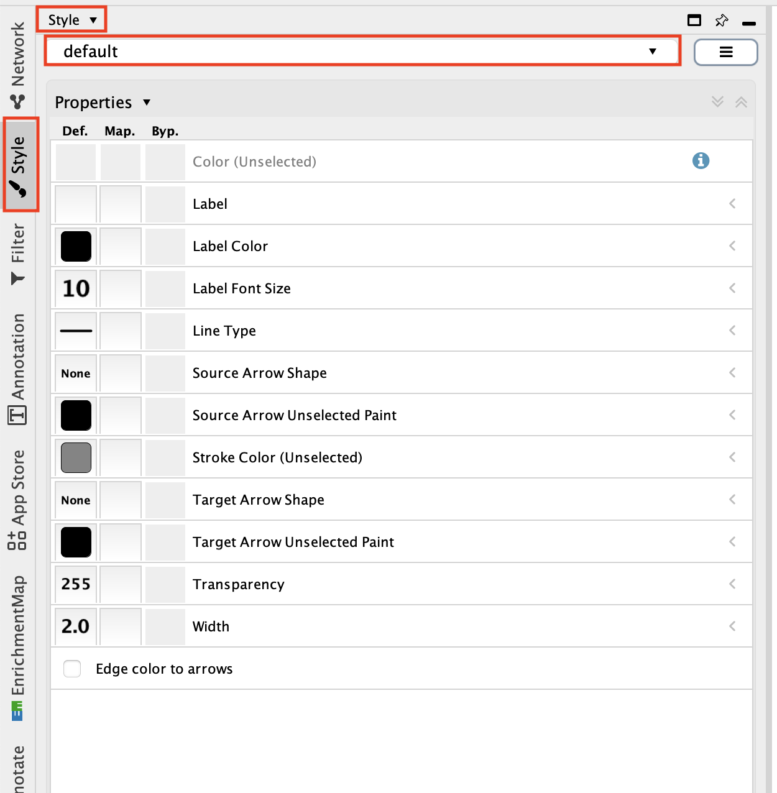


  * **Adjust the node style**.
   * Go to the 'Style' tab and make sure that the 'Node' tab is selected.
   * Adjust the 'Fill Color':
   
     1. Click on "Fill Color".
     2. Click on the down arrow.
     3. Set 'Column' to 'target'. 
     4. Set 'Mapping Type' to "Discrete Mapping' and click on the blanck space and on the "..." to set a color.

   * Set 'Label Font Size' to '16'.
   * Set 'Size' to '60'.
 
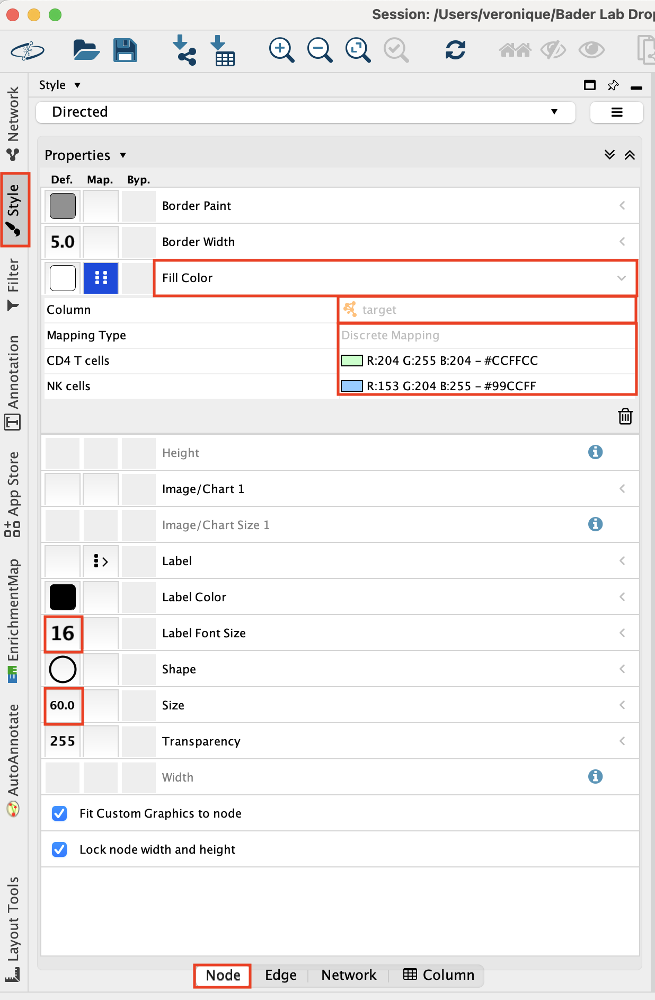

  * **Adjust the edge style**.
   * Go to the 'Style' tab and make sure that the 'Edge' tab is selected.
   * Set "Label" to "lr_means".
   * Set "Width" to "lr_means".
   * Set "Width" - "Mapping type" to 'Continuous Mapping'

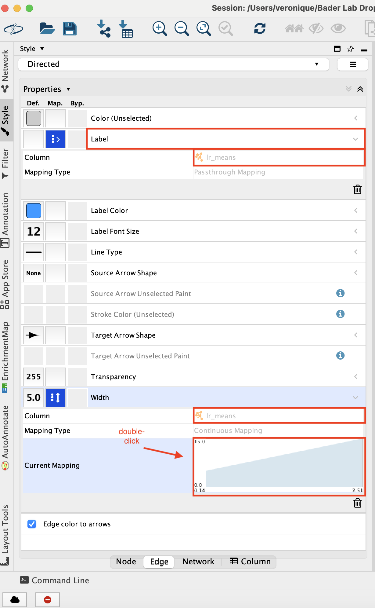

   * Double click on the chart that shows up to adjust the parameters.  
   * Adjust minimum width to 5 adn maximum width to 15  - 
   * Click on the top arrow and then set the edge width to 5. Press enter to register the change.  
   
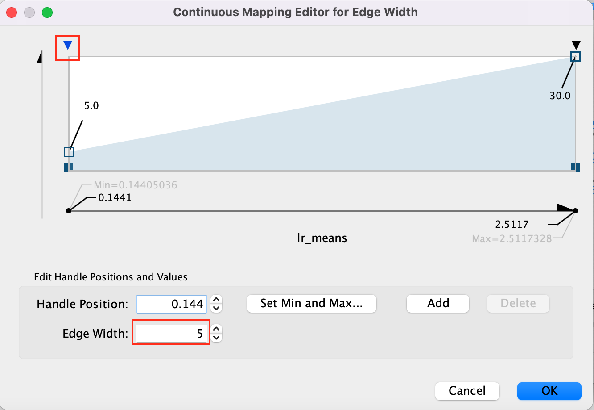
   
   * Click on the top right arrow and then set the edge width to 15. Press enter to register the change.
   
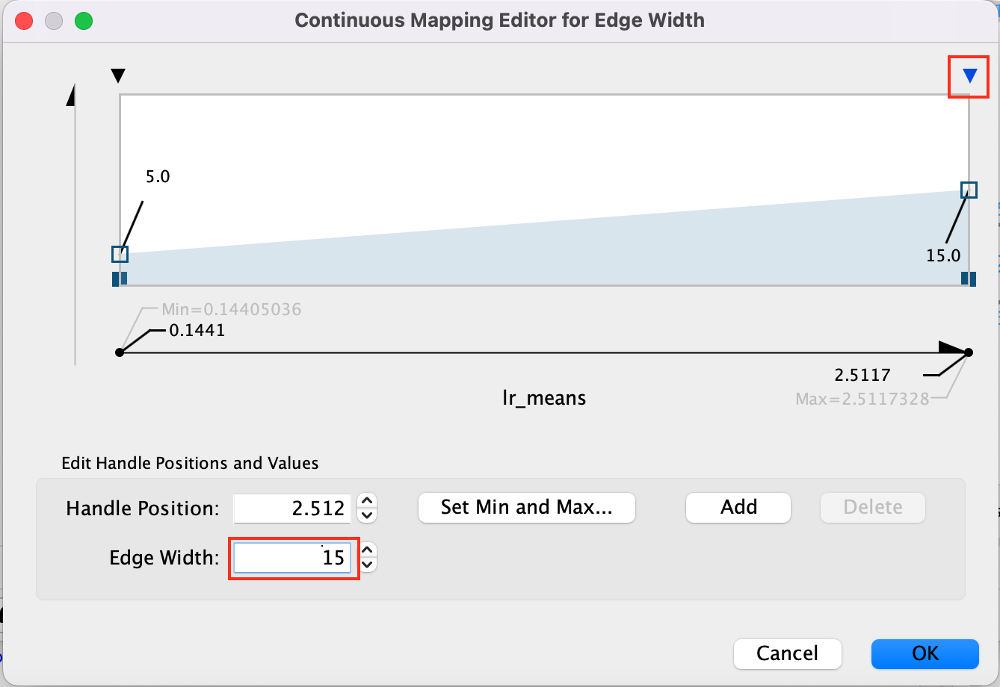

   * Here is the resulting network:
   
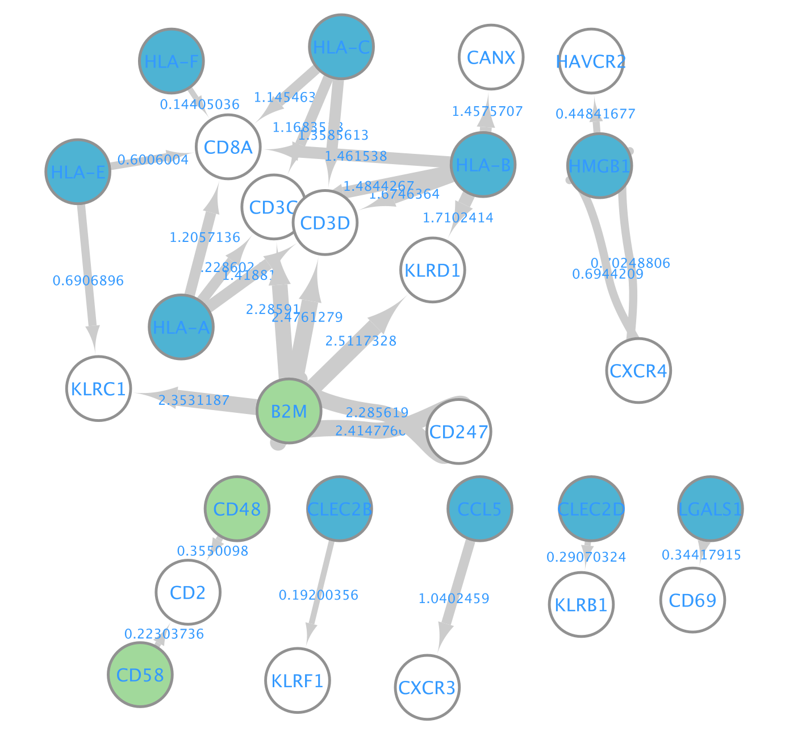

  * **Align the nodes** so that the ligands from the CD8 cells are in the middle and the receptors from NK and CD4 cells on the left and right side.
  *  You can do it manually. Alternatively, you can use the layout tools.
   
   
   
  * Select the nodes of interest, go to the 'layout tools' and click on a align or distribute option.
   
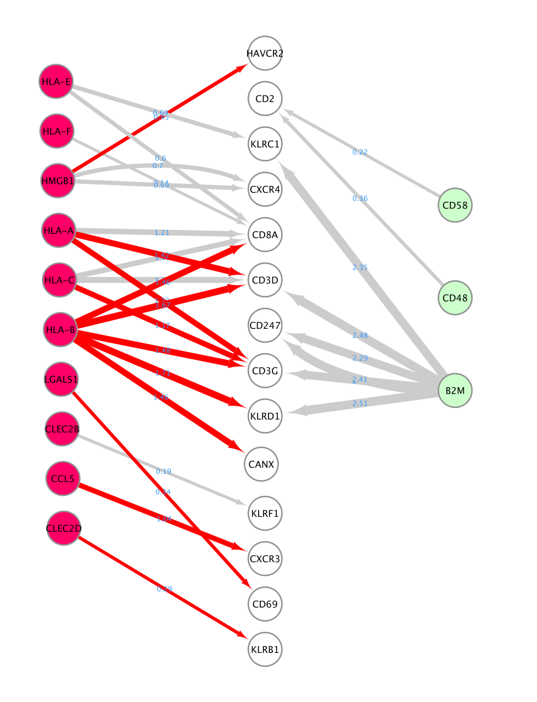

  * **Add annotation**:
    * Right click on a blank space and add an annotation.
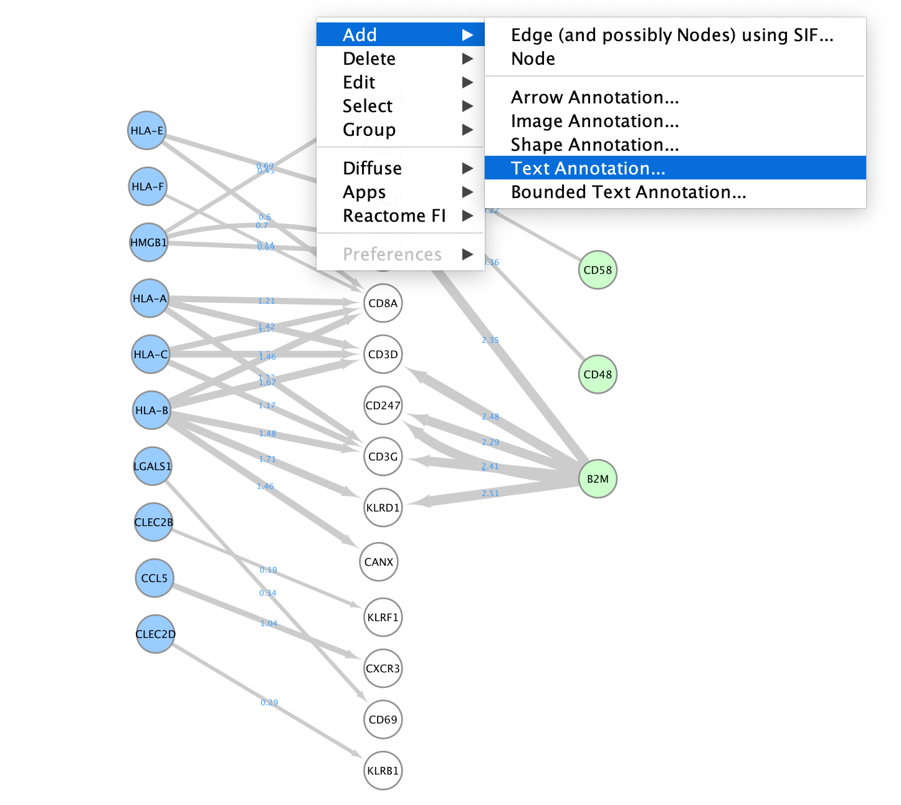

  * Here is the final result:


  *  Do not forget to **save your** session. You can also export the network as an image.


### Dataset and references 
**Reference paper**: Multiplexed droplet single-cell RNA-sequencing using natural genetic variation. [Kang et al. Nat Biotechnol. 2018 Jan;36(1):89-94.](https://www.nature.com/articles/nbt.4042), [PMID: 29227470](https://pubmed.ncbi.nlm.nih.gov/29227470/)

References used to build the Jupyter notebook and run CellPhoneDB:

  1. https://pypi.org/project/cellphonedb/
  
  1. https://cellphonedb.readthedocs.io/en/latest/RESULTS-DOCUMENTATION.html#p-value-pvalues-txt-mean-means-txt-significant-mean-significant-means-txt-and-relevant-interactions-relevant-interactions-txt
  
  1. https://github.com/ventolab/CellphoneDB
  
  1. https://www.sc-best-practices.org/mechanisms/cell_cell_communication.html
  
  1. https://zktuong.github.io/ktplots/articles/vignette.html


### Dataset preprocessing and running CellPhoneDB  {#dataset_prep}

```{block, type="rmd-warning"}
Do not run during practical lab. This is for your information only.
```

CellPhoneDB is a python package. Running CellPhoneDB is out of score for this lab but the annotated code is included in totality in this Jupyter notebook and is available for download using these links :

[CellPhoneDB_jupyter_notebook.pdf](./scRNAlab/CPDB_lab/data/CellPhoneDB_jupyter_notebook.pdf) 
 
[CellPhoneDB_jupyter_notebook.ipynb](./scRNAlab/CPDB_lab/data/CellPhoneDB_jupyter_notebook.ipynb) 

Some installation instructions are placed at the top of the document.


 - **Running CellPhoneDB**:
 The provided Jupyter notebook contains 2 methods to run CellPhoneDB.
 The first method is to run CellPhoneDB using the Liana package. This method is simple and allows for the comparison with other cell-cell communication tools also included in the Liana package. (See part 1 of the notebook). 
 The second approach is to run it directly from the CellPhoneDB package. It offers the advantage to choose the version of the ligand-receptor database and to run it from 3 offered methods: basic, statistical and DEG-based. This is part 2 of the notebook.
 
 Please consult the CellPhoneDB webpage and gihub links provided at the top of the document as they contain detailed information and tutorials.


<!--chapter:end:6.3-Module6_scRNAlab_PBMC2024.Rmd-->

# Module 6 lab 4: NEST {#scRNA_NEST}

**This work is licensed under a [Creative Commons Attribution-ShareAlike 3.0 Unported License](http://creativecommons.org/licenses/by-sa/3.0/deed.en_US). This means that you are able to copy, share and modify the work, as long as the result is distributed under the same license.**
 
Authors: Veronique Voisin, Ruth Isserlin, Chaitra Sarathy, Fatema Zohora and Gregory Schwartz

## Cell-Cell Communication (CCC) in spatial transcriptomics using NEST 


```{block, type="rmd-note"}
The presentation and processing of spatial transcriptomics is out of scope for this lab. Please refer to the [CBW Spatial Transcriptomics workshop](https://bioinformatics.ca/workshops-all/2024-introductory-spatial-omics-analysis-toronto-on/) or to this [review article](https://genomemedicine.biomedcentral.com/articles/10.1186/s13073-022-01075-1) or [this one](https://nature.com/articles/s41576-021-00370-8) for additional information. 
```


This lab uses examples from the [10X Visium technology](https://www.10xgenomics.com/products/spatial-gene-expression)

 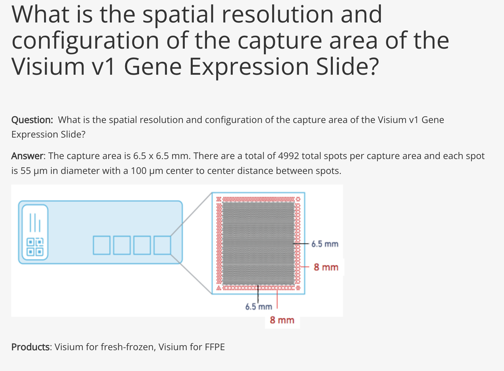


### NEST (NEural network on Spatial Transcriptomics)

[NEST reference paper (bioRXIv)](https://www.biorxiv.org/content/10.1101/2024.03.19.585796v1): Spatially-mapped cell-cell communication patterns using a deep learning-based attention mechanism: 

  1. Cells can communicate in 3 ways through direct contact, local chemical signaling or long-distance hormonal signaling. Paracrine signaling acts on nearby cells, endocrine signaling uses the circulatory system to transport ligands, and autocrine signaling acts on the signaling cells.
  
  1. Cell-cell communication (CCC) between neighbouring cells occur via soluble signals. Cells utilize a system of surface-bound protein receptors and ligand pairs to communicate. The ligand from Cell A (source) will bind to the receptor of Cell B (target). It will trigger a signaling cascade that helps Cell B to adapt to its environment. <br><p align="center">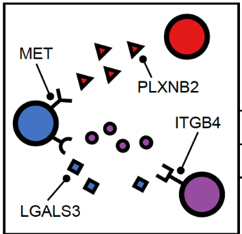</p>
  
  1. Spatial transcriptomics offers an advantage for studying cell-cell communication as it preserves cellular neighborhoods and tissue microenvironments. <br><p align="center">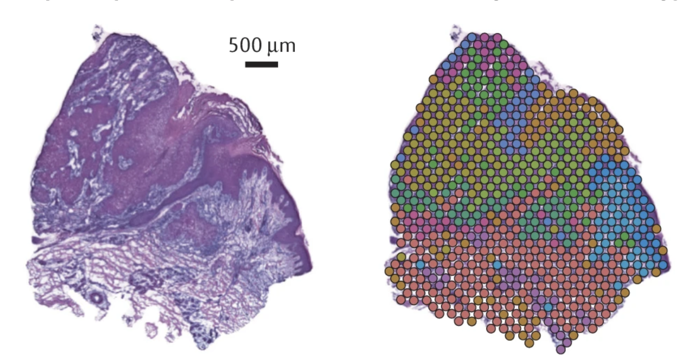</p>
 
  1. The goal of NEST is to predict probable cell cell communication interactions using a deep learning approach. It uses ligand-receptor pairs information and  NEST goal is to discover re-occuring CCC patterns in the data.
 
  1. It uses a graph attention network (GAT) paired with an unsupervised contrastive learning approach to decipher patterns of communication while retaining the strength of each signal. It then uses Depth first Search (DFS) to define subgraphs to be retained after filtering the top edges using the attention score from GAT.
  
The final knowledge-graph (=network) is composed of cells (or spots) that are represented as vertices (nodes) and edges which represent different types of neighborhood relations (cell cell communication interaction).<br><p align="center">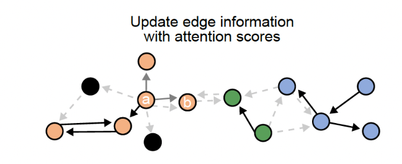</p>
  

 * Input data:

 NEST needs two types of information as input data: 
   * The first is the transcriptomics data with the spatial information from our biological sample (left side) and is composed of a feature matrix containing the gene expression raw counts and the postion matrix of the cells or spots. 
   * The second is a database of all known ligand-receptor pairs. This database is precomputed by NEST.

 * Step1:
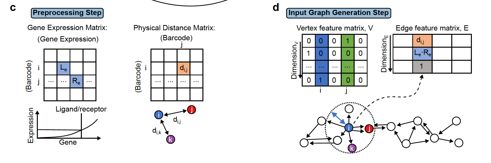
The first step is preprocessing step which includes filtering cells/spots and quantile normalization. 

 * Step2:
Two important pieces information are collected:
   * The physical distance between all cells are collected and  if 2 cells are close to each other, they are linked by an edge in the resulting network. 
   * the presence of ligand-receptor interaction for each pair of cells. The graph (network)connects all cells that are physically close and this edge stores the ligand-receptor information between the 2 cells.

 * Step3:

The third step involves the deep learning step that will output the final graph.  The final graph retains only the edges that pass a certain threshold of the attention score. Top 20 edges are retained by default. This graph is then divided into subgraphs by the DFS algorithm. The subgraphs are represented by different colors and can be interpreted as regions of cells that are communicating a lot.  

 * Step4:
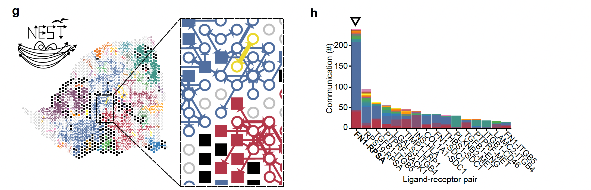

The last step is the visualization of the results of the final graph with all the ligand-receptor pairs that are the most probable cell cell communication interactions in the data under study. This is the step that we are going to explore in the lab using the NEST-interactive tool.

On the left, we see the reconstruction of the tumor section (Visium output)), the squares represent tumor cells and open circles represent stromal cells and the arrows represent the communication between the cells (ligand-receptor pairs). The different colors represent the subgraphs from the final graph of step 2.
On the right, we see the histogram representing the top 20% ligand-receptor pairs that are the most represented in this dataset and evaluated by NEST and the colors are related to the subgraphs.

### How to run NEST

```{block, type="rmd-caution"}
**NOTICE!**

**Do not run this part during the workshop.** 

NEST requires a graphical processing unit (GPU) to run and it is best to run it on a supercomputer (cluster). Running time and memory usage depend on the input data size. 

NEST was run with 79,795 edges (each representing a ligand-receptor pair) and 1,406 vertices (each representing a Visium spot), and took 5 hours with 2.44 GB memory for each run. NEST is typically run 5 times. 

Below is the information to be able to run NEST on your own after the workshop. This information is taken from the [NEST github page](https://github.com/schwartzlab-methods/NEST). 
```


NEST is written in the python language. 

NEST is available as a [Singularity image](https://docs.sylabs.io/guides/2.6/user-guide/introduction.html). Similar to Docker, it enables easy usage of NEST without set up of required environment and python packages. Furthermore, Singularity is usually installed on supercomputer/cluster system.

Steps that you would follow to run NEST:

 * **Step1**:
   -  Login to your cluster system and create a folder that will store all NEST input and output data.
   -  Check that Singularity is installed on the cluster; check that cluster node is connected to internet
   -  pull the NEST singularity image
   -  all instructions are listed here: https://github.com/schwartzlab-methods/NEST/blob/main/vignette/running_NEST_singularity_container.md
  
```
mkdir nest_container 
cd nest_container
singularity pull nest_image.sif library://fatema/collection/nest_image.sif:latest

#First time running NEST, go to NEST directory and run:
sudo bash setup.sh
```
  
 * **Step2**: prepare your input data. 
NEST takes 2 inputs: 

   -  [ligand-receptor database](https://github.com/schwartzlab-methods/NEST/blob/main/database/NEST_database.csv):  The default database provided by the model is a combination of the CellChat and NicheNET databases, totaling 12,605 ligand-receptor pairs. You can upload your own custom database if you are working with a different model organism.
   
   -  a spatial transcriptomic data set containing:
     * the spatial data that contains the image and the spot localization
     * the feature matrix that contains the gene expression in each spot (in h5 format)
     
 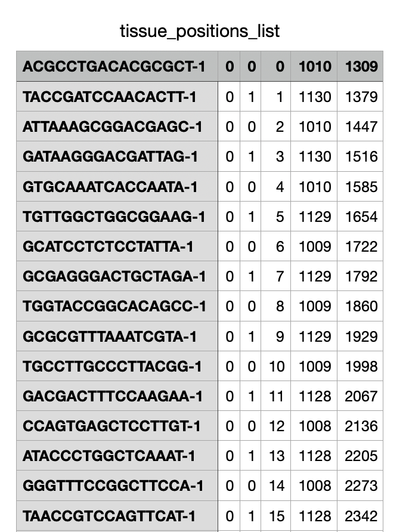    
     
 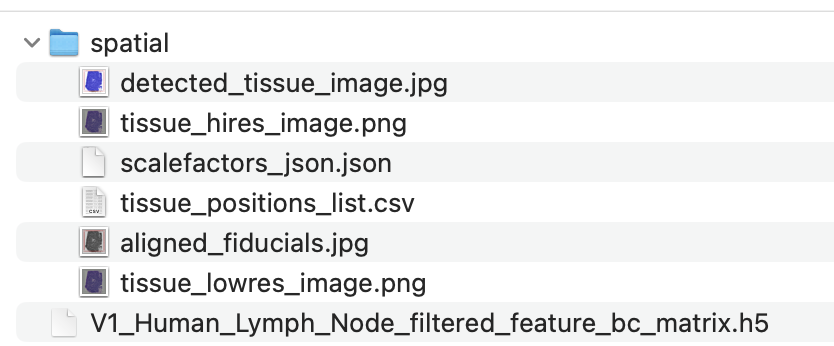    
     
 ```{block, type="rmd-tip"}
 NEST requires the position matrix (tissue_position_list.tsv) and the feature matrix file. If you are working with Visium 10x, you can simply give the path to the space ranger output folder to run NEST. If you are working with other technologies, you can simply look at the format of the position and feature matrices and use this format as NEST input with your own data.
 
 ```
     
     
 * **Step3**: running NEST

 Preprocess
```
nest preprocess --data_name='V1_Human_Lymph_Node_spatial' --data_from='data/V1_Human_Lymph_Node_spatial/'
```

 Train the model
```
nohup nest run --data_name='V1_Human_Lymph_Node_spatial' --num_epoch 80000 --model_name='NEST_V1_Human_Lymph_Node_spatial' --run_id=1 > output_human_lymph_node_run1.log &
nohup nest run  --data_name='V1_Human_Lymph_Node_spatial' --num_epoch 80000 --model_name='NEST_V1_Human_Lymph_Node_spatial' --run_id=2 > output_human_lymph_node_run2.log &
nohup nest run  --data_name='V1_Human_Lymph_Node_spatial' --num_epoch 80000 --model_name='NEST_V1_Human_Lymph_Node_spatial' --run_id=3 > output_human_lymph_node_run3.log &
nohup nest run  --data_name='V1_Human_Lymph_Node_spatial' --num_epoch 80000 --model_name='NEST_V1_Human_Lymph_Node_spatial' --run_id=4 > output_human_lymph_node_run4.log &
nohup nest run  --data_name='V1_Human_Lymph_Node_spatial' --num_epoch 80000 --model_name='NEST_V1_Human_Lymph_Node_spatial' --run_id=5 > output_human_lymph_node_run5.log &
```

 Postprocess the model output
```
nest postprocess --data_name='V1_Human_Lymph_Node_spatial' --model_name='NEST_V1_Human_Lymph_Node_spatial' --total_runs=5 
```

```{block, type="rmd-caution"}
Please follow the [NEST github page](https://github.com/schwartzlab-methods/NEST/tree/main) for complete instructions and vignette to run NEST
```


```{block, type="rmd-note"}
We are going to visualize the result using NEST-interactive but please note that a command line for visualization is also available in NEST:

nest visualize --data_name='V1_Human_Lymph_Node_spatial' --model_name='NEST_V1_Human_Lymph_Node_spatial'

```

### Practical lab : Pancreatic Ductal Adenocarcinoma (PDAC)

 * **PRESENTATION OF THE DATA**:

For this practical, we are working with PDAC and a tissue from a patient, PDAC_64630 , measured by Visium 10X. 
PDAC is recognized as a highly aggressive disease. There is immense transcriptional diversity defining discrete "Classical" and "Basal" subtypes.
A PDAC tumor microenvironment is heterogeneous and consists of tumor, stromal and immune cells.


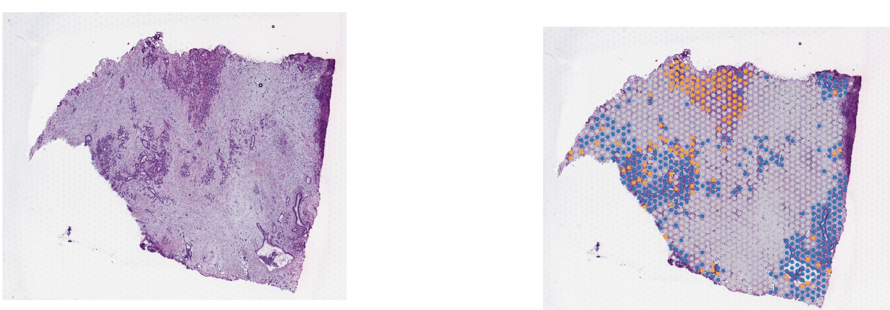

On these images, we can see the tissue section with the H&E stain on the left and we can see the Visium output on the right. The tumor regions were labelled classical (blue) and basal (red) based on some gene markers. In the middle of the tissue section,  regions of stroma are colored in grey. 

**Goal and learning objective**: 
  - Learn how to run NEST-interactive and how to make biological inferences from the cell cell communication graph coming from the NEST output.
  - We will explore cell cell communication subgraphs that are localized to different regions of the tissue section: stroma, classical or basal regions.
  - We will explore some specific ligand-receptor pairs.


 * **LAUNCH THE DOCKER**:
  1. Open docker desktop (If docker is already running you can find the docker icon in your task bar. Right click on the icon and select “Go to Dashboard”). 
  
  2. We are going to run the Docker image that you have installed during the [prework](https://docs.google.com/forms/d/13P-_9JbV5BGVUPznoiy6jmVWQ9Qw6-lH_dC7h_juN48/edit) .

  3. Open a terminal window and type the command below to launch NEST interactive:
 
  ```
  docker run -p 8080:8080 -p 8000:8000 risserlin/nest_docker:pancreatic
  ```

  4. Open a web browser and go to http://localhost:8080/HTML%20file/NEST-vis.html
  
Adjust the window size or zoom out if necessary.
 


We see the Visium output of the tumor section on the left. The grey circles represent the tumor spots and the squares represent the stroma spots.
Only the top 1300 edges which are the top ligand-receptor pairs based on the association score are shown. 
The different colors of the graph represent the different subgraphs computed by the last step of NEST ((DFS). Each subgraph groups cells that are communicating a lot together. 

On the right, the histogram represents the frequency of each ligand-receptor pair on the graph. A ligand-receptor can be present in different subgraphs (represented by different colors).


 * **STEPS TO FOLLOW**:

  1. Change color by **vertex type**: tumor - red.
    -  Select 'Vertex Type' to 'tumor' and change the color to red. Click on 'Change'.
  
 
  

  2. Click on the **first signal on the histogram plot**. What is the first signal? Look at the literature to interpret the condition.
  
 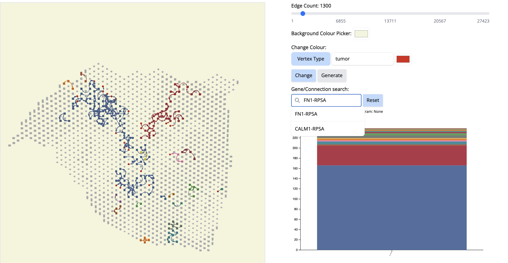

   Answer: --The first signal is  FN1. Fibronectin (FN1) is considered one of the main extracellular matrix constituents of pancreatic tumor stroma. High stromal FN1 expression associated with more aggressive tumors in patients with resected PDAC. Likewise, the cell membrane receptor Ribosomal Protein SA (RPSA) regulates pancreatic cancer cell migration. 
   -- so anticipate what is happening. 
 
  3. **Reset**. (Click on the 'Reset' button)
  
  4. See which **components cover a particular cancer region**. Let's pick component 10 (Cyan color).
  
   -  In the 'Change Colour' box, select 'Component', enter 10 and pick the cyan color. Click on 'Change'.
  
  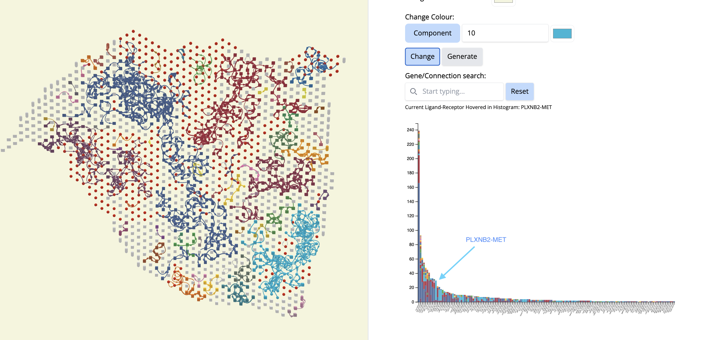
 
   - What is remarkable is that this CCC subgraph colocalizes with the Classical subtype. 
 
  5. Now, let's see which CCCs are happening there in component 10. 
   -  We go to the histogram plot and click on the histogram which has the same color as component 10. Let's pick the first most abundant CCC: PLXNB2-MET (most abundant because a bigger proportion of this CCC is associated with component 10). 

 
 
 
 If we click on this histogram, it will show the regions where only that CCC is happening. And we see that it is happening only at that particular location. It aligns with Classical subtype of the PDAC cancer. That means, PLXNB2-MET may be a potential biomarker CCC for this subtype. 
 → Next step for your research starting from this hypothesis: navigate further studies, e.g., comparing across multiple samples to see if PLXNB2-MET is also found in other samples in the Classical region. 
 
  6. **Reset**. (Click on the 'Reset' button)
  
  7. **Pick another cancer region** - Component 4. To focus on this, let us change the color ‘by component’. 
  
   -  In the "Change Colour" box, select 'Component', enter 4 and pick the cyan color. Click on 'Change'.

  
  
  It colocalizes to another classical region of the tissue section but it will contain different ligand-receptor interactions.
 
   -  Go to the histogram plot. Pick a CCC that happens only in Component 4 - even if it is low - APOE-SDC1. Select that histogram and look at the spatial location. It is happening only in this particular region. 

 

```{block, type="rmd-tip"}
Since this interaction pair is in low amount, to gain more confidence, we could have increases the number of top CCC edges - 5000 (sliding bar on top) and repeat the process. 
```
 
 - Increase the number of edges. Wait until NEST_interactive finishes. In this step, NEST is recalculating the subgraphs.
 
 
 
 - In the 'Gene/Connection search' search box, look for and select 'APOE-SDC1'
 
 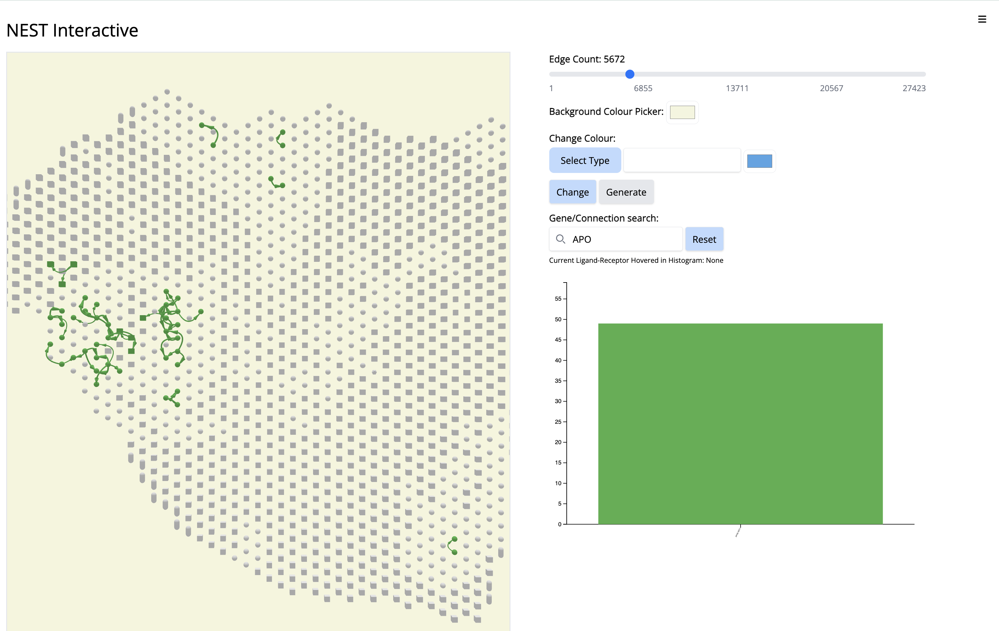
 


<!--chapter:end:6.4-Module6_scRNAlab_NEST.Rmd-->

# Module 7: Review of the tools  

 *<font color="#827e9c">By Veronique Voisin, Chaitra Sarathy and Ruth Isserlin</font>*
 
## Final slides
[Lecture](./lectures/Pathways_2024_finalslides.pdf) 

  
## scRNA lab praticals

[scRNA-lab1_PBMC](#scRNA-lab1)

 - This lab starts from scRNA data from peripheral blood mononuclear cells.  

 - The cells from similar cell types were grouped into clusters. 

 - We extracted the gene lists corresponding to each cluster and run pathway analysis on it using g:Profiler. 

 - We also created pseudobulk from the data, ran GSEA and created an enrichment map.

[scRNAlab2_Glioblastoma](#scRNAlab2)

 - Similar to lab1, we extracted gene lists from scRNA clustering from glioblastoma data.

 - We created an mastermap by uploading in EnrichmentMap the pathway enrichment results for all the cluster gene lists.
  
[scNetViz](#scNetViz-lab)

 - scNetViz is a Cytoscape that download scRNA data from the SingleCellAtlas, calculated differential expression between clusters or defined catergories and create protein-protein interaction networks out of it.

##  Integrated assignment

[Integrated assignment](#integrated_assignment)

 - In this integrated assignment, all the tools viewed during the workshop from module 1 to module 5 are integrated. The dataset is a microarray dataset available publicly from GEO. 
 
## Integrated assignment bonus

[Automation](#ass_automation)

 - Experiment with automating your enrichment analysis pipeline using R.

<!--chapter:end:7.0-Module6_Review_of_the_tools.Rmd-->

# Module 7 Integrated Assignment {#integrated_assignment}

 *<font color="#827e9c">Veronique Voisin, Chaitra Sarathy and Ruth Isserlin</font>*

**This work is licensed under a [Creative Commons Attribution-ShareAlike 3.0 Unported License](http://creativecommons.org/licenses/by-sa/3.0/deed.en_US). This means that you are able to copy, share and modify the work, as long as the result is distributed under the same license.**


## Goal 

 Familiarize yourself with g:Profiler, GSEA, EnrichmentMap using the Esophageal adenocarcinoma gene expression data (DATASET 1).

 Familiarize yourself with ReactomeFI and GeneMANIA using a mutation data (DATASET 2).
 
```{block, type="rmd-note"}
Network layouts are flexible and can be rearranged. What you see when you perform these exercises may not be identical to what you see in the tutorial, or what you have seen other times that you have performed the exercises. Exact layouts and predictions can also be affected by updates to the networks database that the tools are using. However it is expected that the network weights and predicted genes will be similar to those shown here.
```

## DATASET 1

## Background

Gene expression data from Esophageal adenocarcinoma (EAC) is used for this first part of the  integrated assignment. Esophageal adenocarcinoma (EAC) has a rising incidence and a 5-year survival of only 15%. The single major risk factor for development of EAC is chronic heartburn, which eventually leads to a change in the lining of the esophagus called Barrett’s Esophagus (BE).

Specimens were collected from patients with normal esophagus (NE) and Barrett’s esophagus (BE). RNA was extracted from these samples and expression profiling was assessed using Affymetrix HG-U133A microarray [PMID:24714516](http://www.ncbi.nlm.nih.gov/pubmed/24714516). Differentially expressed genes between BE and NE were determined.


## Data processing

The Affymetrix data are stored in the Gene Expression Omnibus (GEO) repository under the accession number [GSE39491](https://www.ncbi.nlm.nih.gov/geo/query/acc.cgi?acc=GSE39491) [PMID:24714516](http://www.ncbi.nlm.nih.gov/pubmed/24714516). The RMA (Robust Multichip Average) normalized data were downloaded from GEO and further processed using the Bioconductor package limma to estimate differential expression between the groups. The results of the limma t-tests were corrected for multiple hypothesis testing using the Benjamini-HochBerg method (FDR).


For g:Profiler, genes with a FDR equal or less than 0.0001 and a logFC of 2 were retrieved and stored in a text file. For GSEA, a rank file has been created by ranking the genes from the highest t statistics value (up-regulated in BE compared to NE) to the lowest t values (down-regulated in BE compared to NE). The code used to process the data is available from this [link](./IntegratedAssignment/data/code_integrated_assignment_BEvsNE.R). Please feel free to adapt it and use it with your own data.

## PART 1: run g:Profiler

1.  Open g:Profiler

2.  In **Advanced options**, make sure **All results** is **not** checked (this keeps significant results only)

3.  In **Advanced options**, Set **Benjamini-Hochberg** in the **Significance threshold** box.

4. In **Data sources** , select **GO molecular function**, **No electronic GO annotations**, and Reactome.

5.  Run analysis of the genes differentially altered between BE and normal: copy and paste the gene list into the g:Profiler input window [BEonly_genelist.txt](./IntegratedAssignment/data/BEonly_genelist_v2.txt).


6.  **Question:** What is the most significant GO:term? What is the p-value for this GO:term?

7.  **Question:** Is this p-value already corrected for multiple hypothesis testing? What type of correction is used for your current analysis?

## PART 2: save as Generic Enrichment Map output (BE)

Now we have to generate an output from the enrichment analysis and save it in appropriate format for EnrichmentMap. Select the tab for *Detailed results* and set the maximum term size to 1000. Export the data in Generic EnrichmentMap (GEM) format and save it on your computer. We will need this file to create an enrichment map.

## PART 3: save as Generic Enrichment Map output (NE)

Generate and save the Generic EnrichmentMap for genes in [NConly_genelist.txt](./IntegratedAssignment/data/NEonly_genelist.txt) (i.e., delete the old gene list and copy/paste the new gene list in the box). It contains the genes specific of the normal tissue samples. Run g:Profiler with this list using same options as in PART 1 and again save the output as a Generic Enrichment Map (GEM) format. We will need this file for EnrichmentMap.

** Make sure to rename your g:Profiler results so you know which one is BE and which one is NE. **

## PART 4: create an enrichment map

Create an enrichment map to visualize the outputs from g:Profiler. Let's create an EnrichmentMap for the pathways that were enriched by the genes specific of the BE samples and one for the genes specific of the NE samples. 

1.  Make sure to rename your g:Profiler results so you know which one is BE and which one is NE. 

2. Open Cytoscape

3. Go: Apps and click on EnrichmentMap. A 'Create Enrichment Map' dialog box appears.

4. Drag and Drop the 2 g:Profiler result files in the 'Data Sets:' window. It populated automatically two data sets on for the BE results and one for the NE results. Make sure that for the 2 datasets the 'Analysis Type' is set to 'Generic/gProfiler/enrichr' and that the g:Profiler result file has been correctly uploaded in the 'Enrichments' field.

5. Set the 'FDR q-value cutoff' to 0.05. 

6. 'Build' the map. 

7. If successful, you will see a network where each node represents a pathway and edges connect pathways with shared genes. Blue edges connect nodes from dataset1 (BE in my case) and Green edges connect nodes from dataset2 (NE in my case). 

8. In Control Panel and in the 'EnrichmentMap' tab, go to 'Style' (near the bottom) and change the 'Chart Data:' to 'Color by Data Set'. Now the nodes are colored in blue for dataset1 and in green for dataset2. 

9.  Annotate the network using the AutoAnnotate Apps. 


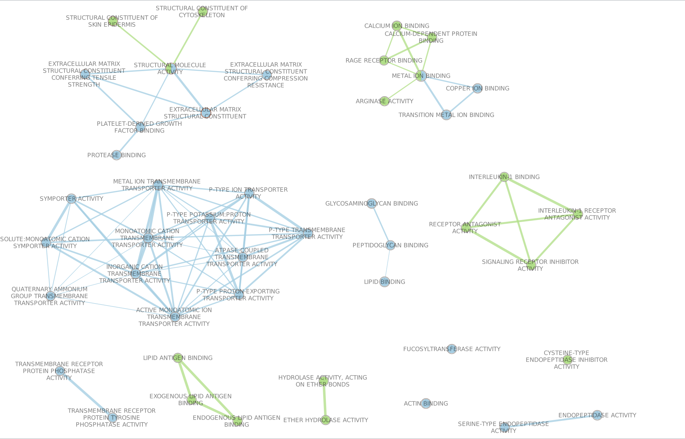


10. Try different layouts if you'd like. Zoom in  and move nodes around to be able to read the labels.

11. Select a node of your choice. When the node is highlighted, the 'EM Heat Map' in 'Table Panel' will display the genes in this pathway that are overlapping with your input gene list. A gray square means that the gene is absent in the dataset.
Note: you also could create and upload an expression file when you build the enrichment map, and the expression values for each gene in the pathways will be displayed here in the 'EM Heat Map'. 

12. Click on any edge (the line between nodes). In the 'Table panel' ('EM Heat Map') you should see a heatmap of all genes both gene-sets connected by this edge have in common.

13. Select several nodes and edges. EM Heat map will show the union of all genes (Genes: All) or genes in common (Genes:Common) in the selected gene sets. 

14. In Control Panel, go to the EnrichmentMap tab. Change Q-value as well as Edge (Similarity) cutoffs and see how the network changes. Redo the layout. Save the file.

**Question** What conclusions can you make based on these networks?


## Answers g:Profiler

**Question**: What is the most significant GO:term? What is the p-value for this GO:term 

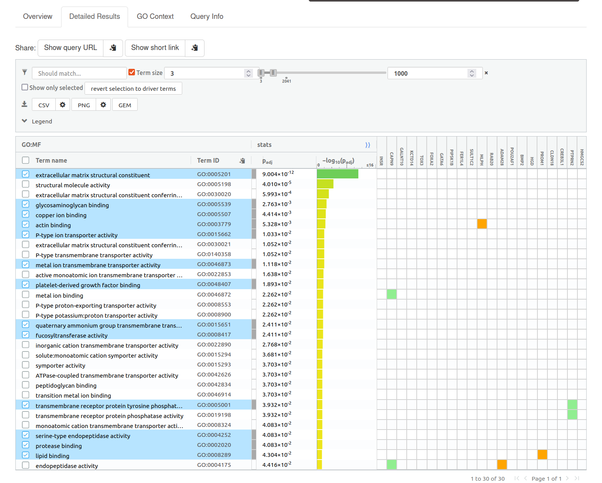
Note: you might get slightly different results compared to the screenshot if the pathway database has been updated.

**Answer**:  extracellular matrix structural constituent


**Question**: Is this p-value already corrected for multiple testing? What type of correction is used for your current analysis? 

**Answer**: yes, it is already corrected for multiple hypothesis testing. I set the Significance threshold box to  "Benjaminin-Hochberg FDR". 


Re-run the analysis with User p-value threshold set to 0.0001. 

**Question**: What has been changed?

**Answer:** Only the gene-set with adjusted pvalue equal or less than 0.0001 are displayed. The list is reduced compared to the results obtained with the default settings. 

Ordered query: 

**Question**: Do you seen any changes in the output in comparison to the analysis of the unordered gene list (PART 2) 

**Answer** Although some terms are similar, their pvalues changed as well as the number of term genes used to calculate the pvalue.


**Question** What can you conclude about these networks? 

**Answer** The pathways are relevant to the biological model under study. The changes are related to the transformation of the epithelial cells into mesenchymal ones. 
 

## PART 5: GSEA (run and create an enrichment map)

1. Launch GSEA.

2.  Run GSEA using the rank file that has been created from the differential expression test comparing BE vs NE [BEvsNE_ranks.rnk](./IntegratedAssignment/data/BEvsNE_ranks.rnk) and the pathway file [Human_GOBP_AllPathways_noPFOCR_no_GO_iea_June_01_2024_symbol.gmt](./IntegratedAssignment/data/Human_GOBP_AllPathways_noPFOCR_no_GO_iea_June_01_2024_symbol.gmt).

  * open GSEA and first import the files using the "Load data" window: upload the .rnk and .gmt files (the gmt file can be found by clicking the three dots next to 'Gene sets database' and clicking on 'Gene matrix (local gmx/gmt) ).
  * Go the 'Run GSEAPreranked' window and select the correct gmt file and the rank file
  * Use **100** permutations for the lab exercise. 
```{block, type="rmd-caution"}
For time reasons - Use 100 permutations for the lab exercise but use 1000 for your own data analysis. 
```
  * Choose a name for your analysis, a destination folder and run GSEA.
  
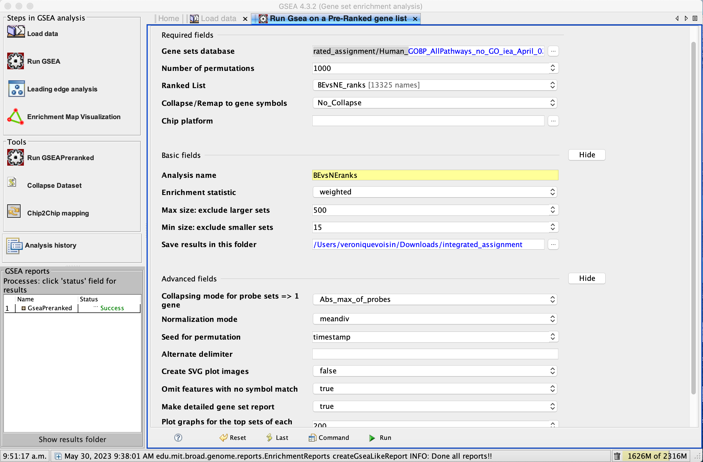


3.  Create an enrichment map:
  * Open Cytoscape and the EnrichmentMap app. The enrichment results are 2 excel files called gsea_report_for_na_neg and gsea_report_for_na_pos within the GSEA folder saved on your computer but you should be able to drag and drop the whole GSEA folder and that will populate the required fields automatically. 
  
  *  use an FDR q-value cutoff of 0.01. Upload the expression file [BE_vs_NE_expression.txt](./IntegratedAssignment/data/BE_vs_NE_expression.txt)(right click, save link as). 

4.  Examine the results as you did for the g:Profiler map (e.g move nodes around, use the slide bar to adjust q value to 0.01 and redo the layout, separate blue and red nodes). Save the file. Save an image. Keep your session open for Part 8.

Optional: Autoannotate your map (see below screenshot for results)
Note: you may get slightly different results as 100 permutations is not enough to get reliable results. It is better to use 1000 permuatations.

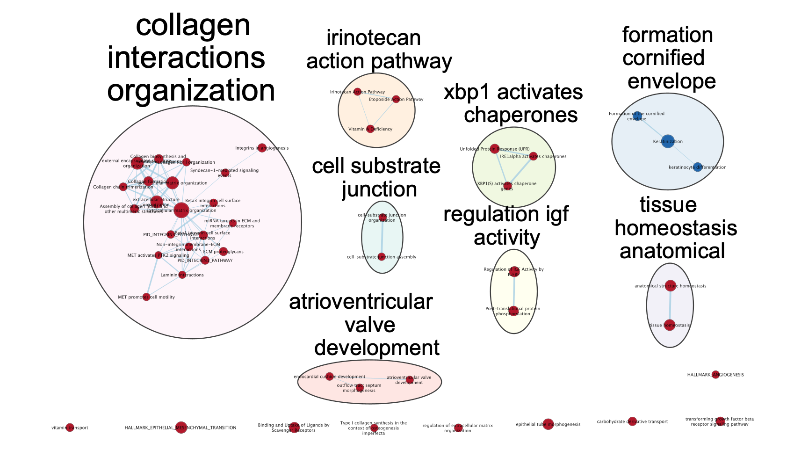

## PART 6: iRegulon

 1. Export the collagen and extracellular matrix genes. 
  * Using your GSEA map at q-value 0.01, select all nodes from the "collagen interactions organization" module. Go to Table Panel (below the main window), and click on the menu icon (located on the right, 3 lines) and click on 'Export as TXT' (all genes). Save the text file under the name 'collagen_interactions_organization.txt' or use this file [collagen_interactions_organization.txt](./IntegratedAssignment/data/collagen_interactions_organization.txt).
 
 2. Import the collagen and extracellular matrix genes as a network.
  * In Cytoscape, go to the menu bar and select, File, Import, Network from File... 
  * Browse your computer and select the 'collagen_interactions_organization.txt' file and click on open.
  * An 'Import Network From Table' window opens and in the table preview, make sure that the 'Gene' column is the source node (green dot). Click on 'OK'. A 'Confirmation' dialog box saying that 'No edges will be created in the network' opens. Click on 'Yes'. 
  
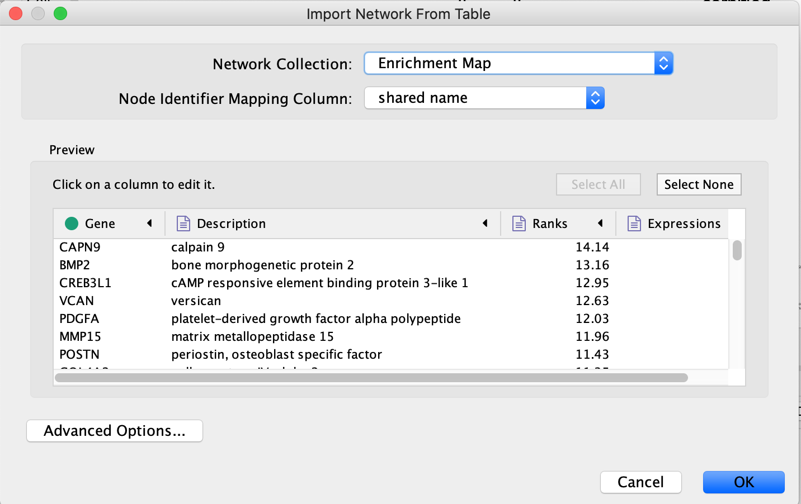
  
  * If successful, you should see a grid of gray nodes. If you are zoomed out, they might be very faint. Zoom in until you see them, then zoom out until you see all the nodes and select them all using the mouse.
  
 3. Select nodes and run iRegulon.

   * Go the Cytoscape menu and select 'Apps', 'iRegulon', 'Predict regulators and targets'. 
   * Click on 'Submit'.
   * Observe the iRegulon results in the Results Panel.
   


  
   
 4. Add TCF12 and AVEN to the network.
   * Go to the "Transcription Factors' tab and click on the first hit (TCF12) to select it.
   * Add it to the network using the green '+' button .
   * Execute the same steps for the second hit (AVEN).
   * If successful, you should see targets of TCF12 and AVEN linked to these 2 genes by edges (lines).
 
 5. Create a subnetwork with all nodes connected to TCF12 and AVEN
  * using the mouse select TCF12 and all edges around this node and pressing the shift key, select also AVEN and all the edges around this node. All selected edges should now be highlighted in red and the 2 transcription factors in yellow.
  * In the Cytoscape menu bar, go to Select, Nodes, Nodes connected by selected edges. More nodes should be selected now and the edges still highlighted in red.
  * Select the subnetwork icon ('New Network from Selection (all edges)')from the Cytoscape toolbar. If successful, you should have created a subnetwork containing only the targeted genes and the two transcription factors.
 
 6. Arrange the network such that we can distinguish genes linked to TCF12 only , linked to AVEN only or linked to both transcription factors.
  * go to the Cytoscape menu, Layout, Circular Layout, all Nodes. Feel free to use your own strategy.
 
 7. Optional. Import the .rnk file that we use for GSEA [BEvsNE_ranks.rnk](./IntegratedAssignment/data/BEvsNE_ranks.rnk) as attribute and color the nodes accordingly to the score values.
  * in the menu bar, select, *File*, *Import*, *Table from File...*, select the rank file and click on 'Open'. A dialog box ('Import Columns From Table') opens. Click on 'Advanced options' and uncheck 'Use first line as column names' and click 'OK'. Rename Column2 as 'myscore'. Click 'OK'. 
  * in Control Panel, go to Style and in the Node tab, expand the 'Fill Color' tab.  Retrieve and select the 'myscore' column in the 'column' fied. Make sure that the 'Mapping type' is set to 'Continuous Mapping'. The score  should ranged from -13.16 to 13.16. Adjust the color if necessary.
 
 
 Screenshot of resulting network:
 
 
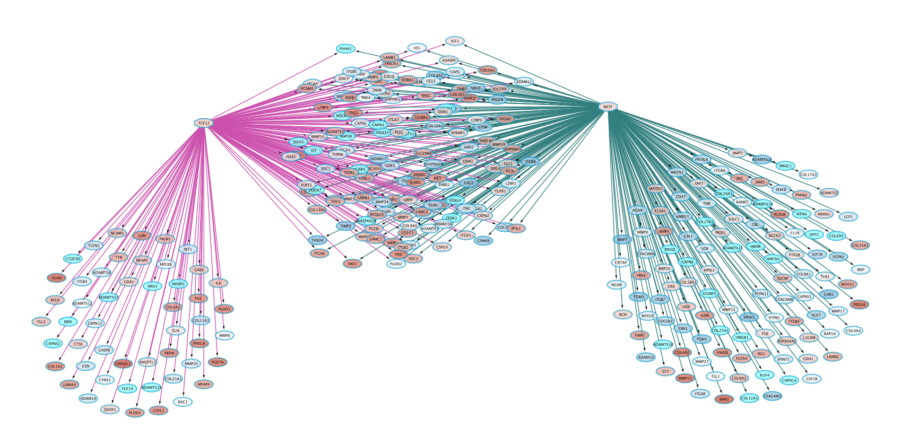


## DATASET 2
Stomach cancer or gastric cancer is a cancer developing from the lining of the stomach. The most common cause is infection by the bacteria Helicopter pylori, which accounts for more than 60% of cases. Certain types of 'H. pylori' have greater risks than others. Other common causes include eating pickled vegetables and smoking.

MutSig - is a mutation signal processing tool created by the Broad Institute. It estimates the significance of the gene mutation rate based on abundances of the mutations, clustering of the mutations in hotspots and conservation of the mutated positions. 

The gene list for this assignment is the output from MutSig run based on Stomach Adenocarcinoma somatic mutations found  in ~300 samples. It is publicly available through TCGA portal.

File provided: [STAD_MutSig.txt](./IntegratedAssignment/data/STAD_MutSig.txt)

**Goal**: familiarize yourself with ReactomeFI  and GeneMANIA.

## PART 1: ReactomeFI

Create a network using ReactomeFI. 

1. Open Cytoscape.
2. Choose App -> Reactome FI -> Gene set/mutation analysis
3. Upload STAD_MutSig.txt and built a network without linkers:

Note: Choose **2024** to get results comparable to those shown below but use the most uptodate version when analyzing your own data!

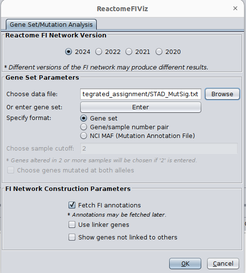

```{block, type="rmd-note"}
The network may look slightly different compared to below screenshot if the underlying database has been updated since the screenshot was taken
```

```{block, type="rmd-tip"}
upload your file or copy and paste the gene names in the gene set field.
```


4. Run Pathway enrichment (Hint: right click anywhere on the blank space and select Reactome FI > Analyze network functions > Pathway enrichment). 
**Question** What is the pathway with the lowest (best) FDR?

6. Do a subnetwork of Pathways in cancer (K). 

```{block, type="rmd-tip"}
select the pathway in the table, that should highlight the genes in yellow. Use the subnetwork icon on the Cytoscape tool bar to create it ("New network from selection").
```

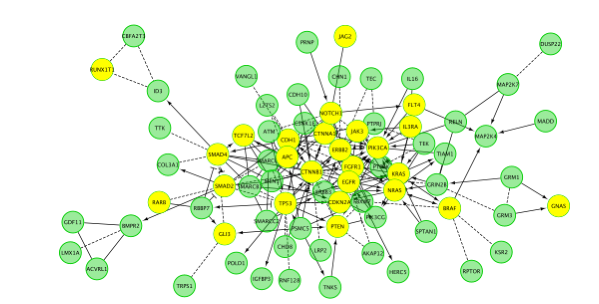

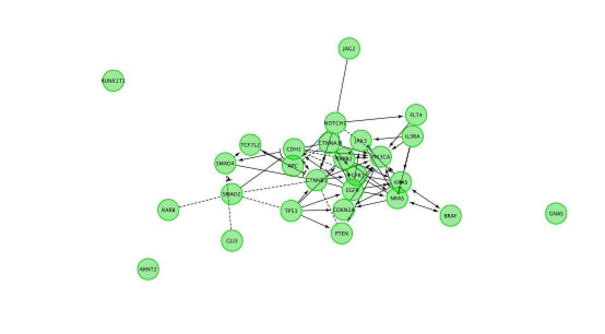

7. Go back to the full network (in the Control panel on the left, click the highest level of 'STAD_MutSig'). Cluster the network and perform pathway enrichment on the network. 
**Questions** How many clusters did the analysis retrieve?  

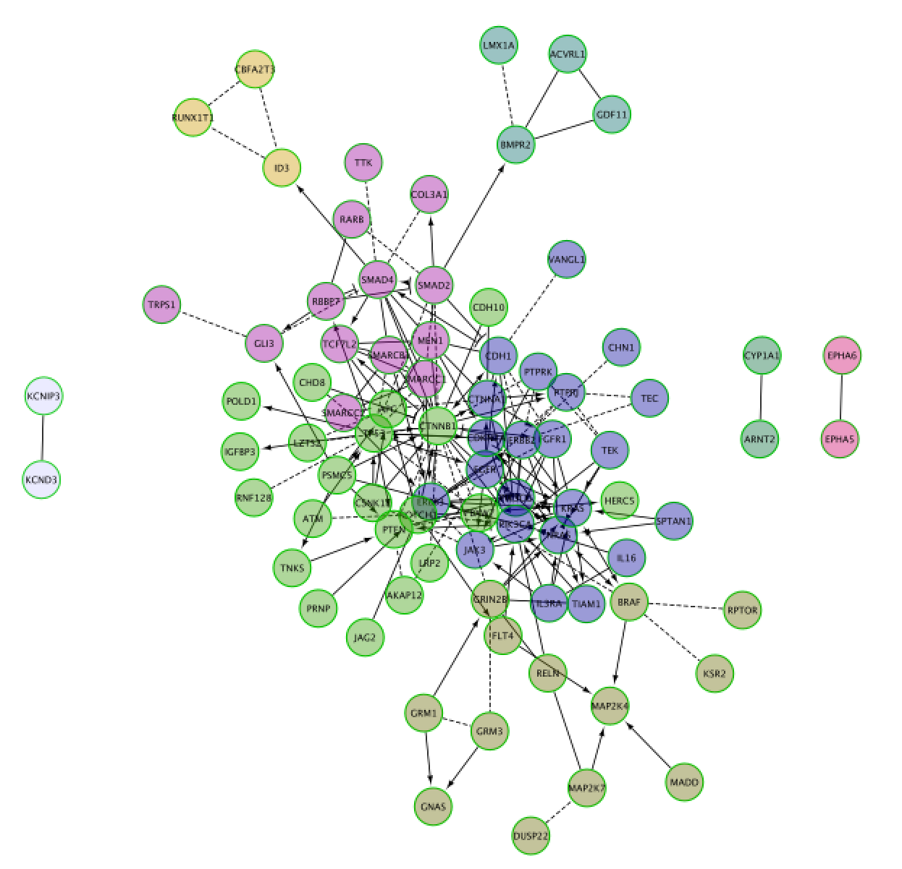


### Answers REACTOME FI

Pathway enrichment on the whole network. 

**Question** What is the pathway with the lowest (best) FDR? 

**Answer** The pathway with the lowest FDR is Pathways in cancer (K) . 

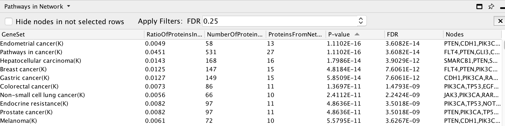


Cluster the network and perform pathway enrichment on the network.

**Question** How many clusters did the analysis retrieve?  

**Answer** The analysis retrieved 11 clusters named module 0 to module 10. 


## PART 2: GeneMANIA

Use the same mutation data  [STAD_MutSig.txt](./IntegratedAssignment/images/STAD_MutSig.txt) to create a network using GeneMANIA in order to visualize which genes are known to physically interact with each other.


1. Create the network

 * In Cytoscape, go to Control Panel and locate and select the Network Tab in the Control Panel
 *  Make sure the GeneMANIA search provider is selected in the Network Search Bar.
 *  Choose Homo sapiens from the list of supported organisms
 *  Copy and paste the gene list [STAD_MutSig.txt](./IntegratedAssignment/data/STAD_MutSig.txt) in the field. 
 * **Locate the "More Options..." button at the right side of the field and only select  'Physical interactions' as 'Interaction Networks' and set 0 to the 'Max Resultant Genes'. **
 * Click on "More Options" button so it disappears.
 * Click the "Search Network" button
 
```{block, type="rmd-note"}
The network may look slightly different compared to below screenshot if the underlying database has been updated since the screenshot was taken.
```


Screenshot of the output:

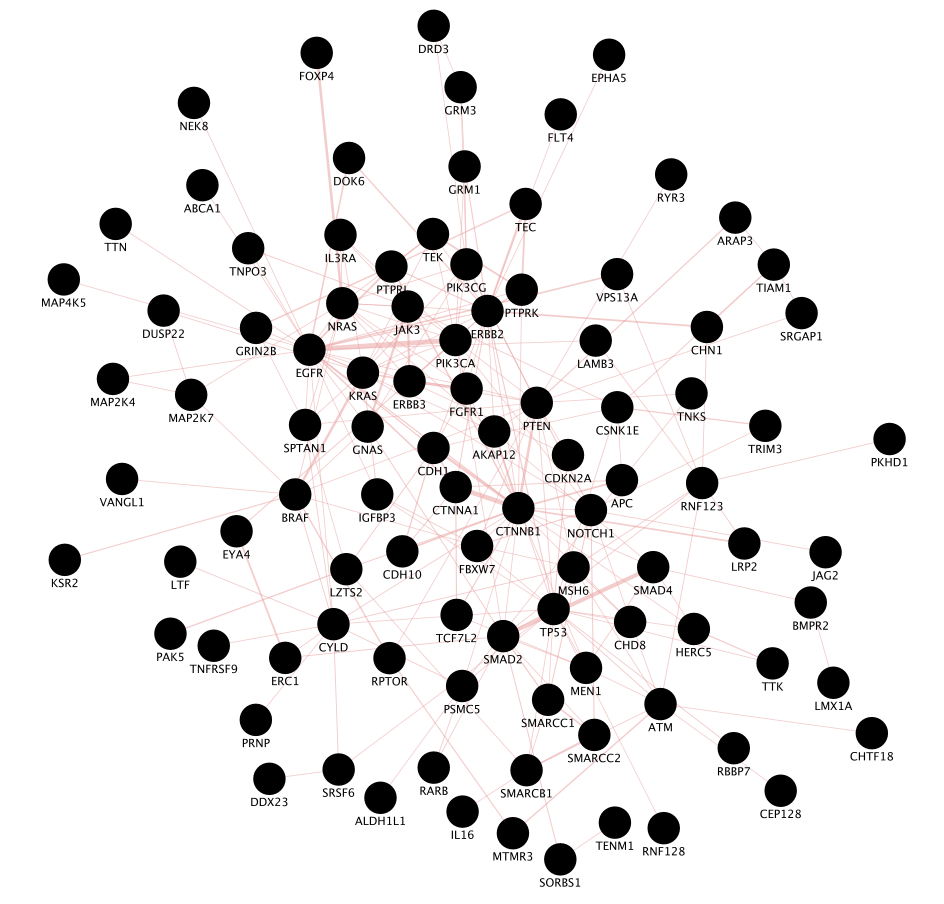

2. Explore the functions in the GeneMANIA Results Panel.
 * Go to 'Results Panel' located at the right side and select the GeneMANIA tab. Choose the 'Functions' tab to visualize the list of enriched GO gene-sets. **Question** Can you see which genes are included in these gene-sets?
Hint: you can click on a function of your choice to see corresponding nodes highlighted in yellow. 


3. Improve the visual style:

 * Color nodes by function. 
   * In Control Panel, select the 'Style' tab and go to the 'Node' panel.
   * Expand the 'Fill Color' field using the down arrow and set 'Column' to 'annotation name' which is the top field (/!\ not 'annotations'). Select one annotation of your choice by clicking on the white space and choose a color. Repeat for 2 more annotation names. For the current example, we have selected "transmembrane receptor protein kinase activity" and "regulation of protein kinase". Hint: the annotation names are displayed in alphabetical order. 
 
 * Edge width (optional). In Control Panel, go to the 'Edge' panel. Expand the 'Width' field using the down arrow. A grah is displayed. Double click on the graph to select it and move the left and right handles up. Look at the changes on the network (suggested values are approximately 3 for the left handle and approximately 18 for the right handle). Click on OK.
 


4. Create a subnetwork containing CTNNB1 and connected genes
 * Locate CTNNB1, use the "First neighbors of selected nodes" icon (has the shape of 2 houses) in the toolbar to highlight genes connected to CTNNB1 
 * Create a subnetwork using the approriate icon. 
 * How many nodes do contain this subnetwork? Hint: Go to Control Panel, Network and look at the number of nodes corresponding to your subnetwork. 

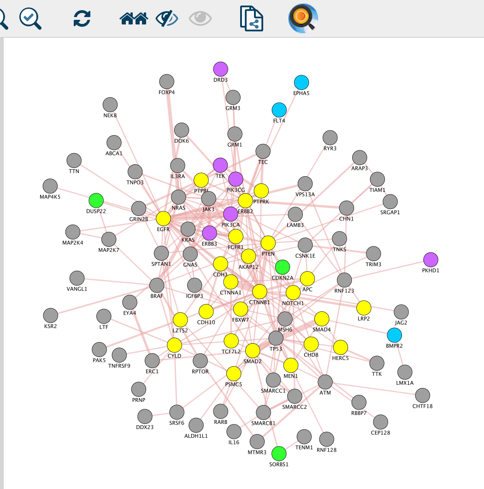


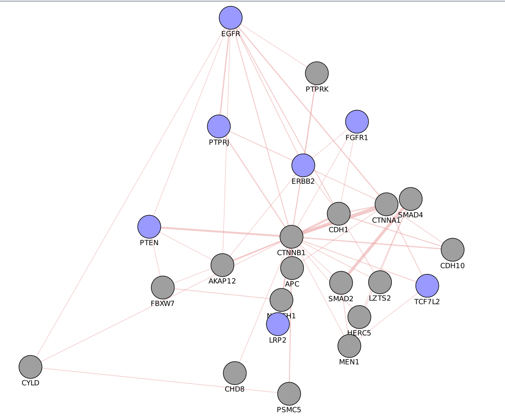

---

### Answers GeneMANIA

**Question** What is the number of nodes in the CTNBB1 network. 

**Answer**
There are 24 nodes.


**Optional part 1: Launch a GeneMANIA search using the "Local Search" option (for big networks)**

 * In Cytoscape , open the GeneMANIA app and select 'GeneMANIA Local Search'. Copy and paste the MutSig genes in the 'Genes of Interest' field.
 * In Advanced Options, select only 'Physical interactions' as 'Interaction Networks' and set 0 in the "Find the top" 0 "related genes".
 * Click on 'Start'.

```{block, type="rmd-caution"} 
 * If you use it for the first time and you haven't installed data as it was said in the installation instructions, only install "CORE" data as the full data may take 1 hour to download. 
```


```{block, type="rmd-note"}
There are 2 ways to perform a GeneMANIA search. The first option using the Network search bar from the Control Panel is doing a seach by calling and connecting the GeneMANIA server (same as the website:https://genemania.org/). The other option as just showed here is to select GeneMANIA from the Apps menu and click on 'Local Search...'. This option will use a database that is installed locally on your computer when you first use GeneMANIA. As it does not imply any connection to the server, this option is the best choice for large query, e.g input gene list size greater than 100 or resulting network containing more than 200 nodes.
```
 


The network and predicted functions should be the same as the ones obtained in part 2. Feel free to explore the network or follow the same steps as part 2.  

---

**Optional part 2: Use STRING from the Network Search Bar**

STRING (Search Tool for the Retrieval of Interacting Genes/Proteins) is a biological database and web resource of known and predicted protein–protein interactions.

 *  In Cytoscape, go to Control Panel and locate and select the Network Tab in the Control Panel
 *  Make sure 'STRING protein query' is selected in the Network Search Bar.
 *  Type CTNNB1 in the search field.
 *  Click the "Search Network" button
 *  Explore the network!
 

 
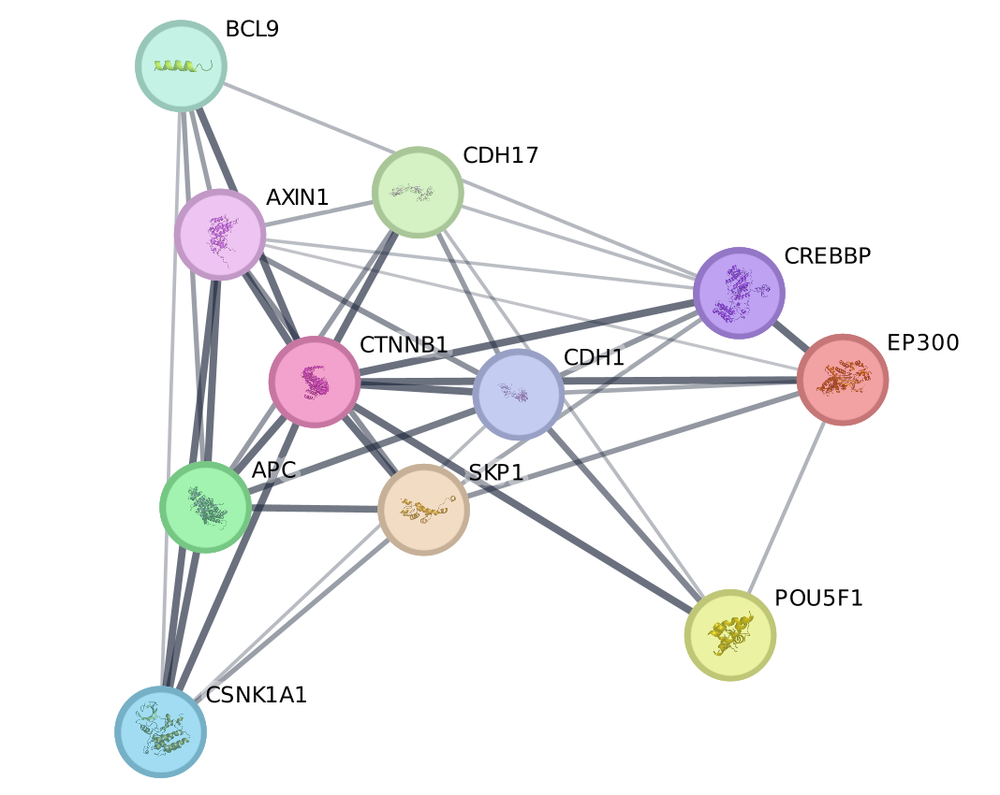 

--


Congratulations!  You have reached the end of the integrated assignment.


<!--chapter:end:7.1-Module6_Integrated_Assignment.Rmd-->

# Module 7 Integrated Assignment Bonus - Automation {#ass_automation}

**This work is licensed under a [Creative Commons Attribution-ShareAlike 3.0 Unported License](http://creativecommons.org/licenses/by-sa/3.0/deed.en_US). This means that you are able to copy, share and modify the work, as long as the result is distributed under the same license.**

 *<font color="#827e9c">By Ruth Isserlin</font>*

## Goal of the exercise:

Experiment with automating your enrichment analysis pipeline using R.

Using the same technique used in [Module 3 Lab: (Bonus) Automation](#automation) automate the data analysis GSEA portion of the integrated assignment.  

If you haven't done the bonus lab from Module 3 yet, please complete that before attempting to do the same for the integrated assignment. 


<!--chapter:end:7.2-Integrated_Assignment_bonus.Rmd-->

# Optional Module 8: Regulatory Network Analysis {#intro-regulatory-networks}

*<font color="#827e9c">Michael Hoffman and Veronique Voisin</font>*

## Lecture  
 [Lecture slides](./lectures/Pathways_2021_Module5_lecture_MH.pdf)  

 [Recorded video](https://www.youtube.com/watch?v=6rKCUOqGtXA&list=PL3izGL6oi0S-xaoH8p9LnJD8RQm8eNWF2&index=5)

## Practical lab 1: chIP_seq data - GREAT and MEME-chIP
  [chIP_seq Lab slides](./lectures/Pathways_2021_Module5_practical_lab_CHIPseq_lab_vv.pdf)  

  [chIP_seq Lab practical](#regulatory_network_chipseq_lab)

## Practical lab 2: gene list - iREgulon and enrichr/EnrichmentMap

  [iREgulon Lab slides](./lectures/Pathways_2021_Module5lab_iregulon.pdf)  

  [iREgulon Lab practical](#regulatory_network_lab)
  
## Additional slides about the tools Segway and BEHST presented during the lecture 

  [Segway slides](./lectures/Pathways_2021_Segway_GMTK02_UTMIST_2021.pdf)  
  [Segway protocol_draft](./lectures/Pathways_2021_segway_semi_automated_genome_annotation_post_submission_draft.pdf)  
  
  [BEHST slides](./lectures/Pathways_2021_BEHST07_Asilomar_Chromatin_2020.pdf)  

<!--chapter:end:8.0-Optional_Regulatory_Networks.Rmd-->

# Optional Module 8 Lab 1: Gene Regulation and Motif Analysis Practical Lab /chIP-seq {#regulatory_network_chipseq_lab}

**This work is licensed under a [Creative Commons Attribution-ShareAlike 3.0 Unported License](http://creativecommons.org/licenses/by-sa/3.0/deed.en_US). This means that you are able to copy, share and modify the work, as long as the result is distributed under the same license.**

*<font color="#827e9c">By Veronique Voisin, Chaitra Sarathy and Ruth Isserlin </font>*

## Goal of this practical lab 

* Perform pathway analysis starting with a chIP_seq bed file and visualize the results using Cytoscape/EnrichmentMap.
* Be able to use the tool GREAT with distal and proximal parameters.
* Run MEME-chip to find over-enrichment of transcription factors.
* Optional: learn how to use iRegulon to find targets of a transcription factor of interest and find orthologs using the tool g:Profiler/g:orth.

This practical lab consists of 6 exercises and 2 of them are optional. Follow the step-by-step checklist through the exercises.  

Before starting the lab, download the files:

```{block, type="rmd-datadownload"}
Right click on link below and select "Save Link As...".

Place the file in your CBW work directory in the corresponding module directory.
```

*	[GSE128767_RUNX1_ChIP.peaks.bed](./Module5/chipseqlab/chipseqlab_data/GSE128767_RUNX1_ChIP.peaks.bed)
*	[Distal_GOBP_greatExportAll.tsv](./Module5/chipseqlab/chipseqlab_data/Distal_GOBP_greatExportAll.tsv)
*	[Proximal_GOBP_greatExportAll.tsv](./Module5/chipseqlab/chipseqlab_data/Proximal_GOBP_greatExportAll.tsv)
*	[RUNX1_Affy.gmt](./Module5/chipseqlab/chipseqlab_data/RUNX1_Affy.gmt)
*	[GSE128767_RUNX1_ChIP.peaks.fasta](./Module5/chipseqlab/chipseqlab_data/GSE128767_RUNX1_ChIP.peaks.fasta)

```{block, type="rmd-note"}
EnrichmentMap and Cytoscape layouts: Network layouts are flexible and can be rearranged. What you see when you perform these exercises may not be identical in appearance to what you see in the screenshots in the practical lab, or what you have seen other times that you have performed the exercises. 
```

## Dataset used during this practical lab

ChIP-seq for RUNX1 from pools of mouse CD1 fetal ovaries (E14.5)<br>
NCBI GEO: [GSE128767](https://www.ncbi.nlm.nih.gov/geo/query/acc.cgi?acc=GSE128767)

From the paper:<br>  **RUNX1 maintains the identity of the fetal ovary through an interplay with FOXL2**<br> Nicol B, Grimm SA, Chalmel F, Lecluze E et al. <br>[Nat Commun 2019 Nov 11;10(1):5116](https://www.nature.com/articles/s41467-019-13060-1).<br> [PMID: 31712577](https://pubmed.ncbi.nlm.nih.gov/31712577/)

**Abstract**:<br> Sex determination of the gonads begins with **fate specification** of gonadal supporting cells into either ovarian granulosa cells or testicular Sertoli cells. This process of fate specification hinges on a balance of transcriptional control. We discovered that the **transcription factor RUNX1** is enriched in the **fetal ovary** in rainbow trout, turtle, mouse, and human. In the mouse, RUNX1 marks the supporting cell lineage and becomes granulosa cell-specific as the gonads differentiate. RUNX1 plays complementary/redundant roles with FOXL2 to maintain fetal granulosa cell identity, and combined loss of RUNX1 and FOXL2 results in masculinization of the fetal ovaries. To determine whether interplay between RUNX1 and FOXL2 occurs at the chromatin level, **we performed genome-wide analysis of RUNX1 chromatin occupancy in E14.5 ovaries. The top de novo motif identified in RUNX1 ChIP-seq matched the RUNX motif**. We found that RUNX1 chromatin occupancy was partially overlapping with FOXL2 chromatin occupancy in fetal ovaries.

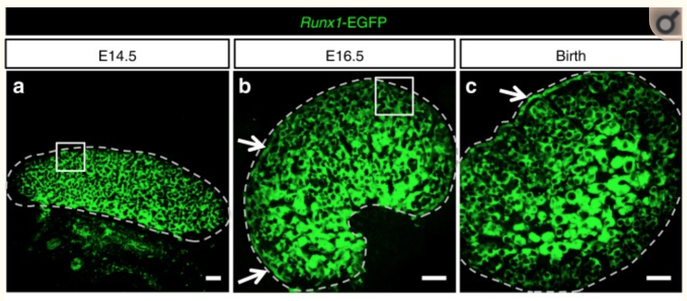 

They found that RUNX1 is expressed in the fetal ovary at day 14 in mice and that it is necessary for a good development of the ovary.

 

A KO of Runx1 and another TF Foxl2 abolished the normal development of the ovary.

#Why did we choose this dataset?

*	RUNX1 is a transcription factor that is interesting to study as it has major biological functions. 
*	chIP-seq peaks are stored in a bed file that can be download from GEO entry.
*	Linked to transcriptomic data [GSE129038](https://www.ncbi.nlm.nih.gov/geo/query/acc.cgi?acc=GSE129038)
*	Quality of the data


#The 3 pieces of information that we need to get before starting the analysis are:

* the model organism: Mus musculus
* genome version: mm10
* bed file : 	[GSE128767_RUNX1_ChIP.peaks.bed](./Module5/chipseqlab/chipseqlab_data/GSE128767_RUNX1_ChIP.peaks.bed)
 
 We have indicated below how we retrieved these information **but you don't need to do it for the lab**:
 
* In the main GEO entry [GSE128767](https://www.ncbi.nlm.nih.gov/geo/query/acc.cgi?acc=GSE128767) 
* click on one of the samples (for example -  [GSM3684638](https://www.ncbi.nlm.nih.gov/geo/query/acc.cgi?acc=GSM3684638)).  
* On the sample page scroll down to the "Data processing" section
 * The organism is **mus musculus** and the reference genome is **mm10**
 * 3 files are available from the GEO entry (see below).

 

* The bed file provided by the authors (GSE128767_RUNX1_ChIP.peaks.bed) (linked on the main dataset page under supplementary file - [GSE128767](https://www.ncbi.nlm.nih.gov/geo/query/acc.cgi?acc=GSE128767) )
has the right format to be used by [GREAT](http://great.stanford.edu/public/html/) for the pathway analysis;
The first 3 fields contain the chromosome name, start and end. They are the 3 required fields. The fourth column is optional and consists of the chromosomal position, followed by MACS2 score value and FDR. Below is an example view of the BED file:

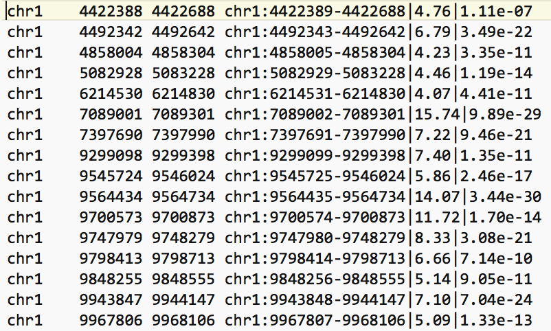 


## Exercise 1 - Run pathway analysis using GREAT

### Perform pathway enrichment

* Open a web browser and open [GREAT](http://great.stanford.edu/public/html/)
* In **Species Assembly** choose Mouse: GRCm38(UCSC mm10, Dec. 2011)
* In**Test regions** Click on **Choose file** and locate the file GSE128767_RUNX1_ChIP.peaks.bed that you save on your computer.

 

* In **Association rule settings**, click on **Show settings** to see the current rule set to associate genes to peaks

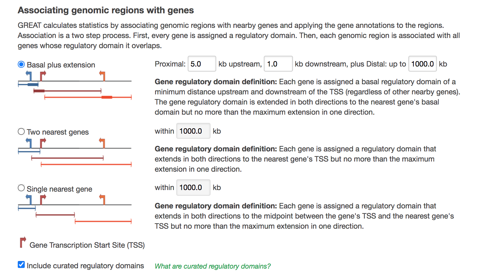 

* **Do not change the settings.** We are doing a distal analysis where genes (genomic regions) are associated with peaks within 5k upstream of the transcription start site of the genes (TSS), 1kb downstream and up to 1000 kb to nearest gene.
* Click on the **Submit** button at the end of the page

### Explore the results.
* Expand the **Job Description** tab to check the parameters, 


* click on **View all genomic region-gene associations** (second line from bottom in blue font)
* In a new tab there will be 2 tables containing the list of the chIP-seq peaks and corresponding associated genes.
* Download both of the tables (region -> gene and gene -> region)

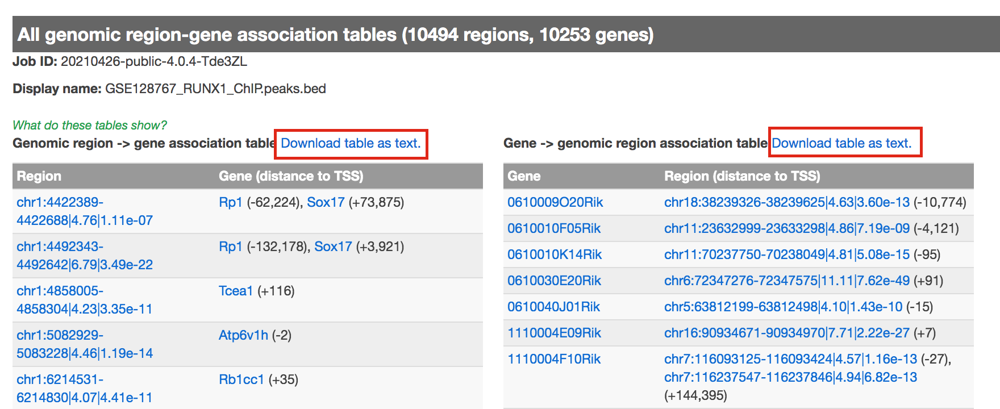

* Return to the main GREAT results page.
* In the main results tab, under the **Region-Gene Association Graphs**, we can see that the peaks were mainly associated with genes located +-5kb of the TSS in addition to the presence of some distal peaks as expected based on the association rule that we have used.

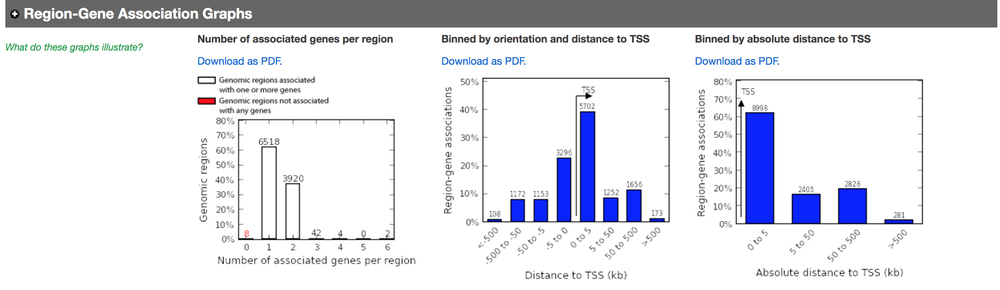

* Let’s explore the pathway analysis results and look at the GO Biological Process table.

* Scroll down to the **GO Biological Process** section.


As we defined a distal rule to associate peaks with genes, we are going to look at the **binomial FDR**. The binomial test assesses whether the number of genomic regions annotated with the tested pathway is significantly larger than the number of genomic regions not annotated with the tested pathway.
The fold enrichment is the proportion of genomic regions annotated with the tested pathway and genomic regions not annotated with the tested pathway.


* Export the GO BP result on your local computer:
    * Under the **GO Biological Process** title, locate the **Table controls:** 
    * select the option **All ontology data as .tsv**. 
    * A file called greatExportAll.tsv will be saved on your computer. 
    * Rename the file **Distal_GOBP_greatExportAll.tsv**. We will import this file later in Cytoscape/EnrichmentMap.


### Perform pathway enrichment - Proximal approach

We are now trying a proximal approach to define genes associated with peaks. 

* Go back to the main GREAT page. Make sure the bed file is still uploaded and the genome is set to mm10.
* Locate the **Association rule settings** and click on **Show settings**.
* Set Proximal 1kb upstream, 1kb downstream plus Distal up to 1kb . 
* Uncheck the **Include curated regulatory domains** box. 


* Click on Submit.

### Explore the results. - proximal analysis
* In the **Region-Gene Association Graphs** , we can see that using the proximal rule in our settings, genes are associated with peaks that are all within the +-5kb rule (in fact the +-1kb rule) and there are no more distal peaks.

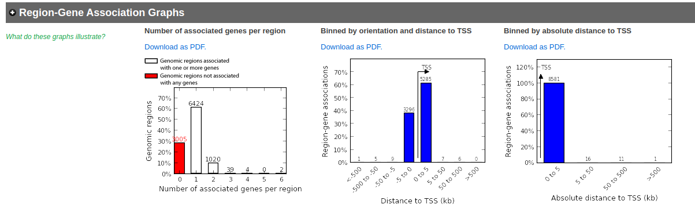

* Explore the GOBP results and export the results on your computer. 


Using this rule, genes will be associated with peaks only if they are within 1kb of the transcription start site of the genes. It reduces the problem to a gene list and in this case, a Fisher’s exact (Hyper FDR Q-Val) test can be applied to test for pathway enrichment. 

* Export the GO BP result on your local computer:
    * Under the **GO Biological Process** title, locate the **Table controls:** 
    * select the option **All ontology data as .tsv**. 
    * A file called greatExportAll.tsv will be saved on your computer. 
    * Rename the file **Proximal_GOBP_greatExportAll.tsv**. We will import this file later in Cytoscape/EnrichmentMap.


## Exercise 2 -  Build an enrichment map to visualize GREAT results

* Open Cytoscape
* In the menu bar, select **Apps** --> **EnrichmentMap**
* Drag and drop the GREAT result file **Distal_GOBP_greatExportAll.tsv** into the DataSet box.
* Set the FDR q value cut-off to **0.001**
* Click on **Build**


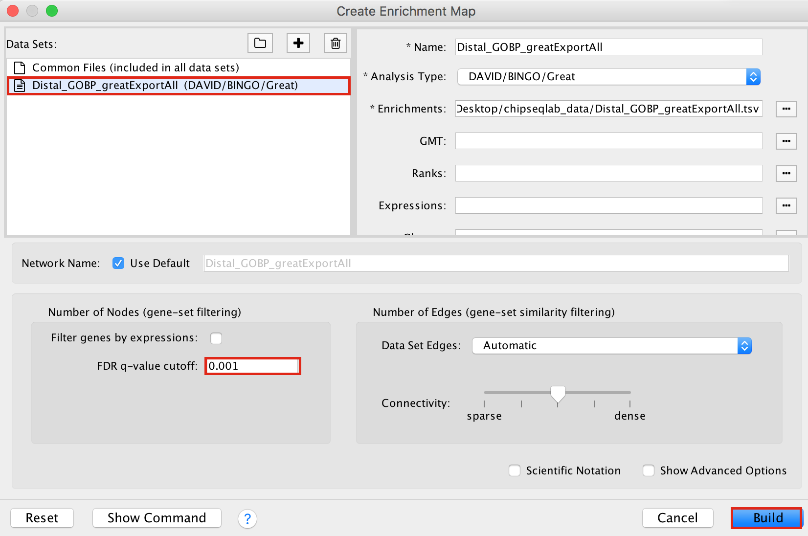

* A **Set Parameters** dialog box opens: Choose **Binomial p-value**.


* Explore the map.


* Note that EnrichmentMap creates annotations by default. You can delete the auto-generated annotation by going to the AutoAnnotate tab. Click on the settings menu (three lines) -> Delete. Now you can create new annotation as explained below.


## Exercise 3 (optional): Practice building enrichment maps and auto-annotation

### Optional exercise 3a: AutoAnnotate the enrichment map: 
* In the menu bar, select Apps and then AutoAnnotate. 
* A dialog box opens. 
* Go to Advanced. Under **Cluster Creation**, select **Use clusterMaker2 App**
* Under **Label Creation**, select **Name of most significant node in cluster**
* Click on **Create Annotations**. 


Arrange the display by clicking on each module name listed in the right panel and then move them apart from the other modules using a mouse or a trackpad.


```{block, type="rmd-question"}
What are the main biological functions enriched in genes associated with RUNX1 peaks? <br> Is it relevant in relation to what we know about the role of RUNX1 in development?
```

### Optional exercise 3b: Repeat the process of building an enrichment map using the proximal data (Proximal_GOBP_greatExportAll.tsv).
Because this is proximal data, the problem is reduced to a gene list and you can use the Fisher’s exact test (FDR 0.001) to looked at the enrichment results

### Optional exercise 3c: Repeat the process by building both the Proximal and Distal enrichment maps at the same time. 
* Drag both files in the EnrichmentMap input box.
* Use FDR 0.0001 for both and binomial test.
* Check which nodes are in common between the 2 datasets.  
* Color the data by datasets. 

## Exercise 4: Add RUNX1 targets and RUNX1 KO genes on the distal enrichment map.

During this exercise, we will connect the proximal chIP-seq enrichment map with the RUNX1 targets as well as the genes that are dysregulated after RUNX1 KO. We have already created a .gmt file that contains these gene lists (RUNX1_Affy.gmt). The format of a .gmt file is a tab delimited text file with one row per gene-set. Each gene-set contains the name of the gene-set, a description of the gene-set followed by the names of the genes. The file extension is changed from .txt to .gmt.


* Note: We extracted the RUNX1 targets using the iRegulon Cytoscape app and the optional exercise 6 describes the steps. We extracted 200 genes to build the RUNX1 target gene list.

This RUNX1 study had transcriptomics data (microarray) in addition to the chIP-seq data. The microarray data gives an overview of all genes that are changing between a fetal ovary with normal development and a fetal ovary after RUNX1 knock-out (KO) (GSE129038). We have used the tool GEO2R to get the top 500 up and down regulated genes (see description of the steps at the end the document).

### step 4a: post analysis:
* Go to the EnrichmentMap tab 
* Make sure that the Distal_GOBP_greatExportAll network is selected.
* click on **Options...** --> **Add Signature Gene Sets…**.


* Click on “Load from File….” located on the right hand size and select the file “RUNX1_Affy.gmt” that you have saved on your computer.
* Set “Test” to “Hypergeometric Test” with the “Cutoff” set to 0.05.
* Click on **finish**

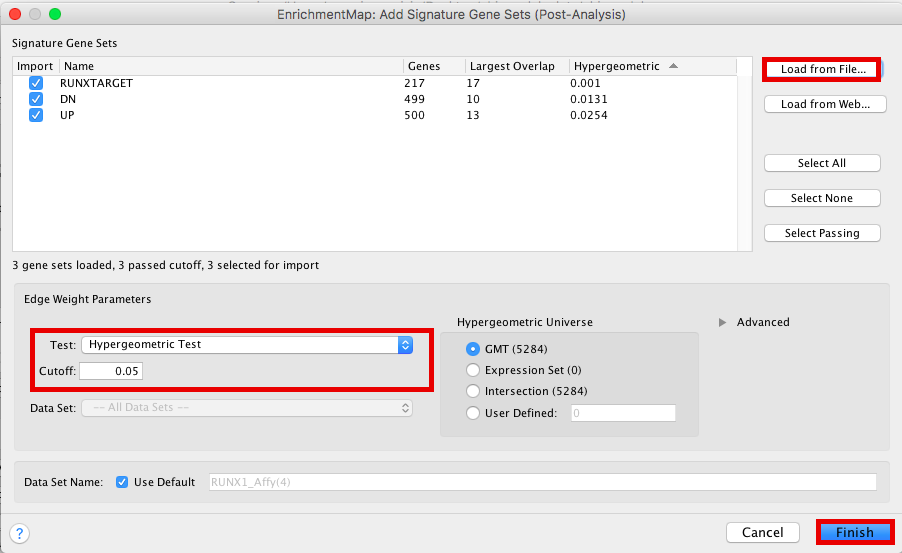


The 3 gene-sets are now added to the map. Each line (edge) shows pathways that have genes in common with the signature gene-sets.

### Step 4b Optional: Change the edge style of the signature gene-sets:

* Click on one signature gene-set node on the map to select it (it should appear in yellow). 
* In the Cytoscape menu bar, click “Select” --> “Edges” -->“Select Adjacent Edges” 


* Go to “Style” and in the “Edge” table, next to **Stroke Color (Unselected)** click in the bypass column Byp. , click on the box and select a color.

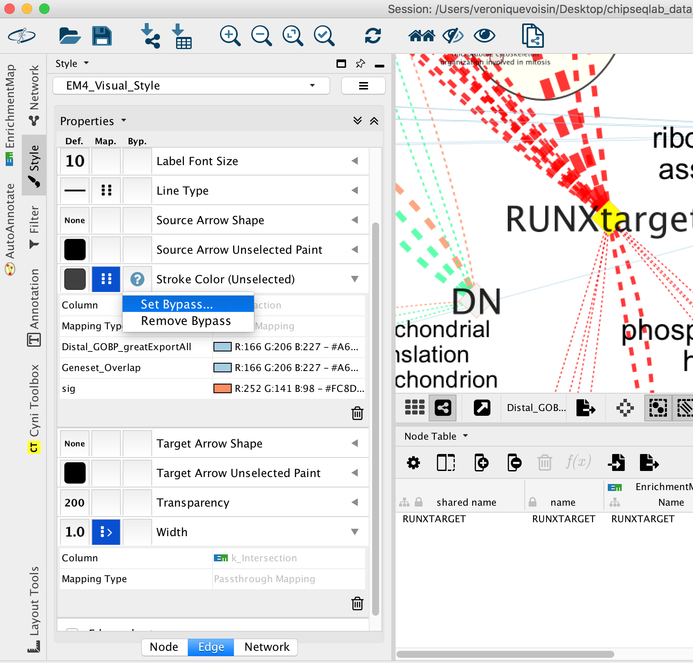

* Repeat for all genes:
    * In “ Style” and in the “Edge” table, go to Width and set Column to “EM k_Intersection”

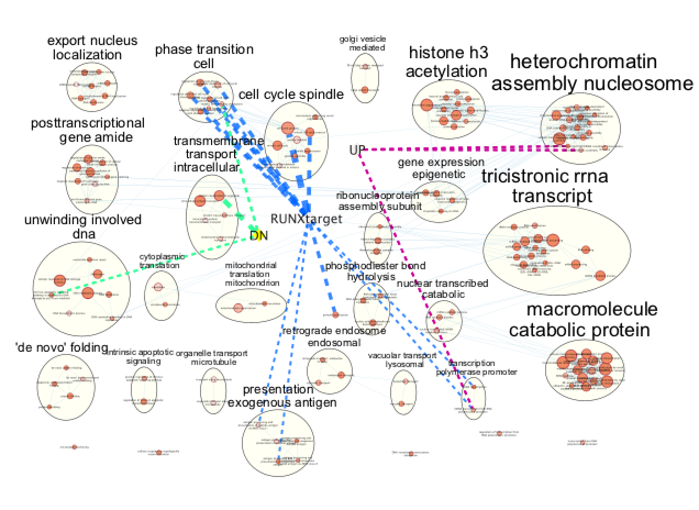

## Exercise 5: Learning how to run MEME-chip from the MEME suite (https://meme-suite.org/meme/tools/meme-chip)

### Format the Data 

* MEME suite accepts sequences as input and not chromosome coordinates. The bed file contains the chromosome coordinates of the peaks. Therefore, we first need to fetch all the peak sequences. UCSC genome browser (https://genome.ucsc.edu/) has some tools to help us.

* If needed, you can use the finalized formatted file [GSE128767_RUNX1_ChIP.peaks.fasta](./Module5/chipseqlab/chipseqlab_data/GSE128767_RUNX1_ChIP.peaks.fasta) to run MEME-chIP **but we encourage you to follow the below steps to learn how to do it yourself**.

* The step that we took to create it are described below and were adapted from https://fasta.bioch.virginia.edu/cshl/stubbs/meme-ex/meme.html.

### Exercise 5a: Download sequences from .bed coordinates

* Open the UCSC browser main page (http://genome.ucsc.edu/). 
* Click on *Genomes* in the menu bar and select  *Mouse GRCm38/mm10*. 

<p align="center">
  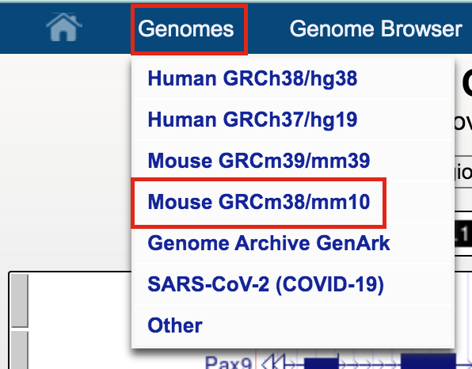
 </p>


* The UCSC Genome Browser window opens in a new tab.
* Below the tracks, click on the button *add custom tracks*. A new window will open.

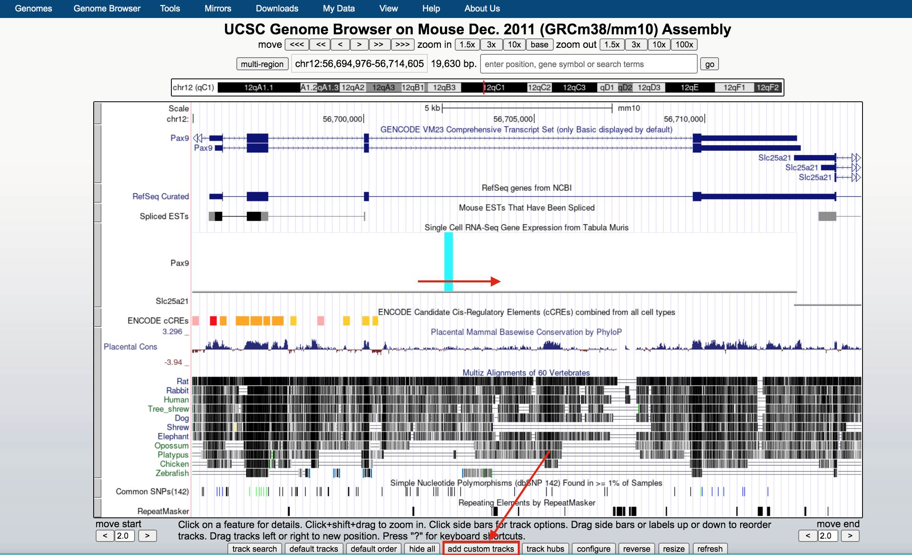


* Upload the bed file [GSE128767_RUNX1_ChIP.peaks.bed](./Module5/chipseqlab/chipseqlab_data/GSE128767_RUNX1_ChIP.peaks.bed);  press the **Submit** button. 

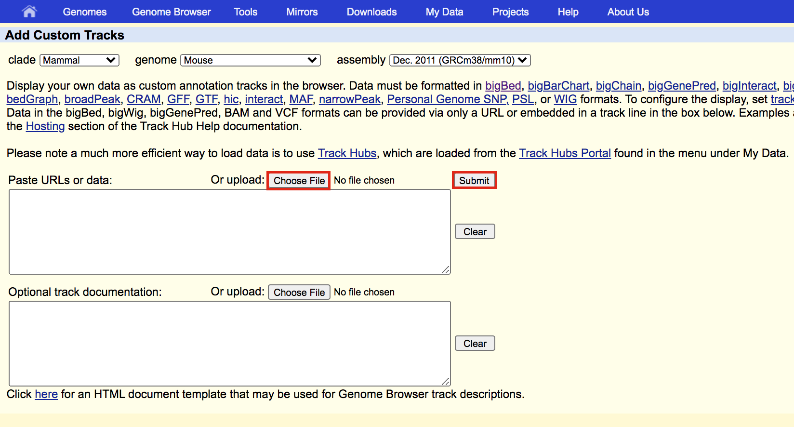


* A new window will appear with your updated track. Make sure that **Table Browser** is selected and click on *go*.


* A new window will appear.  Select *sequence* as *output format* and *plain text* as *file type returned*. Click on *get output*.


* A new window will open where you can choose various options for your sequence (e.g. repeat masking). Note that for meme and similar programs it is important to **mask repeats** to **N**; otherwise, sequences in repetitive elements will dominate your motif list.
    * Select *Mask repeats*
    * next to *Mask repeats* change option to *to N*
    * click on *Get sequences*
    
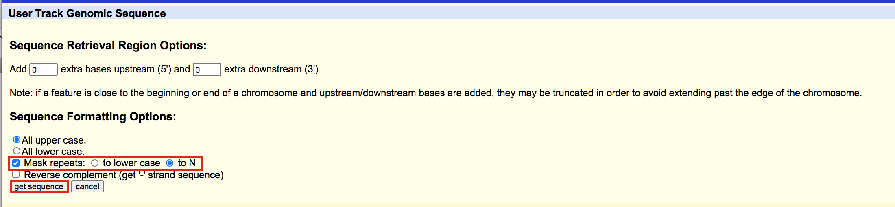

* A fasta file will appear; save this as plain text (copy and paste in a text editor or right click on the page and select *Save As...* and save the file to your computer).
  *	here is the file in case you need it: [GSE128767_RUNX1_ChIP.peaks_INTERMEDIATE.fasta](./Module5/chipseqlab/chipseqlab_data/GSE128767_RUNX1_ChIP.peaks_INTERMEDIATE.fasta)

* You will need to modify the UCSC header that comes with the sequences to use them for meme:

  * Go to https://fasta.bioch.virginia.edu/fasta_www2/clean_fasta.html
  * upload or copy and paste the plain text file from the above step
  * check Extract CHR:coordinates from UCSC
  * Click on “Clean Sequence”
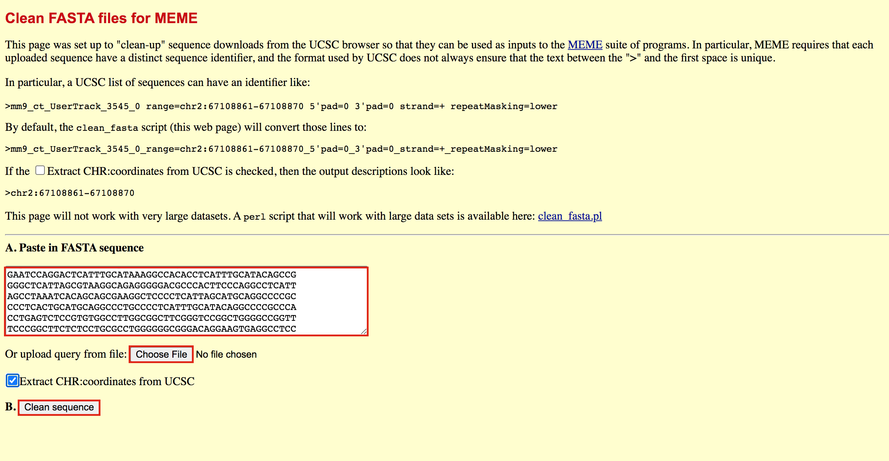
  * Save this as plain text under the name GSE128767_RUNX1_ChIP.peaks.fasta (copy and paste in a text editor or **right click and Save as will not work for this file**) - it will look like the below file.

<p align="center">
  
 </p>
### Exercise 5b: Run MEME-chIP

* Open https://meme-suite.org/meme/tools/meme-chip.
* Expand *Motif Discovery*
* Click on *MEME-Chip*


* Under *Input the primary sequences* box, upload the file [GSE128767_RUNX1_ChIP.peaks.fasta](./Module5/chipseqlab/chipseqlab_data/GSE128767_RUNX1_ChIP.peaks.fasta) . 
* Click on *Start Search*.

<p align="center">
  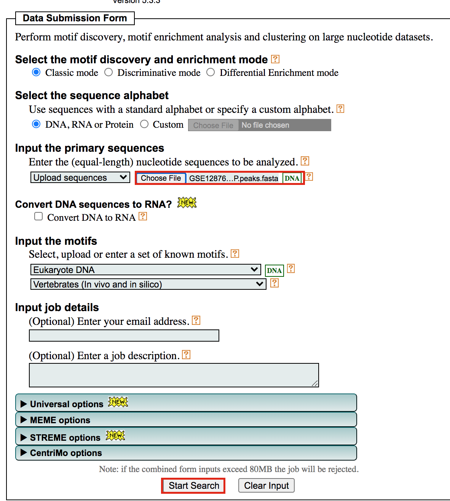


```{block, type="rmd-note"}
**Important**: Save the url so you can access your result later even if you close the MEME window. <br>

For example my url is - https://meme-suite.org/meme/info/status?service=MEMECHIP&id=appMEMECHIP_5.3.31620409506563-973419203 <br>


<p align="center">
  

```

* MEME-ChIP will run for about 1 hour: 
    * look at the results below from the MEME-chip result, 
    * try to answer the questions and follow next steps. 
    * Check your MEME-ChIP results at the end of the practical lab.


* When your job is complete you should see the following page on your saved link:

<p align="center">
  


* results of the top motifs that were found significantly enriched in the peak sequences.<br>


```{block, type="rmd-question"}
To which transcription factor does it correspond? <br> Why is the centered distribution of the motif important (what does it mean)?
```


## Exercise 6 (optional): Get the iRegulon RUNX1 targets and find the mouse orthologs using g:Orth (from g:Profiler) to create the gmt file used in Exercise 4.

* In Cytoscape, locate “App” in the menu bar and select “iRegulon” and then “Query TF-target database”

<p align="center">
  


* A “Query TF-target database for a factor” dialog box opens. 
    * Enter “RUNX1” in the *Transcription Factor* field and 
    * in *Network*, set “Number nodes (approx.)” to 200. 
    * Click on *Submit*

<p align="center">
  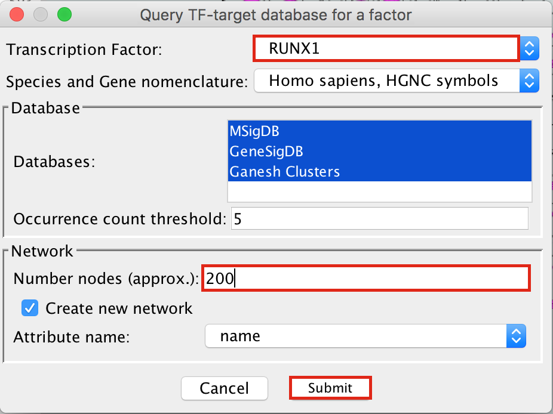


* To arrange the style, 
    * go to the Cytoscape menu bar and select *Layout* --> *yFiles Organic Layout*.
    * Go the Cytoscape menu and select *View* --> *Always Show Graphic Details* to see the gene names.
    
* Below the network in the Table Panel:
    * click on *Node Table* and 
    * click on the *Export Table to File…* icon. 
    * Click on *OK*.

<p align="center">
  

* A File *Metatargetome for RUNX1_1 default node.csv* is now saved to your computer.


* Open the file *Metatargetome for RUNX1_1 default node.csv* and 
    * copy the gene list.
    * Open g:Profiler/g:orth at https://biit.cs.ut.ee/gprofiler/orth.  
    * Paste the gene list into *Query* and 
    * in Options set Organism to Home sapiens and Target to Mus musculus. 
    * Click on the orange button *Run query*. 

<p align="center">
  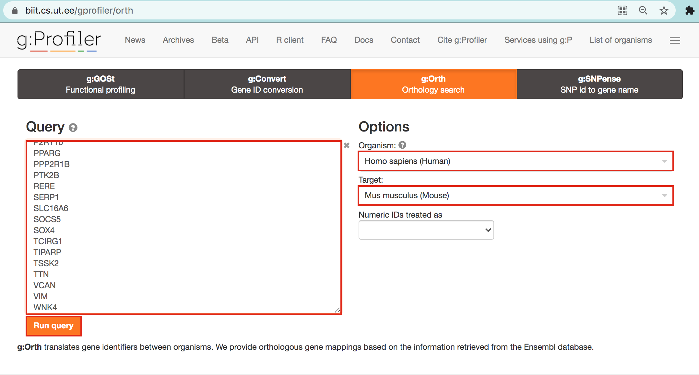


* Click on the icon next to the  “ortholog name” column to copy the gene list. This is the gene list containing the mouse orthologs of the RUNX1 targets that we used in Exercise 4.


**As reference (you don't need to go through these steps during the practical lab): Analysis of the RUNX1 Affy transcriptomics using GEO2R.** 

* Go to the GEO page corresponding to the Affymetrix transcriptomics data:https://www.ncbi.nlm.nih.gov/geo/query/acc.cgi?acc=GSE129038
* Click on Analyze with GEO2R
* Define your groups and click on Analyze
* Export the table
* Rank the genes using the absolute value of t
* Remove the gene name duplicates
* Select the top 500 genes up regulated using the largest t value and the 500 genes down regulated using the smallest t value

## End of Lab 
Congratulations!!

<!--chapter:end:8.1-Optional_chIP-seq_lab.Rmd-->

# Optional Module 8 Lab 2: Gene Regulation and Motif Analysis Practical Lab / iRegulon {#regulatory_network_lab}

**This work is licensed 
under a [Creative Commons Attribution-ShareAlike 3.0 Unported License](http://creativecommons.org/licenses/by-sa/3.0/deed.en_US). This means that you are able to copy, share and modify the work, as long as the result is distributed under the same license.**

*<font color="#827e9c">By Veronique Voisin, Chaitra Sarathy and Ruth Isserlin</font>*

## iRegulon lab

## Goal

 * Import a Cytoscape network and apply iRegulon on all the selected nodes. 
 * Explore and understand the main output features of iRegulon such as the Transcription target view. 
 * Learn how to display predicted targets of a specific transcription factor by creating its metatargetome.

This practical consists of 2 exercises. Follow the step-by-step checklist through the exercises. Some notes about iRegulon and information about the output values are written at the end of the document. 

Before starting the exercises, download the files:

```{block, type="rmd-datadownload"}
Right click on link below and select "Save Link As...".

Place it in the corresponding module directory of your CBW work directory.
```

*	[prostate_cancer_genemania_network.txt](./Module5/iregulon/data/prostate_cancer_genemania_network.txt)

```{block, type="rmd-note"}
in case the iRegulon server is not working, it is possible to work with pre-computed results. Please look at the instructions at the bottom of this page.
```

## Exercise 1. Detect regulons from co-expressed genes

In this exercise, we are using genes frequently mutated in prostate cancer. iRegulon requires a network in order to start. We will use a GeneMANIA network that we previously saved for this purpose. Using iRegulon, we will look for transcription factors (TFs) that may regulate a set of genes in this network. 
Note: iRegulon also accepts a simple gene list as input to create the network
 
To start this exercise, download to your computer the [prostate_cancer_genemania_network.txt](./Module5/iregulon/data/prostate_cancer_genemania_network.txt) file.

### Skills learned in this exercise: 

Create a network by importing a text file, run iRegulon to detect regulons, explore the iRegulon results, create a regulon subnetwork, save the results. 

### Steps


1)	Launch Cytoscape. Close the “Welcome to Cytoscape” window, if it’s enabled.	

Double click on the .  Cytoscape  icon.


2)	Create a network using the  ‘prostate_cancer_genemania_network.txt’ file.
      * In the menu bar select ‘File > Import > Network  from File…. A file open dialog pops up.<br>
      * Browse and locate the prostate_cancer_genemania_network.txt’ file.  Click the ‘Open’ button. An “Import Network From Table” dialog pops up.<br> 
      * Select the column ‘Entity 1’ .

      * Expand the menu using the arrow on the right and click the green circle button to set this column as ‘Source Node’. <br> 
      * Select the column ‘Entity 2’. 
      * Click the red bullseye to set this column as ‘Target Node’.<br> 
      * Click the ‘OK’ button.

The main window now displays the created network. Each node represents a gene. Edges represent the relationships (e.g physical interactions, co-expression)  between the genes (nodes) that were calculated by GeneMANIA.

 

```{block, type="rmd-tip"}
The shortcut ⌘+L (Mac) or Ctrl+L (Windows) is a quicker way to import a network from a file.	
```

```{block, type="rmd-tip"}
If you only see gray nodes, go to Style and choose default style.
```


3)	Improve the layout.
      * In the menu bar, select Layout > yFiles Organic Layout ( you need to install the yFiles layout algorithms app in Cytoscape app manager)<br> <br> 

4)	Select all nodes in the network. Click anywhere on the blank space and press ⌘+A (Mac) or Ctrl+A (Windows). Or you can also do this using the mouse. Click shift and drag from an empty space to the left of and above every node to an empty space to the right of and beneath every node. The selected nodes are now colored yellow.	


5)	In the menu bar, select Apps > iRegulon > Predict regulators and targets.A ‘Predict regulators and targets’ dialog pops up. 
      * Using the default parameters, click the ‘Submit’ button at the bottom of the page.A progress bar will pop up.
      * Wait until the running analysis is completed (usually less than 1 min). The progress bar will vanish, and a new right panel, “Results Panel” will be added to the main Cytoscape window.
      * Deselect all nodes by clicking on a blank space of the screen. The nodes are all cyan again.	

 
 

  


6)	Explore the results. 
      * Locate the ‘Results Panel’ on the right side of the window. 
      * Click on the ‘float window’ icon located at the upper right corner. 

```{block, type="rmd-tip"}
resize the ‘Result Panel’ window by expanding it horizontally and vertically, so you can see the results and the network simultaneously.
```

```{block, type="rmd-tip"}
mouse over column names to get a tooltip describing their meaning in more detail.
```	


7)	Explore the enrichment results in the Motifs tab from the Results Panel. It is a list of all DNA binding motifs that appear in more than one gene region from the prostate cancer gene list. They are ranked by the strongest Normalized Enrichment Score (NES). Some DNA binding motifs in the databases are related to a specific transcription factor, but others are not.
      * Check that ‘Motifs’ is the selected tab of the ‘Results Panel’.
      * Click on the row for this motif to display the motif’s sequence logo and related information at the bottom part of Results Panel.

 
On the above screenshot, there is an enrichment in the prostate gene list for a motif called
YOL108C from the yetfasco database.  The motif logo is displayed and it is very similar to the MITF binding motif. The genes from our network carrying this motif in their promoter region are indicated in red (TargetName). The rank indicates the number of motifs that they carry in their promoter region.

```{block, type="rmd-tip"}
Additional explanation about the results are located at the end of this document and in more detail in the iRegulon reference paper. 
``` 


8)	Explore the enrichment results in the Tracks tab. It is a list of all ChIP-seq datasets (or “tracks”) sorted by strongest enrichment from genes inour network. 
      * Select the  ‘Tracks’ tab of the ‘Results Panel’.
      * Find a ‘ClusterCode’ assigned to more than one track.	


 
T4 is a track cluster associated with 2 tracks and is highlighted in the table as an example.The 2 tracks are biological replicates (Rep1, Rep2) of a same chIP-seq experiment. The transcription factor used for this chIP_seq experiment is TCF12. The first track is ranked number 4 and the second track is ranked number 8.  The genes with TCF12 peaks in their promoter regions are listed in red under "TargetName".


9)	Explore the enrichment results in the Transcription Factors tabview. This is the most important tab as each row is a transcription factor that is a potential co-regulator of the genes in our network. Each row represents a cluster that combines the results of the related motifs (Motifs tab) or tracks (Tracks tab) or both.
      * Select the ‘Transcription Factors’ tab of the ‘Results Panels’. 
      * Click on ‘MTF1’ and explore the results. 	


  


MTF1 is associated with the motif cluster M1. This cluster contains 6 related motifs and  11 potential target genes. One motif (homer-M00129) selected as example in the above screenshot is directly annotated to the TFs NRF1 and ZSCAN10 as indicated by green checked signs. 


10)	How did iRegulon perform? Is MTF1 (metal-transcription factor 1) known to be expressed or to play a role in prostate cancer?

```{block, type="rmd-tip"}
Open your web browser and search the web for [MTF1 “prostate cancer”].	
```

 
 
This network highlights MTF1 and interactions with other genes and miRs. This is a network involved in prostate cancer.<br>
PMID:14568174<br>
PMID:23157640


11)	Add MTF1 to the network.
      * Check that the Transcription Factors tab is selected. 
      * Click the MTF1 row to select it.
      * Click the ‘Add regulator’ icon  located at the upper left corner of the ‘Results Panel’.
This adds MTF1 to the network as a yellow node, with the edges linking to its 11 potential targets, all highlighted as purple nodes.	

11a)

  

11b)
 


12)	Create a subnetwork to better visualize the predicted targets.
      * Select the MTF1 node in the network by clicking on it. 
      * In the Cytoscape toolbar above the network, click the ‘First Neighbors of Selected Nodes’ icon . MTF1 and its targets are now highlighted in yellow (which means they are selected).
      * Use the ‘New network from selection’ icon  to create a subnetwork. 	

12a)
 


12b)
 

 
```{block, type="rmd-tip"}
If the node colors are not purple, go to Style and choose 'iRegulon Visual Style'.	
```

 

13)	Add to the figure information on the types of interactions obtained from GeneMANIA and stored as additional information in the ‘prostate_cancer_genemania_network.txt’ file.
      * In the Control Panel at the left of the window, select the ‘Style’ tab. At the bottom of the panel, select the ‘Edge’ tab. 
      * Locate the ‘Stroke Color’ property and click the right triangle to expand the box.
      * Change the ‘Column’ field to ‘Network group’
      * Verify that the  ‘Mapping Type’ field is ‘Discrete Mapping’
      * For the first interaction type, choose a color by clicking on the ‘Edit color’ button   on the right side of the color field. Choose a color and click the ‘OK’ button. 
      * Repeat that step, choosing a different color for each interaction type.
The edges should now be colored by the types of interactions. 	


13a)
 

 

13b)
 

 

14)	Save current results  as an iRegulon (iRF) file.
      * In the ‘Results Panel’ toolbar, click the ‘Save current results  as an iRegulon (iRF) file’ button  ..
      * Choose a name and click the ‘Save’ button.
      
```{block, type="rmd-tip"}
you can reuse these iRegulon results by loading this iRF file using the ‘Load saved results’ icon  .. 
```

14a)
 

 


15)	Save the Cytoscape session .
      * In the Cytoscape menu bar, select File > Save as.
      * Choose a name and click the ‘Save’ button.
      
```{block, type="rmd-tip"}
you can re-open this file later to examine the network further.
```

 

 


## Exercise 2. Create a metatargetome using iRegulon and merge 2 networks in Cytoscape.

This exercise does not require additional files.

This exercise will teach you to use the metatargetome function of iRegulon. This function displays a list of potential targets for a specific TF. We will create the metatargetome of two TFs, that we found as potential coregulators of the prostate cancer genes (exercise 1): MTF1 and LARP4. We will then learn how to use Cytoscape to merge two networks and visualize nodes in common.


**Steps**

1)	Launch Cytoscape.
      * If Cytoscape is already opened,  do File > New > Session. A ‘Current session will be lost. Do you want to continue?’ dialog opens. Click on ‘OK’. 	
      * Double click on the   Cytoscape  icon.

2)	Create the metatargetome for MTF1.
      * From the menu bar , select File > Apps > iRegulon> Query TF-target database.A ‘Query TF-target database for a factor’ window pops up.
      * In the ‘Transcription Factor’ field, select ‘MTF1’. 
      * Set Network > ‘Number nodes (approx.)’ to 100. 
      * Click the ‘Submit’ button.	

2a)

  

2b)

  

2c)

  


3)	Create the metatargetome for LARP4. Follow same steps as above.
      * From the Cytoscape menu bar, select File > Apps>iRegulon> Query TF-target database.
      * A ‘Query TF-target database for a factor’ window pops up. In the ‘Transcription Factor field’, enter ‘LARP4’. 
      * Set Network > ‘Number nodes (approx.)’ to 100.
      * Click the ‘Submit’ button.	

3a)

  

3b)

  


4)	Merge the two networks to visualize their shared target genes.
From the Cytoscape menu bar, select Tools > Merge > Networks….An ‘Advanced Network Merge’ window pops up.
      * Check that the ‘Union’ option is selected. 
      * In the ‘Available Networks’ list, select ‘Metatargetome for LARP4’.
      * Hold down the shift key while selecting ‘Metatargetome for MTF1’ so both networks are selected.
      * Click the right arrow to move the networks to the ‘Networks to Merge’ list.
      * Click the ‘Merge’ button.
Cytoscape now displays the two networks in the same window, linked by the two genes they have in common.

4a)

  

4b)

  

4c)

  


#### END  OF EXERCISE

### Use our precomputed iRegulon results:

Download these files on your computer:

```{block, type="rmd-datadownload"}
Right click on link below and select "Save Link As...".

Place it in the corresponding module directory of your CBW work directory.
```

*	[prostate_cancer_genemania_network.cys](./Module5/iregulon/data/prostate_cancer_genemania_network.cys)

*	[iregulon_results.irf](./Module5/iregulon/data/iregulon_results.irf)

1) launch Cytoscape

2) open the "prostate_cancer_genemania_network.cys" file

3) go to App > iRegulon > 'Load results from the iregulon_results.irf file'  


### Notes about iRegulon:

Website: <http://iregulon.aertslab.org/>
Tutorials: <http://iregulon.aertslab.org/tutorial.html#clusters> 
Paper: <http://journals.plos.org/ploscompbiol/article?id=10.1371/journal.pcbi.1003731> [PMID:25058159]

#### Motif oriented view:

Each line is a DNA binding motif  those sequence has been located in 20 kb regions centered around the TSS (transcription start site) of genes from the prostate cancer list (= genes in the network). The genes from the network which contained this DNA binding motif are called the target genes and displayed in the ‘Target Name’ column. Their ranks are also indicated. 

DNA binding motifs more usually represent a family of transcription factors (e.g.  helix loop helix TFs ) rather than being specific to one particular TF. In addition, related TFs (e.g GATA1, GATA2, GATA3) can bind to very similar DNA sequences.  iRegulon uses the motif2TF algorithm to associate a motif with a specific TF. The ‘#TF’ column indicates which motifs are significantly associated to a TF (# >= 1) or not (# = 0). Clicking on a motif line will display a panel indicating several related information. It will display all the TFs found significantly associated with the motif. 

How is the enrichment calculated? (NES AUC) motif detection and enrichment score in a set of input genes.
iRegulon uses precomputed results to calculate for each motif the AUC (Area Under the cumulative Recovery Curve)  and the NES (Normalized Enrichment Score).   iRegulon accesses this database of precomputed results using a server connection when a search is launched.

**What are these precomputed results :** 

iRegulon gathered known DNA binding motifs and their corresponding PWM (position weight matrix, see lecture) from different databases (eg TRANSFAC pro)  (9713 PWMs). They then ranked all genes in the genome  (22284 genes) for each motif from the most likely target of this motif to the least one (available for Human, Mouse and Drosophila). 

**Calculating enrichment for our set of genes (our network) :** 

Each ranked list (each motif) is then tested with our set of genes to see whether genes in our list are located more at the top of the ranked list (most likely targets of the motifs). From this ranked list and the overlap with our gene list, the AUC (Area Under the cumulative Recovery Curve) is calculated for each motif. The AUC is going to be larger if we have more genes at the top of our list. The higher the AUC values and the higher the tested motif is likely to co-regulate our genes (or some of them). The NES is derived from the AUC. The optimal subset of highly ranked lists are set as the potential target genes and displayed in the ‘target name’ column.

**How are several motifs being similarly grouped  under a same cluster code?**

To find TF associated with motifs, iRegulon uses the motif2TF algorithm. During this computation of motif2TF, motifs sharing similarities are grouped together and form a cluster. Within this cluster, some motifs are already known to correspond to a specific TF (direct annotation). This information is used to associate a motif with one or more related TFs. The ‘ClusterCode’ column indicates the cluster assigned to each motif.


**Tracks oriented view:**

Each line is an ENCODE Chip_Seq track. Chip_seq are sequencing of fragments bound to a specific TF after immunoprecipitation of the TF and the DNA fragments. Each track is then specific to a transcription factor (the #TFs columns is always equal to 1). Clusters contain more than one track only if these tracks were generated using the same TF. All the values (NES, AUC,... are the same for the motif, track of transcription factor oriented views. 

**Transcription Factors oriented view:**

Each line is a cluster of motifs and or tracks and as the next column (TF) the best representative TF of this cluster determined by the motif2TF algorithm. All the values (NES, AUC,... are the same for the motif, track of transcription factor oriented views. 

**Metatargetome:**

iRegulon uses the pre-computed results not only for finding regulons but also for displaying the potential gene targets for any TF of interest available in the iRegulon database. Users can define the number of top potential targets they want to display. The result is visualized as a network using a circular layout with the TF of interest in the center of the network.  

### Notes about Cytoscape:

Link to tutorials showing how to format data to create a Cytoscape network starting from a simple gene list:
<http://wiki.cytoscape.org/Cytoscape_User_Manual/Network_Formats>

**Note about organic layout:**

“The organic layout style is based on the force-directed layout paradigm. When calculating a layout, the nodes are considered to be physical objects with mutually repulsive forces, like, e.g., protons or electrons. The connections between nodes also follow the physical analogy and are considered to be springs attached to the pair of nodes. … The layout algorithm simulates these physical forces and rearranges the positions of the nodes in such a way that the sum of the forces emitted by the nodes and the edges reaches a (local) minimum.

Resulting layouts often expose the inherent symmetric and clustered structure of a graph, they show a well-balanced distribution of nodes and have few edge crossings.” http://docs.yworks.com/yfiles/doc/developers-guide/smart_organic_layouter.html . 


############################################################

## Exercise 3. Use Enrichr with the prostate gene list.

Before starting the exercise, download the files:

*	[prostate_genelist.csv](./Module5/iregulon/data/prostate_genelist.csv)
*	[TRRUST_Transcription_Factors_2019_table.txt](./Module5/iregulon/data/TRRUST_Transcription_Factors_2019_table.txt)
*	[TTRUST_rank.xlsx](./Module5/iregulon/data/TTRUST_rank.xlsx)

### Goal

 * Use Enrichr on the prostate gene list and explore which transcription factors were predicted to be regulator on the same gene list used for the iRegulon lab.

 * After exploring the Enrichr results, we are going to export it into Cytoscape/EnrichmentMap. This is another opportunity to learn how to create a network and modify its style.

### Steps

1)	Launch Enrichr on a web browser using this address: https://amp.pharm.mssm.edu/Enrichr/

2) In the input data window, copy and paste the genes from the [prostate gene list](./Module5/iregulon/data/prostate_genelist.csv) 

 

3) Click on the 'Submit' button

4) The results are now displayed. Check that the 'Transcription' tab is the one selected.<br> 
      * Explore the results from the different gene-set libraries on your own (CHEA 2016, TRANSFAC and JASPAR PWMs, etc...) . 

5) Then, click on the gene-set library called "TRRUST Transcription Factors 2019"
      * TRRUST (https://www.grnpedia.org/trrust/) is a manually curated database of human and mouse transcriptional regulatory networks. Each gene-set contained some target genes for a particular transcription factor. It contains mouse and human data. They have been derived from pubmed articles which describe small-scale experimental studies of transcriptional regulations.
      * We are going to explore the result in this library as some gene-sets are significantly enriched at FDR < 0.05.<br> 
      * The observation of the bar graph indicates that the transcription factor NR5A1 is the most significant result.

6) Click on the 'Table' to display the results as a table.<br> 
      * Remember from the presentation that the Adjusted p-value represents the FDR. As the FDR is less than 0.05, all these gene-sets are significantly enriched in our gene list. 

7) Click on the 'Export entries to table'. Open the file that was downloaded on your computer in excel.<br> 
      * This table contains all the gene-sets significantly enriched or not.
      * The 'Term' column contains the name of the transcription factors and the last column 'Genes' contains the list of genes that are the targets of these transcription factors. All these genes are the ones present in the prostate gene list. The overlap 8/22 means that 22 genes are the known target of NR5A1 and 8 are present in the prostate gene list.
      * We are going to use this table to create an enrichment map in Cytoscape. 

7) Open Cytoscape.

8) Click in the menu bar on 'Apps' and 'EnrichmentMap'. A 'Create Enrichment Map' dialog box opens. 

9) Drag and drop the  [TRRUST_Transcription_Factors_2019_table.txt](./Module5/iregulon/data/TRRUST_Transcription_Factors_2019_table.txt) in the 'Data Sets' window. 
      * On the right, check that the "Analysis Type" is set to "Generic/gProfiler/Enrichr". 
      * Set the 'FDR q-value cutoff' at 0.05.

 

10) Click on the 'Build' button.

11) An enrichment map is now created.<br> 
      * The nodes are the transcription factor gene-sets. You can click on a node to see the genes that are the targets of these transcription factors. Transcription factors are connected by edges if they have target genes in common. 

12) Modify the visual style
      * In the EnrichmentMap tab on the left, locate 'Style' and set "Chart Data" to '--None--'.
 

13) Import a file
      * Our goal is to adjust node size and node color relatively to the gene-set enrichment results. To make it easier, a file has been created for you that ranks the gene-sets from 1 to 98 in the order of the adjusted p values. We will import this file in Cytoscape as a node table. 
      * To import the file, locate 'File' in the Cytoscape menu bar and then 'Import' > 'Table from File'.<br> 
      * Browse your computer to find the file [TTRUST_rank.xlsx](./Module5/iregulon/data/TTRUST_rank.xlsx) that you have downloaded at the beginning of part 3 and click 'Open'.
      * An 'Import Columns From Table' dialog box opens. Click on 'OK'.


14) Play with the visual style
      * Locate the Cytoscape 'Style' tab<br>
      * Locate the 'Cytoscape 'Style' tab 'Fill Color' property in the Node tab and expand the tab using the arrow on the right
      * Remove the current mapping using the trash can icon.<br>
      *  In 'Column', choose "myrank" and in 'Mapping Type', choose 'Continuous Mapping'.<br>
      * Locate the 'Size' property and expand the tab using the arrow on the right
      * Remove the current mapping using the trash can icon.<br>
      * In 'Column', choose "myrank" and in 'Mapping Type', choose 'Continuous Mapping'.
      * Set high node size values for low rank and low node size for high rank<br>
      * The enrichment map shows now in yellow and large nodes the transcription factors that were the most significantly enriched (based on the adjusted p value ranking). It also shows the links to the other gene-sets.<br>
      * NR5A1 (the most significant gene-set) is indeed known to be associated with prostate cancer. The prostate is a hormone-dependent organ. NR5A1 is a steroid nuclear receptor and has now been reported to be expressed in aggressive forms of prostate cancer (https://academic.oup.com/endo/article/155/2/358/2423115). 


### end of practical lab
Congratulations!


<!--chapter:end:8.2-Optional_iRegulon_lab.Rmd-->

# Optional Module 8 Lab 3: Automated Enrichment and Visualisation Lab using `clusterProfiler`  

**This work is licensed under a [Creative Commons Attribution-ShareAlike 3.0 Unported License](http://creativecommons.org/licenses/by-sa/3.0/deed.en_US). This means that you are able to copy, share and modify the work, as long as the result is distributed under the same license.**

*<font color="#827e9c">By Chaitra Sarathy</font>*

## `clusterProfiler` lab

`clusterProfiler` is an R package that implements methods to perform both functional annotation and visualization of genes and gene clusters. 
  
* It can accept data from a variety of experimental sources such as DNA-seq, RNA-seq, microarray, Mass spectometry, meRIP-seq, m6A-seq, ATAC-seq and ChIP-seq and thus can be applied in diverse scenarios. 
* It provides a tidy interface to access, manipulate, and visualize enrichment results to help users achieve efficient data interpretation. 

[clusterProfiler](https://www.bioconductor.org/packages/release/bioc/html/clusterProfiler.html) is released within the [Bioconductor project](https://www.bioconductor.org/packages/release/bioc/html/clusterProfiler.html) and the source code is hosted on [GitHub.](https://www.bioconductor.org/packages/release/bioc/html/clusterProfiler.html)


## Goal

* Learn how to write R scripts for going from gene list to enriched pathways
* Learn how to run over representation analysis (ORA) and gene set enrichment analysis (GSEA) using functions in the [clusterProfiler](https://www.bioconductor.org/packages/release/bioc/html/clusterProfiler.html) R package
* Explore results of enrichment analysis using various visualisation options in clusterProfiler


## Supported Analysis

For functional annotation, `clusterprofiler` provides R functions to perform

+ Over Representation Analysis
+ Gene Set Enrichment Analysis
+ Biological theme comparison

In this practical, we will be learning how to run Over Representation Analysis and Gene Set Enrichment Analysis in 2 exercises. Follow the step-by-step checklist. 

Before starting the exercises, make sure that `clusterProfiler` and other required packages are installed and loaded. Run "prework_module8_clusterprofiler.R"
before following this module.


## Install and load packages

To run enrichment analysis using `clusterProfiler`, we need a few additional packages `org.Hs.eg.db`, `DOSE`, `tidyverse`, `enrichplot`, `ggupset`. Install and load all necessary packages using this code:

```{r}
# install and load the package  manager
if (!requireNamespace("BiocManager", quietly = TRUE))
  install.packages("BiocManager")

# list the required bioconductor packages 
bio.pkgs = c("clusterProfiler", "org.Hs.eg.db", "DOSE", "tidyverse", "enrichplot", "ggupset")

# install
BiocManager::install(bio.pkgs)

# load all at once
invisible(lapply(bio.pkgs, function(x) library(x, character.only=TRUE, quietly = T)))
```

Once all packages are loaded, we can get started with exercises.

## Exercise 1a. Over representation analysis

`clusterProfiler` supports over representation analysis against various sources such as GO annotation, KEGG pathway, MSigDB to name a few. For the full list please refer [this link.](https://guangchuangyu.github.io/software/clusterProfiler/)

In this exercise, we will learn over representation analysis using the gene ontology annotations. This is implemented in the function `enrichGO()`.

### Data for enrichment using `clusterProfiler`

Let us start with loading the dataset `geneList` that is provided by the package `DOSE`. 

```{block, type="rmd-note"}
DOSE provides an example dataset `geneList`. It comes from analysis of a [breast cancer dataset](https://bioconductor.org/packages/release/data/experiment/html/breastCancerMAINZ.html) that had 200 samples, including 29 samples in grade I, 136 samples in grade II and 35 samples in grade III. The ratios of geometric means of grade III samples versus geometric means of grade I samples were computed. Logarithm of these ratios (base 2) are stored in `geneList` dataset.
```

```{r}
data(geneList, package="DOSE")
```

A variable called `geneList` should be loaded in your R environment. What does it look like?

```{r}
head(geneList)
```

```{block, type="rmd-note"}
As you can see, first line of output has names of genes in Entrez gene ID format and the second line has fold change values of genes.
```

### Data for over representation analysis using `clusterProfiler`

For running an over representation analysis, we need only a list of gene names or IDs. Let us extract out the genes which had an expression value >2 or <-2 using the function `names()`

```{r}
gene <- names(geneList)[abs(geneList) > 2]

head(gene)
```
`gene` has a list of 207 genes. 

### Perform GO over representation analysis

Now, run `enrichGO()` with this list of genes and examine the results

```{r}
ego <- enrichGO(gene          = gene,
                universe      = names(geneList),
                OrgDb         = org.Hs.eg.db,
                ont           = "ALL",
                pAdjustMethod = "BH",
                pvalueCutoff  = 0.01,
                qvalueCutoff  = 0.05,
                readable      = TRUE)

```

### Results of GO over representation analysis

Examine the results. Do you notice any similarities or differences between this output format and your results from **Module 2** `gProfiler`?

The output table is stored in `ego@result`. In this example, 152 processes were significantly enriched.

```{r}
head(ego)
```

```{r}
nrow(ego@result)
```

### Input options for `enrichGO()`: 

```{block, type="rmd-note"}
 * The default option for `gene` is entrez gene ID, but other gene ID formats are supported in GO analyses. You should specify the `keyType` parameter to specify the input gene ID type (More details below)
 * We have selected all genes measured in the experiment as our `universe.` 
 * You can specify subontology using the argument `ont`. It takes one option among - "BP", "MF", "CC" or "ALL" for biological process, molecular function, cellular co-localization or all subontologies respectively.
 * If `readable` is set to `TRUE`, the input gene IDs will be converted to gene symbols.
 * OrgDb is the genome annotation database of organism that your gene list is coming from. Since our `geneList` is from human breast cancer, we have provided human OrgDb object (`org.Hs.eg.db`). See the section  "A note on supported organisms" for more details.

Gene IDs can be converted to different formats using `bitr()` function.
```

```{r}
# convert from entrez gene ID to ensembl ID and gene symbols
gene.df <- bitr(gene, 
                fromType = "ENTREZID",
                toType = c("ENSEMBL", "SYMBOL"),
                OrgDb = org.Hs.eg.db)
head(gene.df)
```

```{block, type="rmd-note"}
Various options for `keyType` can be found using `keytypes(<name of organism annotation>)`. For example: `keytypes(org.Hs.eg.db)`
```

### Simplify `enrichGO()` results

GO enrichment typically contains redundant terms. You **may** use the `simplify()` function to reduce redundancy of enriched GO terms using the default parameters. Please note that simplifying is not always a necessary step. You can choose to omit it, based on the nature of your result tables.

```{r}
ego.sim = clusterProfiler::simplify(ego)
nrow(ego.sim)
```

## Exercise 1b. Visualise the results of GO over representation analysis

### Barplot

Bar plot is the most widely used method to visualize enriched terms. It shows the enrichment scores (e.g. p values) and gene count or ratio as bar height and color. You can specify the number of terms (most significant) to display via the `showCategory` parameter.

```{r, fig.height=9, fig.width=7}
barplot(ego.sim, showCategory=20) + ggtitle("ORA barplot (top 20)")
```
You can plot other variables such as `log10(p.adjust)` by modifying using `mutate()` from the `tidyverse` package

```{r, fig.height=9, fig.width=7}
mutate(ego.sim, qscore = -log(p.adjust, base=10)) %>% 
    barplot(x="qscore", showCategory=20) + ggtitle("ORA barplot - qvalue (top 20)")
```

### Dotplot

Dot plot is very similar to bar plot. It has additional capability to encode another score as dot size.

```{r, fig.height=9, fig.width=7}
dotplot(ego.sim, showCategory=20) + ggtitle("Dotplot for ORA (top 20)")
```

### Enrichment Map
Enrichment map organizes enriched terms into a network with edges connecting overlapping gene sets. In this way, mutually overlapping gene sets are tend to cluster together, making it easy to identify functional module. Before making the map, similarity must be calculated. This can be done using `pairwise_termsim()`

```{r, fig.height=9}
edo <- pairwise_termsim(ego.sim)
emapplot(edo)+ ggtitle("ORA Enrichment Map")
```

### Upset plot

The upsetplot is for visualizing the complex association between genes and gene sets. It emphasizes the gene overlapping among different gene sets.

```{r}
upsetplot(edo, n=5) + ggtitle("ORA upset plot (top 5)")
```

### Details about the input arguments for `enrichGO()`

`gene` a vector of entrez gene ID. 
`OrgDb`	OrgDb object
`keyType` keytype of input gene
`ont`	One of "BP", "MF", and "CC" subontologies, or "ALL" for all three
`pvalueCutoff`	adjusted pvalue cutoff on enrichment tests to report
`pAdjustMethod`	one of "holm", "hochberg", "hommel", "bonferroni", "BH", "BY", "fdr", "none"
`universe`	background genes. If missing, the all genes listed in the database (eg TERM2GENE table) will be used as background
`qvalueCutoff`	qvalue cutoff on enrichment tests to report as significant. Tests must pass i) pvalueCutoff on unadjusted pvalues, ii) pvalueCutoff on adjusted pvalues and iii) qvalueCutoff on qvalues to be reported
`minGSSize`	minimal size of genes annotated by Ontology term for testing
`maxGSSize`	maximal size of genes annotated for testing
`readable`	whether mapping gene ID to gene Name

## A note on supported organisms

GO analyses in `clusterProfiler` support organisms that have an `OrgDb` object available. `OrgDb` (organism databases) objects are databases that contain genome annotations and thus, they are best for converting gene IDs or obtaining GO information for current genome builds.A list of organism databases can be found [here](https://www.bioconductor.org/packages/release/BiocViews.html#___OrgDb)

## Exercise 2a: Gene set enrichment analysis

### Data for running gene set enrichment analysis in `clusterProfiler`

GSEA analysis requires a ranked gene list, which contains three features:

 * numeric vector: fold change or other type of numerical variable
 * named vector: every number has a name, the corresponding gene ID
 * sorted vector: number should be sorted in decreasing order

Since `geneList` is already in the desired format, we will use it for this exercise. If you haven't loaded it, use the command below to import the data. Please see the above section "Data for enrichment using `clusterProfiler`" for details regarding the dataset. 

```{r}
data(geneList, package="DOSE")
head(geneList)
```

### Perform GO gene set enrichment analysis

The `clusterProfiler` package provides the `gseGO()` function for gene set enrichment analysis using gene ontology. You can run GSEA as below:

```{r}
set.seed(100)
egsea <- gseGO(geneList     = geneList,
               OrgDb        = org.Hs.eg.db,
               ont          = "ALL",
               minGSSize    = 100,
               maxGSSize    = 500,
               pvalueCutoff = 0.05,
               pAdjustMethod = "BH",
               eps = 0,
               verbose      = FALSE)
```

### Results of GO gene set enrichment analysis

Examine the results. Do you notice any similarities or differences between this output format and your results from **Module 2** `GSEA`?

The output table is stored in `egsea@result`. In this example, 512 processes were significantly enriched.


```{r}
head(egsea)
```

```{r}
nrow(egsea@result)
```


### Input options for `gseGO()`

```{block, type="rmd-note"}
 * Note that only gene sets having the size within [`minGSSize`, `maxGSSize`] will be tested.
 * Similar to `enrichGO()`, you can specify subontology using the argument `ont`. It takes one option among - "BP", "MF", "CC" or "ALL" for biological process, molecular function, cellular co-localization or all subontologies respectively
 * `pvalueCutoff` defines the cutoff for pvalue that is used for determining significant processes
 * Setting `eps` to zero improves estimation.
 * `pAdjustMethod` can be	one of "holm", "hochberg", "hommel", "bonferroni", "BH", "BY", "fdr", "none"
```


### Details about the input arguments for `gseGO()`

`geneList`	order ranked geneList
`ont`	one of "BP", "MF", and "CC" subontologies, or "ALL" for all three
`OrgDb` OrgDb
`keyType`	keytype of gene
`exponent` weight of each step
`minGSSize` minimal size of each geneSet for analyzing
`maxGSSize`	maximal size of genes annotated for testing
`eps`	This parameter sets the boundary for calculating the p value
`pvalueCutoff`	pvalue Cutoff
`pAdjustMethod`	`pAdjustMethod`	one of "holm", "hochberg", "hommel", "bonferroni", "BH", "BY", "fdr", "none"
`verbose`	print message or not
`seed`	logical
`by`	one of 'fgsea' or 'DOSE'

## Exercise 2b. Visualise the results of gene set enrichment analysis

### Dotplot

You can use the function `dotplot()` to summarise GSEA results.

```{r, fig.height=9, fig.width=7}
dotplot(egsea, showCategory=20) + ggtitle("Dotplot for GSEA (top 20)")
```

### Ridgeline plot 

The function `ridgeplot()` will visualize expression distributions of core enriched genes for GSEA enriched categories. It helps you to interpret up/down-regulated pathways.

```{r, fig.height=10, fig.width=7}
enrichplot::ridgeplot(egsea, showCategory = 20) + ggtitle("Ridgeplot for GSEA (top 20)")
```

### Running score and preranked list of GSEA result

Running score and preranked list are traditional methods for visualizing GSEA result. You are familiar with these visualisations from Module 2. The function `gseaplot()` supports visualising both the distribution of the gene set and the enrichment score.

```{r}
gseaplot(egsea, geneSetID = 1, by = "runningScore", title = egsea$Description[1])
```

```{r}
gseaplot(egsea, geneSetID = 1, by = "preranked", title = egsea$Description[1])
```

Another method to plot GSEA result is the `gseaplot2` function:

```{r}
gseaplot2(egsea, geneSetID = 1, title = egsea$Description[1])
```


### Enrichment Map
The function `emapplot` also supports visualising results of GSEA. As we did before, let us first calculate similarity using `pairwise_termsim()`

```{r, fig.height=9}
edo2 <- pairwise_termsim(egsea)
emapplot(edo2)+ ggtitle("GSEA Enrichment Map")
```
```

## What next? 

This figure gives a complete overview of functionalities of `clusterProfiler`

 

## Explore other features of `clusterProfiler`

For other functionalities in `clusterProfiler` please refer to detailed examples in this [book](https://yulab-smu.top/biomedical-knowledge-mining-book/index.html)

### Bonus - Try it yourself: 
```{block, type="rmd-bonus"}
Using your knowledge of `clusterProfiler`, write scripts to perform the following analysis. Use the `geneList` dataset.
 
 * Run ORA against **GO molecular function** by converting `gene` to **uniprot IDs**
 * Run ORA against **KEGG pathways**, **Reactome** and **Wikipathways** databases
 * Run GSEA against **KEGG pathways**, **Reactome** and **Wikipathways** databases
 * Use your data to run ORA and GSEA using `clusterProfiler`
 
Hint: `clusterProfiler` provides different functions for testing against multiple databases. Refer the [book](https://yulab-smu.top/biomedical-knowledge-mining-book/index.html) for complete list.
```

### Ontologies and pathway databases supported by `clusterProfiler`

+ Disease Ontology (via [DOSE](https://www.bioconductor.org/packages/DOSE))
+ [Network of Cancer Gene](http://ncg.kcl.ac.uk/) (via [DOSE](https://www.bioconductor.org/packages/DOSE))
+ [DisGeNET](http://www.disgenet.org/web/DisGeNET/menu/home) (via [DOSE](https://www.bioconductor.org/packages/DOSE))
+ Gene Ontology (supports many species with GO annotation query online via [AnnotationHub](https://bioconductor.org/packages/AnnotationHub/))
+ KEGG Pathway and Module with latest online data (supports more than 4000 species listed in <http://www.genome.jp/kegg/catalog/org_list.html>)
+ Reactome Pathway (via [ReactomePA](https://www.bioconductor.org/packages/ReactomePA))
+ DAVID (via [RDAVIDWebService](https://www.bioconductor.org/packages/RDAVIDWebService))
+ [Molecular Signatures Database](http://software.broadinstitute.org/gsea/msigdb)
	* hallmark gene sets
	* positional gene sets
	* curated gene sets
	* motif gene sets
	* computational gene sets
	* GO gene sets
	* oncogenic signatures
	* immunologic signatures
+ Other Annotations
	* from other sources (e.g. [DisGeNET](http://www.disgenet.org/web/DisGeNET/menu/home) as [an example](https://guangchuangyu.github.io/2015/05/use-clusterprofiler-as-an-universal-enrichment-analysis-tool/))
	* user's annotation
	* customized ontology
	* and many others


### All publications describing `clusterProfiler` can be found here: 

1. T Wu<sup>#</sup>, E Hu<sup>#</sup>, S Xu, M Chen, P Guo, Z Dai, T Feng, L Zhou, W Tang, L Zhan, X Fu, S Liu, X Bo<sup>\*</sup>, **G Yu**<sup>\*</sup>. clusterProfiler 4.0: A universal enrichment tool for interpreting omics data. **_The Innovation_**. 2021, 2(3):100141.
doi: [10.1016/j.xinn.2021.100141](https://doi.org/10.1016/j.xinn.2021.100141)
2. __G Yu__^\*^. Gene Ontology Semantic Similarity Analysis Using GOSemSim. In: Kidder B. (eds) Stem Cell Transcriptional Networks. __*Methods in Molecular Biology*__. 2020, 2117:207-215. Humana, New York, NY.
doi: [10.1007/978-1-0716-0301-7_11](https://doi.org/10.1007/978-1-0716-0301-7_11)
3. __G Yu__^\*^. Using meshes for MeSH term enrichment and semantic analyses. __*Bioinformatics*__. 2018, 34(21):3766–3767.
doi: [10.1093/bioinformatics/bty410](https://doi.org/10.1093/bioinformatics/bty410)
4. __G Yu__, QY He^\*^. ReactomePA: an R/Bioconductor package for reactome pathway analysis and visualization. __*Molecular BioSystems*__. 2016, 12(2):477-479.
doi: [10.1039/C5MB00663E](https://doi.org/10.1039/C5MB00663E)
5. __G Yu__^\*^, LG Wang, and QY He^\*^. ChIPseeker: an R/Bioconductor package for ChIP peak annotation, comparison and visualization. __*Bioinformatics*__. 2015, 31(14):2382-2383.
doi: [10.1093/bioinformatics/btv145](https://doi.org/10.1093/bioinformatics/btv145)
6. __G Yu__^\*^, LG Wang, GR Yan, QY He^\*^. DOSE: an R/Bioconductor package for Disease Ontology Semantic and Enrichment analysis. __*Bioinformatics*__. 2015, 31(4):608-609.
doi: [10.1093/bioinformatics/btu684](https://doi.org/10.1093/bioinformatics/btu684)
7. __G Yu__, LG Wang, Y Han and QY He^\*^. clusterProfiler: an R package for comparing biological themes among gene clusters. __*OMICS: A Journal of Integrative Biology*__. 2012, 16(5):284-287.
doi: [10.1089/omi.2011.0118](https://doi.org/10.1089/omi.2011.0118)
8. __G Yu__, F Li, Y Qin, X Bo^\*^, Y Wu, S Wang^\*^. GOSemSim: an R package for measuring semantic similarity among GO terms and gene products. __*Bioinformatics*__. 2010, 26(7):976-978.
doi: [10.1093/bioinformatics/btq064](https://doi.org/10.1093/bioinformatics/btq064)

<!--chapter:end:8.3-Optional_clusterProfiler_lab.Rmd-->

