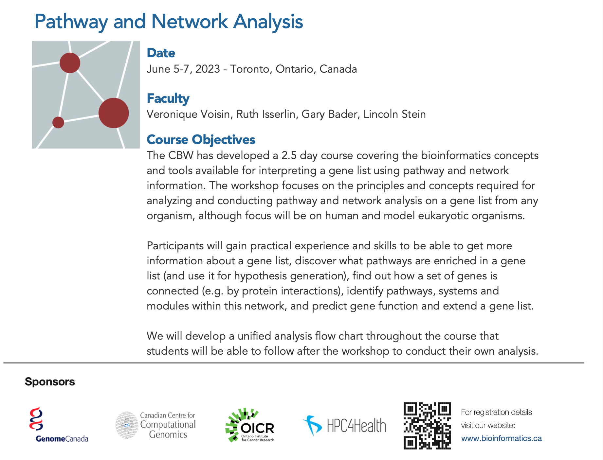

--- 
title: "Pathway and Network Analysis of -Omics Data ( June 2023 )" 
author: "Gary Bader, Ruth Isserlin, Chaitra Sarathy, Veronique Voisin"
date: "last modified `r Sys.Date()`"
site: bookdown::bookdown_site
output: bookdown::gitbook
documentclass: book
bibliography: [book.bib, packages.bib]
biblio-style: apalike
link-citations: yes
github-repo: rstudio/bookdown-demo
favicon: images/favicon.ico
description: "Course covers the bioinformatics concepts and tools available for interpreting a gene list using pathway and network information. "
---
#



## Meet your Faculty

### Gary Bader
Principal Investigator, University of Toronto 


Dr. Bader develops biological network analysis and pathway information resources. He created the Biomolecular Interation Network Database ( [BIND](http://bind.ca) ) while working on his PhD and currently helps lead development of the free Cytoscape network visualization and analysis software [Cytoscape](http://cytoscape.org/). 

### Lincoln Stein
Head, Adaptive Oncology, OICR


Dr. Stein played an integral role in many large-scale data initiatives including the development of the first physical clone map of the human genome, and running the data coordinating centre and the data portal for the SNP Consortium and the HapMap Consortium. Dr. Stein has also led the creation and development of Wormbase, a community model organism database for C. elegans, and Reactome, which is now the largest open community database of biological reactions and pathways. At OICR, Dr. Stein has led several international cancer data sharing and research initiatives, including the creation and development of the data coordination centre for the International Cancer Genome Consortium and other related projects. He continues to collaborate with national and international partners to create and promote data sharing standards, protocols and implementations.


### Veronique Voisin
Research Associate, Donnelly Centre for Cellular and Biomolecular Research, University of Toronto 


Veronique is currently a bioinformatician applying pathway and networks analysis to high throughput genomics data for OICR cancer stem cell program. Previously, she worked on characterizing the gene signatures of different types of leukemias using a murine model

&nbsp;
&nbsp;

### Ruth Isserlin
Research data analyst, Donnelly Centre for Cellular and Bimolecular Research, University of Toronto


Bioinformatician and data analyst in the Bader lab applying pathway and data analysis to varied data types. Developed Enrichment Map App for Cytoscape, an app to visually translate functional enrichment results from popular enrichment tools like GSEA to networks. Further developed the Enrichment Map Pipeline including development of additional Apps to help summarize and analyze resulting Enrichment Maps, including PostAnalysis, WordCloud, and AutoAnnotate App. 

### Chaitra Sarathy, PhD
Scientific Associate, Princess Margaret Cancer Centre, University Health Network


Chaitra is a computational biologist with experience in software development. During her PhD, she applied mathematical modelling, network analysis and multi-omics integration to study complex diseases. She has contributed to open-source toolboxes (openCOBRA) and developed softwares (EFMviz & ComMet) to analyse genome-scale metabolic models. She currently works in the Bader lab's MODiL team (Multi Omics Data Integration and Analysis) and with groups at PMCC, where she develops pipelines to analyse various omics data types and discover new drug targets in cancer.


### Michelle Brazas, PhD
Acting Scientific Director Canadian Bioinformatics Workshops (CBW), Toronto, ON, CA
support@bioinformatics.ca


Dr. Michelle Brazas is the Associate Director for Adaptive Oncology at the Ontario Institute for Cancer Research (OICR), and acting Scientific Director at Bioinformatics.ca. Previously, Dr. Brazas was the Program Manager for Bioinformatics.ca and a faculty member in Biotechnology at BCIT. Michelle co-founded and runs the Toronto Bioinformatics User Group (TorBUG) now in its 11th season, and plays an active role in the International Society of Computational Biology where she sits on the Board of Directors and Executive Board. 


***

Thank you for attending the Pathway and Network Analysis of Omics Data workshop! Help us make this workshop better by filling out [our survey](https://forms.gle/D8w8qyJ1r71rFnZe9).

*** 

```{r include=FALSE}
# automatically create a bib database for R packages
knitr::write_bib(c(
  .packages(), 'bookdown', 'knitr', 'rmarkdown'
), 'packages.bib')
```

**This work is licensed under a [Creative Commons Attribution-ShareAlike 3.0 Unported License](http://creativecommons.org/licenses/by-sa/3.0/deed.en_US). This means that you are able to copy, share and modify the work, as long as the result is distributed under the same license.**

Icons are from the [“Very Basic. Android L Lollipop” set by Ivan Boyko](https://www.iconfinder.com/iconsets/very-basic-android-l-lollipop) licensed under [CC BY 3.0](https://creativecommons.org/licenses/by/3.0/) and [Icons8](icons8.com). 
